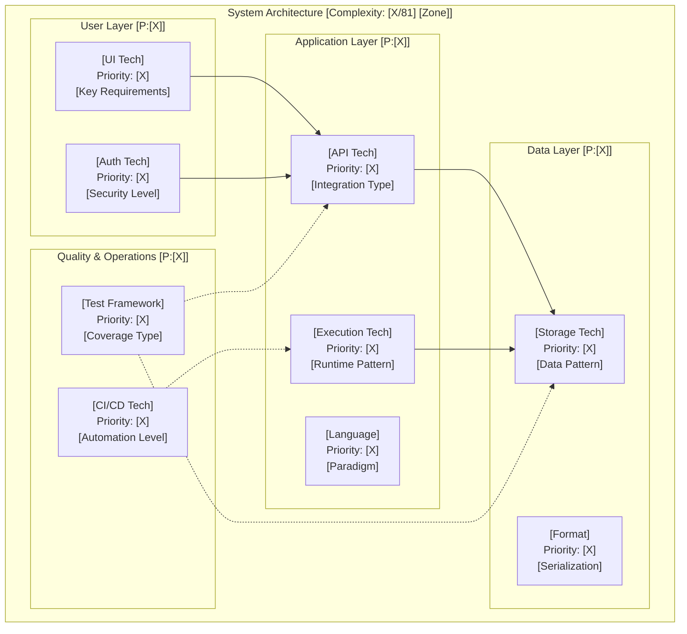

# Technology Research and Architecture Generation

**Template**: recommend-tech
**Context**: Requirements and use cases from prior phases
**Purpose**: Transform requirements into optimal technology architecture through progressive 8-phase research
**Methodology**: Phased-prompt.md compliant with 9-activity structure wrapping 8-phase research framework
**Isolation**: Universal worktree isolation pattern (accepts parent_worktree, creates nested worktree, merges back)

## Core Directive

**Parameters**:
- `$1` (`parent_worktree`): Parent worktree/branch to fork from (defaults to `$(pwd)` if not provided)
- `$2` (`user_worktree_name`): Optional semantic worktree name prefix
- `$3` (`prompt-arguments`): Requirements/use cases from prior phases or file paths

**Execution Pattern**:
1. Accept parent worktree as "branch" to fork from
2. Create nested isolated worktree via `create-worktree` agent
3. Execute comprehensive technology research in isolation
4. Write complete architecture to `<worktree>/planning/architecture-delta.md`
5. Merge back to parent worktree via `merge-worktree` agent
6. Return concise summary to caller

---

## GLOBAL START

**Execute ONCE at the beginning of any prompt using this framework**

### Framework Initialization

```markdown
WHEN starting ANY prompt using this framework:

1. ACCEPT INCOMING PARAMETERS (Universal Worktree Isolation Pattern):
   <parent_worktree> = ${1:-$(pwd)}     # Parent worktree/branch to fork from
   <user_worktree_name> = ${2:-}        # Optional semantic worktree name
   <prompt-arguments> = ${3:-}          # Requirements/use cases from prior phases

2. SET GLOBAL VARIABLES (once only):
   <original_pwd> = $(pwd)              # Capture starting location - NEVER CHANGE
   <worktree> = ""                      # Will be set to nested worktree
   <worktree_created> = false           # Track if we created a worktree
   <worktree_branch> = ""               # Track worktree branch name
   <worktree_name> = ""                 # Track worktree identifier

3. UNIVERSAL WORKTREE ISOLATION (Execute ALWAYS for isolation):
   # Universal pattern: ALL agents create isolated worktree for clean execution
   echo "🧠 THINKING: Creating isolated worktree for technology research"
   echo "🧠 THINKING: Parent worktree (branch): <parent_worktree>"

   # Verify git repository exists in parent worktree
   if ! git -C "<parent_worktree>" rev-parse --git-dir >/dev/null 2>&1; then
     echo "📝 Initializing git repository in parent worktree"
     git -C "<parent_worktree>" init
     git -C "<parent_worktree>" add -A
     git -C "<parent_worktree>" commit -m "Initial commit for technology research"
   fi

   # Use create-worktree agent for robust worktree creation with auto-initialization
   # Agent handles: collision-resistant naming, branch creation, uncommitted changes
   # Pass user_worktree_name if provided, otherwise use default "recommend-tech"
   worktree_prefix="${user_worktree_name:-recommend-tech}"
   echo "🔧 Calling create-worktree agent with prefix: ${worktree_prefix}"
   ask create-worktree "<parent_worktree>" "${worktree_prefix}" "recommend-tech"

   # Extract agent return values from XML tags
   extracted_worktree=$(echo "$LAST_AGENT_OUTPUT" | grep -oP '<worktree>\K[^<]+')
   extracted_branch=$(echo "$LAST_AGENT_OUTPUT" | grep -oP '<branch>\K[^<]+')
   extracted_source=$(echo "$LAST_AGENT_OUTPUT" | grep -oP '<source>\K[^<]+')

   # Validate agent returned valid worktree path
   if [ -z "$extracted_worktree" ] || [ ! -d "$extracted_worktree" ]; then
     echo "❌ FAILED: create-worktree agent did not return valid worktree path"
     echo "Agent output:"
     echo "$LAST_AGENT_OUTPUT"
     exit 1
   fi

   # ⚠️ CRITICAL: Reassign framework <worktree> variable to agent's returned path
   # ALL subsequent technology research operations will use this path
   <worktree> = ${extracted_worktree}
   <worktree_created> = true
   <worktree_branch> = ${extracted_branch}
   <worktree_name> = $(basename "${extracted_worktree}")

   echo "✅ Nested worktree ready for isolated execution"
   echo "⚠️  ALL file operations must use <worktree> as the base path"

4. CREATE DIRECTORY STRUCTURE:
   mkdir -p "<worktree>/planning"        # Phase documentation
   mkdir -p "<worktree>/docs"            # Final deliverables
   mkdir -p "<worktree>/requirements"    # Requirements if provided
   mkdir -p "<worktree>/use-cases"       # Use cases if provided

5. ESTABLISH PATH DISCIPLINE:
   - NEVER use cd, pushd, popd, or directory changing commands
   - ALWAYS use absolute paths: <worktree>/planning/phase-N.md
   - ALWAYS use git -C "<worktree>" for ALL git operations

6. LOAD INPUTS:
   Parse <prompt-arguments> to identify requirements/use case structure:
   - Requirements specifications and NFRs
   - Use case patterns and workflows
   - Constraints and architectural preferences
   - Expected deliverables (complete architecture specification)
   - Success criteria (95%+ confidence threshold)
```

Framework is now initialized and ready for phased execution.

---

# PHASE 1: Technology Research and Architecture Generation

## Phase Purpose & Dependencies

**PHASE_PURPOSE**: Transform requirements and use cases into optimal technology architecture through progressive 8-phase research methodology with priority-based complexity scoring and architectural minimalism principles.

**PHASE_TYPE**: Discovery and Research Phase

**PHASE_OUTPUTS**:
- `<worktree>/planning/architecture.md` - Complete technology architecture specification
- Progressive research journal with 8-phase documentation
- Technology decision cards with evidence-based scoring
- Visual architecture diagrams with integration patterns

**DEPENDENCIES**:
- **INPUTS_REQUIRED**: Requirements specification OR Use cases OR Product vision
- **PRIOR_PHASES**: Ideally Phase 5-6 of IDEAL-STI (Requirements/Use Cases complete)
- **DOWNSTREAM_CONSUMERS**: Feature development, implementation planning, deployment

## Phase Activities

### 1. Rehydration & Intelligence Loading

**Load Accumulated Wisdom and Establish Baseline Parameters**

**Context Restoration:**
- Load worktree context from `<worktree>/.context/` if exists
- Read prior architecture decisions from `<worktree>/planning/architecture.md` if exists
- Load requirements from `<worktree>/requirements/` directory
- Load use cases from `<worktree>/use-cases/` directory

**Baseline Knowledge Activation:**
- Priority-based complexity scoring framework (0-9 across 9 categories)
- Architectural minimalism principles (start at Priority 0-1)
- Technology decision card format
- 8-phase progressive research methodology

**Prior Architecture Intelligence:**
```yaml
IF prior_architecture_exists:
  LOAD:
    - previous_technology_stack
    - prior_complexity_scores
    - architecture_evolution_triggers
    - technology_change_reasons
  PREPARE:
    - migration_strategy_requirements
    - backward_compatibility_needs
    - delta_analysis_framework
ELSE:
  PREPARE:
    - greenfield_decision_framework
    - zero_legacy_optimization_approach
```

**Memory Fragments Integration:**
- Check for project-specific technology preferences
- Load organizational technology standards
- Integrate team skill inventory if available

**Activity Output**: Context loaded, baseline intelligence activated, prior architecture analyzed (if exists)

---

### 1.5. Baseline Discovery & Delta Context

Load baseline artifacts and requirements delta for change detection:

**BASELINE DISCOVERY**:
1. Discover baseline architecture from `<parent_worktree>/planning/architecture.md`
2. Load requirements delta from `<parent_worktree>/planning/requirements-delta.md`
3. Set delta_mode: FIRST_ITERATION (if baseline empty/missing) or CHANGE_DETECTION (if baseline populated)
4. Store: <GLOBAL_BASELINE_STATE>, <GLOBAL_DELTA_MODE>, <GLOBAL_BASELINE_ARCHITECTURE>, <GLOBAL_REQUIREMENTS_DELTA>

---

### 2. Input Extraction & Validation

**Extract Inputs from Parameters and Validate Completeness**

**Parameter Extraction:**
```yaml
EXTRACT from <prompt-arguments>:
  - requirements_path: "<worktree>/requirements/"
  - use_cases_path: "<worktree>/use-cases/"
  - constraints_path: "<worktree>/constraints.md"
  - existing_architecture: "<worktree>/planning/architecture.md"
  - research_depth: [standard | deep | rapid]
  - focus_areas: [all | specific categories]
```

**Input Validation Strategy:**

**Priority 1: Requirements Discovery**
```yaml
CHECK requirements sources in order:
  1. "<worktree>/requirements/requirements.md"
  2. "<worktree>/requirements/*.md" (any markdown files)
  3. User provided requirements in prompt
  4. Derive from use cases if available

IF no_requirements_found:
  ESCALATE: "Cannot proceed - need requirements or use cases"
```

**Priority 2: Use Case Discovery**
```yaml
CHECK use case sources in order:
  1. "<worktree>/use-cases/use-cases.md"
  2. "<worktree>/use-cases/*.md" (any markdown files)
  3. User provided use cases in prompt
  4. Derive basic use cases from requirements

IF no_use_cases_and_no_requirements:
  ESCALATE: "Need either requirements OR use cases to begin research"
```

**Priority 3: Constraint Discovery**
```yaml
CHECK constraint sources:
  1. "<worktree>/constraints.md"
  2. Requirements NFRs section
  3. Prompt-provided constraints

DEFAULT_CONSTRAINTS:
  - priority_range: 0-2 (architectural minimalism)
  - deployment_target: flexible
  - team_skills: general web development
```

**Completeness Validation:**
- [ ] At least one input source available (requirements OR use cases)
- [ ] Constraints understood (explicit or defaulted)
- [ ] Prior architecture status determined
- [ ] Output destination confirmed: `<worktree>/planning/`

**Activity Output**: Validated inputs extracted, gaps identified, ready for criteria definition

---

### 3. Criteria Definition (Runtime Intelligence)

**Generate Runtime Criteria Based on Input Analysis**

**Dynamic Criteria Generation Strategy:**

**Complexity Classification Criteria:**
```yaml
ANALYZE requirements/use cases to determine:

  scale_indicators:
    single_user: Priority 0-1 baseline
    multi_user: Priority 2-3 minimum
    enterprise: Priority 4+ consideration

  real_time_features:
    none: Priority 0-1
    basic_updates: Priority 2-3
    live_collaboration: Priority 4+

  data_complexity:
    simple_files: Priority 0-1
    structured_data: Priority 2-3
    complex_relationships: Priority 4+

  integration_needs:
    standalone: Priority 0-1
    api_consumer: Priority 2-3
    multiple_systems: Priority 4+
```

**Research Depth Criteria:**
```yaml
DETERMINE research depth based on:

  project_criticality:
    personal_tool: standard research (3-5 sources/tech)
    team_product: deep research (5-10 sources/tech)
    production_system: comprehensive research (10+ sources/tech)

  timeline_pressure:
    rapid: 2-3 sources minimum, focus on proven tech
    standard: 5+ sources, balanced evaluation
    thorough: 10+ sources, extensive comparison
```

**Technology Category Priority Criteria:**
```yaml
DEFINE priority thresholds per category:

  Category 1 - Execution Environment:
    PRIORITY_ESCALATION_TRIGGERS:
      - Serverless needed: Priority 3+
      - Container orchestration: Priority 4+
      - Multi-cloud: Priority 5+

  Category 2 - Storage System:
    PRIORITY_ESCALATION_TRIGGERS:
      - Relational needs: Priority 2+
      - High availability: Priority 4+
      - Global distribution: Priority 5+

  [... similar for all 9 categories ...]
```

**Architectural Minimalism Guard Rails:**
```yaml
DEFAULT_APPROACH: "Start at Priority 0-1 for ALL categories"

ESCALATION_RULES:
  - NEVER escalate without specific requirement justification
  - Document every priority increase with evidence
  - Challenge any jump of 3+ priority levels
  - Default to simpler solution when uncertain

COMPLEXITY_BUDGET:
  - Total complexity score SHOULD be ≤ 18 (avg 2 per category)
  - Score 18-36 requires strong justification
  - Score 36+ requires exceptional circumstances
```

**Success Criteria Definition:**
```yaml
DEFINE success metrics for this research:
  - requirements_coverage: 100% of functional requirements
  - nfr_satisfaction: 100% of critical NFRs, 80%+ of nice-to-have
  - complexity_alignment: 0.7-1.5 ratio (not over/under-engineered)
  - confidence_target: 95%+ final confidence
  - decision_traceability: Every tech choice → specific requirement
```

**Activity Output**: Runtime criteria defined, priority escalation triggers set, success metrics established

---

### 4. Research & Discovery

**Execute Progressive 8-Phase Technology Research**

This activity contains the complete 8-phase progressive research framework. Each sub-phase builds upon the previous, increasing confidence and specificity.

**Research Journal Format**: Document findings continuously in progressive journal style with live updates.

---

#### Sub-Phase 1: Context & Requirements Analysis

**Priority Focus**: Understand the problem space and establish complexity baseline
**Purpose**: Analyze requirements and use cases to determine appropriate technology complexity level
**Target Confidence**: 30-40%

##### Use Case Analysis & Complexity Driver Identification

**Read and Analyze All Use Cases:**
- Extract user stories and interaction patterns
- Identify technical implications
- Map use cases to technical capabilities needed

**Complexity Drivers Assessment:**

1. **Scale Assessment**
   - Single user or multi-user?
   - Expected concurrent users (1, 10, 100, 1000+?)
   - Data volume expectations (KB, MB, GB, TB?)

2. **Performance Requirements**
   - Response time expectations (<100ms, <1s, <5s)
   - Throughput needs (requests/second)
   - Real-time requirements (WebSocket, polling, async)

3. **Data Complexity**
   - Simple key-value or complex relationships?
   - Transactional requirements?
   - Data consistency needs (eventual vs strong consistency)

4. **Integration Requirements**
   - Standalone system or integrated with external services?
   - Number of external systems to integrate
   - Authentication/authorization complexity

5. **Deployment Complexity**
   - Target environment (local, cloud, on-premise, hybrid)
   - Availability requirements (99%, 99.9%, 99.99%)
   - Geographic distribution needs

**Initial Complexity Scoring:**

Calculate preliminary priority scores (0-9) for each technology category:

```yaml
Category_Priority_Calculation:
  Start: 0 (architectural minimalism - nothing until proven needed)

  Escalate_to_1: If basic capability needed
  Escalate_to_2: If production-grade reliability needed
  Escalate_to_3: If moderate scale/complexity (multi-user, API integrations)
  Escalate_to_4: If significant complexity (real-time features, complex data)
  Escalate_to_5: If high availability or advanced features required
  Escalate_to_6+: Only if enterprise-grade requirements explicitly stated
```

**Output**: Complexity drivers documented, preliminary priority scores assigned per category

---

#### Sub-Phase 2: Technical Constraints & Priority Assessment

**Priority Focus**: Identify all constraints and finalize technology priority levels
**Purpose**: Lock in priority requirements for each of the 9 technology categories
**Target Confidence**: 50-60%

##### Hard Constraints Identification

**Platform Constraints:**
- Deployment platform limitations (AWS, GCP, Azure, on-premise)
- Runtime environment restrictions
- License/cost constraints
- Regulatory/compliance requirements

**Resource Constraints:**
- Budget limitations
- Timeline pressures
- Team skill levels
- Infrastructure availability

**Integration Constraints:**
- Required integrations with existing systems
- API compatibility requirements
- Data format requirements
- Security/authentication standards

##### Priority-Based Technology Stack Framework

**The 9 Technology Categories with Priority Levels (0-9):**

**Category 1: Execution Environment & Nested Frameworks**
- Priority 0: No runtime needed (static files)
- Priority 1: Basic runtime (Node.js, Python, single script)
- Priority 2: Web server framework (Express, Flask, basic)
- Priority 3: Production web framework (Fastify, Django)
- Priority 4: Microservices framework (NestJS, Spring Boot)
- Priority 5: Service mesh integration
- Priority 6: Serverless orchestration (AWS Lambda + Step Functions)
- Priority 7: Container orchestration (Kubernetes)
- Priority 8: Multi-cloud orchestration
- Priority 9: Custom distributed runtime

**Category 2: Storage System**
- Priority 0: No persistence (in-memory only)
- Priority 1: File system (JSON files, text files)
- Priority 2: Embedded database (SQLite, LevelDB)
- Priority 3: Standalone database (PostgreSQL, MongoDB)
- Priority 4: Managed database service (RDS, Atlas)
- Priority 5: Database cluster (replica sets)
- Priority 6: Distributed database (Cassandra, DynamoDB)
- Priority 7: Multi-region replication
- Priority 8: Global consistency guarantees
- Priority 9: Custom storage engine

**Category 3: Storage Format**
- Priority 0: No structured format (raw text)
- Priority 1: Simple formats (JSON, CSV)
- Priority 2: Schema validation (JSON Schema)
- Priority 3: Relational schema (SQL DDL)
- Priority 4: Migration framework (Prisma, Alembic)
- Priority 5: Schema versioning system
- Priority 6: Multi-schema support
- Priority 7: Schema evolution automation
- Priority 8: Cross-database schema sync
- Priority 9: Custom schema language

**Category 4: User Interface Framework**
- Priority 0: No UI (CLI or backend only)
- Priority 1: Basic HTML (no framework)
- Priority 2: Template engine (EJS, Jinja)
- Priority 3: Modern SPA framework (React, Vue, Svelte)
- Priority 4: Full-stack framework (Next.js, SvelteKit)
- Priority 5: Component library integration (Material-UI, shadcn)
- Priority 6: Design system framework
- Priority 7: Micro-frontends architecture
- Priority 8: Cross-platform framework (React Native, Electron)
- Priority 9: Custom rendering engine

**Category 5: Authentication & Authorization**
- Priority 0: No auth (public access)
- Priority 1: Basic auth (hardcoded credentials)
- Priority 2: Session-based auth
- Priority 3: JWT tokens
- Priority 4: OAuth2/OpenID Connect
- Priority 5: SSO integration
- Priority 6: Multi-factor authentication
- Priority 7: Fine-grained RBAC
- Priority 8: Attribute-based access control (ABAC)
- Priority 9: Custom auth provider

**Category 6: API Service & Format**
- Priority 0: No API (monolith only)
- Priority 1: Simple functions
- Priority 2: REST API (basic endpoints)
- Priority 3: REST API (versioned, documented)
- Priority 4: GraphQL API
- Priority 5: API gateway integration
- Priority 6: gRPC services
- Priority 7: Event-driven architecture
- Priority 8: API federation
- Priority 9: Custom protocol

**Category 7: Quality & Testing Frameworks**
- Priority 0: No tests
- Priority 1: Manual testing only
- Priority 2: Basic unit tests (Jest, pytest)
- Priority 3: Integration tests
- Priority 4: E2E tests (Playwright, Cypress)
- Priority 5: Test automation CI/CD
- Priority 6: Contract testing
- Priority 7: Chaos engineering
- Priority 8: Production monitoring & alerting
- Priority 9: Custom testing framework

**Category 8: Programming Languages & Toolchains**
- Priority 0: No compilation (scripting only)
- Priority 1: Simple scripting (bash, basic Python)
- Priority 2: Modern scripting (TypeScript, Python 3.10+)
- Priority 3: Compiled language (Go, Rust, Java)
- Priority 4: Multi-language integration
- Priority 5: Language-specific optimizations
- Priority 6: Custom compilation pipeline
- Priority 7: Polyglot architecture
- Priority 8: Language interop (FFI, WASM)
- Priority 9: Custom language/DSL

**Category 9: CI/CD & Deployment Automation**
- Priority 0: Manual deployment
- Priority 1: Basic scripts (deploy.sh)
- Priority 2: GitHub Actions (basic workflow)
- Priority 3: Full CI/CD pipeline (test + deploy)
- Priority 4: Multi-environment (staging, production)
- Priority 5: Blue-green deployments
- Priority 6: Canary releases
- Priority 7: GitOps workflow
- Priority 8: Multi-region orchestration
- Priority 9: Custom deployment system

##### Total Complexity Score Calculation

```
Total_Complexity_Score = Sum of all 9 category priorities (0-81 possible)

Complexity Zones:
  0-9:   🟢 Minimal (Green Zone) - Simple/personal projects
  10-18: 🟡 Low (Yellow Zone) - Small team products
  19-27: 🟠 Moderate (Orange Zone) - Production applications
  28-36: 🔴 Significant (Red Zone) - Enterprise applications
  37-45: 🟣 High (Purple Zone) - Complex distributed systems
  46+:   ⚫ Extreme (Black Zone) - Requires strong justification
```

**Priority Lock-In Decision:**
Document final priority level for each category with justification from requirements.

**Output**: All 9 categories assigned priority levels with requirement traceability, total complexity score calculated

---

#### Sub-Phase 3: Technology Discovery & Stack Research

**Priority Focus**: Identify technology candidates for each category based on priority levels
**Purpose**: Research and shortlist technology options at appropriate priority levels
**Target Confidence**: 60-70%

##### Research Strategy by Priority Level

**Priority 0-1: Minimalist Solutions**
- Zero or minimal dependencies
- Single-file solutions preferred
- Clear, minimal API surface

**Priority 2-3 Repositories**: Balance features and complexity
- Mature ecosystems with good documentation
- Active maintenance but stable APIs
- Reasonable dependency trees (<20 total deps)

**Priority 4+ Repositories**: Allow complex ecosystems
- Feature-rich frameworks and platforms
- Complex dependency graphs acceptable if justified
- Enterprise-grade solutions

##### Technology Decision Cards

Generate decision cards for each category:

```yaml
technology: [Name]
category: [Execution/Storage/UI/etc]
priority_level: [0-9]
confidence: [X%]

# Progressive Knowledge Section
prior_decision: [Previous tech if exists]
change_reason: [Why changing, or "Maintaining"]

alternatives_considered: [List]
selection_rationale: [Why this over alternatives]
trade_offs:
  pros: [Benefits]
  cons: [Drawbacks]

# Use Case Alignment
supports_use_cases: [UC001, UC002, etc]
conflicts_with: [Any use case conflicts]

migration_path: [From prior tech if changing]
```

**Output**: Technology candidates identified for each category at appropriate priority levels

---

#### Sub-Phase 4: Deep Analysis & Comparative Evaluation

**Priority Focus**: Deep evaluation of top technology candidates across all categories
**Purpose**: Conduct detailed analysis of shortlisted technologies and create comparison matrices
**Target Confidence**: 80-90%

##### Multi-Source Validation & Research

**Advanced Research Sources:**
- **Reddit Communities**: r/programming, r/webdev, technology-specific subreddits
- **Production Case Studies**: Real-world usage examples, scaling stories
- **Technical Blogs**: Engineering teams' experiences, performance reports
- **Community Forums**: Stack Overflow, Discord/Slack communities
- **Conference Talks**: Recent presentations, architecture discussions

##### Comparative Analysis Framework

**Head-to-Head Technology Comparison:**
For top 2-3 candidates in each priority category:

1. **Performance Benchmarking**
2. **Developer Experience Evaluation**
3. **Operational Characteristics**
4. **Ecosystem Integration Analysis**

##### Use Case Complexity Validation

Compare use case complexity drivers with technology stack complexity:
- Calculate complexity alignment ratio
- Ensure alignment between 0.7-1.5 (not over/under-engineered)
- Document adjustments needed

**Output**: Detailed technology comparison matrices with performance data and recommendations

---

#### Sub-Phase 5: Architecture Design & Integration Planning

**Priority Focus**: Design integrated architecture using selected technologies
**Purpose**: Create coherent system design with validated technology stack
**Target Confidence**: 85-95%

##### Technology Stack Integration Design

**Cross-Category Integration Analysis:**
- Create integration compatibility matrix
- Select architecture patterns based on priority levels
- Design data flow and deployment architecture
- Plan security boundaries and controls

##### Integration Risk Assessment

**Technology Compatibility Risks:**
- Version compatibility across the stack
- Breaking change management
- Dependency conflict resolution
- Platform-specific limitations

**Output**: Complete architecture design with integration specifications

---

#### Sub-Phase 6: Quality Validation & Risk Assessment

**Priority Focus**: Validate architecture against requirements and assess implementation risks
**Purpose**: Ensure proposed architecture meets all functional and non-functional requirements
**Target Confidence**: 90-95%

##### Requirements Validation Matrix

Map each requirement to architecture components:
- Validate capability coverage completeness
- Confirm non-functional requirements support
- Challenge any over/under-engineering
- Ensure migration paths remain feasible

##### Risk Analysis & Mitigation

**Technical Risks:**
- Technology adoption risks
- Integration complexity risks
- Performance bottleneck risks
- Security vulnerability risks

**Business Risks:**
- Timeline impact
- Cost implications
- Team skill gaps
- Vendor lock-in

**Output**: Risk-validated architecture with mitigation strategies

---

#### Sub-Phase 7: Implementation Planning & Migration Strategy

**Priority Focus**: Create detailed implementation roadmap with priority-based sequencing
**Purpose**: Plan implementation approach that respects priority constraints and dependencies
**Target Confidence**: 95-98%

##### Priority-Based Implementation Sequencing

**Implementation Wave Planning:**

**Wave 1: Priority 0-2 Foundation** (Days 1-5)
- Core infrastructure setup
- Basic functionality implementation
- Essential integrations

**Wave 2: Priority 3-5 Enhancement** (Days 6-15)
- Advanced feature implementation
- Performance optimization
- Extended integrations

**Wave 3: Priority 6+ Advanced Features** (Weeks 3-6)
- Complex feature implementation
- Advanced integrations
- Full-scale production deployment

##### Implementation Planning with Architecture Evolution

IF prior_architecture_exists THEN:
  Generate migration decision framework:
  - Component changes and reasons
  - Data migration requirements
  - Rollback procedures
  - Effort estimates
ELSE:
  Create greenfield setup checklist:
  - Repository initialization
  - Directory structure
  - Dependency installation
  - Progressive implementation

**Output**: Complete implementation roadmap with timeline and resource requirements

---

#### Sub-Phase 8: Final Specification & Documentation

**Priority Focus**: Complete architecture specification with all technology decisions documented
**Purpose**: Create concise, actionable technology recommendation with visual architecture
**Target Confidence**: 98-100%

##### Write Concise Architecture.md

Write the complete architecture specification to `<worktree>/planning/architecture-delta.md` using this concise format:

```markdown
# Architecture Decision Record

> **📌 Reading Guide**: The "Architecture Decision" section contains all technology choices.
> Remaining sections provide detailed reasoning and implementation guidance.

**Status**: ✅ Approved | **Complexity**: [X/81] ([Zone Color] Zone) | **Confidence**: [X%]

---

## 🏗️ ARCHITECTURE DECISION
*This section contains the complete architecture. Read this to understand what we're building.*

### Technology Stack
| Category | Technology | Priority |
|----------|------------|----------|
| Execution Environment | [Selected Tech] | [X] |
| Storage System | [Selected Tech] | [X] |
| Storage Format | [Selected Tech] | [X] |
| User Interface | [Selected Tech] | [X] |
| Authentication | [Selected Tech] | [X] |
| API Service & Format | [Selected Tech] | [X] |
| Testing Framework | [Selected Tech] | [X] |
| Programming Language | [Selected Tech] | [X] |
| CI/CD & Deployment | [Selected Tech] | [X] |

**Total Complexity**: [Sum]/81 - [Zone] Zone

### Architecture Pattern
- **Type**: [Architecture pattern - e.g., "Real-time collaborative web application"]
- **Stack Summary**: [One-line summary - e.g., "React + Node.js + PostgreSQL + WebSocket"]
- **Deployment Target**: [Where it runs - e.g., "AWS ECS with CloudFront CDN"]

### System Architecture Diagram


### Integration Code Patterns
```yaml
API_to_Database:
  pattern: "[Database ORM/connection pattern]"
  example: "[Technology].connect() → [Query pattern]"
  error_handling: "[Connection failure/retry strategy]"

Frontend_to_API:
  pattern: "[HTTP client + WebSocket pattern]"
  example: "[HTTP library].request() + [WebSocket library].connect()"
  auth_pattern: "[Authentication header/token pattern]"

Authentication_Flow:
  pattern: "[Auth mechanism - JWT/OAuth/API key]"
  login_flow: "[Login process steps]"
  token_management: "[Token storage/refresh pattern]"

Inter_Service_Communication:
  pattern: "[Service-to-service communication method]"
  data_format: "[JSON/Protocol Buffer/etc.]"
  reliability: "[Retry/circuit breaker patterns]"
```

### Technology Configuration
```yaml
[Primary Database Technology]:
  connection: "[Connection string pattern]"
  pool_config: "[Connection pool settings]"
  migration_tool: "[Schema migration approach]"

[Runtime Environment]:
  version: "[Specific version requirement]"
  dependencies: "[Key dependency management]"
  environment_config: "[Environment variable patterns]"

[Frontend Technology]:
  build_tool: "[Build system configuration]"
  state_management: "[State management pattern]"
  routing: "[Routing configuration]"

[API Technology]:
  middleware: "[Authentication/CORS/logging middleware]"
  validation: "[Input validation approach]"
  serialization: "[Response format standards]"
```

---

## 📋 RATIONALE & REASONING
*The following sections explain WHY these technologies were chosen. For reference only.*

### Executive Summary
- **Key Decision**: [Most critical technology choice and brief reasoning]
- **Main Risk**: [Primary risk identified and mitigation approach]

### Requirements → Technology Mapping

#### Critical Requirements
- **[REQ-ID]**: [Requirement] → **[Technology]** - [One-line reasoning]
- **[UC-ID]**: [Use case] → **[Technology Pattern]** - [Implementation approach]

#### Non-Functional Requirements
- **Performance**: [Target] → **[Technologies]** - [How achieved]
- **Scalability**: [Requirement] → **[Technologies]** - [Scaling approach]
- **Security**: [Requirements] → **[Technologies]** - [Security measures]

### Priority Escalation Rules
- **Default Priority Range**: 0-2 (Use unless specific requirements demand higher)
- **Escalate to Priority 3-5 when**:
  - Multi-user concurrent access required
  - Real-time features needed (WebSocket, streaming)
  - External system integrations required
  - Compliance/security standards mandate specific technologies
- **Escalate to Priority 6+ only when**:
  - High availability requirements (99.9%+ uptime)
  - Massive scale requirements (1M+ users)
  - Complex distributed system architecture needed
  - Enterprise-grade features absolutely required

### Technology Decision Details

#### Decision Records (Major Choices)
```yaml
Decision: [Primary Technology Choice]
Alternative: [What we considered instead]
Requirement: [Driving requirement/use case]
Reasoning:
  - Pro: [Key advantage 1]
  - Pro: [Key advantage 2]
  - Con: [Main limitation and mitigation]
Trade-offs: "[Benefit] vs [Cost]"
Confidence: [X%]
```

### Research Findings Summary

#### Phase 1-3: Discovery & Analysis
- **Scale Classification**: [Project type] → Priority baseline [X-Y]
- **Constraints Identified**: [Platform/Resource/Integration constraints]
- **Technology Candidates**: [X options evaluated per category]

#### Phase 4-6: Evaluation & Validation
- **Winner Selection**: [Technology] (Score: [X/100]) vs [Alternative] ([Y/100])
- **Performance Validation**: [Key metrics achieved]
- **Integration Testing**: [Compatibility confirmed/issues resolved]

#### Phase 7-8: Planning & Documentation
- **Implementation Dependencies**: [Foundation→Features→Enhancement layers]
- **Risk Mitigation**: [Primary risks] → [Specific mitigations]
- **Integration Patterns**: [How components connect and communicate]

---

## 🚀 IMPLEMENTATION GUIDANCE
*Practical guidance for building this architecture.*

### Implementation Dependencies & Order
- **Foundation Layer**: Priority 0-2 technologies (core infrastructure)
  - [Database setup, basic API endpoints, authentication framework]
- **Feature Layer**: Priority 3-5 technologies (business logic)
  - [Complex business features, integrations, advanced UI components]
- **Enhancement Layer**: Priority 6+ technologies (optimization)
  - [Performance optimizations, advanced features, monitoring]

### Error Handling Patterns
- **Database Errors**: [Retry strategy] - Connection timeouts, deadlocks, constraint violations
- **API Errors**: [Circuit breaker pattern] - External service failures, rate limiting
- **Authentication Errors**: [Token refresh strategy] - Expired tokens, invalid credentials
- **Validation Errors**: [Structured error responses] - Input validation, business rule violations
- **Network Errors**: [Exponential backoff] - Temporary connectivity issues, DNS failures
- **Resource Errors**: [Graceful degradation] - Memory limits, disk space, CPU constraints

### Testing Patterns by Layer
- **Unit Tests**: [Testing framework] for business logic
  - Mock external dependencies (database, APIs, file system)
  - Test pure functions and isolated components
  - Coverage target: Business logic and utility functions
- **Integration Tests**: [Testing framework] for API endpoints
  - Test with real database (test environment)
  - Validate request/response contracts
  - Test authentication and authorization flows
- **End-to-End Tests**: [E2E framework] for user workflows
  - Test complete user journeys
  - Validate UI interactions and data persistence
  - Test critical business scenarios

### Migration Strategy (if applicable)
- **From**: [Previous architecture stack]
- **Migration Approach**: [Technical migration steps]
- **Data Migration**: [Schema changes, data transformation requirements]
- **Compatibility Requirements**: [Backward compatibility needs during transition]

## Risk Assessment & Mitigation

| Risk Category | Specific Risk | Probability | Impact | Mitigation Strategy |
|---------------|---------------|-------------|--------|-------------------|
| Technical | [Technology risk] | [High/Med/Low] | [Impact level] | [Specific mitigation] |
| Integration | [Compatibility risk] | [High/Med/Low] | [Impact level] | [Specific approach] |
| Performance | [Scalability concern] | [High/Med/Low] | [Impact level] | [Performance strategy] |
| Operational | [Maintenance burden] | [High/Med/Low] | [Impact level] | [Operations plan] |

---

## 🔮 FUTURE CONSIDERATIONS
*Evolution and monitoring plans.*

### Architecture Evolution Path
- **Scaling considerations**: [When and how to scale each technology layer]
- **Technology upgrade paths**: [Migration strategies for technology updates]
- **Integration expansion**: [How to add new technologies or external systems]

### Architecture Evolution Triggers
- **Performance thresholds**: When to consider scaling or optimization
- **Feature complexity growth**: When to add higher-priority technologies
- **Integration requirements**: When external system changes require updates

---

*Generated by Progressive Technology Research Framework v4.0*
*Phases Executed: 8/8 | Research Sources: [X] | Confidence: [Y%]*
```

**Output**: Complete concise technology architecture specification written to <worktree>/planning/architecture.md

**Activity 4 Complete**: All 8 sub-phases executed, progressive research documented, architecture specification generated

---

### 5. Planning

**Create Comprehensive Execution Plan**

**NOT APPLICABLE** - The planning activity is inherently part of the research process:
- Sub-Phase 2 defines priority levels and constraints (planning what to research)
- Sub-Phase 3 plans technology discovery strategy
- Sub-Phase 5 plans architecture integration
- Sub-Phase 7 creates implementation roadmap

The entire 8-phase research framework IS the execution plan for technology selection.

**Rationale**: Technology research is inherently iterative and discovery-based. The phases themselves constitute the plan, with each phase building upon discoveries from the previous phase. A separate planning activity would be redundant and contradictory to the progressive research methodology.

**Activity Output**: N/A - Planning embedded within Activity 4 sub-phases

---

### 6. Review & Validation

**Pre-Execution Validation**

**Validation already occurred in Sub-Phase 6**: Quality Validation & Risk Assessment

**Additional Final Validation:**

**Completeness Check:**
- [ ] All 9 technology categories addressed
- [ ] Priority level assigned to each category (0-9)
- [ ] Total complexity score calculated
- [ ] Requirements traceability matrix complete
- [ ] Architecture diagram generated
- [ ] Implementation roadmap created
- [ ] Risk assessment documented

**Quality Gates:**
- [ ] No category has unjustified priority level jump (3+ levels without evidence)
- [ ] Total complexity score aligns with use case complexity (ratio 0.7-1.5)
- [ ] Every technology choice traces to specific requirement
- [ ] Final confidence level ≥ 95%
- [ ] Architecture.md file written to `<worktree>/planning/`

**Architectural Minimalism Validation:**
- [ ] Started at Priority 0-1 for all categories
- [ ] Every escalation has documented justification
- [ ] Default to simpler solutions when uncertain
- [ ] Complexity budget respected (total score justified)

**Delta Validation (if prior architecture exists):**
- [ ] Changes from prior architecture documented
- [ ] Migration strategy defined
- [ ] Backward compatibility addressed
- [ ] Change rationale provided for each delta

**Activity Output**: Architecture validated against requirements, quality gates passed, ready for handoff

---

### 7. Execution

**Execute the 8-Phase Research Framework**

**Execution Status**: ✅ COMPLETED in Activity 4: Research & Discovery

All 8 sub-phases executed systematically:
- ✅ Sub-Phase 1: Context & Requirements Analysis
- ✅ Sub-Phase 2: Technical Constraints & Priority Assessment
- ✅ Sub-Phase 3: Technology Discovery & Stack Research
- ✅ Sub-Phase 4: Deep Analysis & Comparative Evaluation
- ✅ Sub-Phase 5: Architecture Design & Integration Planning
- ✅ Sub-Phase 6: Quality Validation & Risk Assessment
- ✅ Sub-Phase 7: Implementation Planning & Migration Strategy
- ✅ Sub-Phase 8: Final Specification & Documentation

**Primary Deliverable**: `<worktree>/planning/architecture.md` containing complete technology architecture specification

**Activity Output**: Architecture specification file written, all research phases complete

---

### 8. Quality Iteration Loop

**Continuous Improvement Mechanism**

**Iteration Triggers:**

**During Research (Activity 4):**
```yaml
IF confidence_drops_below_threshold:
  - Conduct additional research in weak areas
  - Seek alternative technology options
  - Validate assumptions with additional sources

IF complexity_exceeds_justification:
  - Challenge priority escalations
  - Seek simpler alternatives
  - Re-evaluate requirements interpretation

IF integration_conflicts_detected:
  - Re-evaluate technology combinations
  - Research compatibility solutions
  - Adjust architecture design
```

**Post-Specification Iteration:**
```yaml
IF stakeholder_feedback_received:
  - Assess impact on technology choices
  - Re-run affected sub-phases if needed
  - Update architecture.md with changes

IF new_requirements_discovered:
  - Determine if priority levels need adjustment
  - Research additional technology needs
  - Regenerate affected sections

IF implementation_reveals_issues:
  - Document lessons learned
  - Update architecture decision record
  - Plan technology adjustments if needed
```

**Quality Metrics Monitoring:**
- Confidence level tracking across phases
- Requirements coverage percentage
- Complexity alignment ratio
- Stakeholder satisfaction

**Activity Output**: Continuous quality monitoring framework, iteration triggers defined

---

### 9. Documentation & Knowledge Capture

**Generate Final Deliverables**

**Primary Documentation:**

1. **Architecture Specification** (already generated in Activity 4, Sub-Phase 8):
   - `<worktree>/planning/architecture.md`
   - Complete technology decision record
   - Visual architecture diagrams
   - Implementation guidance
   - Risk assessment and mitigation

2. **Research Journal** (generated throughout Activity 4):
   - Progressive documentation of all 8 phases
   - Evidence trail for technology decisions
   - Alternative technologies considered
   - Comparative analysis results

**Knowledge Capture:**

**Technology Decision Context:**
```yaml
CAPTURE for future reference:
  - Why each technology was chosen
  - Alternatives considered and rejected
  - Priority escalation justifications
  - Risk assessment and mitigations
  - Implementation dependencies
  - Evolution triggers and thresholds
```

**Lessons Learned:**
```yaml
DOCUMENT:
  - Research methodology effectiveness
  - Sources that provided best insights
  - Technologies that surprised us
  - Decisions we'd reconsider
  - Process improvements for next time
```

**Handoff Package:**

For downstream consumers (feature developers, implementers):
1. ✅ Architecture.md - Complete specification
2. ✅ Technology stack with priorities
3. ✅ Integration patterns and code examples
4. ✅ Implementation roadmap with waves
5. ✅ Risk mitigation strategies
6. ✅ Testing approach by layer
7. ✅ Configuration templates
8. ✅ Evolution triggers

**Return Summary to User:**

```markdown
# 🏗️ Technology Architecture Research Complete

## Summary Dashboard
- **📋 File Written**: `<worktree>/planning/architecture.md` (Concise ADR format)
- **🎯 Complexity Score**: [X/81] ([Zone Color] Zone)
- **📊 Final Confidence**: [X%]
- **⚡ Phases Executed**: 8/8 (Complete)

## Architecture at a Glance
**Stack**: [Primary technologies in one line]
**Pattern**: [Architecture pattern type]
**Key Decision**: [Most critical choice made]

## Technology Stack (Priority-Optimized)
| Layer | Technology | Priority | Core Benefit |
|-------|------------|----------|--------------|
| 🎨 UI | [Tech] | [X] | [Key advantage] |
| 🔧 API | [Tech] | [X] | [Main strength] |
| 💾 Data | [Tech] | [X] | [Primary reason] |
| ⚡ Runtime | [Tech] | [X] | [Critical factor] |
| 🧪 Testing | [Tech] | [X] | [Quality approach] |

## Research Highlights
- **✅ Requirements Satisfied**: [X/X] use cases fully supported
- **⚖️ Trade-offs Made**: [Primary technology trade-off]
- **🎯 Sweet Spot Found**: [Complexity vs capability balance]
- **⚠️ Key Risk**: [Main risk identified] → [Mitigation approach]

## Ready for Feature Development
The complete architecture decision record includes:
- Technology stack decisions with priority levels
- Visual mermaid diagram showing all technology relationships
- Requirements → technology traceability matrix
- Structured decision records with technical reasoning
- Implementation dependencies and integration patterns
- Risk assessment with technical mitigation strategies

**Next Step**: Use `<worktree>/planning/architecture.md` as foundation for feature development decisions.
```

**Activity Output**: Complete documentation package, lessons learned captured, handoff complete

---

## Phase Completion Criteria

**Mandatory Deliverables:**
- ✅ `<worktree>/planning/architecture.md` written
- ✅ All 9 technology categories addressed
- ✅ Priority levels assigned (0-9) with justification
- ✅ Total complexity score calculated
- ✅ Visual architecture diagram generated
- ✅ Requirements traceability documented
- ✅ Implementation roadmap created
- ✅ Risk assessment completed

**Quality Standards:**
- ✅ Final confidence ≥ 95%
- ✅ Requirements coverage = 100%
- ✅ Complexity alignment ratio 0.7-1.5
- ✅ Every technology choice traces to requirement
- ✅ Architectural minimalism principles followed
- ✅ All 8 research phases executed

**Success Indicators:**
- Clear, actionable architecture specification
- Evidence-based technology decisions
- Appropriate complexity for use case
- Implementation roadmap ready
- Risks identified and mitigated

---

### 9. Delta Computation & Change Classification

Compute changes between baseline and target architecture:

**DELTA ANALYSIS**:
1. Retrieve baseline context from Phase 1.5
2. Parse generated architecture components
3. Classify changes (FIRST_ITERATION: all ADDED; CHANGE_DETECTION: compare using semantic similarity ≥80%)
4. Generate delta file at `<worktree>/planning/architecture-delta.md` with A/M/R/U classification
5. Store delta summary: <GLOBAL_DELTA_SUMMARY>, <GLOBAL_DELTA_CLASSIFICATION>

---

## GLOBAL END

**Execute AFTER all phases to ensure complete validation and cleanup**

### Architecture Validation

```markdown
1. LOAD ORIGINAL REQUIREMENTS:
   Review <prompt-arguments> requirements from Global Start
   Compare against generated architecture for requirements coverage

2. TECHNOLOGY-BASED VALIDATION:
   For each technology choice:
   - Trace back to specific requirement
   - Validate priority score (0-9) and category assignment
   - Confirm architectural minimalism adherence
   - Check complexity alignment ratio (0.7-1.5)

3. ARCHITECTURE COVERAGE ANALYSIS:
   Create final validation matrix:
   | Requirement | Technologies | Priority | Complexity | Justification |
   |-------------|-------------|----------|------------|---------------|
   | REQ-001 | Node.js, Express | 1 | Low | KISS principle |
   | REQ-002 | PostgreSQL | 2 | Medium | Data persistence |
```

### Global Quality Score Calculation

```markdown
ARCHITECTURE_QUALITY_SCORE = (
  (REQUIREMENTS_COVERAGE_COMPLETENESS * 0.30) +     # All requirements have technology choices
  (PRIORITY_SCORING_ACCURACY * 0.25) +              # Evidence-based priority assignment
  (ARCHITECTURAL_MINIMALISM * 0.20) +               # Complexity appropriateness
  (RESEARCH_DEPTH_ACHIEVEMENT * 0.15) +             # 8-phase execution completeness
  (IMPLEMENTATION_READINESS * 0.10)                 # Clear actionable roadmap
)

MINIMUM_ACCEPTABLE_SCORE = 9.5/10.0  # High bar for architecture decisions

Quality Assessment:
- 9.5-10.0: Excellent - Ready for implementation
- 9.0-9.4: Good - Minor refinements may help
- 8.0-8.9: Acceptable - Some gaps remain
- Below 8.0: Requires iteration
```

### WORKTREE CONSOLIDATION

```markdown
# Universal pattern: ALWAYS merge back to parent worktree (worktree isolation)
echo "🧠 THINKING: Technology research complete - merging back to parent worktree"
echo "🧠 THINKING: Parent worktree (branch): <parent_worktree>"

# CRITICAL SAFETY CHECK - never delete if we're inside it
<current_location> = $(pwd)

IF "<worktree>" != "<current_location>" THEN:
  echo "✅ Safe to consolidate - not inside nested worktree"

  # Gather technology research metrics
  tech_categories=$(grep -c "^### Category" "${worktree}/planning/architecture.md" 2>/dev/null || echo "0")
  total_complexity=$(grep "Total Complexity Score:" "${worktree}/planning/architecture.md" 2>/dev/null | awk '{print $NF}' || echo "unknown")
  quality_score="${ARCHITECTURE_QUALITY_SCORE:-unknown}"

  # Construct detailed commit message preserving architecture context
  commit_msg="merge(architecture): Consolidate technology research and architecture

Source: ${worktree_branch}
Categories addressed: ${tech_categories}
Total complexity: ${total_complexity}
Quality: ${quality_score}/10
Framework: Progressive 8-phase technology research

This merge includes comprehensive architecture specification ready for implementation."

  # Use merge-worktree agent for consolidation with auto-discovery
  # Agent handles: commit, squash merge, cleanup with git atomicity
  # Merges FROM nested worktree TO parent worktree (universal isolation pattern)
  echo "🔧 Calling merge-worktree agent to consolidate to parent"
  ask merge-worktree "<worktree>" "" "${commit_msg}" "recommend-tech"

  # Check merge status from agent JSON output
  merge_status=$(echo "$LAST_AGENT_OUTPUT" | grep -oP '"status"\s*:\s*"\K[^"]+')

  if [ "$merge_status" = "success" ]; then
    # merge-worktree agent already printed compact summary
    # Add research-specific context
    echo "RESEARCH: Architecture with ${tech_categories} categories ready for implementation"
    echo ""
  elif [ "$merge_status" = "conflict" ]; then
    echo "⚠️ MERGE CONFLICTS DETECTED"
    echo "⚠️ Worktree preserved for manual conflict resolution"
    echo ""
    echo "Technology research details:"
    echo "- Worktree: ${worktree_name}"
    echo "- Branch: ${worktree_branch}"
    echo "- Categories: ${tech_categories}"
    echo ""
    echo "To resolve conflicts and consolidate:"
    echo "1. Review conflicts in worktree"
    echo "2. Resolve conflicts in affected files"
    echo "3. After resolution, run: ask merge-worktree '<worktree>' '' '\${commit_msg}' 'recommend-tech'"
    exit 1
  else
    echo "❌ MERGE FAILED - unexpected status: ${merge_status}"
    echo "Agent output:"
    echo "$LAST_AGENT_OUTPUT"
    echo ""
    echo "To consolidate manually:"
    echo "1. cd '<parent_worktree>'"
    echo "2. git merge '${worktree_branch}' --squash"
    echo "3. git commit -m 'merge: Consolidate technology research'"
    echo "4. git worktree remove '<worktree>' --force"
    echo "5. git branch -D '${worktree_branch}'"
    exit 1
  fi
ELSE:
  echo "❌ SAFETY ERROR: Currently inside nested worktree - cannot merge"
  echo "Current location: ${current_location}"
  echo "Nested worktree: <worktree>"
  exit 1
FI
```

### Return Summary

Return concise summary to caller:

```markdown
# Technology Research Complete

## Summary
- **File Written**: <worktree>/planning/architecture.md
- **Technology Categories**: [count]
- **Total Complexity Score**: [X]
- **Quality Score**: [X%]
- **Priority Level**: [0-9 range]

## Technology Stack
- **Core Technologies**: [List priority 0-2]
- **Supporting Technologies**: [List priority 3-5]
- **Optional Technologies**: [List priority 6-9]

## Key Decisions
- [Major technology choice 1]
- [Major technology choice 2]
- [Architectural pattern selected]

## Next Phase Ready
The complete architecture specification with technology stack has been written to the planning directory, ready for task generation and feature development.
```

---

Execute systematically, research progressively, prioritize intelligently, document comprehensively.