# /craft - Iterative Quality-Driven Development

Transform a task description into a complete, tested implementation through iterative crafting with measurable quality criteria.

---

## Input Parameters

- **[task]** - Task description (required): What you want to build or accomplish
- **[--context]** - Optional context files or references to incorporate
- **[--constraints]** - Optional constraints (time, resources, dependencies)

---

## Quality Gate Philosophy: Two-Tier System

**craft.md uses a two-tier quality gate system balancing user control with execution efficiency:**

### Tier 1: Mandatory User Confirmation (Stages 1-3)

**Where**: Foundation stages defining WHAT to build
- Stage 1: Use Cases (user needs, system interactions)
- Stage 2: Requirements (quality attributes, constraints)
- Stage 3: Architecture (technical approach, integration)

**Why mandatory**: These define problem space and strategic direction. Errors cascade through all subsequent work. User domain knowledge is irreplaceable.

**Interaction**: 3-question confirmation recap required before proceeding.

### Tier 2: Automated Quality Gates (Stages 4-5, Phase 2-3)

**Where**: Execution stages refining HOW to build
- Stage 4: Assumptions (7-item checklist with % scoring)
- Stage 5: Effects & Boundaries (7-item checklist with % scoring)
- Phase 2-D: Task Breakdown (per-task acceptance criteria)
- Phase 3: Task Execution (tests + acceptance criteria)

**Why automated**: These validate/refine confirmed foundation. LLM self-assesses using objective checklists.

**Automation**: 3-tier scoring
- ≥90% (6-7 items ✅): Proceed automatically
- 70-89% (5 items ✅): Iterate to improve
- <70% (<5 items ✅): Escalate to user

### Tier 3: Pre-Implementation Gate (Phase 2→3)

**Where**: Planning → Implementation transition

**Why comprehensive**: Last checkpoint before code. Validates ALL prior work (Stages 1-6 + Phase 2).

**Structure**: 23-item checklist. Binary gate: ALL must pass, ANY failure blocks.

### When to Escalate Automated Gates

Automatic escalation even if score ≥90%:
- Conflicting requirements (Stage N contradicts confirmed Stage M)
- Multiple high-risk assumptions without mitigation
- Novel/untested technologies in architecture
- Scope expansion vs. Stage 5 boundaries
- Resource needs exceed constraints

**User override**: Request manual review anytime with "validate stage N"

---

## Global Start - Framework Initialization

### Claude-Specific Optimizations

**This framework leverages Claude's strengths:**

**XML Tags for Long Context**: Structure knowledge artifacts with XML tags for 200K token navigation:
- `<use_cases>`, `<requirements>`, `<architecture>`, `<assumptions>`, `<effects_boundaries>`, `<task_definition>`
- `<current_phase>`, `<confirmed_stages>`, `<gate_result>`, `<confidence_score>`

**Thinking Prompts**: Before major decisions, use structured thinking:
```xml
<thinking>
What have we learned? What assumptions am I making?
What might I be missing? How does this connect to prior knowledge?
</thinking>
```

**Long Context Advantage**: Claude's 200K context means:
- No summarization needed - all stage outputs remain accessible
- Continuous cross-validation across all 13 stages
- Holistic Pre-Implementation Gate analysis without compression
- No external memory systems required

**Explicit State Management**: Each stage declares input state, processing, output state, and transition logic for coherent reasoning chains.

---

**Capture the starting point:**
Store the current working directory as `original_location`. This is where we'll return after crafting is complete.

**Create isolated workspace:**
Ask the create-worktree subagent to establish a new git worktree for this crafting session.

Provide this natural language instruction:
"Create a worktree as [task-name-kebab-case] from [original_location] based on [current_branch_name]"

Where:
- **as [task-name-kebab-case]**: Task prefix derived from description (omit to use directory basename)
- **from [original_location]**: The captured original directory (omit to use PWD)
- **based on [current_branch_name]**: Current branch from `original_location` (omit to use current branch)

Tell the subagent to be verbose about what it does - we need to know:
- The exact worktree path that was created
- The branch name it's using
- Whether the worktree was successfully initialized
- Any git configuration it applied

[WAIT for create-worktree agent completion]

The create-worktree agent reported:
- Worktree path: [capture from agent output]
- Branch name: [capture from agent output]
- Status: [capture from agent output]

Based on what the agent told us:
- Set `<worktree>` variable to the path the agent created
- Set `worktree_branch` to the branch name
- Set `worktree_created` to true if successful
- If unsuccessful, stop here and report the error to the user

**Check for existing session (Context Rehydration):**

Before initializing new directories, check if we're resuming existing work:

Look for `<worktree>/planning/GUIDE.md`. If it exists, this is a resume/update situation:

1. **Read GUIDE.md** to understand current state:
   - What stages have been confirmed? (check "Knowledge Checkpoints" section)
   - What phase are we in? (check "Current State" section)
   - What decisions were made? (check "Decision History" section)
   - What files exist? (check "Key Documents Reference" section)

2. **Read all existing knowledge files** mentioned in GUIDE.md:
   - Read confirmed knowledge files: `<worktree>/planning/*.md` (use-cases, requirements, architecture, tooling, assumptions, effects-boundaries, task-definition)
   - Read journal files if needed for context: `<worktree>/planning/p1-*.md`, `<worktree>/planning/p2*.md`
   - Bring confirmed knowledge back into working context
   - Note: You're updating/adding to this work, not starting fresh

3. **Determine session mode automatically:**
   - If Phase 1 complete (6 stages confirmed): Resume at Phase 2 or Phase 3
   - If Phase 1 incomplete: Resume at last unconfirmed stage
   - If Phase 2/3 files exist: Continue implementation/iteration work
   - NO user prompting - automatically proceed based on what files exist

4. **Present rehydration summary:**
   Tell the user: "Resuming craft session. Found existing work through Stage [X]. Last confirmed: [insight]. Current phase: [phase]. Continuing with [next step]."

5. **Skip to appropriate section:**
   - If resuming Stage N: Jump to that stage's section below
   - If resuming Phase 2: Jump to Phase 2 section below
   - If resuming Phase 3: Jump to Phase 3 section below

If GUIDE.md doesn't exist, this is greenfield - proceed with directory initialization below.

**Establish directory structure:**
Create these directories in the worktree:
- `<worktree>/src/` - Implementation code
- `<worktree>/test/` - Mocha/Chai test files
- `<worktree>/planning/` - All planning artifacts (mostly FLAT structure)
- `<worktree>/planning/tasks-pending/` - Pending task files
- `<worktree>/planning/tasks-completed/` - Completed task files
- `<worktree>/docs/` - Documentation

**File organization principles:**

**Knowledge Files** (no prefix - timeless understanding):
- `<worktree>/planning/*.md` - Core knowledge: use-cases, requirements, architecture, tooling, assumptions, effects-boundaries, quality-criteria, test-plan, etc.
- These capture WHAT we understand and are referenced by later phases

**Journal Files** (p<N>- prefix - phase activity tracking):
- `<worktree>/planning/p1-*.md` - Phase 1 stage journals documenting exploration process
- `<worktree>/planning/p2*.md` - Phase 2/2-B/2-C/2-D planning journals
- These capture HOW we got there and are historical records

**Task Files** (organized in folders):
- `<worktree>/planning/tasks-pending/task-NNN-[name].md` - Tasks awaiting implementation
- `<worktree>/planning/tasks-completed/task-NNN-[name].md` - Tasks finished (moved from pending)

**State Tracking**:
- `<worktree>/planning/GUIDE.md` - Records all phase/stage transitions with timestamps and confirmations

**Create the master navigation guide** at `<worktree>/planning/GUIDE.md`:

```markdown
# Craft Session Guide: Your Knowledge Companion

## What This Document Is

Think of this as your memory and journal. If context gets compressed or you lose track of where you are, this document helps you reconstruct your understanding of the journey. It's not just a map of where you've been - it's a record of what you've learned and why.

## The Story So Far

**🌱 How We Began**
[This section grows as we progress through stages]

We started with an epic or task description, seeking to understand what needs to be built. As we explore each stage, we build deeper understanding, and this story expands to reflect our growing knowledge.

**What We've Learned:**
- Stage 1 taught us: [key insight about use cases - filled in when confirmed]
- Stage 2 revealed: [key insight about NFRs - filled in when confirmed]
- Stage 3 showed us: [key insight about architecture - filled in when confirmed]
- Stage 4 clarified: [key insight about assumptions - filled in when confirmed]
- Stage 5 helped us see: [key insight about effects - filled in when confirmed]
- Stage 6 synthesized: [key insight from integration - filled in when confirmed]

**User's Guidance Along the Way:**
[Record key feedback and corrections the user provided]

## Current Session State

**🗺️ Visual Workflow Map**

```mermaid
graph TD
    Start[🌱 Start: Task Description] --> P1[Phase 1: Understanding]
    P1 --> S1[Stage 1: Use Cases]
    S1 --> S2[Stage 2: Requirements]
    S2 --> S3[Stage 3: Architecture]
    S3 --> S4[Stage 4: Assumptions]
    S4 --> S5[Stage 5: Effects & Boundaries]
    S5 --> S6[Stage 6: Synthesis]
    S6 --> P2[Phase 2: Planning]
    P2 --> P2A[Phase 2: Quality Criteria]
    P2A --> P2B[Phase 2-B: Test Plan]
    P2B --> P2C[Phase 2-C: Infrastructure]
    P2C --> P2D[Phase 2-D: Task Breakdown]
    P2D --> Gate[🚪 Pre-Implementation Gate]
    Gate -->|Pass| P3[Phase 3: Implementation]
    Gate -->|Fail| Review[Review & Fix Issues]
    Review --> P1
    P3 --> Loop[Task Loop: Plan→Experiment→TDD→Verify]
    Loop -->|More Tasks| Loop
    Loop -->|All Complete| P4[Phase 4: Delivery]
    P4 --> Done[✅ Complete]

    style Start fill:#e1f5e1
    style Done fill:#e1f5e1
    style Gate fill:#fff3cd
    style P3 fill:#cfe2ff
```



**⚠️ DIRECTIVE: Update this chart when workflow changes**
- Add/remove stages or phases as they evolve
- Highlight current position with `style CurrentNode fill:#ffcccc`
- Update connections if dependencies or gates change
- Keep visual representation synchronized with actual progress

**📊 Overall Progress Tracking**

**Completion Metrics:**
- **Phase 1 (Understanding)**: [X/6 stages confirmed] = [Y%]
  * Stage 1 - Use Cases: [✅ Confirmed / ⏳ In Progress / ⬜ Not Started]
  * Stage 2 - Requirements: [✅ / ⏳ / ⬜]
  * Stage 3 - Architecture: [✅ / ⏳ / ⬜]
  * Stage 4 - Assumptions: [✅ / ⏳ / ⬜]
  * Stage 5 - Effects & Boundaries: [✅ / ⏳ / ⬜]
  * Stage 6 - Synthesis: [✅ / ⏳ / ⬜]

- **Phase 2 (Planning)**: [X/4 sub-phases complete] = [Y%]
  * Phase 2: Quality Criteria: [✅ / ⏳ / ⬜]
  * Phase 2-B: Test Plan: [✅ / ⏳ / ⬜]
  * Phase 2-C: Infrastructure: [✅ / ⏳ / ⬜]
  * Phase 2-D: Task Breakdown: [✅ / ⏳ / ⬜]

- **Phase 3 (Implementation)**: [X/N tasks complete] = [Y%]
  * Tasks in planning/tasks-pending/: [count]
  * Tasks in planning/tasks-completed/: [count]
  * Current task: task-NNN-[name].md
  * Tests passing: [X/N] = [Y%]

- **Phase 4 (Delivery)**: [⬜ Not Started]
  * Validation checklist: [0/5 items]

**Overall Session Progress**: [X%]

**Time Tracking:**
- **Session started**: [ISO timestamp]
- **Time in Phase 1**: [X hours Y minutes]
- **Time in Phase 2**: [X hours Y minutes]
- **Time in Phase 3**: [X hours Y minutes]
- **Total elapsed**: [X hours Y minutes]
- **Estimated completion**: [timestamp or "unknown"]

**Phase & Stage Tracking:**
- **Current Phase:** [Phase 1 / Phase 2 / Phase 2-B / Phase 2-C / Phase 2-D / Phase 3 / Phase 4]
- **Current Stage/Step:** [Stage N / Planning Step / Task Loop Step / Delivery Step]
- **Status:** [In Progress / Awaiting User Confirmation / Blocked / Complete]
- **Last Updated:** [ISO timestamp]

**Active Files Being Worked On:**
- Primary: `<worktree>/planning/[filename]` - [brief status]
- Secondary: `<worktree>/planning/[filename]` - [brief status]

**Next Action Required:**
[Clear description of what needs to happen next - user review, agent work, iteration, etc.]

**Blockers or Open Questions:**
[List any items preventing progress or needing clarification]

**Velocity Metrics** (Phase 3 only):
- Tasks completed per hour: [X tasks/hr]
- Average task completion time: [X minutes]
- Estimated time remaining: [X hours Y minutes]

---

## Phase/Stage Transition Log

This section records every transition between phases and stages with timestamps and confirmations.

**Template for Each Transition:**
```
### [Phase/Stage Name] → [Next Phase/Stage Name]
- **Timestamp:** [ISO 8601 timestamp]
- **Triggered By:** [User confirmation / Quality gate passed / Task completion]
- **Exit Criteria Met:** [Yes/No - specific criteria that were satisfied]
- **Key Outputs Created:** [List of files created or updated]
- **User Confirmation:** [Quote or summary of user's approval/feedback]
- **Notes:** [Any special circumstances or decisions made during transition]
```

**Transition History:**
[This section grows with each phase/stage transition - most recent first]

---

## Current State of Understanding

**Where We Are Right Now:**
Check the most recent knowledge file to see which phase we're working on:
- `<worktree>/planning/use-cases.md` → Understanding who will use this and what they'll do (Phase 1 Stage 1)
- `<worktree>/planning/requirements.md` → Understanding quality and functional requirements (Phase 1 Stage 2)
- `<worktree>/planning/architecture.md` → Understanding the existing landscape and how this fits (Phase 1 Stage 3)
- `<worktree>/planning/assumptions.md` → Making our assumptions explicit and validating them (Phase 1 Stage 4)
- `<worktree>/planning/effects-boundaries.md` → Understanding ripple effects and what we won't do (Phase 1 Stage 5)
- `<worktree>/planning/task-definition.md` → Bringing everything together into shared understanding (Phase 1 Stage 6)

If we're past Phase 1 (all stages confirmed):
- `<worktree>/planning/quality-criteria.md` exists → We've defined how to measure success (Phase 2)
- `<worktree>/planning/test-plan.md` exists → We've designed our test strategy (Phase 2-B)
- `<worktree>/planning/infrastructure-ids.md` exists → We've identified infrastructure needs (Phase 2-C)
- `<worktree>/planning/tasks-pending/task-*.md` exist → We've broken down work into tasks (Phase 2-D)
- `<worktree>/planning/tasks-completed/task-*.md` exist → We're executing and completing tasks (Phase 3)
- `<worktree>/planning/learnings.md` exists → We're capturing insights from completed tasks (Phase 3)

**Latest Confirmed Knowledge:**
Look for "✓ CONFIRMED" markers in knowledge files to see what's been validated.

**Phase/Stage Journals:**
Check journal files (p<N>- prefix) to see the exploration process:
- `<worktree>/planning/p1-stage1-journal.md` through `p1-stage6-journal.md` → Phase 1 stage exploration
- `<worktree>/planning/p2-planning-journal.md` → Phase 2 planning process
- `<worktree>/planning/p2b-test-design-journal.md` → Phase 2-B test design thinking
- `<worktree>/planning/p2c-infra-planning-journal.md` → Phase 2-C infrastructure planning
- `<worktree>/planning/p2d-task-breakdown-journal.md` → Phase 2-D task decomposition process

## Knowledge Checkpoints

These aren't just milestones - they're moments where understanding crystallized.

**Stage 1 - Use Cases: What Users Will Experience**
- **Knowledge Files:**
  * `<worktree>/planning/use-cases.md` (primary + related use cases, anti-cases, interactions)
  * `<worktree>/planning/p1-stage-1-disambiguation.md` (terminology clarifications)
  * `<worktree>/planning/p1-stage-1-research.md` (technical context, dependencies, actors, external services)
  * `<worktree>/planning/p1-stage-1-constraints.md` (contradictions resolved, constraints identified)
- **Journal File:** `<worktree>/planning/p1-stage1-journal.md` (exploration process)
- Confirmed: [date/time stamp when user confirmed]
- **Disambiguation**: [Key terms clarified, acronyms expanded, scope boundaries defined]
- **Research Findings**: [Dependencies discovered, external services mapped, actors identified, implied requirements]
- **Constraints Resolved**: [Contradictions found and how resolved - with user decision]
- **Use Cases**: [N primary + M related use cases, P anti-cases]
- **Interactions**: [Key dependency chains, concurrent flows, shared sub-flows]
- Core insight: [the key thing we learned about user needs and technical context]
- What surprised us: [unexpected discoveries about domain, conflicts, or user journeys]
- User's clarifications: [important feedback they provided during disambiguation and constraint resolution]
- This shaped our understanding by: [how research and constraint resolution influenced our mental model]

**Stage 2 - Requirements: What Quality Means Here**
- **Knowledge File:** `<worktree>/planning/requirements.md` (functional + non-functional with research)
- **Journal File:** `<worktree>/planning/p1-stage2-journal.md` (requirements discovery)
- Confirmed: [date/time]
- **Requirements Research**: [Quality attributes researched, domain standards consulted, gaps identified]
- **Functional Requirements**: [N functional requirements derived from use cases]
- **Non-Functional Requirements**: [M NFRs across performance, security, scalability, reliability, compliance, usability, maintainability, operational]
- **Traceability**: [Use cases → FRs, Anti-cases → Security/Reliability NFRs]
- **Priorities**: [Must-have count, should-have count, nice-to-have count]
- Core insight: [key learning about constraints and quality attributes from research]
- Trade-offs identified: [competing concerns we need to balance]
- Gaps resolved: [User answers to requirement gaps]
- This constrained our options by: [how requirements research narrowed the solution space]

**Stage 3 - Architecture: How This Fits the World**
- **Knowledge File:** `<worktree>/planning/architecture.md`
- **Tooling File:** `<worktree>/planning/tooling.md` (discovery + integration)
- **Journal File:** `<worktree>/planning/p1-stage3-journal.md` (research and decisions)
- Confirmed: [date/time]
- Core insight: [key learning about existing systems and integration]
- Patterns discovered: [what already exists that we can use or must work with]
- Tooling discovered: [MCP servers, subagents, APIs, quality tools found during discovery]
- **Quality Gate:** Verify architecture supports all use cases and requirements from Stages 1-2. If gaps found, iterate architecture or revise earlier stages.
- This revealed: [implications for our approach]
- **Reference**: See "Tooling Philosophy" section in craft.md for methodology used during discovery

**Stage 4 - Assumptions: What We Think We Know**
- **Knowledge File:** `<worktree>/planning/assumptions.md`
- **Journal File:** `<worktree>/planning/p1-stage4-journal.md` (validation activities)
- Confirmed: [date/time]
- Core insight: [key learning about our confidence and risks]
- Critical assumptions: [the ones that matter most]
- This exposed: [where we might be wrong]

**Stage 5 - Effects & Boundaries: Ripples and Limits**
- **Knowledge File:** `<worktree>/planning/effects-boundaries.md`
- **Journal File:** `<worktree>/planning/p1-stage5-journal.md` (effects analysis)
- Confirmed: [date/time]
- Core insight: [key learning about second-order effects]
- Boundaries set: [what we explicitly won't do]
- This protected us from: [scope creep or unintended consequences]

**Stage 6 - Synthesis: The Complete Picture**
- **Knowledge File:** `<worktree>/planning/task-definition.md` (synthesized understanding)
- **Journal File:** `<worktree>/planning/p1-stage6-journal.md` (synthesis process)
- Confirmed: [date/time]
- Core insight: [the integrated understanding]
- Complete task definition created: `<worktree>/planning/task-definition.md`
- Ready for implementation: [yes/no and why]

## Decision History & Rationale

Understanding isn't just about what we decided - it's about why.

**Key Architectural Decisions:**
"We chose [approach] over [alternative] because [reasoning based on stages 1-3]."

**Scope Boundaries:**
"We explicitly decided not to [feature/approach] because [reasoning from stage 5]."

**Risk Acceptances:**
"We're accepting the risk that [assumption] might be wrong because [reasoning from stage 4]."

[This section expands as decisions are made and recorded]

## How to Progress Through This Journey

**The Progressive Understanding Philosophy:**
You're not marching through checklist items - you're building knowledge stage by stage. Each stage reveals something new, and sometimes what you learn forces you to revisit earlier understanding. That's natural and healthy.

**At Each Stage:**
1. **Ground yourself**: Read previous stage files to remember what you know
2. **Explore deeply**: Don't rush to answers - think about the questions
3. **Document reasoning**: Capture not just conclusions but why you reached them
4. **Present understanding**: Share discoveries with the user, invite their insight
5. **Iterate on feedback**: Their perspective may reveal what you missed
6. **Confirm before proceeding**: Only move forward when the layer is truly understood

**If You Discover Something That Changes Earlier Stages:**
This is learning, not failure. Explicitly acknowledge: "What I just learned in Stage X means Stage Y needs revision because [reason]." Revert to the earlier stage, update it with new understanding, get confirmation, then proceed forward again.

**Trust the Process:**
Six stages might seem like a lot, but each one adds crucial understanding. Rushing through them means building on a shaky foundation. Taking time here saves massive rework during implementation.

## ⚠️ Critical Operational Rules: Directory Isolation

**ABSOLUTE RULES - NO EXCEPTIONS:**

**🚫 NEVER change directories:**
- ❌ DO NOT use `cd` command
- ❌ DO NOT use `pushd` or `popd` commands
- ❌ DO NOT change working directory in any way

**✅ ALWAYS use full paths with `<worktree>` prefix:**
- ✅ File operations: `"<worktree>/planning/file.md"`
- ✅ Git operations: `git -C "<worktree>" [command]`
- ✅ All paths must be absolute, never relative

**Why this matters:**
- Prevents directory state corruption
- Maintains isolation from original project location
- Enables safe parallel operations
- Ensures all operations target correct worktree

**Examples:**
```bash
# CORRECT - Always use <worktree> prefix
Write: "<worktree>/planning/requirements.md"
Read: "<worktree>/src/module.js"
Git: git -C "<worktree>" status

# WRONG - Never do this
cd <worktree>           # ❌ NEVER
git status              # ❌ NEVER (missing -C "<worktree>")
../planning/file.md     # ❌ NEVER (relative path)
```

**Every command. Every file. Every operation. Use `<worktree>` prefix and `git -C`.**

## If You Feel Lost

**First, Take a Breath:**
Context compression happens. It's okay. The knowledge you built isn't gone - it's captured in these files.

**Then Rebuild Context:**
1. Read "The Story So Far" above to rebuild the narrative
2. Check "Current State of Understanding" to locate yourself
3. Read the most recent stage file for detailed context about where you are
4. Review "Knowledge Checkpoints" to remember what each stage taught you
5. Look at "Decision History" to understand why things are the way they are

**Ask Yourself:**
- What are we building? (Look at task-definition.md if it exists, or the most recent stage files)
- What have we learned? (Review confirmed layer insights)
- What are we working on now? (Check the latest iteration or layer file)
- What are we trying to understand or build next? (Read the current stage guidance)

**Then Continue:**
You have enough context now. Trust what you've documented. Trust the process. Keep building understanding.

## Key Documents Reference

**Knowledge Files (Timeless Understanding - no prefix):**
- `<worktree>/planning/use-cases.md` - Primary + related use cases, anti-cases, interactions (Stage 1)
- `<worktree>/planning/p1-stage-1-disambiguation.md` - Terminology clarifications, acronyms, scope boundaries (Stage 1.1)
- `<worktree>/planning/p1-stage-1-research.md` - Dependencies, external services, actors, technical context (Stage 1.2)
- `<worktree>/planning/p1-stage-1-constraints.md` - Contradictions resolved, constraints, assumptions (Stage 1.3)
- `<worktree>/planning/requirements.md` - Functional + non-functional requirements with research and traceability (Stage 2)
- `<worktree>/planning/architecture.md` - Technology decisions, integration patterns, system dependencies (Stage 3)
- `<worktree>/planning/tooling.md` - MCP servers, APIs, subagents, discovery + integration (Stage 3)
- `<worktree>/planning/assumptions.md` - Risk assessment, confidence levels, validation needs (Stage 4)
- `<worktree>/planning/effects-boundaries.md` - Second-order effects, scope limits, anti-cases (Stage 5)
- `<worktree>/planning/task-definition.md` - Complete synthesized understanding (Stage 6)
- `<worktree>/planning/quality-criteria.md` - Measurable success criteria (Phase 2)
- `<worktree>/planning/test-plan.md` - Test specifications and strategy (Phase 2-B)
- `<worktree>/planning/project-structure.md` - Directory layout, code organization (Phase 2-C)
- `<worktree>/planning/tech-relationships.md` - Component dependencies, data flow (Phase 2-C)
- `<worktree>/planning/infrastructure-ids.md` - Service IDs, endpoints, credentials (Phase 2-C)
- `<worktree>/planning/execution-strategy.md` - Parallel execution strategy, tier-based task organization, timeline estimates (Phase 2-C)
- `<worktree>/planning/implementation-steps.md` - Task ordering, dependency phases (Phase 2-D)
- `<worktree>/planning/feature-tasks.md` - Visual feature dependency map with Mermaid chart, groupings, relationships (Phase 2-D)
- `<worktree>/planning/learnings.md` - Cumulative insights from completed tasks (Phase 3)
- `<worktree>/README.md` - Project overview, setup, usage (updated with each feature in Phase 3)

**Journal Files (Phase Activity Tracking - p<N>- prefix):**
- `<worktree>/planning/p1-stage1-journal.md` - Stage 1 complete exploration: disambiguation, research, constraints, use cases
- `<worktree>/planning/p1-stage2-journal.md` - Stage 2 requirements discovery: quality attributes, domain research, gaps
- `<worktree>/planning/p1-stage3-journal.md` - Stage 3 architecture research and decisions
- `<worktree>/planning/p1-stage4-journal.md` - Stage 4 assumption validation experiments
- `<worktree>/planning/p1-stage5-journal.md` - Stage 5 effects analysis and boundary discussions
- `<worktree>/planning/p1-stage6-journal.md` - Stage 6 synthesis process and integration
- `<worktree>/planning/p2-planning-journal.md` - Phase 2 criteria definition process
- `<worktree>/planning/p2b-test-design-journal.md` - Phase 2-B test design thinking
- `<worktree>/planning/p2c-infra-planning-journal.md` - Phase 2-C infrastructure decisions
- `<worktree>/planning/p2d-task-breakdown-journal.md` - Phase 2-D task decomposition process

**Task Files (Organized in Folders):**
- `<worktree>/planning/tasks-pending/task-NNN-[name].md` - Tasks awaiting implementation
- `<worktree>/planning/tasks-completed/task-NNN-[name].md` - Completed tasks with outcomes

**State Tracking:**
- `<worktree>/planning/GUIDE.md` - Phase/stage transitions, session state, navigation aid

**Delivery Files:**
- `<worktree>/docs/delivery-summary.md` - Final delivery package (Phase 4)
- `<worktree>/docs/crafting-wisdom.md` - Reusable patterns and recommendations (Phase 4)

**Tooling Methodology:**
- See "Tooling Philosophy" section in craft.md for discovery and evaluation methodology
- `tooling.md` combines discovery (WHAT tools exist) + integration (HOW to use them)

## Progressive Stage Dependencies: How Knowledge Builds

Understanding isn't linear, but it does build:

**Stage 1 (Use Cases) is the foundation:** Everything else serves these user needs
**Stage 2 (Requirements) constrains Stage 1:** Quality attributes and functional requirements shape how use cases are fulfilled
**Stage 3 (Architecture) realizes Stages 1-2:** Technical approach serves use cases within constraints
**Stage 4 (Assumptions) validates Stages 1-3:** Making explicit what we're taking for granted
**Stage 5 (Effects & Boundaries) extends Stages 1-4:** Understanding ripples and boundaries
**Stage 6 (Synthesis) integrates Stages 1-5:** The complete, coherent understanding

**If Something Changes:**
When a stage reveals something that contradicts earlier stages, trace the dependency:
- New use case discovered? Update `use-cases.md` (Stage 1), potentially affects Stages 2-6
- New requirement/constraint identified? Update `requirements.md` (Stage 2), potentially affects Stages 3-6
- Different architecture needed? Update `architecture.md` or `tooling.md` (Stage 3), potentially affects Stages 4-6
- Assumption invalidated? Update `assumptions.md` (Stage 4), potentially affects Stages 5-6
- Boundary shifted? Update `effects-boundaries.md` (Stage 5), may affect Stage 6

Document these cascades explicitly in the relevant journal file (p1-stageN-journal.md). They're learning moments.

## File Manifest: Complete Project Structure

This section shows all files created during the craft process, organized by type.

**Directory Structure:**
```
<worktree>/
├── src/              # Implementation code
├── test/             # Test files
├── docs/             # Final delivery docs
│   ├── delivery-summary.md
│   └── crafting-wisdom.md
└── planning/         # All planning (MOSTLY FLAT)
    ├── GUIDE.md      # State recorder
    ├── *.md          # Knowledge files (15 files)
    ├── p1-*.md       # Phase 1 journals (6 files)
    ├── p2*.md        # Phase 2 journals (4 files)
    ├── tasks-pending/
    │   └── task-NNN-[name].md
    └── tasks-completed/
        └── task-NNN-[name].md
```

**Knowledge Files (15 files - no prefix, timeless understanding):**
1. `<worktree>/planning/use-cases.md` - User journeys, actors, triggers, flows, outcomes
2. `<worktree>/planning/requirements.md` - Functional requirements (from use-cases) + Non-functional requirements (performance, security, reliability, maintainability, scalability)
3. `<worktree>/planning/architecture.md` - Technology decisions, integration patterns, system dependencies, state transitions
4. `<worktree>/planning/tooling.md` - MCP servers, APIs, subagents, external services, integration approaches (combines discovery + integration)
5. `<worktree>/planning/assumptions.md` - Risk assessment, confidence levels, validation needs, what could be wrong
6. `<worktree>/planning/effects-boundaries.md` - Second-order effects, scope limits, anti-cases, what we explicitly won't do
7. `<worktree>/planning/task-definition.md` - Complete synthesized understanding (Stage 6 output)
8. `<worktree>/planning/quality-criteria.md` - Measurable success criteria, exit thresholds
9. `<worktree>/planning/test-plan.md` - Test specifications, categories, strategies
10. `<worktree>/planning/project-structure.md` - Directory layout, code organization, migration strategy
11. `<worktree>/planning/tech-relationships.md` - Component dependencies, data flow, interaction patterns
12. `<worktree>/planning/infrastructure-ids.md` - Service IDs, endpoints, credentials, rate limits, timeouts
13. `<worktree>/planning/implementation-steps.md` - Task ordering, dependency phases, prioritization principles
14. `<worktree>/planning/learnings.md` - Cumulative insights, reusable patterns, recommendations for future tasks
15. `<worktree>/README.md` - **ALWAYS updated** in Phase 3 Step 5 with each feature completion

**Journal Files (10 files - p<N>- prefix, phase activity tracking):**
1. `<worktree>/planning/p1-stage1-journal.md` - Stage 1 use case exploration process, decisions, user feedback
2. `<worktree>/planning/p1-stage2-journal.md` - Stage 2 requirements discovery, tooling needs analysis
3. `<worktree>/planning/p1-stage3-journal.md` - Stage 3 architecture research, technology scoring, alternatives considered
4. `<worktree>/planning/p1-stage4-journal.md` - Stage 4 assumption validation activities, experiments run
5. `<worktree>/planning/p1-stage5-journal.md` - Stage 5 effects analysis process, boundary discussions
6. `<worktree>/planning/p1-stage6-journal.md` - Stage 6 synthesis process, integration challenges
7. `<worktree>/planning/p2-planning-journal.md` - Phase 2 criteria definition process, scoring decisions
8. `<worktree>/planning/p2b-test-design-journal.md` - Phase 2-B test design thinking, edge case discovery
9. `<worktree>/planning/p2c-infra-planning-journal.md` - Phase 2-C infrastructure decisions, tooling integration planning
10. `<worktree>/planning/p2d-task-breakdown-journal.md` - Phase 2-D task decomposition process, dependency analysis

**Task Files (organized in folders, state in folder name):**
- `<worktree>/planning/tasks-pending/task-NNN-[name].md` - Tasks awaiting implementation
- `<worktree>/planning/tasks-completed/task-NNN-[name].md` - Completed tasks (moved from pending on completion)

**Navigation & State Tracking:**
- `<worktree>/planning/GUIDE.md` - Records all phase/stage transitions with timestamps, confirmations, and state tracking

**File Relationships:**
- use-cases.md → requirements.md (use cases drive functional requirements)
- requirements.md → architecture.md + tooling.md (requirements drive technology choices)
- architecture.md + tooling.md → infrastructure-ids.md (architecture defines infrastructure needs)
- tooling.md → Phase 2-C integration planning (discovery → integration)
- task-definition.md → quality-criteria.md + test-plan.md (understanding → measurement)
- quality-criteria.md → Phase 3 quality verification (criteria → validation)
- All knowledge files → GUIDE.md state tracking (knowledge → transition log)

**Total Files:** 15 knowledge + 10 journals + 1 GUIDE + N tasks + 2 delivery docs = 28+ files

## Remember: The Craft Mindset

This is iterative quality-driven development. The goal isn't to complete phases quickly - it's to build something that works and makes sense, grounded in deep understanding.

**Take your time. Be thorough. Be thoughtful.**

- **Understanding comes first:** Deep comprehension enables elegant solutions. Rushing through stages creates technical debt.
- **Iteration is strength:** Revisiting decisions with new insights is growth, not failure.
- **Quality gates protect you:** They catch gaps before they become costly mistakes.
- **The user is your partner:** When uncertain, ask. Their domain knowledge is irreplaceable.
- **Trust the process:** Each stage builds on the last. The structure exists to help you think clearly.

The code will come easier when the understanding is clear. Take the time to understand deeply.
```

---

## ⚠️ CRITICAL: Directory Isolation & Path Discipline

**ABSOLUTE RULES - NO EXCEPTIONS:**

**🚫 NEVER change directories:**
- ❌ DO NOT use `cd`
- ❌ DO NOT use `pushd` or `popd`
- ❌ DO NOT change working directory in any way

**✅ ALWAYS use full paths:**
- ✅ All file operations MUST prefix with `<worktree>`
- ✅ All git operations MUST use: `git -C "<worktree>" [command]`
- ✅ All paths MUST be absolute, never relative

**Why this matters:**
- Prevents directory state corruption across operations
- Enables parallel operations without conflicts
- Ensures operations target correct worktree
- Maintains isolation from original project location

**Examples:**
```bash
# File operations - ALWAYS prefix with <worktree>
Write: "<worktree>/planning/task-definition.md"
Read: "<worktree>/test/module.test.js"
Mkdir: "<worktree>/src/"

# Git operations - ALWAYS use git -C "<worktree>"
git -C "<worktree>" status
git -C "<worktree>" add planning/
git -C "<worktree>" commit -m "message"
git -C "<worktree>" log --oneline

# WRONG - Never do this:
cd <worktree>  # ❌ NEVER
git status     # ❌ NEVER (missing -C)
./src/file.js  # ❌ NEVER (relative path)
```

**Every command. Every file. Every time. Use `<worktree>` prefix and `git -C`.**

---

## Phase 1: Progressive Understanding Through Quality Gates

**📝 Documentation Output:**
- **Knowledge Files Created:** `<worktree>/planning/use-cases.md`, `<worktree>/planning/requirements.md`, `<worktree>/planning/architecture.md`, `<worktree>/planning/tooling.md`, `<worktree>/planning/assumptions.md`, `<worktree>/planning/effects-boundaries.md`, `<worktree>/planning/task-definition.md`
- **Journal Files Created:** `<worktree>/planning/p1-stage1-journal.md` through `p1-stage6-journal.md`
- **State Tracking:** `<worktree>/planning/GUIDE.md` updated with stage transitions and confirmations
- **Purpose:** Build deep understanding of user needs, quality requirements, technical landscape, risks, and boundaries through 6 progressive stages
- **Referenced By:** Phase 2 (quality criteria, test planning), Phase 2-C (infrastructure), Phase 2-D (task decomposition), Phase 3 (implementation planning)

---

**📖 Context Grounding: Review GUIDE.md for the Philosophy**

Before diving into the layers, take a moment to ground yourself. The GUIDE.md document you just created explains how to navigate this journey if you lose context. Remember: you're not rushing through checkboxes - you're building deep understanding that will make implementation clearer and easier.

**What Phase 1 Is Really About:**

Think of this as building a foundation progressively. We don't frame the house until the foundation is solid, and we don't start implementation until understanding is complete. But more than that - this is about building *shared* understanding with the user. Each stage is a conversation, not a presentation. You present what you've learned, they correct or confirm, and understanding deepens.

**The Six Stages Ahead:**

1. **Use Cases** - Understanding what users will experience
2. **NFRs** - Understanding what quality means for this solution
3. **Architecture** - Understanding the existing landscape and how this fits
4. **Assumptions** - Making our assumptions explicit and validating them
5. **Effects & Boundaries** - Understanding ripple effects and what we won't do
6. **Synthesis** - Bringing everything together into shared understanding

Each stage builds on confirmed previous stages. If something changes in Stage 3 that affects Stage 1, you'll explicitly revert and rebuild. That's not backtracking - that's learning.

**Your Mindset for This Phase:**

You're an explorer, not an architect (yet). Your job is to understand the territory before designing the solution. Ask questions. Research deeply. Challenge assumptions. Document reasoning, not just conclusions. And most importantly - listen to the user's feedback. They know things you don't.

**Initialize progressive tracking:**
- current_stage = 1
- total_stages = 6
- stages_confirmed = []

---

## Stage Execution Pattern (Reference for Stages 1-6)

Each stage in Phase 1 follows this approach. When you reach a stage, follow this pattern with stage-specific exploration guidance.

**📖 Context Grounding:**
If uncertain where you are or context slips, reference GUIDE.md → "How to Progress Through This Journey"

**🔍 Research Execution Modes:**

**Serial Research** (sequential) - Use when:
- Topics have dependencies (need results from one to inform another)
- Building on previous findings in a logical sequence
- Each discovery informs the next investigation

**Parallel Research** (concurrent) - Use when:
- Topics are independent and can be investigated simultaneously
- Multiple web searches on different domains
- Analyzing different quality attributes or technology categories
- Exploring multiple use case patterns

**How to Execute Parallel Research:**
1. Identify independent research tasks (see 🔍 sections in stage guidance)
2. Launch multiple WebSearch, Grep, or Ripgrep operations in a single message
3. Execute file reads and external searches concurrently
4. Wait for all results to complete
5. Consolidate findings from all parallel streams

**Example Parallel Execution:**
```
I'll research these 5 topics in parallel using WebSearch:
[Launch 5 WebSearch tool calls in single message]

After all searches complete, I'll consolidate findings...
```

**Position Yourself:**
- **Progress:** Stage X of 6 - [Phase name]
- **Where you are in the journey:** What you're building on from previous stages
- **What this stage reveals:** The deeper purpose beyond the surface task
- **How it connects:** Dependencies on previous stages, impacts on future stages

**Explore with Stage-Specific Intent:**
[Each stage provides specific exploration questions and considerations below]

**Document with Reasoning:**
**Document to Knowledge File** (`<worktree>/planning/[stage-name].md`) and **Journal File** (`<worktree>/planning/p1-stageN-journal.md`):
- Core findings and discoveries
- **Your reasoning:** Not just conclusions, but WHY you reached them
- Confidence levels: HIGH/MEDIUM/LOW for assumptions
- Open questions and uncertainties

**Present and Confirm:**
Present discoveries conversationally to user
→ Ask Quality Gate Question
→ **[WAIT for user response]**

**Process User Response:**

**IF confirmed** (words like "yes", "looks good", "confirmed", "correct", "proceed to stage X+1"):
  → Document confirmation to stage file
  → Update GUIDE.md per standard protocol (see "GUIDE.md Update Protocol" below)
  → Add "Stage X" to stages_confirmed
  → Announce: "✓ Stage X confirmed. Moving to Stage Y..."
  → Move to next stage

**IF feedback provided** (corrections, additions, questions):
  → Incorporate user insights
  → Update documentation with new understanding
  → Re-present updated findings
  → Iterate until confirmed

---

## GUIDE.md Update Protocol

When a stage is confirmed, update `<worktree>/planning/GUIDE.md`:

**Section: "The Story So Far" → "What We've Learned":**
Add line using stage-appropriate verb:
- "Stage 1 taught us: [1-2 sentence core insight]"
- "Stage 2 revealed: [1-2 sentence core insight]"
- "Stage 3 showed us: [1-2 sentence core insight]"
- "Stage 4 clarified: [1-2 sentence core insight]"
- "Stage 5 helped us see: [1-2 sentence core insight]"
- "Stage 6 synthesized: [1-2 sentence core insight]"

**Section: "Knowledge Checkpoints" → "Stage X":**
Fill in template with:
- Confirmed: [timestamp]
- Core insight: [key learning from this stage]
- What surprised us: [unexpected discoveries]
- User's clarifications: [important feedback they provided]
- How it shaped understanding: [influence on mental model]

**Section: "Decision History & Rationale":**
Add key decisions made during this stage with reasoning

**Section: "Current State of Understanding" → "Latest Confirmed Knowledge":**
Mark stage complete, update any open questions

**Phase 2, Phase 3, and Phase 4 Confirmations:**

The above protocol covers Phase 1 stages. For other phases:

**Phase 2/2-B/2-C/2-D:** Update "Current Session State" (phase, timestamp, active files, next action) and add transition log entry documenting phase completion, key outputs, and planning decisions.

**Phase 3 Task Completions:** After each task, update "Current Session State" and add task completion entry to transition log with learnings, quality score, iterations, and technical decisions.

**Phase 4 Delivery:** Mark project complete in "Current Session State", add final transition log entry summarizing delivery, total tasks, successes, and lessons learned.

---

## Journal File Pattern (Reference for All Stages and Phases)

**Purpose:** Journal files capture the TEMPORAL PROCESS - how we arrived at understanding, not just what we understand. They record the journey: questions asked, decisions made, alternatives considered, user feedback received, and uncertainties resolved.

**When to Create/Update Journal Files:**
- **CREATE** journal file at the START of any stage/phase (Status: In Progress)
- **UPDATE** journal DURING the stage/phase as exploration happens
- **FINALIZE** journal at END of stage/phase (Status: Complete) with completion timestamp

**Standard Journal File Structure:**

All journal files (Phase 1 stages, Phase 2 variants, Phase 3 tasks) should follow this consistent pattern:

```markdown
# [Stage/Phase Name] Journal

**Date Started:** [ISO timestamp]
**Date Completed:** [ISO timestamp or "In Progress"]
**Status:** [In Progress | Complete]

## Exploration Questions
Document the questions that drove exploration:
- [What did we need to understand?]
- [What clarifications were needed from user?]
- [What ambiguities did we uncover?]
- [What research was necessary?]

## Decisions Made
For each significant decision:
- **Decision:** [The choice made]
  - **Reasoning:** [Why this choice over alternatives?]
  - **Alternatives Considered:** [What else did we evaluate?]
  - **User Input:** [Did user guide or confirm this decision?]
  - **Confidence:** [High/Medium/Low confidence level]
  - **Impact:** [How does this decision affect later work?]

## User Feedback and Interactions
Chronological record of user engagement:
- **[Timestamp] User Feedback:** [What user said]
  - **Context:** [What we presented that triggered this feedback]
  - **Impact:** [How this changed our understanding or direction]
  - **Action Taken:** [What we did in response]

## Alternatives Explored
For each alternative approach considered but not selected:
- **Alternative:** [The option considered]
  - **Pros:** [Benefits of this approach]
  - **Cons:** [Drawbacks or limitations]
  - **Why Not Selected:** [Reason for rejecting]
  - **Could Revisit If:** [Conditions under which this might become preferable]

## Uncertainties and Resolutions
Track unknowns and how they were addressed:
- **Uncertainty:** [What we weren't sure about]
  - **Why Uncertain:** [Source of uncertainty]
  - **Resolution Approach:** [User clarification | Research | Assumption | Experiment]
  - **Resolution:** [How it was resolved]
  - **Confidence in Resolution:** [High/Medium/Low]
  - **Risk if Wrong:** [Impact if our resolution proves incorrect]

## Key Insights and Learnings
Important realizations discovered during this stage/phase:
- [Insight about user needs, technical constraints, architecture patterns]
- [Patterns noticed that weren't obvious at the start]
- [Complexities or simplicities discovered]
- [Connections between requirements/use cases/architecture]

## Iteration History
If this stage/phase required multiple iterations:
- **Iteration 1:** [Initial approach and outcome]
  - **What Changed:** [User feedback or new information]
  - **Why Iterated:** [Reason for not accepting first pass]
- **Iteration 2:** [Revised approach and outcome]
  - **Improvements:** [What was better in this iteration]

## Blockers Encountered
Any obstacles during this stage/phase:
- **Blocker:** [What prevented progress]
  - **Resolution:** [How it was unblocked]
  - **Time Impact:** [Delay caused]
  - **Learning:** [What this blocker taught us]

## References and Research
External resources consulted:
- [Documentation links]
- [API references]
- [Example projects or patterns]
- [Technical articles or papers]

## Completion Criteria Met
At stage/phase end, verify completion:
- [ ] All quality gates passed
- [ ] User confirmed/approved
- [ ] Knowledge files updated
- [ ] GUIDE.md updated with confirmation
- [ ] Transition to next stage/phase recorded
```

**Stage/Phase-Specific Journal Adaptations:**

- **Phase 1 Stages:** Focus on exploration, research, user clarification
- **Phase 2 Variants:** Focus on planning decisions, test design, infrastructure choices
- **Phase 3 Task Journals:** Focus on implementation approach, test results, iterations, learnings
- **Phase 4:** Focus on retrospective insights, delivery decisions, wisdom captured

**Journal File Naming:**
- Phase 1 stages: `p1-stage[N]-journal.md` (e.g., `p1-stage1-journal.md`)
- Phase 2 variants: `p2-planning-journal.md`, `p2b-test-design-journal.md`, `p2c-infra-planning-journal.md`, `p2d-task-decomp-journal.md`
- Phase 3: Task-specific journals in task completion notes (stored in `<worktree>/planning/tasks-completed/task-NNN-[name].md`)
- Phase 4: `p4-reflection-journal.md`

---

### Stage 1: Epic Understanding & Core Use Cases

**📥 Input Files:**
- User's epic/task description (from initial request)
- `<worktree>/planning/GUIDE.md` (if resuming session)

**📤 Output Files:**
- `<worktree>/planning/use-cases.md` (knowledge file - primary + related use cases with complete access paths, entry points, prerequisites, runtime lifecycle, exit points, API interaction lifecycle, anti-cases, and interactions)
- `<worktree>/planning/p1-stage-1-disambiguation.md` (knowledge file - terminology clarifications)
- `<worktree>/planning/p1-stage-1-research.md` (knowledge file - technical context, dependencies, actors)
- `<worktree>/planning/p1-stage-1-constraints.md` (knowledge file - contradictions resolved, constraints)
- `<worktree>/planning/p1-stage1-journal.md` (journal file - complete exploration: disambiguation, research, constraints, use cases)
- `<worktree>/planning/GUIDE.md` (updated with Stage 1 confirmation and transition log)

---

**Rehydrate Stage Context (if file exists):**

Check for `<worktree>/planning/use-cases.md`. If it exists:
- Read the file to recall existing use case exploration
- Note what user journeys were already identified
- Note what variations and edge cases were documented
- You're updating/adding to this work based on new task requirements
- Build upon what exists, don't start fresh

If the file doesn't exist, this is your first exploration of Stage 1.

**Follow Stage Execution Pattern** with these specifics:

**Position (Stage 1 of 6 - Foundation):**
- You're at the very beginning - transforming abstract goals into concrete user stories
- This reveals the *experience* we're creating, not just features
- Foundation for everything that follows - quality, architecture, assumptions, boundaries

---

#### Step 1: Disambiguation & Terminology Clarification

**Before diving into use cases, ensure we understand the user's language.**

Think about ambiguity in the epic description:
- **Acronyms**: What does each acronym mean in this context? (e.g., "API" - REST API? GraphQL? Internal API?)
- **Domain terms**: What does this term mean specifically? (e.g., "user" - end user? admin? service account?)
- **Implied relationships**: Who/what connects to what? How do entities relate?
- **Scope boundaries**: What's included vs. excluded? Where do system boundaries lie?
- **Technical terms**: What specific technology or pattern is implied? (e.g., "authentication" - OAuth? JWT? Session-based?)

**Document your findings:**

Write to `<worktree>/planning/p1-stage-1-disambiguation.md`:

```markdown
# Disambiguation & Terminology: [Epic Name]

## Acronyms Found
- **[ACRONYM]**: [Expansion] - [Context and meaning in this project]

## Domain Terms Defined
- **[Term]**: [Precise definition for this project]
  * **Context**: [How this term is used]
  * **Scope**: [What's included, what's not]
  * **Examples**: [Concrete examples]

## Entity Relationships
[Diagram or list showing how key entities relate]
- **[Entity A]** → **[Entity B]**: [Nature of relationship]

## Scope Clarifications
- **In Scope**: [What this epic explicitly includes]
- **Out of Scope**: [What this epic explicitly excludes]
- **Boundary Conditions**: [Where system responsibility ends]

## Assumptions Made
- **Assumption**: [What you're inferring from the epic]
  * **Basis**: [Why you made this assumption]
  * **Validation Needed**: [Whether user should confirm]
```

**Present to user for validation:**

"📋 **Stage 1.1: Terminology Clarification**

I want to ensure I understand your language correctly. Here's what I've interpreted:

**Acronyms & Terms:**
[Present each acronym/term with your interpretation]

**Key Relationships:**
[Present how you understand entities relate]

**Scope Understanding:**
[Present what you think is in/out of scope]

**Assumptions I'm Making:**
[Present assumptions for validation]

**Quality Gate:** Have I understood your terminology correctly? Are there any terms I've misinterpreted or assumptions that need correction?"

**Confirmation Loop:**

IF user provides corrections:
  → Update `<worktree>/planning/p1-stage-1-disambiguation.md` with corrections
  → Re-present updated understanding
  → LOOP until user confirms

IF user confirms:
  → Mark disambiguations as validated in journal
  → Proceed to Initial Research

---

#### Step 2: Initial Research & Technical Context Discovery

**Now that terminology is clear, research the technical landscape.**

Think about what we need to know:
- **What dependencies are implied?** Libraries, frameworks, services mentioned or required?
- **What external services are involved?** SaaS platforms, APIs, third-party integrations?
- **What existing implementation exists?** Current codebase that might conflict or integrate?
- **Who are the actors?** Users, systems, services - what roles do they play?
- **What are the technical requirements implied?** Performance, security, scalability needs?

**Conduct research:**

🔍 **Parallel Research Strategy**

The following 5 research activities are independent and can be executed in parallel for maximum efficiency. Launch multiple WebSearch, Grep, or Read operations simultaneously, then consolidate findings.

**Execute these research tasks in parallel:**

1. **Dependency Discovery**
   - Search codebase for related functionality: `rg "related-term" --type js`
   - Identify existing libraries/frameworks in package.json or imports
   - Research mentioned technologies: versions, compatibility, limitations
   - Document findings with version numbers and compatibility notes

2. **External Service Mapping**
   - Identify SaaS services mentioned (Stripe, Auth0, SendGrid, AWS, etc.)
   - Research service capabilities and API patterns
   - Identify authentication requirements (API keys, OAuth, etc.)
   - Check rate limits, pricing tiers, and feature constraints
   - Document service roles and integration points

3. **Current Implementation Conflicts**
   - Search for existing code that might conflict: `rg "similar-pattern" .`
   - Identify areas requiring refactoring or deprecation
   - Note breaking changes that might be required
   - Document migration considerations and affected components

4. **Actor & Role Analysis (Software System Focus)**
   - **Human Actors**: End users, admins, operators, support staff
     * Define each actor's responsibilities and permissions
     * Identify authentication/authorization needs
   - **System Actors**: Services, background jobs, webhooks, APIs
     * Define each system's role and interfaces
     * Identify service-to-service communication patterns
   - **External Actors**: Third-party services, partner systems
     * Define integration contracts and dependencies
   - Document actor relationships and interaction patterns

5. **Implied Requirements Discovery**
   - **Security**: Authentication, authorization, data protection, encryption
   - **Performance**: Response times, throughput, concurrency needs
   - **Scalability**: User growth, data volume, traffic patterns
   - **Compliance**: GDPR, HIPAA, SOC2, industry regulations
   - **Reliability**: Uptime requirements, fault tolerance, disaster recovery

**Web research opportunities (use WebSearch in parallel):**
- "site:github.com [technology] [language] integration examples"
- "[SaaS-service] API documentation and rate limits"
- "[compliance-standard] requirements for [industry]"
- "authentication best practices for [use-case]"
- "[service] vs [alternative] comparison production experience"

**Consolidate parallel research:** After all 5 research tasks complete, synthesize findings into research.md document.

**Document research findings:**

Write to `<worktree>/planning/p1-stage-1-research.md`:

```markdown
# Initial Research: [Epic Name]

## Dependencies Discovered
- **Existing**: [Current dependencies that will be leveraged]
  * **[Library/Framework]** v[X.Y.Z]: [How it's used, why it fits]
- **Required**: [New dependencies needed]
  * **[Library/Framework]**: [Purpose, evaluation criteria, alternatives considered]
- **Conflicts**: [Dependencies that conflict with existing code]
  * **[Conflict]**: [Description, resolution strategy]

## External Services & SaaS Integrations
- **[Service Name]** ([Provider]):
  * **Role**: [What this service provides]
  * **API Type**: [REST, GraphQL, gRPC, etc.]
  * **Authentication**: [API keys, OAuth 2.0, etc.]
  * **Rate Limits**: [Requests/minute, monthly quotas]
  * **Pricing Tier**: [Free tier limits, paid tier considerations]
  * **Integration Points**: [Where/how system interacts]
  * **Failure Handling**: [What happens if service unavailable]

## Current Implementation Analysis
- **Related Code**: [Existing functionality that relates to epic]
  * **File**: `[path/to/file.js:line]` - [What it does]
- **Conflicts Identified**: [Code that will break or need refactoring]
  * **[Component/Pattern]**: [Why it conflicts, refactor approach]
- **Reusable Components**: [Existing code that can be leveraged]
  * **[Component]**: [How it fits into new implementation]
- **Migration Needs**: [Changes required to existing implementation]
  * **[Change]**: [Scope, risk, timeline consideration]

## Actors & Roles in System (Software Defined)

### Human Actors
- **[Actor Name]** ([Role]):
  * **Responsibilities**: [What they do in the system]
  * **Permissions**: [What they can access/modify]
  * **Access Patterns**: [How they interact - UI, API, mobile]
  * **Authentication**: [Login method, MFA requirements]

### System Actors
- **[Service Name]**:
  * **Role**: [Purpose in system architecture]
  * **Interfaces**: [APIs exposed, protocols used]
  * **Triggers**: [What causes this system to act]
  * **Dependencies**: [What this system depends on]
  * **Communication**: [Sync/async, message formats]

### External Actors
- **[Third-party System]**:
  * **Integration Type**: [Webhook, API polling, event stream]
  * **Contract**: [Expected request/response formats]
  * **Reliability**: [SLA, fallback if unavailable]

### Actor Interaction Patterns
[Diagram or description of how actors communicate]
- **[Actor A]** → **[Actor B]**: [Interaction type, data flow, frequency]

## Implied Technical Requirements
- **Security**:
  * **Authentication**: [Method, factors, session management]
  * **Authorization**: [Model - RBAC, ABAC, resource-based]
  * **Data Protection**: [Encryption at rest/transit, PII handling]
  * **Compliance**: [Regulations that apply - GDPR, HIPAA, etc.]

- **Performance**:
  * **Response Time**: [Expected latency - <200ms, <1s, etc.]
  * **Throughput**: [Requests/second, concurrent users]
  * **Resource Usage**: [Memory, CPU, storage constraints]

- **Scalability**:
  * **User Growth**: [Current vs. projected users]
  * **Data Volume**: [Current vs. projected data size]
  * **Traffic Patterns**: [Peak times, seasonal variations]

- **Reliability**:
  * **Uptime Requirements**: [Target availability - 99%, 99.9%, etc.]
  * **Fault Tolerance**: [Single point of failure analysis]
  * **Disaster Recovery**: [RPO, RTO targets]

## Research Sources
- **Codebase Files**: [Files examined - path:line references]
- **Documentation**: [Internal docs, wikis, API specs reviewed]
- **External Resources**: [URLs, papers, standards consulted]
- **Similar Systems**: [Reference implementations studied]
```

**Present research summary:**

"📋 **Stage 1.2: Technical Context Research**

I've researched the technical landscape for this epic:

**Dependencies & Technologies:**
[Summarize key dependencies, versions, compatibility]

**External Services:**
[List SaaS integrations with key constraints like rate limits]

**Existing Implementation:**
[Summarize conflicts and reusable components]

**Actors in the System:**
[List key human and system actors with roles]

**Implied Requirements:**
[Highlight critical security, performance, or compliance needs]

**Key Findings:**
[Call out surprises, risks, or important constraints discovered]

**Quality Gate:** Based on this research, are there any surprises or concerns? Should we proceed with this understanding?"

**Confirmation Loop:**

IF user raises concerns:
  → Conduct additional research as directed
  → Update `<worktree>/planning/p1-stage-1-research.md`
  → Re-present findings
  → LOOP until user satisfied

IF user confirms:
  → Mark research as validated in journal
  → Proceed to Constraint Detection

---

#### Step 3: Constraint Detection & Conflict Resolution

**With research complete, analyze for contradictions before designing use cases.**

Look for conflicts between:
- **Requirements vs. Existing Implementation**: Does epic require patterns that conflict with current architecture?
- **External Service Constraints**: Do SaaS limitations conflict with epic requirements? (rate limits, features, pricing)
- **Security vs. Usability**: Do security requirements make usability requirements impossible?
- **Performance vs. Features**: Do performance requirements conflict with feature richness?
- **Scalability vs. Simplicity**: Does scale requirement force complexity that conflicts with maintainability?
- **Compliance vs. Functionality**: Do regulatory requirements restrict functionality?
- **Time/Resource Constraints**: Does timeline conflict with technical complexity?

**Think through contradiction patterns:**
- "Epic requires X, but current implementation assumes Y"
- "Epic requires integration with Service A, but Service A doesn't support Feature B which is also required"
- "Epic requires <1s response time, but also requires processing that takes 5s"
- "Epic requires user convenience (no login), but also requires user-specific data"
- "Epic requires real-time updates to all users, but SaaS plan limits to 100 API calls/hour"

**Document constraints and conflicts:**

Write to `<worktree>/planning/p1-stage-1-constraints.md`:

```markdown
# Constraints & Conflicts: [Epic Name]

## Detected Contradictions

### Contradiction 1: [Brief Descriptive Title]
**Conflict**: [Describe the contradiction clearly in one sentence]

**Evidence**:
[Why this is a conflict - technical reasons, research findings]
- [Specific finding from research that reveals conflict]
- [Quote from requirement or external service documentation]

**Impact**:
[What happens if not resolved - risks, blockers, technical debt]

**Resolution Options**:
1. **[Option A]**: [Approach]
   - ✅ Pros: [Advantages]
   - ❌ Cons: [Trade-offs and costs]
   - 📊 Impact: [Complexity, timeline, maintenance]

2. **[Option B]**: [Approach]
   - ✅ Pros: [Advantages]
   - ❌ Cons: [Trade-offs and costs]
   - 📊 Impact: [Complexity, timeline, maintenance]

3. **[Option C]**: [Approach]
   - ✅ Pros: [Advantages]
   - ❌ Cons: [Trade-offs and costs]
   - 📊 Impact: [Complexity, timeline, maintenance]

**Question for User**:
[Clear, specific question to resolve contradiction]

---

[Repeat structure for each contradiction]

## Technical Constraints (Non-Contradictory)

These are constraints that don't conflict but do shape design:

- **[Constraint Category]**: [Description]
  * **Implication**: [How this affects design/implementation]
  * **Mitigation**: [How we'll work within this constraint]

## Assumptions Requiring Validation

These assumptions from research/disambiguation need user confirmation before proceeding:

- **Assumption**: [What we're assuming based on epic description]
  * **Basis**: [Why we made this assumption]
  * **Risk if Wrong**: [What breaks if assumption is false]
  * **Validation Method**: [How to verify - ask user, prototype, research]
  * **Priority**: [Must validate before Stage X]
```

**Present contradictions to user:**

"📋 **Stage 1.3: Constraint Detection & Conflict Resolution**

I've analyzed the epic against research findings and found [N] contradictions that need resolution:

**Contradiction 1: [Title]**
[Present conflict clearly]

[Present resolution options with pros/cons]

**Question**: [Specific question for user decision]

---

[Repeat for each contradiction]

**Assumptions to Validate:**
[List assumptions needing confirmation]

**Quality Gate:** How should we resolve these contradictions? Are my assumptions correct?"

**Resolution Loop:**

IF contradictions found:
  → Present each contradiction with options clearly
  → Get user decision for each
  → Document resolution in `<worktree>/planning/p1-stage-1-constraints.md`
  → IF resolution affects dependencies/services:
    - Update `<worktree>/planning/p1-stage-1-research.md`
  → IF resolution changes terminology:
    - Update `<worktree>/planning/p1-stage-1-disambiguation.md`
  → LOOP until all contradictions resolved

IF no contradictions OR all resolved:
  → Mark constraints as analyzed and resolved in journal
  → Update GUIDE.md Decision History with constraint resolutions
  → Proceed to Use Case Extraction

---

#### Step 4: Use Case Extraction & Documentation

**With clarity established and conflicts resolved, now extract use cases.**

**Think like a user, not a developer.** Put yourself in their shoes. Walk through their day.

**Start with the primary user journey - the canonical happy path:**
- What event or need triggers this workflow? (e.g., "User receives invoice email")
- What sequence of actions does the user take? (e.g., "Opens email, clicks 'Process', reviews details")
- What information do they see and interact with at each step?
- What indicates successful completion? (e.g., "Invoice logged, confirmation shown")
- How does this make their life better?

**Then consider alternative flows - reality has variations:**
- What different paths might users take to accomplish the same goal?
- What optional features or shortcuts would power users want?
- What simpler paths might occasional users prefer?
- What conditional branches exist? ("If payment is over $1000, then...")

**Finally identify exception flows - things go wrong:**
- At each step of the primary flow, what could fail? What errors could occur?
- How should the system respond to each failure? (Graceful degradation? Retry? Alert?)
- What recovery options make sense? (Undo? Resume? Reset?)
- What should be explicitly prevented or rejected? (Invalid states, security violations)

**Consider automation and tooling opportunities - what could help?**

Think about tooling categories that might assist with this use case:

- Are there domain-specific APIs involved? (GitHub, Slack, databases, cloud services)
- Would browser automation help test or validate this workflow?
- Does this involve file operations that could benefit from AI assistance?
- Are there specialized operations that existing tools handle well?
- What manual steps could be automated to improve quality or speed?

If you identify tooling needs during use case exploration, note them with categories (browser automation, file operations, database access, API integration). Stage 3 (Architecture) will research specific tools and document integration approaches.

**Expand with inferred use cases - think through what's implied but not stated:**

Many use cases imply additional functionality that users expect but may not explicitly state. Proactively identify and document these:

1. **UI Patterns and Interactivity:**
   - **Lists and Collections:** If UI shows lists of items, consider:
     - Should users be able to sort? (by date, name, priority, status)
     - Should users be able to filter? (by category, status, date range)
     - Should users be able to search? (text search, advanced filters)
     - Pagination or infinite scroll for large datasets?
     - Bulk operations? (select multiple items, batch actions)

2. **API and Authentication Considerations:**
   - **API Access:** Does this need an API? If so:
     - Authentication approach? (API keys, OAuth 2.0, JWT tokens)
     - Authorization model? (role-based, resource-based, user-scoped)
     - Rate limiting? (prevent abuse, ensure fair usage)
     - API versioning? (v1, v2, deprecation strategy)
   - **Third-party Integration:** OAuth flows? Webhook handlers? Token refresh?

   - **API Interaction Lifecycle:** Document the complete request-response flow:
     - **Request Initialization:**
       - How does client obtain credentials? (signup flow, API key generation, OAuth authorization)
       - Token/credential validation approach? (JWT validation, database lookup, cache check)
       - Request authentication order? (validate token → check expiry → verify permissions)
     - **Request Processing:**
       - Input validation strategy? (schema validation, sanitization, type checking)
       - Authorization checks? (check resource ownership, verify role permissions, validate scopes)
       - Business logic execution? (synchronous processing, async job queue, event triggers)
       - Transaction boundaries? (database transaction scope, rollback strategy, idempotency)
     - **Response Generation:**
       - Response format? (JSON, XML, Protocol Buffers)
       - Status code strategy? (200 success, 4xx client errors, 5xx server errors)
       - Error response structure? (error codes, messages, details, debug info in dev mode)
       - Pagination approach? (cursor-based, offset-based, page numbers)
     - **Connection Management:**
       - Timeout configuration? (connection timeout, read timeout, total request timeout)
       - Retry strategy? (exponential backoff, max retries, which status codes to retry)
       - Connection pooling? (keep-alive settings, max connections per host)
       - Circuit breaker? (failure threshold, recovery timeout, fallback response)
     - **State Management:**
       - Stateless or stateful? (REST stateless, WebSocket stateful, session handling)
       - Session lifecycle? (session creation, renewal, expiration, cleanup)
       - Token refresh flow? (refresh token rotation, silent refresh, re-authentication)
       - Cache strategy? (cache-control headers, ETags, conditional requests)
     - **Monitoring and Observability:**
       - Request logging? (request ID, correlation ID, distributed tracing)
       - Metrics collection? (latency, error rate, throughput, quota usage)
       - Audit trail? (who accessed what, when, from where, what changed)

3. **Server Architecture and Scale:**
   - **Immediate vs Scale:** Critical decision about user experience:
     - **Immediate responses** (< 200ms): Limits scale but maximizes experience (good for prototypes, MVP, small user base)
     - **Scalable architecture** (> 1s responses): Supports growth but adds complexity (queues, workers, async processing)
     - Consider: How many users? How much data? Growth trajectory?
     - Document tradeoff: "Optimize for immediate feedback (< 100 users) OR design for scale (> 10K users)"

4. **UI Styling Philosophy:**
   - **Style Direction:** What aesthetic and UX patterns fit best?
     - **Cursor.com style:** Clean, minimal, developer-focused, fast interactions
     - **Gemini style:** Rich, colorful, consumer-friendly, explanatory UI
     - **Simple vs Complex:** Simple (faster to build, easier to maintain) vs Complex (more attractive, more features, slower development)
     - Consider: User technical level? Brand expectations? Development timeline?
     - Document preference: "Prioritize simplicity (MVP speed) OR invest in polish (market differentiation)"

5. **Feature Completeness Questions:**
   - **CRUD completeness:** If Create exists, should Read/Update/Delete also exist?
   - **History and Audit:** Should users see action history? Undo capability?
   - **Export and Import:** Can users get their data out? Import from elsewhere?
   - **Notifications:** When should users be notified? Email? In-app? Push?
   - **Help and Guidance:** Tooltips? Documentation? Onboarding flows?
   - **Accessibility:** Screen readers? Keyboard navigation? High contrast modes?

**For each inferred use case identified:**
- Document it explicitly in use-cases.md with "Inferred from [primary use case]"
- Note if it's essential for MVP or could be deferred to future iterations
- Identify any uncertainties requiring user confirmation
- Consider impact on architecture and implementation complexity

**Example:**
```
Primary Use Case: "User views list of invoices"

Inferred Use Cases:
✓ User sorts invoice list by date/amount/status (Essential - expected behavior)
✓ User filters invoices by date range (Essential - large lists unusable without filtering)
✓ User searches invoices by vendor name (Nice-to-have - could defer to v2)
✓ User exports invoice list to CSV (Nice-to-have - common request, easy to add)

API Authentication Decision Needed:
- If public API: OAuth 2.0 for third-party apps
- If internal API: JWT tokens with user session
→ Document as uncertainty for Stage 2 requirements

UI Style Decision:
- Cursor-style minimal: Fast to build, clean, developer-friendly
- vs Complex dashboard: More attractive but 2-3x development time
→ Present options to user for preference
```

---

#### Step 5: Use Case Research & Expansion

**With initial use cases identified, research to discover the complete use case landscape.**

Think about what we might be missing:
- **Related workflows**: What adjacent processes should be included?
- **Integration touch points**: What external systems trigger or depend on these use cases?
- **User journey completeness**: What happens before/after the primary use cases?
- **Error and edge scenarios**: What can go wrong? What unusual paths exist?
- **Anti-cases (what should NOT happen)**: What should the system prevent or reject?

**Research activities:**

🔍 **Parallel Use Case Pattern Research**

Research related patterns, anti-patterns, and edge cases across multiple domains in parallel. Execute domain research, competitor analysis, and failure mode investigations concurrently.

**Execute these research tasks in parallel:**

1. **Explore Related Use Cases**
   - Review `<worktree>/planning/p1-stage-1-research.md` actors: What use cases does each actor need?
   - Check `<worktree>/planning/p1-stage-1-disambiguation.md` relationships: Do entity relationships suggest use cases?
   - Search existing codebase for related workflows: `rg "similar-feature" --type js`
   - Consider data lifecycle: Create → Read → Update → Delete → Archive flows
   - Think through temporal sequences: What happens next? What came before?

2. **Identify Use Case Interactions**
   - Which use cases depend on others? (prerequisites, triggers)
   - Which use cases conflict with others? (mutually exclusive states)
   - Which use cases compose into larger workflows? (orchestration)
   - Which use cases run in parallel? (concurrency considerations)
   - Which use cases share common sub-flows? (opportunities for reuse)

3. **Research Anti-Cases (Prevention Scenarios)**

   Think about what the system must prevent:

   - **Security violations**:
     * Unauthorized access attempts (viewing/editing without permission)
     * Privilege escalation (normal user accessing admin functions)
     * Injection attacks (SQL, XSS, command injection)
     * Authentication bypass attempts

   - **Data integrity violations**:
     * Duplicate records (same entity created twice)
     * Orphaned data (references to deleted entities)
     * Inconsistent state (contradictory data)
     * Invalid state transitions (skipping required steps)

   - **Business rule violations**:
     * Constraint violations (age < 0, invalid dates, negative prices)
     * Invalid workflows (deleting item that's in use)
     * Exceeding limits (max file size, quota violations)
     * Timing violations (actions outside allowed time windows)

   - **Resource abuse**:
     * Denial of Service (excessive requests, resource exhaustion)
     * Quota violations (exceeding API limits, storage limits)
     * Rate limit evasion attempts
     * Bulk operations without safeguards

   - **Misuse patterns**:
     * Feature abuse (legitimate features used maliciously)
     * Unintended use cases (workflows not designed for)
     * Workarounds that should be prevented

4. **External Research**
   - Search for similar systems: How do they handle this problem domain?
   - Review SaaS service docs from research.md: Do external services suggest additional use cases?
   - Check domain standards: Are there industry-standard workflows we should include?
   - Consult existing documentation: Product specs, user guides, support tickets
   - Research common user pain points in this domain

**Web research opportunities (use WebSearch in parallel):**
- "[domain] [use-case] best practices and patterns"
- "[use-case] common failure modes and edge cases"
- "how [competitor/company] implements [use-case]"
- "[use-case] anti-patterns to avoid"
- "[domain] workflow standards and conventions"
- "[use-case] security considerations checklist"
- "[use-case] user experience research findings"

5. **Identify Secondary and Third Order Unstated Expectations**

   **Primary use cases trigger ripple effects that users implicitly expect but rarely state explicitly. Systematically discover these hidden expectations:**

   **Secondary Order Expectations** (immediate consequences of primary use case):

   - **UI Elements** (what interface components must exist):
     * Buttons, forms, dropdowns, modals users expect to see
     * Navigation elements (breadcrumbs, back buttons, menu items)
     * Data displays (tables, cards, lists showing created/updated items)
     * Input controls (text fields, checkboxes, date pickers)
     * Visual feedback elements (progress bars, status indicators)

     Example: "Create Invoice" implies → Invoice form with customer dropdown, line item table, tax calculator, save/cancel buttons

   - **UI Behaviors** (how interface must respond):
     * Hover states, focus indicators, active states
     * Loading indicators during async operations
     * Confirmation dialogs before destructive actions
     * Validation feedback (inline errors, success messages)
     * Optimistic UI updates (show change immediately, sync in background)
     * Disabled states (buttons disabled until form valid)
     * Tooltips and contextual help

     Example: "Delete User" implies → Confirmation modal, loading spinner, success toast, redirect to user list, disabled delete button during operation

   - **System Calls** (what backend operations must execute):
     * Database queries (inserts, updates, deletes, lookups)
     * API calls to external services
     * File operations (read, write, upload, download)
     * Cache operations (invalidate, update, refresh)
     * Search index updates
     * Session state modifications

     Example: "Update Profile" implies → Validate input, check username uniqueness, update database, invalidate cache, update session, log audit trail

   - **Subsequent Behaviors** (cascade effects and side effects):
     * Related data updates (update modified timestamps, increment counters)
     * Notifications sent (email, SMS, push, in-app)
     * Audit logs written
     * Analytics events tracked
     * Webhook triggers sent to external systems
     * Search indexes updated
     * Cache invalidations
     * Related records updated (cascade updates, orphan cleanup)

     Example: "Approve Document" implies → Update document status, notify author via email, log approval in audit trail, trigger downstream workflow, update dashboard counts

   **Third Order Expectations** (delayed and asynchronous consequences):

   - **Scheduled Activities** (time-based follow-up actions):
     * Cron jobs triggered by primary action
     * Batch processes scheduled to run later
     * Recurring reports generated on schedule
     * Periodic data syncs initiated
     * Scheduled reminders sent
     * Auto-expiration cleanup tasks

     Example: "Schedule Report" implies → Create schedule entry, set up cron job, store report parameters, send report via email tomorrow at configured time, handle failures with retries

   - **Async Event Use Cases** (background processing triggered):
     * Message queue processing
     * Webhook deliveries to external systems
     * Email queue processing and delivery
     * Image/video processing pipelines
     * Data export generation
     * PDF rendering and storage

     Example: "Upload Video" implies → Queue video for transcoding, process in background, generate thumbnails, extract metadata, update database when complete, notify user

   - **Background Processing** (system maintenance and optimization):
     * Data synchronization between systems
     * Cache warming and precomputation
     * Analytics aggregation
     * Search index rebuilding
     * Backup operations
     * Data archival

     Example: "Import CSV" implies → Parse file in background, validate data, detect duplicates, batch insert records, update statistics, send completion email with summary

   - **Time-Based Triggers** (future events initiated by primary action):
     * Reminder emails (trial expiring, payment due, subscription renewal)
     * Expiration cleanup (delete old sessions, purge expired tokens)
     * Recurring workflows (monthly invoices, weekly reports, daily backups)
     * Escalation triggers (unresponded tickets, overdue tasks)
     * Status transitions (move to archive after 90 days)

     Example: "Start Free Trial" implies → Schedule trial expiration reminder (7 days before), schedule trial end notification, schedule account downgrade (at expiration), schedule follow-up email sequence

   **Discovery Process:**

   For each primary use case, systematically ask:

   1. **UI Impact**: "What must the user see and interact with?"
      - What forms, buttons, displays are implied?
      - How should interface respond to actions?
      - What loading states, errors, confirmations needed?

   2. **System Impact**: "What must the system do immediately?"
      - What database operations execute?
      - What external APIs get called?
      - What data gets validated, created, updated, deleted?
      - What caches get invalidated?

   3. **Cascade Impact**: "What happens as a consequence?"
      - What notifications get sent?
      - What logs get written?
      - What related data updates?
      - What webhooks fire?

   4. **Temporal Impact**: "What happens later?"
      - What gets scheduled to run later?
      - What background jobs get queued?
      - What emails get sent tomorrow/next week?
      - What expires and needs cleanup?

   5. **User Expectation**: "What would frustrate users if missing?"
      - What feedback do they expect to see?
      - What confirmations do they need?
      - What notifications should they receive?
      - What can they do next?

   **Document these as related use cases:**
   - UI behaviors → document in main use case flow
   - System calls → document in main use case implementation notes
   - Significant side effects → create separate related use cases
   - Delayed/async operations → create separate related use cases with timing information

   **Example Discovery:**
   ```
   Primary Use Case: "User Creates Invoice"

   Secondary Order (immediate):
   ✓ UI Elements: Invoice form, customer dropdown, line items table, tax calculator, save button
   ✓ UI Behaviors: Inline validation, autosave draft, loading spinner on save, success message
   ✓ System Calls: Validate data, generate invoice number, insert database record, update customer balance
   ✓ Subsequent: Send invoice notification email, log audit entry, update dashboard count, invalidate customer cache

   Third Order (delayed):
   ✓ Scheduled: If payment terms are NET30, schedule payment reminder for day 25
   ✓ Async: Generate PDF invoice in background, store in S3, send download link via email
   ✓ Background: Update monthly revenue aggregates, recalculate customer lifetime value
   ✓ Time-Based: Schedule overdue notice (NET30 + 7 days), schedule collection escalation (NET30 + 30 days)
   ```

**Consolidate parallel research:** Synthesize findings from related use cases, interactions, anti-cases, and external research into enhanced use-cases.md.

**Document expanded use cases:**

Update `<worktree>/planning/use-cases.md` with:

```markdown
# Use Cases: [Epic Name]

## Primary Use Cases (From Epic)

### UC-1: [Primary Use Case Name]
**Actor**: [Who performs this]

**Entry Point & Access Path**:
- **How User Gets Here**:
  - **UI Navigation**: [e.g., "Dashboard → Settings → User Management → Create User button"]
  - **Direct URL**: [e.g., "/admin/users/create"]
  - **External Trigger**: [e.g., "Webhook from external system", "Scheduled job", "Email link"]
  - **API Endpoint**: [e.g., "POST /api/v1/users"]
- **Discovery Method**: [How users learn this feature exists - menu, search, documentation, onboarding]

- **⚠️ REQUIRED: Access Journey Illustration**

  **Document the complete step-by-step journey showing how this specific actor gained access to this scenario:**

  Example for UI access:
  ```
  1. Actor opens application → lands on login page
  2. Actor enters credentials → authenticates successfully
  3. Actor views dashboard → sees "Settings" in main navigation
  4. Actor clicks "Settings" → settings panel opens
  5. Actor selects "User Management" → user list loads
  6. Actor clicks "Create User" button → this use case begins
  ```

  Example for API access:
  ```
  1. External system administrator generates API key → receives key + secret
  2. System stores credentials → configures API client
  3. System initiates daily sync job → triggers at 2am UTC
  4. System authenticates to API → includes Bearer token in Authorization header
  5. System validates token → checks scopes and rate limits
  6. System calls POST /api/v1/users → this use case begins
  ```

  Example for scheduled/automated access:
  ```
  1. System administrator configures trigger → sets schedule in admin panel
  2. System registers trigger → stores configuration in database
  3. Scheduler daemon checks schedule → identifies job ready to run
  4. Scheduler acquires service account token → validates permissions
  5. Scheduler invokes function → this use case begins
  ```

  **This illustration must show:**
  - Starting point (where actor begins, what state they're in)
  - Each authentication/authorization step taken
  - Each navigation or system action performed
  - Any intermediate states or screens encountered
  - The exact trigger point where this use case begins

  **Purpose:** Makes explicit how actors actually reach this scenario, reveals hidden assumptions about navigation, authentication flows, and system states.

**Access Requirements**:
- **Authentication**: [Required auth level - logged in, anonymous, service account]
- **Authorization**: [Required permissions - "admin role", "user.create permission", "organization owner"]
- **Prerequisites**: [Must exist before this can run - "Account must be verified", "Payment method on file"]
- **Session State**: [Required session context - "Active workspace selected", "OAuth token valid"]
- **Data Context**: [Required data - "At least one project exists", "Form partially filled"]

**User Journey Context**:
- **Previous Step**: [What typically happens before this? - "User just completed onboarding", "User reviewed invoice list"]
- **User Goal**: [What is the user ultimately trying to achieve? - "Manage team", "Process monthly invoices"]
- **Workflow Position**: [Where this fits - "Step 2 of 5 in invoice processing workflow", "One-time setup", "Recurring daily task"]

**Runtime Lifecycle**:
- **Initialization**: [What loads/initializes when feature starts - "Fetch user list", "Load form schema", "Initialize state"]
- **Active State**: [What's maintained during execution - "Form validation state", "WebSocket connection", "Draft autosave"]
- **Cleanup**: [What happens on exit - "Close connections", "Clear temp files", "Save draft state"]
- **Timeout/Expiry**: [Session/state lifetime - "Form expires after 30 min", "Lock released after 5 min"]

**Trigger**: [What initiates this specific use case - "User clicks Submit button", "External event received"]
**Preconditions**: [System state before this starts]
**Main Flow**:
1. [Step 1]
2. [Step 2]
3. [Step 3]

**Postconditions**: [System state after completion]
**Alternative Flows**: [Variations of this use case]
**Exception Flows**: [Error paths and recovery]

**Exit Points**:
- **Success Exit**: [Where user goes on success - "Redirected to user list", "Returns to dashboard"]
- **Cancel Exit**: [Where user goes if they cancel - "Returns to previous page", "Draft saved, returns to inbox"]
- **Error Exit**: [Where user goes on error - "Stays on form with errors highlighted", "Redirected to error page"]

[Repeat for each primary use case from initial extraction]

---

## Related Use Cases (Discovered Through Research)

### UC-[N]: [Related Use Case Name]
**Actor**: [Who performs this]

**Entry Point & Access Path**:
- **How User Gets Here**:
  - **UI Navigation**: [e.g., "Dashboard → Settings → User Management → Create User button"]
  - **Direct URL**: [e.g., "/admin/users/create"]
  - **External Trigger**: [e.g., "Webhook from external system", "Scheduled job", "Email link"]
  - **API Endpoint**: [e.g., "POST /api/v1/users"]
- **Discovery Method**: [How users learn this feature exists - menu, search, documentation, onboarding]

- **⚠️ REQUIRED: Access Journey Illustration**

  **Document the complete step-by-step journey showing how this specific actor gained access to this scenario:**

  Example for UI access:
  ```
  1. Actor opens application → lands on login page
  2. Actor enters credentials → authenticates successfully
  3. Actor views dashboard → sees "Settings" in main navigation
  4. Actor clicks "Settings" → settings panel opens
  5. Actor selects "User Management" → user list loads
  6. Actor clicks "Create User" button → this use case begins
  ```

  Example for API access:
  ```
  1. External system administrator generates API key → receives key + secret
  2. System stores credentials → configures API client
  3. System initiates daily sync job → triggers at 2am UTC
  4. System authenticates to API → includes Bearer token in Authorization header
  5. System validates token → checks scopes and rate limits
  6. System calls POST /api/v1/users → this use case begins
  ```

  Example for scheduled/automated access:
  ```
  1. System administrator configures trigger → sets schedule in admin panel
  2. System registers trigger → stores configuration in database
  3. Scheduler daemon checks schedule → identifies job ready to run
  4. Scheduler acquires service account token → validates permissions
  5. Scheduler invokes function → this use case begins
  ```

  **This illustration must show:**
  - Starting point (where actor begins, what state they're in)
  - Each authentication/authorization step taken
  - Each navigation or system action performed
  - Any intermediate states or screens encountered
  - The exact trigger point where this use case begins

  **Purpose:** Makes explicit how actors actually reach this scenario, reveals hidden assumptions about navigation, authentication flows, and system states.

**Access Requirements**:
- **Authentication**: [Required auth level - logged in, anonymous, service account]
- **Authorization**: [Required permissions - "admin role", "user.create permission", "organization owner"]
- **Prerequisites**: [Must exist before this can run - "Account must be verified", "Payment method on file"]
- **Session State**: [Required session context - "Active workspace selected", "OAuth token valid"]
- **Data Context**: [Required data - "At least one project exists", "Form partially filled"]

**User Journey Context**:
- **Previous Step**: [What typically happens before this? - "User just completed onboarding", "User reviewed invoice list"]
- **User Goal**: [What is the user ultimately trying to achieve? - "Manage team", "Process monthly invoices"]
- **Workflow Position**: [Where this fits - "Step 2 of 5 in invoice processing workflow", "One-time setup", "Recurring daily task"]

**Runtime Lifecycle**:
- **Initialization**: [What loads/initializes when feature starts - "Fetch user list", "Load form schema", "Initialize state"]
- **Active State**: [What's maintained during execution - "Form validation state", "WebSocket connection", "Draft autosave"]
- **Cleanup**: [What happens on exit - "Close connections", "Clear temp files", "Save draft state"]
- **Timeout/Expiry**: [Session/state lifetime - "Form expires after 30 min", "Lock released after 5 min"]

**Trigger**: [What initiates this use case]

**Exit Points**:
- **Success Exit**: [Where user goes on success - "Redirected to user list", "Returns to dashboard"]
- **Cancel Exit**: [Where user goes if they cancel - "Returns to previous page", "Draft saved, returns to inbox"]
- **Error Exit**: [Where user goes on error - "Stays on form with errors highlighted", "Redirected to error page"]

**Relationship**: [How this relates to primary use cases]
  - **Prerequisite for**: [Which use cases need this to run first]
  - **Triggered by**: [Which use cases trigger this]
  - **Alternative to**: [Which use cases this substitutes]
**Rationale**: [Why this use case is necessary]
  - **Discovered via**: [Which research activity revealed this]
  - **Source**: [Codebase pattern, similar system, domain standard, etc.]
**Priority**: [Essential for MVP / Should-have / Nice-to-have]

[Repeat for each discovered related use case]

---

## Use Case Interactions & Dependencies

**Dependency Chains** (must execute in order):
- UC-X → UC-Y → UC-Z: [Description of workflow]

**Mutually Exclusive** (cannot both be active):
- UC-A ⊕ UC-B: [Reason for exclusion]

**Concurrent Execution** (can run in parallel):
- UC-M ∥ UC-N: [Concurrency considerations]

**Shared Sub-Flows** (common patterns):
- [Sub-flow name]: Used by UC-X, UC-Y, UC-Z
  * [Description of shared behavior]

**Interaction Diagram**:
[ASCII or description of how use cases interact]

---

## Anti-Cases (Prevention Scenarios)

### AC-1: [Anti-Case Name - What Should NOT Happen]
**Category**: [Security / Data Integrity / Business Rule / Resource Abuse / Misuse]
**Description**: [What malicious or erroneous behavior to prevent]
**Risk**: [What damage could occur if not prevented]
  - **Impact Severity**: [Critical / High / Medium / Low]
  - **Likelihood**: [High / Medium / Low]
**Prevention Strategy**:
  - **Validation**: [Input validation, business rules]
  - **Authorization**: [Permission checks required]
  - **Rate Limiting**: [Request throttling, quotas]
  - **Monitoring**: [What to log, alert on]
**Related Use Cases**: [Which use cases must implement this prevention]
**Test Strategy**: [How to verify prevention works]

[Repeat for each anti-case identified]

---

## Research Notes

**Sources Consulted**:
- **Codebase Analysis**: [Files examined, patterns found]
- **External Documentation**: [Standards, similar systems reviewed]
- **SaaS Service Capabilities**: [Relevant features from services in research.md]
- **Domain Research**: [Industry standards, best practices]

**Patterns Discovered**:
- [Common patterns in similar systems]
- [Standard workflows in this domain]
- [Reusable interaction patterns]

**Gaps Identified**:
[Areas where we lack information and need user input]
- **[Gap topic]**: [What we don't know, why it matters]
  * **Question for User**: [Specific question to resolve]
```

**Present expanded use cases to user:**

"📋 **Stage 1.4: Use Case Research & Expansion**

Based on research, I've expanded the use case model:

**Related Use Cases Discovered** ([N] additional):
[For each related use case discovered]
- **UC-X**: [Brief description]
  * **Why needed**: [Rationale]
  * **Priority**: [Essential/Should-have/Nice-to-have]

**Use Case Interactions**:
[Describe key dependency chains and relationships]
- [Example]: UC-A must complete before UC-B can start
- [Example]: UC-X and UC-Y can run concurrently

**Anti-Cases Identified** ([M] prevention scenarios):
[For each anti-case]
- **AC-1**: [What to prevent]
  * **Risk**: [Why this matters - severity and likelihood]
  * **Prevention**: [How we'll stop this]

**Research Findings**:
[Call out interesting patterns or standards discovered]

**Gaps Requiring Clarification**:
[List specific questions for user]

**Quality Gate:** Are these use cases complete? Should we add, remove, or modify any? Can you help resolve the gaps identified?"

**Confirmation Loop:**

IF user identifies gaps or changes:
  → Add/modify use cases based on feedback
  → Update `<worktree>/planning/use-cases.md`
  → Update `<worktree>/planning/p1-stage1-journal.md` with user feedback
  → Re-present for confirmation
  → LOOP until user satisfied

IF user confirms:
  → Mark use cases as complete and validated in journal
  → Update GUIDE.md Knowledge Checkpoints with:
    - Total use case count (primary + related)
    - Anti-case count
    - Key interaction patterns discovered
  → Proceed to Final Documentation and Presentation

---

**Document (Knowledge File)** to `<worktree>/planning/use-cases.md`:
- Tell user's story with vivid, concrete scenarios (use Given-When-Then if helpful)
- Include: actors, triggers, flows, outcomes, variations, exceptions, relationships, anti-cases
- Document reasoning: Why these use cases? Confidence level? Uncertainties?

**CRITICAL: Document Complete Access Paths and Lifecycle for Each Use Case**

For every use case (primary and related), document the complete user journey from entry to exit:

1. **Entry Point & Access Path**: How do users discover and navigate to this feature?
   - UI navigation paths (menu hierarchies, button flows)
   - Direct URLs or deep links
   - External triggers (webhooks, emails, scheduled jobs)
   - API endpoints (for programmatic access)
   - Discovery methods (how users learn this exists)

   **⚠️ MANDATORY: Access Journey Illustration**

   For EVERY use case, document a complete step-by-step narrative showing how the actor gains access:
   - Start with actor's initial state (logged out, on homepage, in external system, etc.)
   - Document each authentication/authorization step
   - Show each navigation action or system trigger
   - Include intermediate screens/states encountered
   - End with the exact point where this use case begins

   Example: "1. User opens app → 2. Enters credentials → 3. Views dashboard → 4. Clicks Settings → 5. Selects User Management → 6. Clicks Create User → THIS USE CASE BEGINS"

   This reveals hidden assumptions about authentication flows, navigation patterns, and system states that must exist for access.

2. **Access Requirements**: What must be true before user can access this?
   - Authentication requirements (logged in, anonymous, service account)
   - Authorization requirements (roles, permissions, ownership)
   - Prerequisites (verified account, payment on file, data exists)
   - Session state requirements (active workspace, valid tokens)
   - Data context requirements (form partially filled, project selected)

3. **User Journey Context**: Where does this fit in the larger workflow?
   - Previous step (what typically happens before this)
   - User's ultimate goal (what they're trying to achieve)
   - Workflow position (step N of M, one-time setup, recurring task)

4. **Runtime Lifecycle**: What happens during execution?
   - Initialization (data loading, state setup, connections established)
   - Active state (what's maintained during execution - form state, connections, autosave)
   - Cleanup (connection close, temp file removal, draft save)
   - Timeout/expiry (session lifetime, lock duration, state expiration)

5. **Exit Points**: Where can users go from here?
   - Success exit (redirect to list, return to dashboard, confirmation page)
   - Cancel exit (return to previous page, save draft, discard changes)
   - Error exit (stay on form with errors, redirect to error page, show inline errors)

6. **API Interaction Lifecycle** (for API/integration use cases):
   Document complete request-response flow (see "API and Authentication Considerations" section above for detailed guidance on: request initialization, processing, response generation, connection management, state management, monitoring)

**Why this matters:**
- **Missing access journey illustration** → implementation misses authentication gates, navigation flows, or required system states
- Incomplete access paths → users can't find features
- Missing prerequisites → runtime errors and frustration
- Undocumented lifecycle → memory leaks, connection issues, data loss
- Unclear exit points → users get stuck or lose work

Use the use case templates provided (UC-1 for primary, UC-[N] for related) which include all these sections with examples.

**Document (Journal File)** to `<worktree>/planning/p1-stage1-journal.md`:

**Follow the standard Journal File Pattern** (see "Journal File Pattern" section above) with Stage 1 focus:
- Exploration questions about user needs and use cases
- Decisions about which use cases to prioritize
- User feedback on use case understanding
- Uncertainties about user journeys and resolutions
- Key insights about user experience and workflows

Create journal at stage START, update DURING exploration, finalize at stage END.

**Present conversationally:**
"📋 **Stage 1: Epic Understanding & Use Cases** (Progress: 1/6)

[Present primary use case, alternative flows, exception handling]

---

**🚦 MANDATORY USER CONFIRMATION GATE**

**Comprehensive Stage 1 Recap** (fill with actual discoveries from your analysis):

### Primary Use Cases Identified
[List each primary use case with 2-3 sentence description]
- **UC-001: [Name]**: [Description of user journey, actors involved, key steps]
- **UC-002: [Name]**: [Description of user journey, actors involved, key steps]
- [Continue for all primary use cases]

### Alternative Flows & Variations
[For each primary use case, list key alternative paths]
- UC-001 alternatives: [Guest checkout, Express checkout, Bulk processing]
- UC-002 alternatives: [Manual entry, CSV import, API integration]

### Anti-Cases (What We Won't Do)
[List scenarios explicitly out of scope]
- **AC-001**: [Scenario we're preventing/excluding and why]
- **AC-002**: [Scenario we're preventing/excluding and why]

### Key User Interactions
[Describe how use cases interact or depend on each other]
- UC-001 → UC-003: [How first enables/requires second]
- UC-002 ⊕ UC-004: [Why these are mutually exclusive]

### Scope Boundaries Defined
**In Scope**: [Specific features/capabilities included]
**Out of Scope**: [Specific features/capabilities excluded]
**Deferred to v2**: [Features acknowledged but postponed]

### User Value Proposition
[1-2 sentences summarizing core benefit users will get]

### Disambiguation & Terminology
[Key terms clarified during Stage 1]
- **[Term]**: [Definition in this project context]
- **[Acronym]**: [Expansion and meaning]

### Research Findings
[Key technical context discovered]
- Dependencies identified: [List]
- External services involved: [List]
- Actors mapped: [List roles/systems]

### Uncertainties Resolved
[Questions that came up and how they were answered]
- [Uncertainty] → [Resolution based on user feedback/research]

**Questions for Confirmation:**
1. Do these use cases accurately capture what you want to build?
2. Are there any missing user journeys or workflows?
3. Is the scope boundary correct (not too broad or narrow)?

**⚠️ STOP: Do not proceed to Stage 2 until user explicitly confirms.**

Type "yes" or "confirmed" to proceed, or provide feedback for revision."

→ Follow Stage Execution Pattern for confirmation/feedback processing
→ Update GUIDE.md per standard protocol (add transition log entry with timestamp and confirmation)
→ **WAIT for explicit user confirmation before proceeding**

---

### Stage 2: Functional and Non-Functional Requirements

**📥 Input Files:**
- `<worktree>/planning/use-cases.md` (Stage 1 output - use cases drive requirements)
- `<worktree>/planning/GUIDE.md` (session state and Stage 1 confirmation)

**📤 Output Files:**
- `<worktree>/planning/requirements.md` (knowledge file - functional + non-functional requirements)
- `<worktree>/planning/p1-stage2-journal.md` (journal file - requirements discovery process, tooling needs)
- `<worktree>/planning/GUIDE.md` (updated with Stage 2 confirmation and transition log)

---

**Rehydrate Stage Context (if file exists):**

Check for `<worktree>/planning/requirements.md`. If it exists:
- Read the file to recall existing requirements analysis (both functional and non-functional)
- Note what functional requirements were derived from use cases
- Note what quality attributes (NFRs) were already identified
- Note what tooling needs were documented
- You're updating/adding to this work based on new requirements
- Build upon what exists, don't start fresh

If the file doesn't exist, this is your first exploration of Stage 2.

**Follow Stage Execution Pattern** with these specifics:

**Position (Stage 2 of 6 - Building on Foundation):**
- Building on Stage 1 use cases - understanding what "quality" means
- NFRs are invisible forces that shape solutions (10s vs 100ms changes architecture)
- Constrains Stage 1, guides Stage 3 architecture choices

**Think about what could go wrong, not just what should work.** Quality is often defined by limits and boundaries.

**Consider performance needs - what does "fast enough" mean?**
- How fast should operations complete? (1 second? 100ms? It matters.)
- What's the expected data volume? (10 records or 10 million?)
- Are there user-facing operations that feel slow if not instant?
- What wait times frustrate users versus feel reasonable?

**Think about security requirements - what assets are at risk?**
- What data needs protection? What's the impact if it's exposed?
- Who should have access to what? What roles and permissions make sense?
- What inputs are dangerous if not validated? (SQL injection? XSS?)
- Are there compliance requirements (GDPR, HIPAA) or data privacy laws?

**Analyze reliability expectations - what happens when things fail?**
- How critical is uptime? Can users tolerate occasional downtime?
- What's an acceptable error rate? (1 error per 1000 operations? 1 per million?)
- Should operations be idempotent? (Can they safely run twice?)
- What recovery mechanisms matter? (Automatic retry? Manual intervention? Graceful degradation?)

**Assess maintainability goals - who comes after you?**
- Who will maintain this code? What's their skill level and context?
- How should it be documented? What would a future developer need to know?
- What testing approach makes sense for this kind of system?
- What makes code "readable" and "maintainable" in this context?

**Evaluate scalability needs - does this grow?**
- Will load increase over time? What's the growth trajectory?
- What resources constrain scaling? (CPU? Memory? Database connections? API rate limits?)
- What optimizations matter now versus later? (Premature optimization is real, but so is painting yourself into a corner)

**Consider tooling and automation for quality validation:**

Quality requirements need verification tooling. For each NFR, ask:

**What needs automated validation?**
- Which quality attributes can be tested programmatically?
- What manual verification could be automated?
- Where are quality gates enforcement points?

**What tooling categories might help?**
- Testing & validation automation (browser, API, E2E)
- Performance monitoring & profiling
- Security scanning & vulnerability detection
- Compliance validation
- Code quality analysis

**Discovery directive for Stage 3:**
Document in NFR file which quality attributes need tooling support. Stage 3 will:
- Search for available MCP servers matching these needs
- Identify relevant Claude Code subagents
- Research domain-specific APIs and tools
- Evaluate integration approaches

Mark tooling needs as HIGH/MEDIUM/LOW priority based on automation value.

---

#### Non-Functional Requirements Research

**With initial NFRs identified, research to ensure completeness and discover missing requirements.**

Think about requirement categories we might have missed:
- **Quality attributes**: What makes this system "good"?
- **Operational requirements**: How will this run in production?
- **Environmental constraints**: What environment must this work in?
- **Regulatory requirements**: What compliance needs exist?
- **Cross-cutting concerns**: What applies to all use cases?

**Research activities:**

🔍 **Parallel NFR Research Strategy**

The 8 quality attribute categories are independent and can be researched in parallel. Execute multiple web searches and analyses concurrently, then consolidate into requirements.md.

**Execute these 4 research tasks in parallel:**

1. **Review Quality Attribute Checklist (8 categories - can analyze in parallel)**

   Go through each category systematically:

   **Performance**:
   - Response times: What are user expectations? Industry benchmarks? SLA requirements?
   - Throughput: Requests per second? Concurrent operations?
   - Latency: Network latency tolerance? Database query time limits?
   - Resource usage: Memory footprint? CPU utilization targets?
   - Check existing system: What are current performance baselines from `<worktree>/planning/p1-stage-1-research.md`?

   **Scalability**:
   - User growth: What are business projections? Expected load increases?
   - Data volume: Current vs. 1 year / 5 year projections?
   - Traffic patterns: Peak times? Seasonal variations? Geographic distribution?
   - Check constraints: What are service tier limits from research.md (database, SaaS, hosting)?
   - Horizontal vs vertical scaling: Which approach fits the architecture?

   **Reliability**:
   - Uptime: What are downtime cost implications? User tolerance? Business impact?
   - Error recovery: Automatic retry strategies? Fallback mechanisms?
   - Fault tolerance: Single points of failure? Redundancy needs?
   - Check dependencies: What are external service SLAs from research.md?
   - Disaster recovery: Backup frequency? Recovery time objectives (RTO/RPO)?

   **Security**:
   - Authentication: Methods appropriate for actors from research.md? MFA requirements?
   - Authorization: RBAC? ABAC? Resource-based? Aligns with actors' permission needs?
   - Data protection: What data classification applies? Encryption at rest/transit?
   - Privacy: PII handling requirements? Data residency laws?
   - Threat model: Attack vectors specific to this domain? OWASP Top 10 considerations?
   - Check compliance: GDPR? HIPAA? SOC2? PCI-DSS? Industry regulations?

   **Usability**:
   - Ease of use: Who are end users from research.md actors? Technical sophistication level?
   - Accessibility: WCAG compliance level (A, AA, AAA)? Specific disability accommodations?
   - Learnability: First-time user experience? Onboarding needs?
   - Check patterns: Existing UI conventions from codebase? Design system to follow?
   - Internationalization: Multiple languages? Localization requirements?

   **Maintainability**:
   - Code quality: Who maintains this from research.md? Team skill levels?
   - Documentation: API docs? Architecture diagrams? Runbooks?
   - Testability: Unit test coverage targets? Integration test strategy?
   - Check standards: Coding standards from codebase? Architectural patterns to follow?
   - Technical debt: Refactoring budget? Long-term sustainability?

   **Portability**:
   - Platform independence: What environments from research.md? Cloud, on-prem, hybrid?
   - Deployment targets: Containers? Serverless? VMs? Kubernetes?
   - Check constraints: OS requirements? Browser compatibility? Device support?
   - Migration path: Can users move data? Export/import capabilities?

   **Compatibility**:
   - Integration points: What systems integrate from research.md? APIs to maintain?
   - API stability: Versioning strategy? Backwards compatibility requirements?
   - Check versions: Dependency version constraints from research.md?
   - Legacy support: Deprecated features to maintain? Sunset timelines?

2. **Analyze Use Case Implications**

   Review each use case and anti-case from `<worktree>/planning/use-cases.md`:
   - What NFRs does this use case imply? (UC requires real-time updates → performance requirement)
   - What performance characteristics are needed? (Batch processing vs. interactive)
   - What security requirements emerge? (Handling PII → encryption, audit logging)
   - What error handling requirements exist? (Payment processing → idempotency, retry logic)
   - What anti-cases create requirements? (AC prevents injection → input validation NFR)

3. **Research Domain-Specific Requirements**

   - Search for industry standards in this domain: Healthcare? Finance? E-commerce?
   - Review similar systems' documented requirements: What do competitors require?
   - Check regulatory bodies for compliance requirements: Industry-specific regulations?
   - Consult existing system documentation for inherited requirements: Must maintain parity?
   - Research common failure modes: What goes wrong in systems like this?

4. **Identify Requirement Gaps**

   Look for missing information:
   - **Quantitative targets lacking**: "Fast" → How fast (ms)? "Scalable" → How many users?
   - **Unclear priorities**: Which NFRs are must-have vs. nice-to-have? What's negotiable?
   - **Missing context**: Under what conditions? What percentile (p50, p95, p99)?
   - **Undefined terms**: What does "secure" mean specifically? What does "reliable" mean?
   - **Conflicting requirements**: Do any NFRs contradict each other? (Like Stage 1 constraints)

**Web research opportunities (use WebSearch in parallel):**
- "industry standard response times for [domain]"
- "[compliance-standard] requirements checklist for [industry]"
- "scalability best practices for [technology-stack]"
- "WCAG [level] compliance implementation guide"
- "disaster recovery RTO/RPO standards for [industry]"
- "[technology] performance benchmarks production"
- "security threat model for [use-case] applications"
- "[domain] maintainability best practices"

**Consolidate parallel research:** Synthesize findings from all 4 tasks + 8 quality attribute categories into comprehensive requirements.md.

**Document research findings:**

Update `<worktree>/planning/requirements.md` with comprehensive structure:

```markdown
# Requirements: [Epic Name]

## Functional Requirements

**FR-1**: [Requirement Statement]
  * **Derived From**: UC-[N] - [Use Case Name]
  * **Rationale**: [Why this requirement exists]
  * **Acceptance Criteria**: [How to verify this requirement is met]
  * **Priority**: Must-have / Should-have / Nice-to-have

[Repeat for each functional requirement from use cases]

---

## Non-Functional Requirements

### Performance Requirements
**NFR-P1**: [Specific Performance Requirement]
  * **Metric**: [Measurable target - e.g., "<200ms response time at p95"]
  * **Rationale**: [Research finding or user need that drives this]
  * **Measurement Method**: [Tool/approach to verify - load testing, APM, profiling]
  * **Priority**: Must-have / Should-have / Nice-to-have
  * **Derived From**: [UC-X or research finding]

[Repeat for throughput, latency, resource usage, etc.]

### Scalability Requirements
**NFR-S1**: [Specific Scalability Requirement]
  * **Metric**: [e.g., "Support 10,000 concurrent users with <5% degradation"]
  * **Rationale**: [Business projection or research finding]
  * **Constraint**: [Service limits, architectural limits from research.md]
  * **Scaling Strategy**: [Horizontal/vertical, caching, sharding]
  * **Priority**: Must-have / Should-have / Nice-to-have

[Repeat for data volume, traffic patterns, growth targets, etc.]

### Security Requirements
**NFR-SE1**: [Specific Security Requirement]
  * **Control**: [Authentication method, encryption standard, access control]
  * **Rationale**: [Threat model, compliance need, anti-case prevention]
  * **Standard**: [OAuth 2.0, AES-256, OWASP ASVS Level X, etc.]
  * **Verification**: [Security scan, penetration test, code review]
  * **Priority**: Must-have (security is non-negotiable)
  * **Related Anti-Case**: AC-[N] - [Which anti-case this prevents]

[Repeat for authentication, authorization, encryption, privacy, audit, etc.]

### Reliability Requirements
**NFR-R1**: [Specific Reliability Requirement]
  * **Metric**: [e.g., "99.9% uptime", "RTO <4 hours, RPO <1 hour"]
  * **Rationale**: [Business impact, user expectation from research]
  * **Recovery Strategy**: [Automatic failover, backup restore, retry logic]
  * **Monitoring**: [Health checks, alerts, SLO tracking]
  * **Priority**: Must-have / Should-have / Nice-to-have

[Repeat for uptime, fault tolerance, error recovery, disaster recovery, etc.]

### Compliance & Regulatory Requirements
**NFR-C1**: [Specific Compliance Requirement]
  * **Regulation**: [GDPR, HIPAA, SOC2, PCI-DSS, industry regulation]
  * **Applicability**: [Why this regulation applies - data type, industry, geography]
  * **Specific Requirements**: [Specific obligations - data retention, right to erasure, etc.]
  * **Evidence**: [Regulation citation, legal requirement, audit standard]
  * **Verification**: [Compliance audit, certification, legal review]
  * **Impact**: [What this means for design - data encryption, audit logs, consent management]
  * **Priority**: Must-have (compliance is non-negotiable)

[Repeat for each applicable regulation]

### Usability Requirements
**NFR-U1**: [Specific Usability Requirement]
  * **Standard**: [WCAG 2.1 AA, Nielsen heuristics, industry UX standard]
  * **Rationale**: [User population needs, legal requirement]
  * **Acceptance Criteria**: [Specific testable criteria]
  * **Verification**: [Usability testing, accessibility audit, user feedback]
  * **Priority**: Must-have / Should-have / Nice-to-have

[Repeat for accessibility, learnability, efficiency, error prevention, etc.]

### Maintainability Requirements
**NFR-M1**: [Specific Maintainability Requirement]
  * **Metric**: [e.g., "80% test coverage", "Cyclomatic complexity <10", "API documentation complete"]
  * **Rationale**: [Team capability, longevity needs from research.md]
  * **Verification**: [Code coverage tool, static analysis, documentation review]
  * **Priority**: Must-have / Should-have / Nice-to-have

[Repeat for code quality, documentation, testability, modularity, etc.]

### Operational Requirements
**NFR-O1**: [Specific Operational Requirement]
  * **Capability**: [Monitoring, logging, deployment, backup, configuration management]
  * **Rationale**: [Operations team needs, incident response, debugging]
  * **Tools**: [Specific tools/systems to use or integrate]
  * **Verification**: [Operational readiness review, runbook testing]
  * **Priority**: Must-have / Should-have / Nice-to-have

[Repeat for monitoring, logging, deployment, backup/recovery, configuration, etc.]

---

## Requirements Research Sources
- **Industry Standards**: [ISO, NIST, OWASP, domain standards consulted]
- **Similar Systems**: [Systems researched for NFR patterns]
- **Compliance Documentation**: [Regulations reviewed, legal guidance]
- **Existing System Metrics**: [Baseline measurements from current system in research.md]
- **User Research**: [User interviews, surveys, feedback]
- **Service Provider Docs**: [SaaS service documentation from research.md]

---

## Requirement Gaps & Questions for User

### Gap 1: [Requirement Category]
**What We Know**: [Current understanding from epic/research]
**What We Need**: [Missing quantitative target or clarification]
**Question for User**: [Specific question to resolve gap]
**Impact if Not Resolved**: [Why this matters for design - blocking decisions, risk if assumed wrong]
**Default Assumption**: [What we'll assume if user doesn't respond - with rationale]

[Repeat for each gap identified]

---

## Requirements Traceability

**Use Cases → Functional Requirements**:
- **UC-1** → FR-1, FR-2, FR-3: [Use case fulfilled by these FRs]
- **UC-2** → FR-4, FR-5: [Use case fulfilled by these FRs]

**Use Cases → Non-Functional Requirements**:
- **UC-1** (real-time updates) → NFR-P1 (response time), NFR-R1 (uptime)
- **UC-5** (handle payments) → NFR-SE1 (PCI compliance), NFR-SE2 (encryption)

**Anti-Cases → Non-Functional Requirements**:
- **AC-1** (prevent injection) → NFR-SE3 (input validation), NFR-SE4 (parameterized queries)
- **AC-2** (prevent DoS) → NFR-P2 (rate limiting), NFR-S1 (horizontal scaling)

---

## Requirements Priority Matrix

**Must-Have** (blocking launch):
[List of must-have FRs and NFRs]

**Should-Have** (important but not blocking):
[List of should-have FRs and NFRs]

**Nice-to-Have** (can defer to v2):
[List of nice-to-have FRs and NFRs]
```

**Present research findings and gaps to user:**

"⚙️ **Stage 2: Requirements Research & Validation**

I've researched requirements across all quality attribute categories:

**Functional Requirements** ([N] total):
[Summarize key functional requirements derived from use cases]

**Non-Functional Requirements Discovered**:

**Performance** ([N] requirements):
- [Key finding with metric]
- [Key finding with metric]

**Security** ([N] requirements):
- [Key finding - compliance, threat, anti-case prevention]
- [Key finding - compliance, threat, anti-case prevention]

**Scalability** ([N] requirements):
- [Key finding with growth projection]

**[Other Categories]**:
[Summarize key findings]

**Research Findings**:
- Industry standard for [domain] suggests [specific requirement]
- Similar systems typically require [specific NFR]
- Compliance requirement [regulation] applies because [reason]
- Anti-case AC-[N] necessitates [specific security/reliability NFR]

**Requirements Traceability**:
- [N] use cases generate [M] functional requirements
- [P] anti-cases drive [Q] security/reliability requirements

**Gaps Requiring Your Input** ([N] questions):

1. **Gap: [Category]**
   - **What we know**: [Current understanding]
   - **What we need**: [Specific missing information]
   - **Question**: [Specific question for user]
   - **Why it matters**: [Impact on design]
   - **Default assumption**: [What we'll assume if no answer]

[Repeat for each gap]

**Quality Gate:** Are these requirements complete? Should we add or adjust any? Can you provide answers for the gaps identified?"

**Confirmation Loop:**

IF user identifies missing requirements:
  → Add/modify requirements based on feedback
  → Update `<worktree>/planning/requirements.md`
  → Update `<worktree>/planning/p1-stage2-journal.md` with user feedback
  → Re-present for confirmation
  → LOOP until user satisfied

IF user provides gap answers:
  → Update requirements.md with user input
  → Move from gaps section to appropriate requirement category
  → Mark as confirmed with user

IF user confirms:
  → Mark requirements as complete and validated in journal
  → Update GUIDE.md Knowledge Checkpoints with:
    - Total FR and NFR counts by category
    - Key compliance/security requirements
    - Priority distribution (must/should/nice-to-have)
  → Proceed to Final Documentation and Presentation

---

**Document (Knowledge File)** to `<worktree>/planning/requirements.md`:

**Functional Requirements Section:**
- Requirements derived directly from Stage 1 use cases
- What the system must do to fulfill each use case
- Clear, testable statements with traceability

**Non-Functional Requirements Section:**
- Make quality attributes concrete and measurable ("200ms 95th percentile", not "fast")
- Organize by: Performance, Security, Reliability, Maintainability, Scalability, Compliance, Usability, Operational
- Document reasoning: Why these thresholds? What trade-offs?
- Include gaps and questions for user clarification

**Document (Journal File)** to `<worktree>/planning/p1-stage2-journal.md`:

**Follow the standard Journal File Pattern** (see "Journal File Pattern" section above) with Stage 2 focus:
- Requirements discovery process: questions asked, analysis performed
- Decisions about functional and non-functional requirements
- Tooling needs identified and prioritization reasoning
- User feedback and clarifications about requirements
- Key insights about quality constraints and system requirements

Create journal at stage START, update DURING requirements analysis, finalize at stage END.

**Present conversationally:**
"⚙️ **Stage 2: Functional and Non-Functional Requirements** (Progress: 2/6)

[Present Functional Requirements first, then Performance, Security, Reliability, Maintainability, Scalability requirements]

---

**🚦 MANDATORY USER CONFIRMATION GATE**

**Comprehensive Stage 2 Recap** (fill with actual requirements from your analysis):

### Functional Requirements Summary
[Total count and categorization]
- **Total Functional Requirements**: [N] requirements
- **Must-Have**: [X] requirements blocking launch
- **Should-Have**: [Y] requirements important for v1
- **Nice-to-Have**: [Z] requirements deferrable to v2

**Key Functional Requirements**:
- **FR-001**: [Name] - [Detailed description with acceptance criteria]
- **FR-002**: [Name] - [Detailed description with acceptance criteria]
- **FR-003**: [Name] - [Detailed description with acceptance criteria]
[List top 5-7 most critical FRs]

### Non-Functional Requirements by Category

**Performance Requirements** ([N] total):
- **Response Time**: [Specific threshold - e.g., "<200ms for 95th percentile"]
- **Throughput**: [Specific capacity - e.g., "1000 requests/second sustained"]
- **Concurrency**: [Specific load - e.g., "500 concurrent users"]
- **Data Volume**: [Specific scale - e.g., "Handle 1M records efficiently"]

**Security Requirements** ([N] total):
- **Authentication**: [Specific mechanism - e.g., "OAuth 2.0 with JWT tokens"]
- **Authorization**: [Specific model - e.g., "RBAC with 3 roles: Admin/Editor/Viewer"]
- **Data Protection**: [Specific controls - e.g., "AES-256 encryption at rest, TLS 1.3 in transit"]
- **Compliance**: [Specific regulations - e.g., "GDPR-compliant data handling"]

**Reliability Requirements** ([N] total):
- **Availability**: [Specific uptime - e.g., "99.9% uptime (8.76 hours downtime/year)"]
- **Error Rate**: [Specific threshold - e.g., "<0.1% error rate"]
- **Recovery**: [Specific RTO/RPO - e.g., "RTO: 1 hour, RPO: 15 minutes"]

**Scalability Requirements** ([N] total):
- **User Growth**: [Specific projection - e.g., "10K users at launch → 50K in 12 months"]
- **Data Growth**: [Specific projection - e.g., "1GB/month data accumulation"]
- **Scaling Strategy**: [Specific approach - e.g., "Horizontal scaling to 10 instances"]

**Usability Requirements** ([N] total):
- [Specific usability standards or metrics]

**Maintainability Requirements** ([N] total):
- **Code Quality**: [Specific standards - e.g., "Test coverage >80%"]
- **Documentation**: [Specific requirements - e.g., "API docs for all endpoints"]

**Operational Requirements** ([N] total):
- **Monitoring**: [Specific needs - e.g., "APM with <5min alert latency"]
- **Logging**: [Specific approach - e.g., "Structured logging with retention"]

### Requirements Traceability
**Use Cases → Functional Requirements**:
- UC-001 → FR-001, FR-002, FR-003
- UC-002 → FR-004, FR-005
[Map all primary use cases to FRs]

**Anti-Cases → Security/Reliability Requirements**:
- AC-001 (prevent SQL injection) → NFR-SEC-003 (parameterized queries)
- AC-002 (prevent DoS) → NFR-REL-001 (rate limiting)

### Research Findings That Informed Requirements
[Key insights from research that shaped requirements]
- Industry standard for [domain]: [Finding that led to specific NFR]
- Similar systems typically: [Finding that informed requirement thresholds]
- Compliance research revealed: [Specific requirement from regulations]

### Requirements Priority Matrix
**Must-Have (Blocking Launch)**: [X] requirements
- [List critical must-haves with justification]

**Should-Have (Important for v1)**: [Y] requirements
- [List important should-haves]

**Nice-to-Have (Deferrable)**: [Z] requirements
- [List nice-to-haves]

### Gaps & Assumptions
[Requirements where we made assumptions or need validation]
- **Gap**: [What we're uncertain about] → **Assumption**: [What we assumed] → **Validation needed**: [yes/no]

**Questions for Confirmation:**
1. Are these the right functional requirements for your use cases?
2. Are the performance and quality constraints realistic and necessary?
3. Are there any critical requirements missing?

**⚠️ STOP: Do not proceed to Stage 3 until user explicitly confirms.**

Type "yes" or "confirmed" to proceed, or provide feedback for revision."

→ Follow Stage Execution Pattern for confirmation/feedback processing
→ Update GUIDE.md per standard protocol (add transition log entry with timestamp and confirmation)
→ **WAIT for explicit user confirmation before proceeding**
→ If requirements significantly affect Stage 1, may need to revert and update use cases

---

### Stage 3: Architectural Research & Context

**📥 Input Files:**
- `<worktree>/planning/use-cases.md` (Stage 1 output - what needs to be built)
- `<worktree>/planning/requirements.md` (Stage 2 output - functional + quality requirements)
- `<worktree>/planning/GUIDE.md` (session state and Stage 1-2 confirmations)

**📤 Output Files:**
- `<worktree>/planning/architecture.md` (knowledge file - technology decisions, integration patterns, system dependencies)
- `<worktree>/planning/tooling.md` (knowledge file - MCP servers, APIs, subagents, discovery + integration approaches)
- `<worktree>/planning/p1-stage3-journal.md` (journal file - research process, alternatives considered, scoring)
- `<worktree>/planning/GUIDE.md` (updated with Stage 3 confirmation and transition log)

---

**Rehydrate Stage Context (if files exist):**

Check for `<worktree>/planning/architecture.md` and `<worktree>/planning/tooling.md`:
- If architecture file exists: Read to recall systems, patterns, technologies, integration points
- If tooling file exists: Read to recall MCP servers, subagents, APIs, quality tools discovered + integration approaches
- Note what was documented and what confidence levels were assigned
- You're updating/adding to this work based on new insights
- Build upon what exists, don't start fresh

If files don't exist, this is your first exploration of Stage 3.

**📖 Context Reminder:** You're building on confirmed Layers 1 (use cases) and 2 (NFRs). If context is fading, GUIDE.md section "Progressive Stage Dependencies" shows how architecture realizes use cases within constraints.

**Progress: Stage 3 of 6 - Technical Foundation**

**Where We Are in the Journey:**
**Follow Stage Execution Pattern** with these specifics:

**Position (Stage 3 of 6 - Discovering the Landscape):**
- Building on validated use cases (Stage 1) and quality constraints (Stage 2)
- This reveals the existing landscape your solution must fit into
- Your architecture must fulfill Stage 1 while meeting Stage 2 constraints
- Discovery here shapes design decisions in Phase 2

**Think like an archaeologist, not an architect.** You're discovering what exists before you design what's new.

---

**⚠️ ARCHITECTURE IS DISCOVERY AND DECISIONS, NOT IMPLEMENTATION**

**This stage focuses on**:
- ✅ Researching technology options (GitHub, Reddit, NPM, documentation)
- ✅ Scoring and comparing alternatives using Quality/Trending/Philosophy framework
- ✅ Using grep/ripgrep to discover existing patterns in codebase
- ✅ Reading files to understand integration points
- ✅ Documenting architecture decisions in architecture.md
- ✅ Identifying tooling needs (MCP servers, APIs, frameworks)

**This stage does NOT include**:
- ❌ Writing code in `<worktree>/src/`
- ❌ Installing npm packages or dependencies
- ❌ Creating configuration files (package.json, tsconfig.json, etc.)
- ❌ Implementing integrations or prototypes
- ❌ Setting up build tools or development environment

**Exception**: Stage 4+ may run time-boxed experiments (see below) with mandatory cleanup.

**All implementation happens in Phase 3** after all design decisions are finalized.

---

**Analyze the systems landscape - what's already out there?**
- What existing systems will this interact with? What are their contracts and expectations?
- What APIs, databases, or services exist? What can they do and what can't they do?
- What are the failure modes? (Does the database go read-only under load? Does the API rate-limit?)

**Use grep/ripgrep to discover existing patterns - learn from what's already there:**
- Search for similar functionality: Has someone solved a related problem?
- Find integration patterns: How do other parts of the code talk to these systems?
- Look for error handling: What patterns exist for dealing with failures?
- Discover testing approaches: How are similar components tested?

**Read relevant files to understand context - don't reinvent wheels:**
- What architectural patterns dominate this codebase? (MVC? Layered? Event-driven?)
- Are there similar implementations you can learn from or extend?
- What configuration do similar features require?
- Where are the integration points? How do they work?

**Research technology choices deeply - understand the options and trade-offs:**

For each significant technology decision needed to fulfill use cases and requirements:

1. **Identify key questions that must be answered:**
   - What are the core capabilities needed?
   - What are the constraints (performance, compatibility, licensing)?
   - What's the team's familiarity with different options?
   - What's the long-term maintenance story?

2. **Research available options:**
   - What technologies solve this problem?
   - What are their strengths and limitations?
   - How mature and stable are they?
   - What's the community and ecosystem like?

3. **Make reasonable assumptions when answers aren't clear:**
   - State the assumption explicitly
   - Note your confidence level (HIGH/MEDIUM/LOW)
   - Document what would make this assumption invalid
   - If confidence is LOW, prompt the user for clarification

4. **Compare trade-offs:**
   - Performance vs. simplicity
   - Flexibility vs. convention
   - Cutting-edge vs. proven
   - Learning curve vs. capability

**Technology Gap Analysis & Research:**

**Identify missing architectural needs based on use cases:**

Review Stage 1 use cases and Stage 2 requirements to identify technology gaps:

```bash
# Review use cases to identify technology needs
cat "<worktree>/planning/use-cases.md"

# Review requirements for quality and functional requirements
cat "<worktree>/planning/requirements.md"
```

**For each use case, determine:**
- **Already Decided Technologies:** What technologies/APIs/MCPs have been pre-selected or mandated?
- **Technology Gaps:** What capabilities are needed but not yet covered?
- **Complexity Requirements:** Does the use case require comprehensive frameworks or can it use minimal libraries?

**Philosophy: Prefer Small, Standalone, Stateless:**
- **Small:** Minimal footprint, focused purpose, easy to understand
- **Standalone:** Few dependencies, self-contained, doesn't require heavy runtimes
- **Stateless:** Pure functions where possible, easier to test and reason about

**BUT:** Let use cases determine extent. Complex use cases may require comprehensive solutions.

**Research available technology options:**

🔍 **Parallel Technology Research Strategy**

For each technology gap identified, research across multiple sources in parallel. Execute GitHub, NPM, Reddit, and documentation searches concurrently.

**Per technology gap, launch these research tasks in parallel:**

**1. GitHub Research:**
Search GitHub for relevant projects and libraries:
```
Site search: "site:github.com [technology-need] [language]"
Examples:
- "site:github.com lightweight json validator javascript"
- "site:github.com minimal http client node"
- "site:github.com stateless authentication library"
```

**Evaluate GitHub repositories:**
- **Stars:** 1000+ (popular), 100-1000 (established), <100 (emerging)
- **Recent activity:** Last commit within 3 months (active) vs. abandoned
- **Issues vs. PRs:** High closed/open ratio = responsive maintainers
- **Dependencies:** Fewer is better (prefer standalone)
- **Size:** Check repository size and bundle size
- **TypeScript support:** Native TypeScript or quality type definitions?

**2. Reddit Research:**
Search relevant subreddits for real-world experiences:
```
Communities: r/javascript, r/typescript, r/node, r/webdev, r/programming
Search: "[technology need] recommendations"
Look for: Recent discussions (last 6-12 months), user experiences, gotchas, alternatives
```

**What to extract from Reddit:**
- **Real-world pain points:** What issues do developers actually encounter?
- **Alternatives mentioned:** What options do practitioners recommend?
- **Trending technologies:** What's gaining mindshare in the community?
- **Warnings:** What technologies should be avoided and why?

**3. NPM/Package Registry Research (if applicable):**
```bash
# Search npm registry
npm search [technology-need] --parseable

# Check package details
npm view [package-name] --json | jq '{name,version,dependencies,devDependencies,license}'
```

**Score and rank options:**

For each technology option discovered, assign scores (0-10) for:

**Quality Score:**
- **Maturity:** 0=alpha, 5=stable, 10=battle-tested
- **Documentation:** 0=sparse, 5=adequate, 10=comprehensive
- **Test Coverage:** 0=none, 5=basic, 10=extensive
- **Maintenance:** 0=abandoned, 5=occasional, 10=active
- **Community:** 0=solo, 5=small team, 10=large community

**Trending Score:**
- **GitHub stars growth:** Check star history (accelerating vs. declining)
- **Download trends:** npm downloads trending up or down?
- **Recent mentions:** Reddit/Twitter/blogs discussing recently?
- **Adoption:** Major companies/projects using it?
- **Momentum:** 0=declining, 5=stable, 10=rapidly growing

**Philosophy Alignment Score:**
- **Size:** 0=massive, 5=moderate, 10=tiny
- **Dependencies:** 0=many, 5=few, 10=zero/peer only
- **Statefulness:** 0=stateful/complex, 5=mixed, 10=pure/stateless
- **Complexity:** 0=steep learning, 5=moderate, 10=simple API

**Total Score = (Quality × 0.4) + (Trending × 0.3) + (Philosophy × 0.3)**

**Web research opportunities (use WebSearch in parallel):**
- "site:github.com [technology-need] [language] stars:>1000"
- "site:reddit.com r/[subreddit] [technology] vs [alternative] recommendations"
- "[technology] performance benchmarks 2024 comparison"
- "[technology] production gotchas and lessons learned"
- "best [technology] for [use-case] detailed comparison"
- "[technology] bundle size and dependencies analysis"
- "[alternative-1] vs [alternative-2] vs [alternative-3] feature comparison"

**Consolidate parallel research:** Score all discovered options using Quality + Trending + Philosophy framework, rank by total score, document in architecture.md.

**Document research findings:**

Create a technology comparison table in `<worktree>/planning/architecture.md`:

```markdown
## Technology Gap Analysis

### Pre-Decided Technologies
- [List technologies already selected/mandated]
- [Note why they were pre-selected]

### Identified Gaps
1. **[Gap Name]:** [Description of missing capability]
   - **Use Case Requirements:** [Which use cases need this]
   - **Complexity Level:** [Minimal/Moderate/Comprehensive needed]

### Technology Research & Scoring

#### [Gap Name] Solutions

| Option | Quality | Trending | Philosophy | Total | Notes |
|--------|---------|----------|------------|-------|-------|
| [Library A] | 8.5 | 7.0 | 9.5 | 8.4 | GitHub 15k★, active, zero deps, pure functions |
| [Library B] | 9.0 | 9.0 | 4.0 | 7.5 | GitHub 50k★, trending up, many deps, complex API |
| [Library C] | 6.0 | 3.0 | 10.0 | 6.1 | GitHub 500★, declining, standalone, simple but immature |

**Recommendation:** [Library A] - Best balance of quality and philosophy alignment
**Rationale:** [Explain why this choice fits use cases and constraints]
**Confidence:** [HIGH/MEDIUM/LOW]
**Alternative if issues:** [Library B as fallback if A proves insufficient]

### Research Sources
- GitHub repositories reviewed: [links]
- Reddit discussions: [r/subreddit threads]
- NPM packages evaluated: [package names]
- Key decision factors: [what mattered most for this choice]
```

**Validation checkpoint:**
- Do chosen technologies fulfill ALL use case requirements?
- Are there any unresolved gaps?
- Is the technology stack minimal yet sufficient?
- Have trade-offs been clearly documented?

**Define Architectural Requirements (Necessary but Sufficient):**

Apply the **necessary-but-sufficient principle**: Include only what's required to fulfill use cases and NFRs. Don't over-architect, but don't under-architect either. Let requirements determine complexity.

**1. User Interface Architecture (if UI needed):**

**Evaluate UI requirements from use cases:**
- Does this solution need a user interface?
- What type: Web app, mobile app, desktop app, CLI, API-only?
- Who are the users? (Technical vs. non-technical, internal vs. external)
- What interactions are required? (Forms, dashboards, real-time updates, etc.)

**If UI is needed, define approach:**

**Philosophy: Prefer trending, modern frameworks (be "a bit fancy"):**
- **Modern UI Libraries:** shadcn/ui, Radix UI, Headless UI (component primitives with flexibility)
- **Styling:** Tailwind CSS (utility-first, trending, fast development)
- **Frameworks:** Next.js (React), Nuxt (Vue), SvelteKit (Svelte) based on team familiarity
- **State Management:** React Context/Zustand (simple), Redux/MobX (complex needs)

**Decision framework:**
- **Simple forms/pages:** shadcn + Tailwind + minimal state = fast, modern, trending
- **Complex dashboards:** Add charting (Recharts, Chart.js), tables (TanStack Table)
- **Real-time features:** WebSockets or Server-Sent Events with optimistic updates
- **Accessibility:** Use semantic HTML + ARIA from shadcn/Radix (built-in a11y)

**Document UI architecture decision:**
```markdown
### UI Architecture

**Requirements:** [What UI interactions are needed from use cases]

**Approach:** [Framework + component library + styling solution]
- Framework: [Next.js 14+ / Nuxt 3+ / SvelteKit / None]
- Components: [shadcn/ui / Radix / Headless UI / Custom]
- Styling: [Tailwind CSS / CSS Modules / Styled Components]
- State: [Context / Zustand / Redux / None]

**Rationale:** [Why this combination fits requirements and team]
- Trending: [shadcn is community favorite 2024+, Tailwind widely adopted]
- Sufficient: [Covers all use case interactions without over-engineering]
- Fancy factor: [Modern aesthetics, smooth interactions, professional appearance]

**Satisfied by:** [Existing packages] **Needs investigation:** [Unknowns or decisions pending]
```

**2. Service Architecture (backend/business logic):**

**Evaluate service requirements:**
- Does this need a backend service? Or is it frontend-only?
- Synchronous request/response or asynchronous processing?
- Stateless services or stateful coordination?
- Monolith or microservices? (Prefer monolith unless clear need for separation)

**Decision framework:**
- **Simple API:** Express/Fastify + RESTful endpoints = sufficient for most
- **Complex workflows:** Add job queues (Bull/BullMQ), background workers
- **Real-time:** WebSocket server (Socket.io, ws) or SSE
- **Scheduled tasks:** Cron jobs or task scheduler (node-cron, agenda)

**Document service architecture decision:**
```markdown
### Service Architecture

**Requirements:** [What backend capabilities are needed]

**Approach:** [Monolith vs. microservices, framework choice]
- Pattern: [Monolith / Microservices / Serverless / Hybrid]
- Framework: [Express / Fastify / Nest.js / None]
- Processing: [Synchronous only / Job queues / Background workers]
- State: [Stateless / Session-based / Distributed state]

**Rationale:** [Why this approach fits scale and complexity needs]

**Satisfied by:** [Existing infrastructure] **Needs investigation:** [Scalability testing, deployment model]
```

**3. API Architecture (if exposing APIs):**

**Evaluate API requirements:**
- Who consumes the API? (Internal only, external partners, public)
- What API style? REST, GraphQL, gRPC, WebSockets?
- Authentication needed? OAuth, API keys, JWT?
- Rate limiting, versioning, documentation requirements?

**Decision framework:**
- **Internal only:** Simple REST with JWT = sufficient
- **External partners:** REST + API keys + rate limiting + OpenAPI docs
- **Complex queries:** Consider GraphQL (if many query variations needed)
- **High performance:** Consider gRPC (if latency critical, typed contracts)

**Document API architecture decision:**
```markdown
### API Architecture

**Requirements:** [Who needs to call what]

**Approach:** [API style and contracts]
- Style: [REST / GraphQL / gRPC / Hybrid]
- Contracts: [OpenAPI / GraphQL Schema / Protocol Buffers]
- Authentication: [JWT / OAuth 2.0 / API Keys / None]
- Versioning: [URL-based /v1/ / Header-based / None]
- Documentation: [OpenAPI/Swagger / GraphQL Playground / Custom]

**Rationale:** [Why this API style fits consumers and use cases]

**Satisfied by:** [Existing patterns] **Needs investigation:** [Authentication provider, rate limiting strategy]
```

**4. Data Storage Architecture:**

**Evaluate data storage requirements:**
- What data needs to be stored? (User data, transactions, logs, files, etc.)
- Data model: Relational, document, key-value, graph, time-series?
- Scale: Thousands, millions, billions of records?
- Consistency needs: Immediate consistency or eventual consistency ok?
- Query patterns: Simple lookups, complex joins, full-text search, analytics?

**Decision framework:**
- **Structured data + relationships:** PostgreSQL / MySQL (battle-tested, reliable)
- **Flexible schema:** MongoDB / Firebase (document model, fast iteration)
- **Key-value + caching:** Redis (ephemeral data, sessions, rate limiting)
- **File storage:** S3 / Cloud Storage (images, documents, backups)
- **Search:** Elasticsearch / Typesense (full-text search, faceted filters)
- **Analytics:** ClickHouse / BigQuery (if heavy analytical queries needed)

**Decision framework (necessary but sufficient):**
- **Start simple:** Single PostgreSQL covers 80% of use cases
- **Add complexity only if needed:** Redis for caching, S3 for files, etc.
- **Avoid premature optimization:** Don't add databases you don't need yet

**Document data storage decision:**
```markdown
### Data Storage Architecture

**Requirements:** [What data needs to be persisted]

**Approach:** [Database choices and rationale]
- Primary datastore: [PostgreSQL / MongoDB / MySQL / SQLite]
- Caching layer: [Redis / Memcached / None]
- File storage: [S3 / Cloud Storage / Local filesystem]
- Search engine: [Elasticsearch / Typesense / Database full-text / None]
- Analytics: [Same DB / Separate warehouse / None]

**Data model:** [Relational tables / Document collections / Hybrid]
**Scale estimate:** [Current: X records, 1-year: Y records, 5-year: Z records]

**Rationale:** [Why this combination is necessary and sufficient]
- Necessary: [Each component solves specific use case requirement]
- Sufficient: [No over-engineering, covers projected scale]

**Satisfied by:** [Existing databases] **Needs investigation:** [Backup strategy, replication, scaling plan]
```

**5. Quality Testing Architecture (Runtime Determination):**

**Evaluate quality testing requirements from use cases and NFRs:**
- What types of testing are needed? (Unit, integration, e2e, performance, security)
- What quality gates must be met? (Coverage thresholds, performance budgets, security standards)
- What test data is required? (Fixtures, mocks, synthetic data, production-like datasets)
- What are the testing limitations? (Budget constraints, time constraints, environment access)
- What's the minimal quality bar? (What MUST pass vs. what's nice-to-have)

**Philosophy: Runtime Decision Making Over Predetermined Choices**

Rather than prescribing a fixed testing approach, determine the testing strategy based on:
- **Codebase discovery:** What testing frameworks already exist?
- **Technology stack:** What test tools integrate best?
- **Use case complexity:** How much testing is actually needed?
- **Team preferences:** What testing style is the team familiar with?

**Decision framework (discover at runtime):**

**Step 1: Discover Existing Testing Patterns**
```bash
# Search for existing test files and frameworks
find . -name "*.test.js" -o -name "*.spec.js" -o -name "*.test.ts" -o -name "*.spec.ts"
grep -r "describe\|it\|test\|expect" . --include="*.js" --include="*.ts"

# Check for testing dependencies
cat package.json | grep -E "jest|mocha|chai|vitest|playwright|cypress"

# Look for test configuration files
ls -la | grep -E "jest.config|mocha.opts|vitest.config|playwright.config"
```

**Step 2: Analyze Use Case Testing Needs**

For each use case from Stage 1, determine testing requirements:
- **Critical path:** Must have high-coverage automated tests (financial transactions, authentication, data mutations)
- **Standard features:** Moderate coverage, focus on integration tests (CRUD operations, workflows)
- **Low-risk features:** Minimal tests, rely on manual testing (cosmetic changes, internal tools)

**Step 3: Define Testing Approach Based on Discoveries**

**If existing tests use Mocha/Chai:**
```markdown
### Quality Testing Architecture

**Testing Framework:** Mocha + Chai (align with existing codebase)
- **Why:** Project already uses Mocha/Chai, maintain consistency
- **Confidence:** HIGH - established pattern in codebase

**Test Categories:**
1. **Unit Tests** (Mocha + Chai)
   - **Coverage target:** 80% for business logic, 60% for utilities
   - **Mocking strategy:** Sinon for stubs/spies, proxyquire for module mocks
   - **Test data:** JSON fixtures in test/fixtures/
   - **Run frequency:** Every commit (pre-commit hook)

2. **Integration Tests** (Mocha + Chai + Supertest for APIs)
   - **Coverage target:** 70% of API endpoints and database interactions
   - **Test environment:** Dedicated test database (SQLite in-memory or PostgreSQL test instance)
   - **Test data:** Database seeding scripts in test/seeds/
   - **Run frequency:** Pre-push hook, CI/CD pipeline

3. **End-to-End Tests** (Playwright preferred, Cypress fallback)
   - **Coverage target:** Critical user journeys only (authentication, checkout, core workflows)
   - **Test environment:** Staging environment with production-like data
   - **Test data:** Synthetic user accounts, anonymized production data subset
   - **Run frequency:** CI/CD on main branch, nightly for full suite
   - **Limitations:** No tests for admin-only features (manual QA), no performance testing in e2e

4. **Performance Tests** (k6 or Artillery - decide based on existing infrastructure)
   - **Coverage target:** API endpoints under expected load + 2x surge capacity
   - **Performance budgets:**
     * API response time: p95 < 200ms, p99 < 500ms
     * Page load: First Contentful Paint < 1.5s, Time to Interactive < 3.5s
   - **Test data:** Load testing data generator (faker.js or custom scripts)
   - **Run frequency:** Weekly on staging, before major releases
   - **Limitations:** Limited to staging environment, not production traffic patterns

5. **Security Tests** (npm audit, Snyk, OWASP dependency check)
   - **Coverage target:** All dependencies scanned, critical vulnerabilities blocked
   - **Security standards:** OWASP Top 10 awareness, dependency vulnerability scanning
   - **Run frequency:** Every CI/CD build, weekly full security scans
   - **Limitations:** Automated tools only (no manual penetration testing), focus on dependencies

**Minimal Quality Bar (Must Pass):**
- ✅ Unit tests: >70% coverage on business logic
- ✅ Integration tests: All critical API endpoints tested
- ✅ E2E tests: Authentication + primary user journey working
- ✅ No high/critical security vulnerabilities in dependencies
- ✅ Performance: API p95 < 500ms (relaxed from ideal)

**Nice-to-Have (Not Blocking):**
- 🎯 80% overall code coverage (aspirational)
- 🎯 Visual regression tests (nice for UI-heavy apps)
- 🎯 Accessibility audits (WCAG AA compliance)
- 🎯 Load testing beyond 2x expected capacity

**Test Data Strategy:**
- **Fixtures:** JSON files in test/fixtures/ for deterministic unit tests
- **Factories:** faker.js + factory pattern for dynamic test data generation
- **Seeding:** Database seed scripts for integration/e2e environments
- **Production data:** NEVER use in tests; anonymize/synthesize if needed
- **Limitations:** No access to production data, synthetic data may miss edge cases

**Testing Dependencies & Setup:**
```json
{
  "devDependencies": {
    "mocha": "^10.x",
    "chai": "^4.x",
    "sinon": "^17.x",
    "supertest": "^6.x",
    "@playwright/test": "^1.40.x",
    "k6": "^0.48.x",
    "faker": "^5.x"
  }
}
```

**Setup Requirements:**
- Test database: PostgreSQL test instance or SQLite in-memory
- CI/CD integration: GitHub Actions or equivalent
- Staging environment: Must mirror production architecture
- Test data generators: Seeding scripts + faker integration

**Quality Gates in CI/CD:**
1. **Pre-commit:** Unit tests must pass (git hooks via husky)
2. **Pre-push:** Integration tests must pass
3. **PR validation:** All tests + coverage check + security scan
4. **Pre-deployment:** E2E tests + performance validation on staging
5. **Post-deployment:** Smoke tests on production

**Testing Limitations ("Too Far"):**
- ❌ Do NOT test framework internals (trust Express/React/etc.)
- ❌ Do NOT aim for 100% coverage (diminishing returns after 80%)
- ❌ Do NOT write tests for trivial getters/setters
- ❌ Do NOT duplicate tests across layers (e.g., unit + integration for same logic)
- ❌ Do NOT test external APIs directly (mock them instead)
- ❌ Do NOT perform load testing on production (staging only)

**Confidence Levels:**
- **Framework choice (Mocha/Chai):** HIGH - already in use
- **Coverage targets:** MEDIUM - need to validate with team
- **Performance budgets:** MEDIUM - need to measure current baselines
- **Test data strategy:** HIGH - standard practice
- **Security scanning:** HIGH - industry standard tools
```
```

**If NO existing tests found:**
```markdown
### Quality Testing Architecture

**Testing Framework:** Vitest (modern, fast, ESM-first) OR Jest (battle-tested, wide ecosystem)
- **Decision:** Runtime choice based on project structure:
  * **Use Vitest if:** ESM modules, Vite/Vue/React project, prefer speed
  * **Use Jest if:** CJS modules, established ecosystem, team familiarity
- **Confidence:** MEDIUM - need to validate module system and team preference

**Test Categories:** [Same structure as Mocha/Chai above, adapted for Jest/Vitest]

[Continue with same sections: coverage targets, test data, dependencies, quality gates, limitations]
```

**Step 4: Validate Testing Strategy**

Before finalizing, confirm:
- ✅ Does this testing approach cover all critical use cases?
- ✅ Are coverage targets realistic given timeline and resources?
- ✅ Is test data strategy sufficient to catch edge cases?
- ✅ Are quality gates enforceable in CI/CD pipeline?
- ✅ Are limitations clearly communicated (what won't be tested)?
- ✅ Is the minimal quality bar achievable?

**Document to architecture.md:**

Add a "Quality Testing Architecture" section with:
1. Discovered testing patterns (existing frameworks, coverage, practices)
2. Testing requirements derived from use cases (what must be tested vs. nice-to-have)
3. Chosen frameworks and rationale (why this combination fits project)
4. Test categories with coverage targets and data strategies
5. Quality gates and CI/CD integration points
6. Explicit limitations (testing boundaries, "too far" scenarios)
7. Minimal quality bar (must-pass criteria)
8. Dependencies and setup requirements

**Rationale for runtime determination:**
- Projects vary widely in existing infrastructure
- Use case complexity determines testing depth needed
- Team familiarity affects framework choice effectiveness
- Resource constraints influence achievable coverage
- Discovering existing patterns maintains consistency

**Architecture Decision Summary:**

After defining all architectural layers, create a summary in `architecture.md`:

```markdown
## Architecture Decision Matrix

| Layer | Required? | Approach | Necessary Because | Sufficient Because | Status |
|-------|-----------|----------|-------------------|-------------------|--------|
| UI | [Yes/No] | [Framework choice] | [Use case needs] | [Covers all interactions] | [Satisfied/Needs investigation] |
| Service | [Yes/No] | [Service pattern] | [Business logic needs] | [Handles current + projected load] | [Satisfied/Needs investigation] |
| API | [Yes/No] | [API style] | [Consumer requirements] | [All consumers can integrate] | [Satisfied/Needs investigation] |
| Data | [Yes/No] | [Storage choices] | [Persistence needs] | [Scale + query patterns covered] | [Satisfied/Needs investigation] |
| Quality Testing | Yes | [Testing framework + strategy] | [Quality requirements from NFRs] | [Covers critical paths + minimal bar] | [Satisfied/Needs investigation] |

### Items Satisfied
[List architectural decisions that are clear and final]

### Items Needing Investigation
[List decisions requiring research, prototyping, or user input]
- [Decision]: [What needs to be investigated and why]
- [Decision]: [What's the risk if we get this wrong]
```

**Visual Architecture Documentation with Mermaid:**

**Include Mermaid diagrams throughout architecture.md to visualize system structure, flows, and relationships.**

**Why Mermaid?**
- Renders directly in Markdown (GitHub, VSCode, documentation sites)
- Version-controlled as text (no binary image files)
- Easy to update as architecture evolves
- Multiple diagram types for different perspectives

**Diagram Types & When to Use:**

**1. System Architecture Diagrams (graph/flowchart)**
Use for: High-level component relationships, system topology, deployment architecture


**2. Sequence Diagrams**
Use for: API flows, authentication flows, complex interactions, error handling scenarios


**3. State Diagrams**
Use for: Entity lifecycle, workflow states, feature flags, deployment states


**4. Entity-Relationship Diagrams**
Use for: Database schema, data model relationships, normalized structures


**5. Class Diagrams**
Use for: Object-oriented architecture, service layer design, domain model structure


**6. Deployment Diagrams**
Use for: Infrastructure topology, cloud architecture, network boundaries, security zones


**Where to Include Mermaid Diagrams in architecture.md:**

**Required Diagrams:**
1. **System Architecture Overview** - Include after "Architecture Decision Matrix" showing all major components
2. **Data Flow Sequence Diagram** - Include in "Data Storage Architecture" section showing typical CRUD operations
3. **Authentication Flow Sequence** - Include in "API Architecture" or "Service Architecture" if auth is involved
4. **Entity-Relationship Diagram** - Include in "Data Storage Architecture" showing database schema

**Optional Diagrams (include if applicable):**
5. **State Diagrams** - Include if your system has complex entity lifecycles or workflows
6. **Class Diagrams** - Include in "Service Architecture" if object-oriented design is significant
7. **Deployment Diagram** - Include after decision matrix if infrastructure topology is complex
8. **Component Interaction Diagrams** - Include for microservices or complex service interactions

**Mermaid Diagram Best Practices:**
- **Keep diagrams focused**: One concept per diagram, avoid overcrowding
- **Use subgraphs**: Group related components for visual clarity
- **Add notes**: Explain non-obvious relationships or constraints
- **Version alongside code**: Update diagrams when architecture changes
- **Test rendering**: Verify diagrams render correctly in GitHub/VSCode before committing
- **Use consistent naming**: Match component names in code to diagram labels
- **Include legends**: If using colors or line styles, explain what they mean

**Validation checkpoint:**
- Is each architectural layer justified by use case requirements?
- Are we following necessary-but-sufficient (no over-engineering)?
- Have we captured "fancy" modern UI preferences where applicable?
- Is it clear what's decided vs. what needs investigation?

**Discover automation tooling through runtime search:**

**📖 Methodology Reference:** See "Tooling Philosophy: Discover, Evaluate, Leverage" section earlier in this guide for the complete discovery and evaluation methodology. The following is Stage 3's specific application of that methodology.

Systematically search for tools that could accelerate development and improve quality:

**1. MCP Server Discovery**
Search for MCP servers matching your needs (use web search, npmjs, github):
- What MCP servers exist for your domain/tech stack?
- What operations do available servers provide?
- How would they integrate? What setup is required?
- What are performance/security implications?

Document discovered servers with:
- Capabilities and how they help fulfill requirements
- Integration considerations and trade-offs
- Confidence level (HIGH if well-documented, LOW if needs research)

**2. Claude Code Subagent Discovery**
Review available subagents from Task tool for your workflow needs:
- Which subagents match planning/implementation/quality tasks?
- How could parallel subagent execution accelerate work?
- What specialized capabilities do subagents provide?

**3. External API Discovery**
Research domain-specific APIs and services:
- What third-party APIs support your use cases?
- What integration patterns exist in codebase for similar APIs?
- Authentication, rate limits, reliability considerations?

**4. Tooling Integration Patterns**
For each tool category, evaluate access patterns:
- Direct API vs. abstraction layer (control vs. testability trade-off)
- Synchronous vs. asynchronous (simplicity vs. performance)
- When to use which approach? Document rationale.

**Document all discoveries** in architecture file:
- What tools were found and why they matter
- How they'll be used during development
- Integration approach with reasoning
- Mark LOW confidence items for user validation

**Map the dependencies - what building blocks do you need?**
- What libraries or frameworks would fit naturally here?
- What versions are already in use in this project? (Mixing versions causes pain)
- Are there version compatibility concerns between dependencies?
- What does the dependency tree look like? (Deep dependency chains are risks)

**Analyze state transitions - how does the system evolve?**
- What is the current state of the system? (Before your changes)
- What state will exist after implementation? (After your changes)
- What needs to change to get there? (Migration path)
- Is this a breaking change requiring careful rollout?
- What happens to existing data or functionality during the transition?

**Document architectural findings** to `<worktree>/planning/architecture.md`:

**CRITICAL: Architecture.md Index Requirement**

**Always maintain a document index at the top of architecture.md.** This index enables efficient navigation and context management for large architecture documents.

**Index Format:**
```markdown
# Architecture Index

**Keep this index updated as you add/modify sections below.**

| Section | Line Start | Char Offset Start | Char Offset End |
|---------|------------|-------------------|-----------------|
| Technology Gap Analysis | 15 | 450 | 2340 |
| Pre-Decided Technologies | 20 | 580 | 1250 |
| UI Architecture | 65 | 2500 | 4800 |
| Service Architecture | 110 | 4850 | 7200 |
| API Architecture | 155 | 7250 | 9500 |
| Data Storage Architecture | 200 | 9550 | 12800 |
| System Architecture Diagram | 250 | 12850 | 14200 |
| Architecture Decision Matrix | 280 | 14250 | 15600 |
| Tier 0 Foundation Results | 310 | 15650 | 18900 |
```

**Why Index Matters:**
- **Large documents**: Architecture files often grow to 500+ lines, 15,000+ characters
- **Efficient navigation**: LLMs can read specific sections using line offsets without loading entire file
- **Context management**: Character offsets enable precise section extraction
- **Quick updates**: Find and update specific sections without reading everything
- **Parallel work**: Multiple agents can work on different sections using offsets

**Index Maintenance:**
- Update line numbers and character offsets whenever you add/modify major sections
- Recalculate offsets after insertions (character counts shift)
- Use `wc -l` and `wc -c` or editor tools to get accurate counts
- Index maintenance is mandatory, not optional

**Content Structure:**
- Systems involved with capabilities/limitations and failure modes
- Dependencies required with version constraints and justification
- Technology decisions with questions, options, trade-offs, and rationale
- State transition plan (current → future) with migration strategy
- Integration points and patterns discovered in codebase
- Risk assessment and alternatives considered

**Document tooling discoveries** to `<worktree>/planning/tooling.md`:
- **MCP Servers discovered**: Capabilities, setup requirements, integration approach, confidence level
- **Claude Code Subagents identified**: When to use, what context they need, parallel execution opportunities
- **External APIs & Services**: Which APIs support use cases, authentication needs, integration patterns
- **Testing & Quality Tools**: Browser automation, API testing, performance profiling, security scanning
- **Integration evaluation**: Trade-offs for each tool (direct API vs abstraction vs MCP vs subagent)
- **Tooling strategy**: When each tool will be used (which phases/iterations)

**Present conversationally:**
"🏗️ **Stage 3: Architectural Research** (Progress: 3/6)

[Present: Existing Systems & Integration, Technology Choices, Dependencies, Discovered Tooling (MCP/subagents/APIs/services), State Transition, Integration Patterns, Risks]

**Quality Gate:** Does this architectural approach make sense given the context and constraints?"

**🔒 CRITICAL ARCHITECTURE QUALITY GATE:**

**BEFORE user confirmation, perform architecture validation:**

1. **Verify architecture supports ALL use cases from Stage 1:**
   - Read `<worktree>/planning/use-cases.md`
   - For each use case, confirm architecture provides necessary capabilities
   - Document verification: "Use case [X] → Architecture component [Y] → Capability [Z]"

2. **Verify architecture satisfies ALL requirements from Stage 2:**
   - Read `<worktree>/planning/requirements.md`
   - Check functional requirements: Architecture provides needed functionality
   - Check non-functional requirements: Architecture meets performance/security/reliability constraints

3. **IF GAPS FOUND:**
   - Document gap: "Use case/Requirement [X] not supported because [reason]"
   - Options:
     - **Option A:** Revise architecture to support missing use cases/requirements
     - **Option B:** Revise use cases/requirements if over-specified
     - **Option C:** Explicitly document as future enhancement (requires user agreement)
   - **LOOP:** Return to architecture research, update architecture.md, re-verify
   - **DO NOT PROCEED** to Stage 4 until all use cases/requirements are covered

4. **IF NO GAPS:** Finalize architecture decisions and present to user

**CRITICAL: Update architecture.md with final decisions:**

Before presenting to user, ensure `<worktree>/planning/architecture.md` contains:
- **All technology choices** with rationale (database, framework, language, runtime)
- **Integration patterns** for external services (authentication, storage, APIs)
- **System dependencies** and their versions
- **Data flow architecture** (how components communicate)
- **Deployment architecture** (containers, serverless, monolith, microservices)
- **Scoring results** from quality/trending/philosophy evaluation

Write comprehensive final decisions to architecture.md - this becomes the canonical reference.

---

**🚦 MANDATORY USER CONFIRMATION GATE**

**Present conversationally:**
"🏗️ **Stage 3: Architecture & Technology Decisions** (Progress: 3/6)

[Present architecture summary with verification that all use cases/requirements are covered]

---

**Recap Key Decisions:**
- Core technologies: [database, framework, language, runtime]
- Integration approach: [how external services connect]
- System architecture: [monolith/microservices/serverless/etc]
- Key dependencies: [critical libraries and versions]
- Deployment strategy: [hosting, containerization, scaling]

**Verification Summary:**
✓ All use cases from Stage 1 are architecturally supported
✓ All requirements from Stage 2 are met by chosen technologies
✓ Scoring: Quality [X/10], Trending [X/10], Philosophy [X/10]

**Questions for Confirmation:**
1. Do these technology choices align with your preferences and constraints?
2. Is the architectural approach appropriate for your scale and complexity?
3. Are there any concerns about the selected technologies or patterns?

**⚠️ STOP: Do not proceed to Stage 4 until user explicitly confirms.**

Type "yes" or "confirmed" to proceed, or provide feedback for revision."

→ Follow Stage Execution Pattern for confirmation/feedback processing
→ Update GUIDE.md per standard protocol with verification results and final architecture
→ **WAIT for explicit user confirmation before proceeding**
→ If architectural constraints fundamentally change use cases or requirements, may need to revert to Stage 1 or 2
→ **Note:** Architectural discoveries may reveal better tooling options than initially identified
   - If better MCP servers, APIs, or tools are found, update `tooling.md`
   - Re-evaluate integration approaches based on architectural patterns discovered
   - This is learning, not failure - document why the new tooling choice is better

**📖 Context Reminder:**
If you've lost context, read `<worktree>/planning/GUIDE.md` to understand:
- What phase we're in
- What's been confirmed
- Layer dependencies

→ Re-present Stage 3 with updated understanding (including any tooling revisions)
→ Stay at Stage 3 until confirmed

---

### Stage 4: Assumptions & Risk Assessment

**📥 Input Files:**
- `<worktree>/planning/use-cases.md` (Stage 1 output)
- `<worktree>/planning/requirements.md` (Stage 2 output)
- `<worktree>/planning/architecture.md` + `tooling.md` (Stage 3 output)
- `<worktree>/planning/GUIDE.md` (session state and Stage 1-3 confirmations)

**📤 Output Files:**
- `<worktree>/planning/assumptions.md` (knowledge file - risk assessment, confidence levels, validation needs)
- `<worktree>/planning/p1-stage4-journal.md` (journal file - validation activities, experiments run)
- `<worktree>/planning/GUIDE.md` (updated with Stage 4 confirmation and transition log)

---

**Rehydrate Stage Context (if file exists):**

Check for `<worktree>/planning/assumptions.md`. If it exists:
- Read the file to recall existing assumption analysis
- Note what assumptions were identified and validated
- Note risk classifications (SOLID/WORKING/RISKY)
- Note any mitigations or validations performed
- You're updating/adding to this work based on new discoveries
- Build upon what exists, don't start fresh

If the file doesn't exist, this is your first exploration of Stage 4.

**Follow Stage Execution Pattern** with these specifics:

**Position (Stage 4 of 6 - Validating Foundation):**
- Building on validated use cases (Stage 1), constraints (Stage 2), technical approach (Stage 3)
- This reveals invisible assumptions underlying earlier decisions
- Validates whether we're building on solid ground or quicksand
- High-risk assumptions may require reverting to earlier stages

**Think like a skeptic, not an optimist.** Question everything you've taken for granted.

**Review Stage 1 (use cases) - what did you assume about user behavior?**
- Do users actually work this way, or did you imagine an ideal workflow?
- Is the information you assume users have actually available to them?
- Are the system capabilities you assumed actually implemented and working?

**Review Stage 2 (NFRs) - what did you assume about constraints?**
- Is "fast enough" actually achievable, or did you guess based on wishes?
- Is the security threat model realistic, or did you assume best/worst case?
- Is the operational environment what you think it is? (Cloud? On-prem? Mixed?)

**Review Stage 3 (architecture) - what did you assume about the technical world?**
- Does the existing system actually behave the way you think it does?
- Are those dependencies stable and maintained, or abandoned?
- Do the integration points work as documented, or are the docs outdated?

**Review Stage 3 (tooling) - validate your tooling choices:**
- Are the discovered MCP servers actually available and functional?
- Do the identified subagents have the capabilities you assumed?
- Are the external APIs accessible and do they work as documented?
- Are there better tooling options you missed during Stage 3 discovery?
- **If tooling assumptions are invalid:** Update `tooling.md` with corrections

**Validate each assumption - gather evidence, don't just hope:**

For each assumption you've identified, ask yourself:
- **Is this reasonable?** Given everything I know, does this make sense?
- **What supports it?** Do I have evidence (docs, code, tests) or is this a guess?
- **What would invalidate it?** What discovery would prove this wrong?
- **How risky is it?** If I'm wrong, does everything fall apart or is it a minor adjustment?

**Classify by risk level - be honest about uncertainty:**
- **SOLID**: Well-supported by evidence, low risk if wrong (e.g., "The standard library has this function")
- **WORKING**: Reasonable but should be validated, medium risk (e.g., "The API probably handles retries")
- **RISKY**: Needs explicit user confirmation, high risk if wrong (e.g., "Users have stable 10Mbps connections")

**Document** to `<worktree>/planning/assumptions.md`:
- List all assumptions with classification (SOLID/WORKING/RISKY)
- Supporting evidence (or lack thereof)
- Risk assessment: What happens if wrong?
- Mitigation: How to adapt if invalidated?

**Present conversationally:**
"🎯 **Stage 4: Assumptions & Risk Assessment** (Progress: 4/6)

[Present: SOLID Assumptions (count), WORKING Assumptions (count), RISKY Assumptions (count)]

---

**🎯 Quality Gate: Assumption Assessment**

### Self-Evaluation Checklist

- [ ] All assumptions identified and documented in assumptions.md
- [ ] Each assumption classified (SOLID/WORKING/RISKY) with clear rationale
- [ ] Supporting evidence provided for SOLID/WORKING assumptions
- [ ] Risk assessment completed for each RISKY assumption
- [ ] Mitigation strategies identified for high-risk assumptions
- [ ] No hidden/undocumented assumptions remaining
- [ ] RISKY assumptions flagged for Stage 4+ validation (if needed)

**Score**: [X/7 items complete = Y%]

### Decision Logic

**IF Score ≥ 90% (6-7 items ✅)**: Proceed automatically
→ Update GUIDE.md: Mark Stage 4 complete with assumption summary
→ If no RISKY assumptions OR user accepted risks: Proceed automatically to Stage 5
→ If RISKY assumptions need validation: Proceed automatically to Stage 4+ (Experimental Validation)
→ **No user confirmation required** - quality threshold met

**IF Score 70-89% (5 items ✅)**: Iterate to improve
**Iteration Instructions**:
- Review unchecked items - what's missing?
- For incomplete classification: Re-examine each assumption, assign proper category
- For missing evidence: Add supporting documentation, code references, or research
- For incomplete risk assessment: Evaluate impact if wrong, likelihood of being wrong
- For hidden assumptions: Review architecture decisions - what did you take for granted?
**After improvements**: Re-evaluate checklist and re-score
→ **Loop**: Return to self-evaluation, recalculate score, apply decision logic again
→ Maximum 3 iterations before forcing escalation

**IF Score <70% (<5 items ✅) OR Ambiguous**: Escalate to user
**Present to user**:
"⚠️ **Stage 4 requires your input**

**Current situation**: Assumption analysis incomplete or ambiguous (Score: X%)

**What's complete**: [List checked items]
**What's missing**: [List unchecked items]

**Questions**:
1. Are the documented assumptions reasonable?
2. Did I miss any critical assumptions?
3. Should any assumptions be reclassified?
4. For RISKY assumptions: proceed to experiments OR accept risk?

Please provide feedback so I can complete Stage 4."

→ Wait for user response
→ Based on feedback: update assumptions.md, re-run self-evaluation, apply decision logic
→ If assumptions invalidated, may cascade back to Stage 1/2/3 depending on what assumption supports

---

### Stage 4+: Experimental Validation Loop (Optional)

**📥 Input Files:**
- `<worktree>/planning/assumptions.md` (Stage 4 output - RISKY assumptions to validate)
- `<worktree>/planning/architecture.md` + `tooling.md` (Stage 3 output - technologies to test)
- All previous stage outputs for context
- `<worktree>/planning/GUIDE.md` (session state)

**📤 Output Files:**
- `<worktree>/planning/experiments.md` (knowledge file - experiment results, validated assumptions, confidence levels)
- `<worktree>/planning/p1-stage4plus-journal.md` (journal file - experimental process, findings, decisions)
- `/tmp/craft-experiments/[timestamp]-[description]/` (throw-away experiment workspace - DELETED after validation)
- `<worktree>/planning/GUIDE.md` (updated with Stage 4+ completion and findings)

---

**⚠️ WHEN TO USE THIS STAGE**

Use Stage 4+ Experimental Validation Loop when:
- ✅ Stage 4 identified RISKY assumptions that need validation
- ✅ Architecture decisions depend on uncertain technical capabilities
- ✅ Need to test integration patterns before committing to approach
- ✅ Multiple technology options scored similarly - need empirical comparison
- ✅ Performance, compatibility, or API behavior is unclear from documentation

**Skip this stage if:**
- ❌ All assumptions are SOLID or WORKING (well-supported)
- ❌ Architecture decisions are based on established, proven technologies
- ❌ Team has deep experience with chosen stack

---

**🎯 Purpose of Experimental Validation**

Quick, time-boxed experiments to **de-risk assumptions** and **validate architectural decisions** before implementation:

- **Not prototypes**: These are throw-away validation experiments, not production code
- **Not implementation**: Code is deleted after validation - findings inform actual implementation
- **Not comprehensive**: Test only the specific uncertainty, not full features
- **Time-boxed**: 15-60 minutes per experiment, force termination if longer

**Philosophy**: Invest 2-3 hours experimenting now to avoid days of rework later.

---

### Iterative Experiment Loop

This stage loops through 5 steps until sufficient confidence is achieved:

```
┌─────────────────────────────────────────────────────────────┐
│  Stage 4+ Experimental Validation Loop                      │
│                                                              │
│  ┌────────────────────────────────────────────────────┐    │
│  │ 1. Identify Key Questions                          │    │
│  │    (Prioritized queue of uncertainties)            │    │
│  └────────────────┬───────────────────────────────────┘    │
│                   ↓                                          │
│  ┌────────────────────────────────────────────────────┐    │
│  │ 2. Design Experiment Execution Plans               │    │
│  │    (Detailed plans for top 3-5 questions)          │    │
│  └────────────────┬───────────────────────────────────┘    │
│                   ↓                                          │
│  ┌────────────────────────────────────────────────────┐    │
│  │ 3. Execute Experiments                             │    │
│  │    (Sequential execution with learning)            │    │
│  └────────────────┬───────────────────────────────────┘    │
│                   ↓                                          │
│  ┌────────────────────────────────────────────────────┐    │
│  │ 4. Aggregate Learnings                             │    │
│  │    (Synthesize findings, update confidence)        │    │
│  └────────────────┬───────────────────────────────────┘    │
│                   ↓                                          │
│  ┌────────────────────────────────────────────────────┐    │
│  │ 5. Quality Gate Decision                           │    │
│  │    • FINALIZE: Proceed to Stage 5                  │    │
│  │    • CONTINUE: Loop back to Step 1 with new Qs     │    │
│  │    • ESCALATE: User input needed                   │    │
│  └────────────────┬───────────────────────────────────┘    │
│                   │                                          │
│                   ↓                                          │
│              Decision Point                                  │
│         ┌─────────┴─────────┐                               │
│         ↓                   ↓                                │
│    CONTINUE           FINALIZE/ESCALATE                      │
│    (loop back)        (exit to Stage 5)                      │
│         │                                                    │
│         └──────────┐                                         │
│                    ↓                                         │
│              [Return to Step 1]                              │
│                                                              │
└──────────────────────────────────────────────────────────────┘
```

---

### Step 1: Identify Key Questions (Question Queue)

**Goal**: Build a prioritized queue of uncertainties that need experimental validation.

**Sources for questions:**
1. **Stage 4 RISKY assumptions**: High-risk assumptions that need validation
2. **Architecture uncertainties**: Technology capabilities not confirmed by docs
3. **Integration unknowns**: How external services actually behave
4. **Performance questions**: Will it be fast enough? Scale sufficiently?
5. **Compatibility concerns**: Will dependencies work together?

**Question Format:**

For each uncertainty, document:

```markdown
### Question [N]: [Short description]

**Source**: [Stage 4 assumption #X | Architecture decision | Integration concern]

**Why it matters**: [What decision depends on this answer?]

**Uncertainty type**: [Performance | Integration | Compatibility | Capability | API behavior]

**Risk if wrong**: [HIGH | MEDIUM | LOW] - What happens if we're wrong?

**Current confidence**: [0-100%] - How certain are we without experiments?

**Target confidence**: [0-100%] - How certain do we need to be?

**Priority**: [CRITICAL | HIGH | MEDIUM | LOW]
- CRITICAL: Blocks architecture decisions
- HIGH: Affects multiple components
- MEDIUM: Affects single component
- LOW: Nice to know, not blocking
```

**Example Question:**

```markdown
### Question 1: Can Firebase Auth integrate with custom PostgreSQL user table?

**Source**: Stage 4 assumption #3 (RISKY) + Architecture decision (auth layer)

**Why it matters**: Architecture assumes Firebase Auth for authentication but user profile data in PostgreSQL. Need to confirm they can be linked without duplicating user management.

**Uncertainty type**: Integration

**Risk if wrong**: HIGH - May need to redesign entire auth system or choose different auth provider

**Current confidence**: 40% - Firebase docs mention "custom claims" but unclear if sufficient

**Target confidence**: 85% - Need high confidence before committing to this architecture

**Priority**: CRITICAL - Blocks finalization of auth architecture
```

**Document to** `<worktree>/planning/experiments.md`:

Create "Question Queue" section with all questions, sorted by priority (CRITICAL → HIGH → MEDIUM → LOW).

**Decide on experiment batch size**: Select top 3-5 CRITICAL/HIGH priority questions for immediate experimentation.

**If no questions identified**: Skip to Stage 5 (no experiments needed).

---

### Step 2: Design Experiment Execution Plans

**Goal**: Create detailed execution plans for top 3-5 priority questions BEFORE executing any experiments.

**Why design upfront?** Planning all experiments before execution:
- Reveals dependencies (Question 2 might answer part of Question 3)
- Identifies shared setup (multiple questions might use same test environment)
- Prevents rabbit holes (explicit success criteria and time limits)
- Enables learning transfer (later experiments benefit from earlier findings)

**Experiment Plan Format:**

For each selected question, create detailed plan:

```markdown
## Experiment [N]: [Question being tested]

### Hypothesis
What we expect to find and why.

**Predicted answer**: [What we think is true]
**Rationale**: [Why we think this based on docs/experience]

### Success Criteria
**Experiment succeeds if**: [Specific measurable outcome]
**Experiment fails if**: [Specific measurable outcome]
**Inconclusive if**: [What might make results ambiguous]

### Time Limit
**Maximum duration**: [15-60 minutes]
**Force termination**: Yes - if hitting time limit, document findings and move on

### Environment Setup
**Location**: `/tmp/craft-experiments/[timestamp]-[description]/`
**Dependencies**: [Packages to install, services to mock, APIs to access]
**Test data**: [What data/config needed]
**Cleanup strategy**: [What to delete afterward]

### Execution Steps
1. [Specific action]
2. [Specific action]
3. [Verification step]
4. [Documentation of findings]

### Expected Findings
**If hypothesis correct**: [What we'll observe]
**If hypothesis wrong**: [What alternative we'll observe]
**Edge cases to check**: [Boundary conditions]

### Decision Impact
**If experiment validates hypothesis**: [How this affects architecture]
**If experiment invalidates hypothesis**: [What we need to reconsider]
**If inconclusive**: [What follow-up questions arise]
```

**Document to** `<worktree>/planning/experiments.md`:

Add "Experiment Plans" section with all detailed plans before executing any.

**Review all plans together**: Look for:
- Dependencies between experiments (execute in dependency order)
- Shared setup (combine where efficient)
- Redundant tests (merge overlapping experiments)

---

### Step 3: Execute Experiments (Sequential with Learning)

**Goal**: Run experiments sequentially, learning from each before starting next.

**Execution Protocol:**

**For each experiment in priority order:**

1. **Create isolated workspace**:
   ```bash
   EXPERIMENT_DIR="/tmp/craft-experiments/$(date +%Y%m%d-%H%M%S)-[description]"
   mkdir -p "$EXPERIMENT_DIR"
   cd "$EXPERIMENT_DIR"
   ```

2. **Document start**:
   Update `<worktree>/planning/p1-stage4plus-journal.md`:
   - Timestamp experiment start
   - Note which question being tested
   - Record initial hypothesis

3. **Execute experiment steps**:
   - Follow execution plan precisely
   - Start timer (enforce time limit)
   - Run setup, execute test, verify results
   - Document observations in journal file as you go

4. **Capture findings**:
   When experiment completes (success/failure/inconclusive):
   - **Answer to question**: [Validated | Invalidated | Partially validated | Inconclusive]
   - **Evidence**: [What did we observe? Screenshots, output, errors, performance metrics]
   - **Confidence change**: [Before: X% → After: Y%]
   - **New questions discovered**: [List any new uncertainties that arose]
   - **Architecture implications**: [What decisions does this affect?]

5. **Clean up experiment**:
   ```bash
   cd /tmp
   rm -rf "$EXPERIMENT_DIR"
   ```
   **CRITICAL**: Delete throw-away code - it's not production quality.

6. **Update experiments.md**:
   Move experiment from "Plans" to "Results" section with findings.

7. **Learn and adapt**:
   - Did this experiment answer other questions in queue?
   - Did it reveal new questions to add to queue?
   - Should we re-prioritize remaining experiments based on findings?

**Sequential execution rationale**: Each experiment informs the next. Don't parallelize.

**Time limit enforcement**: If experiment exceeds time limit:
- Force stop and document "inconclusive - exceeded time budget"
- Note what was learned in the time available
- Decide: escalate question to user OR continue with partial information

---

### Step 4: Aggregate Learnings

**Goal**: Synthesize all experimental findings and update confidence levels.

**After completing experiment batch**, create synthesis:

**Document to** `<worktree>/planning/experiments.md` in "Synthesis" section:

```markdown
## Experiment Synthesis (Iteration [N])

### Questions Tested This Iteration
- Question 1: [Short description] → [VALIDATED | INVALIDATED | PARTIAL | INCONCLUSIVE]
- Question 2: [Short description] → [VALIDATED | INVALIDATED | PARTIAL | INCONCLUSIVE]
- Question 3: [Short description] → [VALIDATED | INVALIDATED | PARTIAL | INCONCLUSIVE]

### Key Findings

#### Validated Assumptions
[List assumptions that experiments confirmed - promote from RISKY to SOLID]

#### Invalidated Assumptions
[List assumptions experiments disproved - need architecture revision]

#### New Discoveries
[Unexpected findings that change our understanding]

### Architecture Implications

**Decisions confirmed**: [List architectural choices validated by experiments]

**Decisions requiring revision**: [List architectural choices that need reconsideration]

**New options discovered**: [Alternative approaches revealed by experiments]

### Confidence Updates

| Question | Before Experiments | After Experiments | Change |
|----------|-------------------|-------------------|--------|
| Q1: [...] | 40% | 85% | +45% |
| Q2: [...] | 30% | 70% | +40% |
| Q3: [...] | 50% | 60% | +10% |

### Remaining Uncertainties

**Questions still below target confidence**:
- [Question]: Currently X%, need Y%, gap Z%

**New questions discovered during experiments**:
- [New question 1]
- [New question 2]

### Time Investment
**Total experiment time**: [X minutes/hours]
**Experiments run**: [N]
**Average time per experiment**: [Y minutes]
```

---

### Step 5: Quality Gate Decision

**Goal**: Decide whether to finalize and proceed to Stage 5, continue iterating, or escalate to user.

**Decision Framework:**

**Evaluate experiment iteration:**

```markdown
## Quality Gate Evaluation (Iteration [N])

### Coverage Assessment
- [ ] All CRITICAL questions answered to target confidence?
- [ ] All HIGH priority questions addressed?
- [ ] Architecture decisions validated?
- [ ] Integration patterns confirmed?
- [ ] Performance constraints verified?

### Confidence Assessment

**Overall confidence score**: [0-100%]

Calculate as weighted average:
- CRITICAL questions: weight 3x
- HIGH questions: weight 2x
- MEDIUM questions: weight 1x
- LOW questions: weight 0.5x

Formula:
```
Overall = (Σ confidence_i × weight_i) / (Σ weight_i)
```

### Risk Assessment
- [ ] No blocking uncertainties remain?
- [ ] All RISKY assumptions validated or revised?
- [ ] Fallback options identified for remaining uncertainties?

### Decision Criteria

**FINALIZE** (Proceed to Stage 5) IF:
- Overall confidence ≥ 80% AND
- All CRITICAL questions ≥ 85% confidence AND
- All HIGH questions ≥ 70% confidence AND
- No blocking uncertainties

**CONTINUE** (Another iteration) IF:
- Overall confidence 60-79% OR
- Some CRITICAL/HIGH questions below threshold BUT
- New experiments likely to improve confidence AND
- Time investment justified (< 4 hours total)

**ESCALATE** (User decision needed) IF:
- Overall confidence < 60% OR
- Experiments invalidated core architecture assumptions OR
- Conflicting experimental results OR
- Time budget exhausted (≥ 4 hours) without resolution OR
- Experiments revealed fundamental design flaw
```

**Execution based on decision:**

**IF FINALIZE:**
1. Update `<worktree>/planning/assumptions.md`:
   - Promote validated RISKY assumptions to SOLID
   - Update confidence levels for all assumptions
   - Document experimental evidence

2. Update `<worktree>/planning/architecture.md` if needed:
   - Incorporate validated findings
   - Revise any decisions based on experimental results
   - Document experimental validation in decision rationale

3. Update GUIDE.md:
   - Mark Stage 4+ complete
   - Note experiment summary (N experiments, X hours, key findings)
   - Add transition to Stage 5

4. Announce: "✓✓ Experimental validation complete. Confidence sufficient to proceed to Stage 5."

5. **Proceed to Stage 5**

**IF CONTINUE:**
1. Document iteration in journal:
   - Why continuing (which questions need more validation)
   - What new experiments planned
   - Updated time budget

2. Update question queue:
   - Add new questions discovered
   - Re-prioritize based on learnings
   - Remove answered questions

3. **Return to Step 1** (Identify Key Questions) with updated queue

4. Enforce cumulative time limit: If total experiment time > 4 hours, force ESCALATE

**IF ESCALATE:**
1. Document escalation reason in `<worktree>/planning/experiments.md`

2. Present to user:
   ```
   🚨 **Experimental Validation Requires Your Input**

   **Situation**: [Describe why escalating]

   **What we tested**: [Summary of experiments]

   **What we learned**: [Key findings]

   **The problem**: [Why we can't proceed automatically]

   **Options**:
   A. [Option 1 with tradeoffs]
   B. [Option 2 with tradeoffs]
   C. Continue experiments with [specific direction]
   D. Proceed with current understanding (accept risk)

   **Your decision**: [Wait for user input]
   ```

3. Based on user response:
   - If user provides direction → Update plans, return to Step 1
   - If user accepts risk → Document in assumptions.md, FINALIZE to Stage 5
   - If user wants architecture revision → Return to Stage 3 with findings

---

### Experiment Best Practices

**Time Management:**
- Single experiment: 15-60 minutes maximum
- Total stage budget: 2-4 hours recommended, 6 hours absolute maximum
- If experiments consistently exceed time limits, escalate to user

**Workspace Isolation:**
- Always use `/tmp/craft-experiments/[timestamp]-[description]/`
- Never write experiment code to `<worktree>/`
- Always delete experiment workspace after capturing findings
- Exception: If experiment reveals useful code pattern, document pattern (not code) in architecture.md

**Learning Transfer:**
- Execute experiments sequentially (not parallel)
- Each experiment informs the next
- Update question queue after each experiment
- Don't repeat experiments - if unclear, escalate

**Documentation Discipline:**
- Journal file updated during execution (not after)
- Findings documented immediately upon completion
- Evidence captured (output, errors, metrics) before cleanup
- Architecture implications noted for each experiment

**Failure Handling:**
- Experiment failure ≠ bad outcome (it's learning!)
- Invalidated assumptions are valuable findings
- Inconclusive results → escalate or revise experiment
- Technical failures (bugs in experiment code) → note in journal, fix, retry once

---

**Present to user after Stage 4+ completion (if executed):**

"🔬 **Stage 4+: Experimental Validation Complete** (Optional stage)

**Experiments Run**: [N experiments]
**Time Invested**: [X hours]
**Confidence Improvement**: [Average increase in confidence levels]

**Key Findings**:
- [Finding 1]
- [Finding 2]
- [Finding 3]

**Validated**: [List assumptions/decisions confirmed]
**Revised**: [List assumptions/decisions changed based on findings]

**Result**: Ready to proceed to Stage 5 with [X%] confidence in architecture decisions."

→ Update GUIDE.md per standard protocol with experiment summary
→ Proceed to Stage 5

---

### Stage 5: Second-Order Effects & Anti-Cases

**📥 Input Files:**
- All previous stage outputs: `use-cases.md`, `requirements.md`, `architecture.md`, `tooling.md`, `assumptions.md`
- `<worktree>/planning/GUIDE.md` (session state and Stage 1-4 confirmations)

**📤 Output Files:**
- `<worktree>/planning/effects-boundaries.md` (knowledge file - second-order effects, scope limits, anti-cases)
- `<worktree>/planning/p1-stage5-journal.md` (journal file - effects analysis process, boundary discussions)
- `<worktree>/planning/GUIDE.md` (updated with Stage 5 confirmation and transition log)

---

**Rehydrate Stage Context (if file exists):**

Check for `<worktree>/planning/effects-boundaries.md`. If it exists:
- Read the file to recall existing effects analysis
- Note what impacts and ripple effects were identified
- Note what anti-cases and boundaries were defined
- Note what operational implications were documented
- You're updating/adding to this work based on new insights
- Build upon what exists, don't start fresh

If the file doesn't exist, this is your first exploration of Stage 5.

**Follow Stage Execution Pattern** with these specifics:

**Position (Stage 5 of 6 - Thinking Ahead):**
- Building on validated use cases (Stage 1), constraints (Stage 2), approach (Stage 3), assumptions (Stage 4)
- This reveals ripple effects, consequences of consequences, and necessary boundaries
- Extends validated work into future and broader context
- Ripple effects may reveal new use cases or invalidate assumptions

**Think like a systems thinker, not a feature builder.** Every action has reactions.

**Think about impacts on existing use cases - what else is affected?**
- Which current workflows will be affected? (Adding a step? Changing behavior? Breaking assumptions?)
- Will existing functionality need modification? (Does old code expect the old way?)
- Are there performance implications for other features? (Shared resources? New bottlenecks?)
- What might break? What needs adjustment to stay working?

**Consider operational impacts - how does this change the system's life?**
- How does this change deployment? (New dependencies? Database migrations? Configuration?)
- What monitoring or logging is needed? (How will you know if it's working? Breaking?)
- Are there support implications? (Will users need help? Will errors be confusing?)
- What training might be needed? (For users? For operators? For future developers?)

**Evaluate future flexibility - what doors are opening or closing?**
- Does this enable future work? (New capabilities? New integrations?)
- Does this constrain future work? (Commitments? Technical debt? Locked-in patterns?)
- What doors does it open that you didn't intend? (Can this be misused? Abused?)
- How reversible is this approach? (If we learn it's wrong, can we undo it?)

**Define anti-cases - what must NOT happen:**

**Identify misuse scenarios - think adversarially:**
- How could this be misused? (What if someone uses it in ways you didn't intend?)
- What would constitute abuse? (Excessive load? Security violations? Data exposure?)
- What should be explicitly prevented? (Input validation? Rate limiting? Access controls?)

**Recognize anti-patterns to avoid - learn from others' mistakes:**
- What implementation approaches should we reject? (What's been tried and failed?)
- What architectural decisions would be mistakes? (What creates technical debt?)
- What tempting shortcuts should we resist? (What's fast now but painful later?)

**Set out-of-scope boundaries - say no to feature creep:**
- What problems will we explicitly NOT solve? (What's tempting but out of scope?)
- What features should we defer? (What's "nice to have" but not "must have"?)
- What complexity should we avoid? (What makes this harder without proportional value?)

**Document** to `<worktree>/planning/effects-boundaries.md`:
- Impacts: Existing use cases, operations, future work (what changes?)
- Anti-cases: Misuse, anti-patterns, out-of-scope (what must NOT happen?)
- Reasoning: Why these boundaries? What risks managed?

**Present conversationally:**
"🔄 **Stage 5: Second-Order Effects & Anti-Cases** (Progress: 5/6)

[Present: Impacts on Existing Systems, Operational Implications, Future Considerations, Anti-Cases]

---

**🎯 Quality Gate: Effects & Boundaries Assessment**

### Self-Evaluation Checklist

- [ ] All second-order effects identified and documented in effects-boundaries.md
- [ ] Impact on existing systems/workflows analyzed
- [ ] Operational implications (deployment, monitoring, support) considered
- [ ] Future flexibility evaluated (what doors open/close)
- [ ] Anti-cases defined (what must NOT happen)
- [ ] Misuse scenarios identified (adversarial thinking applied)
- [ ] Scope boundaries clearly documented with rationale

**Score**: [X/7 items complete = Y%]

### Decision Logic

**IF Score ≥ 90% (6-7 items ✅)**: Proceed automatically
→ Update GUIDE.md: Mark Stage 5 complete with effects summary
→ Proceed automatically to Stage 6 (Final Synthesis)
→ **No user confirmation required** - quality threshold met

**IF Score 70-89% (5 items ✅)**: Iterate to improve
**Iteration Instructions**:
- Review unchecked items - what's incomplete?
- For missing effects: Think broader - what did you miss? Ask "what changes?" for each component
- For incomplete operational analysis: Consider deployment, monitoring, support, training needs
- For missing future implications: Think 6-12 months ahead - what becomes easier/harder?
- For incomplete anti-cases: Think adversarially - how could this be misused or break?
- For unclear boundaries: Define what's explicitly out of scope and why
**After improvements**: Re-evaluate checklist and re-score
→ **Loop**: Return to self-evaluation, recalculate score, apply decision logic again
→ Maximum 3 iterations before forcing escalation

**IF Score <70% (<5 items ✅) OR Ambiguous**: Escalate to user
**Present to user**:
"⚠️ **Stage 5 requires your input**

**Current situation**: Effects analysis incomplete or boundaries unclear (Score: X%)

**What's complete**: [List checked items]
**What's missing**: [List unchecked items]

**Questions**:
1. Have I identified all the ripple effects?
2. Are the operational implications realistic?
3. Are the scope boundaries appropriate?
4. Did I miss any critical anti-cases or misuse scenarios?

Please provide feedback so I can complete Stage 5."

→ Wait for user response
→ Based on feedback: update effects-boundaries.md, re-run self-evaluation, apply decision logic
→ If ripple effects reveal missing use cases or challenge assumptions, may need to revert to affected stage

---

### Stage 6: Complete Synthesis & Final Confirmation

**📥 Input Files:**
- All 5 previous stage outputs: `use-cases.md`, `requirements.md`, `architecture.md`, `tooling.md`, `assumptions.md`, `effects-boundaries.md`
- All 5 previous stage journals: `p1-stage1-journal.md` through `p1-stage5-journal.md`
- `<worktree>/planning/GUIDE.md` (complete session state and all Stage 1-5 confirmations)

**📤 Output Files:**
- `<worktree>/planning/task-definition.md` (knowledge file - complete synthesized understanding, ready for implementation)
- `<worktree>/planning/p1-stage6-journal.md` (journal file - synthesis process, integration challenges resolved)
- `<worktree>/planning/GUIDE.md` (updated with Stage 6 confirmation, Phase 1 complete transition log)

---

**Rehydrate Stage Context (if file exists):**

Check for `<worktree>/planning/task-definition.md`. If it exists:
- Read the file to recall existing synthesis work
- Note what integrations were made across all stages
- Note what coherence or gaps were identified
- Note any open questions or tensions documented
- You're updating/adding to this work based on new understanding
- Build upon what exists, don't start fresh

If the file doesn't exist, this is your first exploration of Stage 6.

**Follow Stage Execution Pattern** with these specifics:

**Position (Stage 6 of 6 - Integration & Readiness):**
- Building on all five validated stages - complete progressive understanding
- This reveals coherence (or gaps/contradictions) across all stages
- Foundation for all implementation work (quality criteria, tests, code)
- Last chance to resolve tensions before coding begins

**Think like an integrator, not a compiler.** You're creating coherence, not concatenating sections.

**Pull together the validated components from all confirmed layers:**
- Use cases from Stage 1 (confirmed)
- NFRs from Stage 2 (confirmed)
- Architecture from Stage 3 (confirmed)
- Assumptions from Stage 4 (confirmed)
- Effects and boundaries from Stage 5 (confirmed)

**Create the comprehensive task definition** at `<worktree>/planning/task-definition.md`:

```markdown
# Task Definition: [Task Name]

## Primary Use Cases
[Confirmed use cases from Stage 1]

## Non-Functional Requirements
[Confirmed NFRs from Stage 2]

## Architectural Context
[Summary from Stage 3 with reference to detailed architecture doc]

## Validated Assumptions
[Confirmed assumptions from Stage 4]

## Second-Order Effects
[Confirmed impacts from Stage 5]

## Anti-Cases & Boundaries
[Confirmed boundaries from Stage 5]

## Open Questions
[Anything still uncertain after 5 layers]
```

**Document** to `<worktree>/planning/task-definition.md`:
A readable narrative integrating all confirmed stages into complete understanding

**Present conversationally:**
"✨ **Stage 6: Complete Synthesis** (Progress: 6/6)

[Present: The Vision, Core Capabilities (Stage 1), Quality Constraints (Stage 2), Technical Approach (Stage 3), Confidence Level (Stage 4), Boundaries (Stage 5)]

**Complete Documentation:**
- Task definition: `<worktree>/planning/task-definition.md`
- All 6 stage confirmations: Knowledge files in `<worktree>/planning/` and journals in `<worktree>/planning/p1-*.md`

---

**🚦 FINAL QUALITY GATE**

This is the shared understanding I'll implement against. All 6 layers validated progressively.

**To proceed:** Type "PROCEED" or indicate readiness to move forward.
**If anything needs adjustment:** Tell me what to revisit."

**[WAIT for EXPLICIT user confirmation]**

→ IF "PROCEED": Document final confirmation, update GUIDE.md with Phase 1→II transition, announce completion, move to Phase 2
→ IF issues: Determine which stage needs revision, revert to that stage, progress forward again through subsequent stages

---

## Phase 2: Criteria Definition

**📥 Input Files:**
- `<worktree>/planning/task-definition.md` (Phase 1 Stage 6 output - complete synthesized understanding)
- `<worktree>/planning/requirements.md` (quality attributes and functional requirements)
- `<worktree>/planning/GUIDE.md` (Phase 1 complete confirmation)

**📤 Output Files:**
- `<worktree>/planning/quality-criteria.md` (knowledge file - measurable success criteria, exit thresholds)
- `<worktree>/planning/p2-planning-journal.md` (journal file - criteria definition process, scoring decisions)
- `<worktree>/planning/GUIDE.md` (updated with Phase 2 confirmation and transition log)

**📝 Documentation Output:**
- **Files Created:** `<worktree>/planning/quality-criteria.md`
- **Purpose:** Define measurable success criteria across functional completeness, code quality, and integration dimensions
- **Referenced By:** Phase 2-B (test planning), Phase 3 (quality verification in each task), Phase 4 (final validation)

---

📖 **Context Refresh: Review GUIDE.md Before Starting**

Before defining success criteria, refresh your understanding:
- Read `<worktree>/planning/GUIDE.md` to understand current phase state
- Review Phase 1 outputs: use-cases.md, requirements.md, task-definition.md
- Check what's been confirmed and what decisions were made
- Verify you understand the complete context from Phase 1

**If context is unclear**, GUIDE.md contains:
- Phase/Stage transition history
- User confirmations and feedback
- Key decisions and rationale
- Layer dependencies and how stages build on each other

---

Now that we know WHAT we're building, define HOW we'll know it's complete and high-quality.

**Think dimensionally about success:**

**Functional completeness:**
- What specific capabilities must exist?
- What inputs must be handled?
- What outputs must be produced?
- What edge cases must work?

For each requirement, define a **falsifiable criterion**:
- BAD: "Handle errors gracefully" (subjective)
- GOOD: "All error paths return structured error objects with message, code, and context" (measurable)

**Code quality dimensions:**
- Test coverage (what percentage?)
- Code review standards (what to check?)
- Documentation completeness (what needs docs?)
- Pattern adherence (what patterns apply?)

**Integration verification:**
- State transition completion (current → future state verified)
- Dependency integration (all dependencies work as expected)
- System compatibility (works with existing systems)
- Backward compatibility (doesn't break existing functionality)

**Anti-criteria - what must NOT be present:**
- Security vulnerabilities (specify what to check)
- Performance regressions (specify thresholds)
- Code smells (specify which ones)
- Unintended side effects (reference Phase 4 impacts)

**Define measurement methods:**
For each criterion, specify HOW to verify:
- "Run test suite" → mocha test/**/*.test.js passes
- "Code review" → code-reviewer subagent reports no blocking issues
- "Performance check" → [specific benchmark command]
- "Integration test" → [specific validation steps]

**Set exit thresholds:**
- **Primary criteria**: Must be 100% complete (all functional requirements met)
- **Quality score**: Must be ≥80 (weighted: functional 40% + code review 35% + completeness 25%)
- **Blocking issues**: Must be zero (no critical bugs, security issues, or architectural violations)

**Document criteria** to `<worktree>/planning/quality-criteria.md`:

```markdown
# Quality Criteria for [Task Name]

## Primary Criteria (Must be 100%)
1. [Criterion with measurement method]
2. [Criterion with measurement method]
...

## Quality Scoring (Target ≥80)

### Functional Completeness (40% weight)
- [Specific requirement: measurement method]
...

### Code Review Quality (35% weight)
- [Review dimension: measurement method]
...

### Integration Completeness (25% weight)
- [Integration point: verification method]
...

## Anti-Criteria (Must be 0)
- [What must not exist: how to check]
...

## Exit Thresholds
- Primary criteria: 100%
- Quality score: ≥80
- Blocking issues: 0
```

**Present the quality criteria to the user:**

"I've defined the quality criteria for this task. Here's how we'll measure success:

**Primary Criteria (must be 100%):**
[List the primary criteria with measurement methods]

**Quality Scoring (target ≥80):**
- Functional Completeness: 40% weight
- Code Review Quality: 35% weight
- Integration Completeness: 25% weight

**Exit Thresholds:**
- All primary criteria must be met
- Quality score must be ≥80
- Zero blocking issues

**Crafting Process:**
I'll work through up to 10 iterations, with each iteration:
1. Setting clear intentions
2. Implementing code and tests
3. Verifying quality against criteria
4. Learning and adapting

The complete criteria document is at `<worktree>/planning/quality-criteria.md`.

**May I proceed with the crafting iterations?**"

[WAIT for user confirmation]

If the user requests changes to the criteria, update `<worktree>/planning/quality-criteria.md` and repeat the presentation until confirmed.

If the user declines or wants to stop, exit gracefully and preserve the worktree for manual work.

---

## Phase 2-B: Understanding Through Test Design

**📥 Input Files:**
- `<worktree>/planning/task-definition.md` (Phase 1 complete understanding)
- `<worktree>/planning/use-cases.md` + `requirements.md` (what to test)
- `<worktree>/planning/quality-criteria.md` (Phase 2 output - success criteria)
- `<worktree>/planning/GUIDE.md` (Phase 2 confirmation)

**📤 Output Files:**
- `<worktree>/planning/test-plan.md` (knowledge file - test specifications, categories, strategies)
- `<worktree>/planning/p2b-test-design-journal.md` (journal file - test design thinking, edge case discovery)
- `<worktree>/planning/GUIDE.md` (updated with Phase 2-B confirmation and transition log)

**📝 Documentation Output:**
- **Files Created:** `<worktree>/planning/test-plan.md`
- **Purpose:** Design tests as specifications of understanding before implementation; clarify requirements through test thinking
- **Referenced By:** Phase 2-D (task test requirements), Phase 3 (test implementation in each task), Phase 4 (test execution validation)

---

📖 **Context Reminder:** Before writing code, we clarify understanding through test design.
Review GUIDE.md section "Testing Philosophy: Specifications of Understanding"

**Where We Are in the Journey:**

We've defined WHAT to build (Phase 1) and HOW to measure success (Phase 2).
Now we design tests that express our understanding as specifications before writing
any implementation code.

**What This Phase Reveals:**

Tests aren't afterthoughts - they're specifications. By designing tests first, we
discover ambiguities in requirements, edge cases we haven't considered, and gaps
in our understanding. This saves massive rework later.

**Your Approach:**

Think through each requirement from Phase 2 criteria. For each one, ask:
"How would I know this works?" Then express that knowledge as a test case.

**Important:** Phase 2-B defines the test strategy and approach, NOT detailed test specifications for every feature. You don't know task boundaries yet - those come in Phase 2-D. This phase establishes:
- What test categories we'll use (unit, integration, edge case, error path)
- How we'll structure tests (Mocha/Chai with Given/When/Then)
- General test principles (mock external services, test happy/sad paths, etc.)
- Example scenarios to illustrate the approach

Detailed test specifications will be written in Phase 2-D as part of task creation.

### Design Test Scenarios

**Start with happy path tests** - the canonical examples of success:

Think through the "expected journey" - the typical user scenario from Stage 1 that should work smoothly:

- **What's the typical input?**
  - Realistic data that matches actual user input patterns
  - Representative data volumes (not just single items - try 5, 10 items if lists are involved)
  - Common value ranges (typical numbers, typical string lengths, typical date ranges)

- **What's the expected behavior?**
  - Core workflow from start to finish
  - Expected transformations and processing steps
  - Expected interactions with external systems (mocked)

- **What's the expected output?**
  - Correct data structure and format
  - Expected values with proper transformations applied
  - Appropriate status codes or success indicators

**Example Happy Path Test:**
```javascript
it('should process invoice email and create ledger entry', () => {
  // Arrange: Set up realistic invoice data
  const invoiceEmail = {
    from: 'vendor@example.com',
    subject: 'Invoice #12345',
    body: 'Total: $150.00',
    date: '2024-01-15'
  };
  const expectedEntry = {
    vendor: 'vendor@example.com',
    invoiceNumber: '12345',
    amount: 150.00,
    date: '2024-01-15',
    status: 'processed'
  };

  // Act: Execute the workflow
  const result = processInvoice(invoiceEmail);

  // Assert: Verify expected outcome
  expect(result).to.deep.equal(expectedEntry);
  expect(result.status).to.equal('processed');
});
```

**Then corner cases** - boundary conditions that reveal understanding:

Think about edge cases, boundary values, and unusual-but-valid scenarios:

- **Empty and minimal inputs:**
  - Empty strings, empty arrays, empty objects
  - Single-item collections (when normally expecting multiple)
  - Minimal valid input (what's the smallest acceptable input?)

- **Boundary transitions:**
  - Zero, negative zero, positive zero
  - Off-by-one boundaries (0, 1, max-1, max, max+1)
  - Minimum and maximum values for numeric types
  - Very short and very long strings (1 char, 255 chars, 256 chars)

- **Format variations:**
  - Different date formats (ISO, US, European)
  - Case variations (uppercase, lowercase, mixed)
  - Whitespace variations (leading, trailing, internal)
  - Unicode and internationalization (emoji, accents, RTL text)
  - Encoding edge cases (special characters, escaping)

- **State-based scenarios:**
  - First-time execution vs. subsequent runs
  - Empty database/system vs. populated
  - System in different states (idle, busy, recovering)

**Example Corner Case Tests:**
```javascript
describe('corner cases', () => {
  it('should handle empty email body', () => {
    const email = { from: 'vendor@example.com', subject: 'Invoice', body: '' };
    expect(() => processInvoice(email)).to.throw('Email body cannot be empty');
  });

  it('should handle very large invoice amount', () => {
    const email = { body: 'Total: $999999.99' };
    const result = processInvoice(email);
    expect(result.amount).to.equal(999999.99);
  });

  it('should handle invoice number at max length', () => {
    const longInvoiceNum = 'INV-' + 'A'.repeat(50);
    const email = { subject: `Invoice ${longInvoiceNum}` };
    const result = processInvoice(email);
    expect(result.invoiceNumber).to.have.lengthOf.at.most(50);
  });
});
```

**Finally error paths** - what should NOT happen:

Think about validation, error handling, and security:

- **Invalid inputs that should be rejected:**
  - Wrong data types (string instead of number, object instead of array)
  - Malformed data (invalid JSON, broken structure)
  - Out-of-range values (negative when expecting positive, dates in future when expecting past)
  - Missing required fields
  - Invalid formats (malformed email addresses, invalid URLs)

- **Error conditions that should be handled gracefully:**
  - External service unavailable (network timeout, API down)
  - Database connection failures
  - Insufficient permissions or authentication failures
  - Rate limiting or quota exceeded
  - Partial failures (some items succeed, some fail in batch operations)

- **Security violations that must be prevented:**
  - SQL injection attempts in string inputs
  - XSS attempts in user-provided HTML/text
  - Path traversal attempts in file paths
  - Oversized inputs (denial-of-service attempts)
  - Unauthorized access attempts

**Example Error Path Tests:**
```javascript
describe('error paths', () => {
  it('should reject SQL injection attempt', () => {
    const malicious = { body: "'; DROP TABLE invoices; --" };
    expect(() => processInvoice(malicious))
      .to.throw('Invalid input: SQL injection detected');
  });

  it('should handle external API timeout gracefully', () => {
    const email = { from: 'vendor@example.com' };
    mockApi.setTimeout(5000); // Force timeout
    const result = processInvoice(email);
    expect(result.status).to.equal('pending_retry');
    expect(result.error).to.match(/timeout/i);
  });

  it('should reject unauthorized access attempt', () => {
    const email = { from: 'unauthorized@example.com' };
    expect(() => processInvoice(email))
      .to.throw('Unauthorized: vendor not in approved list');
  });
});
```

### Plan Test Setup and Test Data

**Test Setup Strategy:**

Think about what environment your tests need to run reliably:

- **Test fixtures and mock data:**
  - Create reusable test data objects (`testData.js`)
  - Define factory functions for generating test objects with variations
  - Document what each fixture represents and when to use it

- **Before/after hooks:**
  - `before()`: One-time setup (database connections, expensive resource initialization)
  - `beforeEach()`: Per-test setup (clean slate, reset mocks, fresh test data)
  - `afterEach()`: Per-test cleanup (restore mocks, clear caches)
  - `after()`: One-time teardown (close connections, cleanup resources)

- **Mocking external dependencies:**
  - Mock external APIs (use `sinon` stubs)
  - Mock database calls (in-memory SQLite or full mocks)
  - Mock file system operations
  - Mock date/time for deterministic tests
  - Mock random number generation if needed

**Example Test Setup:**
```javascript
describe('Invoice Processing', () => {
  let mockDatabase;
  let mockEmailService;

  before(() => {
    // One-time setup: Initialize test database
    mockDatabase = createInMemoryDatabase();
  });

  beforeEach(() => {
    // Per-test setup: Clean slate
    mockDatabase.clear();
    mockEmailService = createMockEmailService();

    // Seed with minimal required data
    mockDatabase.insert('vendors', [
      { email: 'vendor@example.com', approved: true },
      { email: 'partner@example.com', approved: true }
    ]);
  });

  afterEach(() => {
    // Per-test cleanup
    mockEmailService.restore();
  });

  after(() => {
    // One-time teardown
    mockDatabase.close();
  });

  // Tests use clean environment each time...
});
```

**Test Data Creation Guidance:**

- **Realistic data patterns:**
  - Use data that mirrors production (real vendor names, realistic amounts, actual date patterns)
  - Don't use obviously fake data like "test@test.com" or amount=123.45 everywhere
  - Vary data across tests to catch bugs that depend on specific values

- **Data factories for flexibility:**
```javascript
// test/helpers/testData.js
function createInvoiceEmail(overrides = {}) {
  const defaults = {
    from: 'vendor@example.com',
    subject: 'Invoice #12345',
    body: 'Amount: $100.00',
    date: '2024-01-15',
    attachments: []
  };
  return { ...defaults, ...overrides };
}

// Usage in tests:
const normalInvoice = createInvoiceEmail();
const largeInvoice = createInvoiceEmail({ body: 'Amount: $50000.00' });
const oldInvoice = createInvoiceEmail({ date: '2020-01-01' });
```

- **Deterministic test data:**
  - Avoid randomness unless testing random behavior
  - Use fixed dates, not `new Date()` (mock the clock)
  - Use sequential IDs or predictable patterns
  - Document any test data that has special meaning

### Document Test Plan

Write to `<worktree>/planning/test-plan.md`:
- Test categories (Unit, Integration, Edge Case, Error Path)
- For each test: name, setup, input, expected output, assertions

Use natural language first, not code:
"When user provides negative number, function should throw TypeError with message 'Must be positive'"

### Present Test Plan to User

[Present test design conversationally]

**Ask:**
- "Does this test plan cover all the scenarios you care about?"
- "Are there edge cases I'm missing?"
- "Do the error messages make sense?"

IF the user confirms the test plan:
  → Document confirmation to `<worktree>/planning/test-plan.md`
  → **Update GUIDE.md** with test plan completion:
     * Edit `<worktree>/planning/GUIDE.md` section "Current State of Understanding"
       Add: "Phase 2-B complete: Test plan confirmed with [X] test scenarios"
     * Add note about test categories to "The Story So Far"
  → Announce: "✓ Test plan confirmed. Writing actual tests..."
  → Proceed to implement tests

IF the user requests changes:
  → Revise test plan based on feedback
  → Re-present and get confirmation
  → Then proceed

### Document Test Strategy and Example Specifications

Once test design is confirmed, document the test strategy and representative examples in `<worktree>/planning/test-plan.md`.

**These are EXAMPLES and STRATEGY, not a complete test catalog.**

The Given/When/Then format shown here will be used in Phase 2-D when writing detailed specs for each task. For now, provide representative examples that demonstrate the test approach.

**Phase 2-D will create detailed specifications** - when creating each task file, detailed test specs will be written for that task's scope. Phase 3 implementation will then:
1. Create actual test files from task-specific specifications (written in Phase 2-D)
2. Write implementation code to make those tests pass

**Test Specification Format (Given/When/Then):**

For each test scenario, document:

```markdown
#### Test: [Descriptive Name]

**Category:** [Unit | Integration | Edge Case | Error Path]

**Given:** Initial conditions and setup
- What state the system starts in
- What dependencies are mocked/configured
- What test data is prepared

**When:** The action being tested
- What function is called
- What parameters are provided
- What external events occur

**Then:** Expected outcomes
- What the return value should be
- What state changes should occur
- What side effects are expected
- What error messages should appear (if error path)

**Assertions:**
- Specific equality checks
- Type validations
- Error message patterns
- State verification steps
```

**Example Test Specification:**

```markdown
#### Test: Handle negative balance withdrawal

**Category:** Error Path

**Given:**
- Account with balance of $50
- Withdrawal amount of $100
- Account is active and not frozen

**When:**
- `account.withdraw(100)` is called

**Then:**
- Function throws `InsufficientFundsError`
- Error message contains "Insufficient funds: balance $50, attempted withdrawal $100"
- Account balance remains $50 (unchanged)
- No transaction record is created

**Assertions:**
- `expect(() => account.withdraw(100)).to.throw(InsufficientFundsError)`
- `expect(error.message).to.include("Insufficient funds")`
- `expect(account.balance).to.equal(50)`
- `expect(account.transactions).to.have.lengthOf(0)`
```

**Update GUIDE.md** with test strategy complete:
- Mark Phase 2-B fully complete in "Current State of Understanding"
- Note that test strategy and approach are documented in test-plan.md
- Note that detailed test specifications will be written in Phase 2-D (per task)
- Note that actual test implementation will happen in Phase 3

Announce: "✓✓ Test strategy finalized. Detailed test specifications will be written in Phase 2-D as part of task creation..."

---

## Phase 2-C: Infrastructure Planning

**📥 Input Files:**
- `<worktree>/planning/architecture.md` + `tooling.md` (Phase 1 Stage 3 - technology decisions)
- `<worktree>/planning/test-plan.md` (Phase 2-B output - test requirements)
- `<worktree>/planning/GUIDE.md` (Phase 2-B confirmation)

**📤 Output Files:**
- `<worktree>/planning/project-structure.md` (knowledge file - directory layout, code organization)
- `<worktree>/planning/tech-relationships.md` (knowledge file - component dependencies, data flow)
- `<worktree>/planning/infrastructure-ids.md` (knowledge file - service IDs, endpoints, credentials, rate limits)
- `<worktree>/planning/tooling.md` (updated with integration workflow details)
- `<worktree>/planning/p2c-infra-planning-journal.md` (journal file - infrastructure decisions, tooling integration planning)
- `<worktree>/planning/GUIDE.md` (updated with Phase 2-C confirmation and transition log)

**📝 Documentation Output:**
- **Files Created:** `<worktree>/planning/project-structure.md`, `<worktree>/planning/tech-relationships.md`, `<worktree>/planning/infrastructure-ids.md`, `<worktree>/planning/tooling.md`
- **Purpose:** Establish code organization, component dependencies, infrastructure IDs/endpoints, and tooling integration strategy before task decomposition
- **Referenced By:** Phase 2-D (task dependencies and infrastructure refs), Phase 3 (implementation planning and tooling usage), Phase 4 (integration validation)

---

📖 **Context Reminder:** Before task decomposition, establish the infrastructure foundation.
Review GUIDE.md and reference `<worktree>/planning/architecture.md` for technical context.

**Where We Are in the Journey:**

We have understanding (Phase 1), quality criteria (Phase 2), and test specifications (Phase 2-B).
Now we establish the infrastructure foundation - project structure, technology relationships,
configuration identifiers, and tooling integration strategy.

**What This Phase Reveals:**

Infrastructure planning prevents chaos. By documenting project structure, integration patterns,
configuration needs, and tooling strategy upfront, we create a solid foundation for task-based
implementation. This phase answers "what infrastructure do we need?" before Phase 2-D answers
"what tasks do we build?"

**Your Planning Approach:**

Think through the infrastructure needed to support the complete journey from empty directory
to working, tested, integrated solution.

---

**⚠️ INFRASTRUCTURE PLANNING IS DOCUMENTATION, NOT CREATION**

**This phase documents**:
- ✅ Project structure in planning/project-structure.md (DOCUMENTATION)
- ✅ Component relationships in planning/tech-relationships.md (DIAGRAMS)
- ✅ Infrastructure IDs in planning/infrastructure-ids.md (REFERENCE)
- ✅ Tooling integration strategy in planning/tooling.md (PLANS)

**This phase does NOT create**:
- ❌ Actual directories (`src/`, `test/`, `config/`, etc.)
- ❌ Package files (package.json, requirements.txt, etc.)
- ❌ Configuration files (tsconfig.json, .eslintrc, etc.)
- ❌ Build tool setup (webpack, vite, rollup, etc.)
- ❌ Development environment initialization
- ❌ Git repository initialization

**Directory and file creation happens in Phase 3**:
- **Task 001 (Tier 0)**: Create project structure, initialize package.json, install base dependencies
- **Subsequent tasks**: Add files as features are implemented

---

### Step 0: Tooling Integration Research (Optional Enhancement)

**If Stage 3 identified tooling gaps or new tools are needed, research integration patterns.**

🔍 **Parallel Tooling Research (if applicable)**

Research how to integrate discovered tools effectively. Execute multiple tool research streams concurrently.

**Execute these research tasks in parallel:**

1. **MCP Server Integration Patterns**
   - Search for MCP server setup guides and best practices
   - Review configuration examples and common patterns
   - Identify authentication and permission requirements
   - Check for known limitations or gotchas

2. **Subagent Orchestration Patterns**
   - Research when to use subagents vs. direct implementation
   - Identify coordination patterns for parallel subagent execution
   - Review context management strategies
   - Document input/output patterns

3. **External API Integration Patterns**
   - Research error handling strategies (retries, circuit breakers, fallbacks)
   - Identify rate limiting approaches (token bucket, exponential backoff)
   - Review authentication patterns (API keys, OAuth flows, JWT)
   - Document pagination and bulk operation patterns

4. **Testing Tool Integration**
   - Research test runners and configuration
   - Identify coverage tools and quality gates
   - Review mocking strategies for external dependencies
   - Document CI/CD integration patterns

5. **Deployment and Quality Tool Integration**
   - Research deployment automation approaches
   - Identify quality scanning tools (security, performance, accessibility)
   - Review monitoring and observability patterns
   - Document rollback and disaster recovery approaches

**Web research opportunities (use WebSearch in parallel):**
- "[MCP-server-name] setup guide and configuration best practices"
- "[tool-name] integration with [framework] examples"
- "[tool-name] production deployment patterns and gotchas"
- "error handling patterns for [API-name] integration"
- "rate limiting strategies for [service] API"
- "[testing-tool] CI/CD integration examples"
- "monitoring and observability for [technology-stack]"

**Consolidate parallel research:** Update tooling.md with integration approaches, configuration examples, and implementation patterns discovered.

**Document tooling integration findings:**

Update `<worktree>/planning/tooling.md` with integration patterns:

```markdown
# Tooling Integration: [Epic Name]

## MCP Server Integration
- **[Server Name]**:
  * **Setup**: [Configuration steps]
  * **Authentication**: [How to authenticate]
  * **Integration Pattern**: [How to use in code]
  * **Best Practices**: [Patterns discovered]

## Subagent Orchestration
- **[Agent Type]**:
  * **When to Use**: [Scenarios where this agent adds value]
  * **Context Required**: [What context to provide]
  * **Coordination**: [How to orchestrate multiple agents]

## External API Integration
- **[API Name]**:
  * **Error Handling**: [Retry strategy, fallbacks]
  * **Rate Limiting**: [Approach to avoid hitting limits]
  * **Authentication**: [OAuth flow, API key management]

## Testing & Quality Tools
- **[Tool Name]**:
  * **Purpose**: [What this tool validates]
  * **Integration**: [How to run in workflow]
  * **Quality Gates**: [Pass/fail criteria]

## Deployment & Monitoring
- **[Tool/Service]**:
  * **Deployment Pattern**: [How to deploy]
  * **Monitoring**: [What to observe]
  * **Alerting**: [When to notify]
```

---

### Step 1: Define Project Structure

**⚠️ MANDATORY: Research Technology-Specific Source Code Layout Conventions**

**Before defining directory structure, research conventions for the chosen technology stack:**

Based on technologies chosen in Stage 3 architecture.md, research official and community conventions to ensure project structure follows best practices.

**Research Process:**

1. **Identify technology stack from architecture.md:**
   - Read `<worktree>/planning/architecture.md`
   - Extract: programming language, framework, runtime, build tools
   - Example: "Node.js + Express + TypeScript" or "Python + FastAPI" or "Go + standard library"

2. **Research official conventions (use WebSearch):**
   - "[language] official project structure guide"
   - "[framework] official directory layout conventions"
   - "[framework] style guide and best practices"
   - Look for: official documentation, GitHub repos, framework creators' recommendations

3. **Research community conventions (use WebSearch):**
   - "[framework] project structure best practices [current year]"
   - "[language] directory organization patterns production"
   - "popular [framework] open source project structures"
   - Look for: widely-adopted patterns, repo templates, production examples

4. **Research poly repo patterns (use WebSearch):**
   - "[framework] poly repo structure patterns"
   - "[framework] microservices directory organization"
   - "how to organize multiple [language] repositories"
   - Look for: cross-repo communication patterns, shared code strategies

5. **Reconcile conventions with poly repo strategy:**
   - Identify conflicts between framework conventions and poly repo needs
   - Determine which conventions to follow vs. adapt
   - Document rationale for deviations
   - Plan cross-repository integration points

**Questions to answer through research:**
- What directory structure does this technology officially recommend?
- Where should source code live? (src/, lib/, app/, cmd/, internal/?)
- How should modules be organized? (by feature, by layer, by domain?)
- Where do tests belong? (alongside code, separate tree, __tests__?)
- What file naming conventions? (camelCase, snake_case, kebab-case, PascalCase?)
- What configuration files are standard? (package.json, pyproject.toml, go.mod, Cargo.toml?)
- How does this technology handle imports/dependencies?
- Are there specific patterns for the chosen framework? (Next.js app/, Rails MVC, Django apps/)
- How do poly repos typically organize code in this technology?

**Document findings in architecture.md** (update architecture.md with "Source Code Layout Conventions" section - see template below in this step)

---

**Map out the directory structure** based on Stage 3 architecture AND conventions researched above:

**Consider the existing structure first:**
- Is there already a repository structure in place?
- What conventions are already established?
- What existing code or projects need to be integrated?
- Are we working within an existing codebase or starting fresh?

**Consider repository organization strategy:**

This project follows a **poly repo approach** (multiple related repositories, each focused and independent) rather than a monorepo. Think about:

- **Poly Repo Benefits:**
  - Independent deployment cycles per repository
  - Clearer ownership boundaries
  - Simpler CI/CD per project
  - Smaller, more focused codebases
  - Can use different tech stacks per repo

- **When to create separate repositories:**
  - Independently deployable services/components
  - Different release schedules or versioning needs
  - Different teams or ownership
  - Reusable libraries/packages
  - Frontend vs. backend separation

- **Within this specific repository (worktree):**
  - Where will source code live? (`src/`, `lib/`, language-specific conventions?)
  - How should modules be organized? (By feature? By layer? By component?)
  - Where do tests belong? (Alongside code? In separate `test/` tree?)
  - What configuration files are needed? (package.json, tsconfig.json, .env templates?)
  - What documentation structure makes sense? (README, API docs, architecture diagrams?)

- **Cross-repository considerations:**
  - How does this repository relate to other repositories in the poly repo structure?
  - What shared libraries or dependencies exist across repositories?
  - How will services communicate? (APIs, events, shared databases?)
  - What documentation lives in each repository vs. centralized?

**Document the structure** to `<worktree>/planning/project-structure.md`:

```markdown
# Project Structure

## Technology Convention Alignment

**⚠️ CRITICAL: This structure implements conventions documented in:**
`<worktree>/planning/architecture.md` § Source Code Layout Conventions

**Before implementing tasks, review architecture.md for:**
- Official and community conventions researched
- Technology-specific directory organization decisions
- File naming conventions and rationale
- Import/module patterns
- Poly repo integration strategies
- Any deviations from standard conventions with rationale

This project structure follows [framework/language] conventions with specific adaptations for poly repo architecture.

---

## Existing Structure Assessment
- [Describe any existing repository structure]
- [Note established conventions to follow]
- [Identify existing code/projects to integrate with]
- [Starting fresh or working within existing codebase?]

## Repository Organization (Poly Repo Context)
- **This Repository's Role**: [Describe what this specific repository handles in the poly repo architecture]
- **Related Repositories**: [List other repositories in the poly repo and how they relate]
- **Shared Dependencies**: [Libraries/packages shared across repositories]
- **Inter-Repository Communication**: [How services/components communicate: REST APIs, events, message queues, etc.]

## Directory Layout (This Repository)
\`\`\`
<worktree>/
├── src/                    # Implementation code
│   ├── core/              # Core business logic
│   ├── services/          # External service integrations
│   ├── utils/             # Shared utilities
│   └── index.js           # Main entry point
├── test/                   # Test suites
│   ├── unit/              # Unit tests
│   └── integration/       # Integration tests
├── docs/                   # Documentation
├── config/                 # Configuration templates
└── planning/               # Craft planning artifacts
\`\`\`

## Module Organization
- [Explain the organizational principle: feature-based, layered, etc.]
- [Map which modules handle which responsibilities]
- [Note any modules/patterns inherited from existing structure]

## Key Entry Points
- [Main execution entry: src/index.js]
- [Test entry: test/index.test.js]
- [Configuration: config/*.json]

## Cross-Repository Integration Points
- [API endpoints consumed from other repositories]
- [API endpoints exposed to other repositories]
- [Shared data models or contracts]
- [Events published/subscribed across repositories]

## Task-Based Development Structure
\`\`\`
<worktree>/
├── planning/
│   ├── tasks-pending/      # End-to-end feature tasks awaiting implementation
│   ├── tasks-completed/    # Completed feature tasks with outcomes
│   └── learnings.md        # Cumulative lessons learned during implementation
\`\`\`

**Purpose:**
- Each task defines complete end-to-end feature work (UI/API/schema/service/DB/etc) with quality verification, testing, and fix loops until tests pass and quality gates met.
- `learnings.md` captures insights discovered during implementation that weren't apparent during planning, creating a feedback loop that improves subsequent tasks.
```

**Migration Planning (If Modifying Existing System):**

If working with an existing codebase, add a migration section to `project-structure.md`:

```markdown
## Migration from Current to New State

### Current State Assessment
**Examine existing system:**
```bash
# Review current directory structure
ls -la "<worktree>"

# Identify existing source files
find "<worktree>" -type f -name "*.js" -o -name "*.ts" -o -name "*.py" | head -20

# Check existing dependencies
cat "<worktree>/package.json" 2>/dev/null || echo "No package.json found"
```

**Document current state:**
- Existing directory structure and organization
- Current modules and their responsibilities
- Established patterns and conventions
- Existing tests and coverage
- Dependencies and integrations
- Known technical debt or issues

### Desired Future State
- Target directory structure (from Directory Layout above)
- New/refactored modules and organization
- Patterns to establish or improve
- Test strategy improvements
- Dependency updates or additions
- Technical debt to address

### Migration Strategy

**🔑 Critical Migration Classification:**

**FIRST: Determine if this is a one-time migration or repeatable migration:**

**One-Time Migration:**
- **Definition:** Migration runs once per environment (dev → staging → prod), then never again
- **Examples:**
  - Initial database schema creation
  - One-time data migration from legacy system
  - Refactoring existing code structure
  - One-time configuration updates
- **Approach:** Manual or scripted migration with verification, no framework needed
- **CI/CD Strategy:** Document migration steps in runbook, execute manually per environment

**Repeatable Migration:**
- **Definition:** Migration runs multiple times (per deploy, per environment, or on-demand)
- **Examples:**
  - Database schema migrations (new tables, columns, indexes)
  - Data transformations that must sync with code changes
  - Configuration updates tied to feature flags
  - Environment-specific setup that must stay synchronized
- **Approach:** **REQUIRES migration framework** with version tracking, rollback capability, idempotency
- **CI/CD Strategy:** Automated migration execution before deployment

**Decision Framework:**
Ask these questions to classify:
1. Will this migration need to run again when deploying to staging? prod? → If yes, REPEATABLE
2. Does this migration correspond to a code change that will be deployed multiple times? → If yes, REPEATABLE
3. Is this a structural change (schema, config) vs one-time data fix? → Structural = REPEATABLE
4. Could this migration fail and need to be re-run? → If yes, needs idempotency = REPEATABLE

**IF REPEATABLE: Select/Create Migration Framework:**

**Option A: Use Existing Framework (Preferred)**
- **Database:** Prisma Migrate, Flyway, Liquibase, Django migrations, Rails migrations
- **Infrastructure:** Terraform, CloudFormation, Ansible
- **Configuration:** Config management tools with version tracking

**Option B: Create Custom Framework (Only if no suitable existing framework)**
- **Requirements:**
  - Version tracking (migration history table/file)
  - Idempotency (safe to run multiple times)
  - Rollback capability (undo on failure)
  - Atomic execution (all or nothing)
  - Logging and audit trail
- **Implementation:** Create migration framework task in Phase 2-D, implement in Phase 3

**Document Migration Decision** in `project-structure.md`:
```markdown
## Migration Classification: [ONE-TIME | REPEATABLE]

**Reasoning:** [Explain why this migration is one-time or repeatable]

**IF ONE-TIME:**
- Migration steps documented in `docs/MIGRATION_RUNBOOK.md`
- Manual execution per environment with verification checklist
- No CI/CD automation needed

**IF REPEATABLE:**
- Migration framework: [Framework name, e.g., "Prisma Migrate"]
- Migration location: `<worktree>/migrations/` or `<worktree>/src/migrations/`
- Version tracking: [How migrations are tracked and ordered]
- Rollback strategy: [How to undo failed migrations]
- CI/CD integration: Migrations run automatically before deployment
```

**Incremental migration approach:**
- Which components can be migrated independently?
- What's the safest migration order? (least to most risky)
- How to maintain backward compatibility during transition?
- What rollback plan exists if migration fails?

**Migration phases (if complex):**
1. Phase 1: [e.g., Create new structure alongside old]
2. Phase 2: [e.g., Migrate core utilities first]
3. Phase 3: [e.g., Migrate features incrementally]
4. Phase 4: [e.g., Remove old structure, update references]

**Validation checkpoints:**
- How to verify each migration phase succeeded?
- What tests confirm old and new work equivalently?
- How to monitor for regressions during migration?

### Backward Compatibility Considerations
- What existing interfaces must remain stable?
- Which consumers depend on current structure/APIs?
- How long must old and new coexist?
- What deprecation strategy applies?

### Risk Assessment
- **High Risk Areas:** [Components where migration could break functionality]
- **Mitigation:** [How to test/validate these areas thoroughly]
- **Rollback Triggers:** [What conditions would require reverting migration]
```

**If starting fresh (no migration needed):**
Skip the migration section - you're building on a clean foundation.

---

**Update architecture.md with Source Code Layout Conventions**

Based on research completed above, update `<worktree>/planning/architecture.md` with a new section documenting source code layout decisions:

```markdown
## Source Code Layout Conventions

**⚠️ This section documents conventions researched in Phase 2-C - becomes canonical reference for all task implementation**

### Official Convention Sources
[List URLs and key points from official guides researched]
- Official documentation: [URL and key takeaways]
- Style guides: [URL and key conventions]
- Framework conventions: [URL and specific patterns]

### Community Practice Research
[Summarize community patterns discovered through WebSearch]
- Common patterns observed: [Describe consensus approaches]
- Production examples reviewed: [Notable repos if helpful]
- Widely-adopted practices: [What most projects do]

### Technology-Specific Decisions
Based on research above, this project follows these conventions:

**Directory Organization:**
- Source code location: [src/, lib/, app/, cmd/, etc. - state choice with rationale]
- Module organization: [by feature, by layer, by domain - explain why this approach chosen]
- Test location: [alongside code, separate __tests__, separate test/ - explain rationale]
- Configuration files: [location and purpose - config/, root-level, etc.]

**File Naming Conventions:**
- Source files: [camelCase, snake_case, kebab-case, PascalCase - document pattern with rationale]
- Test files: [*.test.js, *_test.py, *_spec.rb - document pattern]
- Configuration files: [naming patterns and locations]

**Import/Module Conventions:**
- Import style: [relative imports, absolute imports, path aliases - document approach]
- Module exports: [default vs named exports, module.exports vs exports - document pattern]
- Dependency organization: [how external vs internal imports organized]

### Poly Repo Integration
How this repository's layout integrates with other repositories:

**Cross-Repository Conventions:**
- Shared code strategy: [npm packages, git submodules, copy/paste, no sharing - document approach with rationale]
- API contract location: [where interfaces/types/schemas defined that cross repo boundaries]
- Common patterns: [conventions consistent across all repos in poly repo structure]

**This Repository's Role:**
[Describe what this specific repository handles in the poly repo architecture and how structure reflects that]

### Deviations from Standard Conventions
[If deviating from official/community conventions, explain why]

**Deviation 1:** [What we're doing differently from standard]
- **Rationale:** [Why this makes sense for our poly repo/project context]
- **Trade-offs:** [What we gain vs what we lose by deviating]

[Repeat for each significant deviation]

### ⚠️ Task Implementation Directive
**Every feature task MUST review this section before implementation** to ensure:
- New files follow established directory conventions
- New modules placed in appropriate locations per technology conventions
- File naming matches documented patterns
- Cross-repository integration follows documented strategies
- Imports/requires use documented patterns and path styles

**Reference in task files:** Each task file includes "Source Code Layout Compliance" section that requires reviewing this section.
```

**Add to architecture.md index:** Update the index at top of architecture.md with entry for "Source Code Layout Conventions" section with line numbers and character offsets.

---

### Step 1b: Establish Task-Based Development Workflow

**Create task folders and learnings file:**
```bash
mkdir -p "<worktree>/planning/tasks-pending"
mkdir -p "<worktree>/planning/tasks-completed"
touch "<worktree>/planning/learnings.md"
```

Initialize `<worktree>/planning/learnings.md` with:
```markdown
# Implementation Learnings

This file captures lessons learned during implementation that weren't apparent during planning.
Each task contributes insights that improve subsequent tasks, creating a continuous learning loop.

---
```

**Task-Based Development Philosophy:**

Instead of building everything in a linear sequence, break features into discrete end-to-end tasks.
Each task represents a complete vertical slice of functionality - from user interface through business
logic to data persistence - that can be implemented, tested, verified, and completed independently.

**What is a Task?**

A task is a self-contained feature implementation that includes:
- **UI Components** (if applicable): Frontend forms, displays, interactions
- **API Endpoints** (if applicable): Request handlers, routing, validation
- **Schema Changes** (if applicable): Database migrations, model updates
- **Service Logic**: Core business logic, data transformations, workflows
- **Data Access**: Repository methods, database queries, persistence
- **Quality Verification**: Code review, criteria checking, integration testing
- **Test Coverage**: Unit tests, integration tests, edge cases, error paths
- **Fix Loops**: Iterate until all tests pass and quality gates met

**Creating Task Files:**

For each feature from Stage 1 use cases, create a task file in `<worktree>/planning/tasks-pending/`:

`<worktree>/planning/tasks-pending/task-001-[feature-name].md`:
```markdown
# Task 001: [Feature Name]

## Feature Description
[Brief description from Stage 1 use case]

## Source Code Layout Compliance

**⚠️ MANDATORY: Review BEFORE implementing any code**

**Read and verify compliance with:**
1. `<worktree>/planning/architecture.md` § Source Code Layout Conventions
   - Technology-specific directory organization decisions
   - File naming conventions and rationale
   - Import/module patterns documented
   - Poly repo integration strategies

2. `<worktree>/planning/project-structure.md` § Directory Layout
   - Where this feature's code should live
   - Module organization within this repository
   - Test location relative to source

**Pre-Implementation Checklist:**
- [ ] Identified correct directory for new files per conventions
- [ ] Verified file naming follows technology conventions (camelCase/snake_case/kebab-case/PascalCase)
- [ ] Confirmed import paths follow documented patterns (relative/absolute/aliases)
- [ ] Checked cross-repository integration approach if feature touches other repos
- [ ] Reviewed any deviations from standard conventions and understood rationale

**If unclear:** Re-read architecture.md § Source Code Layout Conventions and ask user for clarification before proceeding.

## Implementation Scope

### UI Components
- [ ] Component 1: [Description]
- [ ] Component 2: [Description]

### API Endpoints
- [ ] POST /api/endpoint1 - [Purpose]
- [ ] GET /api/endpoint2 - [Purpose]

### Schema Changes
- [ ] Migration: [Description]
- [ ] Model updates: [Fields to add/modify]

### Service Logic
- [ ] Service method 1: [Business logic description]
- [ ] Service method 2: [Workflow description]

### Data Access
- [ ] Repository method 1: [Query description]
- [ ] Repository method 2: [Persistence description]

### Quality Gates
- [ ] Code review passed (no blocking issues)
- [ ] Quality criteria score ≥ [threshold from Phase 2]
- [ ] All integration points tested
- [ ] Security validation complete

### Test Specifications (Write During Task Creation)

**⚠️ CRITICAL: Write Detailed TDD Specs NOW (During Phase 2-D)**

When creating this task file, immediately write the complete test specifications for this task. Don't leave placeholders. These specs will drive Phase 3 implementation.

**Process:**
1. Review this task's scope (Feature Description, Implementation Scope above)
2. Review test-plan.md for test strategy and approach (from Phase 2-B)
3. Write detailed Given/When/Then specifications for ALL tests this task needs
4. Include happy path, edge cases, and error paths specific to this task

**Reference test-plan.md for:**
- Test category guidance (what makes a good unit vs integration test)
- Mocha/Chai patterns to follow
- Given/When/Then format structure
- Example test specifications for similar scenarios

**DO NOT:**
- Copy generic examples from test-plan.md (write specific to THIS task)
- Leave placeholder text like "[List unit tests]"
- Write vague descriptions like "test happy path"

**DO:**
- Write complete Given/When/Then for each test
- Include specific inputs, expected outputs, assertions
- Cover happy path, edge cases, error paths for THIS task's scope
- Provide enough detail that Phase 3 can implement tests without guessing

---

#### Unit Tests for This Task

##### Test: [Specific test name for this task's functionality]

**Category:** Unit

**Given:**
- [Specific initial conditions for this task]
- [What dependencies are mocked/configured]
- [What test data is prepared]

**When:**
- [Specific function/method this task implements]
- [Specific parameters being tested]

**Then:**
- [Specific expected return value]
- [Specific state changes expected]
- [Specific side effects]

**Assertions:**
```javascript
// Specific assertions for this test
expect(result.property).to.equal(expectedValue);
expect(result).to.have.property('specificField');
expect(mockService.wasCalled).to.be.true;
```

**Mocha/Chai Implementation Pattern:**
```javascript
describe('[Module this task implements]', () => {
  it('[this specific test name]', () => {
    // Arrange: implement Given above
    const input = { /* specific test data */ };
    const mockDep = createMock({ /* specific mock config */ });

    // Act: implement When above
    const result = functionThisTaskImplements(input, mockDep);

    // Assert: implement Then above
    expect(result).to.equal(expectedValue);
    expect(mockDep.method).to.have.been.calledOnce;
  });
});
```

[Repeat for EACH unit test this task needs - don't leave blanks]

---

#### Integration Tests for This Task

[Same detailed Given/When/Then format for each integration test this task needs]

---

#### Edge Cases for This Task

##### Test: [Specific edge case for this task]

**Category:** Edge Case

**Given:**
- [Boundary condition specific to this task]

**When:**
- [Action with edge case input]

**Then:**
- [Expected behavior at boundary]

**Assertions:**
```javascript
expect(result).to.handle(edgeCase);
```

[Repeat for EACH edge case this task needs]

---

#### Error Paths for This Task

##### Test: [Specific error scenario for this task]

**Category:** Error Path

**Given:**
- [Invalid input or error condition specific to this task]

**When:**
- [Action that should trigger error]

**Then:**
- [Expected error type and message]
- [Expected error handling behavior]

**Assertions:**
```javascript
expect(() => functionThisTaskImplements(invalidInput))
  .to.throw(SpecificErrorType, 'specific error message pattern');
expect(systemState).to.remain.unchanged;
```

[Repeat for EACH error path this task needs]

---

**Completeness Check Before Finishing Task File:**

Before moving to the next task file, verify this task's test specifications:
- ✅ Every implementation scope item above has corresponding tests
- ✅ All Given/When/Then sections have specific details (no placeholders)
- ✅ All assertions show specific expect() statements
- ✅ Happy path, edge cases, and error paths all covered
- ✅ No vague descriptions like "[List tests]" remain

**Phase 3 Dependency:** Phase 3 will implement these exact specifications as Mocha/Chai tests (red), then write code to pass them (green). If specs are incomplete/vague, Phase 3 will have to guess - breaking TDD.

## Dependencies
- Prerequisites: [Other tasks that must complete first]
- Blocks: [Tasks that depend on this one]

## Infrastructure References
From `<worktree>/planning/infrastructure-ids.md`:
- [List relevant IDs, endpoints, config values needed]

## Architecture References
From `<worktree>/planning/architecture.md`:
- [Relevant architectural decisions and patterns]

## Learnings References
From `<worktree>/planning/learnings.md` (if exists):
- [Relevant lessons from previous tasks]
- [Patterns that worked well]
- [Pitfalls to avoid]

## Implementation Plan (Pre-Implementation)
[To be filled at start of task execution - Step 3 of Task Execution Loop]
- Approach hypothesis: [How will this be implemented?]
- Building on learnings: [What previous lessons apply?]
- Specific risks: [What could go wrong with this task?]
- Integration points: [What needs special attention?]

## Acceptance Criteria
- [ ] All checkboxes above completed
- [ ] All tests passing (100% of tests for this feature)
- [ ] Quality score ≥ threshold
- [ ] Code review approved
- [ ] Documentation updated
- [ ] No blocking issues remaining

## Completion Notes
[To be filled when task moves to tasks-completed/]
- Iterations required: [Number]
- Key learnings: [Insights from implementation]
- Issues encountered: [Problems solved]
- Quality score achieved: [Final score]
```

**Task Execution Loop:**

The implementation workflow operates as a task-driven loop:

```
WHILE tasks exist in tasks-pending/:
  1. SELECT next task from tasks-pending/ (respect dependencies)

  2. ANNOUNCE task start:
     "📋 Starting Task [N]: [Feature Name]"

  3. PLAN this specific task implementation:
     → Read `<worktree>/planning/learnings.md` if it exists
     → Consider lessons from previous tasks:
        * What patterns worked well?
        * What pitfalls were discovered?
        * What architectural insights emerged?
        * What testing strategies proved effective?
     → Review task requirements and dependencies
     → Form implementation hypothesis:
        * What's the approach for this task?
        * How does it build on previous learnings?
        * What risks are specific to this task?
        * What integration points need attention?
     → Document task-specific plan in task file under new section:
        "## Implementation Plan (Pre-Implementation)"

  4. IMPLEMENT task components:
     FOR EACH component in task scope:
       - Write implementation code
       - Write corresponding tests
       - Commit incremental progress
     END FOR

  5. QUALITY VERIFICATION LOOP:
     WHILE quality gates not met OR tests failing:
       - Run test suite for this task's code
       - Analyze failures and fix issues
       - Run code review for this task's code
       - Address code review feedback
       - Check quality criteria for this task
       - Refactor to improve quality if needed
       - Commit fixes
     END WHILE

  6. FINAL VALIDATION:
     - Verify all task checkboxes complete
     - Confirm all acceptance criteria met
     - Run full integration test for this feature

  7. COMPLETE task:
     - Fill "Completion Notes" section with:
        * Iterations required
        * Key learnings discovered during implementation
        * Issues encountered and solutions
        * Quality score achieved
     - Move task file from tasks-pending/ to tasks-completed/
     - Update iteration log
     - Commit final task completion

  8. CAPTURE learnings:
     → Review what was learned during this task
     → Check if architecture.md needs updates:
        * New architectural patterns discovered?
        * Integration approaches that worked well?
        * Technology choices that should be documented?
        * IF YES: Update `<worktree>/planning/architecture.md`
     → Check if new lessons emerged:
        * Insights not apparent when we started?
        * Patterns that would help future tasks?
        * Pitfalls to avoid in similar situations?
        * Testing strategies that proved valuable?
        * IF YES: Append to `<worktree>/planning/learnings.md`:

     ```markdown
     ## [Date] - Task [N]: [Feature Name]

     ### What We Learned
     - [Key insight 1 that wasn't obvious upfront]
     - [Pattern that worked particularly well]
     - [Pitfall discovered and how to avoid it]

     ### Impact on Future Work
     - [How this affects remaining tasks]
     - [What to watch out for in similar features]
     - [Recommendations for next implementer]

     ### Architectural Insights
     - [If any architectural patterns emerged]
     - [If integration approaches proved better than planned]
     ```

     → Commit learnings if captured:
        `git -C "<worktree>" commit -am "Learnings: Task [N] - [Brief insight]"`

  9. ANNOUNCE task completion:
     "✓ Task [N] Complete: [Feature Name] ([X] iterations, quality score [Y])"
     IF learnings captured:
       "📝 Key learnings documented for future tasks"

  10. Continue to next task
END WHILE

When tasks-pending/ is empty:
  → All features implemented
  → Review cumulative learnings in learnings.md
  → Proceed to Phase 3 final quality pass
  → Then Phase 4 delivery preparation
```

**Task Prioritization:**

When selecting next task from tasks-pending/:
1. **Dependencies first**: Tasks with no pending prerequisites
2. **Foundation before features**: Core utilities before features that use them
3. **High-risk first**: Complex or uncertain tasks tackled early
4. **User value**: Prioritize tasks that deliver visible user value

**Autonomous Iteration Within Tasks:**

During task execution (Step 4: Quality Verification Loop), iterate autonomously:
- Fix failing tests without prompting user
- Address code review feedback iteratively
- Refactor to meet quality criteria
- Debug implementation issues

Only prompt user when:
- Task's fundamental approach is broken (catastrophic failure)
- Critical architectural decision needed (affects other tasks)
- Clarification required on task requirements (ambiguity)
- Maximum reasonable iterations reached (e.g., 10+ iterations on single task)

**Benefits of Task-Based Approach:**

1. **Clear Progress**: Each completed task = tangible progress
2. **Parallel Potential**: Independent tasks could be parallelized (future enhancement)
3. **Isolated Quality**: Quality verification scoped to task, not entire codebase
4. **Manageable Scope**: Bite-sized work units prevent overwhelm
5. **Flexible Ordering**: Can adjust task priority as understanding evolves
6. **Complete Features**: Each task delivers working, tested, integrated functionality

**Integration with Implementation Steps:**

The serialized implementation steps from Step 4 inform task breakdown:
- Phase 1 (Foundation) → Tasks for core models and utilities
- Phase 2 (Service Integration) → Tasks for auth and external clients
- Phase 3 (Business Logic) → Tasks for each use case from Stage 1
- Phase 4 (Quality) → Cross-task quality improvements if needed
- Phase 5 (Finalization) → Documentation and polish tasks

### Step 2: Document Technology Relationships

**Map how technologies interact** based on Stage 3 research:

Think about:
- How does the application connect to external systems? (APIs, databases, services?)
- What authentication/authorization mechanisms are used?
- How do components communicate? (REST, events, direct calls?)
- What data flows between systems? (Format, validation, transformation?)
- What are the integration boundaries? (Network calls, database queries, file I/O?)

**Document technology relationships** to `<worktree>/planning/tech-relationships.md`:

```markdown
# Technology Relationships

## System Integration Map
[Diagram or description of how systems connect]

## Authentication & Authorization
- [How the app authenticates to external services]
- [What credentials are needed]
- [Where auth tokens are managed]

## Data Flow
- [Input sources → Processing → Output destinations]
- [Data transformation points]
- [Validation boundaries]

## Integration Patterns
- [Pattern used for API calls]
- [Pattern used for database access]
- [Error handling strategy at boundaries]
```

### Step 3: Document Infrastructure Identifiers

**⚠️ IMPORTANT:** Create `<worktree>/planning/infrastructure-ids.md` to centralize all IDs, credentials references, and configuration values.

This file serves as the single source of truth for infrastructure configuration that implementation phases will reference.

**Document all identifiers** to `<worktree>/planning/infrastructure-ids.md`:

```markdown
# Infrastructure Identifiers

**Purpose:** Central registry of all infrastructure IDs, endpoints, and configuration references needed during implementation.

**⚠️ Security Note:** This file contains REFERENCES to credentials, not actual secrets. Actual secrets go in environment variables or secure vaults.

## Service Identifiers
- **Script ID**: [Google Apps Script project ID, if applicable]
- **Project ID**: [GCP project ID, AWS account, etc.]
- **API Endpoints**: [Base URLs for external services]

## Authentication References
- **Environment Variables Needed**:
  - `API_KEY` - [Description of what this authorizes]
  - `SERVICE_ACCOUNT_EMAIL` - [For GCP service accounts]
  - `DATABASE_URL` - [Connection string pattern]

## Resource Identifiers
- **Database IDs**: [Database names, table names]
- **Storage Buckets**: [Cloud storage bucket names]
- **Queue Names**: [Message queue identifiers]

## Configuration Values
- **Timeouts**: [Default timeout values for various operations]
- **Rate Limits**: [API rate limits to respect]
- **Retry Policies**: [How many retries, backoff strategy]

## References
- See `architecture.md` for architectural context
- See `.env.template` for environment variable format
```

**During implementation:** Reference this file when writing code that needs infrastructure values.

### Step 3b: Plan Tooling Integration Strategy

**⚠️ IMPORTANT:** Reference the tooling discoveries from `<worktree>/planning/tooling.md` and plan their integration into the development workflow.

This step ensures discovered tools (MCP servers, subagents, APIs, quality tools) are intentionally
integrated rather than ad-hoc adopted.

**Review Discovered Tools:**

Read `<worktree>/planning/tooling.md` to identify what was discovered during Stage 3 tooling research.

**For Each Tool Category:**

**1. MCP Servers**
Review which MCP servers were discovered and documented:
- What operations do they provide?
- Which phases/iterations will use them?
- What setup is required? (installation, authentication, configuration)
- How will they be accessed? (direct protocol calls, wrapper functions)

**2. Claude Code Subagents**
Review which subagents match workflow needs:
- When will each subagent be invoked? (code review after implementation, testing support, deployment)
- What parameters/context will each need?
- Can any subagent work run in parallel?
- How will results be integrated back?

**3. External APIs & Services**
Review third-party integrations:
- Which APIs support use cases?
- What authentication is needed? (reference infrastructure-ids.md)
- What integration pattern? (direct API calls, abstraction layer, MCP server wrapper)
- What error handling and retry logic?

**4. Testing & Quality Tools**
Review automation tools for quality validation:
- Browser automation for UI testing?
- API testing tools for integration tests?
- Performance profiling for NFR validation?
- Security scanning for vulnerability detection?
- When in workflow will each run?

**Document Tooling Integration Plan** to `<worktree>/planning/tooling.md`:

```markdown
# Tooling Integration Plan

**Purpose:** How discovered tools from Stage 3 will be integrated into the development workflow.

## MCP Servers

### [Server Name 1]
- **Capabilities**: [What it provides]
- **When Used**: [Which phases/iterations]
- **Setup Required**:
  - Installation: [npm install command or instructions]
  - Configuration: [Config files, environment variables]
  - Authentication: [Reference to infrastructure-ids.md]
- **Integration Pattern**: [How accessed - direct calls, wrapper]
- **Example Usage**: [Brief code example or workflow description]

### [Server Name 2]
...

## Claude Code Subagents

### Code Review (code-reviewer)
- **When Invoked**: After implementation in each iteration, before considering code complete
- **Parameters Needed**: path to src/, iteration number, focus areas from criteria
- **Expected Output**: Review results with blocking/minor issues, file:line references
- **Integration**: Blocking issues must be resolved before proceeding to next iteration step

### [Other Subagents]
...

## External APIs & Services

### [API Name 1]
- **Purpose**: [What use case it supports]
- **Authentication**: [Reference to infrastructure-ids.md entry]
- **Integration Pattern**: [Direct/Abstraction/MCP wrapper - with reasoning]
- **Error Handling**: [Retry logic, fallback behavior]
- **Rate Limits**: [Limits to respect, throttling strategy]
- **When Used**: [Which implementation phases]

### [API Name 2]
...

## Testing & Quality Tools

### Unit Testing
- **Framework**: Mocha + Chai (already established)
- **When Run**: After each implementation, in verification loop
- **Coverage Target**: [Percentage from quality criteria]

### Integration Testing
- **Tools**: [Browser automation, API testing tools]
- **When Run**: [Which iterations, frequency]
- **Test Scope**: [What integration points covered]

### Performance Testing
- **Tools**: [Profiling tools if needed]
- **When Run**: [After implementation complete, or specific iterations]
- **Metrics**: [NFR thresholds from Stage 2]

### Security Scanning
- **Tools**: [Static analysis, dependency scanning]
- **When Run**: [Before final delivery, or continuously]
- **Focus**: [Vulnerability types from Stage 2 security requirements]

## Integration Workflow

**Phase 2-C (Planning):**
- Set up MCP servers: [Installation and configuration steps]
- Verify subagent availability: [Check Task tool subagent list]
- Configure external API access: [Auth setup, test connectivity]
- Install testing tools: [npm install commands]

**Phase 3 Iterations:**
- **Step 2 (Plan)**: Reference this document for tool usage in iteration
- **Step 3 (Craft)**:
  - Use MCP servers for: [Specific operations]
  - Call external APIs for: [Specific integrations]
- **Step 4 (Verify)**:
  - Run test suite (Mocha/Chai)
  - Invoke code-reviewer subagent
  - Run integration tests if applicable
  - Run performance/security tools if applicable

**Phase 4 (Delivery):**
- Final quality tool runs
- Complete integration validation
- Performance verification against NFRs

## Setup Checklist

Before starting Phase 3 implementation, verify:
- [ ] All MCP servers installed and configured
- [ ] MCP server authentication tested (if required)
- [ ] Subagent availability confirmed
- [ ] External API credentials in environment (per infrastructure-ids.md)
- [ ] External API connectivity tested
- [ ] Testing tools installed (npm packages)
- [ ] Tooling integration documented in this file

## References
- Stage 3 Architecture: `<worktree>/planning/architecture.md` (technical decisions)
- Stage 3 Tooling: `<worktree>/planning/tooling.md` (discovered tools)
- Infrastructure IDs: `<worktree>/planning/infrastructure-ids.md` (credentials, endpoints)
- Quality Criteria: `<worktree>/planning/quality-criteria.md` (quality thresholds, tool targets)
```

**Present Tooling Plan to User:**

As part of Phase 2-C presentation (Step 6), include tooling integration summary:

"**Tooling Integration Strategy:**
I've documented how the tools discovered in Stage 3 will be integrated:

**MCP Servers:** [List servers and when they'll be used]
**Subagents:** [List subagents and their roles (code review, testing, etc.)]
**External APIs:** [List APIs and integration patterns]
**Quality Tools:** [List testing/validation tools and when they run]

Setup checklist created in `<worktree>/planning/tooling.md` to verify readiness before Phase 3."

### Step 4: Present Planning to User

**Present the complete infrastructure planning:**

"📋 **Phase 2-C: Infrastructure Planning Complete**

I've documented the complete infrastructure foundation for development:

**Project Structure:**
[Summarize directory organization and module layout]

**Source Code Layout Conventions:**
✓ Technology-specific conventions researched from official sources
✓ Community practices reviewed and documented
✓ Poly repo integration patterns considered
✓ Layout decisions documented in architecture.md § Source Code Layout Conventions
✓ Rationale provided for any deviations from standard conventions
✓ Task template includes mandatory layout review directive

**Technology Integration:**
[Summarize how systems connect and authenticate]

**Infrastructure Setup:**
All configuration identifiers documented in `<worktree>/planning/infrastructure-ids.md`
- Reference this file during implementation for IDs, endpoints, credentials

**Tooling Integration Strategy:**
[Summarize MCP servers, subagents, APIs, quality tools and when they'll be used]

**Key Infrastructure Documents:**
- `<worktree>/planning/architecture.md` - Technology decisions AND source code layout conventions
- `<worktree>/planning/project-structure.md` - Directory layout and organization (references architecture.md)
- `<worktree>/planning/tech-relationships.md` - System integration map
- `<worktree>/planning/infrastructure-ids.md` - Central ID/config registry
- `<worktree>/planning/tooling.md` - How discovered tools will be integrated

**Ready to proceed to task decomposition?**"

**[WAIT for user confirmation]**

IF the user confirms:
  → **Update GUIDE.md** with infrastructure planning completion:
     * Edit `<worktree>/planning/GUIDE.md` section "Current State of Understanding"
       Add: "Phase 2-C complete: Infrastructure planning established"
     * Update "Key Documents Reference" to include infrastructure docs

  → Announce: "✓ Infrastructure planning complete. Moving to Phase 2-D: Task Decomposition..."
  → Move to Phase 2-D

IF the user requests changes:
  → Revise specific infrastructure documents based on feedback
  → Re-present and get confirmation
  → Then proceed to Phase 2-D

---

## Phase 2-D: Feature Task Decomposition

**📥 Input Files:**
- `<worktree>/planning/use-cases.md` (Phase 1 Stage 1 - features to decompose)
- `<worktree>/planning/requirements.md` (Phase 1 Stage 2 - functional requirements)
- `<worktree>/planning/task-definition.md` (Phase 1 Stage 6 - synthesized understanding)
- `<worktree>/planning/project-structure.md` + `tech-relationships.md` + `infrastructure-ids.md` (Phase 2-C - infrastructure context)
- `<worktree>/planning/GUIDE.md` (Phase 2-C confirmation)

**📤 Output Files:**
- `<worktree>/planning/implementation-steps.md` (knowledge file - task ordering, dependency phases, prioritization)
- `<worktree>/planning/feature-tasks.md` (knowledge file - visual feature dependency map with Mermaid chart, groupings, relationships)
- `<worktree>/planning/tasks-pending/task-NNN-[name].md` (multiple task files - one per atomic feature)
- `<worktree>/planning/p2d-task-breakdown-journal.md` (journal file - decomposition process, dependency analysis)
- `<worktree>/planning/GUIDE.md` (updated with Phase 2-D confirmation and transition log)

**📝 Documentation Output:**
- **Files Created:** `<worktree>/planning/implementation-steps.md`, `<worktree>/planning/feature-tasks.md`, `<worktree>/planning/tasks-pending/task-NNN-[name].md` (one per feature)
- **Purpose:** Decompose use cases into discrete, implementable tasks with dependencies, scope, quality gates, and **detailed TDD test specifications written during task creation**
- **Referenced By:** Phase 3 (task selection and execution order using TDD specs), Phase 4 (retrospective on completed tasks)

---

📖 **Context Refresh: Review GUIDE.md Before Task Decomposition**

Before breaking work into tasks, refresh your understanding:
- Read `<worktree>/planning/GUIDE.md` to understand current state
- Review all Phase 1 outputs (understanding), Phase 2 outputs (criteria), Phase 2-B (tests), Phase 2-C (infrastructure)
- Check quality-criteria.md for success definitions
- Review execution-strategy.md for parallel execution approach
- Verify you understand tier-based task organization (Tier 0, Batches, Tier Final)

**If context is unclear**, GUIDE.md contains:
- Complete phase progression history
- All confirmations and key decisions
- Infrastructure foundation from Phase 2-C
- Test specifications from Phase 2-B

**Where We Are in the Journey:**

We have understanding (Phase 1), quality criteria (Phase 2), test specifications (Phase 2-B), and
infrastructure foundation (Phase 2-C). Now we break features from Stage 1 use cases into discrete,
implementable tasks that can be executed independently with clear completion criteria.

**What This Phase Reveals:**

Task decomposition transforms abstract use cases into concrete work units. Each task represents a
complete end-to-end vertical slice of functionality that can be implemented, tested, verified, and
completed independently. By creating all task files upfront, we can see the complete scope, estimate
effort, identify dependencies, and present a clear roadmap before implementation begins.

**Your Decomposition Approach:**

Transform each use case into one or more tasks, ensuring each task is independently testable and
delivers tangible user value.

---

**⚠️ TASK DECOMPOSITION CREATES TASK DEFINITIONS, NOT IMPLEMENTATIONS**

**This phase creates**:
- ✅ Task definition files in `<worktree>/planning/tasks-pending/` (SPECIFICATIONS)
- ✅ Implementation order in planning/implementation-steps.md (SEQUENCE)
- ✅ Dependency analysis in p2d-task-breakdown-journal.md (ANALYSIS)
- ✅ Task templates with objectives, acceptance criteria, verification steps

**Each task file contains**:
- ✅ Task description and user value
- ✅ Acceptance criteria (what defines "done")
- ✅ Test requirements (what must pass)
- ✅ Dependencies (what must exist first)
- ✅ Quality gates (how to verify completion)

**This phase does NOT include**:
- ❌ Writing implementation code in `<worktree>/src/`
- ❌ Creating actual test files
- ❌ Installing dependencies or packages
- ❌ Configuring build tools
- ❌ Setting up development environment
- ❌ Writing example code or prototypes in task files

**Implementation happens in Phase 3**:
- Phase 3 reads task files and executes them one-by-one
- Each task results in actual code, tests, and configuration
- Quality verification happens after each task completes

---

### Step 1: Review Use Cases and Plan Implementation Order

**Read Stage 1 use cases** from `<worktree>/planning/task-definition.md`:

Review the primary and alternative use cases identified during understanding phase:
- What are the core user workflows?
- What features support those workflows?
- What are the dependencies between features?
- What order makes sense for implementation?

**Consider implementation phases:**

Think about logical groupings and dependencies:
- What must exist before other things can be built?
- What's the foundation that everything depends on?
- What can be built independently?
- What requires integration testing?

**Create comprehensive implementation plan** - document to `<worktree>/planning/implementation-steps.md`:

```markdown
# Implementation Steps & Feature Dependencies

**Purpose:** Complete implementation plan combining visual dependency map with phased execution order. This ensures proper sequencing, reveals integration points, and enables parallel work where possible.

## 🗺️ Visual Feature Dependency Map

**⚠️ DIRECTIVE: Update this chart as features are added, dependencies change, or tasks are completed**


**Legend:**
- **Solid arrows (→):** Hard dependency - target requires source to be complete
- **Dotted lines (-.->):** Related features - share data models, UI, APIs, or cross-cutting concerns
- **Colors:** Indicate phase groupings (see sections below)

**Chart Update Rules:**
- When task added: Insert node in appropriate phase group, draw dependencies
- When dependency discovered: Add arrow from prerequisite to dependent task
- When relationship found: Add dotted line with label describing relationship
- When task completed: Consider adding styling `style T001 stroke:#28a745,stroke-width:3px`

## Phase 1: Foundation (Tasks 001-009)

**Goal:** Establish core data structures, models, and base utilities

**Tasks:**
- Task 001: Database Schema & Models (no dependencies)
- Task 005: User Service Layer (depends on: Task 001)
- Task 006: Invoice Data Layer (depends on: Task 001)

**Exit Criteria:** Core models tested and validated, utilities available for use

**Rationale:** Foundation must exist before building features that depend on it. Database schema changes are expensive later.

**Parallel Work Opportunities:** Tasks 005 and 006 can be built in parallel (both depend only on Task 001)

## Phase 2: Service Integration (Tasks 010-019)

**Goal:** Connect authentication, authorization, external services

**Tasks:**
- Task 010: User Authentication (depends on: Task 005)
- Task 011: User Authorization (depends on: Task 005)
- Task 015: Protected Routes Middleware (depends on: Task 010)

**Exit Criteria:** Can authenticate and make basic API calls to all required services

**Rationale:** Service integration provides the external connections needed for business logic. Business logic needs these services, but services need foundation first.

**Parallel Work Opportunities:** Tasks 010 and 011 can be built in parallel (both depend only on Task 005)

## Phase 3: Business Logic (Tasks 020-029)

**Goal:** Implement core use cases and API endpoints

**Tasks:**
- Task 012: Invoice Creation API (depends on: Task 006, Task 015)
- Task 013: Invoice Editing API (depends on: Task 012, Task 015)
- Task 014: Invoice Deletion API (depends on: Task 012, Task 015)

**Exit Criteria:** All use cases working with passing tests

**Rationale:** Business logic delivers user value and fulfills project requirements. This is the core value delivery. Requires both foundation and services.

**Parallel Work Opportunities:** Tasks 013 and 014 can be built in parallel (both depend on Task 012)

**Related Features Coordination:**
- Tasks 012, 013, 014 all share Invoice data model
- Implement Task 012 first to establish stable schema, then build editing/deletion on top
- Schema changes in Task 012 affect Task 013 and Task 014

## Phase 4: UI Layer (Tasks 030-039)

**Goal:** User-facing components and screens

**Tasks:**
- Task 020: Invoice List UI Component (depends on: Task 012)
- Task 021: Invoice Form UI Component (depends on: Task 012, Task 013)

**Exit Criteria:** UI components render correctly, handle user interactions, integrate with APIs

**Rationale:** UI consumes APIs. APIs must exist and be stable first.

**Related Features Coordination:**
- Tasks 020 and 021 share UI components
- Task 020 establishes component library patterns that Task 021 should follow for consistency

## Phase 5: Quality & Integration (Tasks 040-049)

**Goal:** Achieve quality criteria and full integration validation

**Tasks:**
- Task 030: End-to-End Integration Tests (depends on: Task 020, Task 021, Task 012)

**Exit Criteria:** Quality score ≥ [threshold from Phase 2], all integration points working, all tests passing

**Rationale:** Quality work ensures maintainability and production readiness. Integration tests require complete feature stack from database → API → UI.

## Critical Path Analysis

**Longest Dependency Chain (Foundation → Delivery):**
1. Task 001: Database Schema (0 dependencies)
2. Task 006: Invoice Data Layer (depends on Task 001)
3. Task 012: Invoice Creation API (depends on Task 006, Task 015)
4. Task 021: Invoice Form UI (depends on Task 012, Task 013)
5. Task 030: Integration Tests (depends on Task 021)

**Total chain length:** 5 tasks

**Critical Path Tasks:** Any delay in Tasks 001, 006, 012, 021 directly delays final delivery.

## Implementation Order Recommendation

**Serial Order Respecting All Dependencies:**

**Week 1:**
1. Task 001: Database Schema (no blockers)
2. Task 005: User Service Layer + Task 006: Invoice Data Layer (parallel, both after Task 001)

**Week 2:**
3. Task 010: User Authentication + Task 011: User Authorization (parallel, both after Task 005)
4. Task 015: Protected Routes (after Task 010)

**Week 3:**
5. Task 012: Invoice Creation API (after Task 006, Task 015)
6. Task 013: Invoice Editing + Task 014: Invoice Deletion (parallel, both after Task 012)

**Week 4:**
7. Task 020: Invoice List UI (after Task 012)
8. Task 021: Invoice Form UI (after Task 012, Task 013)

**Week 5:**
9. Task 030: Integration Tests (after all above complete)

**Why This Order:**
- Respects all hard dependencies
- Maximizes parallel work (Tasks 005/006, 010/011, 013/014)
- Critical path tasks prioritized
- Related features (012/013/014) implemented close together for consistency

## Cross-Cutting Concerns

**Task 015 (Protected Routes Middleware):**
- Affects: Task 012, Task 013, Task 014
- Coordination Need: Authentication middleware must be stable before business logic relies on it
- Impact: Changes to auth affect all protected endpoints

## Task Prioritization Principles

When implementing tasks within phases:
1. **Dependencies first:** Tasks with no pending prerequisites
2. **Foundation before features:** Core utilities before features that use them
3. **High-risk first:** Complex or uncertain tasks tackled early
4. **User value:** Prioritize tasks that deliver visible user value
5. **Related features together:** Implement related features close in time for consistency

## Why This Comprehensive Plan Matters

- **Visual comprehension:** See entire project scope and dependencies at a glance
- **Proper sequencing:** Ensures foundation built before features that depend on it
- **Parallel work identification:** Reveals features that can be built concurrently
- **Related feature awareness:** Documents which tasks share data/UI/APIs
- **Critical path visibility:** Highlights bottleneck tasks that delay delivery if blocked
- **Coordination planning:** Shows where teams need to coordinate schema/API changes

## References
- Task Details: `<worktree>/planning/tasks-pending/task-NNN-[name].md`
- Use Cases: `<worktree>/planning/task-definition.md`
- Architecture: `<worktree>/planning/architecture.md`
- Infrastructure: `<worktree>/planning/infrastructure-ids.md`
- Quality Criteria: `<worktree>/planning/quality-criteria.md`
```

### Step 2: Create Task Files for Each Feature

**For each feature/use case from Stage 1**, create a task file in `<worktree>/planning/tasks-pending/`.

**Task File Naming Convention:** `task-NNN-[feature-name].md` where:
- NNN is zero-padded task number (001, 002, 003...)
- feature-name is kebab-case description (e.g., "user-authentication", "data-export")

**Task Creation Process - Research, Define Scope, Write TDD Specs:**

For each task file you create:

1. **Define initial task scope** (Feature Description, high-level Implementation Scope)
2. **⚠️ RESEARCH UI EXPECTATIONS & PATTERNS (For UI-related tasks)**

   **Before finalizing implementation scope, conduct parallel research to discover common UI patterns and user expectations:**

   **Research Strategy - Use WebSearch tool with parallel queries:**

   **Query 1: Technology-Specific UI Patterns**
   ```
   "[technology stack] [component type] best practices [current year]"
   Example: "React data table best practices 2025"
   Example: "Vue.js form validation patterns 2025"
   ```
   - **What to look for:**
     - Official framework documentation on this component type
     - Recommended patterns from framework maintainers
     - Common pitfalls and anti-patterns
     - Performance considerations specific to this framework

   **Query 2: Community Techniques & Real-World Solutions**
   ```
   "site:reddit.com [component type] [technology] implementation"
   "site:stackoverflow.com [component type] [technology] best approach"
   Example: "site:reddit.com invoice form React implementation"
   Example: "site:stackoverflow.com data grid Vue best approach"
   ```
   - **What to look for:**
     - Real developers solving similar problems
     - Common challenges and how they were overcome
     - Performance issues and solutions
     - Library recommendations (data tables, form libraries, state management)
     - Edge cases discovered in production

   **Query 3: User Experience Expectations**
   ```
   "[feature type] UI user expectations [current year]"
   "[feature type] UX best practices"
   Example: "invoice creation UI user expectations 2025"
   Example: "data grid UX best practices"
   ```
   - **What to look for:**
     - What users expect from this type of interface
     - Common UX patterns for this feature type
     - Accessibility requirements (WCAG standards, screen reader support)
     - Mobile vs desktop considerations
     - Loading states, error handling, empty states users expect

   **Query 4: Component Behavior Patterns**
   ```
   "[component behavior] UI patterns examples"
   "[interaction type] best practices"
   Example: "inline editing UI patterns examples"
   Example: "bulk selection best practices"
   Example: "optimistic update patterns"
   ```
   - **What to look for:**
     - How this specific behavior is typically implemented
     - Animation and transition patterns
     - Confirmation flows (are they needed?)
     - Undo/redo patterns
     - Multi-step workflows

   **Parallel Execution:**
   ```bash
   # Launch all 4 queries in parallel (use single message with multiple WebSearch calls)
   # This research takes 30-60 seconds total vs 2-4 minutes sequential
   ```

   **Document Research Findings:**
   ```markdown
   ### UI Research Findings for This Task

   **Technology-Specific Patterns ([Technology]):**
   - Pattern 1: [Finding from official docs/guides]
   - Pattern 2: [Recommended approach from framework]
   - Pitfall to avoid: [Anti-pattern or common mistake]
   - Performance consideration: [Framework-specific optimization]

   **Community Techniques (Reddit/Stack Overflow):**
   - Real-world solution 1: [How developers solve this problem]
   - Challenge discovered: [Common issue and resolution]
   - Recommended library: [Popular library for this use case with justification]
   - Edge case to handle: [Production issue others encountered]

   **User Expectations:**
   - Expected behavior 1: [What users assume this feature will do]
   - Expected feedback: [Loading states, confirmations, notifications users expect]
   - Accessibility requirement: [WCAG guideline or screen reader support needed]
   - Mobile consideration: [How behavior differs on mobile]

   **Component Behavior Patterns:**
   - Interaction pattern: [How this behavior is typically implemented]
   - Confirmation needed: [Yes/No and why]
   - Animation pattern: [Standard transition/animation for this interaction]
   - Undo/recovery: [How users can recover from mistakes]

   **Synthesis - Implementation Decisions Based on Research:**
   - Decision 1: [Implementation choice] - Rationale: [Based on findings above]
   - Decision 2: [Implementation choice] - Rationale: [Based on findings above]
   - Decision 3: [Implementation choice] - Rationale: [Based on findings above]

   **Deviations from Common Patterns:**
   - Deviation 1: [Where we differ from standard pattern]
     - **Why:** [Specific requirement or constraint justifying deviation]
     - **Risk:** [What we might lose by deviating]
     - **Mitigation:** [How we address the risk]
   ```

   **Why this research matters:**
   - **Discovers proven patterns** - leverage battle-tested solutions rather than inventing from scratch
   - **Reveals user expectations** - understand what users implicitly expect based on similar UIs they've used
   - **Identifies pitfalls early** - avoid common mistakes others have made
   - **Informs library choices** - find established libraries that solve this problem well
   - **Ensures accessibility** - discover accessibility requirements specific to this component type
   - **Validates approach** - confirm planned approach aligns with community best practices or justifies deviations
   - **Saves implementation time** - reuse proven patterns rather than trial-and-error

   **When to skip this research:**
   - Task is not UI-related (backend service, API, data processing)
   - Pattern is well-established within this project (follow existing pattern)
   - Previous task already researched this component type (reference prior findings)
   - Component is trivial (simple button, basic text display)

   **For non-trivial UI tasks, this research (30-60 seconds parallel) prevents hours of rework from wrong assumptions about user expectations or missed best practices.**

   **🎨 UX Enhancement Philosophy:**

   **Bias toward modern, polished, enhanced user experiences** while respecting architectural and technical constraints:

   **Favor Enhanced UX When:**
   - ✅ Modern UI libraries/components available that match tech stack
   - ✅ Animations/transitions improve clarity without performance cost
   - ✅ Progressive enhancement possible (works without JS, better with it)
   - ✅ Accessibility enhancements available (ARIA, keyboard nav, screen readers)
   - ✅ Responsive design patterns well-supported by framework
   - ✅ Loading states, skeleton screens, optimistic updates feasible
   - ✅ Micro-interactions provide feedback (hover effects, active states, focus rings)
   - ✅ Error recovery patterns improve user confidence (undo, retry, clear messages)

   **Respect Constraints:**
   - ⚠️ Architecture decisions override aesthetic preferences (e.g., if REST chosen over GraphQL, work within REST patterns)
   - ⚠️ Performance budgets respected (bundle size, load time, runtime performance)
   - ⚠️ Browser support requirements honored (polyfills if needed, graceful degradation)
   - ⚠️ Security requirements non-negotiable (XSS prevention, CSRF tokens, input sanitization)
   - ⚠️ Existing design system followed if one exists (consistency over novelty)

   **Ask During Research:**
   - "What's the most polished, delightful way users experience this interaction?"
   - "What modern libraries or patterns make this feel professional?"
   - "How can we add polish without violating architectural decisions?"
   - "What small enhancements create outsized UX improvement?"

   **Example Enhancements (when feasible):**
   - Toast notifications instead of alert() dialogs
   - Skeleton screens instead of blank loading states
   - Inline validation with helpful messaging instead of submit-only validation
   - Optimistic updates with rollback instead of blocking every action
   - Smooth transitions between states instead of jarring changes
   - Keyboard shortcuts for power users alongside mouse interactions
   - Empty states with helpful guidance instead of just "No data"
   - Progress indicators for multi-step workflows instead of mystery waits

   **Document Your Choices:**
   In "Synthesis - Implementation Decisions", explicitly note:
   - "Enhanced UX: [feature] - Rationale: [modern pattern], respects [constraint]"
   - "Constraint-based decision: [simpler approach] - Why: [architectural/technical limitation]"

3. **Finalize implementation scope** (Incorporate research findings into Implementation Scope sections)
4. **Immediately write TDD specs** (Test Specifications section)
   - Review test-plan.md for strategy and approach
   - Write complete Given/When/Then for this task's scope
   - Don't defer spec writing - do it now while task scope is clear
   - Verify all implementation scope items have corresponding tests
   - Include tests for patterns discovered in research (accessibility, edge cases, behavior expectations)
5. **Document dependencies** (Dependencies section)
6. **Save the task file** to tasks-pending/

**Why write specs during task creation?**
- Task scope is clear in your mind right now
- Tests define "done" for this task
- Phase 3 needs complete specs to implement TDD properly
- Deferring spec writing loses context

**Example workflow:**
```bash
# 1. Create task file with scope
cat > "tasks-pending/task-010-user-authentication.md" <<'EOF'
# Task 010: User Authentication
## Feature Description
Implement JWT-based authentication with login/logout
EOF

# 2. IMMEDIATELY write TDD specs (while scope is fresh)
# Add detailed Given/When/Then for:
# - Login with valid credentials (happy path)
# - Login with invalid credentials (error path)
# - Logout and token invalidation (happy path)
# - Token expiration handling (edge case)
# [Continue editing task-010 file with complete specs]

# 3. Save and move to next task
```

Don't create all task files first, then come back to write specs. Create task + write specs + move to next task.

---

**⚠️ COMPREHENSIVE FEATURE TASK GENERATION DIRECTIVES**

**Before creating each task file, systematically consider all dimensions of the feature to ensure nothing is overlooked:**

### 1. Core Feature Aspects

For every feature task, explicitly document:

**Actor Consideration:**
- **Who** interacts with this feature? (end user, admin, system, external service, scheduled job)
- **What permissions** does the actor need? (roles, scopes, ownership requirements)
- **What context** does the actor bring? (session state, workspace, selected items, external triggers)
- **How does the actor discover** this feature? (navigation, notification, webhook, scheduled invocation)

**API Changes:**
- **New endpoints** required? (REST routes, GraphQL mutations/queries, WebSocket events)
- **Modified endpoints** impacted? (request/response schema changes, backward compatibility)
- **API contracts** established? (request validation, response formats, error codes, pagination)
- **Versioning** strategy? (v1 vs v2, deprecation timeline, migration path)

**Data Storage:**
- **Schema changes** needed? (new tables, columns, indexes, constraints)
- **Migrations** required? (data transformation, backfill, rollback strategy)
- **Data relationships** impacted? (foreign keys, denormalization, cascade behaviors)
- **Storage patterns** used? (RDBMS, NoSQL, blob storage, cache layers)

**User Interface (if applicable):**
- **UI components** needed? (forms, modals, tables, cards, navigation elements)
- **Screens/pages** created or modified? (routes, layouts, responsive behaviors)
- **UI framework integration** considered? (component library, design system, theming)

**Use Cases & Requirements Mapping:**
- **Which use cases** from Phase 1 Stage 1 does this task implement? (UC-1, UC-5, etc.)
- **Which requirements** from Phase 1 Stage 2 does this satisfy? (FR-001, NFR-005, etc.)
- **Traceability established** from requirements → use cases → tasks → tests?

### 2. UI Element Lifecycle (for any UI components)

**⚠️ MANDATORY for tasks with UI components - systematically address each aspect:**

**Enablement:**
- **Initial state:** When does this UI element become enabled/disabled? (page load, authentication, permission check)
- **Dynamic enablement:** What conditions toggle enabled/disabled state? (form validation, prerequisite selection, async operation completion)
- **Visual feedback:** How is disabled state communicated? (opacity, cursor style, tooltip explaining why disabled)

**Animation (if any):**
- **Entrance animations:** How do elements appear? (fade in, slide in, scale up, no animation)
- **Exit animations:** How do elements disappear? (fade out, slide out, scale down, immediate removal)
- **Transition animations:** How do state changes animate? (smooth transitions, loading spinners, skeleton screens)
- **Performance considerations:** Are animations performant on low-end devices? (GPU acceleration, frame rate, reduced motion preference)

**Placement for Purpose:**
- **Visual hierarchy:** Where does this element sit in the layout? (primary action, secondary action, tertiary action)
- **Proximity to related elements:** Is it near the data it operates on? (inline actions, contextual menus, grouped controls)
- **Responsive behavior:** How does placement adapt to screen sizes? (desktop layout, tablet layout, mobile layout, reordering)
- **Accessibility:** Is placement logical for screen readers and keyboard navigation? (tab order, semantic HTML, ARIA labels)

**Input Validation:**
- **Client-side validation:** What rules enforce valid input? (required fields, format constraints, length limits, pattern matching)
- **Validation timing:** When is validation triggered? (on blur, on change, on submit, debounced)
- **Error display:** How are validation errors shown? (inline messages, field highlighting, summary panel, toast notifications)
- **Error recovery:** Can users easily fix errors? (clear messages, examples of valid input, auto-correction suggestions)

**Output Display:**
- **Dynamic display:** How is output updated in real-time? (WebSocket updates, polling, optimistic updates, refresh button)
- **Static display:** How is final result presented? (tables, cards, charts, formatted text, downloadable files)
- **Empty states:** What is shown when there's no data? (helpful message, illustration, call-to-action to create data)
- **Loading states:** What indicates data is being fetched? (spinners, skeleton screens, progress bars, load more buttons)

**User Notifications:**
- **Success notifications:** How is successful completion communicated? (toast message, inline confirmation, redirect with message)
- **Error notifications:** How are errors presented? (error banner, modal dialog, inline alert, toast with retry)
- **Progress notifications:** How is long-running progress shown? (progress bar, step indicator, status messages, cancellation option)
- **Notification persistence:** How long do notifications stay visible? (auto-dismiss after N seconds, persist until dismissed, permanent until action)

**Waiting Patterns:**
- **Blocking waits:** When must the user wait and why? (synchronous save, file upload, payment processing)
- **Non-blocking waits:** What can the user do while waiting? (continue editing, navigate away, cancel operation)
- **Wait indicators:** What visual feedback indicates waiting? (loading spinner, progress bar, disabled state, overlay)
- **Timeout handling:** What happens if operation takes too long? (timeout message, retry option, cancel option, background processing)

**Multiple Languages (i18n):**
- **Text externalization:** Are all user-facing strings externalized? (no hardcoded strings, translation keys, pluralization rules)
- **Date/number formatting:** Are formats locale-aware? (date formats, currency, number separators, timezone handling)
- **Text expansion:** Does layout accommodate longer translated text? (German/French can be 30% longer, flexible layouts, truncation strategies)
- **RTL support (if applicable):** Does layout work for right-to-left languages? (Arabic, Hebrew - mirrored layouts, logical properties)
- **Language switching:** Can users change language? (language picker, preference persistence, dynamic reload)

### 3. UI Interaction Patterns & Component Relationships

**⚠️ CRITICAL: Think deeply about how UI components interact, what CRUD operations they perform, and what events they generate/receive**

Before implementing any UI feature, systematically analyze component interactions, relationships, data operations, and event flows.

#### 3.1 Component Relationship Mapping

**Identify all component relationships for this feature:**

**Parent-Child Relationships:**
- **What is the parent component?** (layout, page, container)
- **What are the child components?** (forms, tables, modals, cards)
- **How does parent control children?** (props passed down, context provided, configuration)
- **How do children communicate with parent?** (callback functions, events bubbling up, context updates)
- **What data flows parent → child?** (initial data, configuration, permissions, theme)
- **What events flow child → parent?** (form submissions, item selections, error notifications)

**Sibling Relationships:**
- **What components are siblings?** (multiple forms on same page, tabs in tab set, cards in dashboard)
- **Do siblings need to coordinate?** (one selection affects another, shared state, mutual exclusivity)
- **How do siblings communicate?** (through parent, shared state, event bus, pub-sub)
- **What triggers sibling updates?** (user actions in one sibling, external events, data changes)

**Dependency Graph:**
```markdown
### Component Dependency Graph for This Feature

**Primary Component:** [Name of main component this task implements]

**Depends On (Upstream):**
- [Component A]: Provides [data/configuration/context]
- [Component B]: Emits [events] this component listens to
- [Component C]: Manages [shared state] this component reads

**Used By (Downstream):**
- [Component X]: Receives [data/events] from this component
- [Component Y]: Responds to [state changes] in this component
- [Component Z]: Displays [results] from this component's actions

**Peer Components (Same Level):**
- [Component P]: Shares [state/context] with this component
- [Component Q]: Coordinates with this component via [mechanism]

**Integration Points:**
- Parent container: [How parent controls this component]
- Child components: [What children this component manages]
- Global state: [What global state this component reads/writes]
- External systems: [APIs, WebSockets, browser APIs this component uses]
```

**Why this matters:**
- Reveals hidden dependencies that must be implemented or mocked
- Identifies integration testing needs
- Prevents breaking changes to upstream/downstream components
- Ensures state management is consistent across component tree

#### 3.2 CRUD Operations Analysis

**For each UI component, identify all CRUD operations it performs:**

**CREATE Operations (Add/Insert/New):**
- **What can be created through this UI?** (new records, list items, form fields, uploaded files)
- **Where is "Create" triggered?** (+ button, "Add New" link, drag-drop, keyboard shortcut, API event)
- **What's the creation flow?**
  1. User initiates (button click, menu selection)
  2. UI shows creation interface (modal, inline form, new page)
  3. User enters data (form fields, file upload, wizard steps)
  4. Validation occurs (client-side, server-side)
  5. Creation succeeds/fails (optimistic update, confirmation, error handling)
  6. UI updates (new item appears, list refreshes, redirect to detail page)
- **What validation is required?** (required fields, format checks, uniqueness, business rules)
- **What happens on success?** (item added to list, modal closes, notification shown, focus moved)
- **What happens on failure?** (error message shown, form state preserved, retry option, rollback if optimistic)
- **Can multiple items be created at once?** (bulk create, batch import, duplicate/clone)

**READ Operations (View/Display/Query):**
- **What data does this UI display?** (list of items, detail view, summary stats, relationships)
- **How is data loaded?** (initial page load, lazy loading, infinite scroll, on-demand)
- **What queries/filters are available?** (search, filter dropdowns, date ranges, sort options)
- **How is data refreshed?** (auto-refresh, manual refresh button, WebSocket updates, polling)
- **What's the display format?** (table, cards, list, tree, graph, chart)
- **Are there multiple views?** (list vs grid, compact vs detailed, different user roles see different data)
- **What happens when data is empty?** (empty state message, call-to-action, suggestions)
- **What happens on load failure?** (error message, retry button, offline indicator, cached data)

**UPDATE Operations (Edit/Modify/Change):**
- **What can be edited through this UI?** (record fields, settings, configurations, relationships)
- **Where is "Edit" triggered?** (edit button, inline editing, double-click, right-click menu)
- **What's the editing flow?**
  1. User initiates edit (button, gesture, keyboard shortcut)
  2. UI enters edit mode (modal, inline, separate page, expandable section)
  3. User modifies data (form fields, toggles, selectors)
  4. Validation occurs (real-time, on blur, on save)
  5. Update succeeds/fails (optimistic, pessimistic, with confirmation)
  6. UI updates (changes reflected, edit mode exits, notification shown)
- **Is editing inline or modal?** (edit in place vs popup form)
- **Can multiple items be edited at once?** (bulk edit, batch update, multi-select edit)
- **What's the save strategy?** (explicit save button, auto-save, save on blur, save on navigation)
- **What happens to unsaved changes?** (prompt on navigation, draft saved, changes discarded)
- **What happens on conflict?** (concurrent edits by multiple users - last-write-wins, pessimistic lock, merge)

**DELETE Operations (Remove/Archive/Deactivate):**
- **What can be deleted through this UI?** (records, list items, uploaded files, relationships)
- **Where is "Delete" triggered?** (delete button, trash icon, swipe gesture, keyboard shortcut, context menu)
- **What's the deletion flow?**
  1. User initiates delete (button, gesture, menu)
  2. Confirmation requested (modal dialog, inline confirmation, undo toast)
  3. User confirms or cancels
  4. Deletion succeeds/fails (optimistic, pessimistic)
  5. UI updates (item removed, list refreshes, notification shown)
- **Is confirmation required?** (always, only for important items, never for trivial items, configurable)
- **What confirmation UI?** (modal "Are you sure?", inline confirmation, red warning, item details shown)
- **Is deletion permanent or reversible?** (hard delete, soft delete/archive, trash bin with restore)
- **Can deletion be undone?** (undo toast, restore from trash, version history)
- **Can multiple items be deleted at once?** (bulk delete, multi-select delete, delete all filtered)
- **What happens to related data?** (cascade delete, orphan warning, require manual cleanup)

**CRUD Orchestration:**
```markdown
### CRUD Operations Matrix for This Feature

| Operation | UI Trigger | User Flow | Validation | Success State | Failure State | Bulk Support |
|-----------|-----------|-----------|------------|---------------|---------------|--------------|
| CREATE | "+ New" button | Modal form → Submit → List updates | Required fields, format | Toast + item appears | Error inline, form preserved | Import CSV (Y/N) |
| READ | Page load, filters | Query → Render list | N/A | Items displayed | Error message + retry | N/A |
| UPDATE | "Edit" icon | Inline edit → Auto-save | Real-time validation | Item updates in place | Error toast + rollback | Multi-select edit (Y/N) |
| DELETE | Trash icon | Confirm modal → Delete | Confirm dialog | Toast + item disappears | Error modal + stays | Multi-select delete (Y/N) |
```

**Why this matters:**
- Ensures all CRUD operations are designed before implementation
- Reveals where confirmation, validation, error handling needed
- Identifies bulk operations that improve UX
- Prevents incomplete implementations (can create but not edit, can delete but no undo)

#### 3.3 Event-Driven Architecture Patterns

**For each UI component, identify its role in event-driven system:**

**Event Generation (Publisher/Emitter Role):**
- **What events does this component generate?** (user actions, state changes, lifecycle events)
- **When are events emitted?** (button click, form submit, selection change, data loaded, error occurred)
- **What data is included in events?** (event payload, context, metadata, timestamps)
- **Who should receive these events?** (parent component, siblings, global listeners, external systems)
- **What's the event naming convention?** (onUserCreated, user:created, USER_CREATED, userCreatedEvent)
- **Are events synchronous or asynchronous?** (immediate callbacks, queued, debounced, throttled)

**Event Reception (Subscriber/Listener Role):**
- **What events does this component listen for?** (user actions elsewhere, data updates, system events)
- **Where do these events come from?** (parent, siblings, global event bus, WebSocket, browser)
- **How does component respond to events?** (update state, re-render, trigger API call, show notification)
- **What's the subscription lifecycle?** (subscribe on mount, unsubscribe on unmount, conditional subscription)
- **How are multiple events handled?** (event queue, debounce, throttle, latest-only, batch processing)
- **What happens on event error?** (error boundary, fallback, retry, ignore)

**Event Patterns:**

**1. Direct Event Passing (Parent ↔ Child):**
```javascript
// Parent passes callback to child
<ChildComponent onItemSelected={handleItemSelected} />

// Child emits event by calling callback
const handleClick = (item) => {
  props.onItemSelected(item); // Emit event upward
};
```
- **When to use:** Simple parent-child communication, tight coupling acceptable
- **Pros:** Explicit, type-safe, easy to trace
- **Cons:** Only works for direct relationships, props drilling for deep hierarchies

**2. Event Bubbling (Child → Parent → Grandparent):**
```javascript
// Child emits event
const childButton = <button onClick={() => emitEvent('item:selected', item)}>

// Parent bubbles event up
const handleChildEvent = (event) => {
  // Process or transform event
  props.onEvent(event); // Bubble to grandparent
};
```
- **When to use:** Events need to propagate through component tree
- **Pros:** Flexible event routing, intermediate processing
- **Cons:** Can be hard to trace, potential performance issues

**3. Global Event Bus (Pub-Sub Pattern):**
```javascript
// Component A publishes event
eventBus.publish('invoice:created', { invoiceId: 123 });

// Component B subscribes to event
useEffect(() => {
  const unsubscribe = eventBus.subscribe('invoice:created', handleInvoiceCreated);
  return unsubscribe; // Cleanup on unmount
}, []);
```
- **When to use:** Components far apart in tree, many-to-many communication
- **Pros:** Decoupled components, flexible subscriptions
- **Cons:** Hard to trace, memory leaks if not unsubscribed, implicit dependencies

**4. State Management Events (Redux/Context Pattern):**
```javascript
// Component dispatches action (event)
dispatch({ type: 'USER_LOGGED_IN', payload: { userId: 123 } });

// Reducer handles event and updates state
const reducer = (state, action) => {
  switch (action.type) {
    case 'USER_LOGGED_IN':
      return { ...state, user: action.payload };
  }
};

// Other components react to state changes
const user = useSelector(state => state.user);
```
- **When to use:** Complex state management, many components depend on same state
- **Pros:** Centralized state, time-travel debugging, predictable updates
- **Cons:** Boilerplate, learning curve, may be overkill for simple apps

**5. Custom Event System (Browser Events):**
```javascript
// Component A dispatches custom event
const event = new CustomEvent('invoice:created', {
  detail: { invoiceId: 123 },
  bubbles: true
});
element.dispatchEvent(event);

// Component B listens for custom event
element.addEventListener('invoice:created', (e) => {
  console.log('Invoice created:', e.detail.invoiceId);
});
```
- **When to use:** Web components, micro-frontends, library interop
- **Pros:** Standard browser API, works across frameworks
- **Cons:** String-based (no type safety), manual cleanup, less common in modern frameworks

**Event Flow Mapping:**
```markdown
### Event Flow Diagram for This Feature

**Events Generated by This Component:**
1. `item:selected` - When user selects item from list
   - **Payload:** `{ itemId: string, item: Object }`
   - **Recipients:** Parent container (to update detail view), Analytics service (to track selection)
   - **Pattern:** Direct callback to parent + global event bus for analytics

2. `item:created` - When user successfully creates new item
   - **Payload:** `{ itemId: string, item: Object, timestamp: number }`
   - **Recipients:** Parent container (to refresh list), Notification service (to show toast), WebSocket (to notify other users)
   - **Pattern:** State management dispatch (Redux action)

3. `validation:error` - When form validation fails
   - **Payload:** `{ field: string, error: string, severity: 'error'|'warning' }`
   - **Recipients:** Form component (to display inline error), Parent (to disable submit button)
   - **Pattern:** Direct callback

**Events Received by This Component:**
1. `data:refreshed` - When data source is updated externally
   - **Source:** WebSocket server, Parent container, Global state
   - **Response:** Re-fetch data, update list, show "New items available" notification
   - **Pattern:** WebSocket listener + global state subscription

2. `user:permissions:changed` - When user's permissions change
   - **Source:** Auth service (global state)
   - **Response:** Re-evaluate which CRUD operations are enabled, hide/show UI elements
   - **Pattern:** Context subscription

3. `filter:applied` - When user applies filter in sibling component
   - **Source:** Filter sidebar (sibling)
   - **Response:** Re-query data with filter params, update displayed items
   - **Pattern:** Event bubbling through parent
```

**Why this matters:**
- Reveals event-driven dependencies between components
- Ensures proper subscription/unsubscription lifecycle (prevent memory leaks)
- Identifies which event pattern to use (direct vs pub-sub vs state management)
- Prevents event storms (too many events causing performance issues)
- Documents event contracts (payload structure, naming, recipients)

#### 3.4 State Management Patterns

**Component-Level State:**
- **What state is local to this component?** (form values, loading flags, error messages, UI toggle states)
- **When is local state sufficient?** (doesn't need to be shared, ephemeral, UI-only state)
- **How is local state initialized?** (default values, from props, from API)
- **When is local state reset?** (on mount, on props change, on user action, on unmount)

**Shared State (Lifted State):**
- **What state is shared with other components?** (selected items, filters, sort order, pagination)
- **Where should shared state live?** (nearest common ancestor, global store, context)
- **How do components access shared state?** (props, context, store selectors)
- **How do components update shared state?** (callbacks, dispatch actions, context setters)

**Global State:**
- **What state is global to entire application?** (user authentication, theme, language, feature flags)
- **What global state management is used?** (Redux, Context API, MobX, Zustand, Recoil)
- **How does this component read global state?** (useSelector, useContext, hooks)
- **How does this component update global state?** (dispatch, context setter, store methods)

**Server State (API Data):**
- **What data comes from API?** (user data, business entities, configuration)
- **How is server state cached?** (React Query, SWR, Apollo Client, manual cache)
- **When is server state refreshed?** (on mount, on focus, on interval, on event)
- **How are optimistic updates handled?** (update cache immediately, rollback on error)

**URL State (Routing State):**
- **What state is stored in URL?** (page number, filters, selected item ID, view mode)
- **Why store in URL?** (shareable links, browser back/forward, bookmarkable)
- **How is URL state read?** (useParams, useSearchParams, query string parsing)
- **How is URL state updated?** (navigate, push, replace)

**Form State:**
- **What form library is used?** (React Hook Form, Formik, uncontrolled forms, controlled components)
- **How is form state managed?** (library handles state, manual useState, form action)
- **How is validation handled?** (schema validation, manual validation, server validation)
- **How are form errors displayed?** (inline, summary, toast)

**State Synchronization:**
```markdown
### State Management Strategy for This Feature

**Component State (Local):**
- `isModalOpen` - Boolean controlling modal visibility (ephemeral UI state)
- `validationErrors` - Object containing field-level validation errors (form state)

**Lifted State (Shared with Siblings via Parent):**
- `selectedItemId` - String ID of currently selected item (shared with detail view)
- `filters` - Object containing active filters (shared with filter sidebar)

**Global State (Application-Wide):**
- `user` - Current user object with permissions (auth state)
- `theme` - Current theme (dark/light) (UI preference)

**Server State (Cached API Data):**
- `items` - Array of items from API (React Query cache)
- `itemDetails` - Individual item details (SWR cache)

**URL State (Router State):**
- `page` - Current page number (query param: ?page=2)
- `sortBy` - Sort field (query param: ?sortBy=name)

**State Flow:**
1. User changes filter → Update lifted state → Parent passes to this component → Re-query server state
2. User selects item → Update lifted state → Update URL state → Notify siblings
3. Item created → Optimistic update to server state cache → API call → Rollback on failure
```

**Why this matters:**
- Ensures state is stored at appropriate level (not too high, not too low)
- Prevents props drilling (too many levels of prop passing)
- Identifies which state management library to use
- Reveals state synchronization needs (keep multiple states in sync)

#### 3.5 Component-to-API Interaction

**API Call Triggers:**
- **What user actions trigger API calls?** (button clicks, form submissions, infinite scroll, auto-save)
- **What non-user events trigger API calls?** (component mount, timer, WebSocket message, external event)
- **Are API calls immediate or debounced?** (instant, debounced 500ms, throttled, batched)

**Request Lifecycle:**
- **How are API requests managed?** (loading states, cancellation on unmount, retry logic, concurrent request handling)
- **What loading indicators are shown?** (spinner, skeleton screen, progress bar, disabled state)
- **Can requests be cancelled?** (on unmount, on user action, on new request)
- **How many concurrent requests?** (unlimited, max 5, queue remaining)

**Response Handling:**
- **How are API responses processed?** (success updates, error handling, optimistic updates with rollback, cache invalidation)
- **What happens on success?** (update UI, show notification, redirect, trigger next action)
- **What happens on error?** (show error message, retry option, rollback optimistic update, log error)
- **How is cache updated?** (invalidate cache, update cache, append to cache)

**Real-Time Updates:**
- **Are real-time updates needed?** (polling interval, WebSocket connection management, reconnection strategy)
- **What triggers real-time updates?** (server push, peer action, data change)
- **How are conflicts handled?** (last-write-wins, merge, prompt user)

**Why this matters:**
- Ensures API interactions are well-designed (not too chatty, not too slow)
- Identifies loading and error states that need UI design
- Reveals caching and invalidation strategies
- Prevents race conditions and stale data issues

---

### Application to Task Creation (Enhanced)

**When creating each task file, for UI features:**

1. **Map component relationships** - Create dependency graph showing parent/child/sibling relationships
2. **Analyze CRUD operations** - Document all create/read/update/delete operations with UI flows
3. **Design event flows** - Identify what events component generates/receives and which pattern to use
4. **Plan state management** - Determine what state is local/shared/global and how it's synchronized
5. **Design API interactions** - Specify triggers, lifecycle, responses, and real-time update strategy

**Complete the CRUD matrix** to ensure no operations are missed:
```markdown
### CRUD Operations Matrix

| Operation | UI Trigger | User Flow | Validation | Success State | Failure State | Bulk Support |
|-----------|-----------|-----------|------------|---------------|---------------|--------------|
| CREATE | [Trigger] | [Flow] | [Rules] | [Success UI] | [Error UI] | [Yes/No/N/A] |
| READ | [Trigger] | [Flow] | [Rules] | [Success UI] | [Error UI] | [Yes/No/N/A] |
| UPDATE | [Trigger] | [Flow] | [Rules] | [Success UI] | [Error UI] | [Yes/No/N/A] |
| DELETE | [Trigger] | [Flow] | [Rules] | [Success UI] | [Error UI] | [Yes/No/N/A] |
```

**Complete the event flow diagram** to ensure all events are designed:
```markdown
### Event Flow Diagram

**Events Generated:**
1. [Event name] - [When emitted] - [Payload] - [Recipients] - [Pattern]

**Events Received:**
1. [Event name] - [Source] - [Response] - [Pattern]
```

**Document state management strategy:**
```markdown
### State Management Strategy

**Component State:** [List with justification]
**Lifted State:** [List with justification]
**Global State:** [List with justification]
**Server State:** [List with justification]
**URL State:** [List with justification]
```

**Why this deep thinking matters:**
- **Missing CRUD operations** → incomplete features (can create but not edit, can delete but no undo)
- **Missing event patterns** → components can't communicate, state gets out of sync
- **Missing component relationships** → integration failures, tight coupling, difficult testing
- **Missing state management** → props drilling, duplicate state, inconsistencies
- **Missing API interaction design** → race conditions, stale data, poor UX

**This comprehensive analysis ensures:**
- ✅ Complete UI implementations with all CRUD operations
- ✅ Well-designed event-driven architecture
- ✅ Proper component relationships and dependencies
- ✅ Appropriate state management at each level
- ✅ Efficient and robust API interactions

### 4. Data Interaction & Integrity

**Actor Data Interaction:**
- **Read access:** How do actors query/view data? (list views, detail views, search, filters, exports)
- **Write access:** How do actors create/update/delete data? (forms, bulk operations, imports, API endpoints)
- **Access control:** How is data access restricted by actor? (row-level security, field-level permissions, ownership checks, team boundaries)
- **Audit trails:** Is actor data interaction logged? (who accessed what when, change history, compliance requirements)

**Data Integrity While Providing Rich Experience:**
- **Optimistic updates:** How are immediate UI updates reconciled with server state? (rollback on failure, conflict resolution, version tracking)
- **Validation layers:** Where is data validated? (client-side for UX, server-side for security, database constraints for integrity)
- **Transaction boundaries:** What operations must be atomic? (multi-step processes, rollback strategies, saga patterns for distributed transactions)
- **Referential integrity:** How are data relationships enforced? (foreign keys, cascade deletes, orphan prevention, soft deletes)
- **Conflict resolution:** How are concurrent edits handled? (last-write-wins, optimistic locking, pessimistic locking, CRDTs)

### 5. Data Lifecycle

**Creation:**
- **Data origin:** Where does data come from? (user input, external API, file upload, scheduled import, system-generated)
- **Initial validation:** What rules govern data creation? (required fields, format validation, uniqueness checks, business rules)
- **Default values:** What defaults are applied? (timestamps, status fields, derived values, system assignments)

**Transformation:**
- **Processing stages:** How is data transformed? (enrichment, normalization, aggregation, encryption)
- **Intermediate states:** What temporary states exist? (pending, processing, validated, failed)
- **Side effects:** What other systems are notified? (webhooks, message queues, external services, caches)

**Storage Duration:**
- **Retention policies:** How long is data kept? (permanent, time-limited, lifecycle tiers - hot/warm/cold)
- **Archival strategies:** When is data archived? (age-based, size-based, compliance-driven)
- **Backup strategies:** How is data protected? (frequency, retention, restoration testing)

**Deletion/Expiration:**
- **Soft delete vs hard delete:** Is data truly deleted or marked inactive? (recoverability requirements, compliance constraints)
- **Cascade effects:** What happens to related data? (cascade deletes, orphan handling, archive before delete)
- **Compliance requirements:** Are there legal obligations? (GDPR right to erasure, data retention laws, audit preservation)

### 6. Security Considerations

**Authentication Requirements:**
- **Authentication level:** What authentication is required? (anonymous, authenticated user, verified account, MFA)
- **Session management:** How are sessions validated? (token validation, session timeout, concurrent session limits)
- **Credential handling:** How are credentials managed? (OAuth flows, API keys, service accounts, credential rotation)

**Authorization Checks:**
- **Permission model:** What permissions control access? (RBAC roles, ABAC attributes, resource ownership, team membership)
- **Authorization points:** Where are checks enforced? (API gateway, service layer, data layer, UI layer)
- **Privilege escalation prevention:** How is unauthorized access prevented? (input validation, resource isolation, audit logging)

**Input Security:**
- **Injection prevention:** How is malicious input blocked? (parameterized queries, input sanitization, content security policy)
- **File upload security:** How are uploaded files validated? (file type checking, size limits, virus scanning, sandboxed processing)
- **Rate limiting:** How is abuse prevented? (request throttling, CAPTCHA, IP blocking, account lockout)

**Data Protection:**
- **Encryption at rest:** What data is encrypted when stored? (PII, credentials, sensitive business data, encryption algorithms used)
- **Encryption in transit:** How is data protected during transmission? (TLS/SSL, API authentication, secure WebSockets)
- **Data masking:** Is sensitive data masked in logs/UI? (PII redaction, credential masking, partial display)

**Audit & Compliance:**
- **Audit logging:** What actions are logged? (access attempts, data changes, permission changes, security events)
- **Compliance requirements:** What regulations apply? (GDPR, HIPAA, SOC2, PCI-DSS, industry-specific)
- **Security testing:** What security validation is needed? (penetration testing, vulnerability scanning, dependency audits)

### 7. Observability & Monitoring

**Logging Requirements:**
- **Log levels:** What should be logged at each level? (DEBUG, INFO, WARN, ERROR - avoid over-logging sensitive data)
- **Structured logging:** Are logs machine-readable? (JSON format, consistent field names, correlation IDs)
- **Contextual information:** What context is included? (user ID, request ID, trace ID, timestamp, environment)

**Metrics Collection:**
- **Performance metrics:** What should be measured? (latency, throughput, error rate, resource utilization)
- **Business metrics:** What indicates feature success? (usage count, conversion rate, feature adoption, user engagement)
- **Custom metrics:** What feature-specific metrics matter? (specific to this task's domain - e.g., search query latency, payment success rate)

**Actor-Specific Observability:**
- **Admin observability:** What do admins need to see? (system health, user activity, error trends, performance dashboards)
- **Developer observability:** What do developers need for debugging? (detailed traces, error context, reproduction steps, stack traces)
- **End-user observability:** What do users need to see? (operation status, error messages, progress indicators, history/audit trails)
- **Support team observability:** What helps support troubleshoot issues? (user session playback, action history, system state at error time)

**Alerting & Incident Response:**
- **Alert conditions:** When should alerts fire? (error rate thresholds, performance degradation, security events, business anomalies)
- **Alert routing:** Who gets notified? (on-call rotation, escalation policies, severity-based routing)
- **Runbook references:** What documentation helps respond? (common issues, remediation steps, escalation procedures)

### Application to Task Creation

**When creating each task file:**

1. **Review this entire directive** before filling out the task template
2. **For each section above**, ask: "Does this feature task involve this aspect?"
3. **Document applicable aspects** in the task file's Implementation Scope section
4. **Write test specifications** that verify each aspect is correctly implemented
5. **Update acceptance criteria** to include verification of security, observability, and data integrity
6. **Cross-reference** to use cases (Phase 1 Stage 1) and requirements (Phase 1 Stage 2) that justify each aspect
7. **⚠️ IDENTIFY AND CROSS-REFERENCE RELATED TASKS**

   **Before finalizing each task file, systematically identify related tasks that should be considered during implementation:**

   **Related Task Discovery Process:**

   **Step 1: Identify Tasks That Share Common Elements**

   Review all other tasks in `<worktree>/planning/tasks-pending/` and identify relationships based on:

   **Shared Data Models:**
   - **Same database tables/collections:** Tasks operating on same data structures
   - **Related entities:** Tasks handling parent/child or associated records (User → Invoice, Order → OrderItem)
   - **Shared data transformations:** Tasks that process data through similar pipelines

   Example: Task 015 "Create Invoice" and Task 018 "Edit Invoice" both operate on invoices table

   **Shared UI Components:**
   - **Common component libraries:** Tasks using same form components, tables, modals
   - **Layout containers:** Tasks rendering in same parent container or page
   - **Shared UI state:** Tasks managing overlapping UI state (filters, selections, view modes)

   Example: Task 020 "Invoice List" and Task 021 "Invoice Detail" share InvoiceCard component

   **Shared APIs/Services:**
   - **Same API endpoints:** Tasks calling same REST endpoints or GraphQL queries
   - **Common service layer:** Tasks using same business logic services
   - **Shared external integrations:** Tasks interacting with same third-party APIs

   Example: Task 025 "Payment Processing" and Task 026 "Refund Processing" both use PaymentService

   **Sequential Workflows:**
   - **Process steps:** Tasks representing consecutive steps in user workflow
   - **Data pipelines:** Tasks in data transformation pipeline (extract → transform → load)
   - **Approval chains:** Tasks in approval/review workflow

   Example: Task 030 "Submit Timesheet" → Task 031 "Manager Approval" → Task 032 "Payroll Processing"

   **Conflicting Changes:**
   - **Overlapping functionality:** Tasks that might implement similar features differently
   - **Competing patterns:** Tasks that need consistent approach (all use same validation library)
   - **Shared resources:** Tasks accessing same limited resources (API rate limits, database connections)

   Example: Task 040 "Email Notifications" and Task 041 "SMS Notifications" should use consistent messaging templates

   **Cross-Cutting Concerns:**
   - **Authentication/Authorization:** Tasks requiring same permission checks
   - **Logging/Monitoring:** Tasks needing consistent observability patterns
   - **Error Handling:** Tasks sharing error recovery strategies

   Example: All admin tasks (Task 050-055) require "admin" role permission

   **Step 2: Document Related Tasks in Task File**

   Add "Related Tasks" section to task file:

   ```markdown
   ## Related Tasks

   **⚠️ CRITICAL: Review these related tasks before and during implementation to ensure consistency and avoid conflicts**

   ### Tasks Operating on Same Data (Coordinate Schema Changes)

   **Task 015: Create Invoice**
   - **Relationship:** Both operate on `invoices` table
   - **Coordination needed:** Schema changes must be compatible
   - **Review for:** Field names, validation rules, default values
   - **Implementation consideration:** If Task 015 adds new invoice fields, this task must handle them

   **Task 019: Invoice Reporting**
   - **Relationship:** Queries invoices created/edited by this task
   - **Coordination needed:** Ensure query performance not degraded
   - **Review for:** Index requirements, query patterns
   - **Implementation consideration:** If adding complex invoice states, update reporting filters

   ### Tasks Sharing UI Components (Maintain Consistency)

   **Task 020: Invoice List**
   - **Relationship:** Uses same InvoiceCard component
   - **Coordination needed:** Component API must support both use cases
   - **Review for:** Props interface, event handlers, styling
   - **Implementation consideration:** Changes to InvoiceCard props affect both tasks

   **Task 022: Invoice Search**
   - **Relationship:** Renders in same page layout, shares filter state
   - **Coordination needed:** Filter state synchronization
   - **Review for:** Filter format, URL state management
   - **Implementation consideration:** Filter changes must update both list and search results

   ### Tasks in Sequential Workflow (Handoff Points)

   **Task 030: Submit Timesheet** (Prerequisite)
   - **Relationship:** This task processes output from Task 030
   - **Coordination needed:** Data format contract
   - **Review for:** Status transitions, validation rules
   - **Implementation consideration:** Must handle all timesheet states Task 030 can produce

   **Task 032: Payroll Processing** (Downstream)
   - **Relationship:** Task 032 consumes this task's approval decisions
   - **Coordination needed:** Approval status format
   - **Review for:** Approval data structure, notification triggers
   - **Implementation consideration:** Approval changes must be compatible with payroll expectations

   ### Tasks with Conflicting Patterns (Align Approaches)

   **Task 040: Email Notifications**
   - **Relationship:** Both implement notification delivery
   - **Coordination needed:** Use consistent template format and sending patterns
   - **Review for:** Template structure, retry logic, error handling
   - **Implementation consideration:** Follow same template variable naming ({{user.name}} vs {user_name})

   ### Tasks with Cross-Cutting Concerns (Share Standards)

   **Task 050: User Management** (Also requires "admin" role)
   - **Relationship:** Both are admin-only features
   - **Coordination needed:** Consistent permission check implementation
   - **Review for:** Permission checking pattern, error messages for unauthorized access
   - **Implementation consideration:** Use same authorization middleware/decorator pattern

   **Task 055: Audit Logging** (Logs all admin actions)
   - **Relationship:** This task's admin actions should be logged by Task 055
   - **Coordination needed:** Event emission for audit trail
   - **Review for:** Event format, required metadata (user ID, timestamp, action)
   - **Implementation consideration:** Emit audit events in consistent format
   ```

   **Step 3: Review Related Tasks During Implementation**

   **Before writing any code:**
   1. **Read related task files** to understand their implementation plans
   2. **Check for conflicts** - Are both tasks planning different approaches to same problem?
   3. **Identify coordination points** - Where do tasks need to agree on contracts?
   4. **Look for reuse opportunities** - Can shared code/components be extracted?

   **During implementation:**
   1. **Validate against related tasks** - Does this implementation work with related tasks?
   2. **Test integration points** - If Task A is complete, test this task against it
   3. **Update related tasks** - If discovering shared needs, note in related task files

   **After implementation:**
   1. **Update related task files** - Document what was implemented for their reference
   2. **Note breaking changes** - If interface changed, warn related tasks
   3. **Suggest coordination** - If found better approach, recommend to related tasks

   **Step 4: Handle Task Ordering Based on Relationships**

   **If related tasks have dependencies, document in implementation-steps.md:**

   ```markdown
   ## Task Ordering Considerations

   **Task 015 (Create Invoice) must complete before Task 018 (Edit Invoice)**
   - Reason: Edit requires create API and data model to exist
   - Impact: Task 018 blocked until Task 015 complete

   **Task 020 (Invoice List) and Task 021 (Invoice Detail) can run in parallel**
   - Reason: Both read-only, operate on existing invoice model
   - Coordination: Both teams should agree on InvoiceCard component API upfront
   - Meeting needed: Yes - initial component API design session

   **Task 040 (Email) and Task 041 (SMS) should be serialized**
   - Reason: Need to establish common notification pattern from first implementation
   - Approach: Implement Task 040 first, extract pattern, apply to Task 041
   ```

   **Why Related Task Cross-Referencing Matters:**

   - **Prevents inconsistencies** - Tasks implement same feature differently, creating confusion
   - **Reveals dependencies** - Task B needs output from Task A (must serialize)
   - **Enables parallel work** - Tasks with no conflicts can be implemented concurrently
   - **Identifies shared code** - Multiple tasks need same utility → extract to shared module
   - **Catches conflicts early** - Two tasks modifying same table differently → resolve before coding
   - **Improves coordination** - Developers working on related tasks can collaborate
   - **Reduces rework** - Task A changes API, Task B unaware → breaks Task B
   - **Documents rationale** - Why this task designed this way (to align with Task X)

   **Template for Related Tasks Section:**

   ```markdown
   ## Related Tasks

   ### Same Data/Schema
   - Task XXX: [Name] - [How it relates] - [Coordination needed]

   ### Same UI Components
   - Task YYY: [Name] - [How it relates] - [Coordination needed]

   ### Same APIs/Services
   - Task ZZZ: [Name] - [How it relates] - [Coordination needed]

   ### Sequential Workflow
   - Task AAA (Before): [Name] - [What it provides to this task]
   - Task BBB (After): [Name] - [What this task provides to it]

   ### Conflicting Patterns
   - Task CCC: [Name] - [How to align approaches]

   ### Cross-Cutting Concerns
   - Task DDD: [Name] - [Shared standards to follow]
   ```

   **This cross-referencing ensures:**
   - ✅ All related tasks are identified before implementation
   - ✅ Coordination points are explicit and acted upon
   - ✅ Dependencies dictate implementation order
   - ✅ Parallel tasks avoid conflicts through upfront agreement
   - ✅ Shared patterns emerge and get reused
   - ✅ Breaking changes are communicated to affected tasks

**Why this matters:**
- **Missing actor consideration** → features that don't match actual user permissions or workflows
- **Missing API design** → inconsistent interfaces, breaking changes, poor client integration
- **Missing data lifecycle** → data leaks, orphaned records, compliance violations
- **Missing UI lifecycle** → confusing interfaces, poor accessibility, broken responsive layouts
- **Missing security considerations** → vulnerabilities, unauthorized access, data breaches
- **Missing observability** → production issues that can't be diagnosed, silent failures, poor user experience

**This comprehensive approach ensures:**
- ✅ Complete features that consider all dimensions
- ✅ Secure implementations that protect data and users
- ✅ Observable systems that can be monitored and debugged
- ✅ Maintainable code that respects data integrity
- ✅ Excellent user experiences across all UI interactions

---

**Task File Template Structure:**

Each task file should follow this comprehensive structure (reference the template from Phase 2-C Step 1b):

`<worktree>/planning/tasks-pending/task-001-[feature-name].md`:
```markdown
# Task 001: [Feature Name]

## Tier & Batch Information
**Tier**: [0-Linear-Foundation / Batch-N / Final-Linear-Finalization]
**Batch Number**: [N if in Batch tier, N/A otherwise]
**Parallelizable With**: [List task numbers that can run concurrently - all tasks in same batch]
**Execution Order**: [When this can start - "After Tier 0 complete" / "After Batch N complete" / "After all batches complete"]
**Estimated Time**: [Hours/days to complete]

## Feature Description
[Brief description from Stage 1 use case - what user value does this deliver?]

## Dependencies

### Tier 0 Requirements (from architecture.md)
Reference foundation established in Tier 0 tasks:
- **Identifiers**: [Database names, service IDs, resource ARNs needed]
- **Credentials**: [How to access secrets/keys]
- **Patterns**: [Which established patterns to follow - error handling, logging, etc.]
- **Access Methods**: [Connection strings, API clients to use]
- **Topology**: [How to connect to infrastructure]

### Task Dependencies
- **Prerequisite Tasks**: [Task NNN must complete before this starts]
  * Task [NNN]: [What this task produces that we need]
  * Task [MMM]: [What this task produces that we need]
- **Blocks These Tasks**: [Tasks that depend on this completing]
  * Task [XXX]: [How this task's output is used]
  * Task [YYY]: [How this task's output is used]

## Implementation Scope

### UI Components (if applicable)
- [ ] Component 1: [Description]
- [ ] Component 2: [Description]

### API Endpoints (if applicable)
- [ ] POST /api/endpoint1 - [Purpose]
- [ ] GET /api/endpoint2 - [Purpose]

### Schema Changes (if applicable)
- [ ] Migration: [Description]
- [ ] Model updates: [Fields to add/modify]

### Service Logic
- [ ] Service method 1: [Business logic description]
- [ ] Service method 2: [Workflow description]

### Data Access
- [ ] Repository method 1: [Query description]
- [ ] Repository method 2: [Persistence description]

### Quality Gates
- [ ] Code review passed (no blocking issues)
- [ ] Quality criteria score ≥ [threshold from Phase 2]
- [ ] All integration points tested
- [ ] Security validation complete

### Test Specifications (Write During Task Creation)

**⚠️ CRITICAL: Write Detailed TDD Specs NOW (During Phase 2-D)**

When creating this task file, immediately write the complete test specifications for this task. Don't leave placeholders. These specs will drive Phase 3 implementation.

**Process:**
1. Review this task's scope (Feature Description, Implementation Scope above)
2. Review test-plan.md for test strategy and approach (from Phase 2-B)
3. Write detailed Given/When/Then specifications for ALL tests this task needs
4. Include happy path, edge cases, and error paths specific to this task

**Reference test-plan.md for:**
- Test category guidance (what makes a good unit vs integration test)
- Mocha/Chai patterns to follow
- Given/When/Then format structure
- Example test specifications for similar scenarios

**DO NOT:**
- Copy generic examples from test-plan.md (write specific to THIS task)
- Leave placeholder text like "[List unit tests]"
- Write vague descriptions like "test happy path"

**DO:**
- Write complete Given/When/Then for each test
- Include specific inputs, expected outputs, assertions
- Cover happy path, edge cases, error paths for THIS task's scope
- Provide enough detail that Phase 3 can implement tests without guessing

---

#### Unit Tests for This Task

##### Test: [Specific test name for this task's functionality]

**Category:** Unit

**Given:**
- [Specific initial conditions for this task]
- [What dependencies are mocked/configured]
- [What test data is prepared]

**When:**
- [Specific function/method this task implements]
- [Specific parameters being tested]

**Then:**
- [Specific expected return value]
- [Specific state changes expected]
- [Specific side effects]

**Assertions:**
```javascript
// Specific assertions for this test
expect(result.property).to.equal(expectedValue);
expect(result).to.have.property('specificField');
expect(mockService.wasCalled).to.be.true;
```

**Mocha/Chai Implementation Pattern:**
```javascript
describe('[Module this task implements]', () => {
  it('[this specific test name]', () => {
    // Arrange: implement Given above
    const input = { /* specific test data */ };
    const mockDep = createMock({ /* specific mock config */ });

    // Act: implement When above
    const result = functionThisTaskImplements(input, mockDep);

    // Assert: implement Then above
    expect(result).to.equal(expectedValue);
    expect(mockDep.method).to.have.been.calledOnce;
  });
});
```

[Repeat for EACH unit test this task needs - don't leave blanks]

---

#### Integration Tests for This Task

[Same detailed Given/When/Then format for each integration test this task needs]

---

#### Edge Cases for This Task

##### Test: [Specific edge case for this task]

**Category:** Edge Case

**Given:**
- [Boundary condition specific to this task]

**When:**
- [Action with edge case input]

**Then:**
- [Expected behavior at boundary]

**Assertions:**
```javascript
expect(result).to.handle(edgeCase);
```

[Repeat for EACH edge case this task needs]

---

#### Error Paths for This Task

##### Test: [Specific error scenario for this task]

**Category:** Error Path

**Given:**
- [Invalid input or error condition specific to this task]

**When:**
- [Action that should trigger error]

**Then:**
- [Expected error type and message]
- [Expected error handling behavior]

**Assertions:**
```javascript
expect(() => functionThisTaskImplements(invalidInput))
  .to.throw(SpecificErrorType, 'specific error message pattern');
expect(systemState).to.remain.unchanged;
```

[Repeat for EACH error path this task needs]

---

**Completeness Check Before Finishing Task File:**

Before moving to the next task file, verify this task's test specifications:
- ✅ Every implementation scope item above has corresponding tests
- ✅ All Given/When/Then sections have specific details (no placeholders)
- ✅ All assertions show specific expect() statements
- ✅ Happy path, edge cases, and error paths all covered
- ✅ No vague descriptions like "[List tests]" remain

**Phase 3 Dependency:** Phase 3 will implement these exact specifications as Mocha/Chai tests (red), then write code to pass them (green). If specs are incomplete/vague, Phase 3 will have to guess - breaking TDD.

## Dependencies
- Prerequisites: [Other tasks that must complete first, if any]
- Blocks: [Tasks that depend on this one completing]

## Infrastructure References
From `<worktree>/planning/infrastructure-ids.md`:
- [List relevant IDs, endpoints, config values needed]

## Architecture References
From `<worktree>/planning/architecture.md`:
- [Relevant architectural decisions and patterns]

## Learnings References
From `<worktree>/planning/learnings.md` (if exists from previous tasks):
- [Relevant lessons that might apply]
- [Patterns that worked well]
- [Pitfalls to avoid]

## Implementation Plan (Pre-Implementation)
[To be filled at start of task execution in Phase 3]
- Approach hypothesis: [How will this be implemented?]
- Building on learnings: [What previous lessons apply?]
- Specific risks: [What could go wrong with this task?]
- Integration points: [What needs special attention?]

## Acceptance Criteria
- [ ] All checkboxes above completed
- [ ] All tests passing (100% of tests for this feature)
- [ ] Quality score ≥ threshold
- [ ] Code review approved
- [ ] Documentation updated
- [ ] No blocking issues remaining

## Completion Notes
[To be filled when task moves to tasks-completed/]
- Iterations required: [Number]
- Key learnings: [Insights from implementation]
- Issues encountered: [Problems solved]
- Quality score achieved: [Final score]

### Outputs Produced for Downstream Tasks
[Document what this task creates that other tasks will consume]
- **Files Created**: [List key files with paths]
- **Identifiers/Credentials** (if Tier 0): [Document in architecture.md]
- **Patterns Established** (if Tier 0): [Document in architecture.md]
- **API Contracts**: [Interfaces, function signatures, endpoints created]
- **Database Schema**: [Tables, columns, indexes created]
- **Configuration**: [Env vars, config keys added]

### Architecture.md Updates (if Tier 0)
[What was documented in architecture.md under "Tier 0 Foundation Results"]
- Section added: [Which section of architecture.md]
- Identifiers documented: [Yes/No]
- Patterns documented: [Yes/No]
- Access methods documented: [Yes/No]
```

---

### Task Organization & Dependency Model

**Parallel Execution Philosophy:**

Tasks are organized into dependency tiers that maximize parallelization while respecting necessary sequencing. This enables multiple developers or AI agents to work concurrently, dramatically reducing total implementation time.

**Four-Tier Execution Model:**

#### Tier 0: Linear Foundation (Sequential Setup)

**Characteristics:**
- Must execute in strict order, each task blocking the next
- Master setup and initialization tasks
- Single-threaded execution required (no parallelization possible)
- Results documented in architecture.md for all downstream tasks

**Task Types:**
- Project scaffolding and directory structure creation
- Master configuration files (package.json, tsconfig.json, .env templates, build config)
- Core infrastructure provisioning (database creation, cloud resources, authentication systems)
- Authentication/authorization framework setup
- Shared library/utility foundation (base classes, error handling, logging)
- CommonJS or module system initialization

**Critical Documentation Requirement:**

Each Tier 0 task MUST document outputs in `<worktree>/planning/architecture.md` under a dedicated section:

```markdown
## Tier 0 Foundation Results

**NOTE:** Remember to add this section to the architecture.md index at the top of the file with line numbers and character offsets.

### Task 001: [Task Name]

**Identifiers Created:**
- Database name: `prod_db_main`
- Connection pool ID: `pool_primary`
- API Gateway ID: `apigw-xyz123`
- Service account: `svc-app-worker@project.iam`

**Credentials & Access:**
- **Location**: AWS Secrets Manager secret: `arn:aws:secretsmanager:region:account:secret:db-creds-abc123`
- **Access Pattern**: `const creds = await getSecret('db-creds')` from `src/config/secrets.js`
- **Rotation**: Automatic 90-day rotation enabled
- **Permissions**: Service account has read-only access

**Patterns Established:**
- **Error Handling**: All errors inherit from `AppError` base class in `src/errors/base.js`
- **Database Connection**: Singleton connection pool pattern in `src/db/connection.js`
- **Logging**: Structured JSON logging via `src/utils/logger.js` with correlation IDs
- **Module Exports**: CommonJS with `module.exports = {...}` pattern

**Access Methods:**
- **Database**: Connection string via `DATABASE_URL` env var, pooled connections (max 20)
- **External API**: OAuth 2.0 client credentials flow via `src/clients/external-api.js`
- **Message Queue**: AMQP connection to RabbitMQ at `RABBITMQ_URL`

**Topology:**
- **Database**: Primary (writes) at endpoint A, read replica (reads) at endpoint B
- **Cache**: Redis cluster (3 nodes) for session storage and rate limiting
- **API**: REST API at `/api/v1`, WebSocket at `/ws` for real-time features
- **Message Flow**: HTTP → API Gateway → Lambda → SQS → Worker → Database
```

**Why Tier 0 Documentation Matters:**
- Prevents downstream tasks from reinventing patterns
- Provides single source of truth for identifiers and credentials
- Enables all parallel batches to reference same foundation
- Reduces errors from inconsistent connection patterns or error handling

#### Tier 1-N: Parallel Batches (Concurrent Execution Within Batch)

**Characteristics:**
- Multiple batches, numbered Batch 1, Batch 2, Batch 3, etc.
- Tasks within the same batch can execute 100% concurrently (no conflicts)
- Tasks across batches must execute sequentially (Batch 2 waits for Batch 1 complete)
- Minor code duplication between tasks is acceptable for independence

**Batch Design Principles:**

**Within-Batch Independence:**
- Tasks in same batch modify completely different files
- No shared state or resources between tasks
- Each task can commit to git without merge conflicts
- Tests for each task are independent

**Cross-Batch Dependencies:**
- Batch N+1 depends on outputs from Batch N
- Later batches build on earlier batch results
- Dependencies flow forward, never backward

**Minor Duplication OK:**
- Better to duplicate 10 lines of utility code than create cross-task dependency
- Duplicate small helpers to maintain task independence
- Refactor common patterns into shared utilities in Tier Final

**Shared Foundation:**
- All batches depend on Tier 0 results (patterns, identifiers, infrastructure)
- All batches reference architecture.md for foundation details
- No batch depends on another batch's in-progress work

**Example Batch Organization:**

**Batch 1: Independent Domain Models**
- Task 010: User model (`src/models/User.js`)
- Task 011: Product model (`src/models/Product.js`)
- Task 012: Order model (`src/models/Order.js`)
- Task 013: Payment model (`src/models/Payment.js`)

*Why same batch?* Each creates a completely independent file in `src/models/`. No model references another model yet (foreign keys added in Batch 2 services). All use Tier 0 database connection pattern.

**Batch 2: Services Using Models**
- Task 020: UserService (`src/services/UserService.js`) - uses Task 010 User model
- Task 021: ProductService (`src/services/ProductService.js`) - uses Task 011 Product model
- Task 022: OrderService (`src/services/OrderService.js`) - uses Task 012 Order + Task 013 Payment models
- Task 023: PaymentService (`src/services/PaymentService.js`) - uses Task 013 Payment model

*Why same batch?* Each service file is independent. Services don't call each other yet. All use Tier 0 error handling and logging patterns. Depends on Batch 1 models.

**Batch 3: API Endpoints**
- Task 030: User API (`src/api/users.js`) - calls Task 020 UserService
- Task 031: Product API (`src/api/products.js`) - calls Task 021 ProductService
- Task 032: Order API (`src/api/orders.js`) - calls Task 022 OrderService + Task 023 PaymentService

*Why same batch?* Each API file is independent. No API endpoint calls another API endpoint. Depends on Batch 2 services.

#### Tier Final: Linear Finalization (Sequential Cleanup)

**Characteristics:**
- Must execute in strict order after ALL batches complete
- Requires all prior work finished
- Infrastructure finalization, data migration, deployment pipeline
- Single-threaded execution (no parallelization)

**Task Types:**
- Data migration from old system (requires all models/services exist)
- Cross-cutting refactoring (extract common patterns from batch duplications)
- Database indexes and optimization (after schema stable from all batches)
- Comprehensive integration tests (requires all components working)
- CI/CD pipeline setup (requires all code complete and tested)
- Infrastructure finalization (DNS, SSL certificates, monitoring dashboards)
- Production deployment preparation and runbooks

**Example Tier Final Tasks:**
- Task 090: Data migration script (requires all models/services from Batch 1-2)
- Task 091: Database index creation (after migration, optimizes queries)
- Task 092: Refactor common utilities (extract duplicated code from batches)
- Task 093: End-to-end integration test suite (requires all APIs from Batch 3)
- Task 094: CI/CD pipeline with automated testing and deployment
- Task 095: Production infrastructure (DNS, SSL, CDN, monitoring)
- Task 096: Deployment runbook and rollback procedures

---

### Identifying Task Tiers & Batches

**Step-by-step process for assigning tasks to tiers:**

#### 1. Identify Tier 0 Tasks (Linear Foundation)

For each potential task, ask these questions:
- **Pattern establishment?** Does this create a pattern others will follow?
  * Examples: Base error class, logging utility, connection pooling, auth middleware
- **Identifier/credential creation?** Does this produce IDs others need?
  * Examples: Database name, API keys, service endpoints, resource ARNs
- **Infrastructure provisioning?** Does this create resources others depend on?
  * Examples: Database server, message queue, cloud storage buckets, auth service
- **Race condition risk?** Would parallel execution cause conflicts?
  * Examples: Database schema init, git repo setup, package.json creation

**If answer is "yes" to ANY question → Tier 0**

Document what it produces in architecture.md for downstream consumption.

#### 2. Identify Parallel Batches (Tier 1-N)

Use this algorithm to assign remaining tasks to batches:

```
Initialize: batch_number = 1, unassigned_tasks = [all non-Tier-0, non-Tier-Final tasks]

While unassigned_tasks not empty:
  current_batch = []

  For each task in unassigned_tasks:
    dependencies = get_task_dependencies(task)

    # Check if all dependencies satisfied
    if all dependencies in (Tier 0 OR batches < batch_number):
      # Check for conflicts with current batch tasks
      conflicts = check_file_conflicts(task, current_batch)

      if no conflicts:
        add task to current_batch
        remove task from unassigned_tasks

  if current_batch not empty:
    assign current_batch to Batch [batch_number]
    batch_number += 1
  else:
    # All remaining tasks have circular dependencies or belong in Tier Final
    break
```

**File Conflict Detection:**
- Task A and Task B conflict if they modify the same file path
- Task A and Task B conflict if they modify related schema (same database table)
- No conflict if tasks work on completely independent files/resources

**Dependency Detection:**
- Task B depends on Task A if B imports code from A
- Task B depends on Task A if B requires A's database schema
- Task B depends on Task A if B calls A's API endpoints
- Document dependencies explicitly in task file's "Dependencies" section

#### 3. Identify Tier Final Tasks (Linear Finalization)

For each remaining task, ask:
- **Requires everything complete?** Does this need all prior features working?
  * Examples: Full integration test suite, data migration, system-wide refactoring
- **Cross-cutting concern?** Does this touch code from multiple batches?
  * Examples: Extract common utilities, performance optimization, security audit
- **Infrastructure finalization?** Does this finalize deployment/operations?
  * Examples: CI/CD pipeline, production DNS/SSL, monitoring dashboards
- **Sequential execution required?** Must this run after another Tier Final task?
  * Examples: Migrate data → Create indexes → Validate integrity

**If answer is "yes" to ANY question → Tier Final**

Order Tier Final tasks explicitly: Task 090, 091, 092 (sequential dependencies)

---

### Task File Naming Convention

Use tier-based numbering for instant dependency visualization:

**Tier 0 (Linear Foundation): 001-009**
- `task-001-project-scaffolding.md` - Create directory structure, package.json, git init
- `task-002-database-provisioning.md` - Provision PostgreSQL, create connection pool
- `task-003-auth-framework.md` - Setup JWT auth, middleware, session management
- `task-004-base-utilities.md` - Logger, error classes, config loader

**Batch 1 (First Parallel): 010-019**
- `task-010-user-model.md` - User model with authentication fields
- `task-011-product-model.md` - Product catalog model
- `task-012-order-model.md` - Order model with line items
- `task-013-payment-model.md` - Payment transaction model

**Batch 2 (Second Parallel): 020-029**
- `task-020-user-service.md` - User CRUD operations and authentication logic
- `task-021-product-service.md` - Product management and inventory logic
- `task-022-order-service.md` - Order processing and fulfillment logic
- `task-023-payment-service.md` - Payment processing integration

**Batch 3 (Third Parallel): 030-039**
- `task-030-user-api.md` - REST endpoints for user management
- `task-031-product-api.md` - REST endpoints for product catalog
- `task-032-order-api.md` - REST endpoints for order management
- `task-033-payment-api.md` - REST endpoints for payment processing

**Batch N+1: 040-049, 050-059, etc.**
- Continue numbering for additional batches
- Each batch increments by 10 to allow up to 10 tasks per batch

**Tier Final (Linear Finalization): 090-099**
- `task-090-data-migration.md` - Migrate data from legacy system
- `task-091-database-indexes.md` - Create indexes for query optimization
- `task-092-integration-tests.md` - End-to-end test suite
- `task-093-cicd-pipeline.md` - GitHub Actions workflow with automated deployment
- `task-094-production-infrastructure.md` - DNS, SSL, CDN, monitoring
- `task-095-deployment-runbook.md` - Production deployment procedures

**Numbering Benefits:**
- Instant visualization of dependencies (010-019 all parallel, 020-029 depend on 010-019)
- Room for expansion (10 tasks per tier/batch, extend to 100-109 if needed)
- Clear execution order (Tier 0 → Batch 1 → Batch 2 → ... → Tier Final)
- Easy to identify parallelization opportunities (all tasks in same decade run concurrently)

---

**Create task files systematically:**

**Process:**
1. **Identify Tier 0 tasks** from infrastructure needs → Number 001-009
2. **Group remaining tasks into batches** using dependency algorithm → Number 010-019, 020-029, etc.
3. **Identify Tier Final tasks** from finalization needs → Number 090-099
4. **Create task files** in `<worktree>/planning/tasks-pending/` with tier-based naming
5. **Document Tier 0 outputs** in architecture.md as each Tier 0 task is defined

Work through use cases from task-definition.md, but organize by tier:
1. Foundation needs → Tier 0 tasks (001-009)
2. Independent features → Batch 1 tasks (010-019)
3. Features depending on Batch 1 → Batch 2 tasks (020-029)
4. Features depending on Batch 2 → Batch 3 tasks (030-039)
5. Finalization needs → Tier Final tasks (090-099)

**Example task creation process:**

```bash
# Create first task for primary use case
cat > "<worktree>/planning/tasks-pending/task-001-user-authentication.md" << 'EOF'
# Task 001: User Authentication

## Feature Description
Implement user login/logout functionality with OAuth integration.
From Stage 1 primary use case: "User authenticates to access protected features"

## Implementation Scope
...
EOF

# Create second task for dependent feature
cat > "<worktree>/planning/tasks-pending/task-002-session-management.md" << 'EOF'
# Task 002: Session Management

## Feature Description
Manage user session lifecycle with token refresh.
Depends on Task 001 (authentication) being complete.

## Dependencies
- Prerequisites: Task 001 (user-authentication)
...
EOF
```

**🔄 CI/CD and Migration Task Creation:**

**IF migrations exist (from Phase 2-C Migration Strategy):**

Create CI/CD tasks to handle migration and deployment automation. The CI/CD task loop ensures migrations run before deployment in every environment.

**Task Creation Based on Migration Type:**

**For ONE-TIME Migrations:**
```bash
# Create runbook documentation task (no automation needed)
cat > "<worktree>/planning/tasks-pending/task-[NNN]-migration-runbook.md" << 'EOF'
# Task [NNN]: Migration Runbook Documentation

## Feature Description
Document one-time migration steps for manual execution per environment.
Migration will run once in dev, once in staging, once in prod.

## Implementation Scope
- [ ] Document current state assessment steps
- [ ] Document migration execution steps with verification
- [ ] Document rollback procedures
- [ ] Create verification checklist
- [ ] Document environment-specific considerations

## Deliverables
- `<worktree>/docs/MIGRATION_RUNBOOK.md` with complete instructions
- Verification scripts for each migration phase
- Rollback scripts if migration fails

## Acceptance Criteria
- [ ] Runbook tested in development environment
- [ ] All steps documented with expected outcomes
- [ ] Rollback procedures verified
- [ ] Team reviewed and approved runbook
EOF
```

**For REPEATABLE Migrations:**
```bash
# Create migration framework task (if custom framework needed)
cat > "<worktree>/planning/tasks-pending/task-[NNN]-migration-framework.md" << 'EOF'
# Task [NNN]: Migration Framework Implementation

## Feature Description
Build migration framework with version tracking, idempotency, and rollback.
Framework will run automatically before every deployment via CI/CD.

## Implementation Scope
- [ ] Migration version tracking system (history table/file)
- [ ] Migration execution engine (run pending migrations)
- [ ] Idempotency checks (safe to run multiple times)
- [ ] Rollback mechanism (undo on failure)
- [ ] Atomic execution (all or nothing per migration)
- [ ] Logging and audit trail

## Test Requirements
- [ ] Unit tests for migration engine
- [ ] Integration tests with sample migration
- [ ] Rollback tests (verify undo works)
- [ ] Idempotency tests (running twice produces same result)
- [ ] Edge case: partial failure recovery

## Dependencies
- Prerequisites: Database/infrastructure setup
- Blocks: All feature tasks requiring migrations

## Infrastructure References
From `<worktree>/planning/infrastructure-ids.md`:
- Database connection configuration
- Migration history storage location

## Acceptance Criteria
- [ ] Framework handles version tracking
- [ ] Migrations run idempotently
- [ ] Rollback works on failure
- [ ] All tests passing
- [ ] Documentation complete
EOF

# Create first migration task using the framework
cat > "<worktree>/planning/tasks-pending/task-[NNN+1]-initial-schema-migration.md" << 'EOF'
# Task [NNN+1]: Initial Schema Migration

## Feature Description
Create first migration using migration framework: initial database schema.
This migration demonstrates the framework working with a real use case.

## Implementation Scope
- [ ] Create migration file: `001_initial_schema`
- [ ] Define schema structure (tables, columns, indexes)
- [ ] Write forward migration (create tables)
- [ ] Write rollback migration (drop tables)
- [ ] Test migration execution
- [ ] Test rollback

## Dependencies
- Prerequisites: Task [NNN] (migration-framework)

## Test Requirements
- [ ] Migration runs successfully
- [ ] Rollback works correctly
- [ ] Idempotency verified (running twice safe)
- [ ] Schema matches expected structure

## Acceptance Criteria
- [ ] Migration file follows framework conventions
- [ ] Forward and rollback tested
- [ ] Schema created matches design
- [ ] Migration history tracked
EOF

# Create CI/CD pipeline task
cat > "<worktree>/planning/tasks-pending/task-[NNN+2]-cicd-pipeline.md" << 'EOF'
# Task [NNN+2]: CI/CD Pipeline with Migration Integration

## Feature Description
Automate deployment pipeline: run migrations before deployment in every environment.
CI/CD loop: migration (if any) → deployment → verification.

## Implementation Scope

### Pipeline Stages
1. **Build Stage**
   - [ ] Compile/bundle application
   - [ ] Run unit tests
   - [ ] Generate artifacts

2. **Migration Stage** (RUNS BEFORE DEPLOYMENT)
   - [ ] Check for pending migrations
   - [ ] Execute migrations in order
   - [ ] Verify migration success
   - [ ] Rollback on migration failure (BLOCK DEPLOYMENT)

3. **Deployment Stage** (ONLY IF MIGRATIONS SUCCEED)
   - [ ] Deploy application to target environment
   - [ ] Update configuration
   - [ ] Restart services

4. **Verification Stage**
   - [ ] Health checks
   - [ ] Smoke tests
   - [ ] Integration tests
   - [ ] Rollback deployment if verification fails

### Environment-Specific Configurations
- [ ] Development: Auto-deploy on commit to main
- [ ] Staging: Manual trigger or tag-based deploy
- [ ] Production: Manual approval + tag-based deploy

### Migration Safety
- [ ] Migration runs BEFORE deployment
- [ ] Migration failure BLOCKS deployment
- [ ] Rollback available if deployment fails after migration
- [ ] Migration history logged per environment

## Dependencies
- Prerequisites: Task [NNN] (migration-framework), Task [NNN+1] (initial-migration)
- Blocks: All deployment workflows

## Infrastructure References
From `<worktree>/planning/infrastructure-ids.md`:
- CI/CD platform (GitHub Actions, GitLab CI, Jenkins)
- Deployment targets per environment
- Migration execution credentials

## Test Requirements
- [ ] Test pipeline in development environment
- [ ] Test migration failure blocks deployment
- [ ] Test rollback on deployment failure
- [ ] Test manual approval for production

## Acceptance Criteria
- [ ] Pipeline runs migrations before deployment
- [ ] Migration failure blocks deployment
- [ ] All environments have working pipeline
- [ ] Documentation for triggering deploys
- [ ] Team trained on pipeline usage
EOF
```

**Task Numbering:**
- Assign sequential task numbers (NNN, NNN+1, NNN+2)
- Migration framework comes EARLY (it blocks feature tasks)
- CI/CD pipeline comes AFTER initial migration verified
- Feature tasks come AFTER migration infrastructure exists

**Dependencies:**
- Migration framework → Initial migration → CI/CD pipeline → Feature tasks
- Feature tasks can reference migration framework for schema changes

### Step 3: Validate Task Completeness

**Review all created task files** to ensure:

1. **Coverage:** Every use case from Stage 1 has corresponding task(s)
2. **Granularity:** Each task is independently implementable (1-3 days of work)
3. **Dependencies:** Task prerequisites are clearly documented
4. **Testability:** Each task has clear test requirements from Phase 2-B
5. **Quality gates:** Each task references quality criteria thresholds
6. **Infrastructure:** Each task references needed IDs/config from Phase 2-C

**Count and verify tasks:**
```bash
# Count total tasks
ls "<worktree>/planning/tasks-pending/" | wc -l

# Verify numbering is sequential
ls "<worktree>/planning/tasks-pending/" | sort
```

**Check for gaps:**
- Are there use cases from Stage 1 without corresponding tasks?
- Are there infrastructure components from Phase 2-C not covered by any task?
- Are there test scenarios from Phase 2-B not assigned to tasks?

**🔒 CRITICAL TASK GENERATION QUALITY GATE:**

**BEFORE user presentation, perform task completeness validation:**

1. **Verify ALL use cases from Stage 1 are covered by tasks:**
   - Read `<worktree>/planning/use-cases.md`
   - For each use case, identify which task(s) implement it
   - Document verification: "Use case [X] → Task(s) [NNN, NNN] → Implementation covered"

2. **Verify ALL requirements from Stage 2 are addressed:**
   - Read `<worktree>/planning/requirements.md`
   - Check functional requirements: Each requirement mapped to at least one task
   - Check non-functional requirements: Each NFR mapped to specific task(s) or implementation approach

3. **IF GAPS FOUND:**
   - Document gap: "Use case/Requirement [X] not covered by any task because [reason]"
   - Options:
     - **Option A:** Create additional tasks to cover missing use cases/requirements
     - **Option B:** Revise use cases/requirements if over-specified (requires user agreement)
     - **Option C:** Explicitly document as future enhancement (requires user agreement)
   - **LOOP:** Update task files, re-verify coverage, iterate until complete
   - **DO NOT PROCEED** to user presentation until all use cases/requirements are covered

4. **IF NO GAPS:** Proceed to user presentation with verification summary

**Coverage Verification Format:**
```
✓ Use Case 1: [Name] → Tasks [001, 003]
✓ Use Case 2: [Name] → Task [002]
✓ Use Case 3: [Name] → Tasks [004, 005, 006]
...
✓ Functional Req 1: [Name] → Task [001]
✓ Functional Req 2: [Name] → Tasks [002, 003]
✓ NFR 1 (Performance): → Tasks [001, 007] + Architecture decision [caching]
✓ NFR 2 (Security): → All tasks + Infrastructure [auth tokens in Phase 2-C]
...
```

---

### Step 3b: Document Parallel Execution Strategy

**Create execution strategy document** that shows how tasks can be parallelized:

Write to `<worktree>/planning/execution-strategy.md`:

```markdown
# Execution Strategy: [Epic Name]

## Task Organization Summary

**Total Tasks**: [N]
- **Tier 0** (Linear Foundation): [Count] tasks - MUST execute sequentially
- **Parallel Batches**: [Count] batches containing [Count] total tasks
- **Tier Final** (Linear Finalization): [Count] tasks - MUST execute sequentially

## Tier 0: Linear Foundation (Sequential Execution Required)

**Critical Path**: All Tier 0 tasks must complete before ANY Batch 1 task can start.

| Task | Name | Estimated Time | Architecture.md Updates | Blocks |
|------|------|----------------|-------------------------|--------|
| 001 | [Task Name] | [Hours/days] | Identifiers, patterns, access methods | All batches |
| 002 | [Task Name] | [Hours/days] | Database topology, connection patterns | All batches |
| 003 | [Task Name] | [Hours/days] | Auth patterns, credential access | All batches |
| ... | | | | |

**Tier 0 Completion Gate**: Before starting Batch 1, verify:
- [ ] All Tier 0 tasks marked complete in tasks-completed/
- [ ] Architecture.md contains "Tier 0 Foundation Results" section with all outputs documented
- [ ] All identifiers, credentials, patterns, access methods, topology documented

**Estimated Tier 0 Duration**: [Sum of task times] hours/days (sequential)

---

## Parallel Batch Execution

### Batch 1: [Description - e.g., "Independent Domain Models"]

**Can Start When**: All Tier 0 tasks complete AND architecture.md documentation verified

**Parallelism**: All [N] tasks can execute 100% concurrently
- No file conflicts (each task modifies independent files)
- No resource conflicts (each task works on independent data)
- No git merge conflicts (completely independent code paths)

**Resource Requirements**: [N] parallel workers (developers or AI agents)

| Task | Name | Estimated Time | Files Modified | Concurrent With |
|------|------|----------------|----------------|-----------------|
| 010 | [Name] | [Hours] | src/models/User.js | 011, 012, 013, ... |
| 011 | [Name] | [Hours] | src/models/Product.js | 010, 012, 013, ... |
| 012 | [Name] | [Hours] | src/models/Order.js | 010, 011, 013, ... |
| ... | | | | |

**Batch Outputs for Next Batch**:
- [What Batch 2 will import/use from Batch 1]
- Example: User, Product, Order models exported from src/models/

**Batch 1 Completion Gate**: Before starting Batch 2, verify:
- [ ] All Batch 1 tasks marked complete in tasks-completed/
- [ ] All Batch 1 files committed to git (no merge conflicts)
- [ ] All Batch 1 tests passing
- [ ] Batch 1 outputs available for import by Batch 2

**Estimated Batch 1 Duration**: [Max task time] hours/days (parallel execution)

**Sequential Execution Comparison**: Would take [Sum of task times] hours/days

---

### Batch 2: [Description - e.g., "Services Using Models"]

**Can Start When**: All Batch 1 tasks complete AND Batch 1 completion gate passed

**Parallelism**: All [M] tasks can execute 100% concurrently

**Dependencies on Prior Batch**:
- Imports models from Batch 1
- Uses Tier 0 patterns and infrastructure

| Task | Name | Estimated Time | Depends On | Files Modified | Concurrent With |
|------|------|----------------|------------|----------------|-----------------|
| 020 | [Name] | [Hours] | Task 010 | src/services/UserService.js | 021, 022, 023, ... |
| 021 | [Name] | [Hours] | Task 011 | src/services/ProductService.js | 020, 022, 023, ... |
| 022 | [Name] | [Hours] | Task 012, 013 | src/services/OrderService.js | 020, 021, 023, ... |
| ... | | | | | |

**Batch Outputs for Next Batch**:
- [What Batch 3 will import/use from Batch 2]

**Batch 2 Completion Gate**: [Same structure as Batch 1]

**Estimated Batch 2 Duration**: [Max task time] hours/days (parallel execution)

---

[Repeat structure for Batch 3, 4, 5, etc.]

---

## Tier Final: Linear Finalization (Sequential Execution Required)

**Can Start When**: ALL parallel batches complete

**Critical Path**: Tier Final tasks must execute in strict order.

| Task | Name | Estimated Time | Requires Complete | Sequential After |
|------|------|----------------|-------------------|------------------|
| 090 | [Name] | [Hours/days] | All batches | - (first in Tier Final) |
| 091 | [Name] | [Hours/days] | All batches + Task 090 | Task 090 |
| 092 | [Name] | [Hours/days] | All batches + Task 091 | Task 091 |
| ... | | | | |

**Tier Final Completion**: Marks end of implementation phase, ready for Phase 4 (Reflection & Delivery)

**Estimated Tier Final Duration**: [Sum of task times] hours/days (sequential)

---

## Timeline Estimates

### Sequential Execution (Traditional)
If all tasks executed one after another:
- Tier 0: [X] hours
- All Batches: [Y] hours (sum of all batch task times)
- Tier Final: [Z] hours
- **Total**: [X + Y + Z] hours = [Days/weeks]

### Parallel Execution (This Strategy)
With tasks parallelized within batches:
- Tier 0: [X] hours (sequential)
- Batch 1: [B1] hours (max task time, not sum)
- Batch 2: [B2] hours (max task time, not sum)
- Batch 3: [B3] hours (max task time, not sum)
- ... (additional batches)
- Tier Final: [Z] hours (sequential)
- **Total**: [X + B1 + B2 + B3 + ... + Z] hours = [Days/weeks]

**Speedup Factor**: [Sequential / Parallel] = **[Ratio]x faster** with parallelization

**Example**: If 30 tasks @ 2 hours each:
- Sequential: 60 hours (7.5 days)
- Parallel (3 batches of 10): 3 + (2×3) + 3 = 12 hours (1.5 days)
- Speedup: 5x faster

---

## Resource Allocation Plan

### Parallel Workers Needed

**Tier 0 Phase**: 1 worker (sequential execution)

**Batch 1**: [N] parallel workers recommended
- Minimum: [N/2] workers (doubled duration)
- Optimal: [N] workers (one per task)
- Can scale up/down based on resource availability

**Batch 2**: [M] parallel workers recommended

**Batch 3**: [P] parallel workers recommended

**Tier Final Phase**: 1 worker (sequential execution)

### Human + AI Agent Mix

**Recommended Strategy**:
- Tier 0: Human developer (critical foundation, requires judgment)
- Parallel Batches: Mix of human developers and AI agents
  - AI agents handle well-defined tasks (CRUD operations, API endpoints, models)
  - Humans handle complex business logic or novel algorithms
- Tier Final: Human developer (integration, deployment, production concerns)

---

## Risk Mitigation

### Merge Conflict Prevention

**By Design**:
- Tasks within same batch modify independent files → no conflicts
- Batch boundaries prevent cross-batch work-in-progress dependencies
- Each task commits to separate feature branch → merge after completion

**Process**:
1. Each task works on feature branch: `task-NNN-feature-name`
2. Task completes → PR created → reviewed → merged to main
3. All tasks in batch merge before next batch starts

### Dependency Violation Prevention

**Enforcement**:
- Tier 0 completion gate blocks Batch 1 start
- Batch N completion gate blocks Batch N+1 start
- architecture.md updates verified before batch transitions

**Monitoring**:
- Check task files in tasks-pending/ respect tier numbering
- Verify no Batch 2 task (020-029) starts before all Batch 1 tasks (010-019) complete

### Quality Gate Enforcement

**Per-Task Quality**:
- Each task has independent quality verification (tests, review, criteria)
- Task cannot move to tasks-completed/ until quality gates pass
- Failing quality in one task doesn't block other parallel tasks

**Batch-Level Quality**:
- Batch completion gate requires ALL tasks in batch pass quality
- Integration tests at batch boundaries verify batch outputs work together

### Parallel Execution Coordination

**For Human Teams**:
- Assign tasks from same batch to different team members
- Daily standup: "I'm working on task 010, who's on 011?"
- Use project management tool (Jira, Linear) to track task assignment

**For AI Agents**:
- Spawn multiple agent instances, each assigned to one task
- Each agent works in isolated git worktree (no directory conflicts)
- Agents report completion, coordinator verifies quality gates
- Coordinator triggers next batch when current batch completes

---

## Execution Checklist

### Before Starting Implementation

- [ ] All task files created in tasks-pending/
- [ ] Tasks numbered by tier (001-009, 010-019, etc.)
- [ ] Dependencies documented in each task file
- [ ] Execution strategy reviewed and understood
- [ ] Resources allocated (developers/agents assigned)
- [ ] Git branching strategy confirmed

### Tier 0 Execution

- [ ] Execute tasks 001-009 in sequential order
- [ ] Document outputs in architecture.md after each task
- [ ] Verify architecture.md has complete "Tier 0 Foundation Results"
- [ ] All Tier 0 tasks in tasks-completed/
- [ ] **Gate passed** → Can proceed to Batch 1

### Batch N Execution

- [ ] All prior batches complete (or Tier 0 for Batch 1)
- [ ] Spawn parallel workers (one per task in batch)
- [ ] Each worker executes their assigned task independently
- [ ] Monitor progress, assist with blockers
- [ ] Each task moves to tasks-completed/ when quality gates pass
- [ ] Verify all tasks in batch complete
- [ ] Run batch-level integration tests
- [ ] **Gate passed** → Can proceed to Batch N+1

### Tier Final Execution

- [ ] All batches complete
- [ ] Execute tasks 090-099 in sequential order
- [ ] Each task waits for prior task completion
- [ ] Verify final integration and deployment readiness
- [ ] All tasks in tasks-completed/
- [ ] **Phase 3 complete** → Proceed to Phase 4 (Reflection & Delivery)

---

## Monitoring & Progress Tracking

### Key Metrics

- **Tasks Complete**: [N completed] / [Total tasks]
- **Current Phase**: [Tier 0 / Batch N / Tier Final]
- **Parallel Efficiency**: [Actual duration vs. estimated parallel duration]
- **Quality Pass Rate**: [Tasks passing quality gates on first attempt]

### Progress Visualization

```
Tier 0: ████████████████████ 100% (4/4 tasks complete)
Batch 1: ████████░░░░░░░░░░░ 40% (4/10 tasks complete)
Batch 2: ░░░░░░░░░░░░░░░░░░░ 0% (waiting for Batch 1)
Batch 3: ░░░░░░░░░░░░░░░░░░░ 0% (waiting for Batch 2)
Tier Final: ░░░░░░░░░░░░░░░░░ 0% (waiting for all batches)
```

### Bottleneck Identification

- **If Tier 0 takes longer than estimated**: Foundation complexity underestimated
- **If a batch task blocks batch completion**: Reassign resources to bottleneck task
- **If batches have uneven completion**: Rebalance future batch task assignments

---

## Adaptation & Flexibility

**This strategy is adaptive**:
- If resources unavailable: Serialize tasks within batch (still faster than full sequential)
- If task dependencies discovered mid-batch: Move task to next batch, don't block current batch
- If quality issues in parallel task: Fix and verify independently, don't block other tasks
- If new tasks emerge: Add to appropriate tier/batch, renumber if needed

**Key Principle**: Maximize parallelization while respecting necessary dependencies.
```

**Present to user as part of task roadmap**:
This execution strategy shows how tasks can be executed in parallel to dramatically reduce total implementation time.

---

### Step 4: Present Task Roadmap to User

**Present the complete task decomposition:**

"📋 **Phase 2-D: Task Decomposition Complete**

I've broken down all features into [N] implementable tasks:

**Implementation Phases:**

**Phase 1: Foundation ([X] tasks)**
[List task numbers and names]

**Phase 2: Service Integration ([Y] tasks)**
[List task numbers and names]

**Phase 3: Business Logic ([Z] tasks)**
[List task numbers and names]

**Phase 4: Quality & Integration ([W] tasks)**
[List task numbers and names]

**Phase 5: Finalization ([V] tasks)**
[List task numbers and names]

**Total: [N] tasks to implement**

**Task Files Created:**
All [N] task files are in `<worktree>/planning/tasks-pending/`:
- Each task is a complete end-to-end vertical slice
- Each has clear acceptance criteria and test requirements
- Dependencies are documented for proper ordering
- Quality gates ensure standards are met

**Implementation Order:**
`<worktree>/planning/implementation-steps.md` defines the serialized execution order
across 5 phases, respecting dependencies and building from foundation to features.

**Ready to begin Phase 3 task execution?**"

**[WAIT for user confirmation]**

IF the user confirms:
  → **Update GUIDE.md** with task decomposition completion:
     * Edit `<worktree>/planning/GUIDE.md` section "Current State of Understanding"
       Add: "Phase 2-D complete: [N] tasks created and ordered for implementation"
     * Update "Key Documents Reference" to include implementation-steps.md and task files location

  → **Update GUIDE.md** for Phase 2 → Phase 3 transition:
     * Edit `<worktree>/planning/GUIDE.md` section "Current State of Understanding"
       Add: "Phase 2 complete - quality criteria defined, tests written, infrastructure planned, tasks decomposed"
     * Edit `<worktree>/planning/GUIDE.md` section "The Story So Far"
       Add: "**Phase 2 → Phase 3 Transition**: Planning complete. We have [N] tasks ready for execution. Each task is a complete vertical slice with tests, quality gates, and acceptance criteria. Now we execute tasks one by one until pending folder is empty."
     * Reference implementation-steps.md in "Key Documents Reference"

  → Announce: "✓✓✓ All planning complete. Beginning Phase 3: Task Execution..."
  → Move to Phase 3

IF the user requests changes:
  → Revise task files or implementation-steps.md based on feedback
  → Re-present and get confirmation
  → Then proceed to Phase 3

---

## Pre-Implementation Quality Gate (Phase 2 → Phase 3 Checkpoint)

**🚦 COMPREHENSIVE CHECKPOINT: All Design Decisions Must Be Complete**

Before proceeding to Phase 3 implementation, verify that ALL design and planning work is finalized. This gate prevents starting implementation with incomplete specifications.

---

### Verification Checklist

**Complete this checklist - ALL items must be ✅ before implementation:**

#### Phase 1: Understanding (6 Stages)

- [ ] **Stage 1 (Use Cases)**: Primary and alternative use cases documented in use-cases.md
- [ ] **Stage 2 (Requirements)**: Functional and non-functional requirements in requirements.md
- [ ] **Stage 3 (Architecture)**: All technology choices finalized in architecture.md with scoring
- [ ] **Stage 4 (Assumptions)**: All assumptions classified (SOLID/WORKING/RISKY) in assumptions.md
- [ ] **Stage 4+ (Experiments)**: All RISKY assumptions validated OR accepted by user
- [ ] **Stage 5 (Effects)**: Second-order effects and boundaries documented in effects-boundaries.md
- [ ] **Stage 6 (Synthesis)**: Complete understanding synthesized in task-definition.md
- [ ] **GUIDE.md**: Phase 1 marked complete with all stage confirmations

#### Phase 2: Criteria & Planning

- [ ] **Phase 2 (Acceptance Criteria)**: Success criteria defined in quality-criteria.md
- [ ] **Phase 2-B (Test Specifications)**: All test scenarios specified in test-plan.md (Given/When/Then format)
- [ ] **Phase 2-C (Infrastructure)**: Project structure, tech relationships, infrastructure IDs documented
- [ ] **Phase 2-D (Task Decomposition)**: All tasks defined in tasks-pending/ with dependencies, acceptance criteria, verification steps
- [ ] **implementation-steps.md**: Task execution order and phases documented
- [ ] **GUIDE.md**: Phase 2 marked complete with task count

#### Cross-Verification

- [ ] **Architecture supports use cases**: Verified that all Stage 1 use cases can be built with Stage 3 architecture
- [ ] **Architecture meets requirements**: Verified that all Stage 2 requirements satisfied by Stage 3 technology choices
- [ ] **Tests cover requirements**: Verified that Phase 2-B test specifications cover all functional requirements
- [ ] **Tasks cover use cases**: Verified that Phase 2-D tasks implement all use cases from Stage 1
- [ ] **No implementation yet**: Confirmed no code in `<worktree>/src/`, no tests in `<worktree>/test/`

#### User Confirmations

- [ ] **Stage 1 confirmed**: User explicitly approved use cases
- [ ] **Stage 2 confirmed**: User explicitly approved requirements
- [ ] **Stage 3 confirmed**: User explicitly approved architecture decisions
- [ ] **Phase 2-D confirmed**: User explicitly approved task breakdown

---

### Decision Logic

**Evaluate checkpoint completion:**

**IF ALL CHECKBOXES ✅:**

```
✅ **PRE-IMPLEMENTATION QUALITY GATE: PASSED**

All design decisions are complete and confirmed. Ready for implementation.

**Summary:**
- Use Cases: [N] primary + [M] alternative flows
- Requirements: [N] functional + [M] non-functional
- Architecture: [Key technologies] with [X/10] average score
- Assumptions: [N] SOLID, [M] WORKING, [P] RISKY (all validated)
- Test Specifications: [N] test scenarios across [M] categories
- Tasks: [N] tasks in [M] implementation phases

**PROCEED TO PHASE 3**
```

→ Update GUIDE.md: Add "Pre-Implementation Quality Gate: PASSED" to transition log
→ Continue to Phase 3: Task Execution Loop

**IF ANY CHECKBOX ❌:**

```
❌ **PRE-IMPLEMENTATION QUALITY GATE: BLOCKED**

Cannot proceed to implementation with incomplete design decisions.

**Missing items:**
[List all unchecked items]

**Required actions:**
```

**For each missing item, take action:**

**Missing Phase 1 stages:**
- Return to incomplete stage
- Complete missing documentation
- Get user confirmation
- Re-run this quality gate

**Missing Phase 2 outputs:**
- Return to incomplete phase
- Complete missing planning artifacts
- Get user confirmation
- Re-run this quality gate

**Missing cross-verification:**
- Perform gap analysis
- Identify use cases/requirements not supported by architecture/tasks
- Either:
  - A. Revise architecture/tasks to support all use cases/requirements, OR
  - B. Revise use cases/requirements if over-specified (user approval required), OR
  - C. Document as future enhancement (user approval required)
- Re-run this quality gate

**Missing user confirmations:**
- Re-present completed stage/phase to user
- Wait for explicit confirmation
- Update GUIDE.md with confirmation
- Re-run this quality gate

**Implementation exists (src/ or test/ not empty):**

```
⚠️ **ALERT: Implementation found before Phase 3**

Code detected in <worktree>/src/ or <worktree>/test/ but we haven't started Phase 3 yet.

**Possible causes:**
1. Files left over from previous run (need cleanup)
2. User provided starting codebase (need to document as baseline)
3. Implementation accidentally started during planning phases (violation of boundaries)

**What to do:**
A. If leftover files: `rm -rf <worktree>/src/ <worktree>/test/` and re-run gate
B. If baseline code: Document in GUIDE.md "Starting Baseline" section, note what exists
C. If boundary violation: User decides - keep and document, or delete and follow process
```

---

### After Gate Passes

**When all items verified ✅:**

1. **Final GUIDE.md update**:
   ```markdown
   ## Pre-Implementation Quality Gate: PASSED

   **Timestamp**: [ISO 8601 timestamp]

   **Verification Results**:
   - Phase 1: ✅ Complete (6 stages, all confirmed)
   - Phase 2: ✅ Complete (criteria, tests, infrastructure, tasks)
   - Cross-verification: ✅ All use cases/requirements covered
   - User confirmations: ✅ All stages confirmed

   **Design Summary**:
   - Use Cases: [N] primary + [M] alternative
   - Requirements: [N] functional + [M] non-functional
   - Architecture: [Technologies] scored [X/10]
   - Test Scenarios: [N] tests
   - Implementation Tasks: [N] tasks in [M] phases

   **🚀 BEGIN IMPLEMENTATION** → Phase 3: Task Execution Loop
   ```

2. **Announce to user**:
   ```
   🎯 **Pre-Implementation Quality Gate: PASSED**

   All design decisions complete and verified:
   ✅ Use cases confirmed and synthesized
   ✅ Requirements documented and validated
   ✅ Architecture finalized with [X/10] scores
   ✅ Test specifications complete
   ✅ [N] tasks ready for execution

   **🚀 Ready to begin implementation**

   Phase 3 will execute [N] tasks in [M] phases:
   - Tier 0: Foundation ([X] tasks)
   - Batch 1-N: Features ([Y] tasks)
   - Tier Final: Integration & Polish ([Z] tasks)

   Starting with Task 001...
   ```

3. **Proceed to Phase 3**

---

### Gate Philosophy

**Why this checkpoint exists:**

- **Prevents half-baked implementation**: All decisions made before writing code
- **Reduces rework**: Changes to design are cheap, changes to code are expensive
- **Ensures user alignment**: All major decisions confirmed before significant time investment
- **Validates completeness**: Cross-verification catches gaps before implementation reveals them
- **Enforces boundaries**: Confirms planning phases stayed in planning (no early implementation)

**This is the last chance** to revise design decisions cheaply. After this gate, implementation begins and changes become increasingly expensive.

---

## Phase 3: Task Execution Loop

**📥 Input Files (per task iteration):**
- `<worktree>/planning/tasks-pending/task-NNN-[name].md` (current task specification)
- `<worktree>/planning/quality-criteria.md` (Phase 2 - success criteria)
- `<worktree>/planning/test-plan.md` (Phase 2-B - test specifications)
- `<worktree>/planning/architecture.md` + `tooling.md` (Phase 1 Stage 3 - technical decisions)
- `<worktree>/planning/infrastructure-ids.md` (Phase 2-C - IDs, endpoints, credentials)
- `<worktree>/planning/learnings.md` (cumulative insights from previous tasks)
- `<worktree>/planning/GUIDE.md` (session state)

**📤 Output Files (per task iteration):**
- `<worktree>/src/[implementation-files]` (code implementing the feature)
- `<worktree>/test/[test-files]` (tests for the feature)
- `<worktree>/README.md` (ALWAYS updated with feature summary)
- `<worktree>/planning/learnings.md` (updated with new insights)
- `<worktree>/planning/tasks-completed/task-NNN-[name].md` (moved from pending with completion notes)
- `<worktree>/planning/GUIDE.md` (updated with task completion and transition log)

**📝 Documentation Output:**
- **Files Created:** `<worktree>/planning/learnings.md`, `<worktree>/planning/tasks-completed/task-NNN-[name].md` (moved from pending after completion)
- **Purpose:** Execute each task with quality verification, capture learnings, and move completed tasks from pending to completed folder
- **Referenced By:** Phase 4 (retrospective analysis, final validation, delivery summary)

---

This is where the work happens. We execute tasks one by one until `<worktree>/planning/tasks-pending/` is empty.

**⚠️ CRITICAL LOOP CONDITION:**
Phase 3 continues WHILE tasks exist in `<worktree>/planning/tasks-pending/`.
The phase only completes when the pending folder is empty (all tasks moved to completed).

**Initialize execution state:**
- tasks_completed_count = 0
- tasks_total_count = [count from Phase 2-D]
- cumulative_learnings = []

### The Task Execution Loop

WHILE tasks exist in `<worktree>/planning/tasks-pending/`:

**⚠️  PATH DISCIPLINE REMINDER:**
All file operations MUST use `<worktree>` as the path prefix.
All git operations MUST use: `git -C "<worktree>" [command]`

Never use relative paths. Never use `cd`. Always specify full paths with `<worktree>`.

**📖 Context Reminder at start of each task:**
If you've lost context during task execution, read `<worktree>/planning/GUIDE.md` to understand:
- What we're building (check task-definition.md)
- What quality criteria we're meeting (check quality-criteria.md)
- What tasks are completed (check tasks-completed/)
- What learnings have been captured (check learnings.md)
- Layer dependencies and decisions made in Phase 1

---

#### Step 1: Select Next Task

**List pending tasks:**
```bash
ls "<worktree>/planning/tasks-pending/" | sort
```

**Choose next task respecting dependencies:**

Review `<worktree>/planning/implementation-steps.md` to understand task ordering and phases:
- **Dependencies first**: Select tasks with no pending prerequisites
- **Foundation before features**: Core utilities before features that use them
- **High-risk first**: Complex or uncertain tasks tackled early (within phase)
- **User value**: Prioritize tasks that deliver visible user value

**Select task file:**
```bash
# Identify next task from pending folder
TASK_FILE="<worktree>/planning/tasks-pending/task-NNN-[name].md"
```

**Read the selected task file** to understand:
- Feature description and user value
- Implementation scope (UI/API/Schema/Service/Data)
- Quality gates and test requirements
- Dependencies and prerequisites
- Infrastructure references needed
- Architecture patterns to apply

#### Stage 2: Plan the Work

**Determine what files to create or modify:**
- Implementation files in `<worktree>/src/`
- Test files in `<worktree>/test/`
- Documentation files in `<worktree>/docs/`

**Decide your approach:**
- What pattern will you use?
- What dependencies do you need?
- What's the implementation order?

**📋 Bring Prior Knowledge Into Context:**
Before planning implementation details, review these authorized materials:

**1. Architecture Reference:**
Read `<worktree>/planning/architecture.md` to recall:
- Technology decisions and rationale
- Integration patterns discovered in codebase
- System dependencies and failure modes
- State transition requirements

**2. Tooling Integration Plan:**
Read `<worktree>/planning/tooling.md` to understand:
- Which MCP servers are available for this iteration's work?
- Which subagents should be invoked? (code review, testing support)
- How are external APIs integrated? (direct vs. abstraction patterns)
- What testing/quality tools verify this iteration?

**3. Infrastructure Identifiers:**
Reference `<worktree>/planning/infrastructure-ids.md` for:
- Service IDs, endpoints, and configuration values
- Environment variables and credential references
- Rate limits and timeout values

**4. Evaluate Existing Code and Tools:**

Before planning this task's implementation, evaluate what already exists in the worktree:

**Examine existing source code structure:**
```bash
# Review existing folder structure
ls -la "<worktree>/src/"

# Find existing modules and utilities
find "<worktree>/src/" -name "*.js" -o -name "*.ts"
```

**Analyze existing code patterns:**
- What modules/utilities already exist that this task can leverage?
- What patterns are established? (naming conventions, error handling, data structures)
- What existing functions can be reused vs. need to be created?
- Are there similar features already implemented that can serve as templates?

**Review existing tooling:**
- What npm packages are already installed? (check `<worktree>/package.json`)
- What testing utilities exist? (check `<worktree>/test/` for helpers, mocks, fixtures)
- What configuration is already set up? (build tools, linters, formatters)

**Identify reuse opportunities:**
- Can existing code be extended rather than duplicated?
- Are there utility functions that handle similar operations?
- Can existing test patterns be adapted for this task?
- What integration points already exist that this task can connect to?

**Document reuse plan:**
In the task file's "Implementation Plan (Pre-Implementation)" section, note:
- Existing code to leverage: [List modules/functions to reuse]
- Existing patterns to follow: [List conventions to maintain]
- Existing tools to use: [List npm packages, test utilities, helpers]
- New code needed: [What must be created from scratch and why]

This evaluation prevents duplication, maintains consistency, and accelerates implementation.

Include architecture patterns and tool usage in your implementation plan.

**Explain your plan:**
"I will:
1. [First step with file references]
2. [Second step with file references]
3. [Third step with file references]
4. [Tooling: Which tools will be used and when]
..."

#### Stage 2b: Experimental Planning Loop (Answer Key Questions)

**⚠️ CRITICAL: Enter exploration loop before committing to full implementation**

Before proceeding to TDD implementation (Stage 3), enter an iterative loop to answer key questions about your approach through small, focused experiments. This prevents false starts and validates assumptions early.

**Loop Condition:** Continue WHILE key questions remain OR plan revisions are needed

**Quality Gate:** Exit loop ONLY when satisfied that:
- All critical questions have answers
- Approach is validated through experiments
- Plan is complete and ready for TDD implementation

---

**🔁 EXPERIMENTAL LOOP - Iterate Until Satisfied:**

### Step 1: Identify Key Questions (or Refine from Previous Iteration)

**Based on your plan from Stage 2 (or revised plan from previous loop iteration), identify questions that create uncertainty:**

**Technical Feasibility Questions:**
- "Can library X handle use case Y?" (performance, edge cases, compatibility)
- "Does API Z support the operation we need?" (rate limits, response format, error handling)
- "Will pattern A work with constraint B?" (memory limits, concurrency, latency)
- "Is approach C compatible with existing code D?" (integration points, breaking changes)

**Implementation Approach Questions:**
- "Should we use strategy X or strategy Y?" (comparing alternatives)
- "What's the best way to handle edge case Z?" (data validation, error recovery)
- "How should we structure module A for extensibility?" (design patterns, abstraction level)
- "Which data structure optimizes for our access patterns?" (trade-offs, complexity)

**Integration Questions:**
- "How does external service X actually behave?" (real-world vs documented behavior)
- "What happens when system Y fails or times out?" (failure modes, cascading effects)
- "Can we rely on assumption Z about the environment?" (OS capabilities, network conditions)
- "What's the actual performance of operation W?" (benchmark vs theoretical)

**Requirements Clarity Questions:**
- "What should happen in ambiguous scenario X?" (user expectations, business rules)
- "How do users expect feature Y to behave?" (UX patterns, mental models)
- "What constitutes 'acceptable performance' for operation Z?" (response time, throughput)
- "Which error conditions must we handle vs can gracefully fail?" (priority, impact)

**Document questions in format:**
```markdown
### Key Questions for This Task

**Question 1: [Specific question]**
- **Why it matters:** [Impact on implementation approach]
- **Current assumption:** [What we think is true]
- **Risk if wrong:** [Consequences of incorrect assumption]
- **Experiment needed:** [How we'll answer this]

**Question 2: [Specific question]**
- **Why it matters:** [Impact on implementation approach]
- **Current assumption:** [What we think is true]
- **Risk if wrong:** [Consequences of incorrect assumption]
- **Experiment needed:** [How we'll answer this]

[Continue for all questions...]
```

**Prioritize questions:**
- **MUST answer:** Questions that block implementation (architectural decisions, critical unknowns)
- **SHOULD answer:** Questions that significantly affect approach (optimization strategies, error handling)
- **NICE to answer:** Questions that refine details (cosmetic choices, minor optimizations)

**Focus on MUST and SHOULD questions first.**

---

### Step 2: Design Targeted Experiments

**For each key question, design a small, focused experiment that efficiently answers the question:**

**Experiment Design Principles:**
- **Minimal scope:** Test only what's needed to answer the question (avoid over-building)
- **Realistic conditions:** Use actual APIs, real data, production-like environment
- **Measurable outcomes:** Define clear success/failure criteria
- **Time-boxed:** Set maximum time limit (15-30 minutes per experiment)
- **Isolated:** Experiment should not affect existing code or state

**Experiment Types:**

**1. API Exploration Experiment:**
```javascript
// Question: "Does API X support operation Y with our constraints?"
// Experiment: Make actual API call with realistic payload

const experiment_api_capability = async () => {
  const testPayload = { /* realistic data */ };
  try {
    const response = await apiClient.operation(testPayload);
    console.log('Success:', response);
    console.log('Response time:', response.timing);
    console.log('Supports our use case:', checkCriteria(response));
  } catch (error) {
    console.log('Failure:', error.message, error.code);
    console.log('Can we handle this error?:', analyzeError(error));
  }
};
```

**2. Performance Benchmark Experiment:**
```javascript
// Question: "Is approach X fast enough for requirement Y?"
// Experiment: Benchmark critical path with realistic data volume

const experiment_performance = () => {
  const testData = generateRealisticDataset(1000); // Production scale
  const start = Date.now();

  for (let i = 0; i < 100; i++) {
    performOperation(testData);
  }

  const avgTime = (Date.now() - start) / 100;
  console.log('Average operation time:', avgTime, 'ms');
  console.log('Meets requirement (<50ms):', avgTime < 50);
  console.log('Scaling factor:', predictScaling(avgTime));
};
```

**3. Integration Compatibility Experiment:**
```javascript
// Question: "Can new module X integrate with existing module Y?"
// Experiment: Test integration points with minimal implementation

const experiment_integration = () => {
  const existingModule = require('../src/existing-module');
  const newModuleMock = { /* minimal interface */ };

  try {
    const result = existingModule.processWithNew(newModuleMock);
    console.log('Integration successful:', result);
    console.log('Interface compatible:', validateInterface(result));
  } catch (error) {
    console.log('Integration issue:', error.message);
    console.log('Interface mismatch:', identifyMismatch(error));
  }
};
```

**4. Edge Case Behavior Experiment:**
```javascript
// Question: "How does library X handle edge case Y?"
// Experiment: Test boundary conditions and error cases

const experiment_edge_cases = () => {
  const edgeCases = [
    { input: null, expected: 'graceful null handling' },
    { input: [], expected: 'empty array handling' },
    { input: hugeArray, expected: 'large data handling' },
    { input: malformed, expected: 'error detection' }
  ];

  edgeCases.forEach(testCase => {
    try {
      const result = library.operation(testCase.input);
      console.log(`Case ${testCase.expected}:`, result);
    } catch (error) {
      console.log(`Case ${testCase.expected} error:`, error.message);
    }
  });
};
```

**5. Architectural Pattern Experiment:**
```javascript
// Question: "Should we use pattern X or pattern Y for requirement Z?"
// Experiment: Implement minimal version of both patterns and compare

const experiment_pattern_comparison = () => {
  // Pattern X: Strategy A
  const resultX = implementPatternX(sampleData);
  console.log('Pattern X complexity:', analyzeComplexity(resultX));
  console.log('Pattern X extensibility:', analyzeExtensibility(resultX));

  // Pattern Y: Strategy B
  const resultY = implementPatternY(sampleData);
  console.log('Pattern Y complexity:', analyzeComplexity(resultY));
  console.log('Pattern Y extensibility:', analyzeExtensibility(resultY));

  console.log('Recommendation:', comparePatterns(resultX, resultY));
};
```

**Document experiment design:**
```markdown
### Experiments for This Task

**Experiment 1: [Purpose - answers Question N]**
- **Type:** [API/Performance/Integration/EdgeCase/Pattern]
- **Setup:** [What needs to be prepared]
- **Execution:** [What will be run/tested]
- **Success criteria:** [What indicates answer is "yes"]
- **Failure criteria:** [What indicates answer is "no"]
- **Time limit:** [Maximum time to spend]

**Experiment 2: [Purpose - answers Question M]**
[Same structure...]
```

---

### Step 3: Execute Experiments and Capture Findings

**Create experiment workspace** (separate from main implementation):
```bash
# Create temporary experiment directory
mkdir -p "<worktree>/experiments/task-NNN-exploration"
cd "<worktree>/experiments/task-NNN-exploration"

# Create experiment files
touch experiment-1-api-capability.js
touch experiment-2-performance-benchmark.js
touch experiment-3-integration-test.js
```

**Run each experiment and document results immediately:**

**Execution Pattern:**
1. **Set up experiment environment** (install test dependencies, configure API clients)
2. **Run experiment** (execute code, capture output, measure results)
3. **Observe behavior** (note actual behavior vs expected, identify surprises)
4. **Document findings** (write down what you learned, even if unexpected)

**Capture findings in structured format:**
```markdown
### Experiment Results

**Experiment 1: [Name]**
- **Question addressed:** [Which question this answers]
- **Execution date:** [Timestamp]
- **Outcome:** [Success/Failure/Partial/Unexpected]
- **Key findings:**
  * [Specific observation 1]
  * [Specific observation 2]
  * [Unexpected behavior observed]
- **Performance metrics:** [If applicable: timing, memory, error rate]
- **Answer to question:** [Direct answer with confidence level]
- **Supporting evidence:** [Log excerpts, measurements, error messages]
- **Implications for plan:** [How this affects implementation approach]

**Experiment 2: [Name]**
[Same structure...]
```

**Handle unexpected results:**
- **Don't ignore surprises** - they reveal faulty assumptions
- **Investigate anomalies** - understand why actual ≠ expected
- **Adjust hypotheses** - revise your mental model based on evidence
- **Consider follow-up experiments** - if results raise new questions

**Time management:**
- **Respect time boxes** - don't get stuck perfecting experiments
- **Prioritize learning** - goal is answers, not perfect code
- **Parallel experiments** - run independent experiments concurrently if possible
- **Know when to stop** - sufficient confidence to proceed ≠ perfect certainty

---

### Step 4: Consolidate Findings and Map to Key Questions

**Review all experiment results and map findings back to original questions:**

```markdown
### Findings Consolidation

**Question 1: [Original question]**
- **Answered by:** Experiment 1, Experiment 3
- **Answer:** [Clear, evidence-based answer]
- **Confidence level:** [High/Medium/Low]
- **Evidence summary:**
  * Experiment 1 showed: [Key finding]
  * Experiment 3 confirmed: [Supporting finding]
- **Decision:** [What we'll do based on this answer]
- **Rationale:** [Why this decision given the evidence]

**Question 2: [Original question]**
- **Answered by:** Experiment 2
- **Answer:** [Clear, evidence-based answer]
- **Confidence level:** [High/Medium/Low]
- **Evidence summary:**
  * Experiment 2 demonstrated: [Key finding]
- **Decision:** [What we'll do based on this answer]
- **Rationale:** [Why this decision given the evidence]

**Question 3: [Original question]**
- **Status:** UNANSWERED or PARTIALLY ANSWERED
- **Remaining uncertainty:** [What we still don't know]
- **Why not answered:** [Experiment failed, time limit, need different approach]
- **Next steps:** [New experiment needed, or acceptable to proceed with assumption]
```

**Identify patterns and insights:**
- **Consistent findings:** Multiple experiments pointing to same conclusion
- **Conflicting findings:** Experiments suggesting different answers (investigate why)
- **Emergent patterns:** Insights that weren't questions but discovered through experiments
- **New questions:** Additional questions raised by experiment results

**Assess completion:**
- **All MUST-answer questions:** Resolved with high confidence?
- **Most SHOULD-answer questions:** Resolved with medium+ confidence?
- **Acceptable uncertainty:** Remaining unknowns won't block implementation?

---

### Step 5: Reconcile Findings and Update Plan (Quality Gate Decision)

**Based on consolidated findings, make quality gate decision:**

**✅ PROCEED to Stage 3 (TDD Implementation) IF:**
- All MUST-answer questions have clear, evidence-based answers
- Implementation approach is validated by experiments
- Key risks are understood and mitigated
- Confidence level is sufficient to begin TDD without major unknowns
- Plan from Stage 2 is still valid OR has been updated based on findings

**🔁 LOOP BACK to Step 1 (Revise Plan) IF:**
- Critical questions remain unanswered
- Experiments revealed approach is not viable
- New questions emerged that are blocking
- Plan needs significant revision based on findings
- Confidence level is too low to proceed responsibly

**Quality Gate Evaluation Checklist:**
```markdown
### Quality Gate: Ready to Proceed to TDD Implementation?

**Critical Questions Status:**
- [ ] All MUST-answer questions resolved
- [ ] Answers are evidence-based (not assumptions)
- [ ] Confidence level ≥ High for architectural decisions
- [ ] Confidence level ≥ Medium for implementation details

**Plan Validity:**
- [ ] Original plan still viable OR updated plan documented
- [ ] Implementation approach validated by experiments
- [ ] Integration points confirmed to work
- [ ] Performance validated against requirements
- [ ] Edge cases understood and have handling strategy

**Risk Assessment:**
- [ ] Known risks are documented and mitigated
- [ ] Unknowns are acceptable (won't block progress)
- [ ] Failure modes are understood
- [ ] Rollback/recovery strategies defined if needed

**Ready to proceed:** YES / NO (if NO, loop back with revised plan)
```

---

**If LOOPING BACK - Revise Plan and Re-enter Loop:**

**Update your implementation plan based on experimental findings:**

1. **Document what changed:**
```markdown
### Plan Revision (Loop Iteration N)

**Original approach:** [What we planned in Stage 2 or previous iteration]

**Why revision needed:**
- Finding: [Experiment result that invalidates original approach]
- Finding: [New insight that suggests better approach]
- Finding: [Risk discovered that must be addressed]

**Revised approach:** [Updated implementation strategy]

**New assumptions:** [What we're now assuming based on evidence]

**Residual questions:** [New questions that emerged]
```

2. **Identify new key questions** (return to Step 1 with updated questions)

3. **Design new experiments** to answer residual questions (return to Step 2)

4. **Execute experiments** and capture findings (return to Step 3)

5. **Consolidate** and re-evaluate quality gate (return to Step 4-5)

**Loop termination:**
- Maximum 3-4 iterations typical for most tasks
- If stuck in loop >4 iterations, escalate: may need user input, architectural change, or task decomposition

---

**If PROCEEDING to Stage 3 - Document Validated Plan:**

**Update task file's "Implementation Plan (Pre-Implementation)" section with validated approach:**

```markdown
## Implementation Plan (Pre-Implementation)

**Approach validated through experiments:** [Date]

**Key Questions Resolved:**
1. Question: [Original question] → Answer: [Evidence-based answer from experiments]
2. Question: [Original question] → Answer: [Evidence-based answer from experiments]

**Validated Implementation Strategy:**
- Approach: [Confirmed approach with rationale]
- Technology choices: [Confirmed based on experiments]
- Integration patterns: [Validated integration points]
- Performance expectations: [Benchmarked and realistic]
- Edge case handling: [Tested strategies]

**Lessons from Experiments:**
- [Key insight from experimentation]
- [Pitfall avoided through testing]
- [Optimization opportunity discovered]

**Ready for TDD implementation with confidence.**
```

**Clean up experiment workspace:**
```bash
# Archive experiments for future reference
mv "<worktree>/experiments/task-NNN-exploration" \
   "<worktree>/experiments/archive/task-NNN-$(date +%Y%m%d)"

# Or delete if experiments have no lasting value
rm -rf "<worktree>/experiments/task-NNN-exploration"
```

---

**🎯 Benefits of Experimental Planning Loop:**
- ✅ **Validates assumptions** before committing to full implementation
- ✅ **Discovers issues early** when they're cheap to fix
- ✅ **Reduces rework** by testing approaches with minimal code
- ✅ **Builds confidence** through evidence rather than guesswork
- ✅ **Documents decisions** with rationale based on experiments
- ✅ **Prevents false starts** that waste time on wrong approach
- ✅ **Reveals edge cases** and failure modes before production
- ✅ **Optimizes approach** by comparing alternatives empirically

**When to skip this stage:**
- Task is trivial (simple utility function, minor refactor)
- Approach is well-established (proven pattern, similar to previous tasks)
- No uncertainty exists (clear requirements, known technologies)
- Experiments would take longer than just implementing
- Prior tasks have already validated the approach

**For most non-trivial tasks, experimental planning loop significantly improves implementation quality and reduces iteration time in Stage 3.**

---

#### Stage 3: Craft the Solution (Test-Driven Development)

**🔧 TDD Cycle: Red → Green → Refactor**

This step implements Test-Driven Development: write failing tests first (Red), write minimal code to pass (Green), then improve code quality (Refactor).

**Prerequisites - Read These First:**

Before writing any code, review the context from planning phases:

**1. Architecture Reference:**
Read `<worktree>/planning/architecture.md` to recall:
- What technology decisions guide this implementation?
- What integration patterns exist in the codebase?
- What are the system dependencies and their failure modes?
- What state transitions must this code handle?

**2. Tooling Integration:**
Read `<worktree>/planning/tooling.md` to understand:
- Which MCP servers are available for this task?
- Which subagents should be invoked?
- How are external APIs integrated?
- What testing/quality tools verify this task?

**3. Infrastructure Identifiers:**
Reference `<worktree>/planning/infrastructure-ids.md` for:
- Service IDs, endpoints, configuration values
- Environment variables and credential references
- Rate limits and timeout values

**4. Task Test Specifications:**
Read `<worktree>/planning/tasks-pending/task-NNN-[name].md` section "Test Specifications"
- These were written during Phase 2-D task creation
- Complete Given/When/Then specs for this task
- These specs are your contract - implement them exactly

---

### RED: Write Failing Tests First

**Step 3a: Implement Test Specifications as Mocha/Chai Tests**

Create test file: `<worktree>/test/[module-name].test.js`

**Read the task file's "Test Specifications" section.** It contains complete Given/When/Then specifications written during Phase 2-D. Your job: translate them into executable Mocha/Chai tests.

**For each test specification in the task file:**

1. **Read Given/When/Then specification**
   - Given = Arrange (setup, mocks, test data)
   - When = Act (call the function)
   - Then = Assert (verify outcomes)

2. **Create Mocha describe/it block:**
```javascript
const { expect } = require('chai');

describe('[Module Name from task]', () => {
  describe('[Function Name from task]', () => {

    it('[test name from task spec]', () => {
      // ARRANGE: Implement the Given section
      const input = /* specific test data from spec */;
      const mockDep = /* mock setup from spec */;
      const expectedOutput = /* expected value from spec */;

      // ACT: Implement the When section
      const result = functionName(input, mockDep);

      // ASSERT: Implement the Then section
      expect(result).to.equal(expectedOutput);
      expect(result).to.have.property('field');
      expect(mockDep.method).to.have.been.calledOnce;
    });

  });
});
```

3. **Implement ALL test specs from task file**
   - Unit tests → describe blocks for each function
   - Integration tests → describe blocks for workflows
   - Edge cases → nested it blocks with boundary conditions
   - Error paths → it blocks with expect().to.throw()

**Run tests - they MUST FAIL (Red):**
```bash
cd "<worktree>" && npx mocha test/**/*.test.js --reporter spec
```

**Expected output:** All tests fail with errors like:
- "ReferenceError: functionName is not defined"
- "TypeError: Cannot read property of undefined"
- Module import errors

This is GOOD - tests are red because implementation doesn't exist yet.

**Commit test specifications (Red):**
```bash
git -C "<worktree>" add test/
git -C "<worktree>" commit -m "test: Add failing tests for [task-name] (RED)"
```

---

### GREEN: Write Minimal Implementation

**Step 3b: Write Implementation Code to Pass Tests**

Create implementation file: `<worktree>/src/[module-name].js`

**Goal:** Write the MINIMAL code needed to make tests green.

**Implementation Approach:**
- Follow architectural patterns from `architecture.md`
- Use MCP servers and APIs per `tooling.md`
- Apply integration patterns discovered in codebase research
- Apply learned wisdom from `learnings.md` (if exists)
- Focus: Make tests pass, don't add features not covered by tests

**Development cycle:**
```bash
# 1. Write minimal implementation for first test
# 2. Run tests
cd "<worktree>" && npx mocha test/**/*.test.js --reporter spec

# 3. See first test pass (others still fail)
# 4. Write implementation for next test
# 5. Run tests again
# 6. Repeat until all tests pass
```

**Example implementation:**
```javascript
// src/authentication.js
class AuthenticationService {
  constructor(tokenService, userRepository) {
    this.tokenService = tokenService;
    this.userRepository = userRepository;
  }

  async login(username, password) {
    // Minimal implementation to pass tests
    const user = await this.userRepository.findByUsername(username);

    if (!user || user.password !== password) {
      throw new AuthenticationError('Invalid credentials');
    }

    const token = await this.tokenService.generateToken(user.id);
    return { user, token };
  }

  async logout(token) {
    // Minimal implementation to pass tests
    await this.tokenService.invalidateToken(token);
    return { success: true };
  }
}

module.exports = { AuthenticationService };
```

**Run tests frequently - watch them turn GREEN:**
```bash
cd "<worktree>" && npx mocha test/**/*.test.js --reporter spec
```

As you implement, tests pass one by one. Continue until all tests are green.

**All tests passing? Move to refactor phase.**

---

### REFACTOR: Improve Code Quality

**Step 3c: Refactor (While Keeping Tests Green)**

Once all tests pass, improve code quality without changing behavior:

**Refactoring opportunities:**
- Extract duplicated code into helper functions
- Improve variable and function names
- Simplify complex logic (reduce cyclomatic complexity)
- Add comments for non-obvious code
- Improve error messages
- Optimize performance (if measurably slow)

**Refactoring rules:**
- ✅ Run tests after EVERY refactoring step
- ✅ Tests must stay green throughout refactoring
- ✅ If tests fail, undo refactoring and try different approach
- ❌ Don't add new features during refactoring
- ❌ Don't change test expectations

**Example refactoring:**
```javascript
// Before refactoring (works but duplicated)
async login(username, password) {
  const user = await this.userRepository.findByUsername(username);
  if (!user || user.password !== password) {
    throw new AuthenticationError('Invalid credentials');
  }
  // ... rest
}

// After refactoring (extracted validation)
async login(username, password) {
  const user = await this._validateCredentials(username, password);
  // ... rest
}

async _validateCredentials(username, password) {
  const user = await this.userRepository.findByUsername(username);
  if (!user || user.password !== password) {
    throw new AuthenticationError('Invalid credentials');
  }
  return user;
}
```

**Run tests after refactoring:**
```bash
cd "<worktree>" && npx mocha test/**/*.test.js --reporter spec
```

All tests still green? Refactoring successful.

---

### DOCUMENT & COMMIT

**Step 3d: Write Documentation (if needed)**

Update documentation if this task adds user-facing features or APIs:
- README.md usage examples
- API documentation for public interfaces
- Architecture notes for complex designs

**Step 3e: Commit Implementation (Green)**

```bash
git -C "<worktree>" add .
git -C "<worktree>" commit -m "feat: Implement [task-name] (GREEN - all tests passing)"
```

**TDD Cycle Complete:**
- ✅ Tests written first from task specifications (RED)
- ✅ Implementation added to pass tests (GREEN)
- ✅ Code refactored for quality (still GREEN)

Proceed to Stage 4: Verify Quality.

#### Stage 4: Verify Quality - Iterative Until Right

**The Philosophy:**

You're not checking boxes - you're confirming your implementation matches your understanding,
and your understanding matches requirements. Quality checks are learning opportunities.
Iterate autonomously until everything makes sense. Don't proceed until quality is achieved.

**⚠️ AUTONOMOUS ITERATION:**
Work through all quality issues without prompting the user. Fix failing tests, address code review feedback, refactor to meet criteria, and debug implementation problems independently. Only prompt the user for catastrophic failures, critical architectural decisions, or requirement clarifications. See GUIDE.md "Autonomous Iteration During Implementation" for details.

**Build Verification (if applicable):**

IF there's a build step:
  Run: `cd "<worktree>" && npm run build`

  WHILE build fails:
    1. Analyze build errors - what do they reveal about your code?
    2. Fix syntax, import, or type issues
    3. Rebuild
    4. Commit fix: `git -C "<worktree>" commit -am "Fix: [what you fixed and why]"`
  END WHILE

  Only proceed when build succeeds without errors or warnings.

**Test Iteration Loop:**

Run test suite: `cd "<worktree>" && npx mocha test/**/*.test.js --reporter spec`
Save results: `cd "<worktree>" && npx mocha test/**/*.test.js --reporter json > planning/test-results/tests-iteration-{iteration_number}.json`

WHILE tests are failing:
  1. **Analyze failures**: What do they teach you?
     - Is your implementation wrong?
     - Is your understanding incomplete?
     - Did you miss an edge case?
     - Is there a logical flaw?

  2. **Fix the underlying issue** (not just the symptom):
     - Address the root cause
     - Consider related code that might have the same issue
     - Ensure the fix is correct, not just making the test pass

  3. **Re-run tests**: Verify the fix worked and didn't break anything else

  4. **Commit the fix**:
     `git -C "<worktree>" commit -am "Fix: [what you learned and fixed]"`

  5. **Continue iterating** until all tests pass
END WHILE

Only proceed when all tests pass. Green tests = specifications met.

**Code Review Iteration:**

Ask code-reviewer subagent to review `<worktree>/src/`

Provide these parameters:
- path: `<worktree>/src/`
- iteration: {iteration_number}
- focus: [quality dimensions from criteria]

Tell the subagent to be verbose - we need specific issues with file:line references and severity.

[WAIT for code-reviewer completion]

WHILE blocking issues exist:
  1. **Review the feedback**: What patterns or principles did you miss?
     - Are there architectural violations?
     - Security vulnerabilities?
     - Maintainability problems?
     - Performance concerns?

  2. **Refactor code** to address blocking issues:
     - Don't just patch - improve the design
     - Consider how to prevent similar issues
     - Maintain test coverage during refactoring

  3. **Re-run tests**: Ensure refactoring didn't break functionality

  4. **Commit the refactor**:
     `git -C "<worktree>" commit -am "Refactor: [what you improved and why]"`

  5. **Re-run code-reviewer**: Verify issues are resolved
END WHILE

Save final review to `<worktree>/planning/reviews/review-iteration-{iteration_number}.json`.

Only proceed when no blocking issues remain. Minor issues can be noted for later.

**Criteria Verification:**

Read `<worktree>/planning/quality-criteria.md` and evaluate each criterion objectively.

For each primary criterion:
- Is it complete? (yes/no)
- What evidence supports this?
- If incomplete, what's missing?

Calculate the quality score:
- Functional completeness: [percentage] × 0.40 = [subscore]
- Code review quality: [percentage] × 0.35 = [subscore]
- Integration completeness: [percentage] × 0.25 = [subscore]
- **Total quality score**: [sum of subscores]

IF quality_score < 80 OR primary_criteria incomplete:
  Identify specific gaps:
  - Which requirements are not met?
  - Which quality dimensions are weak?
  - What needs more work?

  **Return to Step 3 (Craft the Solution)** to address gaps:
  - Implement missing functionality
  - Improve code quality
  - Add missing tests
  - Then return here to Step 4 to verify again

  Iterate between Step 3 and Step 4 until criteria are met.
END IF

Only proceed when quality score ≥80 AND all primary criteria complete.

**Integration Verification:**

Test each integration point from `<worktree>/planning/architecture.md`:

For each external system integration:
- Test successful interaction (happy path)
- Test error handling at boundaries
- Confirm data format conversions work correctly
- Validate performance is acceptable per NFRs

IF integration issues found:
  1. Fix integration code
  2. Re-test integrations
  3. Commit fix
  4. Re-verify all integrations work
END IF

**State Transition Verification:**

Review state transition plan from `<worktree>/planning/architecture.md`:
- Has system transitioned from current → future state?
- Are all migration steps complete?
- Does old functionality still work? (backward compatibility)
- Does new functionality work as expected?

**You're Done with Step 4 When:**
- Build succeeds (if applicable)
- All tests pass
- No blocking code review issues
- Quality score ≥80
- All primary criteria met
- Integrations verified
- State transition complete
- Your confidence is high

Only then proceed to Step 5: Complete This Task.

#### Step 5: Complete This Task

**Fill out task completion section** in the task file (`<worktree>/planning/tasks-pending/task-NNN-[name].md`):

Update the "## Completion Notes (Post-Implementation)" section:

```markdown
## Completion Notes (Post-Implementation)

### Implementation Summary
[Brief overview of what was implemented]

### Files Created/Modified
- `<worktree>/src/[file]` - [Purpose]
- `<worktree>/test/[file]` - [Test coverage]
- [Additional files...]

### Quality Verification Results
- All tests passing: [Yes/No - details if needed]
- Code review: [Blocking issues resolved, minor issues noted]
- Integration verified: [Yes/No - details if needed]
- Quality score: [N/100 - functional + code + integration]

### Existing Code Leveraged
[What existing modules/utilities/patterns were reused]

### New Patterns Established
[What new conventions/utilities were created for future tasks]

### Challenges Encountered
[What was harder than expected and how it was resolved]

### Completion Date
[YYYY-MM-DD]
```

**Update project documentation (if needed):**

**Evaluate if documentation updates are required:**
- Did this task add new user-facing features? → Update README.md usage examples
- Did this task add new API endpoints/functions? → Update API documentation
- Did this task change configuration? → Update config documentation
- Did this task establish new patterns? → Document in architecture docs
- Did this task add new dependencies? → Update setup/installation docs

**If README.md update needed:**
```bash
# Read current README
cat "<worktree>/README.md"

# Update relevant sections (examples below)
```

**Common README sections to update:**
- **Usage Examples:** Add examples showing new feature
- **API Reference:** Document new functions/endpoints
- **Configuration:** Note new config options
- **Installation/Setup:** Add new dependencies or setup steps
- **Features:** List new capabilities
- **Breaking Changes:** Note any API changes (if applicable)

**Example README update:**
```markdown
## Features
- [Existing feature 1]
- [Existing feature 2]
- **NEW: [Task feature name]** - [Brief description of what users can now do]

## Usage

### [New Feature Name]
\`\`\`javascript
// Example code showing how to use the new feature
const result = newFeature(params);
\`\`\`
```

**Update other documentation if needed:**
- `<worktree>/docs/API.md` - For API changes
- `<worktree>/docs/ARCHITECTURE.md` - For architectural patterns
- `<worktree>/docs/CONFIGURATION.md` - For config changes
- Task file itself documents implementation details (already done above)

**Commit documentation updates:**
```bash
git -C "<worktree>" add README.md docs/
git -C "<worktree>" commit -m "docs: Update documentation for [task-name]"
```

**If no documentation update needed:**
Skip this step - not every task requires user-facing documentation changes.

**Move task file to completed folder:**
```bash
mv "<worktree>/planning/tasks-pending/task-NNN-[name].md" \
   "<worktree>/planning/tasks-completed/task-NNN-[name].md"
```

**Increment completion counter:**
```bash
tasks_completed_count = tasks_completed_count + 1
```

#### Step 6: Capture Learnings

**Read** `<worktree>/planning/learnings.md` (create if doesn't exist).

**Append new learnings** from this task:

```markdown
## Task NNN: [Task Name] (Completed YYYY-MM-DD)

### Technical Insights
- [What you learned about the technology/architecture]
- [Patterns that worked well]
- [Approaches that didn't work and why]

### Reusable Patterns
- [New utility functions created that other tasks can use]
- [Design patterns established that should be followed]
- [Testing approaches that worked well]

### Architecture Updates
- [Any discoveries that affect system architecture]
- [Integration patterns learned]
- [Performance characteristics discovered]

### Recommendations for Future Tasks
- [Advice for similar implementations]
- [Pitfalls to avoid]
- [Helpful resources or tools discovered]
```

**IF significant architectural insights emerged:**
Also update `<worktree>/planning/architecture.md` to reflect new understanding.

#### Step 7: Announce Task Completion

**Report progress to user:**

"✅ Task {task_number} Complete: {task_name}

**Progress:** {tasks_completed_count}/{tasks_total_count} tasks completed

**User Value:** {brief description of feature delivered}

**Implementation:**
- {N} files created/modified
- {M} tests passing
- Quality score: {score}/100

**Key Learnings:**
- {Most significant insight from this task}

**Next:** {tasks_total_count - tasks_completed_count} tasks remaining"

---

**⚠️ LOOP CONTINUATION CHECK:**

Check if more tasks remain:
```bash
REMAINING_TASKS=$(ls "<worktree>/planning/tasks-pending/" | wc -l)
```

**IF REMAINING_TASKS > 0:**
  Continue to next task. Go back to Step 1: Select Next Task.

**ELSE (tasks-pending/ is empty):**
  All tasks complete!
  → **Update GUIDE.md** for Phase 3 → Phase 4 transition:
     * Edit `<worktree>/planning/GUIDE.md` section "Current State of Understanding"
       Add: "Phase 3 complete - all {tasks_total_count} tasks implemented successfully"
     * Edit `<worktree>/planning/GUIDE.md` section "The Story So Far"
       Add: "**Phase 3 → Phase 4 Transition**: All feature tasks complete. {tasks_total_count} vertical slices delivered with quality verification. Captured learnings in learnings.md. Now we reflect on the overall journey and prepare final delivery."

  Exit the Task Execution Loop. Proceed to Phase 4: Reflection & Delivery.

**END WHILE** (tasks exist in tasks-pending/)

---

## Phase 4: Reflection & Delivery

**📥 Input Files:**
- All `<worktree>/planning/tasks-completed/*.md` (all completed tasks)
- `<worktree>/planning/learnings.md` (cumulative insights)
- `<worktree>/planning/quality-criteria.md` (Phase 2 - success criteria to validate against)
- `<worktree>/src/` + `<worktree>/test/` (all implementation and tests)
- `<worktree>/planning/GUIDE.md` (complete session history and decisions)

**📤 Output Files:**
- `<worktree>/docs/DELIVERY_SUMMARY.md` (delivery package - what was built, how it works, key decisions)
- `<worktree>/docs/CRAFTING_WISDOM.md` (lessons learned, reusable patterns, recommendations)
- `<worktree>/planning/GUIDE.md` (final Phase 4 confirmation and completion transition log)

**📝 Documentation Output:**
- **Files Created:** `<worktree>/docs/DELIVERY_SUMMARY.md`, `<worktree>/docs/CRAFTING_WISDOM.md`
- **Purpose:** Retrospective analysis, final validation, and delivery package with lessons learned
- **Referenced By:** User (delivery documentation), future projects (wisdom and patterns)

---

📖 **Context Refresh: Review GUIDE.md for Complete Journey**

Before reflection and delivery, refresh your understanding of the complete journey:
- Read `<worktree>/planning/GUIDE.md` to see all phase transitions
- Review all completed tasks in tasks-completed/
- Check learnings.md for cumulative insights
- Verify all quality criteria from Phase 2 were met
- Review the complete progression: Phase 1 understanding → Phase 2 criteria → Phase 3 execution

**If context is unclear**, GUIDE.md contains:
- Complete session history from start to finish
- All phase confirmations and user feedback
- Decision rationale across all phases
- What was learned at each stage

---

The crafting is complete. Now we consolidate, validate, and deliver.

### Step 1: Retrospective Analysis

**Review the journey:**
Read all completed task files from `<worktree>/planning/tasks-completed/` and learnings from `<worktree>/planning/learnings.md`.

**Synthesize the learning:**
- What patterns emerged across tasks?
- What was the biggest challenge?
- What was the most important insight?
- What would you do differently next time?
- What reusable patterns were established?

### Step 2: Final Validation

**Run the complete test suite one final time:**
```bash
cd "<worktree>" && npx mocha test/**/*.test.js --reporter spec
```

**Verify all criteria:**
Go through `<worktree>/planning/quality-criteria.md` one more time:
- Every primary criterion: ✓
- Quality score: {final_score}
- Blocking issues: 0

**Run any additional verification:**
If there are integration tests, performance tests, or other validation steps, run them now.

### Step 3: Assemble Delivery Package

**Create a summary document** at `<worktree>/docs/DELIVERY_SUMMARY.md`:

```markdown
# Delivery Summary: [Task Name]

## What Was Built
[High-level description]

## Implementation Highlights
- [Key technical decision 1]
- [Key technical decision 2]
...

## File Structure
[List of files created with brief descriptions]

## Test Coverage
- Total tests: {count}
- All tests passing: ✓
- Coverage: {percentage}%

## Quality Metrics
- Primary criteria: 100% complete
- Quality score: {final_score}
- Code review: {assessment}

## Usage Guide
[How to use what was built]

## Integration Points
[What this connects to and how]

## Future Considerations
[What could be enhanced later]
```

### Step 4: Capture Wisdom

**Distill the most important lessons** to `<worktree>/docs/CRAFTING_WISDOM.md`:

```markdown
# Crafting Wisdom: [Task Name]

## Key Insights
[The most important things learned]

## Patterns That Worked
[Approaches that were successful]

## Pitfalls Avoided
[Things that could have gone wrong]

## Recommendations for Similar Work
[Advice for future related tasks]
```

### Step 5: Present to User

**ALWAYS Update README.md:**

Before presenting to the user, **ALWAYS** update `<worktree>/README.md` with:
- Feature/task summary added to appropriate section
- Usage examples if user-facing
- Setup/configuration changes if any
- Known limitations or future enhancements
- Updated table of contents if significant additions

This is REQUIRED for every completed task - README.md must reflect the current state of the project.

**Show the completion:**

"✨ Crafting complete! Here's what was delivered:

**Implementation:**
- [Brief summary of what was built]
- Location: `<worktree>/src/`
- Tests: `<worktree>/test/` ({test_count} tests, all passing)

**Quality achieved:**
- Primary criteria: 100% complete ✓
- Quality score: {final_score} ✓
- All tests passing ✓
- Code review: {assessment} ✓

**Key files:**
- Implementation: [list main files]
- Tests: [list test files]
- Docs: `<worktree>/docs/DELIVERY_SUMMARY.md`
- **README.md updated** ✓

**Notable decisions:**
- [Highlight 1-2 important technical decisions]

The complete work is in the isolated worktree at `<worktree>`. Would you like me to merge this back to `{original_location}` now?"

[WAIT for user confirmation]

---

## Global End - Consolidation

**Merge the crafted work** back to the original location.

Use the Task tool to invoke the merge-worktree subagent:

```
Task tool parameters:
{
  "subagent_type": "merge-worktree",
  "description": "Merge worktree to source branch",
  "prompt": "Merge the worktree from {actual_worktree_path_from_create_agent} with message 'feat: [task name] - crafted over {iteration_number} iterations'

  Additional context:
  - Target branch: {original branch from original_location}
  - Squash commits: yes (consolidate all iteration commits into one)
  - Destination: auto-discovered from worktree (no need to specify)

  Please provide detailed output including:
  - Merge success status
  - Any conflicts encountered
  - List of files changed
  - Final commit hash
  - Worktree cleanup status"
}
```

[WAIT for merge-worktree agent completion]

The merge-worktree agent will report:
- Merge status (success/conflicts/failure)
- Conflict details if any (specific files and locations)
- Files changed (complete list)
- Commit hash (for successful merge)
- Cleanup status (worktree removed or preserved)

**Handle the merge result:**

IF merge was successful:
"✅ Successfully merged crafted work to `{original_location}`.
- Files changed: {count}
- Commit: {commit_hash}
- Worktree cleaned up: ✓

Your changes are now in the main branch and ready to push."

ELSE IF conflicts occurred:
"⚠️  Merge completed with conflicts. The following files need manual resolution:
{list of conflicted files}

The worktree at `<worktree>` has been preserved so you can resolve conflicts.

To resolve:
1. Edit the conflicted files in `{original_location}`
2. Run: git add {files}
3. Run: git commit
4. The worktree can then be removed with: git worktree remove <worktree>"

ELSE (merge failed):
"❌ Merge failed: {error_message}

The worktree at `<worktree>` has been preserved with all your work.

To manually merge:
1. cd {original_location}
2. git merge {worktree_branch}
3. Resolve any issues
4. git worktree remove <worktree> when done"

**Final summary:**
"🎯 Crafting session complete.

**Journey:**
- Iterations: {iteration_number}
- Quality score: {final_score}
- Tests: {test_count} (all passing)

**Artifacts:**
- Implementation: {file_count} files
- Tests: {test_file_count} files
- Documentation: DELIVERY_SUMMARY.md, CRAFTING_WISDOM.md

Thank you for crafting with intention. 🎨"
