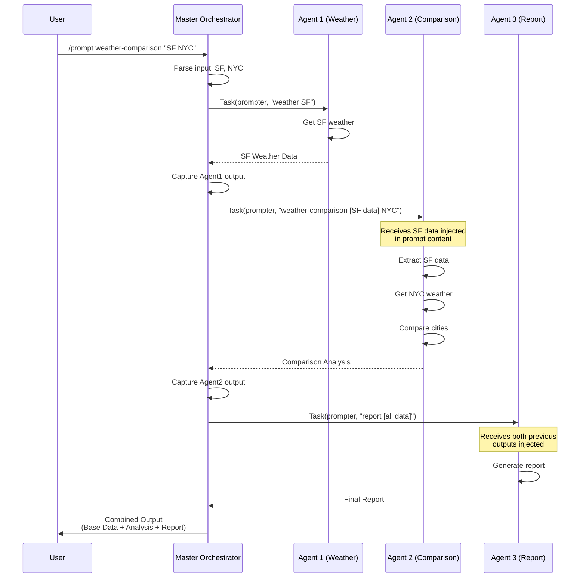
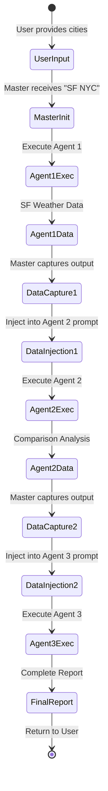
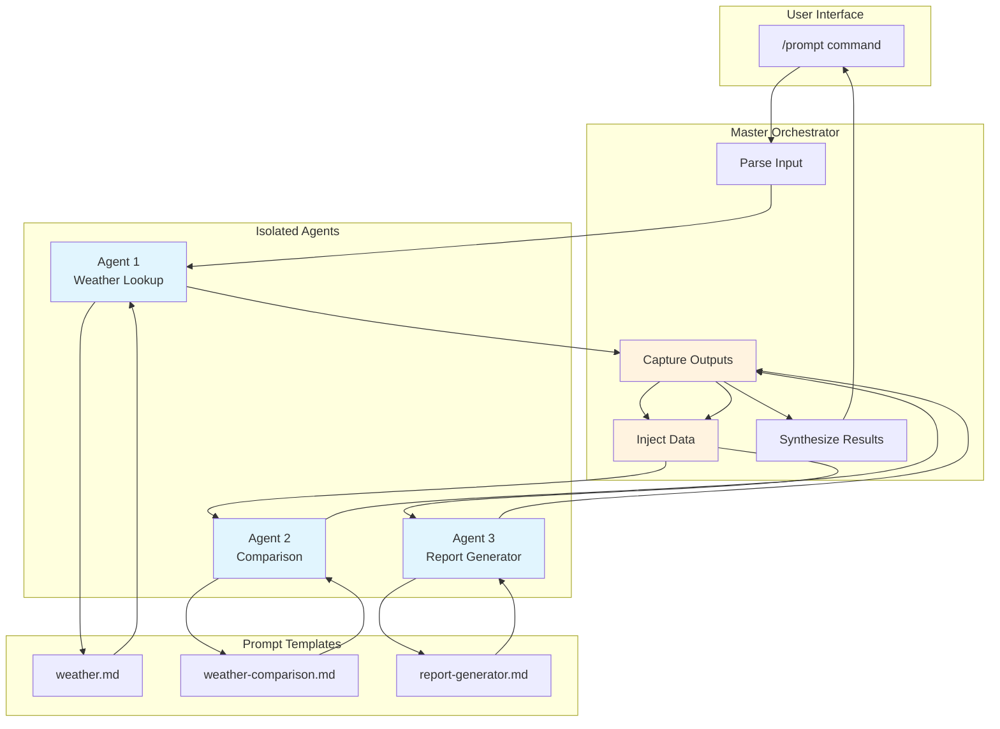

# Comprehensive Guide to Claude Code Prompt Chaining

## Table of Contents
1. [Overview](#overview)
2. [Core Concepts](#core-concepts)
3. [Step-by-Step Implementation](#step-by-step-implementation)
4. [Explicit Code and Data Flow](#explicit-code-and-data-flow)
5. [Real World Example](#real-world-example)
6. [Technical Deep Dive](#technical-deep-dive)

---

## Overview

Prompt chaining in Claude Code is a technique for creating sequential workflows where the output of one agent becomes the input for another agent. This creates a data pipeline where each agent performs a specialized task and passes its results to the next agent in the chain.

### Key Principle
**Agents are isolated** - they don't automatically share context. The orchestrator (master prompt) must explicitly capture outputs and inject them into subsequent agent calls.

---

## Core Concepts

### 1. Agent Isolation
Each subagent in Claude Code:
- Has its own **independent context window**
- Has its own **system prompt**
- **Cannot access** previous agent's data automatically
- Receives only what you **explicitly pass** in the prompt

### 2. The Orchestrator Pattern
The master prompt acts as an orchestrator that:
- **Executes** agents in sequence
- **Captures** each agent's output
- **Injects** previous outputs into next agent's prompt
- **Synthesizes** all outputs into final result

### 3. Data Handoff Mechanism
```
Agent 1 → [Output] → Orchestrator → [Inject Output] → Agent 2
```

---

## Step-by-Step Implementation

### Step 1: Create Master Orchestrator Prompt

**File**: `prompts/weather-comparison-chain.md`

```markdown
---
argument-hint: "[base-city] [comparison-city]"
description: "Sequential weather comparison chain"
allowed-tools: "all"
---

# Weather Comparison Chain

**Input**: <prompt-arguments>

## Sequential Execution

### Step 1: Get Base City Weather
Use Task tool with prompter subagent:
```
ask prompter on weather to extract base city from <prompt-arguments>
```

### Step 2: Compare Cities
Use Task tool with prompter subagent:
```
ask prompter on weather-comparison [INJECT STEP 1 OUTPUT] and <prompt-arguments>
```

### Step 3: Generate Report
Use Task tool with prompter subagent:
```
ask prompter on report-generator [INJECT STEPS 1&2 OUTPUT]
```
```

### Step 2: Create Agent Templates

**Template 1**: `prompts/weather.md`
```markdown
---
description: "Get weather for a city"
---
# Weather Data

Extract city from: <prompt-arguments>
Get current weather data for that city.
```

**Template 2**: `prompts/weather-comparison.md`
```markdown
---
description: "Compare weather between cities"
---
# Weather Comparison

Parse input: <prompt-arguments>

Extract:
1. Base city weather data (from previous agent)
2. Comparison city name (from user input)

Research comparison city weather.
Generate comparative analysis.
```

---

## Explicit Code and Data Flow

### Execution Flow with Actual Code

#### User Command:
```bash
/prompt weather-comparison-chain "San Ramon, CA" "New York, NY"
```

#### Step 1: Master Prompt Receives Input
```python
# Claude Code internally creates:
prompt-arguments = "San Ramon, CA New York, NY"
```

#### Step 2: Master Executes Agent 1
```python
# Master prompt executes:
agent1_result = Task(
    subagent_type="prompter",
    description="Get weather for base city",
    prompt="weather San Ramon, CA"  # Extracted from prompt-arguments
)

# Agent 1 returns:
agent1_output = """
## Current Weather for San Ramon, CA
- Temperature: 65°F
- Conditions: Mostly cloudy
- High: 76°F, Low: 62°F
- Wind: SW at 4 mph
"""
```

#### Step 3: Master Captures Agent 1 Output
```python
# Master prompt now has agent1_output in its context
captured_data = agent1_output  # Stored in orchestrator's memory
```

#### Step 4: Master Executes Agent 2 with Injected Data
```python
# Master constructs Agent 2's prompt with Agent 1's data:
agent2_prompt = f"""weather-comparison 
{agent1_output}  # <-- INJECTED DATA FROM AGENT 1

New York, NY"""  # <-- Comparison city from original input

# Execute Agent 2:
agent2_result = Task(
    subagent_type="prompter", 
    description="Compare weather between cities",
    prompt=agent2_prompt  # Contains Agent 1's output + NY
)

# Agent 2 returns:
agent2_output = """
## Weather Comparison: San Ramon vs New York
- New York is 8°F warmer (73°F vs 65°F)
- San Ramon: Cloudy with marine influence
- New York: Partly sunny conditions
"""
```

#### Step 5: Master Synthesizes Final Output
```python
# Master has both outputs and creates final report:
final_output = f"""
# Base Weather Data
{agent1_output}

# Comparative Analysis  
{agent2_output}

# Executive Summary
[Master's synthesis of both outputs]
"""
```

---

## Real World Example

### Complete Execution Trace

#### 1. User Input:
```bash
/prompt weather-comparison-chain "San Ramon, CA New York, NY"
```

#### 2. Master Prompt Processing:
```markdown
# Master reads prompt-arguments = "San Ramon, CA New York, NY"

## Execution begins...
```

#### 3. Agent 1 Call (Base Weather):
```python
# ACTUAL TASK TOOL CALL:
Task(
    subagent_type="prompter",
    description="Get weather for San Ramon, CA", 
    prompt="weather san ramon, ca"
)

# WHAT AGENT 1 RECEIVES:
# System: "You are the prompter agent..."
# User: "weather san ramon, ca"

# AGENT 1 OUTPUTS:
"""
## Current Weather for San Ramon, CA

**Current Conditions (September 10, 2025)**
- **Temperature**: 65-66°F
- **Conditions**: Mostly cloudy 
- **RealFeel**: 66°F
- **Wind**: Southwest at 4 mph, gusts up to 8 mph
[... full weather details ...]
"""
```

#### 4. Data Capture by Master:
```python
# Master stores Agent 1's output:
step1_data = agent1_output  # Full weather data for San Ramon
```

#### 5. Agent 2 Call (Comparison):
```python
# MASTER CONSTRUCTS AGENT 2'S PROMPT:
agent2_prompt = """weather-comparison 
## Current Weather for San Ramon, CA
**Current Conditions (September 10, 2025)**
- **Temperature**: 65-66°F
- **Conditions**: Mostly cloudy
[... ENTIRE AGENT 1 OUTPUT ...]

new york, ny"""

# ACTUAL TASK TOOL CALL:
Task(
    subagent_type="prompter",
    description="Compare weather using weather-comparison template",
    prompt=agent2_prompt  # <-- Contains Agent 1's data!
)

# WHAT AGENT 2 RECEIVES:
# System: "You are the prompter agent..."
# User: [The constructed prompt with Agent 1's data embedded]

# AGENT 2 OUTPUTS:
"""
## Current Weather for New York, NY
- **Temperature**: 74°F
[... NY weather ...]

## Weather Comparison: San Ramon, CA vs New York, NY
**Temperature Difference**
- New York is currently **8-9°F warmer** than San Ramon
[... full comparison ...]
"""
```

#### 6. Final Assembly:
```markdown
# Master creates final output structure:

# Base Weather Data
[Agent 1's complete output]

# Comparative Analysis
[Agent 2's complete output]  

# Executive Summary
[Master's synthesis]
```

---

## Technical Deep Dive

### Why Manual Data Passing?

1. **Context Isolation**: Each agent has a fresh context window
2. **No Shared Memory**: Agents can't access each other's variables
3. **Explicit Control**: Orchestrator decides what data to pass

### The Injection Pattern

```python
# Pattern for data injection:
next_agent_prompt = f"""
{template_name}
{previous_agent_output}  # <-- INJECTED DATA
{additional_context}
"""
```

### Critical Implementation Details

1. **Data must be serialized**: Agent outputs are text strings
2. **Prompt size limits**: Be aware of token limits when injecting large outputs
3. **Parse expectations**: Receiving agents must know how to parse injected data

### Prompt Template Structure for Chaining

```markdown
# Template expecting injected data:

Parse the following input:
<prompt-arguments>  # <-- This will contain injected data + new instructions

Extract:
1. [Previous agent's data]
2. [New parameters]

Process accordingly.
```

---

## Visual Flow Diagram

```
┌─────────────┐
│    USER     │
└──────┬──────┘
       │ "/prompt weather-comparison SF NYC"
       ▼
┌─────────────────────────────────────┐
│       MASTER ORCHESTRATOR           │
│  (weather-comparison-chain.md)      │
└──────┬──────────────────────────────┘
       │
       ├──[Step 1]──────────────────┐
       │                            ▼
       │                    ┌──────────────┐
       │                    │   AGENT 1    │
       │                    │  (weather)   │
       │                    └──────┬───────┘
       │                           │ Returns: SF weather data
       │◄──────────────────────────┘
       │ Captures output
       │
       ├──[Step 2]──────────────────┐
       │ Injects Agent 1 output     ▼
       │                    ┌──────────────┐
       │                    │   AGENT 2    │
       │                    │ (comparison) │
       │                    └──────┬───────┘
       │                           │ Returns: Comparison
       │◄──────────────────────────┘
       │ Captures output
       │
       ├──[Step 3]──────────────────┐
       │ Injects both outputs       ▼
       │                    ┌──────────────┐
       │                    │   AGENT 3    │
       │                    │   (report)   │
       │                    └──────┬───────┘
       │                           │ Returns: Final report
       │◄──────────────────────────┘
       │
       ▼
┌─────────────┐
│ FINAL OUTPUT│
└─────────────┘
```

---

## Key Takeaways

1. **Agents are isolated** - No automatic data sharing
2. **Orchestrator is critical** - Manages all data flow
3. **Explicit injection required** - Data must be manually passed
4. **Sequential execution** - Each step builds on previous
5. **Template design matters** - Must handle injected data properly

## Common Pitfalls

1. **Assuming shared context** - Agents can't see each other's work
2. **Forgetting to inject data** - Next agent won't have previous output
3. **Poor parsing logic** - Agent can't extract injected data
4. **Token limit issues** - Too much injected data can overflow

## Best Practices

1. **Design clear data formats** - Make parsing easy
2. **Use structured outputs** - Consistent formatting helps
3. **Test incrementally** - Verify each step works alone first
4. **Monitor token usage** - Large chains can consume many tokens
5. **Document expected inputs** - Each template should specify what it expects

---

## Complete Template Files

### Actual weather.md Implementation
**File**: `prompts/weather.md`
```markdown
look up the weather for <prompt-arguments>
```

This simple prompt:
- Receives a city name in `<prompt-arguments>`
- Triggers weather lookup via Claude's capabilities
- Returns weather data for that location

### Actual weather-comparison.md Implementation  
**File**: `prompts/weather-comparison.md`
```markdown
---
argument-hint: "[base-city-with-weather] [comparison-city]"  
description: "Compares weather between base city (with weather data) and comparison city"
allowed-tools: "all"
---

# Weather Comparison Chain

**Input**: <prompt-arguments>

## Sequential Execution

### Base City: 
 - Extract base city and weather information from from <prompt-arguments>

### Comparison City: 
 - Extract comparison city from <prompt-arguments>

### Output:
 - Output the base city
 - Output the comparison city
 - Produce a comparison of base city weather to comparison city weather
```

This template:
- Expects weather data for base city in `<prompt-arguments>`
- Extracts comparison city from `<prompt-arguments>`
- Performs comparative analysis between both cities

---

## Prompter Agent Implementation

The prompter agent is implemented via the `/prompt` command in `commands/prompt.md`. Here's how it discovers and executes templates:

### Template Discovery Logic
```bash
# Priority order for finding templates:
1. Explicit file paths (if contains "/" or ".md")
2. Git root prompts directory  
3. Git parent prompts directory
4. Repository prompts directory (from claude-craft.json)
5. Profile prompts (~/.claude/prompts)
6. Current directory (fallback)

# Search process:
for dir in "${SEARCH_DIRS[@]}"; do
    if [ -f "$dir/${TEMPLATE}.md" ]; then
        TEMPLATE_FILE="$dir/${TEMPLATE}.md"
        break
    fi
done
```

### Template Execution
```bash
# Load template content
TEMPLATE_CONTENT=$(cat "$TEMPLATE_FILE")

# Output for Claude to process
echo "<prompt-instructions>"
echo "$TEMPLATE_CONTENT"
echo "</prompt-instructions>"

# Claude processes the instructions within tags
```

The prompter:
1. Discovers template files based on name
2. Loads template content  
3. Wraps in `<prompt-instructions>` tags
4. Claude executes the natural language instructions

---

## Visual Diagrams (Mermaid)

### Sequence Diagram: Agent Chaining Flow



### State Diagram: Data Transformation



### Component Diagram: System Architecture



### Data Flow Diagram: Information Passing

```mermaid
flowchart LR
    subgraph Input
        U["User: SF NYC"]
    end
    
    subgraph Step1["Step 1: Base Weather"]
        A1_IN["Input: 'weather SF'"]
        A1_PROC["Process: Get SF weather"]
        A1_OUT["Output: SF weather data"]
        A1_IN --> A1_PROC --> A1_OUT
    end
    
    subgraph Step2["Step 2: Comparison"]
        A2_IN["Input: SF data + NYC"]
        A2_PARSE["Parse: Extract SF data"]
        A2_GET["Get: NYC weather"]
        A2_COMP["Compare: SF vs NYC"]
        A2_OUT["Output: Comparison"]
        A2_IN --> A2_PARSE --> A2_GET --> A2_COMP --> A2_OUT
    end
    
    subgraph Step3["Step 3: Report"]
        A3_IN["Input: All previous data"]
        A3_PROC["Process: Generate report"]
        A3_OUT["Output: Final report"]
        A3_IN --> A3_PROC --> A3_OUT
    end
    
    U --> A1_IN
    A1_OUT -.->|Captured & Injected| A2_IN
    A2_OUT -.->|Captured & Injected| A3_IN
    A3_OUT --> F["Final Output to User"]
    
    style A1_OUT fill:#c8e6c9
    style A2_OUT fill:#c8e6c9
    style A3_OUT fill:#c8e6c9
```



---

## Conclusion

Prompt chaining in Claude Code requires explicit orchestration and data management. The master prompt acts as a conductor, capturing outputs and injecting them into subsequent agent calls. This pattern enables sophisticated multi-step workflows while maintaining agent isolation and specialized capabilities.

The key to successful chaining is understanding that **nothing happens automatically** - every piece of data transfer must be explicitly managed by the orchestrator.