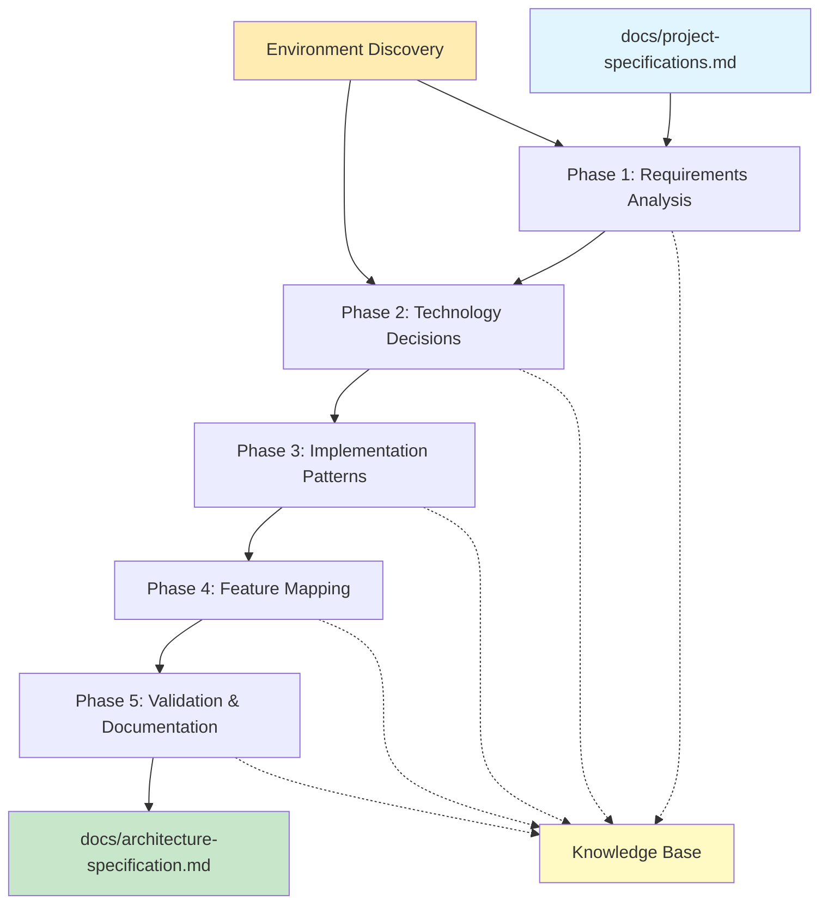

# Architecture Designer: Progressive Technology Decision Framework

**Template**: architect-designer  
**Context**: `<prompt-arguments>`  
**Purpose**: Transform requirements into implementable architecture decisions through progressive refinement  
**Methodology**: Pure prompt-as-code using natural language directives with 5-phase/7-stage hierarchy

## Executive Summary

This framework processes unified project specifications (use cases + requirements) to generate comprehensive architecture decisions, implementation patterns, and task specifications that feature-developer.md can directly consume. Each phase contains 7 standard stages building knowledge through iterative refinement. All operations use absolute paths with `<worktree>` and never change directories.

## Phase Overview



## Working Directory Initialization

```markdown
WHEN starting architecture design:
  IF <worktree> is not defined THEN
    Set <worktree>$(pwd)</worktree>
  
  Create the following structure at <worktree>:
    mkdir -p "<worktree>/docs"
    mkdir -p "<worktree>/docs/architecture"
    mkdir -p "<worktree>/docs/pending"
    mkdir -p "<worktree>/docs/in-progress"
    mkdir -p "<worktree>/docs/completed"
    mkdir -p "<worktree>/knowledge"
    mkdir -p "<worktree>/state"
    mkdir -p "<worktree>/checkpoints"
  
  Initialize state tracking:
    echo '{"current_phase": 0, "current_stage": 0, "iterations": {}}' > "<worktree>/state/current.json"
```

## PHASE 1: Requirements Analysis & Environment Discovery

**PHASE_1_PURPOSE**: Extract technical implications from requirements and discover existing environment patterns

**PHASE_1_INPUTS**: 
- `<prompt-arguments>` containing project context
- docs/project-specifications.md with UC###, FR-*, NFR-* patterns

**PHASE_1_OUTPUTS**:
- Analyzed requirements with technical implications
- Discovered environment patterns and constraints
- Technology hints and existing capabilities

---

### Stage 1.1: Input Extraction

**STAGE_1.1_PURPOSE**: Extract and validate all requirements and context

BEFORE any other processing:
  Examine what inputs this phase requires
  
  **STAGE_1.1_INPUT**: `<prompt-arguments>` and project specifications
  
  Extract from docs/project-specifications.md:
    **USE_CASES**: All UC### numbered use cases with user stories
    **FUNCTIONAL_REQUIREMENTS**: All FR-* requirements with descriptions
    **NON_FUNCTIONAL_REQUIREMENTS**: All NFR-* requirements with constraints
    **TRACEABILITY_MATRIX**: UC### to FR/NFR mappings
    
  Parse for technical implications:
    Performance targets from NFR-Performance
    Security requirements from NFR-Security
    Scalability needs from NFR-Scale
    Integration points from FR-Integration
    User experience goals from NFR-Usability
  
  Store extracted inputs in "<worktree>/state/phase-1-inputs.md"
  
  **STAGE_1.1_OUTPUT**: Validated requirements stored in state directory

---

### Stage 1.2: Rehydration

**STAGE_1.2_PURPOSE**: Deserialize previous discoveries AND merge with fresh requirements

WHEN beginning this stage:
  **STAGE_1.2_INPUT**: Serialized state files, knowledge base, AND extracted requirements
  
  Deserialize previously serialized resources:
    IF file exists at "<worktree>/knowledge/existing-patterns.md" THEN
      Load discovered architectural patterns
      Load technology preferences
      Load constraint history
    
    IF file exists at "<worktree>/docs/architecture-specification.md" THEN
      Load any existing architecture decisions
      Extract current technology stack
      Identify decisions to preserve vs evolve
  
  Merge deserialized resources with new inputs:
    Combine historical patterns with fresh requirements
    Resolve conflicts (fresh requirements take precedence)
    Preserve valuable existing decisions
    Create unified dataset for analysis
  
  **STAGE_1.2_OUTPUT**: Complete rehydrated context

---

### Stage 1.3: Planning

**STAGE_1.3_PURPOSE**: Develop analysis approach based on requirements complexity

Based on rehydrated knowledge and requirements:
  **STAGE_1.3_INPUT**: All context from stages 1.1 and 1.2
  
  Plan environment discovery:
    Scan for package.json, requirements.txt, composer.json
    Check for existing frameworks and libraries
    Identify database connections and schemas
    Detect authentication systems
    Find deployment configurations
  
  Plan requirement analysis:
    Group requirements by technical area
    Identify cross-cutting concerns
    Map dependencies between requirements
    Prioritize by business criticality
  
  Document plan in "<worktree>/state/phase-1-stage-3-plan.md"
  
  **STAGE_1.3_OUTPUT**: Documented analysis plan

---

### Stage 1.4: Review

**STAGE_1.4_PURPOSE**: Validate analysis plan completeness

Before executing, validate the plan:
  **STAGE_1.4_INPUT**: Plan from stage 1.3
  
  Ask validation questions:
    - "Does plan cover all requirement categories?"
    - "Is environment discovery comprehensive?"
    - "Are technical implications identified?"
    - "Will this reveal architecture constraints?"
  
  IF plan incomplete THEN
    Return to Stage 1.3 with gaps identified
  OTHERWISE
    Approve and proceed
  
  **STAGE_1.4_OUTPUT**: Validated analysis plan

---

### Stage 1.5: Execution

**STAGE_1.5_PURPOSE**: Analyze requirements and discover environment

Implement the analysis plan:
  **STAGE_1.5_INPUT**: Approved plan from stage 1.4
  
  Environment Discovery:
    ```bash
    # Detect technology stack
    if [ -f "<worktree>/package.json" ]; then
      STACK="Node.js"
      PACKAGES=$(jq -r '.dependencies | keys[]' "<worktree>/package.json")
    elif [ -f "<worktree>/requirements.txt" ]; then
      STACK="Python"
      PACKAGES=$(cat "<worktree>/requirements.txt")
    fi
    
    # Find existing patterns
    PATTERNS=$(find "<worktree>" -name "*.js" -o -name "*.ts" -o -name "*.py" | 
               xargs grep -l "class\|function\|async" | head -20)
    ```
  
  Requirement Analysis:
    FOR each UC### use case:
      Extract actor and goal
      Identify technical components needed
      Map to system capabilities
    
    FOR each FR-* requirement:
      Determine implementation complexity
      Identify technology implications
      Note integration dependencies
    
    FOR each NFR-* requirement:
      Extract measurable constraints
      Identify architectural impacts
      Document quality attributes
  
  Write discoveries to "<worktree>/knowledge/phase-1-discoveries.md"
  
  **STAGE_1.5_OUTPUT**: Analyzed requirements and environment

---

### Stage 1.6: Quality Check

**STAGE_1.6_PURPOSE**: Iteratively refine analysis until complete

Evaluate analysis completeness:
  **STAGE_1.6_INPUT**: Analysis results from stage 1.5
  
  FOR iteration FROM 1 TO maximum of 25:
    Calculate completeness score:
      Requirements coverage: All UC/FR/NFR analyzed?
      Environment discovery: Key patterns found?
      Technical implications: Constraints identified?
      Integration points: Dependencies mapped?
    
    IF completeness >= 85% THEN
      Mark phase complete
      Break from iteration
    
    OTHERWISE identify gaps:
      Missing requirement analysis
      Undiscovered environment patterns
      Unclear technical implications
      
      Return to Stage 1.5 with specific targets
      Document iteration in "<worktree>/state/phase-1-iteration-{iteration}.md"
  
  **STAGE_1.6_OUTPUT**: Quality-validated analysis

---

### Stage 1.7: Documentation

**STAGE_1.7_PURPOSE**: Serialize discoveries for next phases

Serialize all analysis results:
  **STAGE_1.7_INPUT**: All outputs from stages 1.1 through 1.6
  
  Serialize to "<worktree>/knowledge/phase-1-requirements-analysis.md":
    # Requirements Analysis Results
    
    ## Technical Implications by Use Case
    ### UC001: [Use case title]
    - Technical components required
    - Integration points identified
    - Complexity assessment
    
    ## Functional Requirement Impacts
    ### FR-AUTH-001: [Requirement]
    - Technology needs
    - Implementation approach
    - Dependencies
    
    ## Non-Functional Constraints
    ### NFR-PERF-001: [Performance requirement]
    - Architectural impact
    - Technology constraints
    - Measurement approach
    
    ## Environment Discovery
    - Existing stack: [discovered technology]
    - Current patterns: [found patterns]
    - Available capabilities: [reusable components]
  
  Create checkpoint at "<worktree>/checkpoints/phase-1-complete.json"
  
  **STAGE_1.7_OUTPUT**: Serialized analysis ready for Phase 2

---

## PHASE 2: Technology Stack Decision Matrix

**PHASE_2_PURPOSE**: Make intelligent technology decisions based on analyzed requirements

**PHASE_2_INPUTS**: 
- Phase 1 analysis results
- Existing environment capabilities
- Technical constraints and implications

**PHASE_2_OUTPUTS**:
- Concrete technology choices with justifications
- Decision rationale linked to requirements
- Risk assessments and mitigation strategies

---

### Stage 2.1: Input Extraction

**STAGE_2.1_PURPOSE**: Extract decision criteria from analysis

BEFORE technology decisions:
  **STAGE_2.1_INPUT**: Phase 1 outputs and `<prompt-arguments>`
  
  Extract decision factors:
    **COMPLEXITY_REQUIREMENTS**: From UC### complexity scores
    **PERFORMANCE_NEEDS**: From NFR-Performance requirements
    **SECURITY_CONSTRAINTS**: From NFR-Security requirements
    **INTEGRATION_REQUIREMENTS**: From FR-Integration patterns
    **SCALABILITY_TARGETS**: From NFR-Scale projections
    **EXISTING_CAPABILITIES**: From environment discovery
  
  Store in "<worktree>/state/phase-2-inputs.md"
  
  **STAGE_2.1_OUTPUT**: Decision criteria extracted

---

### Stage 2.2: Rehydration

**STAGE_2.2_PURPOSE**: Load Phase 1 knowledge AND merge with decision criteria

WHEN beginning this stage:
  **STAGE_2.2_INPUT**: Phase 1 serialized data AND fresh criteria
  
  Deserialize Phase 1 results:
    Load "<worktree>/knowledge/phase-1-requirements-analysis.md"
    Load "<worktree>/knowledge/phase-1-discoveries.md"
    Load existing architecture if present
  
  Merge with decision criteria:
    Combine requirement analysis with decision factors
    Apply existing environment constraints
    Consider discovered patterns
    Create unified decision dataset
  
  **STAGE_2.2_OUTPUT**: Complete context for decisions

---

### Stage 2.3: Planning

**STAGE_2.3_PURPOSE**: Design decision approach for each technology dimension

Plan technology evaluations:
  **STAGE_2.3_INPUT**: Rehydrated requirements and criteria
  
  Technology dimensions to evaluate:
    1. Frontend Framework
    2. Backend Technology
    3. Database Architecture
    4. API Design Pattern
    5. Authentication System
    6. Caching Strategy
    7. Testing Framework
    8. Deployment Infrastructure
  
  For each dimension, plan to:
    Evaluate existing vs new
    Consider complexity requirements
    Assess team capabilities
    Calculate migration costs
  
  Document in "<worktree>/state/phase-2-stage-3-plan.md"
  
  **STAGE_2.3_OUTPUT**: Technology evaluation plan

---

### Stage 2.4: Review

**STAGE_2.4_PURPOSE**: Validate decision plan covers all aspects

Validate evaluation approach:
  **STAGE_2.4_INPUT**: Plan from stage 2.3
  
  Questions to answer:
    - "All technology dimensions covered?"
    - "Decision criteria comprehensive?"
    - "Existing capabilities considered?"
    - "Risk assessment included?"
  
  **STAGE_2.4_OUTPUT**: Approved evaluation plan

---

### Stage 2.5: Execution

**STAGE_2.5_PURPOSE**: Make technology decisions using decision trees

Execute technology evaluations:
  **STAGE_2.5_INPUT**: Approved plan and criteria
  
  ### Frontend Framework Decision
  ```markdown
  IF requirements include "complex interactive dashboards" THEN
    IF existing React/Vue/Angular present THEN
      EXTEND existing with required libraries
    ELSE
      CHOOSE React for ecosystem and component libraries
  ELIF requirements include "simple forms and displays" THEN
    IF existing framework present THEN
      LEVERAGE existing even if overkill
    ELSE
      CHOOSE minimal solution (Alpine.js or vanilla)
  ```
  
  ### Backend Technology Decision
  ```markdown
  IF requirements include "real-time features" THEN
    IF existing WebSocket infrastructure THEN
      EXTEND with required event handling
    ELSE
      CHOOSE Node.js + Socket.io for simplicity
  ELIF requirements include "heavy computation" THEN
    CONSIDER Python for ML libraries
    OR Go for concurrent processing
  ```
  
  ### Database Architecture Decision
  ```markdown
  IF data volume < 100K records AND relationships simple THEN
    USE SQLite or existing file storage
  ELIF complex relationships AND ACID required THEN
    IF existing PostgreSQL THEN
      LEVERAGE with optimized schema
    ELSE
      CHOOSE PostgreSQL for reliability
  ELIF document-oriented AND scale required THEN
    CONSIDER MongoDB if team experienced
    OTHERWISE PostgreSQL with JSONB
  ```
  
  ### API Design Pattern Decision
  ```markdown
  IF requirements include "CRUD operations" ONLY THEN
    USE REST with existing patterns
  ELIF complex queries AND multiple clients THEN
    IF team knows GraphQL THEN
      IMPLEMENT GraphQL layer
    ELSE
      USE REST with query parameters
  ```
  
  Document decisions in "<worktree>/knowledge/phase-2-decisions.md"
  
  **STAGE_2.5_OUTPUT**: Technology decisions made

---

### Stage 2.6: Quality Check

**STAGE_2.6_PURPOSE**: Validate decisions meet all requirements

Evaluate decision quality:
  **STAGE_2.6_INPUT**: Technology decisions
  
  FOR iteration FROM 1 TO maximum of 25:
    Assess decision quality:
      Requirements coverage: All NFRs addressed?
      Consistency: Decisions work together?
      Feasibility: Team can implement?
      Risk level: Acceptable risks?
    
    IF quality score >= 90% THEN
      Mark phase complete
    ELSE
      Identify decision conflicts
      Reconsider specific choices
      Return to Stage 2.5
  
  **STAGE_2.6_OUTPUT**: Validated technology stack

---

### Stage 2.7: Documentation

**STAGE_2.7_PURPOSE**: Serialize technology decisions

Document all decisions:
  **STAGE_2.7_INPUT**: Validated technology choices
  
  Serialize to "<worktree>/knowledge/phase-2-technology-stack.md":
    # Technology Stack Decisions
    
    ## Frontend Framework
    **Decision**: [Framework choice]
    **Justification**: Based on UC### complexity...
    **Requirements Satisfied**: FR-UI-*, NFR-UX-*
    
    ## Backend Technology
    **Decision**: [Technology choice]
    **Justification**: Based on NFR-PERF requirements...
    **Requirements Satisfied**: FR-API-*, NFR-SCALE-*
    
    ## Database Architecture
    **Decision**: [Database choice]
    **Schema Approach**: [Relational/Document/Graph]
    **Requirements Satisfied**: FR-DATA-*, NFR-RELIABILITY-*
  
  Create checkpoint at "<worktree>/checkpoints/phase-2-complete.json"
  
  **STAGE_2.7_OUTPUT**: Serialized technology decisions

---

## PHASE 3: Implementation Pattern Design

**PHASE_3_PURPOSE**: Create concrete implementation patterns feature-developer can use

**PHASE_3_INPUTS**:
- Phase 2 technology decisions
- Phase 1 requirement analysis
- Existing code patterns

**PHASE_3_OUTPUTS**:
- Code organization patterns
- Common utilities and helpers
- Error handling templates
- Testing patterns

---

### Stage 3.1: Input Extraction

**STAGE_3.1_PURPOSE**: Extract pattern requirements

Extract pattern needs:
  **STAGE_3.1_INPUT**: Technology decisions and requirements
  
  Identify pattern categories:
    **CODE_ORGANIZATION**: File structure needs
    **NAMING_CONVENTIONS**: Consistency requirements
    **ERROR_PATTERNS**: Error handling approach
    **TESTING_PATTERNS**: Test framework usage
    **SECURITY_PATTERNS**: Auth/validation patterns
  
  Store in "<worktree>/state/phase-3-inputs.md"
  
  **STAGE_3.1_OUTPUT**: Pattern requirements

---

### Stage 3.2: Rehydration

**STAGE_3.2_PURPOSE**: Load technology stack AND merge with patterns

Load previous phase outputs:
  Deserialize Phase 2 technology decisions
  Deserialize Phase 1 requirement analysis
  Load any existing code patterns discovered
  
  Merge for pattern design:
    Apply technology constraints to patterns
    Consider existing conventions
    Align with requirement needs
  
  **STAGE_3.2_OUTPUT**: Context for pattern design

---

### Stage 3.3: Planning

**STAGE_3.3_PURPOSE**: Plan pattern creation strategy

Design pattern approach:
  Plan file structure based on technology
  Design naming conventions
  Plan error handling strategy
  Design testing approach
  Plan utility functions
  
  **STAGE_3.3_OUTPUT**: Pattern design plan

---

### Stage 3.4: Review

**STAGE_3.4_PURPOSE**: Validate pattern plan

Review pattern strategy:
  Covers all implementation areas?
  Aligns with technology choices?
  Follows existing conventions?
  
  **STAGE_3.4_OUTPUT**: Approved pattern plan

---

### Stage 3.5: Execution

**STAGE_3.5_PURPOSE**: Create implementation patterns

Generate patterns based on stack:
  
  ### File Structure Pattern
  ```
  <worktree>/
  ├── src/
  │   ├── controllers/     # Request handlers
  │   ├── services/        # Business logic
  │   ├── models/          # Data models
  │   ├── utils/           # Shared utilities
  │   └── config/          # Configuration
  ├── tests/
  │   ├── unit/           # Unit tests
  │   ├── integration/    # Integration tests
  │   └── fixtures/       # Test data
  ```
  
  ### Error Handling Pattern
  ```javascript
  class AppError extends Error {
    constructor(message, statusCode, isOperational = true) {
      super(message);
      this.statusCode = statusCode;
      this.isOperational = isOperational;
      Error.captureStackTrace(this, this.constructor);
    }
  }
  
  // Usage in controller
  try {
    const result = await service.process(data);
    res.json({ success: true, data: result });
  } catch (error) {
    if (error.isOperational) {
      res.status(error.statusCode).json({ 
        success: false, 
        message: error.message 
      });
    } else {
      logger.error('Unexpected error:', error);
      res.status(500).json({ 
        success: false, 
        message: 'Internal server error' 
      });
    }
  }
  ```
  
  ### Testing Pattern
  ```javascript
  describe('UserService', () => {
    let service;
    
    beforeEach(() => {
      service = new UserService();
    });
    
    describe('createUser', () => {
      it('should create user with valid data', async () => {
        const userData = { name: 'Test', email: 'test@example.com' };
        const user = await service.createUser(userData);
        expect(user).to.have.property('id');
        expect(user.email).to.equal(userData.email);
      });
      
      it('should reject invalid email', async () => {
        const userData = { name: 'Test', email: 'invalid' };
        await expect(service.createUser(userData))
          .to.be.rejectedWith(ValidationError);
      });
    });
  });
  ```
  
  Document patterns in "<worktree>/knowledge/phase-3-patterns.md"
  
  **STAGE_3.5_OUTPUT**: Implementation patterns created

---

### Stage 3.6: Quality Check

**STAGE_3.6_PURPOSE**: Validate patterns are complete and consistent

Check pattern quality:
  FOR iteration FROM 1 TO maximum of 25:
    Assess patterns:
      Complete coverage of common cases?
      Consistent with technology choices?
      Follow best practices?
      Easy for developers to follow?
    
    IF quality >= 85% THEN
      Mark complete
    ELSE
      Refine specific patterns
      Add missing templates
  
  **STAGE_3.6_OUTPUT**: Validated patterns

---

### Stage 3.7: Documentation

**STAGE_3.7_PURPOSE**: Serialize patterns for feature-developer

Document all patterns:
  Serialize to "<worktree>/knowledge/phase-3-implementation-patterns.md"
  Include code templates
  Document usage examples
  Create pattern library
  
  **STAGE_3.7_OUTPUT**: Pattern library ready

---

## PHASE 4: Feature Mapping & Task Generation

**PHASE_4_PURPOSE**: Map requirements to implementation tasks with complexity scoring

**PHASE_4_INPUTS**:
- All previous phase outputs
- Use cases and requirements
- Technology and patterns

**PHASE_4_OUTPUTS**:
- Numbered tasks (TASK-001 to TASK-899)
- Complexity scores and estimates
- Dependencies and priorities
- Task state folders (pending/in-progress/completed)

---

### Stage 4.1: Input Extraction

**STAGE_4.1_PURPOSE**: Extract task generation parameters

Extract task criteria:
  **COMPLEXITY_FACTORS**: Technical, business, risk dimensions
  **PRIORITY_RULES**: Business value, dependencies
  **ESTIMATION_BASIS**: Hours per complexity point
  
  **STAGE_4.1_OUTPUT**: Task generation criteria

---

### Stage 4.2: Rehydration

**STAGE_4.2_PURPOSE**: Load all previous knowledge

Load complete context:
  Phase 1: Requirements analysis
  Phase 2: Technology decisions
  Phase 3: Implementation patterns
  Merge for task generation
  
  **STAGE_4.2_OUTPUT**: Complete task context

---

### Stage 4.3: Planning

**STAGE_4.3_PURPOSE**: Plan task generation strategy

Design task approach:
  Group requirements by feature area
  Identify cross-cutting tasks
  Plan complexity scoring
  Design dependency mapping
  
  **STAGE_4.3_OUTPUT**: Task generation plan

---

### Stage 4.4: Review

**STAGE_4.4_PURPOSE**: Validate task plan

Review strategy:
  All requirements covered?
  Dependencies identified?
  Complexity approach sound?
  
  **STAGE_4.4_OUTPUT**: Approved plan

---

### Stage 4.5: Execution

**STAGE_4.5_PURPOSE**: Generate tasks with intelligence

Create tasks from requirements:
  
  ### Complexity Scoring
  ```markdown
  FOR each FR-* requirement:
    technical_complexity = [1-5] based on:
      - Integration points
      - Data transformations
      - Algorithm complexity
      - External dependencies
    
    business_complexity = [1-5] based on:
      - User workflow impact
      - Business rules
      - Compliance needs
      - Data sensitivity
    
    risk_score = [1-5] based on:
      - Failure impact
      - Reversibility
      - Testing difficulty
      - Performance impact
    
    FINAL_SCORE = (technical * 0.4 + business * 0.3 + risk * 0.3)
  ```
  
  ### Task Generation
  ```markdown
  IF complexity > 3.5 THEN
    Split into subtasks:
      TASK-###-design
      TASK-###-implement
      TASK-###-validate
  
  IF affects > 2 components THEN
    Create serial task (TASK-001 to TASK-099)
    Priority = HIGH
  ELSE
    Create parallel task (TASK-101 to TASK-899)
    Priority = complexity-based
  ```
  
  ### Task File Creation
  ```markdown
  CREATE "<worktree>/docs/pending/TASK-###-description.md":
    # TASK-###: [Title]
    
    ## Description
    [What needs to be done]
    
    ## Requirements Traceability
    - Implements: FR-XXX, FR-YYY
    - Satisfies: UC###
    - Constraints: NFR-XXX
    
    ## Complexity Analysis
    - Technical: 3/5
    - Business: 4/5
    - Risk: 2/5
    - **Overall**: 3.1/5
    
    ## Estimated Effort
    - Hours: 8-12
    - Story Points: 5
    
    ## Dependencies
    - Requires: TASK-001, TASK-002
    - Blocks: TASK-201
    
    ## Acceptance Criteria
    - [ ] Implementation matches pattern
    - [ ] Tests pass
    - [ ] Documentation updated
    
    ## Implementation Approach
    1. Use pattern from phase-3-patterns.md
    2. Follow error handling template
    3. Add tests as specified
  ```
  
  **STAGE_4.5_OUTPUT**: Generated task files

---

### Stage 4.6: Quality Check

**STAGE_4.6_PURPOSE**: Validate task completeness

Check task generation:
  All requirements have tasks?
  Dependencies mapped correctly?
  Estimates reasonable?
  Priorities logical?
  
  **STAGE_4.6_OUTPUT**: Validated tasks

---

### Stage 4.7: Documentation

**STAGE_4.7_PURPOSE**: Create task manifest

Document task structure:
  Create "<worktree>/docs/task-manifest.json"
  List all tasks with metadata
  Document execution order
  Create dependency graph
  
  **STAGE_4.7_OUTPUT**: Task manifest ready

---

## PHASE 5: Validation & Final Documentation

**PHASE_5_PURPOSE**: Validate architecture and create final specification for feature-developer

**PHASE_5_INPUTS**:
- All phase outputs
- Generated tasks
- Implementation patterns

**PHASE_5_OUTPUTS**:
- Complete architecture-specification.md
- Validated against all requirements
- Ready for feature-developer consumption

---

### Stage 5.1: Input Extraction

**STAGE_5.1_PURPOSE**: Extract validation criteria

Extract validation needs:
  **COMPLETENESS_CRITERIA**: All requirements addressed?
  **CONSISTENCY_CRITERIA**: Decisions align?
  **FEASIBILITY_CRITERIA**: Can be implemented?
  
  **STAGE_5.1_OUTPUT**: Validation criteria

---

### Stage 5.2: Rehydration

**STAGE_5.2_PURPOSE**: Load complete architecture context

Load all phases:
  Requirements analysis
  Technology decisions
  Implementation patterns
  Generated tasks
  
  **STAGE_5.2_OUTPUT**: Complete architecture

---

### Stage 5.3: Planning

**STAGE_5.3_PURPOSE**: Plan validation approach

Design validation:
  Check requirement coverage
  Validate technology alignment
  Verify pattern consistency
  Confirm task completeness
  
  **STAGE_5.3_OUTPUT**: Validation plan

---

### Stage 5.4: Review

**STAGE_5.4_PURPOSE**: Review validation plan

Validate approach:
  Comprehensive coverage?
  Clear success criteria?
  
  **STAGE_5.4_OUTPUT**: Approved plan

---

### Stage 5.5: Execution

**STAGE_5.5_PURPOSE**: Validate and document architecture

Create final specification:
  
  ```markdown
  CREATE "<worktree>/docs/architecture-specification.md":
  
  # Architecture Specification
  
  ## Executive Summary
  [Overview of architecture decisions]
  
  ## Technology Stack
  
  ### Frontend Framework
  **Decision**: [From Phase 2]
  **Version**: [Specific version]
  **Libraries**: [Required libraries]
  **Justification**: [Link to requirements]
  
  ### Backend Technology
  **Decision**: [From Phase 2]
  **Framework**: [Specific framework]
  **Middleware**: [Required middleware]
  **Justification**: [Link to requirements]
  
  ### Database Architecture
  **Decision**: [From Phase 2]
  **Type**: [Relational/Document/Graph]
  **Schema Design**: [Approach]
  **Migration Strategy**: [How to implement]
  
  ### API Design
  **Pattern**: [REST/GraphQL/RPC]
  **Authentication**: [Method]
  **Authorization**: [Strategy]
  **Documentation**: [Approach]
  
  ## System Components
  
  ### Core Services
  [From requirement analysis]
  - User Management Service
  - Authentication Service
  - Business Logic Services
  
  ### Integration Points
  [From FR-Integration requirements]
  - External API integrations
  - Third-party services
  - Data import/export
  
  ### Data Flow Architecture
  [How data moves through system]
  
  ## Implementation Patterns
  
  ### Code Organization
  [From Phase 3 patterns]
  ```
  src/
  ├── controllers/
  ├── services/
  ├── models/
  └── utils/
  ```
  
  ### Error Handling
  [Pattern with examples]
  
  ### Testing Strategy
  [Framework and patterns]
  
  ### Security Patterns
  [Authentication/Authorization/Validation]
  
  ## Feature Implementation Guide
  
  ### For each UC###:
  #### UC001: [User story]
  **Implementation Approach**:
  - Technology: [Specific tech]
  - Pattern: [Which pattern to use]
  - Components: [What to build]
  - Tasks: [TASK-### references]
  
  ## Task Execution Plan
  
  ### Phase 1: Infrastructure (Serial Tasks)
  - TASK-001: Database setup
  - TASK-002: Authentication system
  - TASK-003: API framework
  
  ### Phase 2: Core Features (Parallel Tasks)
  - TASK-101: User management
  - TASK-102: Data processing
  - TASK-103: Reporting
  
  ## Quality Attributes
  
  ### Performance
  - Response time: < 200ms (NFR-PERF-001)
  - Throughput: 1000 req/s (NFR-PERF-002)
  
  ### Security
  - Authentication: JWT (NFR-SEC-001)
  - Encryption: AES-256 (NFR-SEC-002)
  
  ### Reliability
  - Uptime: 99.9% (NFR-REL-001)
  - Recovery: < 1 hour (NFR-REL-002)
  
  ## Migration & Deployment
  
  ### From Existing System
  [If applicable]
  
  ### Deployment Architecture
  [Infrastructure needs]
  
  ### Configuration Management
  [Environment variables and configs]
  
  ## Appendices
  
  ### A. Decision Log
  [Key decisions and rationale]
  
  ### B. Risk Register
  [Identified risks and mitigation]
  
  ### C. Glossary
  [Technical terms and acronyms]
  ```
  
  **STAGE_5.5_OUTPUT**: Complete specification

---

### Stage 5.6: Quality Check

**STAGE_5.6_PURPOSE**: Final validation

Validate specification:
  FOR iteration FROM 1 TO maximum of 25:
    Check completeness:
      All requirements addressed?
      All decisions documented?
      All patterns included?
      Feature-developer can implement?
    
    IF complete THEN
      Mark finished
    ELSE
      Add missing sections
  
  **STAGE_5.6_OUTPUT**: Validated specification

---

### Stage 5.7: Documentation

**STAGE_5.7_PURPOSE**: Final serialization

Finalize all outputs:
  Save architecture-specification.md
  Create final checkpoint
  Generate summary for ideal-sti
  Archive all phase outputs
  
  **STAGE_5.7_OUTPUT**: Architecture ready for implementation

---

## Integration with IDEAL-STI

This architect-designer replaces Phase 4 in ideal-sti-v3.md:

```markdown
## PHASE 4: ARCHITECTURE ELABORATION DIRECTIVE

**EXECUTE** architect-designer with project specifications:

ask subagent prompter on architect-designer with docs/project-specifications.md

**OUTPUTS**:
- docs/architecture-specification.md
- docs/pending/TASK-*.md files
- docs/task-manifest.json
- knowledge/architecture-decisions.md
```

## Output Consumption by feature-developer.md

The feature-developer.md agent receives:
1. **Technology Stack**: Specific frameworks and versions to use
2. **Implementation Patterns**: Code templates and conventions
3. **Feature Mapping**: UC### to implementation approach
4. **Task Specifications**: Detailed TASK-### files with approach
5. **Quality Criteria**: Testing and validation requirements

This ensures feature-developer has everything needed for implementation.