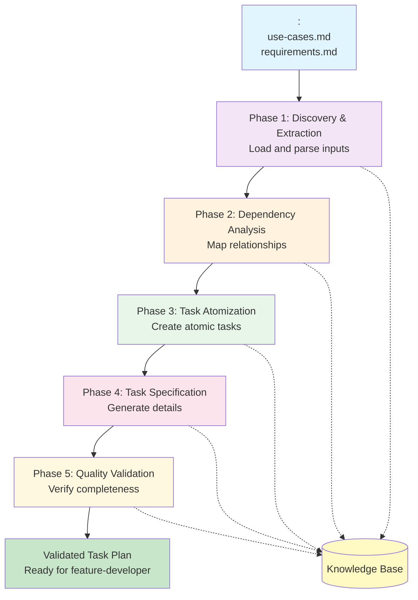

# Feature Task Creator: Use Case to Atomic Task Transformation

**Template**: feature-task-creator  
**Context**: `<prompt-arguments>`  
**Purpose**: Transform use cases and requirements into atomic, implementable tasks for feature-developer agent  
**Methodology**: Phased prompt-as-code with 5 phases × 7 stages for progressive task generation

## Executive Summary

This framework transforms use cases and requirements into atomic, parallel-executable tasks suitable for the feature-developer agent. Through 5 phases of analysis and refinement, it produces fully specified tasks with dependency graphs, ensuring complete requirement coverage and implementation readiness.

**Expected Inputs**: File paths to use-cases.md and requirements.md via `<prompt-arguments>`  
**Expected Outputs**: Atomic task specifications, dependency graphs, coverage reports, and execution order

## Phase Overview



## Execution Mode

```markdown
EXECUTION_MODE: Direct markdown output
OUTPUT_STRATEGY: Generate comprehensive markdown document
FILE_OPERATIONS: None - all processing in memory
RESULT_FORMAT: Single markdown document with all task specifications
```

---

## Phase 1: Discovery & Extraction

**PHASE_1_PURPOSE**: Extract file paths from arguments, validate existence, load and parse use cases and requirements

### Stage 1.1: Input Extraction

**STAGE_1.1_PURPOSE**: Extract and validate file paths from prompt arguments

BEFORE any other processing:
  Examine <prompt-arguments> for file paths
  
  **STAGE_1.1_INPUT**: <prompt-arguments>
  
  Extract from <prompt-arguments>:
    **USE_CASES_PATH**: path to use cases file (typically docs/use-cases.md)
    **REQUIREMENTS_PATH**: path to requirements file (typically docs/requirements.md)
    **ARCHITECTURE_PATH**: path to the architecture definition
    **TASK_CONTEXT**: any additional context about task creation
    **IMPLEMENTATION_CONSTRAINTS**: technology or resource constraints
  
  IF file paths not found in arguments THEN
    Search for common patterns:
      - "./use-cases.md" or "./docs/use-cases.md"
      - "./requirements.md" or "./docs/requirements.md"
      - "UC###:" patterns indicating inline use cases
      - "REQ-###:" patterns indicating inline requirements
  
  Track extracted inputs in memory:
    USE_CASES_PATH = [extracted path]
    REQUIREMENTS_PATH = [extracted path]
    TASK_CONTEXT = [any additional context]
    IMPLEMENTATION_CONSTRAINTS = [constraints]
  
  **STAGE_1.1_OUTPUT**: Validated input parameters in memory

### Stage 1.2: Context Preparation

**STAGE_1.2_PURPOSE**: Prepare context for file reading and parsing

WHEN beginning this stage:
  **STAGE_1.2_INPUT**: Extracted inputs from Stage 1.1
  
  Prepare context in memory:
    - File paths to read
    - Context parameters
    - Parsing patterns for use cases and requirements
  
  **STAGE_1.2_OUTPUT**: Context ready for file operations

### Stage 1.3: Planning

**STAGE_1.3_PURPOSE**: Plan approach for reading and parsing files

Based on rehydrated context:
  **STAGE_1.3_INPUT**: Merged context from stages 1.1 and 1.2
  
  Plan file reading strategy:
    1. Validate file existence using test -f
    2. Read file contents
    3. Parse use case format (UC###: [Name])
    4. Parse requirement format (REQ-###: [Description])
    5. Extract metadata (priorities, categories, dependencies)
  
  Track plan in memory:
    APPROACH: Sequential file reading with structured parsing
    STEPS:
      1. Validate USE_CASES_PATH exists
      2. Validate REQUIREMENTS_PATH exists
      3. Read and parse use cases
      4. Read and parse requirements
      5. Create structured data model
    SUCCESS_CRITERIA:
      - All files successfully read
      - All UC### patterns extracted
      - All REQ-### patterns extracted
      - Structured data ready for analysis
  
  **STAGE_1.3_OUTPUT**: Documented extraction plan

### Stage 1.4: Review

**STAGE_1.4_PURPOSE**: Validate the extraction plan before execution

Before executing:
  **STAGE_1.4_INPUT**: Plan from stage 1.3
  
  Ask validation questions:
    - "Do the file paths look correct?"
    - "Are we prepared for different file formats?"
    - "Do we handle missing files gracefully?"
    - "Is the parsing strategy comprehensive?"
  
  IF plan incomplete THEN
    Note issues and return to Stage 1.3 with adjustments
  OTHERWISE
    Approve plan and proceed
  
  **STAGE_1.4_OUTPUT**: Validated extraction plan

### Stage 1.5: Execution

**STAGE_1.5_PURPOSE**: Read files and parse use cases and requirements with nuance detection

Execute the file reading plan:
  **STAGE_1.5_INPUT**: Approved plan from stage 1.4
  
  Validate file existence:
    IF NOT file exists at USE_CASES_PATH THEN
      ERROR: Use cases file not found at USE_CASES_PATH
      Output error and halt
    
    IF NOT file exists at REQUIREMENTS_PATH THEN
      ERROR: Requirements file not found at REQUIREMENTS_PATH
      Output error and halt
  
  Read and parse use cases:
    Content = read("<USE_CASES_PATH>")
    For each line matching "UC[0-9]+:":
      Extract UC ID, name, description
      Parse acceptance criteria
      Identify actors and dependencies
      Store in structured format
  
  Read and parse requirements:
    Content = read("<REQUIREMENTS_PATH>")
    For each line matching "REQ-[A-Z]+-[0-9]+:":
      Extract REQ ID, category, description
      Parse priority and type
      Identify related use cases
      Store in structured format
  
  Apply NUANCE_DETECTION_PATTERNS:
    Performance Indicators:
      "fast", "quick", "responsive", "real-time", "immediate" → Mark for performance task
      "within [0-9]+ms", "less than", "under" → Extract specific performance requirement
    
    Reliability Indicators:
      "always", "never", "must", "zero tolerance" → Mark for reliability task
      "graceful", "fallback", "recover" → Mark for error recovery task
      "without disruption", "transparently" → Mark for zero-downtime task
    
    Security Indicators:
      "secure", "private", "encrypted", "authenticated" → Mark for security task
      "permission", "authorized", "access control" → Mark for authorization task
      "sensitive", "confidential", "protected" → Mark for data protection task
    
    Usability Indicators:
      "intuitive", "easy", "simple", "clear" → Mark for UX task
      "accessible", "a11y", "screen reader" → Mark for accessibility task
      "color-coded", "visual", "formatted" → Mark for display task
    
    Scale Indicators:
      "concurrent", "multiple", "parallel", "simultaneous" → Mark for concurrency task
      "high volume", "scale", "load", "bulk" → Mark for scalability task
      "batch", "queue", "async" → Mark for async processing task
  
  Track progress in memory
  
  **STAGE_1.5_OUTPUT**: Parsed use cases and requirements with nuance markers

### Stage 1.6: Quality Check

**STAGE_1.6_PURPOSE**: Iteratively verify extraction completeness and accuracy

Evaluate extraction quality:
  **STAGE_1.6_INPUT**: Parsed data from stage 1.5
  
  FOR iteration FROM 1 TO maximum of 25:
    Calculate extraction metrics:
      - Use cases found: [count]
      - Requirements found: [count]
      - Parsing errors: [count]
      - Missing references: [count]
    
    Quality questions:
      - "Did we extract all UC### patterns?"
      - "Did we capture all REQ-### patterns?"
      - "Are descriptions complete?"
      - "Are relationships identified?"
    
    Calculate quality score (0-100):
      score = (extracted_items / expected_items) * 100
      
    IF quality score >= 95 THEN
      Mark phase as complete
      Break from iteration
    
    OTHERWISE identify improvements:
      - Check for alternative formats
      - Look for inline requirements
      - Parse nested structures
      
      Adjust parsing patterns
      Return to Stage 1.5 with refinements
      Track iteration progress in memory
  
  **STAGE_1.6_OUTPUT**: Quality-validated parsed data

### Stage 1.7: Phase Summary

**STAGE_1.7_PURPOSE**: Summarize discoveries for next phases

Summarize extracted data:
  **STAGE_1.7_INPUT**: Validated data from stages 1.1 through 1.6
  
  Store in memory for Phase 2:
    - Parsed use cases with IDs, names, descriptions, actors, acceptance criteria
    - Parsed requirements with IDs, categories, descriptions, priorities
    - Metadata: total counts, extraction quality score
    - Nuance markers detected
  
  **STAGE_1.7_OUTPUT**: Discoveries ready for Phase 2

---

## Phase 2: Dependency Analysis

**PHASE_2_PURPOSE**: Identify cross-cutting concerns, infrastructure needs, and map dependencies between use cases

### Stage 2.1: Input Extraction

**STAGE_2.1_PURPOSE**: Extract dependency analysis parameters

BEFORE analysis:
  **STAGE_2.1_INPUT**: <prompt-arguments> and Phase 1 outputs
  
  IF not in Phase 1 outputs, extract from <prompt-arguments>:
    **DEPENDENCY_RULES**: how to identify dependencies
    **CROSS_CUTTING_CATEGORIES**: types of concerns to identify
    **INFRASTRUCTURE_NEEDS**: technology stack requirements
    **PRIORITY_SCHEME**: how to prioritize tasks
  
  Define analysis categories:
    - Infrastructure: setup, configuration, deployment
    - Cross-cutting: auth, logging, error handling, caching
    - Data layer: models, migrations, repositories
    - API layer: endpoints, validation, serialization
    - UI layer: components, state, routing
    - Testing: unit, integration, E2E
  
  Track analysis parameters in memory
  
  **STAGE_2.1_OUTPUT**: Analysis parameters defined

### Stage 2.2: Data Preparation

**STAGE_2.2_PURPOSE**: Prepare Phase 1 discoveries for analysis

WHEN beginning analysis:
  **STAGE_2.2_INPUT**: Phase 1 discoveries and Stage 2.1 parameters
  
  Access Phase 1 outputs from memory:
    - Use cases array
    - Requirements array
    - Relationships
  
  Merge with analysis parameters:
    - Combine use cases with dependency rules
    - Apply cross-cutting categories
    - Create working dataset for analysis
  
  **STAGE_2.2_OUTPUT**: Complete dataset for dependency analysis

### Stage 2.3: Planning

**STAGE_2.3_PURPOSE**: Plan dependency discovery approach

Based on loaded data:
  **STAGE_2.3_INPUT**: Merged dataset from stage 2.2
  
  Plan analysis strategy:
    1. Identify infrastructure requirements
    2. Find cross-cutting concerns
    3. Map use case dependencies
    4. Create dependency graph
    5. Identify critical path
    6. Find parallelization opportunities
  
  Track plan in memory
  
  **STAGE_2.3_OUTPUT**: Dependency analysis plan

### Stage 2.4: Review

**STAGE_2.4_PURPOSE**: Validate analysis approach

Review the plan:
  **STAGE_2.4_INPUT**: Plan from stage 2.3
  
  Validation questions:
    - "Are all dependency types covered?"
    - "Is the analysis comprehensive?"
    - "Do we handle circular dependencies?"
  
  **STAGE_2.4_OUTPUT**: Validated analysis plan

### Stage 2.5: Execution

**STAGE_2.5_PURPOSE**: Multi-dimensional dependency analysis with comprehensive coverage

Execute dependency analysis:
  **STAGE_2.5_INPUT**: Validated plan from stage 2.4
  
  Apply MULTI_DIMENSIONAL_ANALYSIS framework:
  
  **Infrastructure Dependencies**:
    - Project initialization and setup
    - Environment configuration (dev/staging/prod)
    - Build system and toolchain setup
    - CI/CD pipeline configuration
    - Deployment infrastructure
    - Database setup and migrations
    - External service integrations
    - Monitoring and alerting setup
  
  **Technical Dependencies**:
    - Framework and library requirements
    - API/service dependencies
    - Database schema dependencies
    - Message queue requirements
    - Cache layer needs
    - Search infrastructure
    - File storage requirements
  
  **Data Dependencies**:
    For each feature:
      - Input data requirements and formats
      - Output data specifications
      - Data transformation pipelines
      - Data validation rules
      - Data persistence patterns
      - Data access patterns
      - Data migration needs
  
  **Cross-Cutting Concerns**:
    Scan all requirements for indicators:
      Authentication: "auth", "login", "user", "session", "token"
      Authorization: "permission", "role", "access", "allowed"
      Logging: "log", "audit", "track", "record"
      Error Handling: "error", "exception", "fail", "recover"
      Caching: "cache", "performance", "speed", "fast"
      Security: "secure", "encrypt", "protect", "safe"
      Validation: "validate", "check", "verify", "ensure"
      Monitoring: "monitor", "observe", "metric", "telemetry"
      Rate Limiting: "throttle", "limit", "quota", "restrict"
  
  **Integration Analysis**:
    - External API touchpoints
    - Third-party service dependencies
    - Webhook/callback requirements
    - Event/message bus interactions
    - Synchronization requirements
    - Data exchange formats
    - Backward compatibility needs
  
  **Resource Conflicts**:
    - Shared database tables
    - Concurrent file access
    - API rate limits
    - Memory constraints
    - CPU-intensive operations
    - Network bandwidth limits
    - Lock/mutex requirements
  
  **Use Case Dependencies**:
    For each use case UC_X:
      For each other use case UC_Y:
        Analyze relationship types:
          PREREQUISITE: UC_Y must complete before UC_X
          COREQUISITE: UC_X and UC_Y must coordinate
          SHARED_DATA: Both access same data models
          SHARED_INTERFACE: Both use same UI components
          SHARED_SERVICE: Both use same backend service
          CONFLICT: Both modify same resources
  
  Build comprehensive dependency graph:
    Create directed acyclic graph (DAG)
    Detect and resolve circular dependencies
    Calculate topological sort
    Identify critical path
    Find parallelization opportunities
    Group independent tasks
  
  **STAGE_2.5_OUTPUT**: Multi-dimensional dependency analysis

### Stage 2.6: Quality Check

**STAGE_2.6_PURPOSE**: Validate dependency analysis completeness

Quality validation:
  **STAGE_2.6_INPUT**: Analysis from stage 2.5
  
  FOR iteration FROM 1 TO maximum of 25:
    Check analysis quality:
      - All use cases analyzed? [yes/no]
      - Circular dependencies found? [count]
      - Cross-cutting concerns complete? [yes/no]
      - Infrastructure tasks identified? [yes/no]
    
    IF all checks pass THEN
      Break from iteration
    
    OTHERWISE refine:
      - Re-examine unanalyzed items
      - Resolve circular dependencies
      - Add missing concerns
      
      Return to Stage 2.5 with improvements
  
  **STAGE_2.6_OUTPUT**: Validated dependency analysis

### Stage 2.7: Phase Summary

**STAGE_2.7_PURPOSE**: Summarize dependency analysis for next phases

Summarize analysis results:
  **STAGE_2.7_INPUT**: Validated analysis from all stages
  
  Store in memory for Phase 3:
    - Infrastructure tasks identified
    - Cross-cutting concerns mapped
    - Use case dependencies analyzed
    - Dependency graph structure
    - Critical path calculated
    - Parallel execution groups identified
  
  **STAGE_2.7_OUTPUT**: Dependency analysis ready for Phase 3

---

## Phase 3: Task Atomization

**PHASE_3_PURPOSE**: Transform use cases and requirements into atomic, implementable tasks

### Stage 3.1: Input Extraction

**STAGE_3.1_PURPOSE**: Extract atomization rules and constraints

Extract task creation parameters:
  **STAGE_3.1_INPUT**: <prompt-arguments> and previous phases
  
  IF not defined, extract from <prompt-arguments>:
    **MAX_TASK_EFFORT**: maximum hours per task (default: 6)
    **TASK_GRANULARITY**: preferred task size (small/medium/large)
    **PARALLELIZATION_GOAL**: optimize for parallel execution
    **LAYER_SEPARATION**: enforce architectural layers
  
  Define atomization rules:
    - One task = One file OR One component OR One endpoint
    - Maximum effort: 6 hours
    - Single responsibility principle
    - Clear input/output boundaries
    - Testable in isolation
  
  **STAGE_3.1_OUTPUT**: Atomization parameters defined

### Stage 3.2: Data Preparation

**STAGE_3.2_PURPOSE**: Prepare discoveries and dependencies for task creation

Access previous phase outputs from memory:
  **STAGE_3.2_INPUT**: Phase 1 and 2 outputs, Stage 3.1 parameters
  
  From Phase 1:
    - Use cases with descriptions
    - Requirements with categories
    - Relationships and actors
  
  From Phase 2:
    - Infrastructure tasks
    - Cross-cutting concerns
    - Dependency graph
    - Critical path
  
  Merge into working dataset:
    - Each use case → potential tasks
    - Each requirement → implementation needs
    - Dependencies → task ordering
  
  **STAGE_3.2_OUTPUT**: Complete dataset for atomization

### Stage 3.3: Planning

**STAGE_3.3_PURPOSE**: Plan task decomposition strategy

Plan atomization approach:
  **STAGE_3.3_INPUT**: Merged dataset from stage 3.2
  
  Strategy for each use case:
    1. Identify affected layers (UI, API, Data, Logic)
    2. Create task per layer per component
    3. Ensure single responsibility
    4. Map to requirements
    5. Assign preliminary IDs
    6. Estimate effort
  
  Track plan in memory
  
  **STAGE_3.3_OUTPUT**: Atomization plan

### Stage 3.4: Review

**STAGE_3.4_PURPOSE**: Validate atomization strategy

Review atomization plan:
  **STAGE_3.4_INPUT**: Plan from stage 3.3
  
  Validation:
    - "Is granularity appropriate?"
    - "Are tasks truly atomic?"
    - "Can tasks execute in parallel?"
  
  **STAGE_3.4_OUTPUT**: Validated atomization plan

### Stage 3.5: Execution

**STAGE_3.5_PURPOSE**: Decompose use cases into atomic tasks with comprehensive rules

Execute atomization:
  **STAGE_3.5_INPUT**: Validated plan from stage 3.4
  
  Apply DECOMPOSITION_RULES framework:
  
  **Complexity-Based Decomposition**:
    For each requirement R:
      IF effort_estimate > 6 hours THEN
        Apply recursive decomposition:
          1. Identify logical sub-components
          2. Split into preparation, implementation, validation tasks
          3. Each sub-task must be ≤ 6 hours
          4. Maintain clear boundaries between sub-tasks
  
  **Layer-Based Decomposition**:
    For each use case UC:
      
      IF UC requires data storage THEN
        Create task: "T###: Design [Entity] data schema"
        Create task: "T###: Create [Entity] data model"
        Create task: "T###: Implement [Entity] repository"
        Create task: "T###: Create database migrations"
        Create task: "T###: Add data validation rules"
        Create task: "T###: Implement data access patterns"
      
      IF UC requires API THEN
        Create task: "T###: Design API contract for [Action]"
        Create task: "T###: Implement [Action] endpoint"
        Create task: "T###: Add request validation"
        Create task: "T###: Add response serialization"
        Create task: "T###: Implement error responses"
        Create task: "T###: Add API documentation"
      
      IF UC requires business logic THEN
        Create task: "T###: Design [Feature] service interface"
        Create task: "T###: Implement [Feature] service"
        Create task: "T###: Add business validation rules"
        Create task: "T###: Implement [Algorithm]"
        Create task: "T###: Add transaction management"
        Create task: "T###: Implement retry logic"
      
      IF UC requires UI THEN
        Create task: "T###: Design [Component] interface"
        Create task: "T###: Create [Component] component"
        Create task: "T###: Implement [Feature] view"
        Create task: "T###: Add state management"
        Create task: "T###: Implement user interactions"
        Create task: "T###: Add form validation"
        Create task: "T###: Implement responsive design"
      
      IF UC requires integration THEN
        Create task: "T###: Design integration interface"
        Create task: "T###: Implement integration adapter"
        Create task: "T###: Add retry/circuit breaker"
        Create task: "T###: Implement data mapping"
        Create task: "T###: Add integration monitoring"
  
  **Requirement-Type Decomposition**:
    For each requirement by type:
      
      FUNCTIONAL requirements:
        - Core implementation task
        - Validation task
        - Error handling task
      
      PERFORMANCE requirements:
        - Baseline measurement task
        - Optimization implementation task
        - Performance testing task
      
      SECURITY requirements:
        - Threat modeling task
        - Security implementation task
        - Security testing task
      
      USABILITY requirements:
        - UX design task
        - Implementation task
        - Accessibility task
      
      RELIABILITY requirements:
        - Failure mode analysis task
        - Resilience implementation task
        - Chaos testing task
  
  **Cross-Cutting Decomposition**:
    For each cross-cutting concern:
      
      AUTHENTICATION:
        Create task: "T###: Design auth architecture"
        Create task: "T###: Implement auth provider"
        Create task: "T###: Add session management"
        Create task: "T###: Implement token validation"
      
      AUTHORIZATION:
        Create task: "T###: Design permission model"
        Create task: "T###: Implement role system"
        Create task: "T###: Add access control checks"
      
      LOGGING:
        Create task: "T###: Design logging strategy"
        Create task: "T###: Implement structured logging"
        Create task: "T###: Add audit logging"
      
      ERROR_HANDLING:
        Create task: "T###: Design error taxonomy"
        Create task: "T###: Implement error handlers"
        Create task: "T###: Add error recovery"
      
      MONITORING:
        Create task: "T###: Define metrics/SLIs"
        Create task: "T###: Implement instrumentation"
        Create task: "T###: Create dashboards"
  
  **Testing Decomposition**:
    For each feature F:
      Create task: "T###: Write unit tests for [F]"
      Create task: "T###: Create integration tests for [F]"
      Create task: "T###: Add E2E test scenarios for [F]"
      Create task: "T###: Add performance tests for [F]"
      Create task: "T###: Add security tests for [F]"
  
  **Infrastructure Decomposition**:
    For each infrastructure need:
      Create task: "T###: Design [Infrastructure] architecture"
      Create task: "T###: Implement [Infrastructure] setup"
      Create task: "T###: Add configuration management"
      Create task: "T###: Create deployment scripts"
      Create task: "T###: Add monitoring/alerting"
  
  Apply task numbering:
    - Infrastructure tasks: T001-T099
    - Cross-cutting tasks: T100-T199
    - Core feature tasks: T200-T599
    - Testing tasks: T600-T699
    - Documentation tasks: T700-T799
  
  **STAGE_3.5_OUTPUT**: Comprehensively decomposed atomic task list

### Stage 3.6: Quality Check

**STAGE_3.6_PURPOSE**: Validate task atomicity and completeness

Validate atomization:
  **STAGE_3.6_INPUT**: Task list from stage 3.5
  
  FOR iteration FROM 1 TO maximum of 25:
    Check each task:
      - Single responsibility? [yes/no]
      - Effort ≤ 6 hours? [yes/no]
      - Clear boundaries? [yes/no]
      - Testable in isolation? [yes/no]
    
    Check coverage:
      - All use cases have tasks? [yes/no]
      - All requirements addressed? [yes/no]
      - All layers covered? [yes/no]
    
    IF all validations pass THEN
      Break from iteration
    
    OTHERWISE refine:
      - Split large tasks
      - Combine tiny tasks
      - Clarify boundaries
      
      Return to Stage 3.5 with adjustments
  
  **STAGE_3.6_OUTPUT**: Validated atomic tasks

### Stage 3.7: Phase Summary

**STAGE_3.7_PURPOSE**: Summarize atomic tasks for specification phase

Summarize task list:
  **STAGE_3.7_INPUT**: Validated tasks from all stages
  
  Store in memory for Phase 4:
    - Complete list of atomic tasks with IDs
    - Task types and layers
    - Effort estimates
    - Use case and requirement mappings
    - Dependencies
    - Task boundaries (input/output/scope)
    - Statistics (total tasks, by type, by effort, parallelizable)
  
  **STAGE_3.7_OUTPUT**: Atomic task list ready for Phase 4

---

## Phase 4: Task Specification

**PHASE_4_PURPOSE**: Generate detailed specifications in feature-developer agent format

### Stage 4.1: Input Extraction

**STAGE_4.1_PURPOSE**: Extract specification format requirements

Extract specification parameters:
  **STAGE_4.1_INPUT**: <prompt-arguments> and feature-developer requirements
  
  Required fields for feature-developer:
    **EPIC_MAPPING**: how to group tasks into epics
    **STORY_MAPPING**: how to assign stories
    **PRIORITY_SCHEME**: P0 (critical) to P3 (low)
    **EFFORT_UNITS**: hours (1h, 2h, 4h, 6h)
    **TYPE_CATEGORIES**: Infrastructure|Feature|API|Data|UI|Test|Security|Performance
  
  **STAGE_4.1_OUTPUT**: Specification parameters

### Stage 4.2: Data Preparation

**STAGE_4.2_PURPOSE**: Prepare all previous outputs for specification generation

Access all phases from memory:
  **STAGE_4.2_INPUT**: Phases 1-3 outputs and Stage 4.1 parameters
  
  From Phase 1: Use cases and requirements
  From Phase 2: Dependencies and critical path
  From Phase 3: Atomic tasks with boundaries
  
  Create specification dataset:
    - Map tasks to epics/stories
    - Apply priority scheme
    - Include dependency chains
  
  **STAGE_4.2_OUTPUT**: Complete dataset for specifications

### Stage 4.3: Planning

**STAGE_4.3_PURPOSE**: Plan specification generation

Plan specification approach:
  **STAGE_4.3_INPUT**: Merged dataset from stage 4.2
  
  For each atomic task:
    1. Assign epic and story IDs
    2. Calculate priority based on critical path
    3. Confirm effort estimate
    4. List explicit dependencies
    5. Generate acceptance criteria
    6. Define testing requirements
  
  **STAGE_4.3_OUTPUT**: Specification plan

### Stage 4.4: Review

**STAGE_4.4_PURPOSE**: Validate specification approach

Review specification plan:
  **STAGE_4.4_INPUT**: Plan from stage 4.3
  
  Validate:
    - "All required fields covered?"
    - "Format matches feature-developer?"
    - "Dependencies explicit?"
  
  **STAGE_4.4_OUTPUT**: Validated specification plan

### Stage 4.5: Execution

**STAGE_4.5_PURPOSE**: Generate detailed task specifications

Generate specifications:
  **STAGE_4.5_INPUT**: Validated plan from stage 4.4
  
  For each task T:
    Generate specification:
      
      ### Task {T.id}: {T.name}
      
      **Epic**: EPIC-{epic_number} ({epic_name})
      **Story**: STORY-{story_number} ({story_name})
      **Priority**: P{0-3} based on critical path position
      **Effort**: {T.estimated_effort}
      **Dependencies**: [{dep_tasks}] or [None]
      **Type**: {T.type}
      
      **Objective**: {single_clear_goal}
      
      **Technical Specification**:
      - **Input**: {T.boundaries.input}
      - **Output**: {T.boundaries.output}
      - **Files to Create/Modify**:
        - `path/to/file1.ext` - {purpose}
        - `path/to/file2.ext` - {purpose}
      
      **Implementation Requirements**:
      1. {specific_requirement_1}
      2. {specific_requirement_2}
      3. {specific_requirement_3}
      
      **Acceptance Criteria**:
      - [ ] {testable_criterion_1}
      - [ ] {testable_criterion_2}
      - [ ] {testable_criterion_3}
      
      **Testing Requirements**:
      - Unit tests for {specific_functions}
      - Integration tests for {specific_flows}
      - Edge cases: {specific_scenarios}
      
      **Notes for feature-developer**:
      - {special_considerations}
      - {suggested_approach}
      - {potential_gotchas}
  
  **STAGE_4.5_OUTPUT**: Complete task specifications

### Stage 4.6: Quality Check

**STAGE_4.6_PURPOSE**: Validate specification completeness

Validate specifications:
  **STAGE_4.6_INPUT**: Specifications from stage 4.5
  
  FOR iteration FROM 1 TO maximum of 25:
    Check each specification:
      - All required fields present? [yes/no]
      - Dependencies valid? [yes/no]
      - Acceptance criteria clear? [yes/no]
      - Testing requirements defined? [yes/no]
    
    IF all specifications complete THEN
      Break from iteration
    
    OTHERWISE improve:
      - Add missing fields
      - Clarify vague criteria
      - Expand testing requirements
      
      Return to Stage 4.5 with improvements
  
  **STAGE_4.6_OUTPUT**: Validated specifications

### Stage 4.7: Phase Summary

**STAGE_4.7_PURPOSE**: Prepare complete specifications for validation

Summarize specifications:
  **STAGE_4.7_INPUT**: All validated specifications
  
  Store in memory for Phase 5:
    - Complete task specifications
    - Epic and story mappings
    - Priority distribution
    - Total effort calculation
  
  **STAGE_4.7_OUTPUT**: Complete task specifications ready for validation

---

## Phase 5: Quality Validation

**PHASE_5_PURPOSE**: Comprehensive validation ensuring all requirements covered and tasks ready for implementation

### Stage 5.1: Input Extraction

**STAGE_5.1_PURPOSE**: Extract validation criteria

Extract validation parameters:
  **STAGE_5.1_INPUT**: <prompt-arguments> and all phases
  
  Define validation criteria:
    **COVERAGE_REQUIREMENT**: 100% of use cases and requirements
    **DEPENDENCY_VALIDATION**: No circular, all resolvable
    **EFFORT_VALIDATION**: Reasonable and achievable
    **COMPLETENESS_CHECK**: All tasks fully specified
  
  **STAGE_5.1_OUTPUT**: Validation criteria defined

### Stage 5.2: Data Preparation

**STAGE_5.2_PURPOSE**: Prepare all outputs for final validation

Access everything from memory:
  **STAGE_5.2_INPUT**: All phase outputs and Stage 5.1 criteria
  
  From all phases:
    - Phase 1: Original use cases and requirements
    - Phase 2: Dependencies and critical path
    - Phase 3: Atomic task list
    - Phase 4: Complete specifications
  
  Create validation dataset
  
  **STAGE_5.2_OUTPUT**: Complete dataset for validation

### Stage 5.3: Planning

**STAGE_5.3_PURPOSE**: Plan validation approach

Plan validation:
  **STAGE_5.3_INPUT**: Complete dataset from stage 5.2
  
  Validation strategy:
    1. Coverage analysis
    2. Dependency validation
    3. Effort assessment
    4. Completeness check
    5. Implementation readiness
  
  **STAGE_5.3_OUTPUT**: Validation plan

### Stage 5.4: Review

**STAGE_5.4_PURPOSE**: Review validation approach

Review plan:
  **STAGE_5.4_INPUT**: Plan from stage 5.3
  
  Ensure comprehensive validation
  
  **STAGE_5.4_OUTPUT**: Approved validation plan

### Stage 5.5: Execution

**STAGE_5.5_PURPOSE**: Execute comprehensive validation with requirement traceability

Perform validation:
  **STAGE_5.5_INPUT**: Approved plan from stage 5.4
  
  Build REQUIREMENT_TRACEABILITY_MATRIX:
    Create matrix structure:
      Rows: All requirements (REQ-###)
      Columns: All tasks (T###)
      Cells: Coverage relationship
    
    For each requirement REQ:
      For each task T:
        Determine coverage type:
          DIRECT: Task directly implements requirement
          PARTIAL: Task partially addresses requirement
          INDIRECT: Task enables requirement
          NONE: No relationship
        
        Mark cell with coverage type
        Track coverage percentage
    
    Generate traceability report:
      ```markdown
      ## Requirement Traceability Matrix
      
      | Requirement | Description | Tasks | Coverage |
      |-------------|-------------|-------|----------|
      | REQ-FUN-001 | User login | T101, T102, T103 | 100% |
      | REQ-FUN-002 | Data export | T201, T202 (partial) | 75% |
      | REQ-SEC-001 | Encryption | T301 | 100% |
      | REQ-PER-001 | < 200ms response | T401, T402, T403 | 100% |
      
      ### Coverage Summary
      - Fully Covered: X requirements (Y%)
      - Partially Covered: X requirements (Y%)
      - Not Covered: X requirements (Y%)
      
      ### Uncovered Requirements
      [List any requirements with 0% coverage]
      
      ### High-Risk Partial Coverage
      [List critical requirements with < 100% coverage]
      ```
  
  Coverage analysis:
    For each use case UC:
      Check: Has corresponding tasks? [yes/no]
      Track: Task IDs that implement UC
      Calculate: Implementation completeness
      
      If UC not fully covered:
        Document gap: "UC### missing [component]"
        Suggest additional task
    
    For each requirement REQ:
      Check: Addressed by tasks? [yes/no]
      Track: Task IDs that implement REQ
      Analyze: Coverage percentage
      
      If REQ not fully covered:
        Document gap: "REQ-### needs [aspect]"
        Identify missing task type
    
    Calculate overall coverage:
      use_case_coverage = (covered_UCs / total_UCs) * 100
      requirement_coverage = (covered_REQs / total_REQs) * 100
      overall_coverage = (use_case_coverage + requirement_coverage) / 2
  
  Dependency validation:
    Build dependency graph
    Run cycle detection algorithm
    If circular dependencies found:
      Document cycles
      Suggest resolution
    
    Verify all task dependencies exist:
      For each task T with dependencies D:
        Verify each D references valid task
        Check dependency is logically sound
    
    Calculate critical path:
      Find longest dependency chain
      Identify bottleneck tasks
      Count parallel execution groups
  
  Effort assessment:
    Calculate totals:
      total_effort = sum(all task efforts)
      average_effort = total_effort / task_count
      
    Distribution analysis:
      infrastructure_effort = sum(T001-T099)
      crosscutting_effort = sum(T100-T199)
      feature_effort = sum(T200-T599)
      testing_effort = sum(T600-T699)
      
    Identify imbalances:
      If testing_effort < feature_effort * 0.3:
        Warning: Insufficient testing coverage
      If infrastructure_effort > feature_effort:
        Warning: Heavy infrastructure overhead
  
  Completeness validation:
    For each task T:
      Check required fields:
        - Has ID? [yes/no]
        - Has name? [yes/no]
        - Has epic? [yes/no]
        - Has story? [yes/no]
        - Has priority? [yes/no]
        - Has effort? [yes/no]
        - Has dependencies? [yes/no/none]
        - Has acceptance criteria? [yes/no]
        - Has testing requirements? [yes/no]
      
      If any field missing:
        Mark task incomplete
        Document missing field
  
  Nuance coverage check:
    Review nuance markers from Phase 1:
      For each nuance marker:
        Check: Has corresponding task? [yes/no]
        Track: Which task addresses it
      
      Performance nuances → Performance tasks
      Security nuances → Security tasks
      Usability nuances → UX tasks
      Scale nuances → Scalability tasks
  
  **STAGE_5.5_OUTPUT**: Comprehensive validation results with traceability matrix

### Stage 5.6: Quality Check

**STAGE_5.6_PURPOSE**: Ensure validation is thorough with comprehensive checklist

Validate the validation:
  **STAGE_5.6_INPUT**: Validation results from stage 5.5
  
  Apply COMPLETENESS_VALIDATION_CHECKLIST:
  
  FOR iteration FROM 1 TO maximum of 25:
    
    **Requirements Coverage Checklist**:
      □ All functional requirements have tasks? [yes/no]
      □ All non-functional requirements addressed? [yes/no]
      □ All security requirements implemented? [yes/no]
      □ All performance requirements measured? [yes/no]
      □ All usability requirements designed? [yes/no]
      □ All compliance requirements met? [yes/no]
      □ Traceability matrix shows 100% coverage? [yes/no]
    
    **Use Case Coverage Checklist**:
      □ All use cases have implementation tasks? [yes/no]
      □ All actors have interface tasks? [yes/no]
      □ All acceptance criteria have test tasks? [yes/no]
      □ All edge cases have handling tasks? [yes/no]
      □ All error scenarios have recovery tasks? [yes/no]
    
    **Task Completeness Checklist**:
      □ All tasks have unique IDs? [yes/no]
      □ All tasks have clear objectives? [yes/no]
      □ All tasks ≤ 6 hours effort? [yes/no]
      □ All tasks have defined boundaries? [yes/no]
      □ All tasks have acceptance criteria? [yes/no]
      □ All tasks have test requirements? [yes/no]
      □ All task dependencies valid? [yes/no]
    
    **Cross-Cutting Checklist**:
      □ Authentication tasks defined? [yes/no/na]
      □ Authorization tasks defined? [yes/no/na]
      □ Logging tasks defined? [yes/no/na]
      □ Error handling tasks defined? [yes/no/na]
      □ Monitoring tasks defined? [yes/no/na]
      □ Security tasks defined? [yes/no/na]
      □ Performance tasks defined? [yes/no/na]
    
    **Infrastructure Checklist**:
      □ Environment setup tasks? [yes/no]
      □ Database setup tasks? [yes/no/na]
      □ CI/CD pipeline tasks? [yes/no]
      □ Deployment tasks? [yes/no]
      □ Configuration tasks? [yes/no]
      □ Migration tasks? [yes/no/na]
    
    **Testing Checklist**:
      □ Unit test tasks for all components? [yes/no]
      □ Integration test tasks for all flows? [yes/no]
      □ E2E test tasks for all scenarios? [yes/no]
      □ Performance test tasks? [yes/no/na]
      □ Security test tasks? [yes/no/na]
      □ Accessibility test tasks? [yes/no/na]
    
    **Documentation Checklist**:
      □ API documentation tasks? [yes/no/na]
      □ User documentation tasks? [yes/no/na]
      □ Developer documentation tasks? [yes/no]
      □ Architecture documentation tasks? [yes/no]
      □ Deployment documentation tasks? [yes/no]
    
    **Nuance Coverage Checklist**:
      □ All performance indicators have tasks? [yes/no]
      □ All reliability indicators have tasks? [yes/no]
      □ All security indicators have tasks? [yes/no]
      □ All usability indicators have tasks? [yes/no]
      □ All scale indicators have tasks? [yes/no]
    
    Calculate completeness score:
      total_checks = count(all checklist items != "na")
      passed_checks = count(all "yes" responses)
      completeness_score = (passed_checks / total_checks) * 100
    
    IF completeness_score >= 95% AND no critical gaps THEN
      Mark as ready for feature-developer
      Break from iteration
    
    OTHERWISE identify and prioritize gaps:
      Critical gaps (must fix):
        - Missing functional requirements
        - Missing security requirements
        - Invalid task dependencies
        - Tasks > 6 hours
      
      Important gaps (should fix):
        - Missing test coverage
        - Missing error handling
        - Missing documentation
      
      Minor gaps (can defer):
        - Missing nice-to-have features
        - Optional optimizations
      
      FOR each critical gap:
        Document gap with specific details
        Identify which phase needs revision
        
        IF gap can be fixed in current iteration THEN
          Return to appropriate phase with specific fix
        ELSE
          Document as blocking issue
          Require user intervention
      
      FOR each important gap:
        Document as warning
        Suggest remediation task
      
      FOR each minor gap:
        Document as known limitation
        Add to future enhancement list
  
  Generate completeness report:
    ```markdown
    ## Completeness Validation Report
    
    ### Overall Score: {completeness_score}%
    
    ### Checklist Results
    - Requirements Coverage: X/Y passed
    - Use Case Coverage: X/Y passed
    - Task Completeness: X/Y passed
    - Cross-Cutting: X/Y passed
    - Infrastructure: X/Y passed
    - Testing: X/Y passed
    - Documentation: X/Y passed
    - Nuance Coverage: X/Y passed
    
    ### Critical Issues
    [List any blocking issues]
    
    ### Warnings
    [List important but non-blocking issues]
    
    ### Deferred Items
    [List minor gaps to address later]
    
    ### Recommendation
    [READY for feature-developer | NEEDS FIXES | BLOCKED]
    ```
  
  **STAGE_5.6_OUTPUT**: Comprehensive validation status with checklist results

### Stage 5.7: Final Output Generation

**STAGE_5.7_PURPOSE**: Generate comprehensive markdown output

Generate final markdown document:
  **STAGE_5.7_INPUT**: All validated outputs from all phases
  
  OUTPUT the following markdown document directly:
    # Feature Implementation Task Plan
    
    ## Task Dependency Graph
    [Mermaid diagram showing all tasks with dependencies]
    
    ## Execution Summary
    - **Total Tasks**: {count}
    - **Critical Path Length**: {sequential_tasks}
    - **Parallel Execution Groups**: {groups}
    - **Estimated Total Effort**: {hours}h
    - **Infrastructure Tasks**: {count}
    - **Feature Tasks**: {count}
    - **Test Tasks**: {count}
    
    ## Requirement Traceability Matrix
    
    | Requirement | Description | Tasks | Coverage |
    |-------------|-------------|-------|----------|
    | REQ-FUN-001 | [Description] | T###, T### | 100% |
    | REQ-FUN-002 | [Description] | T###, T### | 100% |
    [All requirements with task mappings]
    
    ### Coverage Statistics
    - **Functional Requirements**: X/Y (Z%) covered
    - **Non-Functional Requirements**: X/Y (Z%) covered  
    - **Security Requirements**: X/Y (Z%) covered
    - **Performance Requirements**: X/Y (Z%) covered
    - **Usability Requirements**: X/Y (Z%) covered
    
    ## Completeness Validation Report
    
    ### Overall Completeness Score: {score}%
    
    ### Validation Checklist Results
    ✅ Requirements Coverage: {X}/{Y} checks passed
    ✅ Use Case Coverage: {X}/{Y} checks passed
    ✅ Task Completeness: {X}/{Y} checks passed
    ✅ Cross-Cutting: {X}/{Y} checks passed
    ✅ Infrastructure: {X}/{Y} checks passed
    ✅ Testing: {X}/{Y} checks passed
    ✅ Documentation: {X}/{Y} checks passed
    ✅ Nuance Coverage: {X}/{Y} checks passed
    
    ### Critical Findings
    - **Fully Covered Requirements**: {count} ({percentage}%)
    - **Partially Covered Requirements**: {count} ({percentage}%)
    - **Uncovered Requirements**: {count} ({percentage}%)
    - **High-Risk Gaps**: [List critical missing coverage]
    
    ### Nuance Detection Results
    - **Performance Nuances Detected**: {count} → Tasks created: {count}
    - **Security Nuances Detected**: {count} → Tasks created: {count}
    - **Reliability Nuances Detected**: {count} → Tasks created: {count}
    - **Usability Nuances Detected**: {count} → Tasks created: {count}
    - **Scale Nuances Detected**: {count} → Tasks created: {count}
    
    ## Priority 0: Infrastructure Tasks (Must Complete First)
    [Detailed task list with specifications]
    
    ## Priority 1: Cross-Cutting Foundation
    [Detailed task list with specifications]
    
    ## Priority 2: Core Features
    [Detailed task list with specifications]
    
    ## Priority 3: Enhancements
    [Detailed task list with specifications]
    
    ## Detailed Task Specifications
    [All task specifications in feature-developer format]
    
    ## Dependency Analysis
    
    ### Critical Path
    ```
    {T001} → {T002} → {T003} → ... → {T###}
    Total Duration: {hours} hours
    ```
    
    ### Bottleneck Analysis
    - **Task {T###}**: Blocks {count} downstream tasks
    - **Task {T###}**: Blocks {count} downstream tasks
    
    ### Parallel Execution Opportunities
    - **Group A**: Tasks {T###, T###, T###} can run in parallel
    - **Group B**: Tasks {T###, T###, T###} can run in parallel
    
    ## Implementation Readiness Assessment
    
    ### Task Quality Metrics
    - ✅ All tasks atomic (≤ 6 hours): {yes/no}
    - ✅ All dependencies valid: {yes/no}
    - ✅ All tasks estimated: {yes/no}
    - ✅ All acceptance criteria defined: {yes/no}
    - ✅ All test requirements specified: {yes/no}
    
    ### Coverage Gaps (If Any)
    - **Missing Requirements Coverage**: [List]
    - **Missing Use Case Coverage**: [List]
    - **Missing Test Coverage**: [List]
    
    ### Risk Assessment
    - **High Risk Items**: [List critical gaps]
    - **Medium Risk Items**: [List important gaps]
    - **Low Risk Items**: [List minor gaps]
    
    ## Recommended Execution Order
    
    ### Phase 1: Foundation (Week 1)
    Critical infrastructure and setup tasks
    - [ ] Task T001: [Name] - {effort}h
    - [ ] Task T002: [Name] - {effort}h - depends on T001
    
    ### Phase 2: Cross-Cutting (Week 2)
    Authentication, logging, error handling
    - [ ] Task T100: [Name] - {effort}h
    - [ ] Task T101: [Name] - {effort}h (parallel with T100)
    
    ### Phase 3: Core Implementation (Week 3-4)
    Main feature development
    
    #### Parallel Stream A:
    - [ ] Task T200: [Name] - {effort}h
    - [ ] Task T201: [Name] - {effort}h
    
    #### Parallel Stream B:
    - [ ] Task T250: [Name] - {effort}h
    - [ ] Task T251: [Name] - {effort}h
    
    ### Phase 4: Testing & Polish (Week 5-6)
    Comprehensive testing and documentation
    - [ ] Task T600: [Name] - {effort}h
    - [ ] Task T601: [Name] - {effort}h
    
    ## Final Status
    
    **Implementation Readiness**: {READY | NEEDS_REVIEW | BLOCKED}
    **Completeness Score**: {score}%
    **Total Effort Required**: {hours} hours
    **Recommended Team Size**: {count} developers
    **Estimated Duration**: {weeks} weeks
  
  
  **STAGE_5.7_OUTPUT**: Complete markdown document with all task specifications

---

## Error Handling

```markdown
IF files cannot be found or read:
  ERROR: Cannot locate required files from <prompt-arguments>
  
  Expected format:
    - Use cases file: path/to/use-cases.md
    - Requirements file: path/to/requirements.md
  
  Provided arguments: [show what was provided]
  
  File check results:
    - {path}: {exists|not found|no permission}
  
  Recovery attempts:
    - Searched for common locations: ./docs/, ./
    - Looked for inline content: {found|not found}
  
  Please provide valid file paths to continue.
```

---

## Anti-Patterns to Avoid

### Task Creation Anti-Patterns
- **Monolithic tasks**: Tasks exceeding 6 hours of effort
- **Vague specifications**: Tasks without clear acceptance criteria
- **Circular dependencies**: Task A depends on B, B depends on A
- **Missing foundations**: Feature tasks before infrastructure
- **Untestable tasks**: Tasks with no measurable outcome
- **Overlapping scope**: Multiple tasks doing the same thing

### Dependency Anti-Patterns
- **Over-serialization**: Making everything sequential unnecessarily
- **Hidden dependencies**: Not documenting shared resources
- **Premature optimization**: Performance tasks before features work
- **Security afterthought**: Adding security as final tasks only
- **Missing parallelization**: Not identifying parallel opportunities

### Quality Anti-Patterns
- **Incomplete coverage**: Missing use cases or requirements
- **No error handling**: Forgetting error case tasks
- **Missing tests**: No test tasks for features
- **Documentation gap**: No documentation tasks
- **Deployment oversight**: No CI/CD tasks
- **Accessibility ignored**: No accessibility compliance tasks

---

## Execution Reminder

**Think systematically**: Infrastructure → Foundation → Features → Testing → Deployment

**Validate thoroughly**: Every use case and requirement must map to implementable tasks

**Enable parallelism**: Maximize concurrent execution opportunities for efficiency

**Ensure atomicity**: Each task must be independently implementable with clear boundaries

**Quality first**: Use iterations wisely to refine and improve task specifications

**Output mode**: Generate a single comprehensive markdown document as the output - no file creation

Execute this framework to transform use cases and requirements into a comprehensive markdown document containing all task specifications, dependency graphs, traceability matrices, and execution plans suitable for the feature-developer agent.