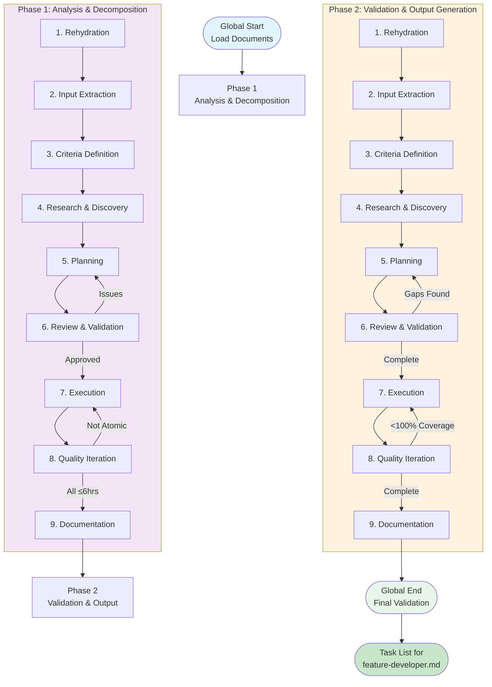

# Feature Task Creator: Atomic Task Decomposition Framework

**Template**: feature-task-creator
**Context**: `<prompt-arguments>`
**Purpose**: Transform use cases and requirements into atomic tasks for feature-developer.md
**Methodology**: Prompt-as-code using natural language directives with progressive task atomization

## Executive Summary

This framework transforms high-level use cases and requirements into **LLM-executable tasks** with rich context preservation for feature-developer.md execution.

**Core Architecture**:
- **Global Start**: Framework initialization and document loading
- **Phase 1**: Analysis & Decomposition (extract rich context → complexity-based tasks)
- **Phase 2**: Validation & Output Generation (tasks → LLM-optimized format with full guidance)
- **Global End**: Comprehensive validation and delivery

**Progressive Intelligence**:
- Each phase builds on accumulated wisdom through rehydration
- Quality achieved through iteration loops (max 10 per activity)
- Information richness preserved from use cases, requirements, and architecture

## LLM-Centric Task Architecture

This framework creates complexity-based tasks optimized for LLM execution:

### Information Preservation Hierarchy

```
INPUT DOCUMENTS: Rich contextual information
├── Use Cases: Goals, Definition of Ready/Done, Flows
├── Requirements: Statements, Implementation Guidance, Acceptance Criteria
└── Architecture: Technology Decisions, Trade-offs, Patterns

EXECUTION PHASES: Organized by dependency order
├── Phase 0: One-time Setup (infrastructure, environment)
├── Phase 1: Migration Tasks (data, schema, compatibility)
├── Phase 2-3: Feature Tasks (core logic, UI/UX) - Parallel eligible
├── Phase 4: Integration Tasks (cross-feature, external services)
├── Phase 5: Validation Tasks (tests, quality assurance)
└── Phase 6: CI/CD Tasks (pipelines, deployment)
```

### Complexity-Based Sizing (Not Time)

- **atomic**: Single clear outcome, minimal context (1 file, <100 lines)
- **simple**: Limited scope, known patterns (2-3 files, <300 lines)
- **moderate**: Multiple components, some integration (5-10 files, <500 lines)
- **complex**: Cross-cutting concern, heavy integration (10+ files, <1000 lines)

---

## GLOBAL START

**Execute ONCE at the beginning to initialize the framework**

### Framework Initialization

```markdown
WHEN starting the feature task creation process:

1. SET GLOBAL VARIABLES (once only):
   <worktree> = $(pwd)  # Never change this
   <original-requirements> = <prompt-arguments>

2. CREATE DIRECTORY STRUCTURE:
   mkdir -p "<worktree>/planning"        # Phase documentation
   mkdir -p "<worktree>/pending"         # New task files awaiting implementation
   mkdir -p "<worktree>/completed"       # Completed task files after implementation
   mkdir -p "<worktree>/docs"            # Requirements and specs

3. ESTABLISH PATH DISCIPLINE:
   - NEVER use cd, pushd, popd, or directory changing commands
   - ALWAYS use absolute paths: <worktree>/pending/task-001.md
   - ALWAYS use git -C "<worktree>" for ALL git operations

4. DETERMINE INPUT SOURCES:
   Parse <prompt-arguments> to identify:
   - Use cases document path (e.g., docs/use-cases.md)
   - Requirements document path (e.g., docs/requirements.md)
   - Architecture document path (e.g., docs/architecture.md)

   IF any document missing THEN:
     Log warning but continue with available documents
     Note gaps for manual specification during execution

5. DETECT EXISTING TASKS:
   Scan <worktree>/completed/ directory:
   - List all existing task-*.md files
   - Extract requirement IDs and use case IDs from each
   - Build satisfaction inventories:
     ```
     satisfied_requirements = {
       "REQ-001": "TASK-001",
       "REQ-002": "TASK-002"
     }
     satisfied_use_cases = {
       "UC001": ["TASK-001", "TASK-003"],
       "UC002": ["TASK-002"]
     }
     ```
   - Note task titles and complexity for comparison

6. LOAD INITIAL CONTEXT:
   Read and validate input documents:
   - Extract use case count and complexity
   - Identify requirement categories and priorities
   - Note architectural constraints and decisions
   - Compare against existing task coverage

7. ESTABLISH SUCCESS METRICS:
   - Delta Efficiency: Avoid regenerating unchanged tasks
   - Use Case Coverage: All changed/new use cases have tasks
   - Requirement Coverage: All changed/new requirements have tasks
   - Dependency Resolution: All dependencies mapped
   - Output Compatibility: Valid feature-developer.md format
```

### Task Decomposition Flow Visualization



Framework is now initialized and ready for task decomposition.

---

## Phase 1: Analysis & Decomposition

### Phase Purpose & Dependencies

**PHASE_PURPOSE**: Extract rich context from inputs and organize into complexity-based, LLM-executable tasks

**DEPENDENCIES**:
- Original requirements from `<prompt-arguments>`
- Use cases document (Definition of Ready/Done, Flows)
- Requirements document (Implementation Guidance, Acceptance Criteria)
- Architecture document (Technology Decisions, Patterns)

**DELIVERABLES**:
- Complexity-scored task list organized by execution phase
- Dependency graph with clear sequencing
- Rich context preservation for each task

---

### Phase 1 Activities

**Execute activities in sequence with quality loops**

#### 1. Rehydration & Intelligence Loading

Since this is the first phase, establish baseline intelligence:

```markdown
Initialize decomposition intelligence:
- Load existing task satisfaction maps from Global Start
- Establish delta detection context:
  ```
  existing_tasks = load from Global Start
  satisfied_requirements = requirement → task mapping
  satisfied_use_cases = use case → tasks mapping
  ```
- Prepare decomposition rules for NEW and MODIFIED items only
- Set up change detection patterns

Document initialization in: <worktree>/planning/phase-1.md
Include: Existing task inventory and coverage analysis
```

#### 2. Input Extraction & Validation

Extract and validate all input documents with rich context:

```markdown
Load available documents from <worktree>/docs/:
- Parse use-cases.md:
  - Extract Definition of Ready for each use case
  - Extract Basic Flow steps
  - Extract Definition of Done criteria
  - Note confidence levels and dependencies

- Extract requirements.md:
  - Implementation Guidance sections
  - Acceptance Criteria (preserve verbatim)
  - Testing Strategy details
  - Priority and complexity indicators

- Review architecture.md:
  - Technology decisions with rationale
  - Trade-offs accepted
  - Patterns and anti-patterns
  - Priority assignments per category

For each document:
- Preserve rich context structure
- Maintain traceability links
- Note information completeness

Document any gaps that affect task generation.
```

#### 3. Criteria Definition (Runtime Intelligence)

Define success criteria for LLM-executable task generation:

```markdown
**COMPLEXITY_CRITERIA**: Tasks sized by integration density, not time
- atomic: Single outcome, minimal context
- simple: Limited scope, known patterns
- moderate: Multiple components, some integration
- complex: Cross-cutting, heavy integration

**EXECUTION_PHASE_CRITERIA**: Tasks organized by dependency order
- Phase 0: One-time setup tasks
- Phase 1: Migration tasks
- Phase 2-3: Core feature tasks (parallel eligible)
- Phase 4: Integration tasks
- Phase 5: Validation tasks
- Phase 6: CI/CD tasks

**CONTEXT_PRESERVATION_CRITERIA**: Rich information maintained
- Definition of Ready from use cases
- Implementation Guidance from requirements
- Architectural Context from architecture.md
- Acceptance Criteria preserved verbatim
- Definition of Done from use cases
- Testing Strategy from requirements

**LLM_READINESS_CRITERIA**: Tasks executable by AI agents
- Outcome-focused (what to achieve, not how)
- Guidance over prescription
- Success validation measurable
- Context requirements specified
```

#### 4. Research & Discovery

Analyze requirements for LLM-optimized decomposition with delta detection:

```markdown
For each use case and requirement pair:

PERFORM DELTA ANALYSIS:
1. Check use case satisfaction:
   IF use_case_id in satisfied_use_cases:
     Compare use case essence:
     - Definition of Ready changed?
     - Basic Flow modified?
     - Definition of Done different?

     IF use case unchanged AND requirement unchanged:
       SKIP - Mark as already satisfied
       LOG: "UC-XXX + REQ-YYY implemented in TASK-ZZZ"
     ELIF use case unchanged BUT requirement modified:
       FLAG for technical modification task
     ELIF use case modified:
       FLAG for feature modification task(s)
   ELSE:
     FLAG for new feature task creation

2. Detect change types:
   - **Use Case Changes**: Flow, goals, or success criteria
   - **Requirement Changes**: Technical criteria or constraints
   - **Both Changed**: Significant feature revision needed
   - **New Items**: Full implementation required

For items requiring tasks (not skipped):

Map to execution phases:
- **Phase 0 (Setup)**: Infrastructure, environment, dependencies
- **Phase 1 (Migration)**: Data transformation, schema changes
- **Phase 2-3 (Features)**: Core logic, UI components
- **Phase 4 (Integration)**: Service connections, cross-feature
- **Phase 5 (Validation)**: Testing, quality assurance
- **Phase 6 (CI/CD)**: Deployment, monitoring

Assess complexity dimensions:
- **Context Requirements**: How many concepts/files to understand
- **Integration Density**: Standalone vs heavily coupled
- **Algorithmic Complexity**: Simple pattern vs novel algorithm
- **Modification Scope**: For updates, how much changes

Extract rich context (only for new/modified items):
- **From Use Cases**:
  - Definition of Ready conditions
  - Basic Flow steps
  - Definition of Done criteria
  - What changed (for modifications)

- **From Requirements**:
  - Implementation Guidance
  - Acceptance Criteria
  - Testing Strategy
  - Delta from previous version

- **From Architecture**:
  - Technology stack decisions
  - Pattern recommendations
  - Trade-offs and constraints

Document:
- Satisfied items (skipped): [list]
- Modified items (update tasks): [list]
- New items (new tasks): [list]
```

#### 5. Planning

Plan the LLM-centric decomposition strategy:

```markdown
Create decomposition approach:

1. Organize requirements by execution phase (0-6)
2. Group related use cases within phases
3. Identify parallel execution opportunities
4. Score complexity for each task group
5. Plan context preservation strategy

Consider LLM decomposition rules:
- Complex tasks must be split (not by time, by integration)
- Preserve all Definition of Ready/Done information
- Maintain Implementation Guidance without prescription
- Include Architectural Context for decisions
- Keep Acceptance Criteria testable and clear
```

#### 6. Review & Validation

Validate the decomposition plan:

```markdown
Review planned approach:
- Does every requirement have a decomposition strategy?
- Are all identified dependencies addressable?
- Is the time estimation realistic?
- Are there any circular dependencies?

IF issues found:
  Return to Planning with adjustments
ELSE:
  Proceed to execution
```

#### 7. Execution

Apply LLM-optimized decomposition to delta items only:

```markdown
Process based on delta analysis results:

FOR SKIPPED ITEMS (unchanged):
  - Add to satisfaction report
  - Note existing task IDs
  - No task generation needed

FOR TECHNICAL MODIFICATIONS (requirement changed, use case unchanged):
  1. Create update task:
     - Task ID: TASK-XXX-mod
     - Title: "Update [feature] for [requirement change]"
     - Complexity: Usually simple/atomic
     - Note what technical criteria changed

FOR FEATURE MODIFICATIONS (use case changed):
  1. Create revision task(s):
     - Task ID: TASK-XXX-mod (or multiple)
     - Title: "Revise [feature] for [use case change]"
     - Complexity: Usually moderate/complex
     - Document flow changes

FOR NEW ITEMS:
  1. Assign to execution phase:
     - Determine primary phase (0-6)
     - Note if parallel-eligible within phase
     - Mark cross-phase dependencies

  2. Extract rich context:
     - Pull Definition of Ready from use case
     - Extract Implementation Guidance from requirement
     - Include Architectural Context from architecture.md
     - Preserve Acceptance Criteria verbatim
     - Copy Definition of Done from use case
     - Include Testing Strategy from requirement

  3. Apply complexity scoring:
     - Count integration points
     - Assess algorithmic complexity
     - Evaluate state management needs
     - Score: atomic/simple/moderate/complex

For all generated tasks (new and modifications):

4. Map dependencies and detect cycles:
   - Note prerequisite tasks (including existing ones)
   - Build directed dependency graph
   - Run cycle detection algorithm:
     ```
     For each task T:
       visited = empty set
       recursion_stack = empty set
       IF detect_cycle(T, visited, recursion_stack):
         IDENTIFY cycle participants
         PROPOSE cycle breaking strategy:
           - Extract shared setup task
           - Use event-based decoupling
           - Implement facade pattern
     ```
   - Identify parallel opportunities
   - Mark shared resources

5. Validate completeness:
   - Ensure all context sections populated
   - Verify guidance is non-prescriptive
   - Check testability of outcomes

Generate task list containing only new and modified tasks.
```

#### 8. Quality Iteration Loop

Refine tasks until all are LLM-executable:

```markdown
FOR iteration FROM 1 TO 10:

  Evaluate generated tasks (exclude skipped items):
  - Count tasks with complexity > "complex"
  - Check context completeness percentage
  - Validate phase organization
  - Verify delta detection accuracy

  Calculate quality score:
  - Delta Efficiency: (correctly skipped / total unchanged) * 20
  - Complexity: (appropriately sized tasks / total new) * 20
  - Context: (tasks with full context / total generated) * 25
  - Coverage: (changed items with tasks / total changed) * 20
  - Phase Organization: (correctly phased / total) * 15

  IF quality score >= 90:
    Break from loop (phase complete)

  OTHERWISE:
    **KEY LEARNING**: Document gaps

    For incorrect delta detection:
      Review change detection logic
      Adjust use case comparison criteria
      Fix requirement change detection

    For overly complex tasks:
      Apply further decomposition
      Split by integration boundaries
      Separate concerns by phase

    For incomplete context:
      Extract missing Definition of Ready/Done
      Add Implementation Guidance
      Include Architectural Context

    For phase issues:
      Re-evaluate execution order
      Fix dependency conflicts

    Return to Execution with refinements
```

#### 9. Documentation & Knowledge Capture

Document decomposition results with delta analysis:

```markdown
Save to: <worktree>/planning/phase-1.md

Include:
## Delta Analysis Summary
- Total use cases analyzed: X
- Unchanged (skipped): Y (Z%)
- Modified: A (B%)
- New: C (D%)

## Skipped Items (Already Satisfied)
| Use Case | Requirements | Existing Tasks | Status |
|----------|-------------|---------------|---------|
| UC001    | REQ-001,002 | TASK-001,002  | ✓ Unchanged |

## Generated Tasks
- New feature tasks: X tasks
- Modification tasks: Y tasks
- Technical updates: Z tasks

### Task List (Only New/Modified)
Task-050: New authentication flow
- Execution Phase: 2-feature-core
- Complexity: moderate
- Type: new
- Requirements: REQ-AUTH-003
- Use Cases: UC015

Task-001-mod: Update login for OAuth2
- Execution Phase: 2-feature-core
- Complexity: simple
- Type: modification
- Modifies: TASK-001
- Change: Added OAuth2 support
```

---

## Phase 2: Validation & Output Generation

### Phase Purpose & Dependencies

**PHASE_PURPOSE**: Validate LLM-readiness and generate feature-developer.md compatible output with full context

**DEPENDENCIES**:
- Complexity-scored task list from Phase 1
- Execution phase assignments from Phase 1
- Rich context extractions from Phase 1
- Original documents for validation

**DELIVERABLES**:
- Complete traceability with context preservation
- Phase-organized task sequence diagram
- LLM-optimized task files with full guidance

---

### Phase 2 Activities

**Execute activities with focus on validation and output formatting**

#### 1. Rehydration & Intelligence Loading

Load Phase 1 results and patterns:

```markdown
Load from Phase 1:
- Read <worktree>/planning/phase-1.md
- Extract task list with complexity scores
- Load execution phase assignments
- Review rich context extractions
- Load dependency graph

Establish validation intelligence:
- Complexity distribution analysis
- Context completeness assessment
- Phase organization review
- Successful extraction patterns
```

#### 2. Input Extraction & Validation

Extract Phase 1 deliverables:

```markdown
From Phase 1 documentation:
- Load all tasks with complexity scores
- Extract execution phase assignments
- Get rich context sections per task
- Load dependency relationships
- Get requirement/use case mappings

Validate completeness:
- Check all tasks have complexity scores
- Verify execution phases are assigned
- Ensure context sections are populated
- Validate dependencies are resolvable
```

#### 3. Criteria Definition (Runtime Intelligence)

Define validation success criteria:

```markdown
**LLM_EXECUTABILITY_CRITERIA**: Tasks ready for AI agents
- Outcome-focused (what to achieve, not how)
- Rich context preserved from all inputs
- Guidance clear without prescription
- Success validation measurable

**PHASE_COHERENCE_CRITERIA**: Execution phases properly sequenced
- Setup (0) before features (2-3)
- Features before integration (4)
- Integration before validation (5)
- Validation before CI/CD (6)

**CONTEXT_COMPLETENESS_CRITERIA**: All sections populated
- Definition of Ready included
- Implementation Guidance present
- Architectural Context provided
- Acceptance Criteria preserved
- Definition of Done included
- Testing Strategy specified
```

#### 4. Research & Discovery

Analyze for validation gaps:

```markdown
Identify coverage gaps:
- Requirements without tasks
- Tasks without requirements
- Orphaned dependencies
- Circular dependencies

Discover critical path:
- Longest dependency chain
- Bottleneck tasks
- Parallel execution opportunities

Find integration points:
- Tasks requiring coordination
- Shared resource conflicts
- Testing dependencies
```

#### 5. Planning

Plan validation and output generation:

```markdown
Design validation approach:
1. Build requirement-task matrix
2. Validate 100% coverage
3. Identify critical path
4. Generate task sequence
5. Format for feature-developer.md

Plan output structure:
- Task file naming convention
- Directory organization
- Metadata format
- Sequence documentation
```

#### 6. Review & Validation

Pre-validate the approach:

```markdown
Review validation plan:
- Will this catch all coverage gaps?
- Is the critical path analysis complete?
- Does output format match feature-developer needs?
- Are all success criteria addressable?

IF issues found:
  Adjust planning approach
ELSE:
  Proceed to execution
```

#### 7. Execution

Generate traceability matrix with delta awareness:

```markdown
Build comprehensive traceability including existing coverage:

For each requirement:
  IF already satisfied:
    Reference existing task
    Note as "Unchanged"
  ELSE IF modified:
    Reference modification task
    Note as "Updated"
  ELSE:
    Reference new task
    Note as "New"

Create delta-aware traceability matrix:
| Requirement | Tasks | Coverage | Status | Change Type |
|-------------|-------|----------|--------|-------------|
| REQ-001     | TASK-001 | 100%   | ✓   | Unchanged   |
| REQ-002     | TASK-002-mod | 100% | ✓  | Modified    |
| REQ-050     | TASK-050 | 100%   | ✓   | New         |

Map use cases to tasks with change tracking:
| Use Case | Tasks | Coverage | Change Type |
|----------|-------|----------|-------------|
| UC-001   | TASK-001 | Full  | Unchanged   |
| UC-002   | TASK-002-mod | Full | Modified |
| UC-015   | TASK-050,051 | Full | New |

Identify and validate shared context:
- Extract common patterns across tasks
- Document shared resources and interfaces
- Validate interface compatibility:
  ```
  For each task T1 with exposed interfaces:
    For each dependent task T2:
      IF T2 consumes interface from T1:
        VERIFY interface contract compatibility:
          - Data types match
          - Required fields present
          - Version compatibility
        IF incompatible:
          LOG interface mismatch
          PROPOSE resolution:
            - Adapter pattern
            - Version negotiation
            - Interface versioning
  ```
- Validate shared constraints don't conflict:
  ```
  For each shared constraint C:
    affected_tasks = tasks referencing C
    IF constraint values differ across tasks:
      LOG constraint conflict
      PROPOSE resolution:
        - Establish single source of truth
        - Create configuration service
        - Document precedence rules
  ```
- Note integration points between tasks
- List common constraints and requirements

Generate critical path:
  Identify longest dependency chain
  Mark parallel execution groups
  Note resource bottlenecks
  Validate no cycles remain after Phase 1 fixes

Generate CI/CD tasks:
  After all feature tasks
  Include pipeline setup tasks
  Add deployment configuration
  Create validation and smoke test tasks
  Ensure CI/CD tasks reference shared context

Format tasks for feature-developer.md:
  Create individual task files
  Include metadata headers with use cases
  Add validated shared context section
  Specify dependencies and interfaces
  Include time estimation confidence level
```

#### 8. Quality Iteration Loop

Iterate until complete validation:

```markdown
FOR iteration FROM 1 TO 10:

  Calculate validation score:
  - Coverage: (requirements with tasks / total) * 35
  - Traceability: (documented links / total) * 25
  - Format: (valid task files / total) * 15
  - Interface Compatibility: (compatible interfaces / total) * 15
  - Constraint Consistency: (consistent constraints / total) * 10

  IF validation score >= 95:
    Break from loop (phase complete)

  OTHERWISE:
    **KEY LEARNING**: Document validation gaps

    For uncovered requirements:
      Create missing tasks
      Update traceability matrix

    For interface mismatches:
      Fix interface definitions
      Add adapter tasks if needed
      Update consuming task specifications

    For constraint conflicts:
      Resolve to single source of truth
      Update all affected tasks
      Document resolution in shared context

    For format issues:
      Fix task file structure
      Clarify descriptions
      Update dependencies

    Return to Execution with corrections
```

#### 9. Documentation & Knowledge Capture

Generate final deliverables:

```markdown
Save to: <worktree>/pending/

For each task, create: task-NNN.md (or task-NNN-mod.md for modifications)
---
task-id: TASK-NNN  # or TASK-NNN-mod for modifications
title: [Clear outcome-focused title]
task-type: [new|modification|technical-update]
execution-phase: [0-setup|1-migration|2-feature-core|3-feature-ui|4-integration|5-validation|6-ci-cd]
complexity: [atomic|simple|moderate|complex]
parallel-eligible: [true|false]
source-requirements: [REQ-XXX, REQ-YYY]
source-use-cases: [UC-XXX, UC-YYY]
modifies: [TASK-XXX]  # Only for modifications
change-reason: [Use case change|Requirement change|Both]  # Only for modifications
dependencies: [TASK-XXX, TASK-YYY]
---

## Outcome Definition
[Clear, measurable outcome - what exists after completion]

## Change Context
[Only for modifications: What changed and why]
- Original: [What was implemented before]
- Change: [What needs to be different]
- Reason: [Use case evolution, requirement update, etc.]

## Definition of Ready
[From use case - conditions that must be met before starting]
- Technical prerequisites
- Knowledge requirements
- Resource availability
- Dependency completion

## Implementation Guidance
[From requirement - non-prescriptive approach]
### Approach
[High-level strategy without implementation details]

### Primary Flow
[Main steps to achieve outcome]

### Error Handling
[Failure modes to consider]

## Architectural Context
[From architecture.md - technology decisions and patterns]
### Technology Stack
[Relevant technology choices with rationale]

### Patterns to Apply
[Architectural patterns from architecture.md]

### Trade-offs Accepted
[Conscious decisions and their implications]

## Acceptance Criteria
[From requirement - testable conditions]
- [ ] Given [context], when [action], then [outcome]
- [ ] Performance: [specific metrics]
- [ ] Security: [specific requirements]
- [ ] Quality: [specific standards]

## Definition of Done
[From use case - completion checklist]
- User: [What user can do]
- System: [What system provides]
- Data: [What data exists]
- Quality: [What quality achieved]
- Security: [What security ensured]

## Testing Strategy
[From requirement - validation approach]
- Unit: [What to unit test]
- Integration: [What to integration test]
- Performance: [What to measure]
- User Acceptance: [What to validate]

## Notes for feature-developer.md
- All implementation details are your decision
- Reference architecture.md for technology guidance
- Maintain consistency with tasks in same phase
- Coordinate through defined interfaces

---

Save summary to: <worktree>/planning/phase-2.md

## Delta Generation Report

### Coverage Analysis
- Total Use Cases: X (Y unchanged, Z changed/new)
- Total Requirements: A (B unchanged, C changed/new)
- Tasks Generated: D (E modifications, F new)
- Tasks Skipped: G (already satisfied)

### Efficiency Metrics
- Reuse Rate: X% of requirements already satisfied
- Delta Accuracy: Y% correctly identified as unchanged
- Generation Efficiency: Only Z% of total items needed tasks

### Generated Outputs
- Requirement-task traceability matrix (with change types)
- Use-case-task traceability matrix (with change tracking)
- Critical path analysis (considering existing tasks)
- Task sequence recommendation
- Shared context documentation
- Quality metrics achieved
```

---

## Task Execution Sequencing

### Generate Execution Phase Visualization

Create a mermaid diagram showing LLM execution phases and parallelization:

```markdown
Generate execution phase flowchart:

```mermaid
flowchart TD
    subgraph "Phase 0: One-Time Setup"
        T001[Infrastructure Setup]
        T002[Environment Config]
        T003[Dependencies Install]
        T001 --> T002 --> T003
    end

    subgraph "Phase 1: Migrations"
        T010[Schema Migration]
        T011[Data Transform]
        T012[Compatibility Shims]
        T010 --> T011 --> T012
    end

    subgraph "Phase 2: Core Features (Parallel)"
        T020[Data Models]
        T021[Business Logic]
        T022[Service Layer]
        T023[API Endpoints]
    end

    subgraph "Phase 3: UI/UX (Parallel)"
        T030[Components]
        T031[State Management]
        T032[User Flows]
        T033[Form Validation]
    end

    subgraph "Phase 4: Integration"
        T040[Feature Integration]
        T041[External Services]
        T042[Auth/Authorization]
        T040 --> T041 --> T042
    end

    subgraph "Phase 5: Validation"
        T050[Unit Tests]
        T051[Integration Tests]
        T052[E2E Tests]
        T053[Performance Tests]
        T050 --> T051 --> T052 --> T053
    end

    subgraph "Phase 6: CI/CD"
        T060[Pipeline Config]
        T061[Deploy Scripts]
        T062[Monitoring Setup]
        T060 --> T061 --> T062
    end

    %% Phase dependencies
    T003 --> T010  %% Setup before Migration
    T012 --> T020  %% Migration before Features
    T012 --> T030  %% Migration before UI
    T020 & T030 --> T040  %% Features/UI before Integration
    T042 --> T050  %% Integration before Validation
    T053 --> T060  %% Validation before CI/CD

    %% Styling by phase
    style T001 fill:#e1f5fe
    style T002 fill:#e1f5fe
    style T003 fill:#e1f5fe
    style T010 fill:#fff3e0
    style T020 fill:#f3e5f5
    style T030 fill:#fce4ec
    style T040 fill:#e8f5e9
    style T050 fill:#fff9c4
    style T060 fill:#c8e6c9
```

Provide LLM execution guidance:
- **Phase 0 (Setup)**: One-time infrastructure, must complete first
- **Phase 1 (Migration)**: Data/schema changes, sequential within phase
- **Phase 2-3 (Features/UI)**: Parallel execution possible by multiple agents
- **Phase 4 (Integration)**: Requires feature completion, sequential
- **Phase 5 (Validation)**: Testing tasks, can parallelize by test type
- **Phase 6 (CI/CD)**: Final deployment preparation, sequential

Generate execution analysis:
- Parallel execution opportunities: [Phase 2-3 tasks]
- Critical path: [Phase 0 → 1 → 4 → 5 → 6]
- Bottleneck phases: [Integration typically bottleneck]
- LLM agent allocation: [Suggest agent-per-feature strategy]
```

---

## GLOBAL END

**Execute AFTER both phases to ensure complete validation**

### Requirements and Use Case Validation

```markdown
1. LOAD ORIGINAL REQUIREMENTS AND USE CASES:
   Review <original-requirements> from Global Start
   Review existing task satisfaction maps

2. DELTA VALIDATION:
   For unchanged items:
   - Verify correctly skipped
   - Confirm existing task still valid

   For modified items:
   - Verify modification task created
   - Check change context documented

   For new items:
   - Verify new task created
   - Check full context provided

3. EVIDENCE GATHERING:
   For each requirement:
   - Find implementing tasks (existing or new)
   - Verify complexity scoring appropriate
   - Check dependency completeness

   For each use case:
   - Find implementing tasks (existing or new)
   - Verify end-to-end coverage
   - Check integration points

   Create final validation matrices:

   Requirements Coverage with Delta:
   | Requirement | Tasks | Status | Change Type |
   |-------------|-------|--------|-------------|
   | REQ-001 | TASK-001 | ✅ SATISFIED | Unchanged |
   | REQ-002 | TASK-002-mod | ✅ UPDATED | Modified |
   | REQ-050 | TASK-050 | ✅ NEW | New |

   Use Cases Coverage with Delta:
   | Use Case | Tasks | Coverage | Change Type |
   |----------|-------|----------|-------------|
   | UC-001 | TASK-001,003 | 100% | Unchanged |
   | UC-002 | TASK-002-mod | 100% | Modified |
   | UC-015 | TASK-050,051 | 100% | New |
```

### Global Quality Score Calculation

```markdown
GLOBAL_QUALITY_SCORE = (
  (DELTA_EFFICIENCY * 0.15) +            // Correctly skipped unchanged items
  (COMPLEXITY_APPROPRIATENESS * 0.15) +  // Tasks properly sized for LLMs
  (CONTEXT_COMPLETENESS * 0.20) +        // Rich context preserved
  (PHASE_ORGANIZATION * 0.15) +          // Correct execution sequencing
  (REQUIREMENT_COVERAGE * 0.15) +        // All changed requirements have tasks
  (USE_CASE_COVERAGE * 0.15) +          // All changed use cases traced
  (LLM_READINESS * 0.05)                // Guidance over prescription
)

Where DELTA_EFFICIENCY =
  (correctly_skipped_unchanged / total_unchanged_items)

MINIMUM_ACCEPTABLE_SCORE = 9.0/10.0

Quality Assessment:
- 9.5-10.0: Excellent - Ready for LLM execution
- 9.0-9.4: Good - Minor context additions may help
- 8.0-8.9: Acceptable - Some guidance gaps remain
- Below 8.0: Requires remediation
```

### Meta-Learning Extraction

```markdown
Extract insights for future use:

SUCCESSFUL PATTERNS:
- Which decomposition rules worked best?
- What estimation techniques were accurate?
- Which requirement types were easiest to decompose?

CHALLENGES ENCOUNTERED:
- Requirements that resisted decomposition
- Dependencies that were complex to map
- Time estimates that were difficult

FRAMEWORK IMPROVEMENTS:
- Additional decomposition patterns to consider
- Better time estimation heuristics
- Enhanced dependency detection
```

### Final Output Validation

```markdown
Verify feature-developer.md compatibility:

For each task file in <worktree>/pending/:
- ✓ Has unique task ID
- ✓ Has estimated hours ≤6
- ✓ Has clear dependencies
- ✓ Has acceptance criteria
- ✓ Maps to requirements

Generate final summary: <worktree>/docs/task-generation-summary.md

Include:
- Total tasks generated
- Total estimated hours
- Critical path length
- Parallel execution opportunities
- Implementation sequence recommendation

IF Global Quality Score < 9.0:
  Log specific issues for manual review
  Suggest remediation approach
ELSE:
  Mark as ready for feature-developer.md execution
```

### Remediation Process (If Quality Score < 9.0)

```markdown
REMEDIATION: Targeted Quality Recovery

1. GAP ANALYSIS:
   Identify specific quality failures:
   - Tasks still >6 hours
   - Requirements without tasks
   - Invalid output format

2. TARGETED FIXES:
   For each gap:
   - Apply additional decomposition
   - Create missing tasks
   - Fix format issues

3. RE-VALIDATION:
   Re-run Global End validation
   Calculate new quality score

4. FINAL DECISION:
   IF score still <9.0:
     Document remaining issues
     Provide manual intervention guide
   ELSE:
     Proceed with implementation
```

---

## Framework Behavior Guarantees

When using this framework:

1. **NO INFINITE LOOPS**: Maximum 10 iterations per quality check
2. **PROGRESSIVE REFINEMENT**: Each iteration improves context completeness
3. **COMPLETE COVERAGE**: All requirements and use cases get tasks
4. **COMPLEXITY BOUNDED**: All tasks sized appropriately for LLMs
5. **PHASE ORGANIZED**: Clear execution sequence with dependencies
6. **CONTEXT PRESERVED**: Rich information from all input documents
7. **LLM READY**: Guidance-focused format for AI agent execution

---

## Usage Example

```markdown
/prompt feature-task-creator docs/use-cases.md docs/requirements.md docs/architecture.md

GLOBAL START
├── Load documents with rich context extraction
└── Detect 45 existing tasks in <worktree>/completed/

PHASE 1: Analysis & Decomposition
├── Extract 42 use cases (25 unchanged, 5 modified, 12 new)
├── Extract 98 requirements (65 unchanged, 13 modified, 20 new)
├── Extract architecture decisions and patterns
├── SKIP 25 unchanged use cases (already satisfied)
├── Generate tasks for 17 changed/new use cases
├── Organize into execution phases
├── Apply complexity scoring
├── Iterate 2 times for delta accuracy
└── Generate 28 tasks (8 modifications, 20 new)

PHASE 2: Validation & Output
├── Validate delta detection accuracy
├── Verify context preservation
├── Build execution sequence diagram
├── Ensure 100% coverage of changed items
└── Create 28 task files (skipped 45 unchanged)

GLOBAL END
├── Delta Efficiency: 94% (correctly skipped unchanged)
├── Coverage: 100% of changed items have tasks
└── Quality Score: 9.5/10 - Ready for LLM execution
```

---

Execute this framework to transform requirements into atomic, implementable tasks optimized for feature-developer.md execution.