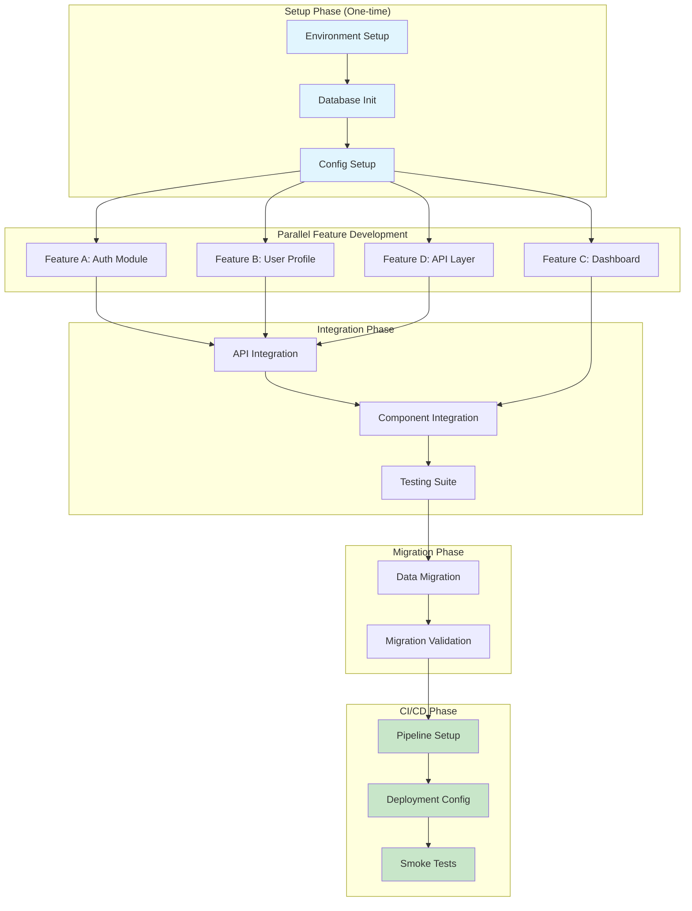

# Feature Task Creator: Atomic Task Decomposition Framework

**Template**: feature-task-creator
**Context**: `<prompt-arguments>`
**Purpose**: Transform use cases and requirements into atomic tasks for feature-developer.md
**Methodology**: Prompt-as-code using natural language directives with progressive task atomization

## Executive Summary

This framework transforms high-level use cases and requirements into **atomic, implementable tasks** suitable for feature-developer.md execution.

**Core Architecture**:
- **Global Start**: Framework initialization and document loading
- **Phase 1**: Analysis & Decomposition (requirements → atomic tasks)
- **Phase 2**: Validation & Output Generation (tasks → feature-developer format)
- **Global End**: Comprehensive validation and delivery

**Progressive Intelligence**:
- Each phase builds on accumulated wisdom through rehydration
- Quality achieved through iteration loops (max 10 per activity)
- Knowledge compounds to ensure complete requirement coverage

## Progressive Task Atomization Architecture

This framework creates atomic tasks through intelligent decomposition:

### Decomposition Hierarchy

```
REQUIREMENTS: High-level user needs
├── Use Cases: Specific user scenarios
├── Technical Requirements: System capabilities
└── Non-Functional Requirements: Quality attributes

ATOMIC TASKS: ≤6 hour implementable units
├── Setup Tasks: Environment and dependencies
├── Core Tasks: Primary functionality
├── Integration Tasks: Component connections
└── Validation Tasks: Testing and verification
```

### Quality Through Iteration

- **Phase 1 Iterations**: Refine decomposition until all tasks ≤6 hours
- **Phase 2 Iterations**: Ensure 100% requirement traceability
- **Global Validation**: Verify feature-developer.md compatibility

---

## GLOBAL START

**Execute ONCE at the beginning to initialize the framework**

### Framework Initialization

```markdown
WHEN starting the feature task creation process:

1. SET GLOBAL VARIABLES (once only):
   <worktree> = $(pwd)  # Never change this
   <original-requirements> = <prompt-arguments>

2. CREATE DIRECTORY STRUCTURE:
   mkdir -p "<worktree>/planning"        # Phase documentation
   mkdir -p "<worktree>/tasks"           # Generated task files
   mkdir -p "<worktree>/docs"            # Requirements and specs

3. ESTABLISH PATH DISCIPLINE:
   - NEVER use cd, pushd, popd, or directory changing commands
   - ALWAYS use absolute paths: <worktree>/tasks/task-001.md
   - ALWAYS use git -C "<worktree>" for ALL git operations

4. DETERMINE INPUT SOURCES:
   Parse <prompt-arguments> to identify:
   - Use cases document path (e.g., docs/use-cases.md)
   - Requirements document path (e.g., docs/requirements.md)
   - Architecture document path (e.g., docs/architecture.md)

   IF any document missing THEN:
     Log warning but continue with available documents
     Note gaps for manual specification during execution

5. LOAD INITIAL CONTEXT:
   Read and validate input documents:
   - Extract use case count and complexity
   - Identify requirement categories and priorities
   - Note architectural constraints and decisions

6. ESTABLISH SUCCESS METRICS:
   - Task Atomicity: 100% of tasks ≤6 hours
   - Requirement Coverage: 100% requirements have tasks
   - Dependency Resolution: All dependencies mapped
   - Output Compatibility: Valid feature-developer.md format
```

### Task Decomposition Flow Visualization


Framework is now initialized and ready for task decomposition.

---

## Phase 1: Analysis & Decomposition

### Phase Purpose & Dependencies

**PHASE_PURPOSE**: Transform requirements and use cases into atomic tasks (≤6 hours each)

**DEPENDENCIES**:
- Original requirements from `<prompt-arguments>`
- Use cases document (if available)
- Requirements document (if available)
- Architecture document (if available)

**DELIVERABLES**:
- Atomic task list with time estimates
- Dependency graph between tasks
- Task decomposition patterns for reuse

---

### Phase 1 Activities

**Execute activities in sequence with quality loops**

#### 1. Rehydration & Intelligence Loading

Since this is the first phase, establish baseline intelligence:

```markdown
Initialize decomposition intelligence:
- No previous phases to load
- Establish fresh analysis context
- Prepare decomposition rules and patterns

Document initialization in: <worktree>/planning/phase-1.md
```

#### 2. Input Extraction & Validation

Extract and validate all input documents:

```markdown
Load available documents from <worktree>/docs/:
- Parse use-cases.md for user scenarios
- Extract requirements.md for system needs
- Review architecture.md for technical constraints

For each document:
- Validate format and structure
- Extract relevant sections
- Note any missing or unclear content

Document gaps that need manual specification.
```

#### 3. Criteria Definition (Runtime Intelligence)

Define success criteria for task decomposition:

```markdown
**ATOMICITY_CRITERIA**: Tasks must be implementable in ≤6 hours
- Include setup, implementation, and basic testing
- Account for complexity and dependencies
- Consider developer experience level

**COMPLETENESS_CRITERIA**: 100% requirement coverage
- Every requirement maps to at least one task
- Edge cases have dedicated tasks
- Non-functional requirements addressed

**USE_CASE_TRACEABILITY_CRITERIA**: Every use case maps to tasks
- Each use case has at least one implementing task
- Complex use cases may span multiple tasks
- Edge cases from use cases get dedicated tasks

**DEPENDENCY_CRITERIA**: Clear task sequencing
- Technical dependencies identified
- Data dependencies mapped
- Temporal dependencies noted

**SHARED_CONTEXT_CRITERIA**: Cross-task information identified
- Common data models documented
- Shared API endpoints listed
- Authentication patterns noted
- Performance requirements specified
```

#### 4. Research & Discovery

Analyze requirements for decomposition opportunities:

```markdown
For each requirement and use case:

Identify decomposition dimensions:
- **Functional Layers**: UI → Business Logic → Data Access
- **Complexity Levels**: Simple → Moderate → Complex
- **Requirement Types**: Functional vs Non-Functional
- **User Scenarios**: Happy Path vs Edge Cases

Discover natural breaking points:
- Setup vs implementation vs validation
- Core functionality vs enhancements
- Independent vs dependent features

Establish time estimation heuristics:
- **Simple CRUD operations**: 2-3 hours
- **Complex business logic**: 4-5 hours
- **UI components with state**: 3-4 hours
- **API endpoint with validation**: 2-3 hours
- **Database schema changes**: 1-2 hours
- **Integration with external service**: 4-6 hours
- **Authentication/authorization**: 4-5 hours
- **Data migration scripts**: 3-4 hours

Load historical estimation data if available:
- Check for previous project estimates in <worktree>/historical/
- Note actual vs estimated times for similar tasks
- Adjust heuristics based on team velocity

Document patterns for similar requirements.
```

#### 5. Planning

Plan the decomposition strategy:

```markdown
Create decomposition approach:

1. Group related requirements into feature sets
2. Identify shared components and utilities
3. Define task sequencing based on dependencies
4. Estimate time for each potential task
5. Plan iterative refinement strategy

Consider decomposition rules:
- Tasks >6 hours must be split
- Dependent tasks need clear interfaces
- Parallel tasks should be truly independent
```

#### 6. Review & Validation

Validate the decomposition plan:

```markdown
Review planned approach:
- Does every requirement have a decomposition strategy?
- Are all identified dependencies addressable?
- Is the time estimation realistic?
- Are there any circular dependencies?

IF issues found:
  Return to Planning with adjustments
ELSE:
  Proceed to execution
```

#### 7. Execution

Apply decomposition to create atomic tasks:

```markdown
For each requirement:

1. Apply layer-based decomposition:
   - Separate UI, logic, and data tasks

2. Apply complexity-based breakdown:
   - Split complex logic into steps
   - Isolate edge case handling

3. Apply time-boxing with validation:
   - Estimate time using heuristics from Research phase
   - Validate against historical data if available
   - Split tasks exceeding 6 hours
   - Flag estimates that deviate >50% from heuristics for review

4. Map dependencies and detect cycles:
   - Note prerequisite tasks
   - Build directed dependency graph
   - Run cycle detection algorithm:
     ```
     For each task T:
       visited = empty set
       recursion_stack = empty set
       IF detect_cycle(T, visited, recursion_stack):
         IDENTIFY cycle participants
         PROPOSE cycle breaking strategy:
           - Extract shared setup task
           - Use event-based decoupling
           - Implement facade pattern
     ```
   - Identify shared resources
   - Mark parallel opportunities

5. Validate time estimates:
   - Compare against heuristics
   - Check total time against project timeline
   - Flag outliers for manual review

Generate initial task list with validated estimates.
```

#### 8. Quality Iteration Loop

Refine tasks until all are atomic:

```markdown
FOR iteration FROM 1 TO 10:

  Evaluate task list:
  - Count tasks exceeding 6 hours
  - Check requirement coverage percentage
  - Validate dependency completeness

  Calculate quality score:
  - Atomicity: (tasks ≤6hrs / total tasks) * 40
  - Coverage: (requirements with tasks / total) * 40
  - Dependencies: (resolved deps / total deps) * 20

  IF quality score >= 90:
    Break from loop (phase complete)

  OTHERWISE:
    **KEY LEARNING**: Document decomposition gaps

    For tasks >6 hours:
      Apply further decomposition
      Consider alternative approaches
      Split into setup/core/validation

    For uncovered requirements:
      Create specific tasks
      Add edge case tasks

    Return to Execution with refinements
```

#### 9. Documentation & Knowledge Capture

Document decomposition results:

```markdown
Save to: <worktree>/planning/phase-1.md

Include:
- Final atomic task list with time estimates
- Dependency graph structure
- Decomposition patterns discovered
- Quality iteration history
- Key learnings for Phase 2

Example task format:
Task-001: Setup authentication module
- Estimated time: 4 hours
- Dependencies: None
- Type: Setup
- Requirements: REQ-AUTH-001, REQ-AUTH-002
```

---

## Phase 2: Validation & Output Generation

### Phase Purpose & Dependencies

**PHASE_PURPOSE**: Validate task completeness and generate feature-developer.md compatible output

**DEPENDENCIES**:
- Atomic task list from Phase 1
- Dependency graph from Phase 1
- Original requirements for validation

**DELIVERABLES**:
- Complete requirement-task traceability matrix
- Validated task sequence with critical path
- Feature-developer.md formatted task files

---

### Phase 2 Activities

**Execute activities with focus on validation and output formatting**

#### 1. Rehydration & Intelligence Loading

Load Phase 1 results and patterns:

```markdown
Load from Phase 1:
- Read <worktree>/planning/phase-1.md
- Extract atomic task list
- Load dependency graph
- Review decomposition patterns

Establish validation intelligence:
- Task atomicity achievements
- Coverage gaps identified
- Successful decomposition patterns
```

#### 2. Input Extraction & Validation

Extract Phase 1 deliverables:

```markdown
From Phase 1 documentation:
- Load all atomic tasks with estimates
- Extract dependency relationships
- Get requirement mappings

Validate completeness:
- Check all tasks have time estimates
- Verify dependencies are bidirectional
- Ensure requirement IDs are valid
```

#### 3. Criteria Definition (Runtime Intelligence)

Define validation success criteria:

```markdown
**TRACEABILITY_CRITERIA**: 100% requirement coverage
- Every requirement has ≥1 task
- Critical requirements have validation tasks
- Non-functional requirements addressed

**FORMAT_CRITERIA**: Feature-developer.md compatibility
- Task names are branch-safe
- Descriptions are clear and actionable
- Dependencies properly sequenced

**COMPLETENESS_CRITERIA**: Ready for implementation
- No missing prerequisites
- Clear acceptance criteria
- Testable outcomes defined
```

#### 4. Research & Discovery

Analyze for validation gaps:

```markdown
Identify coverage gaps:
- Requirements without tasks
- Tasks without requirements
- Orphaned dependencies
- Circular dependencies

Discover critical path:
- Longest dependency chain
- Bottleneck tasks
- Parallel execution opportunities

Find integration points:
- Tasks requiring coordination
- Shared resource conflicts
- Testing dependencies
```

#### 5. Planning

Plan validation and output generation:

```markdown
Design validation approach:
1. Build requirement-task matrix
2. Validate 100% coverage
3. Identify critical path
4. Generate task sequence
5. Format for feature-developer.md

Plan output structure:
- Task file naming convention
- Directory organization
- Metadata format
- Sequence documentation
```

#### 6. Review & Validation

Pre-validate the approach:

```markdown
Review validation plan:
- Will this catch all coverage gaps?
- Is the critical path analysis complete?
- Does output format match feature-developer needs?
- Are all success criteria addressable?

IF issues found:
  Adjust planning approach
ELSE:
  Proceed to execution
```

#### 7. Execution

Generate traceability matrix and formatted output:

```markdown
Build requirement-task traceability:

For each requirement:
  Find all implementing tasks
  Note coverage level (full/partial)
  Identify validation tasks

Create traceability matrix:
| Requirement | Tasks | Coverage | Status |
|-------------|-------|----------|--------|
| REQ-001     | T-1,T-2 | 100%   | ✓      |

Map use cases to tasks:
| Use Case | Tasks | Coverage |
|----------|-------|-----------|
| UC-001   | T-1,T-3 | Full    |
| UC-002   | T-2,T-4 | Full    |

Identify and validate shared context:
- Extract common patterns across tasks
- Document shared resources and interfaces
- Validate interface compatibility:
  ```
  For each task T1 with exposed interfaces:
    For each dependent task T2:
      IF T2 consumes interface from T1:
        VERIFY interface contract compatibility:
          - Data types match
          - Required fields present
          - Version compatibility
        IF incompatible:
          LOG interface mismatch
          PROPOSE resolution:
            - Adapter pattern
            - Version negotiation
            - Interface versioning
  ```
- Validate shared constraints don't conflict:
  ```
  For each shared constraint C:
    affected_tasks = tasks referencing C
    IF constraint values differ across tasks:
      LOG constraint conflict
      PROPOSE resolution:
        - Establish single source of truth
        - Create configuration service
        - Document precedence rules
  ```
- Note integration points between tasks
- List common constraints and requirements

Generate critical path:
  Identify longest dependency chain
  Mark parallel execution groups
  Note resource bottlenecks
  Validate no cycles remain after Phase 1 fixes

Generate CI/CD tasks:
  After all feature tasks
  Include pipeline setup tasks
  Add deployment configuration
  Create validation and smoke test tasks
  Ensure CI/CD tasks reference shared context

Format tasks for feature-developer.md:
  Create individual task files
  Include metadata headers with use cases
  Add validated shared context section
  Specify dependencies and interfaces
  Include time estimation confidence level
```

#### 8. Quality Iteration Loop

Iterate until complete validation:

```markdown
FOR iteration FROM 1 TO 10:

  Calculate validation score:
  - Coverage: (requirements with tasks / total) * 35
  - Traceability: (documented links / total) * 25
  - Format: (valid task files / total) * 15
  - Interface Compatibility: (compatible interfaces / total) * 15
  - Constraint Consistency: (consistent constraints / total) * 10

  IF validation score >= 95:
    Break from loop (phase complete)

  OTHERWISE:
    **KEY LEARNING**: Document validation gaps

    For uncovered requirements:
      Create missing tasks
      Update traceability matrix

    For interface mismatches:
      Fix interface definitions
      Add adapter tasks if needed
      Update consuming task specifications

    For constraint conflicts:
      Resolve to single source of truth
      Update all affected tasks
      Document resolution in shared context

    For format issues:
      Fix task file structure
      Clarify descriptions
      Update dependencies

    Return to Execution with corrections
```

#### 9. Documentation & Knowledge Capture

Generate final deliverables:

```markdown
Save to: <worktree>/tasks/

For each task, create: task-NNN.md
---
task-id: TASK-NNN
title: [Clear, actionable title]
task-type: [feature|setup|migration|infrastructure|ci-cd]
estimated-hours: N
estimation-confidence: [high|medium|low]
estimation-rationale: [Why this estimate - based on heuristics, historical data, or complexity]
dependencies: [TASK-XXX, TASK-YYY]
requirements: [REQ-XXX, REQ-YYY]
use-cases: [UC-XXX, UC-YYY]
parallel-eligible: [true|false]
---

## Objective
[The outcome this task must achieve - the "what" not "how"]

## Shared Context
[Critical information that other tasks also depend on]

### Interfaces This Task Exposes
- [What other tasks can expect from this one]
- [API contracts, data models, events]
- [Interface version if applicable]

### Interfaces This Task Consumes
- [What this task expects from other tasks]
- [Dependencies on other task outputs]
- [Expected interface versions]

### Shared Constraints
- [Performance, security, or business rules affecting multiple tasks]
- [Common patterns all tasks must follow]
- [Validated to be consistent across all affected tasks]

## Success Criteria
[Measurable outcomes that define completion]
- [ ] Requirement X is satisfied when...
- [ ] Use case Y works end-to-end when...
- [ ] Integration with dependent tasks verified
- [ ] Interface contracts validated
- [ ] Task marked complete by developer

## Architecture References
- See architecture.md section [X] for [relevant patterns]
- See architecture.md section [Y] for [technology guidance]
- Refer to architecture.md for implementation specifics

## Notes for feature-developer.md
- This task should be self-contained and independently executable
- All implementation details determined by feature-developer.md using architecture.md
- Coordinate with dependent tasks through defined interfaces
- Time estimate includes setup, implementation, and basic testing

---

Save summary to: <worktree>/planning/phase-2.md
- Requirement-task traceability matrix
- Use-case-task traceability matrix
- Critical path analysis
- Task sequence recommendation
- Shared context documentation
- Quality metrics achieved
```

---

## Task Execution Sequencing

### Generate Task Dependency Visualization

Create a mermaid diagram showing task execution flow and parallelization opportunities:

```markdown
Generate mermaid flowchart from task dependencies:



Provide execution guidance:
- **Sequential tasks** (→): Must complete in order, blocking dependency
- **Parallel tasks**: Can be worked on simultaneously by different developers
- **One-time setup tasks** (blue): Run once at project start
- **Feature tasks**: Core functionality, can often run in parallel
- **Integration tasks**: Require feature completion
- **CI/CD tasks** (green): Final phase for deployment readiness

Generate parallelization report:
- Maximum parallel developers: [count parallel branches]
- Critical path length: [longest sequential chain]
- Bottleneck tasks: [tasks that block the most others]
- Estimated timeline with N developers: [calculation]
```

---

## GLOBAL END

**Execute AFTER both phases to ensure complete validation**

### Requirements Validation

```markdown
1. LOAD ORIGINAL REQUIREMENTS:
   Review <original-requirements> from Global Start

2. EVIDENCE GATHERING:
   For each requirement:
   - Find implementing tasks
   - Verify time estimates ≤6 hours
   - Check dependency completeness

   For each use case:
   - Find implementing tasks
   - Verify end-to-end coverage
   - Check integration points

   Create final validation matrices:

   Requirements Matrix:
   | Requirement | Tasks | Total Hours | Status |
   |-------------|-------|-------------|--------|
   | REQ-001     | T-1,T-2 | 6.5 | ✅ SATISFIED |

   Use Cases Matrix:
   | Use Case | Tasks | Coverage | Status |
   |----------|-------|----------|--------|
   | UC-001   | T-1,T-3,T-5 | 100% | ✅ COMPLETE |
```

### Global Quality Score Calculation

```markdown
GLOBAL_QUALITY_SCORE = (
  (TASK_ATOMICITY * 0.25) +          // All tasks ≤6 hours
  (REQUIREMENT_COVERAGE * 0.25) +     // All requirements have tasks
  (USE_CASE_COVERAGE * 0.25) +       // All use cases traced to tasks
  (DEPENDENCY_RESOLUTION * 0.15) +    // All dependencies mapped
  (OUTPUT_VALIDITY * 0.10)           // Valid feature-developer format
)

MINIMUM_ACCEPTABLE_SCORE = 9.0/10.0

Quality Assessment:
- 9.5-10.0: Excellent - Ready for implementation
- 9.0-9.4: Good - Minor adjustments may help
- 8.0-8.9: Acceptable - Some gaps remain
- Below 8.0: Requires remediation
```

### Meta-Learning Extraction

```markdown
Extract insights for future use:

SUCCESSFUL PATTERNS:
- Which decomposition rules worked best?
- What estimation techniques were accurate?
- Which requirement types were easiest to decompose?

CHALLENGES ENCOUNTERED:
- Requirements that resisted decomposition
- Dependencies that were complex to map
- Time estimates that were difficult

FRAMEWORK IMPROVEMENTS:
- Additional decomposition patterns to consider
- Better time estimation heuristics
- Enhanced dependency detection
```

### Final Output Validation

```markdown
Verify feature-developer.md compatibility:

For each task file in <worktree>/tasks/:
- ✓ Has unique task ID
- ✓ Has estimated hours ≤6
- ✓ Has clear dependencies
- ✓ Has acceptance criteria
- ✓ Maps to requirements

Generate final summary: <worktree>/docs/task-generation-summary.md

Include:
- Total tasks generated
- Total estimated hours
- Critical path length
- Parallel execution opportunities
- Implementation sequence recommendation

IF Global Quality Score < 9.0:
  Log specific issues for manual review
  Suggest remediation approach
ELSE:
  Mark as ready for feature-developer.md execution
```

### Remediation Process (If Quality Score < 9.0)

```markdown
REMEDIATION: Targeted Quality Recovery

1. GAP ANALYSIS:
   Identify specific quality failures:
   - Tasks still >6 hours
   - Requirements without tasks
   - Invalid output format

2. TARGETED FIXES:
   For each gap:
   - Apply additional decomposition
   - Create missing tasks
   - Fix format issues

3. RE-VALIDATION:
   Re-run Global End validation
   Calculate new quality score

4. FINAL DECISION:
   IF score still <9.0:
     Document remaining issues
     Provide manual intervention guide
   ELSE:
     Proceed with implementation
```

---

## Framework Behavior Guarantees

When using this framework:

1. **NO INFINITE LOOPS**: Maximum 10 iterations per quality check
2. **PROGRESSIVE REFINEMENT**: Each iteration improves atomicity
3. **COMPLETE COVERAGE**: All requirements get tasks
4. **TIME BOUNDED**: All tasks guaranteed ≤6 hours
5. **DEPENDENCY AWARE**: Full dependency graph maintained
6. **OUTPUT READY**: Valid feature-developer.md format

---

## Usage Example

```markdown
/prompt feature-task-creator docs/use-cases.md docs/requirements.md

GLOBAL START
└── Load documents, initialize framework

PHASE 1: Analysis & Decomposition
├── Extract 42 use cases, 98 requirements
├── Apply decomposition rules
├── Iterate 3 times to achieve atomicity
└── Generate 67 atomic tasks

PHASE 2: Validation & Output
├── Build traceability matrix
├── Validate 100% coverage
├── Generate critical path
└── Create 67 task files

GLOBAL END
└── Quality Score: 9.4/10 - Ready for implementation
```

---

Execute this framework to transform requirements into atomic, implementable tasks optimized for feature-developer.md execution.