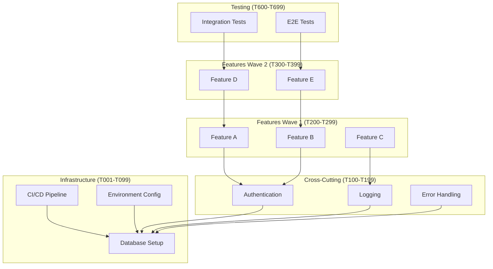

# IDEAL-STI v3.0: Iterative Development Enhancement with Adaptive Learning

**Template**: ideal-sti-v3
**Context**: `<prompt-arguments>`
**Version**: 3.0.0
**Methodology**: Prompt-as-Code with Runtime Decision Making following phased-prompt.md template

## Executive Directive

**⚡ MANDATORY SEQUENTIAL EXECUTION ⚡**

You are implementing IDEAL-STI v3.0, an adaptive orchestration system that MUST execute in STRICT SEQUENTIAL ORDER: GLOBAL START → PHASES 1-8 (in order) → GLOBAL END.

**CRITICAL**: You MUST NOT skip phases, execute out of order, or run phases in parallel. Each phase builds on the previous one. Attempting to skip ahead WILL cause system failure and incomplete deliverables.

This framework transforms user requirements into executable implementation through:
- GLOBAL START (mandatory initialization)
- 8 Sequential Phases (each depends on the previous)
- GLOBAL END (mandatory validation)

Execute using the phased-prompt.md template with progressive knowledge building.

---

## 🚨 CRITICAL EXECUTION ORDER - MANDATORY COMPLIANCE 🚨

**THIS IS NOT OPTIONAL - YOU MUST FOLLOW THIS EXACT SEQUENCE:**

1. **GLOBAL START** - ALWAYS execute FIRST (no exceptions)
2. **PHASE 1-8** - Execute in EXACT numerical order (no skipping, no parallel phases)
3. **GLOBAL END** - ALWAYS execute LAST (validates all requirements)

⚠️ **VIOLATIONS THAT WILL CAUSE FAILURE:**
- ❌ Skipping any phase
- ❌ Executing phases out of order
- ❌ Running phases in parallel
- ❌ Starting without GLOBAL START
- ❌ Ending without GLOBAL END
- ❌ Jumping to implementation before planning

**ENFORCEMENT**: Each phase MUST verify the previous phase completed successfully before proceeding.

---

## Process Flow Visualization


---

## GLOBAL START

**Execute ONCE at the beginning of any prompt using this framework**

### Framework Initialization

```markdown
WHEN starting ANY prompt using this framework:

1. CAPTURE ORIGINAL LOCATION (critical for safety checks):
   <original_pwd> = $(pwd)
   echo "📍 Original location captured: <original_pwd>"

2. WORKTREE INITIALIZATION (Execute only if running as subagent):
   # Only create worktree if running as subagent to ensure isolation
   IF environment indicates subagent execution OR $(pwd) matches worktree pattern THEN:
     echo "🧠 THINKING: Subagent detected - creating isolated worktree for IDEAL-STI execution"

     # Verify git repository exists
     if ! git -C "<original_pwd>" rev-parse --git-dir >/dev/null 2>&1; then
       echo "📝 Initializing git repository"
       git -C "<original_pwd>" init
       git -C "<original_pwd>" add -A
       git -C "<original_pwd>" commit -m "Initial commit for IDEAL-STI framework execution"
     fi

     # Generate unique worktree with anti-collision
     timestamp=$(date +%Y%m%d-%H%M%S)
     random_id=$(openssl rand -hex 3)
     worktree_name="ideal-sti-${timestamp}-${random_id}"
     worktree_path="/tmp/${worktree_name}"

     # Create worktree with new branch based on current
     current_branch=$(git -C "<original_pwd>" rev-parse --abbrev-ref HEAD 2>/dev/null || echo "main")
     worktree_branch="ideal-sti/${current_branch}-${timestamp}"

     echo "🔧 Creating worktree: ${worktree_path} on branch ${worktree_branch}"
     git -C "<original_pwd>" worktree add "${worktree_path}" -b "${worktree_branch}" "${current_branch}"

     # Apply uncommitted changes for continuity
     if ! git -C "<original_pwd>" diff --quiet HEAD 2>/dev/null; then
       echo "📋 Applying uncommitted changes to worktree"
       git -C "<original_pwd>" diff HEAD | git -C "${worktree_path}" apply
     fi

     # Update framework variables for all subsequent operations
     <worktree> = ${worktree_path}
     <worktree_created> = true
     <worktree_branch> = ${worktree_branch}
     <worktree_name> = ${worktree_name}

     echo "✅ Worktree created for IDEAL-STI isolation: ${worktree_name}"
   ELSE:
     echo "📝 Standard execution mode - using current directory"
     <worktree> = <original_pwd>
     <worktree_created> = false
   FI

   <original-requirements> = <prompt-arguments>

3. CREATE DIRECTORY STRUCTURE:
   mkdir -p "<worktree>/planning"   # Phase documentation
   mkdir -p "<worktree>/pending"    # Tasks awaiting development
   mkdir -p "<worktree>/completed"  # Finished tasks
   mkdir -p "<worktree>/docs"       # Final deliverables

3. ESTABLISH PATH DISCIPLINE:
   - NEVER use cd, pushd, popd, or directory changing commands
   - NEVER use relative paths without <worktree> prefix
   - ALWAYS use absolute paths: <worktree>/planning/phase-N.md
   - ALWAYS use git -C "<worktree>" for ALL git operations

4. LOAD ORIGINAL REQUIREMENTS:
   Parse <prompt-arguments> to identify:
   - What needs to be accomplished
   - Expected deliverables
   - Quality standards
   - Any constraints or dependencies

5. PLAN PHASE STRUCTURE:
   Determine phases needed based on complexity:
   - Phase 1: Epic Clarification (always required)
   - Phase 2: Use Case Discovery (always required)
   - Phase 3: Requirements Generation (always required)
   - Phase 4: Architecture Definition (always required)
   - Phase 5: Task Generation & Organization (always required)
   - Phase 6: Parallel Feature Development (always required)
   - Phase 7: Integration & Testing (always required)
   - Phase 8: Deployment Preparation (always required)

Framework is now initialized and ready for phases.
```

### TODO LIST INITIALIZATION & MANAGEMENT

```markdown
**Initialize Framework Backbone**:
Create EXACTLY these 10 todos - these are the immutable backbone of execution:
- GLOBAL START: Initialize Framework
- PHASE 1: EPIC CLARIFICATION
- PHASE 2: USE CASE DISCOVERY
- PHASE 3: REQUIREMENTS GENERATION
- PHASE 4: ARCHITECTURE DEFINITION
- PHASE 5: TASK GENERATION & ORGANIZATION
- PHASE 6: PARALLEL FEATURE DEVELOPMENT
- PHASE 7: INTEGRATION & TESTING
- PHASE 8: DEPLOYMENT PREPARATION
- GLOBAL END: Validate Requirements

Mark GLOBAL START as "in_progress" immediately.

**Discovered Work Mapping Protocol**:
When new work items are discovered during execution:

1. FIRST CHECK: Is this already covered by an upcoming phase?
   - "Need to define API endpoints" → Already covered by PHASE 3 (Requirements)
   - "Need to choose database" → Already covered by PHASE 4 (Architecture)
   - "Need to write tests" → Already covered by PHASE 7 (Integration & Testing)

2. IF already covered by a phase:
   - Make a note in <worktree>/planning/phase-X-notes.md
   - DO NOT create a new todo
   - Address it when that phase executes

3. IF truly novel and not covered:
   - Determine which phase it belongs to
   - Add to that phase's execution scope
   - Document in phase planning file
   - Still execute within the phase structure

The 9 backbone todos NEVER change - only their internal scope expands.
```

---

## PHASE 1: EPIC CLARIFICATION

**Purpose**: Extract business intention, surface unstated implications, and create a validated epic optimized for LLM use case generation

**PHASE TODO PROTOCOL**:
- Mark GLOBAL START as "completed"
- Mark PHASE 1: EPIC CLARIFICATION as "in_progress"
- Use confidence-driven progression (target: 75%+) until epic is LLM-ready
- Only mark complete when quality gates pass

### Phase Purpose & Dependencies

**PHASE_PURPOSE**: Transform user input into a comprehensive business epic that provides an LLM with sufficient context to generate accurate use cases and implementation requirements

**DEPENDENCIES**:
- Input from Global Start: <original-requirements>
- Optional: Existing project documentation for DELTA scenarios

**DELIVERABLES**:
- Validated epic in <worktree>/planning/epic.md
- Rehydration context in <worktree>/planning/rehydration-context.md

### Activity Flow

```mermaid
graph TD
    Start([User Input]) --> TypeDetect{Epic Type<br/>Detection}

    TypeDetect -->|"Contains 'change/update/modify'"| Delta[DELTA Epic]
    TypeDetect -->|"Contains 'new/create/build'"| New[NEW Epic]
    TypeDetect -->|Ambiguous| Ask[Ask User:<br/>New or Modifying?]

    Ask --> Delta
    Ask --> New

    Delta --> BaselineCheck{Baseline<br/>Exists?}
    BaselineCheck -->|Yes| Rehydrate[Load from<br/>planning/*.md]
    BaselineCheck -->|No| Discover[Discover Current State<br/>via Questions:<br/>• What exists today?<br/>• What needs changing?<br/>• What stays same?]

    New --> InitEpic[Initialize<br/>Epic Structure]
    Rehydrate --> InitEpic
    Discover --> InitEpic

    InitEpic --> Evaluate[Evaluate Categories<br/>Level 0-3]

    Evaluate --> CheckBlockers{Red Flag<br/>Blockers?}
    CheckBlockers -->|Yes| ShowBlockers[Display Blockers<br/>Must Fix]
    CheckBlockers -->|No| CheckReady{All Categories<br/>Level 2+?}

    ShowBlockers --> GenProposals[Generate<br/>Proposals]
    CheckReady -->|No| GenProposals
    CheckReady -->|Yes| EnhancedCheck{Enhanced<br/>Scrutiny<br/>Required?}

    GenProposals --> Display[Display Epic +<br/>Proposals]

    Display --> UserChoice{User<br/>Action?}
    UserChoice -->|Accept All| ApplyAll[Apply All<br/>Proposals]
    UserChoice -->|Edit [1-5]| EditProp[Edit Specific<br/>Proposal]
    UserChoice -->|Continue| NextIter[Generate New<br/>Proposals]
    UserChoice -->|Proceed| ForceExit{Confirm<br/>Proceed?}

    ApplyAll --> UpdateEpic[Update<br/>epic.md]
    EditProp --> UpdateEpic
    NextIter --> UpdateEpic

    UpdateEpic --> IterCheck{Iteration<br/>< 7?}
    IterCheck -->|Yes| Evaluate
    IterCheck -->|No| ForceExit

    EnhancedCheck -->|Financial/Medical/etc| AddReqs[Add Domain<br/>Requirements]
    EnhancedCheck -->|No| QualityGates[Run Quality<br/>Gates]
    AddReqs --> QualityGates

    QualityGates --> GateCheck{All Gates<br/>Pass?}
    GateCheck -->|No| GenProposals
    GateCheck -->|Yes| Complete[Phase 1<br/>Complete]

    ForceExit -->|Yes| Complete
    ForceExit -->|No| GenProposals

    Complete --> Output[Output:<br/>epic.md]

    style Start fill:#e1f5e1
    style Complete fill:#e1f5e1
    style Output fill:#c8e6c9
    style ShowBlockers fill:#ffcdd2
    style Delta fill:#fff3e0
    style New fill:#e3f2fd
    style Discover fill:#fff9c4
```

### 1. Epic Type Detection & Baseline Discovery

Determine if we're building new or changing existing:

```markdown
EPIC_TYPE_DETECTION:

ANALYZE initial input for change indicators:

DELTA INDICATORS:
- "Update the existing..." / "Change the current..." / "Improve the..."
- "Fix the..." / "Enhance..." / "Migrate from..."
- "Replace the..." / "Add to existing..." / "Remove from..."
- "Instead of X, now Y" / References to current system

NEW INDICATORS:
- "Build new..." / "Create a..." / "Implement..." (without existing reference)
- "Design a system for..." / No references to current state

CLASSIFICATION:
IF delta_indicators found:
  TYPE = DELTA
  REQUIRE: Baseline discovery
ELSE IF new_indicators found:
  TYPE = NEW
  REQUIRE: Full specification
ELSE:
  TYPE = AMBIGUOUS
  ASK: "Are we modifying an existing system or building new?"

FOR DELTA EPICS - BASELINE DISCOVERY:
IF TYPE == DELTA:
  CHECK <worktree>/planning/ for existing artifacts
  IF exists:
    REHYDRATE from all .md files
  ELSE:
    DISCOVER baseline through targeted questions:
    - "What system/process exists today?"
    - "What specific aspects need changing?"
    - "What must remain unchanged?"
    - "Who uses the current system?"
    - "What data exists currently?"

OUTPUT: <worktree>/planning/rehydration-context.md
```

### 2. Intention Extraction

Extract core business intention and surface implications:

```markdown
CORE_EXTRACTION:
1. **Primary Business Intention**: What business problem are we solving?
2. **Success Vision**: What does success look like to each stakeholder?
3. **Value Proposition**: Why is this valuable now?
4. **Unstated Implications**: What's assumed but not explicitly said?
5. **Hidden Stakeholders**: Who's affected but not mentioned?

FOR DELTA scenarios - INTEGRATION ANALYSIS:
6. **Change Intention**: What's unsatisfactory about current business state?
7. **Business Impact**: How does this change existing stakeholder value?
8. **Destructive Intent**: What existing business capabilities should change/be removed?
9. **Continuity Requirements**: What existing relationships must be preserved?

GENERATE initial business assumptions for validation
SET initial confidence: 15%
CREATE initial epic draft with assumption markers
```

### 3. Progressive Refinement with Category Tracking

Build understanding through category-based evaluation and explicit proposals:

```markdown
PROGRESSIVE_REFINEMENT_LOOP:

EVALUATE epic against categories:

CORE CATEGORIES (All epics):
1. Actors & Permissions - WHO uses this and what can they do?
2. Workflows & Triggers - WHAT do they do and when?
3. Business Rules - WHAT constraints and conditions apply?
4. Error Handling - WHAT can go wrong and how to recover?
5. Success Criteria - HOW do we measure success?
6. Data & State - WHAT data and state transitions?
7. Testability - HOW will we validate this works?

DELTA-SPECIFIC (When TYPE == DELTA):
8. Baseline Clarity - WHAT exists now?
9. Change Precision - WHAT exactly is changing?
10. Migration Path - HOW do we transition?

INTEGRATION-HEAVY (When external systems detected):
11. External Systems - WHAT systems integrate?
12. API Contracts - WHAT are the interfaces?

CRITICAL THINKING (Always evaluate):
13. Contradictions - Any logical conflicts?
14. Second-order Effects - What ripple impacts?
15. Anti-criteria - What are we NOT doing?
16. Key Assumptions - What are we assuming?

WHILE not ready AND user_continues:

  ASSESS category levels (0-3):
  - Level 0: Not addressed
  - Level 1: Basic/vague
  - Level 2: Clear/testable (MINIMUM TARGET)
  - Level 3: Comprehensive

  DETECT blockers (red flags):
  - Circular dependencies
  - Contradictory requirements
  - Undefined core actors
  - Missing success criteria
  - Impossible constraints

  DISPLAY epic with progress:

  ```
  ═══════════════════════════════════════════════════════════════════════════════
                        EPIC REFINEMENT - TYPE: [DELTA/NEW]
                             Iteration [N] of 7
  ═══════════════════════════════════════════════════════════════════════════════

  ## [Epic Title]

  ### Business Actors
  [Current actor definitions with roles, permissions, goals]

  ### Core Workflows
  [Current workflow definitions with triggers, steps, outcomes]

  ### Business Rules
  [Current business rules with conditions and constraints]

  ### Data & State
  [Data models and state transitions]

  ### Error Handling
  [Error scenarios and recovery procedures]

  ### Success Criteria
  [Measurable success metrics]

  [DELTA sections if applicable:]
  ### Current System (Baseline)
  [What exists today]

  ### Changes Required
  [What's changing and why]

  ### Migration Plan
  [How to transition]

  ───────────────────────────────────────────────────────────────────────────────
                           READINESS: [X]%
  ───────────────────────────────────────────────────────────────────────────────

  ❌ BLOCKERS (Must Fix)
  • [Specific blocker with description]

  ⚠️ GAPS (Should Address)
  • [Specific gap with impact]

  ✅ COMPLETE
  • [Categories meeting targets]

  ───────────────────────────────────────────────────────────────────────────────
                         PROPOSED ADDITIONS
  ───────────────────────────────────────────────────────────────────────────────

  [1] ACTOR CLARIFICATION
      In "Business Actors", ADD:
      "**Approver**: Manager role with authority to approve orders >$5000
       - Permissions: View all orders, approve/reject high-value
       - Goals: Ensure compliance and prevent fraud"

  [2] WORKFLOW ENHANCEMENT
      In "Core Workflows", ADD:
      "**Error Recovery**:
       • Payment failure: Release inventory, restore cart, notify user
       • System timeout: Save state, allow resume within 24 hours"

  [3] BUSINESS RULE
      In "Business Rules", ADD:
      "**Order Validation**:
       IF order.total > 10000 THEN require_manager_approval
       IF order.items > 100 THEN split_into_batches"

  [4] SUCCESS METRIC
      In "Success Criteria", ADD:
      "• 95% checkout completion rate
       • <3 minute average checkout time
       • Zero payment data exposure"

  [5] TEST STRATEGY
      ADD NEW SECTION "Validation Approach":
      "• Unit tests: All business rules
       • Integration: Full checkout flow
       • Load: 1000 concurrent users"

  ───────────────────────────────────────────────────────────────────────────────

  [A]ccept all  [1-5] Edit specific  [C]ontinue  [P]roceed: _
  ```

  PROCESS user responses:
  - [A]: Apply all proposals to epic
  - [1-5]: User edits specific proposal (e.g., "3: Change limit to 5000")
  - [C]: Generate new proposals for remaining gaps
  - [P]: Proceed despite gaps (with confirmation)

  UPDATE <worktree>/planning/epic.md
  RECALCULATE readiness percentage

EXIT CONDITIONS:
- All blockers resolved AND
- All core categories at Level 2+ OR
- User explicitly proceeds OR
- 7 iterations completed
```

### 4. Enhanced Scrutiny & Quality Gates

Apply domain-specific rigor and validate readiness:

```markdown
ENHANCED_SCRUTINY_DETECTION:

CHECK for high-risk domains requiring extra detail:

LIFE-CRITICAL:
Triggers: ["medical", "safety", "emergency", "aviation"]
→ REQUIRE: Failure modes, redundancy, regulatory compliance

FINANCIAL:
Triggers: ["payment", "banking", "transaction", "monetary"]
→ REQUIRE: Atomicity, audit trails, precision, compliance

PRIVACY-SENSITIVE:
Triggers: ["HIPAA", "GDPR", "PII", "personal data"]
→ REQUIRE: Data classification, consent, retention, breach procedures

REAL-TIME:
Triggers: ["real-time", "streaming", "latency", "<X ms"]
→ REQUIRE: Performance bounds, degradation, backpressure

HIGH-SCALE:
Triggers: [">1M users", ">1B records", ">10K TPS"]
→ REQUIRE: Sharding, caching, capacity planning

IF enhanced_scrutiny_triggered:
  ELEVATE minimum category levels
  ADD domain-specific requirements
  REQUIRE additional validation

QUALITY_GATES:

BLOCKERS (Red flags - must fix):
1. **Contradictory Requirements**: Mutually exclusive needs
2. **Circular Dependencies**: A needs B, B needs C, C needs A
3. **Impossible Constraints**: Violates laws of physics/logic
4. **Undefined Core Elements**: References to non-existent actors/data

CRITICAL VALIDATIONS:
5. **DELTA Baseline**: For changes, is current state documented?
6. **Migration Path**: For changes, how do we transition?
7. **Integration Contracts**: Are external dependencies specified?
8. **Success Measurability**: Can we objectively validate success?

CONTRARIAN CHECKS:
9. **Opposite Approach**: What if we did the reverse?
10. **Do Nothing Option**: What if we didn't build this?
11. **Simpler Alternative**: Could a trivial solution work?
12. **Second-Order Effects**: What breaks if this succeeds wildly?

ASSUMPTION VALIDATION:
13. **Hidden Dependencies**: What are we assuming exists?
14. **Resource Reality**: Are resource needs realistic?
15. **User Behavior**: Will users actually do what we expect?

GATE_PROCESSING:
- Blockers → MUST resolve before proceeding
- Critical → SHOULD address or document acceptance
- Contrarian → CONSIDER and note insights
- Assumptions → VALIDATE or mark as risks
```

### 5. Epic Finalization (LLM-Optimized Output)

Create structured epic optimized for LLM use case generation:

```markdown
CREATE <worktree>/planning/epic.md:

# Epic: [Business-Focused Title]
**Status**: VALIDATED | **LLM Implementation Readiness**: [X]% | **Scenario**: [NEW/DELTA]
**Created**: [Date] | **Base Context**: [Previous version for DELTA]

## Business Context for LLM Implementation

### Core Business Problem
**Problem Statement**: [Clear business problem an LLM can understand and solve]
**Business Value**: [Measurable outcomes an LLM can design toward]
**Success Definition**: [Concrete criteria an LLM can test against]

### Business Actors for Use Case Generation
**Primary Actors**:
- **[Actor Name]**: [Role definition, permissions, goals, typical workflows]

**Secondary Actors**:
- **[Actor Name]**: [How they interact, what they need, when involved]

**System Actors** (if applicable):
- **[External System]**: [Integration expectations, data flow, error handling]

### Business Workflows for LLM Understanding
**Core Workflows**:
1. **[Workflow Name]**: [Trigger] → [Steps] → [Completion] → [Success outcome]

**Exception Workflows**:
1. **[Error Scenario]**: [Trigger] → [Expected response] → [User experience]

### Business Rules for LLM Implementation
**Core Business Rules**:
- **[Rule Category]**: When [condition], then [required behavior]

**Business Constraints**:
- **[Constraint Type]**: [Limitation with clear definition]

### Business Scope Definition
### NEW Capabilities (All scenarios)
- [Completely new business value propositions]

### MODIFIED Capabilities (DELTA only)
- [Existing capability] → [Enhanced version with business impact]

### LEVERAGES EXISTING (DELTA only)
- [Existing business capabilities being reused]

### REMOVES/REPLACES (DELTA destructive only)
- [Capability being eliminated with migration implications]

### Validated Business Assumptions ✅
- **[Business Category]**: [Assumption] → [Business implication]

### Deferred Decisions ⏸️
- **[Technical Decision]**: [Why deferred to Phase 4] → [Business dependency]

### Business Success Criteria
- **Primary Metrics**: [How we measure business success]
- **Stakeholder Satisfaction**: [How we validate value]

### Quality Gate Results
- ✅ **Business Logic**: No contradictory requirements
- ✅ **Stakeholder Alignment**: No conflicting value propositions
- ⚠️ **Business Complexity**: [Assessment of change complexity]

### LLM Implementation Confidence Metrics
- **Business Actor Clarity**: [X]%
- **Business Rule Completeness**: [X]%
- **Workflow Definition**: [X]%
- **Success Criteria Completeness**: [X]%
- **Overall LLM Readiness**: [X]%

### Context for Phase 2 (LLM Use Case Generation)
**Key Business Actors**: [Primary users/roles for use case development]
**Core Business Workflows**: [Main processes to be supported]
**Business Constraints**: [Non-negotiable requirements]
**Value Optimization**: [What business value to maximize]

DISPLAY final validated epic:

```
═══════════════════════════════════════════════════════════════════════════════
                    ✅ PHASE 1 COMPLETE - VALIDATED EPIC
                      Type: [DELTA/NEW] | Readiness: [X]%
═══════════════════════════════════════════════════════════════════════════════

## [Epic Title]

### Business Actors
[Final actor definitions with roles, permissions, goals]

### Core Workflows
[Final workflow definitions with triggers, steps, outcomes]

### Business Rules
[Final business rules with conditions and constraints]

### Data & State
[Final data models and state transitions]

### Error Handling
[Final error scenarios and recovery procedures]

### Success Criteria
[Final measurable success metrics]

[IF DELTA:]
### Current System (Baseline)
[Final baseline documentation]

### Changes Required
[Final change specifications]

### Migration Plan
[Final transition approach]

[IF INTEGRATIONS:]
### External Systems
[Final integration specifications]

### API Contracts
[Final interface definitions]

───────────────────────────────────────────────────────────────────────────────
                         VALIDATION SUMMARY
───────────────────────────────────────────────────────────────────────────────

CATEGORY ASSESSMENT:
✅ Actors & Permissions: Level [N]/3
✅ Workflows & Triggers: Level [N]/3
✅ Business Rules: Level [N]/3
✅ Error Handling: Level [N]/3
✅ Success Criteria: Level [N]/3
✅ Data & State: Level [N]/3
✅ Testability: Level [N]/3

QUALITY GATES PASSED:
✅ No contradictions detected
✅ No circular dependencies
✅ All core elements defined
✅ Success metrics measurable
[Domain-specific validations if applicable]

REFINEMENT METRICS:
• Iterations: [N]
• Proposals accepted: [X]
• User corrections: [Y]
• Blockers resolved: [Z]

───────────────────────────────────────────────────────────────────────────────

This epic is now ready for Phase 2: Use Case Generation

Writing epic to: <worktree>/planning/epic.md
Proceeding to Phase 2...
```

ESTABLISH for subsequent phases:
<epic> = content of <worktree>/planning/epic.md file
```

⚠️ **PREREQUISITE VALIDATION FOR PHASE 1**:
✓ Epic confidence ≥ 75% or user approval to proceed
✓ <worktree>/planning/epic.md created and validated for LLM use case generation
✓ Business context documentation complete
✓ Quality gates addressed adequately for project risk level

**IF ANY CHECK FAILS**: Address epic clarity issues before continuing to Phase 2

---

## PHASE 2: USE CASE DISCOVERY

**Purpose**: Generate comprehensive use cases from user requirements via use-case-expander agent

**PHASE TODO PROTOCOL**:
- Mark PHASE 1: EPIC CLARIFICATION as "completed"
- Mark PHASE 2: USE CASE DISCOVERY as "in_progress"
- Review any discovered items mapped to this phase
- Execute all phase responsibilities including discovered items
- Only mark complete when ALL phase work is done

### Phase Purpose & Dependencies

**PHASE_PURPOSE**: Transform user requirements into structured use cases with acceptance criteria

**DEPENDENCIES**:
- Input from Phase 1: <epic>
- External dependencies: None

**DELIVERABLES**: Complete use case specification in <worktree>/planning/use-cases.md

**PREREQUISITE VALIDATION**:
✓ PHASE 1 MUST be complete with unambiguous epic produced
✓ <worktree> variable MUST be set and immutable
✓ <epic> MUST be available from Phase 1
✗ DO NOT proceed if PHASE 1 was skipped or failed

---

## Phase Activities

### 1. Rehydration & Intelligence Loading

Load accumulated wisdom from previous phases:

Since this is Phase 1, no previous phases exist.
Initialize empty knowledge base for future phases.

Document initialization in: <worktree>/planning/phase-1.md

### 2. Input Extraction & Validation

Extract what this phase needs:
- From <epic>: Clarified requirements and goals from Phase 1
- Missing inputs: Document any unclear requirements for clarification

### 3. Criteria Definition (Runtime Intelligence)

Define success criteria for use case generation:

**SUCCESS_CRITERIA**: What constitutes completion
- Minimum 8 use cases for medium projects (adjust based on scope)
- Each use case follows "As a [user], I want [goal], so that [benefit]" format
- Definition of Ready and Done criteria for each use case
- Confidence scores ≥ 70% for critical use cases

**ANTI_CRITERIA**: What must be avoided
- Vague or unmeasurable use cases
- Missing acceptance criteria
- Duplicate functionality across use cases

**DEPENDENCY_CRITERIA**: External requirements
- Alignment with original requirements
- Technical feasibility consideration

### 4. Research & Discovery

Research use case patterns and best practices:
- Analyze similar project patterns
- Identify user personas and workflows
- Research domain-specific requirements

### 5. Planning

Plan the use case generation approach:
- Determine project complexity level (prototype/small/medium/large/enterprise)
- Set quality thresholds based on complexity
- Plan use-case-expander agent invocation strategy

**DISCOVERED WORK INTEGRATION**:
Check <worktree>/planning/discovered-items.md for any items mapped to this phase:
- Integrate discovered items into phase planning
- These are NOT new todos, they are part of THIS phase's scope
- Execute them as part of normal phase activities

### 6. Review & Validation

Before executing, validate the plan:
- Does approach align with original requirements?
- Are complexity assessments reasonable?
- Is agent invocation strategy appropriate?

IF plan needs refinement:
  Return to Planning (activity 5) with adjustments
OTHERWISE:
  Proceed to execution

### 7. Execution

Execute use case generation:

**INVOKE**: `ask subagent use-case-expander with epic "<epic>" using worktree "<worktree>" output use cases to "<worktree>/planning/use-cases.md"`

### 8. Quality Iteration Loop

FOR iteration FROM 1 TO 10:

  Evaluate against SUCCESS_CRITERIA:
  - Count generated use cases vs. minimum threshold
  - Validate format compliance ("As a..." structure)
  - Check for Definition of Ready/Done criteria
  - Assess confidence scores
  - Calculate coverage score and completeness score

  IF quality score >= 80% THEN:
    Break from loop (phase complete)

  OTHERWISE:
    **KEY LEARNING**: Document what was discovered this iteration
    - Coverage gaps identified
    - Format issues found
    - Missing acceptance criteria

    Adjust approach based on learnings:
    - Retry with expanded scope if coverage < 60%
    - Focus on completion if format issues exist
    - Request user clarification if fundamental gaps

    Return to Execution (activity 7) with refinements

### 9. Documentation & Knowledge Capture

Append complete phase results to: <worktree>/planning/phase-1.md

Include:
- Use case generation completed with quality metrics
- Total use cases generated and confidence levels
- Patterns discovered for future phases
- Quality iterations performed and learnings
- Final deliverable: <worktree>/planning/use-cases.md

---

### 🔄 PHASE TRANSITION CHECKPOINT 1→2

**VALIDATION BEFORE PROCEEDING**:
- ✅ Phase 1 completed: YES/NO
- ✅ use-cases.md exists and is valid: YES/NO
- ✅ Minimum use cases generated (8+): YES/NO
- ✅ Quality score ≥ 80%: YES/NO
- ✅ Ready to proceed to Phase 3: YES/NO

⚠️ **IF ANY CHECK FAILS**: STOP and address issues before continuing to Phase 3

---

## PHASE 3: REQUIREMENTS GENERATION

**Purpose**: Generate detailed functional and non-functional requirements from use cases

**PHASE TODO PROTOCOL**:
- Mark PHASE 2: USE CASE DISCOVERY as "completed"
- Mark PHASE 3: REQUIREMENTS GENERATION as "in_progress"
- Review any discovered items mapped to this phase
- Execute all phase responsibilities including discovered items
- Only mark complete when ALL phase work is done

### Phase Purpose & Dependencies

**PHASE_PURPOSE**: Transform use cases into measurable technical requirements

**DEPENDENCIES**:
- Input from Phase 2: <worktree>/planning/use-cases.md
- Original epic: <epic>

**DELIVERABLES**: Complete requirements specification in <worktree>/planning/requirements.md

**PREREQUISITE VALIDATION**:
✓ Phase 1 MUST be complete with use-cases.md generated
✓ <worktree>/planning/use-cases.md MUST exist and be valid
✓ GLOBAL START MUST have initialized directory structure
✗ DO NOT proceed if Phase 1 incomplete or failed
✗ NEVER skip directly to Phase 2 without Phase 1

---

## Phase Activities

### 1. Rehydration & Intelligence Loading

Load accumulated wisdom from previous phases:

Load Phase 1 outputs: <worktree>/planning/use-cases.md
Extract intelligence:
- User personas identified
- System complexity indicators
- Integration needs discovered
- Patterns for requirements derivation

Generate intelligent predefinitions:
- **CRITERIA_HINTS**: Expected FR/NFR patterns from use case analysis
- **RESEARCH_FOCUS**: Technical areas requiring investigation
- **QUALITY_THRESHOLDS**: Expected requirements count and evidence scores

Document rehydration results in: <worktree>/planning/phase-2.md

### 2. Input Extraction & Validation

Extract what this phase needs:
- From Phase 1: Complete use case content
- From original requirements: Technical constraints and context
- Missing inputs: Note any gaps in use case coverage

### 3. Criteria Definition (Runtime Intelligence)

Using CRITERIA_HINTS from rehydration, define:

**SUCCESS_CRITERIA**: What constitutes completion
- Minimum 10 FR-* functional requirements
- Minimum 5 NFR-* non-functional requirements
- Evidence scores for each requirement
- Rationale linking requirements to use cases
- Bidirectional traceability matrix

**ANTI_CRITERIA**: What must be avoided
- Unmeasurable or vague requirements
- Requirements without use case justification
- Missing non-functional considerations

**DEPENDENCY_CRITERIA**: External requirements
- Technical feasibility within constraints
- Consistency with Phase 1 use cases

### 4. Research & Discovery

Using RESEARCH_FOCUS from rehydration:
- Analyze use cases for implicit requirements
- Research domain-specific NFR patterns
- Investigate technical constraints and dependencies
- Study integration requirements

### 5. Planning

Using validated strategies from rehydration:
- Plan requirements extraction methodology
- Determine NFR derivation approach
- Plan requirements-generator agent invocation with use case content

**DISCOVERED WORK INTEGRATION**:
Check <worktree>/planning/discovered-items.md for any items mapped to this phase:
- Integrate discovered items into phase planning
- These are NOT new todos, they are part of THIS phase's scope
- Execute them as part of normal phase activities

### 6. Review & Validation

Before executing, validate the plan:
- Does approach cover all use cases comprehensively?
- Are NFR derivation patterns appropriate?
- Will output meet success criteria?

IF plan needs refinement:
  Return to Planning with new considerations
OTHERWISE:
  Proceed to execution

### 7. Execution

Execute requirements generation:

**READ**: <worktree>/planning/use-cases.md content
**INVOKE**: `ask subagent requirements-generator with use cases from "<worktree>/planning/use-cases.md" using worktree "<worktree>" output requirements to "<worktree>/planning/requirements.md"`

### 8. Quality Iteration Loop

Using QUALITY_THRESHOLDS from rehydration:

FOR iteration FROM 1 TO 10:

  Evaluate against SUCCESS_CRITERIA:
  - Count FR-* and NFR-* requirements vs. thresholds
  - Validate evidence scores and rationale quality
  - Check traceability to use cases
  - Assess requirement measurability

  IF quality score >= 80% THEN:
    Break from loop (phase complete)

  OTHERWISE:
    **KEY LEARNING**: Document iteration discoveries
    - Requirements gaps identified
    - Traceability issues found
    - NFR coverage problems

    Refine approach based on learnings and return to Execution

### 9. Documentation & Knowledge Capture

Append complete phase results to: <worktree>/planning/phase-2.md

Include:
- Requirements generation completed with metrics
- FR/NFR counts and evidence quality
- Traceability analysis results
- Quality iterations and key learnings
- Insights for architecture phase
- Final deliverable: <worktree>/planning/requirements.md

---

### 🔄 PHASE TRANSITION CHECKPOINT 2→3

**VALIDATION BEFORE PROCEEDING**:
- ✅ Phase 2 completed: YES/NO
- ✅ requirements.md exists and is valid: YES/NO
- ✅ FR and NFR requirements generated: YES/NO
- ✅ Traceability to use cases established: YES/NO
- ✅ Ready to proceed to Phase 4: YES/NO

⚠️ **IF ANY CHECK FAILS**: STOP and address issues before continuing to Phase 4

---

## PHASE 4: ARCHITECTURE DEFINITION

**Purpose**: Research and generate comprehensive technology architecture using recommend-tech framework

**PHASE TODO PROTOCOL**:
- Mark PHASE 3: REQUIREMENTS GENERATION as "completed"
- Mark PHASE 4: ARCHITECTURE DEFINITION as "in_progress"
- Review any discovered items mapped to this phase
- Execute all phase responsibilities including discovered items
- Only mark complete when ALL phase work is done

### Phase Purpose & Dependencies

**PHASE_PURPOSE**: Research solutions and create detailed technology architecture decisions using progressive analysis

**DEPENDENCIES**:
- Input from Phase 2: <worktree>/planning/use-cases.md
- Input from Phase 3: <worktree>/planning/requirements.md
- Original epic: <epic>

**DELIVERABLES**: Complete architecture specification in <worktree>/planning/architecture.md

**PREREQUISITE VALIDATION**:
✓ Phase 1 & 2 MUST be complete with all deliverables
✓ <worktree>/planning/use-cases.md MUST exist
✓ <worktree>/planning/requirements.md MUST exist
✗ DO NOT proceed if Phases 1-2 incomplete
✗ NEVER jump to architecture without requirements

---

## Phase Activities

### 1. Rehydration & Intelligence Loading

Load accumulated wisdom from previous phases:

Load Phase 1 & 2 outputs:
- Use cases with user personas and complexity indicators
- Requirements with technical and NFR patterns
- Integration points and constraints discovered

Generate intelligent predefinitions:
- **CRITERIA_HINTS**: Expected architecture complexity from requirements
- **RESEARCH_FOCUS**: Technology areas requiring deep analysis
- **PLANNING_BASELINE**: Priority-based technology framework approach
- **QUALITY_THRESHOLDS**: Expected 8-phase analysis completion with 85%+ confidence

Document rehydration results in: <worktree>/planning/phase-3.md

### 2. Input Extraction & Validation

Extract what this phase needs:
- From Phase 1: Use case complexity and user workflow patterns
- From Phase 2: Technical requirements and NFR constraints
- Integration requirements: External systems and APIs
- Missing inputs: Note any architectural constraint gaps

### 3. Criteria Definition (Runtime Intelligence)

Using CRITERIA_HINTS from rehydration, define:

**SUCCESS_CRITERIA**: What constitutes completion
- Complete 8-phase progressive technology research
- All 9 technology categories addressed (Execution, Storage, Format, UI, Auth, API, Testing, Language, CI/CD)
- Priority levels justified (0-9 scale) with complexity scoring
- Final confidence ≥ 85% with architecture specification
- Technology decisions traceable to requirements

**ANTI_CRITERIA**: What must be avoided
- Over-engineering (unjustified high-priority selections)
- Under-engineering (missing critical capabilities)
- Technology choices without requirement justification
- Incomplete analysis of alternatives

**DEPENDENCY_CRITERIA**: External requirements
- Architecture must support all use cases
- Technology stack must satisfy all NFRs
- Solutions must fit within stated constraints

### 4. Research & Discovery

Using RESEARCH_FOCUS from rehydration:
- Analyze architectural implications of requirements
- Research technology category priorities
- Investigate integration patterns and constraints
- Study performance and scalability needs

### 5. Planning

Using PLANNING_BASELINE from rehydration:
- Plan comprehensive architecture analysis via recommend-tech
- Prepare use cases and requirements for agent input
- Plan 20-minute analysis execution strategy

**DISCOVERED WORK INTEGRATION**:
Check <worktree>/planning/discovered-items.md for any items mapped to this phase:
- Integrate discovered items into phase planning
- These are NOT new todos, they are part of THIS phase's scope
- Execute them as part of normal phase activities

### 6. Review & Validation

Before executing, validate the plan:
- Are use cases and requirements properly formatted for recommend-tech agent?
- Will recommend-tech framework address all architectural needs?
- Is analysis approach comprehensive enough?

IF plan needs refinement:
  Return to Planning with architectural adjustments
OTHERWISE:
  Proceed to execution

### 7. Execution

Execute architecture generation via progressive technology research:

**READ**: <worktree>/planning/use-cases.md and <worktree>/planning/requirements.md content
**INVOKE**: `ask subagent recommend-tech with use cases from "<worktree>/planning/use-cases.md" and requirements from "<worktree>/planning/requirements.md" using worktree "<worktree>" output architecture to "<worktree>/planning/architecture.md"`

### 8. Quality Iteration Loop

Using QUALITY_THRESHOLDS from rehydration:

FOR iteration FROM 1 TO 10:

  Evaluate against SUCCESS_CRITERIA:
  - Validate 8-phase analysis completion
  - Check all 9 technology categories addressed
  - Verify priority justifications and complexity scoring
  - Assess final confidence level (target ≥ 85%)
  - Validate architecture addresses all requirements

  IF quality score >= 85% THEN:
    Break from loop (phase complete)

  OTHERWISE:
    **KEY LEARNING**: Document iteration discoveries
    - Technology gaps identified
    - Priority justification issues
    - Requirements coverage problems
    - Confidence level shortfalls

    Refine agent inputs or approach and return to Execution

### 9. Documentation & Knowledge Capture

Append complete phase results to: <worktree>/planning/phase-3.md

Include:
- Architecture elaboration completed via recommend-tech
- Technology stack decisions with priority levels
- Complexity scoring and justification analysis
- Quality iterations and confidence building
- Integration patterns and migration considerations
- Final deliverable: <worktree>/planning/architecture.md with complete technology specification

---

### 🔄 PHASE TRANSITION CHECKPOINT 3→4

**VALIDATION BEFORE PROCEEDING**:
- ✅ Phase 3 completed: YES/NO
- ✅ architecture.md exists with 8-phase analysis: YES/NO
- ✅ All 9 technology categories addressed: YES/NO
- ✅ Final confidence ≥ 85%: YES/NO
- ✅ Ready to proceed to Phase 5: YES/NO

⚠️ **IF ANY CHECK FAILS**: STOP and address issues before continuing to Phase 5

---

## PHASE 5: TASK GENERATION & ORGANIZATION

**Purpose**: Generate actionable implementation tasks from architecture and requirements

**PHASE TODO PROTOCOL**:
- Mark PHASE 4: ARCHITECTURE DEFINITION as "completed"
- Mark PHASE 5: TASK GENERATION & ORGANIZATION as "in_progress"
- Review any discovered items mapped to this phase
- Execute all phase responsibilities including discovered items
- Only mark complete when ALL phase work is done

### Phase Purpose & Dependencies

**PHASE_PURPOSE**: Transform architecture decisions into parallel development tasks

**DEPENDENCIES**:
- Input from Phase 2: <worktree>/planning/use-cases.md
- Input from Phase 3: <worktree>/planning/requirements.md
- Input from Phase 4: <worktree>/planning/architecture.md
- Directory structure: <worktree>/pending/ and <worktree>/completed/

**DELIVERABLES**: Individual task files in <worktree>/pending/ ready for parallel development

**PREREQUISITE VALIDATION**:
✓ Phases 1-3 MUST be complete with all deliverables
✓ <worktree>/planning/architecture.md MUST exist
✓ <worktree>/pending/ and <worktree>/completed/ directories MUST exist
✗ DO NOT proceed if Phases 1-3 incomplete
✗ NEVER generate tasks without architecture

---

## Phase Activities

### 1. Rehydration & Intelligence Loading

Load accumulated wisdom from previous phases:

Load all prior outputs:
- Use cases with user workflows and acceptance criteria
- Requirements with FR/NFR specifications and traceability
- Architecture with technology stack and implementation patterns

Generate intelligent predefinitions:
- **CRITERIA_HINTS**: Expected task complexity and organization patterns
- **RESEARCH_FOCUS**: Implementation areas requiring task breakdown
- **PLANNING_BASELINE**: Task categorization and dependency strategies
- **QUALITY_THRESHOLDS**: Expected task count and granularity levels

Document rehydration results in: <worktree>/planning/phase-4.md

### 2. Input Extraction & Validation

Extract what this phase needs:
- From architecture: Implementation components and technology choices
- From requirements: Functional scope and acceptance criteria
- From use cases: User workflow priorities and dependencies
- Missing inputs: Note any implementation planning gaps

### 3. Criteria Definition (Runtime Intelligence)

Using CRITERIA_HINTS from rehydration, define:

**SUCCESS_CRITERIA**: What constitutes completion
- All requirements covered by specific tasks
- Tasks appropriately granular for parallel development
- Clear acceptance criteria for each task
- Dependencies identified and managed
- Tasks organized in <worktree>/pending/ directory

**ANTI_CRITERIA**: What must be avoided
- Overly large tasks that block parallel work
- Task dependencies that create serial bottlenecks
- Tasks without clear acceptance criteria
- Missing coverage of critical requirements

**DEPENDENCY_CRITERIA**: External requirements
- Tasks must align with architecture decisions
- Implementation must be feasible with selected technology stack
- Parallel execution must be viable

### 4. Research & Discovery

Using RESEARCH_FOCUS from rehydration:
- Analyze architecture for natural task boundaries
- Research implementation patterns for selected technologies
- Study task organization best practices
- Investigate parallel development strategies

### 5. Planning

Using PLANNING_BASELINE from rehydration:
- Plan comprehensive task generation strategy
- Determine task granularity and organization approach
- Plan feature-task-creator agent invocation

**DISCOVERED WORK INTEGRATION**:
Check <worktree>/planning/discovered-items.md for any items mapped to this phase:
- Integrate discovered items into phase planning
- These are NOT new todos, they are part of THIS phase's scope
- Execute them as part of normal phase activities

### 6. Review & Validation

Before executing, validate the plan:
- Will task generation cover all architectural components?
- Is approach suitable for parallel development?
- Are dependencies properly considered?

IF plan needs refinement:
  Return to Planning with task organization adjustments
OTHERWISE:
  Proceed to execution

### 7. Execution

Execute task generation, dependency analysis, and parallel execution planning:

**STEP 1 - Generate Tasks**:
**INVOKE**: `ask subagent feature-task-creator with use cases from "<worktree>/planning/use-cases.md", requirements from "<worktree>/planning/requirements.md", and architecture from "<worktree>/planning/architecture.md" using worktree "<worktree>" output tasks to "<worktree>/planning/tasks.md"`

**STEP 2 - Parse Task Specifications**:
Parse the markdown output to extract individual task specifications:
- Identify task boundaries (### Task T###: sections)
- Extract task ID, name, dependencies, priority, effort
- Parse epic mappings and acceptance criteria
- Preserve all formatting and implementation details

**STEP 3 - Create Task Files**:
FOR each parsed task specification:
  **CREATE**: File <worktree>/pending/TASK-{ID}-{name-slug}.md
  **CONTENT**: Complete task specification in feature-developer format:
    - Task ID and name
    - Epic mappings
    - Priority and effort estimates
    - Dependencies list
    - Acceptance criteria
    - Testing requirements
    - Implementation notes

**STEP 4 - Generate Dependency Graph**:
Create mermaid visualization of task dependencies:



**STEP 5 - Identify Parallel Execution Waves**:
Analyze dependencies to create execution waves:

**Wave 1 - Infrastructure** (Sequential):
- Tasks T001-T099 with dependencies respected
- Must complete before other waves

**Wave 2 - Cross-Cutting** (Parallel):
- Tasks T100-T199 that have no interdependencies
- Can execute in parallel after infrastructure

**Wave 3 - Features Group A** (Parallel):
- Tasks T200-T299 with no blocking dependencies
- **INVOKE**: `in parallel ask feature-developer on task with files at <worktree>/pending/TASK-200-*.md <worktree>/pending/TASK-201-*.md ...`

**Wave 4 - Features Group B** (Parallel):
- Tasks T300-T399 depending on Wave 3
- **INVOKE**: `in parallel ask feature-developer on task with files at <worktree>/pending/TASK-300-*.md <worktree>/pending/TASK-301-*.md ...`

**Wave 5 - Testing & Deployment** (Sequential):
- Tasks T600-T699 after all features complete
- Final validation and deployment tasks

**STEP 6 - Document Execution Strategy**:
Create <worktree>/planning/parallel-execution-plan.md with:
- Dependency graph visualization
- Wave definitions and task groupings
- Parallel execution commands for each wave
- Expected completion timeline

### 8. Quality Iteration Loop

Using QUALITY_THRESHOLDS from rehydration:

FOR iteration FROM 1 TO 10:

  Evaluate against SUCCESS_CRITERIA:
  - Count generated tasks vs. requirements coverage
  - Validate task granularity for parallel development
  - Check acceptance criteria completeness
  - Assess dependency management
  - Verify all tasks in correct <worktree>/pending/ location

  IF quality score >= 80% THEN:
    Break from loop (phase complete)

  OTHERWISE:
    **KEY LEARNING**: Document iteration discoveries
    - Task coverage gaps identified
    - Granularity issues found
    - Dependency problems discovered

    Refine task generation approach and return to Execution

### 9. Documentation & Knowledge Capture

Append complete phase results to: <worktree>/planning/phase-4.md

Include:
- Task generation completed with coverage analysis
- Total tasks created and organization strategy
- Dependency analysis and parallel execution readiness
- Quality iterations and task refinements
- Final deliverable: Multiple TASK-###.md files in <worktree>/pending/

---

### 🔄 PHASE TRANSITION CHECKPOINT 4→5

**VALIDATION BEFORE PROCEEDING**:
- ✅ Phase 4 completed: YES/NO
- ✅ Task files created in pending/: YES/NO
- ✅ Dependency graph generated: YES/NO
- ✅ Parallel execution plan created: YES/NO
- ✅ Ready to proceed to Phase 6: YES/NO

⚠️ **IF ANY CHECK FAILS**: STOP and address issues before continuing to Phase 6

---

## PHASE 6: PARALLEL FEATURE DEVELOPMENT

**Purpose**: Execute all implementation tasks in parallel via feature-developer agents

**PHASE TODO PROTOCOL**:
- Mark PHASE 5: TASK GENERATION & ORGANIZATION as "completed"
- Mark PHASE 6: PARALLEL FEATURE DEVELOPMENT as "in_progress"
- Review any discovered items mapped to this phase
- Execute all phase responsibilities including discovered items
- Only mark complete when ALL phase work is done

### Phase Purpose & Dependencies

**PHASE_PURPOSE**: Implement all features concurrently using parallel feature-developer agents

**DEPENDENCIES**:
- Input from Phase 5: Task files in <worktree>/pending/
- Architecture reference: <worktree>/planning/architecture.md
- Requirements context: <worktree>/planning/requirements.md and use-cases.md
- Directory structure: <worktree>/completed/ for finished tasks

**DELIVERABLES**: All tasks completed and moved to <worktree>/completed/ with implementations

**PREREQUISITE VALIDATION**:
✓ Phase 4 MUST be complete with tasks in <worktree>/pending/
✓ At least one TASK-*.md file MUST exist in pending/
✓ <worktree>/planning/architecture.md MUST be available
✗ DO NOT proceed if Phase 4 incomplete or no tasks generated
✗ NEVER start development without task specifications

---

## Phase Activities

### 1. Rehydration & Intelligence Loading

Load accumulated wisdom from previous phases:

Load all task and planning context:
- Task files from <worktree>/pending/ with acceptance criteria
- Architecture decisions for implementation guidance
- Requirements and use cases for development context

Generate intelligent predefinitions:
- **CRITERIA_HINTS**: Expected parallel execution patterns and completion criteria
- **RESEARCH_FOCUS**: Implementation coordination and quality assurance needs
- **PLANNING_BASELINE**: Parallel agent management strategies
- **QUALITY_THRESHOLDS**: Task completion rates and quality expectations

Document rehydration results in: <worktree>/planning/phase-5.md

### 2. Input Extraction & Validation

Extract what this phase needs:
- From pending directory: All TASK-###.md files requiring implementation
- From architecture: Technology stack and implementation patterns
- From requirements: Quality standards and acceptance criteria
- Missing inputs: Note any task preparation gaps

### 3. Criteria Definition (Runtime Intelligence)

Using CRITERIA_HINTS from rehydration, define:

**SUCCESS_CRITERIA**: What constitutes completion
- All tasks moved from <worktree>/pending/ to <worktree>/completed/
- Each task implemented according to acceptance criteria
- Implementation follows architecture decisions
- Code quality meets requirements standards
- No blocking dependencies prevent parallel execution

**ANTI_CRITERIA**: What must be avoided
- Tasks blocking each other unnecessarily
- Implementation deviating from architecture
- Incomplete task implementations
- Quality standards not met

**DEPENDENCY_CRITERIA**: External requirements
- Each feature-developer operates independently
- Shared planning files remain read-only during development
- Task lifecycle management handled by feature-developer agents

### 4. Research & Discovery

Using RESEARCH_FOCUS from rehydration:
- Analyze task interdependencies for parallel execution
- Research feature-developer agent coordination patterns
- Study task completion tracking strategies
- Investigate quality assurance during parallel development

### 5. Planning

Using PLANNING_BASELINE from rehydration:
- Plan parallel agent launch strategy
- Determine task assignment and monitoring approach
- Plan completion tracking and quality validation

**DISCOVERED WORK INTEGRATION**:
Check <worktree>/planning/discovered-items.md for any items mapped to this phase:
- Integrate discovered items into phase planning
- These are NOT new todos, they are part of THIS phase's scope
- Execute them as part of normal phase activities

### 6. Review & Validation

Before executing, validate the plan:
- Are all tasks ready for parallel development?
- Is feature-developer agent strategy sound?
- Can task completion be properly tracked?

IF plan needs refinement:
  Return to Planning with parallel execution adjustments
OTHERWISE:
  Proceed to execution

### 7. Execution

Execute wave-based parallel feature development according to execution plan with controlled concurrency:

**CONFIGURATION**:
- **MAX_CONCURRENT_AGENTS**: 10 (maximum agents running simultaneously)
- **BATCH_TIMEOUT**: 1200 seconds (20 minutes per batch)
- **TASK_TIMEOUT**: 1200 seconds (20 minutes per task)

**LOAD**: Parallel execution plan from <worktree>/planning/parallel-execution-plan.md

**EXECUTE BY WAVES WITH BATCH PROCESSING**:

FOR each execution wave in parallel-execution-plan:

  IF wave.type == "Sequential" THEN:
    FOR each task in wave.tasks (in dependency order):
      **INVOKE**: `ask subagent feature-developer with task from "<worktree>/pending/TASK-{ID}-*.md" using worktree "<worktree>" move completed task to "<worktree>/completed/"`
      **WAIT**: For completion before next task
      **NOTE**: feature-developer automatically moves task to <worktree>/completed/ when done

  ELSE IF wave.type == "Parallel" THEN:

    **PARALLEL BATCH EXECUTION**:

    Group the wave's tasks into batches of 10 tasks maximum.

    For each batch:
    - Invoke feature-developer subagent in parallel on all task files in the batch
    - Each subagent processes one task file from <worktree>/pending/TASK-*.md
    - Wait for all subagents in the batch to complete
    - Each feature-developer automatically moves its task to <worktree>/completed/ when done
    - Continue to the next batch until all tasks are processed

    Important: To execute in parallel, invoke all subagents for a batch in a single message with multiple Task tool calls.

**EXAMPLE WAVE EXECUTION**:

Wave 1 - Infrastructure (Sequential):
```
# Each task runs sequentially, one at a time
ask subagent feature-developer with task from "<worktree>/pending/TASK-001-database-setup.md" using worktree "<worktree>" move completed task to "<worktree>/completed/"
# Wait for completion
ask subagent feature-developer with task from "<worktree>/pending/TASK-002-cicd-pipeline.md" using worktree "<worktree>" move completed task to "<worktree>/completed/"
# Wait for completion
```

Wave 2 - Cross-Cutting (Parallel - Single Batch):
```
# Only 3 tasks, fits in single batch (< 10)
# All execute in parallel via single AI message with multiple Task calls:
Batch 1 (3 tasks):
  - Task 1: feature-developer for <worktree>/pending/TASK-100-authentication.md
  - Task 2: feature-developer for <worktree>/pending/TASK-101-logging.md
  - Task 3: feature-developer for <worktree>/pending/TASK-102-error-handling.md
# Wait for all 3 to complete, each feature-developer moves its task to <worktree>/completed/
```

Wave 3 - Large Feature Wave (Parallel - Multiple Batches):
```
# Example with 25 tasks requiring 3 batches
Batch 1 (10 tasks - MAX_CONCURRENT_AGENTS):
  - Task 1: feature-developer for <worktree>/pending/TASK-200-feature-a.md
  - Task 2: feature-developer for <worktree>/pending/TASK-201-feature-b.md
  ... (up to Task 10)
# Wait for batch 1 completion, each agent moves its task to <worktree>/completed/

Batch 2 (10 tasks):
  - Task 11: feature-developer for <worktree>/pending/TASK-210-feature-k.md
  - Task 12: feature-developer for <worktree>/pending/TASK-211-feature-l.md
  ... (up to Task 20)
# Wait for batch 2 completion, each agent moves its task to <worktree>/completed/

Batch 3 (5 remaining tasks):
  - Task 21: feature-developer for <worktree>/pending/TASK-220-feature-u.md
  - Task 22: feature-developer for <worktree>/pending/TASK-221-feature-v.md
  ... (up to Task 25)
# Wait for batch 3 completion, each agent moves its task to <worktree>/completed/
```

**CLAUDE CODE TASK TOOL REQUIREMENTS**:

For proper parallel execution in Claude Code:
- **Single Message Rule**: All Task tool calls for a batch MUST be in the SAME AI message
- **Sequential calls in separate messages will NOT run in parallel**
- **Example of CORRECT parallel invocation**:
  ```
  In a single AI message, invoke:
  - Task 1: feature-developer for task A
  - Task 2: feature-developer for task B
  - Task 3: feature-developer for task C
  (All execute simultaneously)
  ```
- **Example of INCORRECT sequential invocation**:
  ```
  Message 1: Task 1: feature-developer for task A
  Message 2: Task 2: feature-developer for task B
  Message 3: Task 3: feature-developer for task C
  (These execute one after another, not in parallel)
  ```

**COORDINATION**: Each feature-developer agent:
- Loads specific task from <worktree>/pending/
- References architecture from <worktree>/planning/architecture.md
- Implements according to acceptance criteria
- Moves completed task to <worktree>/completed/ upon successful completion
- Documents implementation patterns in task file

### 8. Quality Iteration Loop

Using QUALITY_THRESHOLDS from rehydration:

FOR iteration FROM 1 TO 10:

  Evaluate against SUCCESS_CRITERIA:
  - Count tasks remaining in <worktree>/pending/
  - Count tasks completed in <worktree>/completed/
  - Validate implementation quality of completed tasks
  - Check adherence to architecture decisions
  - Assess overall development progress

  IF all tasks completed AND quality score >= 80% THEN:
    Break from loop (phase complete)

  OTHERWISE:
    **KEY LEARNING**: Document iteration discoveries
    - Parallel execution bottlenecks identified
    - Quality issues in implementations
    - Architecture adherence problems
    - Task completion blocking factors

    Address issues and continue monitoring parallel development

### 9. Documentation & Knowledge Capture

Append complete phase results to: <worktree>/planning/phase-5.md

Include:
- Parallel feature development completed
- Total tasks implemented and quality assessment
- Implementation patterns documented across tasks
- Quality iterations and issue resolution
- Architecture adherence analysis
- Final deliverable: All TASK-###.md files moved to <worktree>/completed/ with implementations

---

### 🔄 PHASE TRANSITION CHECKPOINT 5→6

**VALIDATION BEFORE PROCEEDING**:
- ✅ Phase 5 completed: YES/NO
- ✅ All tasks moved to completed/: YES/NO
- ✅ Implementations follow architecture: YES/NO
- ✅ Quality standards met: YES/NO
- ✅ Ready to proceed to Phase 7: YES/NO

⚠️ **IF ANY CHECK FAILS**: STOP and address issues before continuing to Phase 7

---

## PHASE 7: INTEGRATION & TESTING

**Purpose**: Integrate completed features and execute comprehensive testing

**PHASE TODO PROTOCOL**:
- Mark PHASE 6: PARALLEL FEATURE DEVELOPMENT as "completed"
- Mark PHASE 7: INTEGRATION & TESTING as "in_progress"
- Review any discovered items mapped to this phase
- Execute all phase responsibilities including discovered items
- Only mark complete when ALL phase work is done

### Phase Purpose & Dependencies

**PHASE_PURPOSE**: Validate all implementations work together and meet quality standards

**DEPENDENCIES**:
- Input from Phase 6: Completed task implementations in <worktree>/completed/
- Architecture reference: <worktree>/planning/architecture.md
- Requirements for validation: <worktree>/planning/requirements.md
- Use cases for test scenarios: <worktree>/planning/use-cases.md

**DELIVERABLES**: Integrated system with test results and quality reports

**PREREQUISITE VALIDATION**:
✓ Phase 5 MUST be complete with tasks in <worktree>/completed/
✓ All critical tasks MUST be implemented
✓ <worktree>/planning/requirements.md MUST exist for validation
✗ DO NOT proceed if Phase 5 incomplete
✗ NEVER test without completed implementations

---

## Phase Activities

### 1. Rehydration & Intelligence Loading

Load accumulated wisdom from previous phases:

Load all prior outputs:
- Task implementations from <worktree>/completed/
- Architecture patterns from Phase 3
- Requirements and acceptance criteria from Phases 1-2
- Implementation learnings from Phase 5

Generate intelligent predefinitions:
- **CRITERIA_HINTS**: Expected integration challenges and test patterns
- **RESEARCH_FOCUS**: Quality assurance areas requiring attention
- **PLANNING_BASELINE**: Testing strategies and integration approaches
- **QUALITY_THRESHOLDS**: Test coverage targets and performance benchmarks

Document rehydration results in: <worktree>/planning/phase-6.md

### 2. Input Extraction & Validation

Extract what this phase needs:
- From completed tasks: Implementation details and interfaces
- From architecture: Integration patterns and system design
- From requirements: Quality criteria and performance targets
- Missing inputs: Note any incomplete implementations

### 3. Criteria Definition (Runtime Intelligence)

Using CRITERIA_HINTS from rehydration, define:

**SUCCESS_CRITERIA**: What constitutes completion
- All unit tests passing (>80% coverage)
- Integration tests successful
- E2E test scenarios validated
- Performance benchmarks met
- Security requirements validated

**ANTI_CRITERIA**: What must be avoided
- Untested code paths
- Integration failures
- Performance regressions
- Security vulnerabilities

**DEPENDENCY_CRITERIA**: External requirements
- Test environment availability
- External service dependencies
- Data fixtures and test data

### 4. Research & Discovery

Using RESEARCH_FOCUS from rehydration:
- Analyze implementation interfaces for integration points
- Research testing patterns for technology stack
- Investigate performance testing approaches
- Study security testing requirements

### 5. Planning

Using PLANNING_BASELINE from rehydration:
- Plan integration sequence
- Design test execution strategy
- Plan performance benchmarking

**DISCOVERED WORK INTEGRATION**:
Check <worktree>/planning/discovered-items.md for any items mapped to this phase:
- Integrate discovered items into phase planning
- These are NOT new todos, they are part of THIS phase's scope
- Execute them as part of normal phase activities
- Schedule security validation

### 6. Review & Validation

Before executing, validate the plan:
- Are all components ready for integration?
- Is test coverage comprehensive?
- Are test environments prepared?

IF plan needs refinement:
  Return to Planning with testing adjustments
OTHERWISE:
  Proceed to execution

### 7. Execution

Execute integration and testing:

**STEP 1 - Component Integration**:
Integrate all completed components:
- Verify interface compatibility
- Resolve integration conflicts
- Document integration patterns

**STEP 2 - Test Suite Development**:
IF test specifications needed THEN:
  **INVOKE**: `ask subagent qa-analyst with implementations from "<worktree>/completed/" using worktree "<worktree>" output test specifications to "<worktree>/planning/test-specifications.md"`

**STEP 3 - Test Execution**:
Execute comprehensive test suite:
- Unit tests for all components
- Integration tests for workflows
- E2E tests for user scenarios
- Performance benchmarks
- Security validation

**STEP 4 - Quality Analysis**:
Analyze test results:
- Calculate code coverage
- Identify failing tests
- Document performance metrics
- Report security findings

### 8. Quality Iteration Loop

Using QUALITY_THRESHOLDS from rehydration:

FOR iteration FROM 1 TO 10:

  Evaluate against SUCCESS_CRITERIA:
  - Unit test pass rate and coverage
  - Integration test success rate
  - E2E scenario validation
  - Performance benchmark achievement
  - Security requirement compliance

  IF quality score >= 85% THEN:
    Break from loop (phase complete)

  OTHERWISE:
    **KEY LEARNING**: Document iteration discoveries
    - Test failures identified
    - Integration issues found
    - Performance bottlenecks discovered
    - Security gaps detected

    Address issues and return to Execution

### 9. Documentation & Knowledge Capture

Append complete phase results to: <worktree>/planning/phase-6.md

Include:
- Integration completed with patterns documented
- Test results and coverage metrics
- Performance benchmarks achieved
- Security validation results
- Quality iterations and issue resolutions
- Final deliverable: Integrated and tested system

---

### 🔄 PHASE TRANSITION CHECKPOINT 6→7

**VALIDATION BEFORE PROCEEDING**:
- ✅ Phase 6 completed: YES/NO
- ✅ All tests passing: YES/NO
- ✅ Integration successful: YES/NO
- ✅ Performance benchmarks met: YES/NO
- ✅ Ready to proceed to Phase 8: YES/NO

⚠️ **IF ANY CHECK FAILS**: STOP and address issues before continuing to Phase 8

---

## PHASE 8: DEPLOYMENT PREPARATION

**Purpose**: Prepare system for production deployment

**PHASE TODO PROTOCOL**:
- Mark PHASE 7: INTEGRATION & TESTING as "completed"
- Mark PHASE 8: DEPLOYMENT PREPARATION as "in_progress"
- Review any discovered items mapped to this phase
- Execute all phase responsibilities including discovered items
- Only mark complete when ALL phase work is done

### Phase Purpose & Dependencies

**PHASE_PURPOSE**: Package, configure, and prepare system for production deployment

**DEPENDENCIES**:
- Input from Phase 7: Tested and integrated system
- Architecture deployment strategy: <worktree>/planning/architecture.md
- Infrastructure requirements: From Phase 4 architecture
- Configuration needs: From requirements and architecture

**DELIVERABLES**: Production-ready deployment package with documentation

**PREREQUISITE VALIDATION**:
✓ Phase 6 MUST be complete with successful test results
✓ Integration testing MUST have passed
✓ <worktree>/planning/architecture.md MUST contain deployment strategy
✗ DO NOT proceed if Phase 6 incomplete or tests failed
✗ NEVER deploy untested code

---

## Phase Activities

### 1. Rehydration & Intelligence Loading

Load accumulated wisdom from previous phases:

Load all prior outputs:
- Integration results from Phase 6
- Architecture deployment decisions from Phase 3
- Infrastructure requirements
- Configuration patterns

Generate intelligent predefinitions:
- **CRITERIA_HINTS**: Deployment readiness patterns
- **RESEARCH_FOCUS**: Production environment considerations
- **PLANNING_BASELINE**: Deployment strategies and rollback plans
- **QUALITY_THRESHOLDS**: Production readiness criteria

Document rehydration results in: <worktree>/planning/phase-7.md

### 2. Input Extraction & Validation

Extract what this phase needs:
- From integration phase: System components and dependencies
- From architecture: Deployment topology and infrastructure
- From requirements: Production SLAs and constraints
- Missing inputs: Note any deployment blockers

### 3. Criteria Definition (Runtime Intelligence)

Using CRITERIA_HINTS from rehydration, define:

**SUCCESS_CRITERIA**: What constitutes completion
- Deployment packages created
- Configuration management ready
- CI/CD pipeline configured
- Monitoring and alerting setup
- Documentation complete
- Rollback procedures defined

**ANTI_CRITERIA**: What must be avoided
- Hardcoded configurations
- Missing environment variables
- Incomplete deployment scripts
- No rollback capability
- Missing monitoring

**DEPENDENCY_CRITERIA**: External requirements
- Production environment access
- Deployment credentials
- External service configurations
- SSL certificates and security

### 4. Research & Discovery

Using RESEARCH_FOCUS from rehydration:
- Research deployment best practices for technology stack
- Investigate container/serverless options
- Study monitoring and observability patterns
- Analyze security hardening requirements

### 5. Planning

Using PLANNING_BASELINE from rehydration:
- Plan deployment packaging strategy
- Design configuration management
- Plan CI/CD pipeline setup

**DISCOVERED WORK INTEGRATION**:
Check <worktree>/planning/discovered-items.md for any items mapped to this phase:
- Integrate discovered items into phase planning
- These are NOT new todos, they are part of THIS phase's scope
- Execute them as part of normal phase activities
- Schedule deployment validation

### 6. Review & Validation

Before executing, validate the plan:
- Are all components deployment-ready?
- Is configuration management comprehensive?
- Are rollback procedures defined?

IF plan needs refinement:
  Return to Planning with deployment adjustments
OTHERWISE:
  Proceed to execution

### 7. Execution

Execute deployment preparation:

**STEP 1 - Package Creation**:
Create deployment packages:
- Build production artifacts
- Optimize assets and bundles
- Create container images if needed
- Package dependencies

**STEP 2 - Configuration Management**:
Setup configuration for all environments:
- Environment variables
- Secrets management
- Feature flags
- Service endpoints

**STEP 3 - CI/CD Pipeline**:
IF deployment automation needed THEN:
  **INVOKE**: `ask subagent deployment-orchestrator with system from "<worktree>/completed/" using worktree "<worktree>" output deployment pipeline to "<worktree>/planning/deployment-pipeline.md"`

**STEP 4 - Monitoring Setup**:
Configure monitoring and observability:
- Application metrics
- System health checks
- Log aggregation
- Alert rules

**STEP 5 - Documentation**:
Create deployment documentation:
- Deployment procedures
- Configuration guide
- Troubleshooting runbook
- Rollback procedures

### 8. Quality Iteration Loop

Using QUALITY_THRESHOLDS from rehydration:

FOR iteration FROM 1 TO 10:

  Evaluate against SUCCESS_CRITERIA:
  - Deployment packages validated
  - Configuration complete for all environments
  - CI/CD pipeline tested
  - Monitoring coverage adequate
  - Documentation comprehensive

  IF quality score >= 90% THEN:
    Break from loop (phase complete)

  OTHERWISE:
    **KEY LEARNING**: Document iteration discoveries
    - Packaging issues identified
    - Configuration gaps found
    - Pipeline problems discovered
    - Monitoring blind spots detected

    Address issues and return to Execution

### 9. Documentation & Knowledge Capture

Append complete phase results to: <worktree>/planning/phase-7.md

Include:
- Deployment preparation completed
- Package and configuration details
- CI/CD pipeline configuration
- Monitoring and alerting setup
- Documentation and runbooks
- Final deliverable: Production-ready deployment package

---

### 🔄 PHASE TRANSITION CHECKPOINT 8→GLOBAL END

**VALIDATION BEFORE PROCEEDING**:
- ✅ Phase 8 completed: YES/NO
- ✅ Deployment packages created: YES/NO
- ✅ Configuration management ready: YES/NO
- ✅ Documentation complete: YES/NO
- ✅ Ready to proceed to GLOBAL END: YES/NO

⚠️ **IF ANY CHECK FAILS**: STOP and address issues before proceeding to GLOBAL END

---

## GLOBAL END

**Execute AFTER all phases complete to ensure original requirements satisfied**

**⚠️ MANDATORY PREREQUISITE VALIDATION ⚠️**:
✓ ALL 8 PHASES MUST be complete (no exceptions)
✓ GLOBAL START MUST have been executed at the beginning
✓ All phase deliverables MUST exist in <worktree>/
✗ DO NOT execute GLOBAL END if ANY phase was skipped
✗ NEVER conclude without full phase completion

### Requirements Validation

```markdown
1. LOAD ORIGINAL REQUIREMENTS:
   Review <epic> from Phase 1

2. EVIDENCE GATHERING:
   For each requirement in original request:
   - Search ALL phase outputs for evidence of satisfaction
   - Check use cases, requirements, architecture, and task implementations
   - Document gaps or partial solutions

   Create requirements satisfaction matrix:
   | Requirement | Phase(s) Addressed | Implementation Tasks | Quality Score | Status |
   |-------------|-------------------|---------------------|---------------|--------|
   | [req1]      | Phase 1,2,6       | TASK-001, TASK-003 | 8.5/10       | ✅ SATISFIED |
   | [req2]      | Phase 2,4,6       | TASK-002           | 6.2/10       | ⚠️ PARTIAL |
```

### Global Quality Score Calculation

```markdown
GLOBAL_QUALITY_SCORE = (
  (REQUIREMENTS_SATISFACTION * 0.40) +
  (COMPLETENESS_SCORE * 0.25) +
  (COHERENCE_SCORE * 0.20) +
  (VALUE_DELIVERY * 0.15)
) * PHASE_CONSISTENCY_MULTIPLIER

MINIMUM_ACCEPTABLE_SCORE = 7.0/10.0

Quality Thresholds:
- 9.0-10.0: Exceptional - Exceeds expectations
- 8.0-8.9: Excellent - Fully satisfies with high quality
- 7.0-7.9: Good - Meets requirements acceptably
- 6.0-6.9: Marginal - Significant gaps or issues
- Below 6.0: Unacceptable - Requires remediation
```

### Meta-Learning Extraction

```markdown
Extract insights for future prompts:

SUCCESSFUL STRATEGIES:
- Which rehydration patterns led to better quality?
- Which criteria types proved most valuable?
- Which planning approaches yielded best results?
- Which iteration patterns converged fastest?
- How effective was parallel task execution?

FAILED APPROACHES:
- Criteria that proved unmeasurable or misleading
- Research directions that were dead ends
- Planning approaches that led to rework
- Quality patterns that missed issues
- Parallel execution coordination problems

FRAMEWORK EVOLUTION:
- Task generation effectiveness and improvements needed
- Feature-developer coordination patterns that worked/failed
- Architecture-to-implementation traceability success
- Quality assurance during parallel development
```

### Final Documentation

```markdown
Create comprehensive final report: <worktree>/docs/global-quality-review.md

Include:
- Requirements satisfaction matrix with evidence
- Global quality score with detailed breakdown
- Complete deliverable index for all implementations
- Task completion analysis and parallel execution effectiveness
- Meta-learning insights for future IDEAL-STI executions
- Executive summary for stakeholders

IF Global Quality Score < 7.0 THEN:
  Execute detailed remediation process:
  1. GAP ANALYSIS: Identify unsatisfied requirements and failed tasks
  2. TARGETED RE-EXECUTION: Re-run specific phases or tasks as needed
  3. QUALITY IMPROVEMENT: Address implementation and architecture gaps
  4. RE-VALIDATION: Ensure improved global quality score
```

---

## Framework Behavior Guarantees

When using this IDEAL-STI v3.0 framework, these behaviors are guaranteed:

1. **PROGRESSIVE KNOWLEDGE BUILDING**: Each phase builds on all previous phases
2. **TEMPLATE COMPLIANCE**: All phases follow phased-prompt.md 9-activity structure
3. **CONSISTENT FILE ORGANIZATION**: All planning in <worktree>/planning/, all tasks in pending/completed
4. **PARALLEL EXECUTION**: Tasks developed concurrently for maximum efficiency
5. **QUALITY ASSURANCE**: Built-in iteration loops with 10-iteration max per phase
6. **COMPLETE TRACEABILITY**: Requirements → Use Cases → Architecture → Tasks → Implementation → Testing → Deployment
7. **GRACEFUL DEGRADATION**: Best effort captured even at iteration limits
8. **GLOBAL VALIDATION**: Every execution ends with comprehensive requirements validation

### TODO BACKBONE VERIFICATION

```markdown
**Confirm Framework Execution Integrity**:
- Verify all 10 backbone todos show "completed" status
- No additional todos should exist - all work was executed within phases
- The todo list should show EXACTLY 10 completed items:
  1. GLOBAL START: Initialize Framework ✓
  2. PHASE 1: EPIC CLARIFICATION ✓
  3. PHASE 2: USE CASE DISCOVERY ✓
  4. PHASE 3: REQUIREMENTS GENERATION ✓
  5. PHASE 4: ARCHITECTURE DEFINITION ✓
  6. PHASE 5: TASK GENERATION & ORGANIZATION ✓
  7. PHASE 6: PARALLEL FEATURE DEVELOPMENT ✓
  8. PHASE 7: INTEGRATION & TESTING ✓
  9. PHASE 8: DEPLOYMENT PREPARATION ✓
  10. GLOBAL END: Validate Requirements ✓

This proves complete framework execution without scope creep.

IF any phase todo is not completed:
  - STOP - Framework execution is incomplete
  - Identify which phase was skipped or failed
  - Document the gap in global-quality-review.md
  - Recommend remediation strategy

Mark PHASE 8: DEPLOYMENT PREPARATION as "completed"
Mark GLOBAL END: Validate Requirements as "in_progress"
Upon successful validation, mark GLOBAL END as "completed"
```

### WORKTREE CONSOLIDATION

```markdown
IF git worktree was created in GLOBAL START:

1. CAPTURE CURRENT LOCATION:
   <current_location> = $(pwd)

2. CRITICAL SAFETY CHECK:
   IF "<worktree>" != "<current_location>" THEN:

      # SAFE TO CONSOLIDATE - We're NOT inside the worktree

      a. Stage all worktree changes:
         git -C "<worktree>" add -A .

      b. Commit with IDEAL-STI framework context:
         git -C "<worktree>" commit -m "IDEAL-STI v3: Complete 8-phase implementation

         Framework: IDEAL-STI v3.0
         Worktree: <worktree>
         Original: <original_pwd>
         Quality Score: <global_quality_score>

         Phases Completed:
         - Phase 1: Epic Clarification
         - Phase 2: Use Case Discovery
         - Phase 3: Requirements Generation
         - Phase 4: Architecture Definition
         - Phase 5: Task Generation
         - Phase 6: Parallel Development
         - Phase 7: Integration Testing
         - Phase 8: Deployment Preparation

         Requirements Satisfied: <requirements_count>
         Tasks Completed: <completed_task_count>
         Parallel Agents: <agent_count>"

      c. Return to original branch and location:
         git -C "<original_pwd>" checkout <original_branch>

      d. Merge worktree changes (squash for clean history):
         git -C "<original_pwd>" merge --squash <worktree_branch>
         git -C "<original_pwd>" commit -m "Apply IDEAL-STI v3 implementation from worktree"

      e. Clean up worktree and branch:
         git -C "<original_pwd>" worktree remove "<worktree>" --force
         git -C "<original_pwd>" branch -D <worktree_branch>

      f. Confirm cleanup:
         echo "✅ Worktree consolidated and cleaned: <worktree>"

   ELSE:
      # UNSAFE - Current directory IS the worktree
      echo "⚠️ MANUAL MERGE REQUIRED - Currently inside worktree"
      echo "Cannot auto-delete worktree from within itself"
      echo ""
      echo "To consolidate manually:"
      echo "1. Exit worktree: cd <original_pwd>"
      echo "2. Stage changes: git -C '<worktree>' add -A ."
      echo "3. Commit: git -C '<worktree>' commit -m 'IDEAL-STI implementation'"
      echo "4. Switch branch: git checkout <original_branch>"
      echo "5. Merge: git merge --squash <worktree_branch>"
      echo "6. Commit: git commit -m 'Apply IDEAL-STI implementation'"
      echo "7. Cleanup: git worktree remove '<worktree>' --force"
      echo "8. Delete branch: git branch -D <worktree_branch>"
   FI

ELSE:
   echo "No worktree to consolidate (running in standard mode)"
FI
```

## Execution Summary

This IDEAL-STI v3.0 implementation provides:
- **8 Complete Phases** following phased-prompt.md template structure:
  1. Epic Clarification (ambiguity elimination)
  2. Use Case Discovery
  3. Requirements Generation
  4. Architecture Definition (with recommend-tech)
  5. Task Generation & Organization (with feature-task-creator)
  6. Parallel Feature Development (with feature-developer agents)
  7. Integration & Testing (with qa-analyst)
  8. Deployment Preparation (with deployment-orchestrator)
- **Progressive Knowledge Building** with rehydration between phases
- **Complete Task Lifecycle** from pending through completed directories
- **Quality Assurance** with built-in iteration loops and global validation
- **Comprehensive Documentation** in structured planning directory

Execute this framework to transform user requirements into fully implemented, tested, and deployment-ready systems with maximum parallelization, comprehensive state management, and complete requirements traceability.