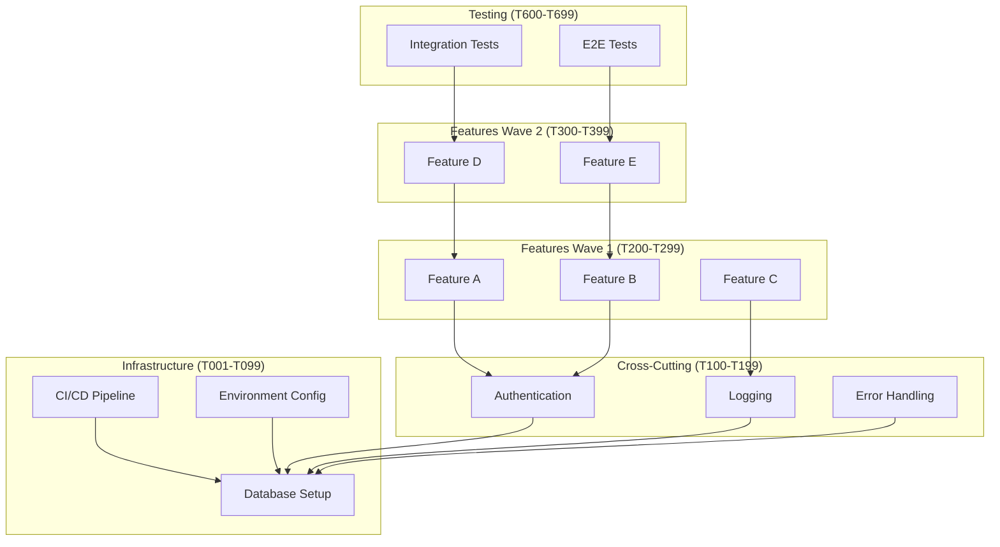

# IDEAL-STI v3.0: Iterative Development Enhancement with Adaptive Learning

**Template**: ideal-sti-v3
**Context**: `<prompt-arguments>`
**Version**: 3.0.0
**Methodology**: Prompt-as-Code with Runtime Decision Making following phased-prompt.md template

## Executive Directive

You are implementing IDEAL-STI v3.0, an adaptive orchestration system that transforms user requirements into executable implementation tasks through intelligent discovery, requirements engineering, architecture planning, task generation, and parallel feature development. Execute all phases sequentially using the phased-prompt.md template structure with progressive knowledge building.

---

## GLOBAL START

**Execute ONCE at the beginning of any prompt using this framework**

### Framework Initialization

```markdown
WHEN starting ANY prompt using this framework:

1. SET GLOBAL VARIABLES (once only):
   <worktree> = $(pwd)  # Never change this
   <original-requirements> = <prompt-arguments>

2. CREATE DIRECTORY STRUCTURE:
   mkdir -p "<worktree>/planning"   # Phase documentation
   mkdir -p "<worktree>/pending"    # Tasks awaiting development
   mkdir -p "<worktree>/completed"  # Finished tasks
   mkdir -p "<worktree>/docs"       # Final deliverables

3. ESTABLISH PATH DISCIPLINE:
   - NEVER use cd, pushd, popd, or directory changing commands
   - NEVER use relative paths without <worktree> prefix
   - ALWAYS use absolute paths: <worktree>/planning/phase-N.md
   - ALWAYS use git -C "<worktree>" for ALL git operations

4. LOAD ORIGINAL REQUIREMENTS:
   Parse <prompt-arguments> to identify:
   - What needs to be accomplished
   - Expected deliverables
   - Quality standards
   - Any constraints or dependencies

5. PLAN PHASE STRUCTURE:
   Determine phases needed based on complexity:
   - Phase 1: Use Case Discovery (always required)
   - Phase 2: Requirements Generation (always required)
   - Phase 3: Architecture Definition (always required)
   - Phase 4: Task Generation & Organization (always required)
   - Phase 5: Parallel Feature Development (always required)
   - Phase 6: Integration & Testing (always required)
   - Phase 7: Deployment Preparation (always required)

Framework is now initialized and ready for phases.
```

---

## PHASE 1: USE CASE DISCOVERY

**Purpose**: Generate comprehensive use cases from user requirements via prompter

### Phase Purpose & Dependencies

**PHASE_PURPOSE**: Transform user requirements into structured use cases with acceptance criteria

**DEPENDENCIES**:
- Input from Global Start: <original-requirements>
- External dependencies: None (initial phase)

**DELIVERABLES**: Complete use case specification in <worktree>/planning/use-cases.md

---

## Phase Activities

### 1. Rehydration & Intelligence Loading

Load accumulated wisdom from previous phases:

Since this is Phase 1, no previous phases exist.
Initialize empty knowledge base for future phases.

Document initialization in: <worktree>/planning/phase-1.md

### 2. Input Extraction & Validation

Extract what this phase needs:
- From <original-requirements>: User's stated requirements and goals
- Missing inputs: Document any unclear requirements for clarification

### 3. Criteria Definition (Runtime Intelligence)

Define success criteria for use case generation:

**SUCCESS_CRITERIA**: What constitutes completion
- Minimum 8 use cases for medium projects (adjust based on scope)
- Each use case follows "As a [user], I want [goal], so that [benefit]" format
- Definition of Ready and Done criteria for each use case
- Confidence scores ≥ 70% for critical use cases

**ANTI_CRITERIA**: What must be avoided
- Vague or unmeasurable use cases
- Missing acceptance criteria
- Duplicate functionality across use cases

**DEPENDENCY_CRITERIA**: External requirements
- Alignment with original requirements
- Technical feasibility consideration

### 4. Research & Discovery

Research use case patterns and best practices:
- Analyze similar project patterns
- Identify user personas and workflows
- Research domain-specific requirements

### 5. Planning

Plan the use case generation approach:
- Determine project complexity level (prototype/small/medium/large/enterprise)
- Set quality thresholds based on complexity
- Plan prompter invocation strategy

### 6. Review & Validation

Before executing, validate the plan:
- Does approach align with original requirements?
- Are complexity assessments reasonable?
- Is prompter strategy appropriate?

IF plan needs refinement:
  Return to Planning (activity 5) with adjustments
OTHERWISE:
  Proceed to execution

### 7. Execution

Execute use case generation:

**INVOKE**: `ask subagent prompter on use-case-expander with requirements at <original-requirements>`
**TIMEOUT**: 1200 seconds maximum (20 minutes)
**CAPTURE**: Raw output to <worktree>/planning/use-cases.md

### 8. Quality Iteration Loop

FOR iteration FROM 1 TO 10:

  Evaluate against SUCCESS_CRITERIA:
  - Count generated use cases vs. minimum threshold
  - Validate format compliance ("As a..." structure)
  - Check for Definition of Ready/Done criteria
  - Assess confidence scores
  - Calculate coverage score and completeness score

  IF quality score >= 80% THEN:
    Break from loop (phase complete)

  OTHERWISE:
    **KEY LEARNING**: Document what was discovered this iteration
    - Coverage gaps identified
    - Format issues found
    - Missing acceptance criteria

    Adjust approach based on learnings:
    - Retry with expanded scope if coverage < 60%
    - Focus on completion if format issues exist
    - Request user clarification if fundamental gaps

    Return to Execution (activity 7) with refinements

### 9. Documentation & Knowledge Capture

Append complete phase results to: <worktree>/planning/phase-1.md

Include:
- Use case generation completed with quality metrics
- Total use cases generated and confidence levels
- Patterns discovered for future phases
- Quality iterations performed and learnings
- Final deliverable: <worktree>/planning/use-cases.md

---

## PHASE 2: REQUIREMENTS GENERATION

**Purpose**: Generate detailed functional and non-functional requirements from use cases

### Phase Purpose & Dependencies

**PHASE_PURPOSE**: Transform use cases into measurable technical requirements

**DEPENDENCIES**:
- Input from Phase 1: <worktree>/planning/use-cases.md
- Original requirements: <original-requirements>

**DELIVERABLES**: Complete requirements specification in <worktree>/planning/requirements.md

---

## Phase Activities

### 1. Rehydration & Intelligence Loading

Load accumulated wisdom from previous phases:

Load Phase 1 outputs: <worktree>/planning/use-cases.md
Extract intelligence:
- User personas identified
- System complexity indicators
- Integration needs discovered
- Patterns for requirements derivation

Generate intelligent predefinitions:
- **CRITERIA_HINTS**: Expected FR/NFR patterns from use case analysis
- **RESEARCH_FOCUS**: Technical areas requiring investigation
- **QUALITY_THRESHOLDS**: Expected requirements count and evidence scores

Document rehydration results in: <worktree>/planning/phase-2.md

### 2. Input Extraction & Validation

Extract what this phase needs:
- From Phase 1: Complete use case content
- From original requirements: Technical constraints and context
- Missing inputs: Note any gaps in use case coverage

### 3. Criteria Definition (Runtime Intelligence)

Using CRITERIA_HINTS from rehydration, define:

**SUCCESS_CRITERIA**: What constitutes completion
- Minimum 10 FR-* functional requirements
- Minimum 5 NFR-* non-functional requirements
- Evidence scores for each requirement
- Rationale linking requirements to use cases
- Bidirectional traceability matrix

**ANTI_CRITERIA**: What must be avoided
- Unmeasurable or vague requirements
- Requirements without use case justification
- Missing non-functional considerations

**DEPENDENCY_CRITERIA**: External requirements
- Technical feasibility within constraints
- Consistency with Phase 1 use cases

### 4. Research & Discovery

Using RESEARCH_FOCUS from rehydration:
- Analyze use cases for implicit requirements
- Research domain-specific NFR patterns
- Investigate technical constraints and dependencies
- Study integration requirements

### 5. Planning

Using validated strategies from rehydration:
- Plan requirements extraction methodology
- Determine NFR derivation approach
- Plan prompter invocation with use case content

### 6. Review & Validation

Before executing, validate the plan:
- Does approach cover all use cases comprehensively?
- Are NFR derivation patterns appropriate?
- Will output meet success criteria?

IF plan needs refinement:
  Return to Planning with new considerations
OTHERWISE:
  Proceed to execution

### 7. Execution

Execute requirements generation:

**READ**: <worktree>/planning/use-cases.md content
**INVOKE**: `ask subagent prompter on requirements-generator with use-cases at <worktree>/planning/use-cases.md`
**TIMEOUT**: 1200 seconds maximum (20 minutes)
**CAPTURE**: Raw output to <worktree>/planning/requirements.md

### 8. Quality Iteration Loop

Using QUALITY_THRESHOLDS from rehydration:

FOR iteration FROM 1 TO 10:

  Evaluate against SUCCESS_CRITERIA:
  - Count FR-* and NFR-* requirements vs. thresholds
  - Validate evidence scores and rationale quality
  - Check traceability to use cases
  - Assess requirement measurability

  IF quality score >= 80% THEN:
    Break from loop (phase complete)

  OTHERWISE:
    **KEY LEARNING**: Document iteration discoveries
    - Requirements gaps identified
    - Traceability issues found
    - NFR coverage problems

    Refine approach based on learnings and return to Execution

### 9. Documentation & Knowledge Capture

Append complete phase results to: <worktree>/planning/phase-2.md

Include:
- Requirements generation completed with metrics
- FR/NFR counts and evidence quality
- Traceability analysis results
- Quality iterations and key learnings
- Insights for architecture phase
- Final deliverable: <worktree>/planning/requirements.md

---

## PHASE 3: ARCHITECTURE DEFINITION

**Purpose**: Research and generate comprehensive technology architecture using recommend-tech framework

### Phase Purpose & Dependencies

**PHASE_PURPOSE**: Research solutions and create detailed technology architecture decisions using progressive analysis

**DEPENDENCIES**:
- Input from Phase 1: <worktree>/planning/use-cases.md
- Input from Phase 2: <worktree>/planning/requirements.md
- Original requirements: <original-requirements>

**DELIVERABLES**: Complete architecture specification in <worktree>/planning/architecture.md

---

## Phase Activities

### 1. Rehydration & Intelligence Loading

Load accumulated wisdom from previous phases:

Load Phase 1 & 2 outputs:
- Use cases with user personas and complexity indicators
- Requirements with technical and NFR patterns
- Integration points and constraints discovered

Generate intelligent predefinitions:
- **CRITERIA_HINTS**: Expected architecture complexity from requirements
- **RESEARCH_FOCUS**: Technology areas requiring deep analysis
- **PLANNING_BASELINE**: Priority-based technology framework approach
- **QUALITY_THRESHOLDS**: Expected 8-phase analysis completion with 85%+ confidence

Document rehydration results in: <worktree>/planning/phase-3.md

### 2. Input Extraction & Validation

Extract what this phase needs:
- From Phase 1: Use case complexity and user workflow patterns
- From Phase 2: Technical requirements and NFR constraints
- Integration requirements: External systems and APIs
- Missing inputs: Note any architectural constraint gaps

### 3. Criteria Definition (Runtime Intelligence)

Using CRITERIA_HINTS from rehydration, define:

**SUCCESS_CRITERIA**: What constitutes completion
- Complete 8-phase progressive technology research
- All 9 technology categories addressed (Execution, Storage, Format, UI, Auth, API, Testing, Language, CI/CD)
- Priority levels justified (0-9 scale) with complexity scoring
- Final confidence ≥ 85% with architecture specification
- Technology decisions traceable to requirements

**ANTI_CRITERIA**: What must be avoided
- Over-engineering (unjustified high-priority selections)
- Under-engineering (missing critical capabilities)
- Technology choices without requirement justification
- Incomplete analysis of alternatives

**DEPENDENCY_CRITERIA**: External requirements
- Architecture must support all use cases
- Technology stack must satisfy all NFRs
- Solutions must fit within stated constraints

### 4. Research & Discovery

Using RESEARCH_FOCUS from rehydration:
- Analyze architectural implications of requirements
- Research technology category priorities
- Investigate integration patterns and constraints
- Study performance and scalability needs

### 5. Planning

Using PLANNING_BASELINE from rehydration:
- Plan comprehensive architecture analysis via recommend-tech
- Prepare use cases and requirements for prompter input
- Plan 20-minute analysis execution strategy

### 6. Review & Validation

Before executing, validate the plan:
- Are use cases and requirements properly formatted for prompter?
- Will recommend-tech framework address all architectural needs?
- Is analysis approach comprehensive enough?

IF plan needs refinement:
  Return to Planning with architectural adjustments
OTHERWISE:
  Proceed to execution

### 7. Execution

Execute architecture generation via progressive technology research:

**READ**: <worktree>/planning/use-cases.md and <worktree>/planning/requirements.md content
**INVOKE**: `ask subagent prompter on recommend-tech with use-cases at <worktree>/planning/use-cases.md and requirements at <worktree>/planning/requirements.md`
**TIMEOUT**: 1200 seconds maximum (20 minutes)
**CAPTURE**: Raw output to <worktree>/planning/architecture.md

### 8. Quality Iteration Loop

Using QUALITY_THRESHOLDS from rehydration:

FOR iteration FROM 1 TO 10:

  Evaluate against SUCCESS_CRITERIA:
  - Validate 8-phase analysis completion
  - Check all 9 technology categories addressed
  - Verify priority justifications and complexity scoring
  - Assess final confidence level (target ≥ 85%)
  - Validate architecture addresses all requirements

  IF quality score >= 85% THEN:
    Break from loop (phase complete)

  OTHERWISE:
    **KEY LEARNING**: Document iteration discoveries
    - Technology gaps identified
    - Priority justification issues
    - Requirements coverage problems
    - Confidence level shortfalls

    Refine prompter inputs or approach and return to Execution

### 9. Documentation & Knowledge Capture

Append complete phase results to: <worktree>/planning/phase-3.md

Include:
- Architecture elaboration completed via recommend-tech
- Technology stack decisions with priority levels
- Complexity scoring and justification analysis
- Quality iterations and confidence building
- Integration patterns and migration considerations
- Final deliverable: <worktree>/planning/architecture.md with complete technology specification

---

## PHASE 4: TASK GENERATION & ORGANIZATION

**Purpose**: Generate actionable implementation tasks from architecture and requirements

### Phase Purpose & Dependencies

**PHASE_PURPOSE**: Transform architecture decisions into parallel development tasks

**DEPENDENCIES**:
- Input from Phase 1: <worktree>/planning/use-cases.md
- Input from Phase 2: <worktree>/planning/requirements.md
- Input from Phase 3: <worktree>/planning/architecture.md
- Directory structure: <worktree>/pending/ and <worktree>/completed/

**DELIVERABLES**: Individual task files in <worktree>/pending/ ready for parallel development

---

## Phase Activities

### 1. Rehydration & Intelligence Loading

Load accumulated wisdom from previous phases:

Load all prior outputs:
- Use cases with user workflows and acceptance criteria
- Requirements with FR/NFR specifications and traceability
- Architecture with technology stack and implementation patterns

Generate intelligent predefinitions:
- **CRITERIA_HINTS**: Expected task complexity and organization patterns
- **RESEARCH_FOCUS**: Implementation areas requiring task breakdown
- **PLANNING_BASELINE**: Task categorization and dependency strategies
- **QUALITY_THRESHOLDS**: Expected task count and granularity levels

Document rehydration results in: <worktree>/planning/phase-4.md

### 2. Input Extraction & Validation

Extract what this phase needs:
- From architecture: Implementation components and technology choices
- From requirements: Functional scope and acceptance criteria
- From use cases: User workflow priorities and dependencies
- Missing inputs: Note any implementation planning gaps

### 3. Criteria Definition (Runtime Intelligence)

Using CRITERIA_HINTS from rehydration, define:

**SUCCESS_CRITERIA**: What constitutes completion
- All requirements covered by specific tasks
- Tasks appropriately granular for parallel development
- Clear acceptance criteria for each task
- Dependencies identified and managed
- Tasks organized in <worktree>/pending/ directory

**ANTI_CRITERIA**: What must be avoided
- Overly large tasks that block parallel work
- Task dependencies that create serial bottlenecks
- Tasks without clear acceptance criteria
- Missing coverage of critical requirements

**DEPENDENCY_CRITERIA**: External requirements
- Tasks must align with architecture decisions
- Implementation must be feasible with selected technology stack
- Parallel execution must be viable

### 4. Research & Discovery

Using RESEARCH_FOCUS from rehydration:
- Analyze architecture for natural task boundaries
- Research implementation patterns for selected technologies
- Study task organization best practices
- Investigate parallel development strategies

### 5. Planning

Using PLANNING_BASELINE from rehydration:
- Plan comprehensive task generation strategy
- Determine task granularity and organization approach
- Plan feature-task-creator prompter invocation

### 6. Review & Validation

Before executing, validate the plan:
- Will task generation cover all architectural components?
- Is approach suitable for parallel development?
- Are dependencies properly considered?

IF plan needs refinement:
  Return to Planning with task organization adjustments
OTHERWISE:
  Proceed to execution

### 7. Execution

Execute task generation, dependency analysis, and parallel execution planning:

**STEP 1 - Generate Tasks**:
**INVOKE**: `ask subagent prompter on feature-task-creator use cases at <worktree>/planning/use-cases.md and requirements at <worktree>/planning/requirements.md and architecture at <worktree>/planning/architecture.md`
**TIMEOUT**: 1200 seconds maximum (20 minutes)
**CAPTURE**: Raw markdown output with all task specifications

**STEP 2 - Parse Task Specifications**:
Parse the markdown output to extract individual task specifications:
- Identify task boundaries (### Task T###: sections)
- Extract task ID, name, dependencies, priority, effort
- Parse epic/story mappings and acceptance criteria
- Preserve all formatting and implementation details

**STEP 3 - Create Task Files**:
FOR each parsed task specification:
  **CREATE**: File <worktree>/pending/TASK-{ID}-{name-slug}.md
  **CONTENT**: Complete task specification in feature-developer format:
    - Task ID and name
    - Epic and story mappings
    - Priority and effort estimates
    - Dependencies list
    - Acceptance criteria
    - Testing requirements
    - Implementation notes

**STEP 4 - Generate Dependency Graph**:
Create mermaid visualization of task dependencies:



**STEP 5 - Identify Parallel Execution Waves**:
Analyze dependencies to create execution waves:

**Wave 1 - Infrastructure** (Sequential):
- Tasks T001-T099 with dependencies respected
- Must complete before other waves

**Wave 2 - Cross-Cutting** (Parallel):
- Tasks T100-T199 that have no interdependencies
- Can execute in parallel after infrastructure

**Wave 3 - Features Group A** (Parallel):
- Tasks T200-T299 with no blocking dependencies
- Execute: `in parallel ask feature-developer on task with files at <worktree>/pending/TASK-200-*.md <worktree>/pending/TASK-201-*.md ...`

**Wave 4 - Features Group B** (Parallel):
- Tasks T300-T399 depending on Wave 3
- Execute: `in parallel ask feature-developer on task with files at <worktree>/pending/TASK-300-*.md <worktree>/pending/TASK-301-*.md ...`

**Wave 5 - Testing & Deployment** (Sequential):
- Tasks T600-T699 after all features complete
- Final validation and deployment tasks

**STEP 6 - Document Execution Strategy**:
Create <worktree>/planning/parallel-execution-plan.md with:
- Dependency graph visualization
- Wave definitions and task groupings
- Parallel execution commands for each wave
- Expected completion timeline

### 8. Quality Iteration Loop

Using QUALITY_THRESHOLDS from rehydration:

FOR iteration FROM 1 TO 10:

  Evaluate against SUCCESS_CRITERIA:
  - Count generated tasks vs. requirements coverage
  - Validate task granularity for parallel development
  - Check acceptance criteria completeness
  - Assess dependency management
  - Verify all tasks in correct <worktree>/pending/ location

  IF quality score >= 80% THEN:
    Break from loop (phase complete)

  OTHERWISE:
    **KEY LEARNING**: Document iteration discoveries
    - Task coverage gaps identified
    - Granularity issues found
    - Dependency problems discovered

    Refine task generation approach and return to Execution

### 9. Documentation & Knowledge Capture

Append complete phase results to: <worktree>/planning/phase-4.md

Include:
- Task generation completed with coverage analysis
- Total tasks created and organization strategy
- Dependency analysis and parallel execution readiness
- Quality iterations and task refinements
- Final deliverable: Multiple TASK-###.md files in <worktree>/pending/

---

## PHASE 5: PARALLEL FEATURE DEVELOPMENT

**Purpose**: Execute all implementation tasks in parallel via feature-developer agents

### Phase Purpose & Dependencies

**PHASE_PURPOSE**: Implement all features concurrently using parallel feature-developer agents

**DEPENDENCIES**:
- Input from Phase 4: Task files in <worktree>/pending/
- Architecture reference: <worktree>/planning/architecture.md
- Requirements context: <worktree>/planning/requirements.md and use-cases.md
- Directory structure: <worktree>/completed/ for finished tasks

**DELIVERABLES**: All tasks completed and moved to <worktree>/completed/ with implementations

---

## Phase Activities

### 1. Rehydration & Intelligence Loading

Load accumulated wisdom from previous phases:

Load all task and planning context:
- Task files from <worktree>/pending/ with acceptance criteria
- Architecture decisions for implementation guidance
- Requirements and use cases for development context

Generate intelligent predefinitions:
- **CRITERIA_HINTS**: Expected parallel execution patterns and completion criteria
- **RESEARCH_FOCUS**: Implementation coordination and quality assurance needs
- **PLANNING_BASELINE**: Parallel agent management strategies
- **QUALITY_THRESHOLDS**: Task completion rates and quality expectations

Document rehydration results in: <worktree>/planning/phase-5.md

### 2. Input Extraction & Validation

Extract what this phase needs:
- From pending directory: All TASK-###.md files requiring implementation
- From architecture: Technology stack and implementation patterns
- From requirements: Quality standards and acceptance criteria
- Missing inputs: Note any task preparation gaps

### 3. Criteria Definition (Runtime Intelligence)

Using CRITERIA_HINTS from rehydration, define:

**SUCCESS_CRITERIA**: What constitutes completion
- All tasks moved from <worktree>/pending/ to <worktree>/completed/
- Each task implemented according to acceptance criteria
- Implementation follows architecture decisions
- Code quality meets requirements standards
- No blocking dependencies prevent parallel execution

**ANTI_CRITERIA**: What must be avoided
- Tasks blocking each other unnecessarily
- Implementation deviating from architecture
- Incomplete task implementations
- Quality standards not met

**DEPENDENCY_CRITERIA**: External requirements
- Each feature-developer operates independently
- Shared planning files remain read-only during development
- Task lifecycle management handled by feature-developer agents

### 4. Research & Discovery

Using RESEARCH_FOCUS from rehydration:
- Analyze task interdependencies for parallel execution
- Research feature-developer agent coordination patterns
- Study task completion tracking strategies
- Investigate quality assurance during parallel development

### 5. Planning

Using PLANNING_BASELINE from rehydration:
- Plan parallel agent launch strategy
- Determine task assignment and monitoring approach
- Plan completion tracking and quality validation

### 6. Review & Validation

Before executing, validate the plan:
- Are all tasks ready for parallel development?
- Is feature-developer agent strategy sound?
- Can task completion be properly tracked?

IF plan needs refinement:
  Return to Planning with parallel execution adjustments
OTHERWISE:
  Proceed to execution

### 7. Execution

Execute wave-based parallel feature development according to execution plan:

**LOAD**: Parallel execution plan from <worktree>/planning/parallel-execution-plan.md

**EXECUTE BY WAVES**:

FOR each execution wave in parallel-execution-plan:

  IF wave.type == "Sequential" THEN:
    FOR each task in wave.tasks (in dependency order):
      **INVOKE**: `ask subagent feature-developer on task with file at <worktree>/pending/TASK-{ID}-*.md`
      **TIMEOUT**: 1200 seconds maximum per task (20 minutes)
      **WAIT**: For completion before next task

  ELSE IF wave.type == "Parallel" THEN:
    **INVOKE**: `in parallel ask feature-developer on task with files at {task1.path} {task2.path} {task3.path} ...`
    WHERE: task paths are all tasks in current wave with no blocking dependencies
    **TIMEOUT**: 1200 seconds maximum per task (20 minutes)
    **WAIT**: For all parallel tasks in wave to complete before next wave

**EXAMPLE WAVE EXECUTION**:

Wave 1 - Infrastructure (Sequential):
```
ask subagent feature-developer on task with file at <worktree>/pending/TASK-001-database-setup.md
ask subagent feature-developer on task with file at <worktree>/pending/TASK-002-cicd-pipeline.md
```

Wave 2 - Cross-Cutting (Parallel):
```
in parallel ask feature-developer on task with files at \
  <worktree>/pending/TASK-100-authentication.md \
  <worktree>/pending/TASK-101-logging.md \
  <worktree>/pending/TASK-102-error-handling.md
```

Wave 3 - Features Group A (Parallel):
```
in parallel ask feature-developer on task with files at \
  <worktree>/pending/TASK-200-feature-a.md \
  <worktree>/pending/TASK-201-feature-b.md \
  <worktree>/pending/TASK-202-feature-c.md
```

**COORDINATION**: Each feature-developer agent:
- Loads specific task from <worktree>/pending/
- References architecture from <worktree>/planning/architecture.md
- Implements according to acceptance criteria
- Moves completed task to <worktree>/completed/ upon successful completion
- Documents implementation patterns in task file

### 8. Quality Iteration Loop

Using QUALITY_THRESHOLDS from rehydration:

FOR iteration FROM 1 TO 10:

  Evaluate against SUCCESS_CRITERIA:
  - Count tasks remaining in <worktree>/pending/
  - Count tasks completed in <worktree>/completed/
  - Validate implementation quality of completed tasks
  - Check adherence to architecture decisions
  - Assess overall development progress

  IF all tasks completed AND quality score >= 80% THEN:
    Break from loop (phase complete)

  OTHERWISE:
    **KEY LEARNING**: Document iteration discoveries
    - Parallel execution bottlenecks identified
    - Quality issues in implementations
    - Architecture adherence problems
    - Task completion blocking factors

    Address issues and continue monitoring parallel development

### 9. Documentation & Knowledge Capture

Append complete phase results to: <worktree>/planning/phase-5.md

Include:
- Parallel feature development completed
- Total tasks implemented and quality assessment
- Implementation patterns documented across tasks
- Quality iterations and issue resolution
- Architecture adherence analysis
- Final deliverable: All TASK-###.md files moved to <worktree>/completed/ with implementations

---

## PHASE 6: INTEGRATION & TESTING

**Purpose**: Integrate completed features and execute comprehensive testing

### Phase Purpose & Dependencies

**PHASE_PURPOSE**: Validate all implementations work together and meet quality standards

**DEPENDENCIES**:
- Input from Phase 5: Completed task implementations in <worktree>/completed/
- Architecture reference: <worktree>/planning/architecture.md
- Requirements for validation: <worktree>/planning/requirements.md
- Use cases for test scenarios: <worktree>/planning/use-cases.md

**DELIVERABLES**: Integrated system with test results and quality reports

---

## Phase Activities

### 1. Rehydration & Intelligence Loading

Load accumulated wisdom from previous phases:

Load all prior outputs:
- Task implementations from <worktree>/completed/
- Architecture patterns from Phase 3
- Requirements and acceptance criteria from Phases 1-2
- Implementation learnings from Phase 5

Generate intelligent predefinitions:
- **CRITERIA_HINTS**: Expected integration challenges and test patterns
- **RESEARCH_FOCUS**: Quality assurance areas requiring attention
- **PLANNING_BASELINE**: Testing strategies and integration approaches
- **QUALITY_THRESHOLDS**: Test coverage targets and performance benchmarks

Document rehydration results in: <worktree>/planning/phase-6.md

### 2. Input Extraction & Validation

Extract what this phase needs:
- From completed tasks: Implementation details and interfaces
- From architecture: Integration patterns and system design
- From requirements: Quality criteria and performance targets
- Missing inputs: Note any incomplete implementations

### 3. Criteria Definition (Runtime Intelligence)

Using CRITERIA_HINTS from rehydration, define:

**SUCCESS_CRITERIA**: What constitutes completion
- All unit tests passing (>80% coverage)
- Integration tests successful
- E2E test scenarios validated
- Performance benchmarks met
- Security requirements validated

**ANTI_CRITERIA**: What must be avoided
- Untested code paths
- Integration failures
- Performance regressions
- Security vulnerabilities

**DEPENDENCY_CRITERIA**: External requirements
- Test environment availability
- External service dependencies
- Data fixtures and test data

### 4. Research & Discovery

Using RESEARCH_FOCUS from rehydration:
- Analyze implementation interfaces for integration points
- Research testing patterns for technology stack
- Investigate performance testing approaches
- Study security testing requirements

### 5. Planning

Using PLANNING_BASELINE from rehydration:
- Plan integration sequence
- Design test execution strategy
- Plan performance benchmarking
- Schedule security validation

### 6. Review & Validation

Before executing, validate the plan:
- Are all components ready for integration?
- Is test coverage comprehensive?
- Are test environments prepared?

IF plan needs refinement:
  Return to Planning with testing adjustments
OTHERWISE:
  Proceed to execution

### 7. Execution

Execute integration and testing:

**STEP 1 - Component Integration**:
Integrate all completed components:
- Verify interface compatibility
- Resolve integration conflicts
- Document integration patterns

**STEP 2 - Test Suite Development**:
IF test specifications needed THEN:
  **INVOKE**: `ask subagent qa-analyst on test specifications with implementations at <worktree>/completed/`
  **TIMEOUT**: 1200 seconds maximum (20 minutes)

**STEP 3 - Test Execution**:
Execute comprehensive test suite:
- Unit tests for all components
- Integration tests for workflows
- E2E tests for user scenarios
- Performance benchmarks
- Security validation

**STEP 4 - Quality Analysis**:
Analyze test results:
- Calculate code coverage
- Identify failing tests
- Document performance metrics
- Report security findings

### 8. Quality Iteration Loop

Using QUALITY_THRESHOLDS from rehydration:

FOR iteration FROM 1 TO 10:

  Evaluate against SUCCESS_CRITERIA:
  - Unit test pass rate and coverage
  - Integration test success rate
  - E2E scenario validation
  - Performance benchmark achievement
  - Security requirement compliance

  IF quality score >= 85% THEN:
    Break from loop (phase complete)

  OTHERWISE:
    **KEY LEARNING**: Document iteration discoveries
    - Test failures identified
    - Integration issues found
    - Performance bottlenecks discovered
    - Security gaps detected

    Address issues and return to Execution

### 9. Documentation & Knowledge Capture

Append complete phase results to: <worktree>/planning/phase-6.md

Include:
- Integration completed with patterns documented
- Test results and coverage metrics
- Performance benchmarks achieved
- Security validation results
- Quality iterations and issue resolutions
- Final deliverable: Integrated and tested system

---

## PHASE 7: DEPLOYMENT PREPARATION

**Purpose**: Prepare system for production deployment

### Phase Purpose & Dependencies

**PHASE_PURPOSE**: Package, configure, and prepare system for production deployment

**DEPENDENCIES**:
- Input from Phase 6: Tested and integrated system
- Architecture deployment strategy: <worktree>/planning/architecture.md
- Infrastructure requirements: From Phase 3 architecture
- Configuration needs: From requirements and architecture

**DELIVERABLES**: Production-ready deployment package with documentation

---

## Phase Activities

### 1. Rehydration & Intelligence Loading

Load accumulated wisdom from previous phases:

Load all prior outputs:
- Integration results from Phase 6
- Architecture deployment decisions from Phase 3
- Infrastructure requirements
- Configuration patterns

Generate intelligent predefinitions:
- **CRITERIA_HINTS**: Deployment readiness patterns
- **RESEARCH_FOCUS**: Production environment considerations
- **PLANNING_BASELINE**: Deployment strategies and rollback plans
- **QUALITY_THRESHOLDS**: Production readiness criteria

Document rehydration results in: <worktree>/planning/phase-7.md

### 2. Input Extraction & Validation

Extract what this phase needs:
- From integration phase: System components and dependencies
- From architecture: Deployment topology and infrastructure
- From requirements: Production SLAs and constraints
- Missing inputs: Note any deployment blockers

### 3. Criteria Definition (Runtime Intelligence)

Using CRITERIA_HINTS from rehydration, define:

**SUCCESS_CRITERIA**: What constitutes completion
- Deployment packages created
- Configuration management ready
- CI/CD pipeline configured
- Monitoring and alerting setup
- Documentation complete
- Rollback procedures defined

**ANTI_CRITERIA**: What must be avoided
- Hardcoded configurations
- Missing environment variables
- Incomplete deployment scripts
- No rollback capability
- Missing monitoring

**DEPENDENCY_CRITERIA**: External requirements
- Production environment access
- Deployment credentials
- External service configurations
- SSL certificates and security

### 4. Research & Discovery

Using RESEARCH_FOCUS from rehydration:
- Research deployment best practices for technology stack
- Investigate container/serverless options
- Study monitoring and observability patterns
- Analyze security hardening requirements

### 5. Planning

Using PLANNING_BASELINE from rehydration:
- Plan deployment packaging strategy
- Design configuration management
- Plan CI/CD pipeline setup
- Schedule deployment validation

### 6. Review & Validation

Before executing, validate the plan:
- Are all components deployment-ready?
- Is configuration management comprehensive?
- Are rollback procedures defined?

IF plan needs refinement:
  Return to Planning with deployment adjustments
OTHERWISE:
  Proceed to execution

### 7. Execution

Execute deployment preparation:

**STEP 1 - Package Creation**:
Create deployment packages:
- Build production artifacts
- Optimize assets and bundles
- Create container images if needed
- Package dependencies

**STEP 2 - Configuration Management**:
Setup configuration for all environments:
- Environment variables
- Secrets management
- Feature flags
- Service endpoints

**STEP 3 - CI/CD Pipeline**:
IF deployment automation needed THEN:
  **INVOKE**: `ask subagent deployment-orchestrator on CI/CD pipeline setup with system at <worktree>/completed/`
  **TIMEOUT**: 1200 seconds maximum (20 minutes)

**STEP 4 - Monitoring Setup**:
Configure monitoring and observability:
- Application metrics
- System health checks
- Log aggregation
- Alert rules

**STEP 5 - Documentation**:
Create deployment documentation:
- Deployment procedures
- Configuration guide
- Troubleshooting runbook
- Rollback procedures

### 8. Quality Iteration Loop

Using QUALITY_THRESHOLDS from rehydration:

FOR iteration FROM 1 TO 10:

  Evaluate against SUCCESS_CRITERIA:
  - Deployment packages validated
  - Configuration complete for all environments
  - CI/CD pipeline tested
  - Monitoring coverage adequate
  - Documentation comprehensive

  IF quality score >= 90% THEN:
    Break from loop (phase complete)

  OTHERWISE:
    **KEY LEARNING**: Document iteration discoveries
    - Packaging issues identified
    - Configuration gaps found
    - Pipeline problems discovered
    - Monitoring blind spots detected

    Address issues and return to Execution

### 9. Documentation & Knowledge Capture

Append complete phase results to: <worktree>/planning/phase-7.md

Include:
- Deployment preparation completed
- Package and configuration details
- CI/CD pipeline configuration
- Monitoring and alerting setup
- Documentation and runbooks
- Final deliverable: Production-ready deployment package

---

## GLOBAL END

**Execute AFTER all phases complete to ensure original requirements satisfied**

### Requirements Validation

```markdown
1. LOAD ORIGINAL REQUIREMENTS:
   Review <original-requirements> from Global Start

2. EVIDENCE GATHERING:
   For each requirement in original request:
   - Search ALL phase outputs for evidence of satisfaction
   - Check use cases, requirements, architecture, and task implementations
   - Document gaps or partial solutions

   Create requirements satisfaction matrix:
   | Requirement | Phase(s) Addressed | Implementation Tasks | Quality Score | Status |
   |-------------|-------------------|---------------------|---------------|--------|
   | [req1]      | Phase 1,2,6       | TASK-001, TASK-003 | 8.5/10       | ✅ SATISFIED |
   | [req2]      | Phase 2,4,6       | TASK-002           | 6.2/10       | ⚠️ PARTIAL |
```

### Global Quality Score Calculation

```markdown
GLOBAL_QUALITY_SCORE = (
  (REQUIREMENTS_SATISFACTION * 0.40) +
  (COMPLETENESS_SCORE * 0.25) +
  (COHERENCE_SCORE * 0.20) +
  (VALUE_DELIVERY * 0.15)
) * PHASE_CONSISTENCY_MULTIPLIER

MINIMUM_ACCEPTABLE_SCORE = 7.0/10.0

Quality Thresholds:
- 9.0-10.0: Exceptional - Exceeds expectations
- 8.0-8.9: Excellent - Fully satisfies with high quality
- 7.0-7.9: Good - Meets requirements acceptably
- 6.0-6.9: Marginal - Significant gaps or issues
- Below 6.0: Unacceptable - Requires remediation
```

### Meta-Learning Extraction

```markdown
Extract insights for future prompts:

SUCCESSFUL STRATEGIES:
- Which rehydration patterns led to better quality?
- Which criteria types proved most valuable?
- Which planning approaches yielded best results?
- Which iteration patterns converged fastest?
- How effective was parallel task execution?

FAILED APPROACHES:
- Criteria that proved unmeasurable or misleading
- Research directions that were dead ends
- Planning approaches that led to rework
- Quality patterns that missed issues
- Parallel execution coordination problems

FRAMEWORK EVOLUTION:
- Task generation effectiveness and improvements needed
- Feature-developer coordination patterns that worked/failed
- Architecture-to-implementation traceability success
- Quality assurance during parallel development
```

### Final Documentation

```markdown
Create comprehensive final report: <worktree>/docs/global-quality-review.md

Include:
- Requirements satisfaction matrix with evidence
- Global quality score with detailed breakdown
- Complete deliverable index for all implementations
- Task completion analysis and parallel execution effectiveness
- Meta-learning insights for future IDEAL-STI executions
- Executive summary for stakeholders

IF Global Quality Score < 7.0 THEN:
  Execute detailed remediation process:
  1. GAP ANALYSIS: Identify unsatisfied requirements and failed tasks
  2. TARGETED RE-EXECUTION: Re-run specific phases or tasks as needed
  3. QUALITY IMPROVEMENT: Address implementation and architecture gaps
  4. RE-VALIDATION: Ensure improved global quality score
```

---

## Framework Behavior Guarantees

When using this IDEAL-STI v3.0 framework, these behaviors are guaranteed:

1. **PROGRESSIVE KNOWLEDGE BUILDING**: Each phase builds on all previous phases
2. **TEMPLATE COMPLIANCE**: All phases follow phased-prompt.md 9-activity structure
3. **CONSISTENT FILE ORGANIZATION**: All planning in <worktree>/planning/, all tasks in pending/completed
4. **PARALLEL EXECUTION**: Tasks developed concurrently for maximum efficiency
5. **QUALITY ASSURANCE**: Built-in iteration loops with 10-iteration max per phase
6. **COMPLETE TRACEABILITY**: Requirements → Use Cases → Architecture → Tasks → Implementation → Testing → Deployment
7. **GRACEFUL DEGRADATION**: Best effort captured even at iteration limits
8. **GLOBAL VALIDATION**: Every execution ends with comprehensive requirements validation

## Execution Summary

This IDEAL-STI v3.0 implementation provides:
- **7 Complete Phases** following phased-prompt.md template structure:
  1. Use Case Discovery
  2. Requirements Generation
  3. Architecture Definition (with recommend-tech)
  4. Task Generation & Organization (with feature-task-creator)
  5. Parallel Feature Development (with feature-developer agents)
  6. Integration & Testing (with qa-analyst)
  7. Deployment Preparation (with deployment-orchestrator)
- **Progressive Knowledge Building** with rehydration between phases
- **Complete Task Lifecycle** from pending through completed directories
- **Quality Assurance** with built-in iteration loops and global validation
- **Comprehensive Documentation** in structured planning directory

Execute this framework to transform user requirements into fully implemented, tested, and deployment-ready systems with maximum parallelization, comprehensive state management, and complete requirements traceability.