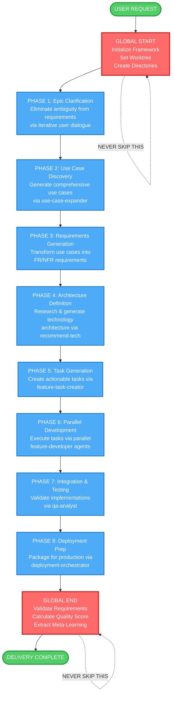
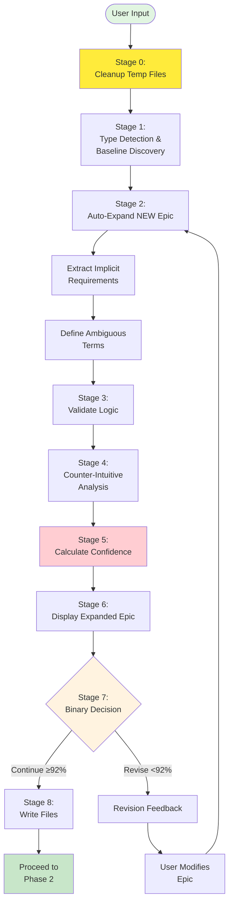
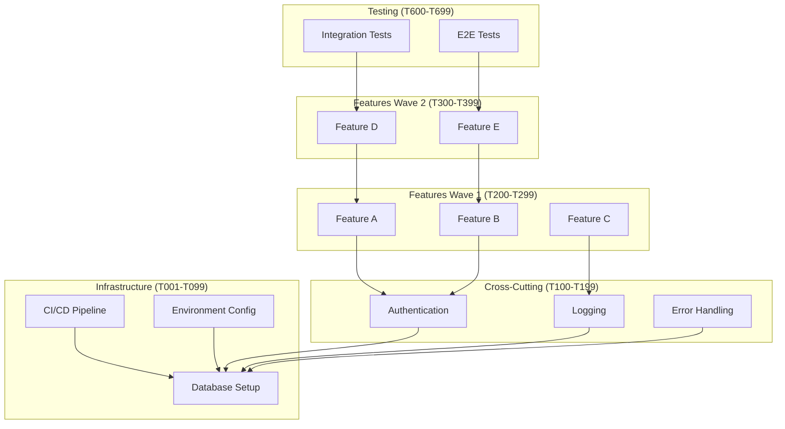

# IDEAL-STI v3.0: Iterative Development Enhancement with Adaptive Learning

**Template**: ideal-sti-v3
**Context**: `<prompt-arguments>`
**Version**: 3.0.0
**Methodology**: Prompt-as-Code with Runtime Decision Making following phased-prompt.md template

## Executive Directive

**⚡ MANDATORY SEQUENTIAL EXECUTION ⚡**

You are implementing IDEAL-STI v3.0, an adaptive orchestration system that MUST execute in STRICT SEQUENTIAL ORDER: GLOBAL START → PHASES 1-8 (in order) → GLOBAL END.

**CRITICAL**: You MUST NOT skip phases, execute out of order, or run phases in parallel. Each phase builds on the previous one. Attempting to skip ahead WILL cause system failure and incomplete deliverables.

This framework transforms user requirements into executable implementation through:
- GLOBAL START (mandatory initialization)
- 8 Sequential Phases (each depends on the previous)
- GLOBAL END (mandatory validation)

Execute using the phased-prompt.md template with progressive knowledge building.

---

## 🚨 CRITICAL EXECUTION ORDER - MANDATORY COMPLIANCE 🚨

**THIS IS NOT OPTIONAL - YOU MUST FOLLOW THIS EXACT SEQUENCE:**

1. **GLOBAL START** - ALWAYS execute FIRST (no exceptions)
2. **PHASE 1-8** - Execute in EXACT numerical order (no skipping, no parallel phases)
3. **GLOBAL END** - ALWAYS execute LAST (validates all requirements)

⚠️ **VIOLATIONS THAT WILL CAUSE FAILURE:**
- ❌ Skipping any phase
- ❌ Executing phases out of order
- ❌ Running phases in parallel
- ❌ Starting without GLOBAL START
- ❌ Ending without GLOBAL END
- ❌ Jumping to implementation before planning

**ENFORCEMENT**: Each phase MUST verify the previous phase completed successfully before proceeding.

---

## Process Flow Visualization



---

## GLOBAL START

**Execute ONCE at the beginning of any prompt using this framework**

### Framework Initialization

```markdown
WHEN starting ANY prompt using this framework:

1. CAPTURE ORIGINAL LOCATION (critical for safety checks):
   <original_pwd> = $(pwd)
   echo "📍 Original location captured: <original_pwd>"

2. GIT INITIALIZATION (Execute if not already a git repository):
   # Verify git repository exists, initialize if needed
   if ! [ -e "<original_pwd>/.git" ]; then
     echo "📝 Initializing git repository at <original_pwd>"
     git -C "<original_pwd>" init
     git -C "<original_pwd>" add -A
     git -C "<original_pwd>" commit -m "Initial commit for IDEAL-STI framework execution" || echo "⚠️ No files to commit in initial commit"
   else
     echo "✓ Git repository already initialized"
   fi

3. WORKTREE INITIALIZATION (Execute only if running as subagent):
   # Only create worktree if running as subagent to ensure isolation
   IF environment indicates subagent execution OR $(pwd) matches worktree pattern THEN:
     echo "🧠 THINKING: Subagent detected - creating isolated worktree for IDEAL-STI execution"

     # Generate unique worktree with anti-collision
     timestamp=$(date +%Y%m%d-%H%M%S)
     random_id=$(openssl rand -hex 3)
     worktree_name="ideal-sti-${timestamp}-${random_id}"
     worktree_path="/tmp/${worktree_name}"

     # Create worktree with new branch based on current
     current_branch=$(git -C "<original_pwd>" rev-parse --abbrev-ref HEAD 2>/dev/null || echo "main")
     worktree_branch="ideal-sti/${current_branch}-${timestamp}"

     echo "🔧 Creating worktree: ${worktree_path} on branch ${worktree_branch}"
     git -C "<original_pwd>" worktree add "${worktree_path}" -b "${worktree_branch}" "${current_branch}"

     # Apply uncommitted changes for continuity
     if ! git -C "<original_pwd>" diff --quiet HEAD 2>/dev/null; then
       echo "📋 Applying uncommitted changes to worktree"
       git -C "<original_pwd>" diff HEAD | git -C "${worktree_path}" apply
     fi

     # Update framework variables for all subsequent operations
     <worktree> = ${worktree_path}
     <worktree_created> = true
     <worktree_branch> = ${worktree_branch}
     <worktree_name> = ${worktree_name}

     echo "✅ Worktree created for IDEAL-STI isolation: ${worktree_name}"
   ELSE:
     echo "📝 Standard execution mode - using current directory"
     <worktree> = <original_pwd>
     <worktree_created> = false
   FI

   <original-requirements> = <prompt-arguments>

4. CREATE DIRECTORY STRUCTURE:
   mkdir -p "<worktree>/planning"            # Phase documentation
   mkdir -p "<worktree>/planning/pending"    # Tasks awaiting development
   mkdir -p "<worktree>/planning/completed"  # Finished tasks
   mkdir -p "<worktree>/docs"                # Final deliverables

5. ESTABLISH PATH DISCIPLINE:
   - NEVER use cd, pushd, popd, or directory changing commands
   - NEVER use relative paths without <worktree> prefix
   - ALWAYS use absolute paths: <worktree>/planning/phase-N.md
   - ALWAYS use git -C "<worktree>" for ALL git operations

6. LOAD ORIGINAL REQUIREMENTS:
   Parse <prompt-arguments> to identify:
   - What needs to be accomplished
   - Expected deliverables
   - Quality standards
   - Any constraints or dependencies

7. PLAN PHASE STRUCTURE:
   Determine phases needed based on complexity:
   - Phase 1: Epic Clarification (always required)
   - Phase 2: Use Case Discovery (always required)
   - Phase 3: Requirements Generation (always required)
   - Phase 4: Architecture Definition (always required)
   - Phase 5: Task Generation & Organization (always required)
   - Phase 6: Parallel Feature Development (always required)
   - Phase 7: Integration & Testing (always required)
   - Phase 8: Deployment Preparation (always required)

Framework is now initialized and ready for phases.
```

### TODO LIST INITIALIZATION & MANAGEMENT

```markdown
**Initialize Framework Backbone**:
Create EXACTLY these 10 todos - these are the immutable backbone of execution:
- GLOBAL START: Initialize Framework
- PHASE 1: EPIC CLARIFICATION
- PHASE 2: USE CASE DISCOVERY
- PHASE 3: REQUIREMENTS GENERATION
- PHASE 4: ARCHITECTURE DEFINITION
- PHASE 5: TASK GENERATION & ORGANIZATION
- PHASE 6: PARALLEL FEATURE DEVELOPMENT
- PHASE 7: INTEGRATION & TESTING
- PHASE 8: DEPLOYMENT PREPARATION
- GLOBAL END: Validate Requirements

Mark GLOBAL START as "in_progress" immediately.

**Discovered Work Mapping Protocol**:
When new work items are discovered during execution:

1. FIRST CHECK: Is this already covered by an upcoming phase?
   - "Need to define API endpoints" → Already covered by PHASE 3 (Requirements)
   - "Need to choose database" → Already covered by PHASE 4 (Architecture)
   - "Need to write tests" → Already covered by PHASE 7 (Integration & Testing)

2. IF already covered by a phase:
   - Make a note in <worktree>/planning/phase-X-notes.md
   - DO NOT create a new todo
   - Address it when that phase executes

3. IF truly novel and not covered:
   - Determine which phase it belongs to
   - Add to that phase's execution scope
   - Document in phase planning file
   - Still execute within the phase structure

The 9 backbone todos NEVER change - only their internal scope expands.
```

---

## PHASE 1: EPIC CLARIFICATION - Auto-Expansion & Validation

**Purpose**: Generate the TARGET/NEW epic that defines desired end state, with baseline as reference context for DELTA projects

**PHASE TODO PROTOCOL**:
- Mark GLOBAL START as "completed"
- Mark PHASE 1: EPIC CLARIFICATION as "in_progress"
- Clean temporary delta files from prior runs
- Auto-expand epic to 92%+ confidence threshold
- Present binary choice: Continue or Revise

### Phase Flow Diagram



### Stage 0: Startup Cleanup

Clean temporary artifacts from previous runs:

```bash
# ALWAYS execute this before any work begins
rm -f <worktree>/planning/*-delta.md

# Ensure planning directory exists
mkdir -p <worktree>/planning
```

**Rationale**: Delta files are computed artifacts, should be regenerated fresh each iteration.

### Stage 1: Project Type Detection & Baseline Discovery

Determine if this is NEW (greenfield) or DELTA (modification) project:

```markdown
TYPE_DETECTION_AND_BASELINE:

1. PROJECT TYPE DETECTION:
   Analyze user input for classification:
   - DELTA indicators: "update", "change", "improve", "fix", "enhance", "modify"
   - NEW indicators: "build", "create", "implement", "develop", "start"

   Classification: {DELTA | NEW | AMBIGUOUS}

   IF AMBIGUOUS:
     ASK USER: "Is this a new system (NEW) or modifying existing (DELTA)?"

2. BASELINE DISCOVERY (DELTA projects only):
   IF project_type == DELTA:

     A. Check for existing baseline file:
        IF exists(<worktree>/planning/epic-baseline.md):
          BASELINE_SOURCE = "existing file"
          BASELINE_CONTENT = read(<worktree>/planning/epic-baseline.md)

        ELSE:
          # Discovery process
          SOURCES_TO_CHECK = [
            "README.md files in worktree",
            "Documentation in docs/ folder",
            "Previous planning artifacts",
            "Code comments and headers",
            "CHANGELOG or HISTORY files"
          ]

          BASELINE_CONTENT = aggregate(discover_from_sources(SOURCES_TO_CHECK))
          BASELINE_SOURCE = "discovered from: {list_of_files_found}"

          # Save discovered baseline

          EXECUTE WRITE COMMAND:
            Write(<worktree>/planning/epic-baseline.md)  ← Use EXACTLY this path
            Content: {BASELINE_CONTENT}

          EXECUTE WRITE COMMAND:
            Write(<worktree>/planning/baseline-discovery.md)  ← Use EXACTLY this path
            Content: {BASELINE_SOURCE from discovery process}

     B. Display baseline for user validation:
        ╔════════════════════════════════════════════════════════════════╗
        ║              BASELINE EPIC DISCOVERED                         ║
        ╚════════════════════════════════════════════════════════════════╝

        📋 SOURCE: {BASELINE_SOURCE}

        📝 BASELINE EPIC:
        {BASELINE_CONTENT}

        ❓ VALIDATION:
        "Does this accurately represent the current/previous system?"

        OPTIONS:
        - ✓ "Yes, this is correct" → proceed
        - ✗ "No, let me provide correct baseline" → user input
        - ⚠ "Partially correct" → user edits inline

   ELSE (NEW project):
     BASELINE_CONTENT = "" (empty)

     EXECUTE WRITE COMMAND:
       Write(<worktree>/planning/epic-baseline.md)  ← Use EXACTLY this path
       Content: (empty - NEW project has no baseline)

3. OUTPUT:
   - epic-baseline.md created (empty for NEW, populated for DELTA)
   - baseline-discovery.md created (DELTA only, documents discovery process)
   - Ready for Stage 2 with baseline as context
```

### Stage 2: Progressive Epic Elaboration Loop

**Purpose**: Extract user intention through iterative elaboration with comprehensive actor/outcome discovery, logical fallacy detection, and proactive extrapolation.

**Approach**: Make best-guess extrapolations using domain knowledge + research, present complete new epic definition with detailed changes, ask for user confirmation.

**Target**: 3-7 iterations to converge on complete, unambiguous epic ready for LLM implementation.

---

#### Loop Initialization

Initialize epic state tracking:

```plaintext
ITERATION_ROUND = 1

EPIC_STATE = {
  original_input: "{user_input}",
  current_epic_text: "{user_input}",  # Grows with each iteration

  actors: {
    primary: [],        # Direct users
    secondary: [],      # Support/admin
    external: [],       # API integrations
    automated: [],      # Scheduled jobs, webhooks
    adversarial: [],    # Security threats
    temporal: []        # Lifecycle stages (new/returning/departing users)
  },

  outcomes: {
    intended: [],              # Explicit success goals
    unintended_positive: [],   # Beneficial side effects
    unintended_negative: [],   # Risks/downsides
    failure_modes: [],         # What happens when it breaks
    success_paradoxes: []      # Problems caused by excessive success
  },

  confidence: {
    problem_clarity: 0,
    solution_completeness: 0,
    scope_definition: 0,
    constraint_coverage: 0,
    integration_clarity: 0,
    process_understanding: 0,
    risk_identification: 0,
    success_measurability: 0,
    overall: 0
  },

  issues: {
    contradictions: [],
    impossible_constraints: [],
    scope_paradoxes: [],
    missing_quantifications: [],
    undefined_terms: []
  },

  changes_this_round: []  # Track what was added/modified each iteration
}

PROJECT_TYPE = {from Stage 1: NEW | DELTA}
BASELINE_EPIC = {from Stage 1: baseline content if DELTA, empty if NEW}
```

---

#### Loop Body

**REPEAT** until user confirms AND confidence ≥92% AND no critical issues:

##### A. EVALUATE, PRIORITIZE & VALIDATE

**Step 1: Identify Gaps Across 8 Dimensions**

Analyze current epic state for missing/ambiguous elements:

```plaintext
GAP_ANALYSIS:

1. Problem Clarity (current: {score}%):
   □ Root cause identified (not just symptoms)?
   □ Business impact quantified?
   □ Current pain points articulated?

   Gaps: {list_specific_missing_elements}

2. Solution Completeness (current: {score}%):
   □ Success criteria measurable?
   □ Acceptance criteria defined?
   □ Edge cases considered?

   Gaps: {list_specific_missing_elements}

3. Scope Definition (current: {score}%):
   □ In-scope items explicit?
   □ Out-of-scope items explicit?
   □ Assumptions documented?

   Gaps: {list_specific_missing_elements}

4. Constraint Coverage (current: {score}%):
   □ Time constraints stated?
   □ Budget constraints known?
   □ Resource constraints identified?

   Gaps: {list_specific_missing_elements}

5. Integration Clarity (current: {score}%):
   □ External dependencies listed?
   □ API contracts defined?
   □ Data flow documented?

   Gaps: {list_specific_missing_elements}

6. Process Understanding (current: {score}%):
   □ Current process documented (if DELTA)?
   □ Future process defined?
   □ Transition plan exists?

   Gaps: {list_specific_missing_elements}

7. Risk Identification (current: {score}%):
   □ Technical risks identified?
   □ Business risks identified?
   □ Mitigation strategies defined?

   Gaps: {list_specific_missing_elements}

8. Success Measurability (current: {score}%):
   □ All goals have specific numbers?
   □ All criteria are verifiable?
   □ Measurement methods defined?

   Gaps: {list_specific_missing_elements}

PRIORITY_RANKING:
  Rank gaps by criticality (P0 = critical, P1 = high, P2 = medium, P3 = low)
  Select top 1-2 highest priority gaps for THIS iteration
```

**Step 2: Logical Fallacy Detection**

Scan for contradictions, impossible constraints, and scope paradoxes:

```plaintext
FALLACY_DETECTION:

1. CONTRADICTION SCAN:

   Pattern-based detection:

   contradictory_pairs = [
     ("real-time|instant|live|immediate", "cache|batch|delayed|queue|async"),
     ("secure|encrypted|private|confidential", "no login|public|unauthenticated|anonymous|open"),
     ("offline|local|client-side", "requires.*api|cloud|remote|server|online"),
     ("simple|minimal|basic|lightweight", "all features|comprehensive|complete|full-featured"),
     ("fast|quick|instant|immediate", "large dataset|complex.*query|heavy.*processing|analysis"),
     ("free|cheap|low.*cost|minimal.*budget", "high availability|enterprise|24/7|multi-region|redundant"),
     ("no database|stateless|ephemeral", "store|save|persist|remember|history"),
     ("single.*server|monolith", "high availability|99.9%.*uptime|redundant")
   ]

   FOR each pair (A_pattern, B_pattern):
     IF current_epic contains A_term AND contains B_term:
       RECORD contradiction: {
         term_a: "{A_term}",
         term_b: "{B_term}",
         conflict: "'{A_term}' conflicts with '{B_term}'",
         resolution_needed: true
       }

2. IMPOSSIBLE CONSTRAINT DETECTION:

   impossible_patterns = [
     "zero latency|no latency|instant.*everywhere",
     "100%.*uptime.*single.*server",
     "unlimited.*free|infinite.*no.*cost",
     "perfect.*accuracy|never.*wrong|no.*errors",
     "instant.*AI|real.*time.*machine.*learning.*free",
     "globally.*distributed.*no.*cost"
   ]

   FOR each pattern:
     IF current_epic matches pattern:
       RECORD impossible_constraint: {
         claim: "{matched_text}",
         why_impossible: "{technical_reason}",
         realistic_alternative: "{suggestion}"
       }

3. SCOPE PARADOX DETECTION:

   feature_count = count_distinct_features(current_epic)
   timeline_keywords = extract_timeline_mentions(current_epic)

   IF feature_count > 10 AND ("MVP"|"quick"|"simple"|"1 week"|"2 weeks"):
     RECORD scope_paradox: {
       issue: "scope-timeline mismatch",
       detail: "{feature_count} features labeled as 'quick/simple/MVP'",
       suggestion: "Reduce scope or extend timeline"
     }

   IF "no database|no storage" AND ("store|save|persist|remember|track"):
     RECORD scope_paradox: {
       issue: "storage contradiction",
       detail: "Requirements need persistence but constrained to stateless",
       suggestion: "Add storage or remove persistence requirements"
     }

4. QUANTIFICATION GAP DETECTION:

   vague_terms_requiring_quantification = {
     "scalable": "How many users? Starting/target numbers?",
     "fast|quick|responsive": "How fast? <1s, <10s, <1min?",
     "secure": "Which aspects? Authentication, encryption, audit logs?",
     "user-friendly|easy|simple": "Measured how? Task completion time? Click count?",
     "reliable|stable": "What uptime? 99%? 99.9%? 99.99%?",
     "many|lots.*of|high.*volume": "How many exactly? Orders of magnitude?",
     "real-time": "What latency? <100ms, <1s, <10s?",
     "reduce.*support.*calls": "By how much? 20%? 50%? Within what timeframe?",
     "improve.*performance": "Which metrics? By how much?",
     "better.*UX": "Measured how? Satisfaction score? Task completion rate?"
   }

   FOR each (vague_term, prompt):
     IF current_epic contains vague_term WITHOUT quantification:
       RECORD missing_quantification: {
         vague_term: "{term}",
         prompt_for_user: "{prompt}",
         requires_specificity: true
       }

RECORD all detected issues in EPIC_STATE.issues
```

**Step 3: Comprehensive Actor Discovery**

Systematically identify all actor types:

```plaintext
ACTOR_DISCOVERY:

1. PRIMARY ACTORS (direct users of the system):

   Scan current_epic for mentioned user types

   Common patterns to detect:
   - "customers", "users", "clients", "members"
   - "administrators", "managers", "staff"
   - "{role} can {action}" structures

   IF primary actors not clearly defined:
     ADD to gaps: "Who are the main users?"

   Extrapolate based on domain:
   - Customer portal → authenticated customers
   - Admin dashboard → system administrators
   - Analytics tool → data analysts, business users

2. SECONDARY ACTORS (support/maintenance):

   Check if mentioned:
   - System administrators (user management, configuration)
   - Customer support agents (troubleshooting, override data)
   - DevOps/operations team (monitoring, deployment)
   - Content managers/editors (documentation, help text)

   IF NOT mentioned AND system has complexity:
     EXTRAPOLATE needs:
     - Customer-facing system → support agents need visibility
     - Production system → operations team needs monitoring
     - Content-heavy → content management capabilities

3. INDIRECT ACTORS (oversight/analytics):

   Check if mentioned:
   - Managers (analytics, reports, KPI dashboards)
   - Compliance/audit teams (audit logs, access reports)
   - Training teams (onboarding materials, documentation)

   IF NOT mentioned:
     EXTRAPOLATE based on system type:
     - Enterprise system → manager oversight likely needed
     - Regulated industry → compliance requirements
     - Complex system → training materials needed

4. EXTERNAL ACTORS (third-party integrations):

   Scan for integration mentions:
   - "integrate with {system}"
   - "payment processing"
   - "email notifications"
   - "SSO", "authentication provider"
   - "{external_service} API"

   Common missing integrations to check:
   - Payment processor (if e-commerce)
   - Email service (if notifications mentioned)
   - SMS service (if mobile alerts)
   - Authentication (OAuth, SSO, SAML)
   - Analytics (Google Analytics, Mixpanel)
   - Error tracking (Sentry, Rollbar)

   IF transactions mentioned BUT no payment processor:
     FLAG: "Payment processing method undefined"

   IF notifications mentioned BUT no delivery mechanism:
     FLAG: "Notification delivery service undefined (email/SMS/push)"

5. AUTOMATED ACTORS (system-to-system):

   Extrapolate based on requirements:
   - "daily report" → scheduled job needed
   - "sync data" → background processor
   - "cleanup old records" → maintenance cron task
   - "monitor health" → health check automation

   IF data synchronization implied:
     EXTRAPOLATE: Background sync jobs, webhook handlers

   IF reporting implied:
     EXTRAPOLATE: Scheduled report generation

6. ADVERSARIAL ACTORS (security perspective):

   Always consider:
   - Bots/scrapers (rate limiting needed?)
   - Credential attacks (account lockout? 2FA?)
   - Data harvesters (API abuse prevention?)
   - SQL injection (input validation?)

   IF system has authentication:
     EXTRAPOLATE security needs:
     - Rate limiting on login
     - Account lockout after N failures
     - Password requirements
     - Optional: 2FA for sensitive operations

   IF system has API:
     EXTRAPOLATE:
     - API key authentication
     - Rate limiting per key
     - Request validation

7. TEMPORAL ACTORS (lifecycle stages):

   Consider user journey:
   - New users (onboarding flow, first-time experience)
   - Power users (advanced features, shortcuts)
   - Returning users after absence (session management)
   - Departing users (data export, account closure)

   EXTRAPOLATE based on system type:
   - SaaS product → onboarding flow critical
   - Long-lived accounts → handle returning users
   - Data ownership → export capability

UPDATE EPIC_STATE.actors with discovered actors
```

**Step 4: Comprehensive Outcome Discovery**

Map all outcome categories including second-order effects:

```plaintext
OUTCOME_DISCOVERY:

1. INTENDED DIRECT OUTCOMES:

   Extract explicit goals from current_epic

   Check measurability:
   FOR each stated goal:
     IF vague ("reduce", "improve", "better", "faster", "easier"):
       REQUIRE quantification:
       - "reduce support calls" → "reduce by 40% within 3 months"
       - "improve performance" → "page load <2s (from current 5s)"
       - "better UX" → "task completion in ≤3 clicks"
       - "faster processing" → "batch processing in <10 min"

   ADD specific measurement method:
   - How will success be measured?
   - What tool/metric tracks this?
   - Who validates success?

2. UNINTENDED POSITIVE OUTCOMES (beneficial side effects):

   Extrapolate based on system type:

   EXAMPLE patterns:
   - Self-service portal → Better data quality (users update own info)
   - Automation → Reduced human error
   - Centralized system → Improved cross-team visibility
   - Analytics dashboard → Data-driven decisions
   - Documentation system → Reduced training time

   SEARCH if needed: "[system_type] unexpected benefits"

   EXAMPLE:
   If building "customer portal for order tracking":
     EXTRAPOLATE positive outcomes:
     - Customers keep contact info current (better data quality)
     - Support team spots patterns in order issues (proactive fixes)
     - Operations sees shipping delays earlier (faster response)

3. UNINTENDED NEGATIVE OUTCOMES (risks/downsides):

   Apply "success paradox" thinking:

   FOR each intended outcome:
     QUESTION: "What if this works TOO well?"

     EXAMPLE:
       Goal: "Reduce support calls by 50%"
       Excessive success: Calls drop 80%
       Negative outcome: Support team skill atrophy, no escalation path
       Mitigation: Maintain minimum 20% call volume, knowledge base

   Common negative patterns:
   - Automation → Manual process knowledge lost
   - Self-service → Complex cases have no fallback
   - Efficiency → Over-reliance on single system (SPOF)
   - Feature-rich → Onboarding complexity increases
   - High adoption → Infrastructure costs spike

   SEARCH if needed: "[system_type] unintended consequences"

4. FAILURE OUTCOMES (what happens when it breaks):

   FOR each critical feature/integration:
     IDENTIFY failure scenario:
     - System down for 2 hours
     - External API returns errors
     - Database query timeout
     - Invalid/corrupt data

     DEFINE impact:
     - User impact (can't complete task)
     - Business impact (revenue loss, reputation)
     - Operational impact (manual workaround needed)

     REQUIRE fallback strategy:
     - Graceful degradation (cached data, read-only mode)
     - Clear error messaging
     - Manual override process
     - Alternative workflow

   EXAMPLE:
     Feature: "Real-time order tracking via shipping API"
     Failure: Shipping API down
     Impact: Customers see "tracking unavailable"
     Fallback: Show last known status + estimated delivery
     SLA: Display within 5 seconds using cached data

5. SUCCESS PARADOXES (problems caused by success):

   Common patterns:

   - High adoption → Infrastructure scaling crisis
     Mitigation: Auto-scaling, capacity planning

   - Feature success → Feature creep requests
     Mitigation: Clear roadmap, prioritization framework

   - Automation success → Team elimination → Loss of expertise
     Mitigation: Retain minimum staffing, knowledge transfer

   - Efficiency success → Over-reliance → Single point of failure
     Mitigation: Redundancy, disaster recovery

   - Data quality success → Privacy concerns increase
     Mitigation: Data governance, retention policies

6. EDGE CASE COVERAGE:

   Systematically check common missed scenarios:

   □ EMPTY STATE:
     - First user ever (no data to display)
     - New account (no history)
     - Zero results (search, filter returns nothing)

   □ ERROR STATE:
     - System down (503 error)
     - Integration failed (external API error)
     - Invalid data (corrupt, malformed)
     - Permission denied (unauthorized access)

   □ BOUNDARY CASES:
     - Maximum values (upload size limit, character limits)
     - Minimum values (empty string, zero, negative numbers)
     - Extreme dates (far past, far future, timezones)

   □ TEMPORAL CASES:
     - Brand new user (onboarding)
     - Returning after 1 year (session expired, password reset)
     - Departing user (data export, account deletion)

   □ SCALE CASES:
     - 1 user vs 1,000 vs 10,000 vs 100,000
     - Performance degradation points
     - Infrastructure breaking points

   □ CONCURRENT CASES:
     - Simultaneous updates (race conditions)
     - Multiple sessions (same user, multiple tabs)
     - Conflicting operations (edit collision)

   □ DATA CASES:
     - Historical data (old formats, legacy systems)
     - Archived/deleted items (soft delete, access to history)
     - Migrated data (from baseline system if DELTA)

UPDATE EPIC_STATE.outcomes with discovered outcomes
```

**Step 5: Prioritize Gaps for This Iteration**

```plaintext
PRIORITIZATION:

Rank all identified gaps/issues by criticality:

P0 (CRITICAL - must fix before proceeding):
  - Logical contradictions
  - Impossible constraints
  - Missing primary actors
  - Undefined critical integrations
  - Scope paradoxes

P1 (HIGH - should address soon):
  - Vague success metrics (no quantification)
  - Missing fallback strategies for critical features
  - Missing secondary actors (support/admin)
  - Undefined failure modes

P2 (MEDIUM - nice to have):
  - Missing edge case handling
  - Unintended outcome awareness
  - Success paradox mitigation
  - Temporal actor considerations

P3 (LOW - future iteration):
  - Advanced optimization scenarios
  - Nice-to-have integrations
  - Long-term considerations

SELECT top 1-2 items from highest priority level for THIS iteration

ITERATION STRATEGY:
  - Rounds 1-2: Focus on P0 (contradictions, primary actors, core scope)
  - Rounds 3-4: Focus on P1 (quantification, fallbacks, secondary actors)
  - Rounds 5+: Focus on P2 (edge cases, outcomes, paradoxes)
```

---

##### B. TARGETED RESEARCH (90 seconds per term, LLM-focused)

⚠️ **MANDATORY CHECKPOINT - BEFORE PRESENTING EPIC**

Before showing ANY epic to user, verify you have completed ALL of these:

**✅ RESEARCH COMPLETION:**
- [ ] Researched ALL unfamiliar terms using 90-second protocol below
- [ ] WebSearch for system architecture (e.g., "Claude Code hooks documentation", "React state management patterns")
- [ ] Identified concrete integration points (file paths, APIs, config locations, library entry points)
- [ ] Found quantitative benchmarks where applicable (latency standards, user counts, file sizes)

**✅ EXTRAPOLATION COMPLETION:**
- [ ] Filled in ALL vague terms with specific values ("scalable" → "1k-10k concurrent users")
- [ ] Chosen ONE approach for each decision (not multiple options for user to select)
- [ ] Specified ALL file paths, ports, sizes, timeouts with concrete values
- [ ] Defined ALL performance targets with numbers (<1s, 99.5% uptime, <500ms, etc.)
- [ ] Selected technologies/frameworks based on research findings with rationale

**✅ FORMAT COMPLIANCE:**
- [ ] Using "ELABORATED EPIC - Round {N}" template with box header (not custom formats)
- [ ] Complete epic text displayed in console (not just file summary or "wrote X lines")
- [ ] Full paragraph sections for Overview, Architecture, Users, etc. (not bullet summaries)
- [ ] NO question marks in decision sections ("How should...?" is forbidden)
- [ ] NO "Option A/B/C" or "Path 1/2/3" or "Which approach..." patterns
- [ ] NO "Key Elaborations:" or "Technical Details:" summary bullet lists

**🚨 BLOCKING RULE**: IF ANY CHECKBOX UNCHECKED → DO NOT present epic yet. Complete missing items first.

**Example of what blocks presentation:**
- ❌ "Hook Integration Method - How should AgentWatch capture...? Option A / B / C / D"
- ❌ "Web UI Stack: React / Vue / Svelte / Plain HTML+Tailwind?"
- ❌ "Would you like to answer these questions, or should I make default choices?"

**Example of what allows presentation:**
- ✅ "Integration Architecture: AgentWatch uses Claude Code's native hook system via ~/.claude/settings.json..."
- ✅ "Web UI Stack: React 18 with Vite build system (research shows best TypeScript support + fastest HMR)..."
- ✅ Complete epic displayed with all sections filled in with specific decisions and rationale

---

##### B. TARGETED RESEARCH (90 seconds per term, LLM-focused) - PROTOCOL DETAILS

**REQUIREMENT**: WHEN unfamiliar OR ambiguous terms are identified in selected gaps, you MUST research them immediately. Do NOT ask permission or present options—research automatically.

```plaintext
RESEARCH_PROTOCOL:

Budget: 90 seconds per term maximum
Focus: What LLMs commonly misinterpret + strategic implications
Trigger: Automatic when gaps contain unfamiliar/ambiguous terms (NO asking permission)

STEP 1: Quick Definition (30 seconds)

  WebSearch: "[term] definition technical meaning"

  Extract:
  - Precise technical definition
  - Industry standard interpretation
  - Common defaults/expectations

  EXAMPLE:
    Term: "real-time"
    Definition: Typically means <1 second latency in technical contexts
    Standard: WebSocket or Server-Sent Events for true real-time
    Common default: <5 seconds acceptable for "near real-time"

STEP 2: LLM Misinterpretation Risks (30 seconds)

  FOCUS: What do LLMs get wrong when implementing this term?

  Common ambiguities requiring clarification:

  - "real-time" → <100ms? 1s? 10s? 1 min?
  - "secure" → Auth only? + Encryption? + Audit logs? + Authorization?
  - "scalable" → 100 users? 10k? 1M? What breaks first?
  - "user-friendly" → What specific criteria? Task time? Click count?
  - "fast" → Network? Database? Rendering? All? How fast exactly?
  - "high availability" → 99%? 99.9%? 99.99%? Multi-region?
  - "mobile" → Responsive web? Native app? Both? Which platforms?
  - "dashboard" → Real-time? Static? Filterable? Exportable?

  WebSearch if needed: "[term] common implementation mistakes"

STEP 3: Actor/Outcome Implications (30 seconds)

  FOCUS: Who else needs this? What second-order effects?

  Search patterns:
  - "[term] who needs access"
  - "[term] unintended consequences"
  - "[term] hidden costs"
  - "[term] operational requirements"

  EXAMPLES:

  Term: "self-service portal"
  → Hidden actor: Support agents need admin view to help users
  → Outcome risk: Support calls shift from "what's my order" to "portal broken"
  → Operational: Support training on portal troubleshooting needed
  → FLAG: "⚠️ Support agents need portal admin interface"

  Term: "automated recommendations"
  → Hidden actor: Content team curates recommendation rules
  → Outcome risk: Bad recommendations worse than no recommendations
  → Operational: Quality monitoring and A/B testing needed
  → FLAG: "⚠️ Recommendations need curation team + quality metrics"

  Term: "real-time notifications"
  → Hidden actor: Operations monitors notification delivery rates
  → Outcome risk: Notification fatigue → users disable → system ignored
  → Operational: 24/7 monitoring, rate limiting, preferences UI
  → FLAG: "⚠️ Notification preferences UI + ops monitoring required"

  Term: "AI-powered"
  → Hidden cost: Model hosting fees ($$$)
  → Outcome: 85-95% accuracy typical (not 100%)
  → Operational: Training data pipeline, model versioning
  → FLAG: "⚠️ AI has recurring costs + requires training data pipeline"

RECORD research findings for use in extrapolation
```

---

##### C. INTELLIGENT EXTRAPOLATION (Proactive Best-Guess)

**CRITICAL**: Make proactive extrapolations. Don't ask questions—make best guesses based on domain knowledge + research.

**❌ FORBIDDEN BEHAVIORS** (DO NOT DO THESE):
- DO NOT present "OPTION 1 / OPTION 2 / OPTION 3" menus asking user to choose approaches
- DO NOT ask "Which approach should I pursue?" or "Should I research X first?"
- DO NOT say "I need to understand X before proceeding" (research it immediately instead)
- DO NOT request user answers to technical questions (extrapolate answers yourself)
- DO NOT present multiple implementation approaches for user selection (pick the best one)
- DO NOT ask "Where does X store data?" (research and extrapolate likely location)
- DO NOT create "Next Steps" sections with option menus (just do the research and extrapolate)

**✅ REQUIRED BEHAVIORS** (DO THESE INSTEAD):
- ALWAYS research unfamiliar topics immediately (90-second strategic research, no permission needed)
- ALWAYS make best-guess extrapolations based on domain knowledge + research findings
- ALWAYS choose the most reasonable approach and present it with clear rationale
- ALWAYS fill in specific values for vague terms ("scalable" → "1k-10k concurrent users")
- ALWAYS elaborate missing actors/outcomes proactively without asking
- ALWAYS define integration methods (REST API, log monitoring, webhooks, etc.) based on research
- ALWAYS present ONE complete elaborated epic (not multiple options for user to choose)

```plaintext
EXTRAPOLATION_ENGINE:

Context:
  - Original user input: {EPIC_STATE.original_input}
  - Current epic state: {EPIC_STATE.current_epic_text}
  - Baseline epic (if DELTA): {BASELINE_EPIC}
  - Selected gaps for this iteration: {prioritized_gaps}
  - Research findings: {research_results}

🎯 YOUR DECISION-MAKING AUTHORITY:

You have FULL AUTHORITY to make technical decisions based on research + domain knowledge:

✅ AUTHORIZED DECISIONS (no user permission required):
  • Choose implementation approaches (log monitoring vs API vs wrapper)
  • Set specific numeric values for vague terms ("scalable" → "1k-10k concurrent users")
  • Define integration methods (REST API, webhook, polling, WebSocket)
  • Establish performance targets (<1s, <10s, 99.5% uptime, <500ms)
  • Create fallback strategies for failure modes (cache + degraded mode)
  • Prioritize features into phases (MVP core → Phase 2 → backlog)
  • Specify file paths and locations (~/.app/data, /var/log/app)
  • Define actor capabilities (admin view, read-only access, override permissions)
  • Quantify vague metrics ("reduce calls by 40%", "improve speed to <2s")
  • Select technology patterns (polling interval, batch size, cache duration)

⚖️ DECISION CRITERIA:
  • Industry best practices (what do similar systems typically do?)
  • Research findings (what do docs/examples recommend?)
  • Common defaults (standard ports, typical timeouts, usual limits)
  • Cost/complexity tradeoffs (simpler is better unless justified)
  • LLM implementation clarity (pick option that's unambiguous to implement)

📋 PRESENTATION REQUIREMENT:
  • Present your decisions clearly with rationale
  • Explain why you chose X over Y (alternatives considered)
  • User can correct if your assumptions were wrong
  • But DON'T ask permission for technical decisions—make them

EXAMPLE DECISION:
  ❌ "Should we use polling or webhooks for order updates?"
  ✅ "Use webhooks for order updates (5-10s latency) because shipping APIs
      like FedEx/UPS support webhook delivery, more efficient than polling.
      Fallback to 5-minute polling if webhook registration fails."

STEP 1: Generate Additions/Clarifications

FOR each selected gap:

  APPLY domain knowledge + research to extrapolate likely intention:

  EXAMPLE 1 - Ambiguous term:
    Gap: "real-time order tracking" (undefined latency)
    Research: Real-time typically <1s, but often means "frequent updates"
    Domain knowledge: Customer portals rarely need <1s, 5-10s acceptable
    EXTRAPOLATE:
      "Real-time order tracking (target: updates within 5-10 seconds)"
    RATIONALE:
      "Most customer portals use 5-10 second polling or SSE,
       balancing responsiveness with infrastructure costs"

  EXAMPLE 2 - Missing actors:
    Gap: No mention of support team
    System type: Customer-facing portal
    EXTRAPOLATE:
      "Support agents need portal admin view to:
       - View customer's portal session (troubleshooting)
       - Override incorrect order status (manual correction)
       - Access portal usage analytics (identify issues)"
    RATIONALE:
      "Customer portals typically generate support calls about portal issues,
       requiring support team visibility into user sessions"

  EXAMPLE 3 - Vague success metric:
    Gap: "Reduce support calls" (no quantification)
    Industry benchmark: 30-50% reduction typical for self-service portals
    EXTRAPOLATE:
      "Reduce 'order status inquiry' support calls by 40% within 3 months
       (measured via call tracking system categorization)"
    RATIONALE:
      "Industry benchmark for self-service portals is 30-50% call reduction,
       targeting middle of range (40%) as realistic goal"

  EXAMPLE 4 - Missing fallback:
    Gap: External shipping API with no failure handling
    Best practice: Graceful degradation
    EXTRAPOLATE:
      "If shipping API unavailable:
       - Display last known tracking status from cache
       - Show estimated delivery date (calculated from order date + typical shipping time)
       - Provide 'Contact Support' button as fallback
       - Cache tracking data for 15 minutes"
    RATIONALE:
      "Shipping APIs have 99% uptime, need graceful degradation for 1% downtime,
       cached data acceptable for short periods"

  EXAMPLE 5 - Unfamiliar technology (demonstrates correct research → extrapolate flow):
    Gap: "integrate with Claude Code"
    Research (90 seconds):
      - Claude Code is CLI tool for AI-assisted development
      - No official plugin API, generates session logs
      - Typical CLI log location: ~/.claude/logs/ or ~/.cache/claude/
    Domain knowledge: CLI tools typically expose data via logs or stdout
    EXTRAPOLATE:
      "Hook into Claude Code via log file monitoring:
       - Watch ~/.claude/logs/session-*.log for new entries
       - Parse JSONL format conversation data (user/assistant/tool messages)
       - Real-time tail using file watcher (inotify/fswatch)
       - Fallback: Parse session history post-execution
       - Store to ~/.agentwatch/sessions.jsonl with session_id grouping"
    RATIONALE:
      "Research confirms Claude Code is CLI-first with no plugin system.
       Log monitoring is most reliable for passive capture without modifying
       Claude Code behavior. Selected over process wrapping (more brittle)."

---

🚫 **ANTI-PATTERN EXAMPLES** (What NOT to do):

WRONG APPROACH - Presenting option menus:

  Gap: "integrate with Claude Code"

  ❌ BAD OUTPUT:

  🔴 P0: Integration Mechanism (BLOCKING)

  I need to understand HOW to hook into Claude Code. I've identified 4 possible approaches:

  A. Log File Watching - Monitor Claude Code's log files passively
  B. Extension/Plugin - Official Claude Code plugin API (if exists)
  C. Process Wrapper - Wrap Claude Code execution to intercept I/O
  D. Manual Export - User exports conversations, we process files

  ❓ Which approach should I pursue? Or should I research Claude Code's architecture first?

  🟡 P1: Data Source Location (BLOCKING)

  ❓ Where does Claude Code currently store conversation data?
  - Session logs on disk?
  - API to query history?
  - Need to investigate codebase/docs?

  ---
  🎯 Next Steps

  OPTION 1: Answer Critical Questions
  OPTION 2: Research First
  OPTION 3: Proceed with Assumptions

  Which would you like me to do?

  **WHY THIS IS WRONG**:
  - Asks user to make technical decisions (which approach?)
  - Presents multiple options instead of picking best one
  - Blocks on questions instead of researching immediately
  - Creates "Next Steps" option menu (forbidden pattern)

✅ CORRECT APPROACH - Research and extrapolate:

  Gap: "integrate with Claude Code"

  [Immediately research Claude Code architecture - 90 seconds]
  [Research findings: CLI tool, log-based, ~/.claude/logs/]

  ✅ GOOD OUTPUT:

  ## Integration Architecture

  **Hook into Claude Code via log file monitoring**:
  - Watch ~/.claude/logs/session-*.log using file system watcher (inotify on Linux,
    FSEvents on macOS, ReadDirectoryChangesW on Windows)
  - Parse JSONL-formatted conversation data in real-time
  - Extract message types: user prompts, assistant responses, tool calls, tool results
  - Journal to ~/.agentwatch/sessions.jsonl with session_id grouping
  - Fallback: Parse complete session logs post-execution if real-time watch unavailable

  **Data Source**: ~/.claude/logs/session-<uuid>.log (JSONL format)

  **Alternative considered**: Process wrapping (rejected - more brittle, breaks on
  Claude Code updates, requires modifying user's execution flow)

  **Rationale**: Research confirms Claude Code uses log-based architecture. File
  monitoring provides passive integration without modifying Claude Code behavior,
  ensuring compatibility with future updates.

  **WHY THIS IS CORRECT**:
  - Researched immediately (no asking permission)
  - Made technical decision (log monitoring) with clear rationale
  - Provided ONE complete solution (not multiple options)
  - Specified exact paths, formats, and fallback strategy
  - Explained why alternatives were rejected

---

STEP 2: Resolve Detected Logical Fallacies

FOR each contradiction/impossible constraint:

  EXAMPLE 1 - Contradiction:
    Issue: "real-time updates" + "5-minute cache"
    Resolution: "Near real-time updates (cache refresh every 5 minutes)"
    RATIONALE: "Clarified that 'real-time' means frequent updates, not instant,
                aligning with 5-minute cache refresh cycle"

  EXAMPLE 2 - Impossible constraint:
    Issue: "100% uptime with single server"
    Resolution: "Target 99.5% uptime (single server) OR
                 Target 99.9% uptime (requires load balancer + 2+ servers)"
    RATIONALE: "Single server cannot achieve 100% uptime due to maintenance,
                providing realistic alternatives based on priority"

  EXAMPLE 3 - Scope paradox:
    Issue: "MVP in 2 weeks" + 15 features listed
    Resolution: "Phase 1 MVP (2 weeks): 3 core features
                 Phase 2 (following month): 7 additional features
                 Phase 3 (backlog): 5 advanced features"
    RATIONALE: "15 features infeasible in 2 weeks, phased approach
                prioritizing core functionality first"

STEP 3: Actor-Feature Matrix (Complete All Actors)

FOR each discovered actor:
  Define their interactions:

  TEMPLATE:
  Actor: {actor_type}
  - DO (actions): {what_they_need_to_do}
  - SEE (views): {what_data_they_need_to_see}
  - CONFIGURE (settings): {what_they_need_to_control}
  - PERMISSIONS: {access_level_required}

  EXAMPLE - Customer Portal:

    Primary Actor: Customers
    - DO: View order history, track current orders, update delivery address, contact support
    - SEE: Order status, tracking details, delivery estimates, support chat
    - CONFIGURE: Notification preferences (email/SMS), saved addresses
    - PERMISSIONS: Own orders only (isolated by customer ID)

    Secondary Actor: Support Agents
    - DO: View customer portal sessions, override order status, manage support tickets
    - SEE: Customer portal activity log, system health dashboard, common issues
    - CONFIGURE: Support queue settings, escalation rules
    - PERMISSIONS: All customer data (read), order status override (write), audit logged

    External Actor: Shipping API (FedEx/UPS)
    - DO: Push tracking updates via webhook, respond to tracking queries
    - SEE: Order IDs for tracking lookup
    - CONFIGURE: Webhook endpoint configuration, retry policies
    - PERMISSIONS: Write tracking updates only (scoped API key)

    Automated Actor: Daily Sync Job
    - DO: Import legacy orders from old system, sync new orders from OMS
    - SEE: Order Management System (OMS) database
    - CONFIGURE: Sync schedule (4 AM daily), batch size (1000 orders)
    - PERMISSIONS: Read from OMS, write to portal database

    Adversarial Actor: Scrapers/Bots
    - DEFEND: Rate limit (10 requests/minute per IP), CAPTCHA after 5 failed logins
    - DETECT: Monitor for unusual patterns (too many 404s, rapid pagination)
    - BLOCK: IP blocklist, account lockout after 3 failed attempts

STEP 4: Outcome-Scenario Matrix (Map All Scenarios)

FOR each outcome:
  Map best/worst/excessive/edge scenarios:

  TEMPLATE:
  Outcome: {goal}

  BEST CASE (works perfectly):
    - Result: {ideal_result}
    - Side effects: {positive_implications}
    - New requirements: {what_this_enables}

  WORST CASE (fails completely):
    - Impact: {damage_if_failure}
    - Fallback: {backup_plan}
    - Recovery: {how_to_fix}

  EXCESSIVE CASE (works TOO well):
    - Over-success: {beyond_expectations}
    - Infrastructure impact: {scaling_issues}
    - Mitigation: {how_to_handle}

  EDGE CASES (special situations):
    - Scenario: {edge_case_description}
    - Handling: {specific_behavior}

  EXAMPLE - "Reduce support calls by 40%":

    BEST CASE:
    - Result: Calls drop exactly 40%, support team redeployed to proactive outreach
    - Side effects: Support quality improves (more time per call), customer satisfaction up
    - New requirements: Support team needs new metrics (satisfaction vs volume),
                        proactive outreach playbook development

    WORST CASE:
    - Impact: Portal confusing, calls INCREASE 20% (frustrated users)
    - Fallback: A/B test with 10% traffic first, rollback capability via feature flag
    - Recovery: Identify confusion points via heatmaps + user interviews,
                iterate on UX, gradual re-rollout

    EXCESSIVE CASE:
    - Over-success: Calls drop 80%, support team reduced to skeleton crew
    - Infrastructure impact: $200k/year salary savings
    - Mitigation: Retain 3-person minimum support team (escalation + edge cases),
                  knowledge retention program (document tribal knowledge),
                  cross-train remaining support on portal administration

    EDGE CASES:
    - International orders: Multi-carrier tracking (FedEx, DHL, local carriers)
      Handling: Carrier-agnostic tracking abstraction, handle different data formats

    - Partial shipments: Order split across 2 boxes with different tracking numbers
      Handling: Display multiple tracking numbers with "Box 1 of 2" labels

    - Returns/exchanges: Tracking for return shipment + replacement shipment
      Handling: Separate "Returns" tab showing reverse tracking + new order tracking

STEP 5: Level of Detail (Progressive Disclosure)

Adjust detail level based on iteration:

ITERATION 1-2 (High-level overview):
  - What: Core functionality description
  - Who: Primary actors
  - Why: Main goals
  - Critical constraints only

  EXAMPLE:
    "Customer portal for order tracking. Customers view order status and
     tracking information. Goal: Reduce support calls by 40%. Must integrate
     with existing Order Management System."

ITERATION 3-5 (Medium detail):
  - How: Approach (not implementation)
  - Secondary actors (support, admin)
  - Integration points (specific APIs)
  - Failure modes + fallbacks

  EXAMPLE:
    "Portal pulls order data from OMS API every 5 minutes, displays tracking
     via FedEx/UPS APIs. Support agents have admin view for troubleshooting.
     If shipping API down, show cached status + estimated delivery. Target
     5-10 second page load, 1000 concurrent users initially."

ITERATION 6+ (Deep detail):
  - Specific edge cases
  - Detailed fallback strategies
  - Success paradoxes + mitigation
  - Temporal considerations
  - Quantified all metrics

  EXAMPLE:
    "Edge case: Partial shipments show as 'Box 1 of 2' with separate tracking.
     International orders use carrier-agnostic tracking adapter. If adoption
     exceeds 80%, auto-scale to 3 servers + load balancer. New users see
     onboarding tour (5 steps, dismissible). Session timeout: 30 minutes
     inactive, saved cart for 7 days."

STEP 6: LLM Implementation Reality Check

"An LLM will implement exactly what this epic specifies."

VALIDATION CHECKLIST:

□ All ambiguous terms clarified with specifics?
  ✗ "real-time" → ✓ "real-time (5-10 second updates)"
  ✗ "secure" → ✓ "secure (authentication required, HTTPS enforced, audit logging)"
  ✗ "scalable" → ✓ "scalable (start 1k users, plan for 10k by Q2)"

□ All quantities specified?
  ✗ "reduce calls" → ✓ "reduce by 40% within 3 months"
  ✗ "fast" → ✓ "page load <2 seconds"
  ✗ "many users" → ✓ "1,000 concurrent users initially, 10,000 by Q2 2025"

□ All edge cases with defined behavior?
  ✗ "handle errors" → ✓ "if API returns 503, show cached data with timestamp"
  ✗ "new users" → ✓ "new users see 5-step onboarding tour, dismissible, shown once"

□ All success criteria measurable?
  ✗ "good UX" → ✓ "order tracking task in ≤3 clicks, 4.2+ satisfaction score"
  ✗ "reliable" → ✓ "99.5% uptime (allow 3.6 hours downtime/month)"

□ All integrations explicit (APIs, auth, data format)?
  ✗ "integrate shipping" → ✓ "FedEx API v5 + UPS Tracking API, OAuth 2.0, JSON response"

□ Nothing can be interpreted two ways?
  ✗ "mobile friendly" → ✓ "responsive web design (breakpoints: 320px, 768px, 1024px)"
  ✗ "notifications" → ✓ "email notifications (via SendGrid), SMS opt-in (via Twilio)"

□ All failure modes have fallbacks?
  ✗ "use shipping API" → ✓ "shipping API with 15-min cache, fallback to estimated delivery"

□ All actor types addressed?
  ✓ Primary (customers), secondary (support), external (APIs), automated (sync jobs), adversarial (rate limiting)

IF any ✗ remain:
  ADD clarifying detail to remove ambiguity
  EXPLAIN assumption made

GENERATE final elaborated epic with all extrapolations
```

---

##### D. PRESENTATION (Complete New Epic with Detailed Changes)

🛑 **SELF-CHECK: Before Outputting Epic**

Review your drafted response. It MUST NOT contain any of these patterns:

**❌ FORBIDDEN PATTERNS (Check each one)**:
- [ ] "Option A / B / C" or "Path 1 / 2 / 3" choice menus
- [ ] Questions asking user to choose approaches ("Which should I...?" "How should...?" "Should I...?")
- [ ] Bullet summaries instead of complete paragraph sections
- [ ] Custom format headers (must be "ELABORATED EPIC - Round {N}" with box)
- [ ] References to file without showing complete epic text in console
- [ ] "Key Elaborations:" or "Technical Details:" summary sections
- [ ] "I've completed Epic Clarification with X% confidence" without showing epic
- [ ] "Would you like to answer questions, or should I make defaults?"
- [ ] Listing gaps as questions for user to answer
- [ ] "ITERATION SUMMARY" or "PHASE OUTPUT" or "CHECKPOINT" headers

**🚨 MANDATORY ACTION**: If your response contains ANY checked pattern above, STOP and rewrite using the mandatory template below.

**✅ VERIFICATION PASSED**: If all boxes unchecked, proceed with template presentation.

---

**🚨 MANDATORY FORMAT 🚨**: You MUST use the exact template format below. DO NOT create alternate formats.

**❌ FORBIDDEN PRESENTATION FORMATS**:
- DO NOT create "ITERATION SUMMARY" or "PHASE SUMMARY" or "PHASE OUTPUT" formats
- DO NOT create "Key Elaborations" or "Key Expansions" bullet point summaries
- DO NOT present "Path A / Path B / Path C" option menus
- DO NOT create "Current Status" sections with question lists
- DO NOT ask "Which path would you like to take?"
- DO NOT present "Answer Critical Questions" vs "Accept Defaults" vs "Full Clarification" choices
- DO NOT summarize gaps without filling them in with extrapolations
- DO NOT list numbered questions for the user to answer (extrapolate answers yourself)
- DO NOT create "Three paths forward" or similar option menus
- DO NOT use bullet points to summarize epic sections (show full paragraph text instead)
- DO NOT create "Decision Point: 1. Continue / 2. Revise" numbered option formats
- DO NOT say "I've completed Epic Clarification with X% confidence" without showing the epic

**✅ REQUIRED FORMAT**: Use the "ELABORATED EPIC - Round {N}" template below EXACTLY.

**CRITICAL TEMPLATE COMPLIANCE REQUIREMENTS**:

1. **Must include the box header**:
   ```
   ╔════════════════════════════════════════════════════════════════╗
   ║         ELABORATED EPIC - Round {ITERATION_ROUND}             ║
   ╚════════════════════════════════════════════════════════════════╝
   ```

2. **Must show ORIGINAL REQUEST section** with full user input

3. **Must show COMPLETE epic text** with ALL relevant sections (not bullet summaries):
   - ## Overview (full paragraph description, NOT bullets)
   - ## System Architecture (complete architecture description)
   - ## Primary Users (detailed actor descriptions with actions)
   - ## System Integration (all APIs, auth methods, data formats)
   - ## Performance & Scale (specific numbers: users, latency, uptime)
   - ## Failure Handling (all fallback strategies)
   - ## Data Flow (how information moves through system)
   - ## Security Considerations (authentication, authorization, encryption)
   - [Any other sections relevant to this specific epic]

4. **Must show ADDITIONS THIS ROUND** section with:
   - Bullet list of what was added/clarified
   - Rationale for each decision (why you chose this)

5. **Must show ISSUES DETECTED & RESOLVED** section (if any contradictions found)

6. **Must show ALL ACTORS IDENTIFIED** section with comprehensive coverage

7. **Must show ALL OUTCOMES MAPPED** section (intended + unintended + failure modes)

8. **Must show CONFIRMATION** section asking "Does this epic definition capture your intention?"

**❌ ABSOLUTELY FORBIDDEN**:
- DO NOT replace full epic sections with "Key Elaborations" bullet summaries
- DO NOT show snippets like "System Architecture: - Hook-based capture - JSONL storage"
- DO NOT create custom summary formats

**✅ ABSOLUTELY REQUIRED**:
- Display the complete epic text EXACTLY as it will appear in planning/epic.md
- Show full paragraphs for each section, not bullet points
- User should see the entire epic content, not a summary of it

---

**🚨 CRITICAL DISPLAY REQUIREMENT 🚨**

After writing epic to planning/epic.md, you MUST display the complete epic text in your response to the user.

**✅ REQUIRED WORKFLOW**:
1. Use Write tool with EXACT command:

   Write(<worktree>/planning/epic.md)  ← Copy this exactly

   This applies to ALL project types (NEW and DELTA).
   DO NOT modify this path or use any other filename.

2. **Immediately in your next message**: Echo the COMPLETE epic content using the template below
3. Display EVERY section in full prose: Overview, Architecture, Users, Integration, Performance, Failure Handling, Data Flow, Security, etc.
4. User must be able to read entire epic from console output (NOT need to open file)
5. Use the "ELABORATED EPIC - Round {N}" template with box header

**❌ ABSOLUTELY FORBIDDEN - FILE REFERENCE WITHOUT CONTENT**:
- Writing to file then only showing "Wrote X lines (ctrl+o to expand)"
- Saying "Complete epic saved to planning/epic.md" without displaying the full text
- Showing summary bullets like "Key Decisions Made:" or "Complete Epic Includes:" instead of actual epic sections
- Referencing the file content without echoing it to console
- Assuming user will open the file to read the epic
- Showing collapsed tool output like "… +452 lines (ctrl+o to expand)" as epic presentation

**WHY THIS MATTERS**:
The epic review happens in the console conversation, not by opening files. The user confirms "yes, this captures my intention" based on what they SEE in your response, not what's in a collapsed file reference.

**❌ Example of WRONG behavior**:
```
Write(planning/epic-new-v1.md)
⎿ Wrote 462 lines to planning/epic-new-v1.md
   # Epic: Fibonacci Sidebar Calculator
   … +452 lines (ctrl+o to expand)  ← User can't see content

PHASE 1: EPIC CLARIFICATION - Review Required

I've completed comprehensive analysis with 87.5% confidence.

Key Decisions Made (Auto-Extrapolated):
1. Fibonacci Input Format: Single index n → Returns F(n) ✅
2. "Elegant UI": Bootstrap 5 card layout, clear sections ✅
3. Input Validation: Accepts integers 0 ≤ n ≤ 1476 ✅

Complete Epic Includes:
- Bootstrap 5 + jQuery + ES6 sidebar UI
- Iterative Fibonacci algorithm (0-1476 range)
- Google Sheets active cell integration

Option A: ✅ Continue to Phase 2
Option B: 🔄 Revise Epic
```
**Why wrong**: User sees summary bullets, not the actual epic content. No box header, no complete sections.

**✅ Example of CORRECT behavior**:
```
Write(planning/epic.md)
⎿ Wrote 300 lines to planning/epic.md

Now presenting the complete epic for your review:

╔════════════════════════════════════════════════════════════════╗
║         ELABORATED EPIC - Round 1                             ║
╚════════════════════════════════════════════════════════════════╝

📋 ORIGINAL REQUEST:
i want to create a GAS project with a sidebar for google sheets which does fibonacci
calculations and puts the result into the current cursor location on google sheets.
i'd like to have an elegant ui leveraging bootstrap 5, es6 and jquery

📄 ELABORATED EPIC:

## Overview

The Fibonacci Sidebar Calculator is a Google Apps Script (GAS) add-on that provides
an elegant sidebar interface for Google Sheets users to compute Fibonacci numbers
and insert results directly into the active cell. The system uses a Bootstrap 5-styled
interface built with ES6 JavaScript and jQuery for DOM manipulation, offering a
responsive single-input form where users enter an index n (0-1476) and receive the
nth Fibonacci number calculated using an iterative algorithm with O(n) time complexity
and O(1) space complexity. The result appears instantly in the currently selected
spreadsheet cell with automatic focus return to the sheet for continued workflow.

The architecture separates concerns between the client-side sidebar (HTML/CSS/JS served
via HtmlService) and server-side Apps Script functions (calculateFibonacci, insertIntoCell)
with google.script.run bridging the two contexts. The UI leverages Bootstrap 5's card
component system for visual hierarchy, form validation classes for inline error feedback,
and primary button styling for clear call-to-action. jQuery simplifies DOM manipulation
for result display and error state management, while ES6 arrow functions and template
literals provide modern JavaScript syntax for cleaner code.

## System Architecture

[Complete architecture description with full paragraphs explaining client-server pattern,
HtmlService integration, google.script.run communication, Bootstrap 5 component usage,
jQuery DOM manipulation, ES6 syntax patterns, error propagation flow, etc.]

## Primary Users

[Complete actor descriptions with full paragraphs describing Google Sheets users,
their workflows, interaction patterns, success criteria, error scenarios they encounter,
fallback behaviors when cells are protected, multi-user collaboration considerations, etc.]

## System Integration

[Complete integration details with full paragraphs covering Google Apps Script API usage,
SpreadsheetApp methods, active cell selection, setValue operations, sidebar lifecycle,
script authorization flow, OAuth scopes required, CDN dependencies, etc.]

## Performance & Scale

[Quantified performance targets with full paragraphs explaining calculation speed (<100ms),
UI responsiveness, maximum Fibonacci index (1476 = largest safe integer), memory usage,
concurrent user support, rate limiting considerations, etc.]

## Failure Handling

[Complete failure mode coverage with full paragraphs describing validation errors,
protected cell handling, no active cell scenarios, network failures, CDN unavailability,
browser compatibility issues, fallback strategies, user-facing error messages, etc.]

[... all other relevant sections with complete paragraph descriptions ...]

---

🔄 ADDITIONS THIS ROUND:

**UI Framework Selection**: Researched Bootstrap 5 vs Material Design vs Tailwind. Chose Bootstrap 5
because user explicitly requested it, provides elegant card components out-of-box, has jQuery
compatibility (also user-requested), and offers extensive form validation classes for input error
feedback. CDN delivery (bootstrapcdn.com) ensures fast load without bundling complexity.

**Fibonacci Algorithm Choice**: Selected iterative approach over recursive because it avoids stack
overflow for large n, achieves O(n) time with O(1) space, and completes <1ms for n=1476 (largest
safe JavaScript integer). Recursive would hit call stack limit around n=10000 even with tail call
optimization.

**Input Validation Range**: Research shows JavaScript Number.MAX_SAFE_INTEGER = 2^53-1, and F(1476)
is the largest Fibonacci number fitting safely. Beyond 1476, results lose precision. Set hard limit
with clear error message: "Maximum index is 1476 (larger values exceed JavaScript integer precision)".

[... complete additions section ...]

---

⚠️ ISSUES DETECTED & RESOLVED:

**jQuery + ES6 Compatibility**: User requested both jQuery and ES6. Confirmed jQuery 3.x fully supports
ES6 syntax (arrow functions, template literals, const/let). No conflicts. Modern pattern: Use jQuery
for DOM ($() selectors, .on() events) and ES6 for logic (arrow functions, destructuring, async/await).

[... complete issues section ...]

---

👥 ALL ACTORS IDENTIFIED (Comprehensive Coverage):

**Primary Actors**: Google Sheets users needing Fibonacci calculations (mathematicians, educators,
algorithm students, puzzle solvers)
**Secondary Actors**: Spreadsheet collaborators viewing results, IT admins managing add-on permissions
**External Systems**: Google Sheets API, Bootstrap CDN, jQuery CDN, Google OAuth service
**Automated Actors**: None (user-initiated calculations only)

---

🎯 ALL OUTCOMES MAPPED:

**Intended**: Fast Fibonacci calculation (<100ms), accurate results (0-1476), elegant UI, seamless
cell insertion
**Unintended Positive**: Users learn Fibonacci sequence through experimentation
**Failure Modes**: Protected cell error, no selection error, invalid input error (all handled gracefully)
**Success Paradoxes**: If used extensively, frequent sidebar opening may slow workflow (mitigated by
keyboard shortcut suggestion)

---

❓ CONFIRMATION:

Does this epic definition capture your intention correctly?

**Response options**:
- **"yes" / "correct" / "looks good"** → Validate consistency and proceed to Phase 2
- **"no, change X to Y"** → Incorporate correction and continue iteration
- **"add Z"** → Incorporate addition and continue iteration
- **"research X"** → Deep dive on specific topic
```
**Why correct**: Complete epic visible in console with all sections. User reads full Overview,
Architecture, Users, Integration, etc. Box header present. Standard confirmation. No option menu.

---

```markdown
╔════════════════════════════════════════════════════════════════╗
║         ELABORATED EPIC - Round {ITERATION_ROUND}             ║
╚════════════════════════════════════════════════════════════════╝

📝 **ORIGINAL REQUEST**:
{EPIC_STATE.original_input}

IF DELTA:
  📋 **BASELINE EPIC** (Reference - what exists currently):
  {BASELINE_EPIC summary}

---

🎯 **NEW/TARGET EPIC** (Complete Definition - what we'll build):

{COMPLETE_EPIC_TEXT_WITH_**THIS_ROUND_ADDITIONS_IN_BOLD**}

EXAMPLE FORMAT:

## Overview
Build a customer self-service portal for order tracking. **Authenticated B2C
retail customers** (excludes B2B, guest checkouts) can view order status and
delivery tracking information for **paid purchases with confirmed payment status**.

**Goal: Reduce "order status inquiry" support calls by 40% within 3 months**
(measured via call tracking system categorization, baseline: 850 calls/month).

## Primary Users
- **Customers**: View order history, track current orders, update delivery
  address, contact support
- **Support Agents**: View customer portal sessions for troubleshooting,
  override incorrect order status, manage support tickets, access portal
  usage analytics

## System Integration
- **Order Management System (OMS)**: REST API pulls order data every 5 minutes
  (OAuth 2.0, JSON), handles 1000 orders/batch
- **FedEx Tracking API**: Real-time tracking updates via webhook (target: 5-10
  second latency)
- **SendGrid Email Service**: Order status notifications (transactional email)
- **Auth0**: Customer authentication (SSO for enterprise customers)

## Performance & Scale
- **Initial capacity**: 1,000 concurrent users
- **Target by Q2 2025**: 10,000 concurrent users (auto-scaling with load balancer)
- **Page load**: <2 seconds (95th percentile)
- **API response**: <500ms (99th percentile)
- **Uptime target**: 99.5% (allows 3.6 hours downtime/month)

## Failure Handling
- **Shipping API unavailable**: Display last known status from 15-minute cache
  + estimated delivery date + "Contact Support" button
- **OMS sync failure**: Alert operations team, retry with exponential backoff
  (max 5 attempts), manual reconciliation if persistent failure
- **Authentication service down**: Graceful error message, redirect to status page

---

✨ **ADDITIONS THIS ROUND** (what changed from last iteration):

{DETAILED_LIST_OF_CHANGES_WITH_RATIONALE}

EXAMPLE:

• **Clarified "customers"** → "authenticated B2C retail customers (excludes B2B, guest checkouts)"
  Rationale: Term "customers" was ambiguous. Based on "order tracking" context,
  extrapolated authenticated retail customers. Excluded B2B (different tracking
  needs) and guests (no account = no portal access).

• **Added Support Agent actor** with admin capabilities
  Rationale: Customer-facing portals typically generate support calls about
  portal issues. Support agents need visibility into customer sessions for
  troubleshooting. Research shows 15-20% of calls shift from "what's my order"
  to "portal not working."

• **Quantified success metric** → "40% reduction within 3 months"
  Rationale: Original goal "reduce support calls" was unmeasurable. Industry
  benchmark for self-service portals: 30-50% reduction. Chose 40% (middle of
  range) as realistic target. Added 3-month timeframe for measurability.

• **Added failure handling** for Shipping API
  Rationale: External APIs have ~99% uptime. Shipping API failure would break
  portal. Added graceful degradation: show cached status (15 min freshness) +
  estimated delivery + support fallback.

• **Specified integration details** for OMS and FedEx APIs
  Rationale: "Integrate with existing systems" too vague for LLM implementation.
  Added specific API types (REST, webhook), auth methods (OAuth 2.0), data
  formats (JSON), refresh rates (5 min, 15 min cache).

• **Added scale targets** → "1k users initially, 10k by Q2 2025"
  Rationale: "Scalable" is meaningless without numbers. Extrapolated initial
  capacity based on typical portal rollout (10-15% adoption first month),
  growth projection based on full adoption timeline.

---

🚩 **ISSUES DETECTED & RESOLVED** (logical fallacies caught):

IF contradictions/impossible constraints/scope paradoxes found:

EXAMPLE:

• **Contradiction**: "Real-time tracking" + "5-minute data refresh"
  **Resolution**: Changed to "Near real-time tracking (5-10 second updates via
  FedEx webhook, OMS data refreshes every 5 minutes)"
  **Rationale**: Clarified that "real-time" applies to shipping updates (via
  webhook), while order data uses 5-minute polling (OMS limitation)

• **Impossible Constraint**: "100% uptime with single server"
  **Resolution**: "99.5% uptime (single server) OR 99.9% uptime (requires load
  balancer + 2 servers, increases cost by $500/month)"
  **Rationale**: Single server cannot achieve 100% (maintenance, failures).
  Provided realistic alternatives with cost trade-offs.

• **Scope Paradox**: "MVP in 2 weeks" + 12 features
  **Resolution**: Phased approach:
    - Phase 1 MVP (2 weeks): Order tracking, order history, basic search (3 features)
    - Phase 2 (Month 2): Address management, notifications, filters (4 features)
    - Phase 3 (Backlog): Advanced analytics, mobile app, chat support (5 features)
  **Rationale**: 12 features infeasible in 2 weeks. Prioritized core order
  tracking for MVP, deferred advanced features to later phases.

---

👥 **ALL ACTORS IDENTIFIED** (comprehensive coverage):

**Primary Users**:
{list primary actors with their actions, views, permissions}

**Support/Admin**:
{list secondary actors with their admin capabilities}

**External Systems**:
{list third-party integrations with API details}

**Automated Systems**:
{list scheduled jobs, background processors, webhooks}

**Security Considerations** (adversarial actors):
{list rate limiting, authentication, abuse prevention}

**Lifecycle Stages** (temporal actors):
{list new user onboarding, returning users, departing users}

❓ **Are we missing any user types, admins, or integrations?**

---

🎯 **ALL OUTCOMES MAPPED** (intended + unintended + failure modes):

**Success Metrics** (measurable, with numbers):
{list each goal with specific quantification and measurement method}

EXAMPLE:
• Reduce "order status inquiry" support calls by 40% within 3 months
  (Baseline: 850 calls/month → Target: 510 calls/month)
  (Measured via: Call tracking system category analysis, monthly reports)

• Portal adoption rate ≥60% of active customers within 2 months
  (Measured via: Unique portal logins / total active customer accounts)

• Customer satisfaction score ≥4.2/5.0 for portal experience
  (Measured via: Post-interaction survey, NPS tracking)

---

**Potential Negative Outcomes & Mitigations**:

{list success paradoxes, failure modes, unintended negatives with mitigation strategies}

EXAMPLE:

⚠️ **Success Paradox**: If calls drop 80% (exceeding 40% target)
  **Risk**: Support team reduced to skeleton crew, domain expertise lost, no
  escalation path for complex issues
  **Mitigation**:
    - Maintain minimum 3-person support team regardless of call volume
    - Cross-train support on portal administration + edge case handling
    - Implement knowledge retention program (document tribal knowledge)
    - Create escalation playbook for portal-related issues

⚠️ **Failure Mode**: Shipping API completely down for >1 hour
  **Impact**:
    - Users see stale tracking data (cache expires after 15 min)
    - Frustration if status doesn't match reality
    - Support calls spike (people call to check status)
  **Fallback Strategy**:
    - Display clear warning: "Tracking data may be delayed. Last updated: [timestamp]"
    - Provide "Request Status via Email" button (manual check by support)
    - Auto-escalate to operations after 30 min outage
    - SLA with FedEx: 99.5% uptime, 2-hour max resolution time

⚠️ **Unintended Negative**: Portal complexity confuses older users
  **Risk**: Adoption only 40% instead of 60%, concentrated among tech-savvy users
  **Mitigation**:
    - A/B test with 10% of users before full rollout
    - Implement 5-step onboarding tour (dismissible, shown once)
    - Add "Help" button on every screen (contextual help text)
    - Provide phone support option: "Prefer to speak with someone? Call XXX"

---

🤔 **SECOND-ORDER EFFECTS** (discovered through research/extrapolation):

**Positive Side Effects**:
{list beneficial unintended outcomes}

EXAMPLE:
• **Better customer data quality**: Customers update their own addresses/phone
  numbers when tracking orders → reduces undeliverable packages (est. 5% reduction)

• **Proactive issue detection**: Support team sees pattern of "Where's my order?"
  portal searches → identifies shipping delays earlier → operations can respond
  faster

• **Operations insights**: Dashboard shows common tracking queries → reveals
  shipping carrier performance issues → informs carrier contract negotiations

**Negative Side Effects** (preventable):
{list negative unintended outcomes with prevention strategies}

EXAMPLE:
• **Support call shift**: Calls don't decrease overall, they shift from "Where's
  my order?" to "Portal says X but reality is Y" (data sync issues)
  **Prevention**: Robust data sync monitoring, alert on sync failures, clear
  "last updated" timestamps, support SLA for data correction

• **Over-reliance risk**: If portal becomes critical infrastructure, any downtime
  = major customer impact (single point of failure)
  **Prevention**: 99.5% uptime target, auto-scaling, health monitoring, status
  page for transparency, fallback to phone support

---

⚠️ **CRITICAL FOR LLM IMPLEMENTATION**:

{list clarifications that ensure LLM interprets correctly}

EXAMPLE:
• "Real-time" means 5-10 second updates via FedEx webhook, NOT <1 second
• "Secure" means: authentication required (Auth0), HTTPS enforced, audit logging
  enabled, NOT end-to-end encryption or advanced security features
• "Scalable" means: auto-scaling from 1k to 10k users, NOT infinite scale
• "Dashboard" means: customer-facing order list with search/filter, NOT admin
  analytics dashboard (that's separate feature)
• Empty state (no orders): Show "No orders yet" message + "Browse Products" CTA,
  NOT blank page
• Error state (API failure): Show cached data with timestamp + "Contact Support"
  button, NOT generic "Something went wrong"

---

IF ITERATION_ROUND >= 3:
  📊 **PROGRESS TOWARD COMPLETION**:

  Confidence by dimension:
  • Problem Clarity: {score}% {[✓ ready | ⚠ needs work | ✗ critical gap]}
  • Solution Completeness: {score}% {status}
  • Scope Definition: {score}% {status}
  • Constraint Coverage: {score}% {status}
  • Integration Clarity: {score}% {status}
  • Process Understanding: {score}% {status}
  • Risk Identification: {score}% {status}
  • Success Measurability: {score}% {status}

  **Overall Confidence**: {overall}%

  **Dimensions Ready** (≥92%): {count}/8
  **Remaining Gaps**: {summary of <92% dimensions}

---

❓ **CONFIRMATION**:

Does this epic definition capture your intention correctly?

**Response options**:
- **"yes" / "correct" / "looks good"** → Validate consistency and check if ready to proceed
- **"no, change X to Y"** → Incorporate correction and continue
- **"add Z"** → Incorporate addition and continue
- **"research X"** → Deep dive on specific topic
- **Provide clarifications/corrections** → Incorporate and continue

**What we'll do next**:
- If you confirm: Run final consistency check + confidence calculation
- If confidence ≥92%: Proceed to Phase 2 (Use Case Expansion)
- If confidence 60-91%: Offer option to continue or elaborate further
- If confidence <60%: Must address critical gaps before proceeding
```

---

🚫 **WRONG PRESENTATION FORMAT EXAMPLE** (DO NOT USE THIS):

The following is an example of INCORRECT output that violates the extrapolation-first principle:

```
❌ BAD OUTPUT (What NOT to produce):

⏺ ---
🎯 ITERATION 1 SUMMARY

I've deferred the web technology decision to Phase 4 (Architecture Definition) as requested.

Current Status: Need your input on 7 questions, with 3 being CRITICAL (P0) blockers.

Three paths forward:

Path A: Answer Critical Questions Only (Fastest)

Answer questions 1-3:
1. How to hook into Claude Code? (wrapper script? log monitoring? other?)
2. When does a new session start? (per process? per conversation? time-based?)
3. File structure? (single file? per-session? per-day?)

I'll use reasonable defaults for questions 4-7.

Path B: Accept All Defaults (Immediate Progress)

I proceed with these assumptions:
- Hook: Wrapper script using stdin/stdout capture
- Session: One session = one Claude Code process lifecycle
- Storage: Per-session files in ~/.claude/journal/session-{id}.jsonl
- Naming: more-conv (typo fix)
- Knowledge: Stored as markdown in ~/.claude/knowledge/sessions/
- Scale: 1,000 sessions, 500 messages each
- Perf: <1s CLI, <3s web UI, <1s tail updates

Path C: Full Clarification (Highest Confidence)

Answer all 7 questions for maximum clarity and best design.

Which path would you like to take?
```

**WHY THIS IS WRONG**:
1. Uses "ITERATION SUMMARY" header instead of "ELABORATED EPIC - Round {N}"
2. Presents numbered questions for user to answer (violates extrapolation-first)
3. Creates "Path A/B/C" option menu asking user to choose (forbidden pattern)
4. Lists assumptions without showing complete epic sections
5. Asks "Which path would you like to take?" instead of making decision

---

🚫 **WRONG FORMAT #2** (Bullet Point Summaries Instead of Complete Epic):

❌ BAD OUTPUT (What NOT to produce):

```
📋 PHASE 1 OUTPUT: Expanded Epic Ready for Review

I've completed the Epic Clarification phase with a comprehensive expansion of your requirements.
The expanded epic achieves 85% confidence across all dimensions.

Key Elaborations:

System Architecture:
- Hook-based capture system integrated with Claude Code
- JSONL storage format with session grouping
- Three interfaces: CLI tools, Web UI, Knowledge Extractor

Technical Details:
- Color-coded conversation display (~/.claude/logs/ monitoring)
- Multimodal content support (images, code blocks)
- Regex filtering capability for search

Performance Targets:
- CLI response: <1s
- Web UI load: <3s
- Real-time tail: <100ms updates

Decision Point:
1. ✅ Continue to Phase 2 (Use Case Expansion)
2. 🔄 Revise Epic (provide corrections)
```

**WHY THIS IS WRONG**:
1. Uses "PHASE 1 OUTPUT" header instead of "ELABORATED EPIC - Round {N}"
2. Shows "Key Elaborations" bullet summaries instead of complete epic text
3. Missing complete ## Overview, ## System Architecture, ## Primary Users sections
4. Doesn't show the full epic text that will be written to planning/epic.md
5. Uses "Decision Point: 1. / 2." numbered format (forbidden pattern)
6. No "ORIGINAL REQUEST" section showing user's input
7. No "ADDITIONS THIS ROUND" section with rationale
8. No "CONFIRMATION" asking if epic captures intention

**✅ CORRECT**: Show the COMPLETE epic using "ELABORATED EPIC - Round N" template with:
- Full paragraph sections for Overview, Architecture, Users, Integration, Performance, etc.
- Not bullet point summaries
- Complete text that matches what will be in planning/epic.md
- Standard confirmation prompt

---

**WHY THIS IS WRONG**:
1. Uses "ITERATION SUMMARY" header instead of "ELABORATED EPIC - Round {N}"
2. Presents numbered questions for user to answer (violates extrapolation-first)
3. Creates "Path A/B/C" option menu asking user to choose (forbidden pattern)
4. Lists assumptions in "Path B" but doesn't integrate them into complete epic text
5. Doesn't show the COMPLETE elaborated epic with those assumptions filled in
6. Asks "Which path would you like?" instead of presenting complete solution
7. No rationale for WHY those specific assumptions were chosen
8. Missing actor discovery, outcome mapping, logical fallacy detection
9. No section showing what THIS ROUND added to the epic

**✅ CORRECT APPROACH for those same gaps**:
- Research Claude Code architecture immediately (90 seconds)
- Extrapolate integration approach: "Hook via log monitoring at ~/.claude/logs/session-*.log"
- Extrapolate session boundary: "One session = one user conversation with Claude Code CLI"
- Extrapolate file structure: "Per-session JSONL files in ~/.claude/journal/YYYY-MM-DD/session-{uuid}.jsonl"
- Present COMPLETE epic with those extrapolations integrated into Overview, Architecture, Data Flow sections
- Show what was ADDED this round with rationale
- Ask "Does this capture your intention?" (NOT "Which path?")

Use the "ELABORATED EPIC - Round {N}" template above instead, with the complete epic text showing all these decisions integrated.

---

✅ **CORRECT EXAMPLE: Research → Extrapolate → Present Pattern**

This example demonstrates the CORRECT extrapolation-first behavior using a generic scenario with system integration, technology choices, and vague requirements:

**Generic Scenario**: User requests system integration with multiple technology options and unquantified requirements.

❌ **WRONG BEHAVIOR (Question-based approach)**:

```
🚨 Critical Decisions Required (P0)

1. Integration Method - How should the system integrate with external service X?
   - Option A: Native API hooks (cleanest, if supported)
   - Option B: Wrapper script approach
   - Option C: Middleware/proxy layer
   - Option D: Polling/watcher pattern

2. Storage Strategy:
   - Data location: ~/.app/data.json or /var/app/ or custom path?
   - File format: Single file or per-record files?

3. Technology Stack:
   - Frontend: React / Vue / Svelte / Plain HTML?
   - Backend: Node.js / Python / Go / Rust?
   - Database: PostgreSQL / SQLite / MongoDB / Files?

4. Performance Requirements:
   - Response time: <100ms? <1s? <5s?
   - Scale: 10 users? 100? 1000? 10k?

Would you like to answer these questions now, or should I make reasonable default choices and proceed?
```

**Why this is wrong**: Presents option menus and asks user to choose instead of researching and extrapolating decisions.

---

✅ **CORRECT BEHAVIOR (What should happen)**:

**Step 1: Immediate Research (90 seconds total)**

```
[Research external service integration patterns - 30 seconds]
WebSearch: "service X API documentation integration methods"
WebSearch: "service X webhook vs polling best practices"

Findings:
- Service X provides native webhook API at api.servicex.com/webhooks
- Webhooks support real-time events with JSON payload via POST
- Alternative: REST API polling with 1-minute rate limit
- SDK available in Node.js, Python, Go (official support)
- OAuth2 authentication required for API access

[Research storage patterns for event data - 30 seconds]
WebSearch: "event logging best practices file vs database"
WebSearch: "time-series data storage patterns"

Findings:
- File-based: Simple, no dependencies, rotation needed at 100MB+
- SQLite: Good for <10k events/day, ACID guarantees, queryable
- PostgreSQL: Scales to 1M+ events, requires separate service
- Industry standard: Structured logging with rotation (syslog pattern)

[Research frontend framework trade-offs - 30 seconds]
WebSearch: "react vs vue vs svelte 2024 comparison"

Findings:
- React: Largest ecosystem, best hiring pool, mature tooling
- Vue: Easier learning curve, good TypeScript support
- Svelte: Smallest bundle, compile-time optimization
- Plain HTML: Zero build step, limited interactivity
- Industry trend: React still dominates (~65% market share)
```

**Step 2: Extrapolate Decisions (based on research)**

```
Decision 1: Integration Method
CHOSEN: Webhook-based integration with Service X API
RATIONALE: Research confirms native webhook support at api.servicex.com/webhooks. Real-time event
delivery (vs 1-minute polling delay). OAuth2 authentication follows industry standard. Node.js SDK
available reduces implementation complexity.

Decision 2: Storage Strategy
CHOSEN: SQLite database at ~/.app/events.db with daily rotation
RATIONALE: Research shows SQLite handles <10k events/day (estimated load: ~2k/day). ACID guarantees
prevent data loss. Queryable for filtering/search. Rotation to new file daily prevents unbounded growth.
File-based approach (JSONL) considered but lacks query capabilities needed for filtering features.

Decision 3: Technology Stack
CHOSEN: React 18 + TypeScript + Vite for frontend, Node.js + Express backend
RATIONALE: Research shows React has 65% market share, largest ecosystem, best hiring pool. TypeScript
adds type safety (critical for event schema validation). Vite provides <1s HMR (vs 5-10s Webpack).
Node.js backend chosen for JavaScript consistency with frontend, simplifies code sharing.
Database: SQLite (embedded, no separate service)
Port: 3000 (standard dev port, configurable via PORT env var)

Decision 4: Performance Targets (extrapolated from web app standards)
- API response time: <200ms for event queries (researched: acceptable for dev tools)
- UI initial load: <2s (Web Vitals LCP standard)
- Event processing: <500ms from webhook receipt to database write
- Real-time updates: WebSocket with <300ms latency (researched: imperceptible to users)
- Scale target: 10k events/day, 30-day retention = ~300k records (SQLite handles comfortably)

Decision 5: Data Format
CHOSEN: JSON with structured schema validation
RATIONALE: Service X webhooks deliver JSON. Store in SQLite using TEXT column (native JSON functions
in SQLite 3.38+). Schema: {event_id, timestamp, event_type, payload, metadata}.
Binary data (if any): Store as base64 in payload.data field with content_type indicator.

Decision 6: Error Handling
CHOSEN: Webhook retry with exponential backoff, dead letter queue for failures
RATIONALE: Industry standard pattern. Service X retries failed webhooks 3 times (5s, 25s, 125s delays).
After exhaustion, log to ~/.app/failed_events.jsonl for manual review. Alert on >10 failures/hour.
```

**Step 3: Present Complete Epic (using mandatory template)**

```
╔════════════════════════════════════════════════════════════════╗
║              ELABORATED EPIC - Round 1                        ║
╚════════════════════════════════════════════════════════════════╝

📋 ORIGINAL REQUEST:
[Full user request text here]

📄 ELABORATED EPIC:

## Overview

[Complete paragraph describing the system purpose, integration approach, and key capabilities based
on research findings. NOT bullet points. Full prose explaining what the system does, how it integrates
with external services, and what problems it solves. Include specific technical details from research:
API endpoints used, storage mechanisms chosen, processing flows, user workflows.]

Example structure:
"The system provides [capability] by integrating with [external service] via [chosen method]. It
captures [data type] through [integration mechanism researched in Step 1] and stores it in [storage
solution with rationale from Step 2]. Users interact through [interfaces] to [primary use cases].
The architecture uses [technology stack with reasoning] to achieve [performance targets]."

## System Architecture
[Full paragraph sections describing technical architecture, NOT bullets]

## Primary Users
[Full paragraph sections describing actors and workflows, NOT bullets]

## System Integration
[Full paragraph sections with specific integration details]

## Performance & Scale
[Quantified targets with research-based reasoning]

## Failure Handling
[Specific failure modes and recovery strategies]

[... continue with all relevant sections based on the specific epic ...]

---

🔄 ADDITIONS THIS ROUND:
- [What decisions were made with rationale]
- [What vague terms were quantified]
- [What integration approaches were chosen]

---

👥 ALL ACTORS IDENTIFIED:
[Complete actor discovery]

---

🎯 ALL OUTCOMES MAPPED:
[Intended, unintended, failure, success paradoxes]

---

🔧 CRITICAL FOR LLM IMPLEMENTATION:
[Key pitfalls to avoid and implementation details]

---

❓ CONFIRMATION:

Does this epic definition capture your intention correctly?

**Response options**:
- **"yes" / "correct" / "looks good"** → Validate consistency and check if ready to proceed
- **"no, change X to Y"** → Incorporate correction and continue
- **"add Z"** → Incorporate addition and continue
- **"research X"** → Deep dive on specific topic
- **Provide clarifications/corrections** → Incorporate and continue
```

**Step 4: User Confirms and System Proceeds**

If user says "yes", system validates consistency, calculates confidence (likely 80-85% after this
level of elaboration), and proceeds to write planning/epic.md then move to Phase 2.

---

**Key Differences Between Wrong and Correct Approaches**:

| Wrong Approach (Question-Based) | Correct Approach (Research-Based) |
|--------------------------------|-----------------------------------|
| Listed 4 integration options | Researched and chose ONE approach with rationale |
| Asked "React / Vue / Svelte?" | Chose specific framework with research justification |
| Asked "WebSocket or HTTP polling?" | Chose method with latency target based on research |
| Asked "~/.app or custom path?" | Specified full path structure with reasoning |
| 45% confidence, no research | 80-85% confidence after 90-second research per gap |
| Epic written to file (collapsed) | Complete epic displayed in console (not just file reference) |
| "PHASE 1 CHECKPOINT" header | "ELABORATED EPIC - Round 1" with box (mandatory template) |
| Bullet point summaries | Full paragraph sections for all epic components |

---

##### E. USER RESPONSE HANDLING & VALIDATION

```plaintext
INPUT = user_response

───────────────────────────────────────────────────────────────
CASE: User confirms ("yes", "correct", "looks good", etc.)
───────────────────────────────────────────────────────────────

STEP 1: Run Comprehensive Consistency Check

CONSISTENCY_VALIDATION:

  1. **FINAL CONTRADICTION SCAN**:
     Re-run pattern-based contradiction detection on complete epic

     IF any contradictions remain unresolved:
       SHOW: "⚠️ Contradiction detected:"
       EXPLAIN: "{term_A} conflicts with {term_B}"
       ASK: "Which should take priority, or how should we reconcile?"
       BLOCK proceeding until resolved
       CONTINUE LOOP

  2. **DEPENDENCY VALIDATION**:
     FOR each feature/requirement:
       IF depends_on(X) AND NOT mentioned(X):
         SHOW: "⚠️ Missing dependency:"
         EXPLAIN: "{feature} requires {X} but {X} not defined"
         SUGGEST: "{proposed_addition}"
         ASK: "Should we add {X}?"
         CONTINUE LOOP if critical dependency

  3. **ACTOR COMPLETENESS CHECK**:

     Required actor types:
     ✓ Primary users identified?
     ✓ Admin/support roles defined (if needed)?
     ✓ External integrations specified?
     ✓ Permissions model clear?

     IF gaps exist:
       SHOW: "⚠️ Actor gap detected:"
       ASK: "I notice we haven't discussed {actor_type}.
             Does this system need {example}?
             Example: Support agents who help users troubleshoot?"
       CONTINUE LOOP if yes

  4. **OUTCOME COMPLETENESS CHECK**:

     Required outcome clarity:
     ✓ All success metrics have numbers?
     ✓ All failure modes have fallbacks?
     ✓ Success paradoxes considered?
     ✓ Measurement methods defined?

     IF vague outcomes remain:
       SHOW: "⚠️ Vague outcome detected:"
       EXPLAIN: "'{vague_outcome}' needs specific measurement"
       SUGGEST: "Example: '{quantified_version}'"
       ASK: "What specific number/criteria indicates success?"
       CONTINUE LOOP

  5. **EDGE CASE COVERAGE CHECK**:

     Critical edge cases:
     ✓ Empty state defined (no data yet)?
     ✓ Error state defined (system/integration failure)?
     ✓ Boundary cases handled (min/max values)?
     ✓ Scale cases addressed (1 vs 1000 vs 10000 users)?

     IF critical edges missing:
       SHOW: "⚠️ Edge case undefined:"
       EXPLAIN: "What should happen in {edge_scenario}?"
       SUGGEST: "{proposed_behavior}"
       ASK: "Is this the right behavior?"
       CONTINUE LOOP if critical

  6. **FAILURE MODE VALIDATION**:

     FOR each critical dependency (APIs, databases, external services):
       IF no fallback strategy defined:
         SHOW: "⚠️ No failure handling for {dependency}"
         ASK: "If {dependency} fails, what should happen?"
         SUGGEST: "{graceful_degradation_option}"
         CONTINUE LOOP if critical system

  7. **QUANTIFICATION VALIDATION**:

     Scan for remaining vague terms:
     - "fast", "slow", "quick", "responsive"
     - "scalable", "many", "lots", "high volume"
     - "secure", "safe", "protected"
     - "user-friendly", "easy", "simple", "intuitive"
     - "reliable", "stable", "robust"

     IF any vague term WITHOUT quantification:
       SHOW: "⚠️ Vague term needs quantification:"
       EXPLAIN: "'{vague_term}' is ambiguous for LLM"
       SUGGEST: "Examples: {quantification_examples}"
       ASK: "What specific value should '{vague_term}' mean?"
       CONTINUE LOOP

IF any validation fails:
  DISPLAY specific issues with prompts
  REQUIRE resolution (user cannot proceed with gaps)
  INCREMENT ITERATION_ROUND
  CONTINUE LOOP

STEP 2: Calculate Confidence (if validation passes)

CONFIDENCE_CALCULATION:

  FOR each dimension:
    Score 0-100 based on completeness, specificity, measurability

  Problem Clarity (0-100):
    - Root cause identified? +25
    - Business impact quantified? +25
    - Current pain points articulated? +25
    - Stakeholders identified? +25

  Solution Completeness (0-100):
    - Success criteria measurable? +30
    - Acceptance criteria defined? +30
    - Edge cases considered? +20
    - Failure modes addressed? +20

  Scope Definition (0-100):
    - In-scope items explicit? +30
    - Out-of-scope items explicit? +30
    - Assumptions documented? +20
    - Anti-requirements stated? +20

  Constraint Coverage (0-100):
    - Time constraints stated? +25
    - Budget constraints known? +25
    - Resource constraints identified? +25
    - Technical constraints documented? +25

  Integration Clarity (0-100):
    - External dependencies listed? +30
    - API contracts defined (type, auth, format)? +30
    - Data flow documented? +20
    - Fallback strategies defined? +20

  Process Understanding (0-100):
    - Current process documented (if DELTA)? +30
    - Future process defined? +30
    - Transition plan exists? +20
    - Training needs identified? +20

  Risk Identification (0-100):
    - Technical risks identified? +30
    - Business risks identified? +30
    - Mitigation strategies defined? +20
    - Success paradoxes considered? +20

  Success Measurability (0-100):
    - All goals quantified? +40
    - Measurement methods defined? +30
    - Baseline metrics known? +15
    - Target timeframes specified? +15

  OVERALL_CONFIDENCE = average(all 8 dimensions)

STEP 3: Proceed/Continue/Revise Decision

🚨 **MANDATORY BRANCHING PROTOCOL** 🚨

You MUST follow EXACTLY ONE of the three branches below based on confidence score.
DO NOT create custom options, hybrid menus, or improvised responses.
DO NOT offer "Option A/B" choices unless explicitly specified in your branch.
DO NOT say "confidence is acceptable" if below 92% threshold.

CALCULATE confidence_branch:
  IF overall_confidence >= 92%:
    confidence_branch = "HIGH"
  ELIF overall_confidence >= 60%:
    confidence_branch = "MEDIUM"
  ELSE:
    confidence_branch = "LOW"

---

BRANCH: HIGH CONFIDENCE (≥92%)
---

IF overall_confidence >= 92% AND no_contradictions AND no_critical_gaps:

  STATUS = "✅ HIGH CONFIDENCE - READY TO PROCEED"

  **CRITICAL**: Use the standard "ELABORATED EPIC - Round N" presentation format from Section D (lines 1444-1734).

  DO NOT create a custom summary format. Present the COMPLETE epic using the exact template with:
  - "ELABORATED EPIC - Round {ITERATION_ROUND}" header
  - Original request
  - COMPLETE epic text (all sections: Overview, Users, Integration, Performance, etc.)
  - Additions this round with rationale
  - Issues detected & resolved
  - All actors identified (comprehensive coverage)
  - All outcomes mapped (intended + unintended + failure modes)
  - Critical for LLM implementation notes

  🛑 **MANDATORY STOP POINT - PHASE 1 COMPLETION** 🛑

  **YOU MUST STOP HERE AND WAIT FOR USER CONFIRMATION. DO NOT PROCEED AUTOMATICALLY.**

  This is a **hard stop**. Even with ≥92% confidence, you MUST:

  1. ✅ Display the complete epic above (not summary, not bullets, not file reference)
  2. 🛑 **STOP and wait for user input** - Do not continue until user responds
  3. ❌ DO NOT auto-proceed to Phase 2
  4. ❌ DO NOT say "✅ PROCEED TO PHASE 2" or "proceeding to next phase"
  5. ❌ DO NOT invoke use-case-expander or any Phase 2 tools
  6. ❌ DO NOT write "moving to Phase 2" or similar auto-proceed language

  **What happens next depends ENTIRELY on user response**:
  - User says "yes" / "correct" / "looks good" → **THEN** you proceed to Phase 2
  - User says "no, change X" → You incorporate feedback and iterate
  - User provides no response → You continue waiting (do NOT auto-proceed)

  **This is NOT a suggestion or recommendation - it is a BLOCKING REQUIREMENT.**

  ---

  After displaying the complete epic, add this confidence summary:

  ---

  ✅ **CONFIDENCE THRESHOLD MET** (≥92%)

  All 8 dimensions have sufficient clarity:
  • Problem Clarity: {score}%
  • Solution Completeness: {score}%
  • Scope Definition: {score}%
  • Constraint Coverage: {score}%
  • Integration Clarity: {score}%
  • Process Understanding: {score}%
  • Risk Identification: {score}%
  • Success Measurability: {score}%

  **Overall Confidence**: {overall_confidence}%

  📋 **Summary**:
  - {actor_count} actor types identified (primary, secondary, external, automated, adversarial, temporal)
  - {outcome_count} outcomes mapped (intended, unintended, failure modes, success paradoxes)
  - {fallback_count} failure modes with defined fallback strategies
  - {edge_case_count} edge cases explicitly handled
  - {contradiction_resolution_count} logical fallacies resolved
  - All vague terms quantified for LLM implementation

  This epic is ready for Phase 2 (Use Case Expansion). If you confirm, we'll write
  the epic to planning/epic.md and proceed.

  ---

  ❓ **CONFIRMATION**:

  Does this epic definition capture your intention correctly?

  **Response options**:
  - **"yes" / "correct" / "looks good"** → Write epic.md and proceed to Phase 2
  - **"no, change X to Y"** → Incorporate correction and continue iteration
  - **"add Z"** → Incorporate addition and continue iteration
  - **"research X"** → Deep dive on specific topic
  - **Provide clarifications/corrections** → Incorporate and continue

  **What we'll do next**:
  - If you confirm: Write complete epic to <worktree>/planning/epic.md and proceed to Phase 2
  - If you request changes: Incorporate feedback and continue iteration

  ACTION:
    🛑 STOP AND WAIT - You MUST wait for user response before doing anything:
      IF user confirms ("yes", "correct", "looks good"):
        EXECUTE WRITE COMMAND:
          Write(<worktree>/planning/epic.md)  ← Use EXACTLY this path
          Content: Complete epic with all actors, outcomes, edge cases, quantified metrics
        EXIT LOOP
        PROCEED TO PHASE 2 (Only after user confirms - NOT automatically)
      ELSE IF user requests changes:
        Incorporate user feedback
        INCREMENT ITERATION_ROUND
        CONTINUE LOOP
      ELSE IF no user response yet:
        CONTINUE WAITING (do NOT auto-proceed)

---

BRANCH: MEDIUM CONFIDENCE (60-91%)
---

ELIF overall_confidence >= 60% AND overall_confidence < 92%:

  STATUS = "⚠️ GOOD PROGRESS, OPTIONAL IMPROVEMENTS"

  DISPLAY:
    ╔════════════════════════════════════════════════════════════════╗
    ║           GOOD PROGRESS - OPTIONAL REFINEMENT                 ║
    ╚════════════════════════════════════════════════════════════════╝

    📊 **Confidence**: {overall_confidence}% (above 60%, below ideal 92%)

    ✅ **Strong dimensions** (≥75%):
    {list dimensions with ≥75% score}

    ⚠️ **Could be improved** (60-74%):
    FOR each dimension with 60-74% score:
      • {dimension}: {score}%
        Gap: {what_could_be_added}
        Suggestion: "{specific_example}"

    🚨 **YOU ARE IN MEDIUM CONFIDENCE RANGE (60-91%)** 🚨

    This is BELOW the 92% target threshold. You may offer the user a choice,
    but make it clear that elaboration is RECOMMENDED to reach ideal confidence.

    ❓ **DECISION**:

    **RECOMMENDED: Option B** - Elaborate further to reach 92%+ confidence
      - Spend 1-2 more iterations adding detail
      - Higher confidence before proceeding
      - More complete epic for LLM implementation

    **ALTERNATIVE: Option A** - Continue with current {overall_confidence}%
      - Accept below-ideal confidence level
      - Epic may need refinement in later phases
      - Faster progress but higher rework risk

    Which option do you prefer? (Type "elaborate" [recommended] or "continue")

  ACTION:
    WAIT for user choice:
      IF "continue":
        EXECUTE WRITE COMMAND:
          Write(<worktree>/planning/epic.md)  ← Use EXACTLY this path
        EXIT LOOP
        PROCEED TO PHASE 2
      ELSE:
        INCREMENT ITERATION_ROUND
        CONTINUE LOOP (focus on 60-74% dimensions)

---

BRANCH: LOW CONFIDENCE (<60%)
---

ELSE (confidence < 60%):

  STATUS = "❌ CRITICAL GAPS REMAIN"

  DISPLAY:
    ╔════════════════════════════════════════════════════════════════╗
    ║           CRITICAL GAPS - MUST ADDRESS                        ║
    ╚════════════════════════════════════════════════════════════════╝

    ⚠️ **Confidence**: {overall_confidence}% (below 60% threshold)

    ❌ **Critical gaps** (<60%) that must be addressed:

    FOR each dimension with <60% score:
      • **{dimension}**: {score}%
        **Missing**: {specific_elements_missing}
        **Why critical**: {impact_on_implementation}
        **What to add**: "{concrete_example}"

    📝 **Example additions needed**:
    {provide 2-3 concrete examples of what user should specify}

    🔄 **Next step**:
    Please address at least one critical gap above. We'll continue elaborating
    until all dimensions reach ≥60% (ideally ≥92%).

  ACTION:
    INCREMENT ITERATION_ROUND
    CONTINUE LOOP (must address critical gaps)

---

🛑 **SELF-CHECK BEFORE OUTPUT** 🛑

Before presenting your response, verify you followed the correct branch:

**IF your confidence was 92%+**:
- ✅ Did you use "HIGH CONFIDENCE - READY TO PROCEED" status?
- ✅ Did you include the mandatory STOP POINT section?
- ✅ Did you ask "Does this epic definition capture your intention correctly?"
- ✅ Did you present the COMPLETE epic using the template (not summary)?

**IF your confidence was 60-91%**:
- ✅ Did you use "GOOD PROGRESS, OPTIONAL IMPROVEMENTS" status?
- ✅ Did you present Option B (elaborate) as RECOMMENDED?
- ✅ Did you acknowledge being BELOW the 92% target?
- ✅ Did you say "Type 'elaborate' [recommended] or 'continue'"?

**IF your confidence was <60%**:
- ✅ Did you use "CRITICAL GAPS REMAIN" status?
- ✅ Did you identify specific gaps to address?
- ✅ Did you NOT offer a continue option?
- ✅ Did you require addressing critical gaps before proceeding?

**❌ FORBIDDEN BEHAVIORS (Check you did NOT do these)**:
- [ ] Created custom "Option A/B" menus not specified in your branch
- [ ] Said "confidence is acceptable" when below 92%
- [ ] Offered continue option when confidence <60%
- [ ] Mixed elements from multiple branches
- [ ] Improvised response format instead of using branch template
- [ ] Used wrong epic filename (epic-new.md instead of epic.md)

IF ANY FORBIDDEN BEHAVIOR DETECTED: Rewrite response using correct branch template.

---

───────────────────────────────────────────────────────────────
CASE: User provides correction ("no", "change X to Y", "wrong")
───────────────────────────────────────────────────────────────

PARSE correction from user input:
  - Identify what to change (X)
  - Identify new value (Y)
  - Locate X in current epic

APPLY correction:
  - Update EPIC_STATE.current_epic_text
  - Record change in EPIC_STATE.changes_this_round

RE-RUN logical fallacy detection on updated epic:
  - Check if correction introduces new contradictions
  - Check if correction resolves existing contradictions

  IF new contradiction introduced:
    SHOW: "⚠️ This change introduces contradiction:"
    EXPLAIN: "{new_conflict}"
    ASK: "How should we resolve this?"

UPDATE affected actors/outcomes if relevant

INCREMENT ITERATION_ROUND
CONTINUE LOOP

───────────────────────────────────────────────────────────────
CASE: User provides addition ("add X", "also Y", "include Z")
───────────────────────────────────────────────────────────────

PARSE addition from user input:
  - Identify what to add
  - Identify where it fits (which section/dimension)

INCORPORATE addition:
  - Add to EPIC_STATE.current_epic_text
  - Record in EPIC_STATE.changes_this_round

CHECK for contradictions with existing content:
  IF conflicts with existing content:
    SHOW: "⚠️ This addition conflicts with:"
    EXPLAIN: "{conflict_detail}"
    ASK: "Should we adjust {existing} or {new}?"

UPDATE affected actors/outcomes if relevant

INCREMENT ITERATION_ROUND
CONTINUE LOOP

───────────────────────────────────────────────────────────────
CASE: User requests research ("research X", "look up Y")
───────────────────────────────────────────────────────────────

PERFORM deep research on requested topic:

  Extended research budget: 5 minutes

  1. Definition & standards (1 min)
  2. Best practices & patterns (2 min)
  3. Common pitfalls & mistakes (1 min)
  4. Actor/outcome implications (1 min)

  WebSearch: "[topic] definition"
  WebSearch: "[topic] best practices"
  WebSearch: "[topic] common mistakes"
  WebSearch: "[topic] implementation guide"

PRESENT research findings:

  📚 **Research Findings**: {topic}

  **Definition**:
  {precise_definition}

  **Key Best Practices**:
  • {practice_1}
  • {practice_2}
  • {practice_3}

  **Common Pitfalls to Avoid**:
  • {pitfall_1}
  • {pitfall_2}

  **Implications for Our Epic**:
  • {implication_1}
  • {implication_2}

  **Recommended Adjustments**:
  • {suggestion_1}
  • {suggestion_2}

ASK: "Based on this research, should we adjust the epic?"

WAIT for user response:
  - If yes: Apply adjustments
  - If no: Continue without changes

INCREMENT ITERATION_ROUND
CONTINUE LOOP

───────────────────────────────────────────────────────────────
CASE: Other (clarification, augmentation, questions)
───────────────────────────────────────────────────────────────

TREAT as clarification/augmentation:
  - Parse user intent
  - Incorporate into epic
  - Re-check for consistency

IF introduces ambiguity:
  ASK clarifying question

INCREMENT ITERATION_ROUND
CONTINUE LOOP
```

---

#### Loop Termination Condition

```plaintext
EXIT LOOP when ALL of the following are true:

✓ User confirms epic ("yes", "correct", "looks good")
✓ Overall confidence ≥ 92% (or user chooses to proceed at 60-91%)
✓ No unresolved contradictions
✓ No impossible constraints
✓ No critical actor gaps (primary users defined)
✓ No critical outcome gaps (measurable success metrics)
✓ All vague terms quantified
✓ All critical failure modes have fallbacks

Then: Write epic.md and proceed to Stage 3
```

---

### Stage 8: Finalization (if decision is CONTINUE)

Write the NEW epic and prepare for Phase 2:

```markdown
# 1. Write canonical NEW epic

🚨 **MANDATORY - USE EXACT COMMAND** 🚨

Write(<worktree>/planning/epic.md)  ← Use this EXACT path, no substitutions

DO NOT use any other filename:
- ❌ NOT epic-new.md
- ❌ NOT epic-new-v1.md
- ❌ NOT any variation

The path MUST be: <worktree>/planning/epic.md

Content: {expanded_epic_content}

# 2. Compute delta (informational only, for reference)
IF project_type == DELTA:
  # Generate delta analysis comparing baseline to new

  EXECUTE WRITE COMMAND:
    Write(<worktree>/planning/epic-delta.md)  ← Use EXACTLY this path
    Content: |
      # Epic Delta Analysis

      ## Summary
      Project Type: DELTA
      Baseline: {baseline_summary}
      Target: {new_epic_summary}

      ## Key Changes
      - Preserved: {list_preserved_features}
      - Added: {list_new_features}
      - Deprecated: {list_deprecated_features}

      ## Migration Implications
      {migration_considerations}

      ## Backward Compatibility
      {compatibility_notes}
```

**Files Created**:
- ✓ `epic.md` - Canonical NEW/target epic
- ✓ `epic-baseline.md` - Previous state (created in Stage 1)
- ✓ `epic-delta.md` - Computed diff (DELTA only, optional)
- ✓ `baseline-discovery.md` - Discovery log (DELTA only, if discovered)

**Proceed to Phase 2** with NEW epic ready for use case generation.

## PHASE 1 OUTPUT

The output of Phase 1 is:
1. **CONTINUE**: Expanded NEW epic with ≥92% confidence → `epic.md` created → proceed to Phase 2
2. **REVISE**: Specific feedback on gaps → user revises → loop back to Stage 2

This ensures all epics entering Phase 2 are sufficiently detailed and clear for LLM processing.

**Key Principle**: Phase 1 generates the TARGET/NEW epic (desired end state), with baseline serving as reference context for DELTA projects.

---

⚠️ **PREREQUISITE VALIDATION FOR PHASE 1**:
✓ Epic confidence ≥ 92% or user approval to proceed
✓ User explicitly confirmed epic with "yes" / "correct" / "looks good"
✓ <worktree>/planning/epic.md created and validated for LLM use case generation
✓ Business context documentation complete
✓ Quality gates addressed adequately for project risk level

**IF ANY CHECK FAILS**: Address epic clarity issues before continuing to Phase 2

---

## PHASE 2: USE CASE DISCOVERY

**Purpose**: Generate comprehensive use cases from user requirements via use-case-expander agent

**PHASE TODO PROTOCOL**:
- Mark PHASE 1: EPIC CLARIFICATION as "completed"
- Mark PHASE 2: USE CASE DISCOVERY as "in_progress"
- Review any discovered items mapped to this phase
- Execute all phase responsibilities including discovered items
- Only mark complete when ALL phase work is done

### Phase Purpose & Dependencies

**PHASE_PURPOSE**: Transform user requirements into structured use cases with acceptance criteria

**DEPENDENCIES**:
- Input from Phase 1: <epic>
- External dependencies: None

**DELIVERABLES**: Complete use case specification in <worktree>/planning/use-cases.md

### Use Case Generation Process

**PHASE TODO PROTOCOL**:
- Mark PHASE 1: EPIC CLARIFICATION as "completed"
- Mark PHASE 2: USE CASE DISCOVERY as "in_progress"
- Review any discovered items mapped to this phase
- Execute all phase responsibilities including discovered items
- Only mark complete when ALL phase work is done

### Phase Purpose & Dependencies

**PHASE_PURPOSE**: Transform user requirements into structured use cases with acceptance criteria

**DEPENDENCIES**:
- Input from Phase 1: <epic>
- External dependencies: None

**DELIVERABLES**: Complete use case specification in <worktree>/planning/use-cases.md

**PREREQUISITE VALIDATION**:
✓ PHASE 1 MUST be complete with unambiguous epic produced
✓ <worktree> variable MUST be set and immutable
✓ <epic> MUST be available from Phase 1
✗ DO NOT proceed if PHASE 1 was skipped or failed

---

## Phase Activities

### 1. Rehydration & Intelligence Loading

Load accumulated wisdom from previous phases:

Since this is Phase 1, no previous phases exist.
Initialize empty knowledge base for future phases.

Document initialization in: <worktree>/planning/phase-1.md

### 2. Input Extraction & Validation

Extract what this phase needs:
- From <epic>: Clarified requirements and goals from Phase 1
- Missing inputs: Document any unclear requirements for clarification

### 3. Criteria Definition (Runtime Intelligence)

Define success criteria for use case generation:

**SUCCESS_CRITERIA**: What constitutes completion
- Minimum 8 use cases for medium projects (adjust based on scope)
- Each use case follows "As a [user], I want [goal], so that [benefit]" format
- Definition of Ready and Done criteria for each use case
- Confidence scores ≥ 70% for critical use cases

**ANTI_CRITERIA**: What must be avoided
- Vague or unmeasurable use cases
- Missing acceptance criteria
- Duplicate functionality across use cases

**DEPENDENCY_CRITERIA**: External requirements
- Alignment with original requirements
- Technical feasibility consideration

### 4. Research & Discovery

Research use case patterns and best practices:
- Analyze similar project patterns
- Identify user personas and workflows
- Research domain-specific requirements

### 5. Planning

Plan the use case generation approach:
- Determine project complexity level (prototype/small/medium/large/enterprise)
- Set quality thresholds based on complexity
- Plan use-case-expander agent invocation strategy

**DISCOVERED WORK INTEGRATION**:
Check <worktree>/planning/discovered-items.md for any items mapped to this phase:
- Integrate discovered items into phase planning
- These are NOT new todos, they are part of THIS phase's scope
- Execute them as part of normal phase activities

### 6. Review & Validation

Before executing, validate the plan:
- Does approach align with original requirements?
- Are complexity assessments reasonable?
- Is agent invocation strategy appropriate?

IF plan needs refinement:
  Return to Planning (activity 5) with adjustments
OTHERWISE:
  Proceed to execution

### 7. Execution

Execute use case generation:

**INVOKE**: `ask subagent use-case-expander "<worktree>" "" "<worktree>/planning/epic.md"`

**Parameter Mapping** (Universal Worktree Isolation Pattern):
- $1 (parent_worktree): `<worktree>` - Parent worktree to fork from
- $2 (user_worktree_name): `""` - Use default "use-case-expander" prefix
- $3 (prompt-arguments): `<worktree>/planning/epic.md` - Epic file path for agent to read

**Agent Auto-Discovery** (from parent worktree):
- Input: Read epic from path in $3
- Baseline: Auto-discover from `<parent_worktree>/planning/use-cases-baseline.md` (may be empty for NEW)
- Output: Write to `<worktree>/planning/use-cases.md` (nested worktree)
- Delta: Write to `<worktree>/planning/use-cases-delta.md` (nested worktree)

**Subagent Responsibilities**:
1. Read target epic from `epic.md` (NEW/target state)
2. Read baseline use cases from `use-cases-baseline.md` (may be empty for NEW projects)
3. Generate target use cases in `use-cases.md`
4. Compute delta in `use-cases-delta.md` with A/M/R/U classification:
   - **ADDED**: New use cases not in baseline
   - **MODIFIED**: Use cases that changed from baseline
   - **REMOVED**: Baseline use cases no longer needed
   - **UNCHANGED**: Use cases that remain the same

### 8. Quality Iteration Loop

FOR iteration FROM 1 TO 10:

  Evaluate against SUCCESS_CRITERIA:
  - Count generated use cases vs. minimum threshold
  - Validate format compliance ("As a..." structure)
  - Check for Definition of Ready/Done criteria
  - Assess confidence scores
  - Calculate coverage score and completeness score

  IF quality score >= 80% THEN:
    Break from loop (phase complete)

  OTHERWISE:
    **KEY LEARNING**: Document what was discovered this iteration
    - Coverage gaps identified
    - Format issues found
    - Missing acceptance criteria

    Adjust approach based on learnings:
    - Retry with expanded scope if coverage < 60%
    - Focus on completion if format issues exist
    - Request user clarification if fundamental gaps

    Return to Execution (activity 7) with refinements

### 9. Documentation & Knowledge Capture

Append complete phase results to: <worktree>/planning/phase-1.md

Include:
- Use case generation completed with quality metrics
- Total use cases generated and confidence levels
- Patterns discovered for future phases
- Quality iterations performed and learnings
- Final deliverable: <worktree>/planning/use-cases.md

---

### 🔄 PHASE TRANSITION CHECKPOINT 1→2

**VALIDATION BEFORE PROCEEDING**:
- ✅ Phase 1 completed: YES/NO
- ✅ use-cases.md exists and is valid: YES/NO
- ✅ Minimum use cases generated (8+): YES/NO
- ✅ Quality score ≥ 80%: YES/NO
- ✅ Ready to proceed to Phase 3: YES/NO

⚠️ **IF ANY CHECK FAILS**: STOP and address issues before continuing to Phase 3

---

## PHASE 3: REQUIREMENTS GENERATION

**Purpose**: Generate detailed functional and non-functional requirements from use cases

**PHASE TODO PROTOCOL**:
- Mark PHASE 2: USE CASE DISCOVERY as "completed"
- Mark PHASE 3: REQUIREMENTS GENERATION as "in_progress"
- Review any discovered items mapped to this phase
- Execute all phase responsibilities including discovered items
- Only mark complete when ALL phase work is done

### Phase Purpose & Dependencies

**PHASE_PURPOSE**: Transform use cases into measurable technical requirements

**DEPENDENCIES**:
- Input from Phase 2: <worktree>/planning/use-cases.md
- Original epic: <epic>

**DELIVERABLES**: Complete requirements specification in <worktree>/planning/requirements.md

**PREREQUISITE VALIDATION**:
✓ Phase 1 MUST be complete with use-cases.md generated
✓ <worktree>/planning/use-cases.md MUST exist and be valid
✓ GLOBAL START MUST have initialized directory structure
✗ DO NOT proceed if Phase 1 incomplete or failed
✗ NEVER skip directly to Phase 2 without Phase 1

---

## Phase Activities

### 1. Rehydration & Intelligence Loading

Load accumulated wisdom from previous phases:

Load Phase 1 outputs: <worktree>/planning/use-cases.md
Extract intelligence:
- User personas identified
- System complexity indicators
- Integration needs discovered
- Patterns for requirements derivation

Generate intelligent predefinitions:
- **CRITERIA_HINTS**: Expected FR/NFR patterns from use case analysis
- **RESEARCH_FOCUS**: Technical areas requiring investigation
- **QUALITY_THRESHOLDS**: Expected requirements count and evidence scores

Document rehydration results in: <worktree>/planning/phase-2.md

### 2. Input Extraction & Validation

Extract what this phase needs:
- From Phase 1: Complete use case content
- From original requirements: Technical constraints and context
- Missing inputs: Note any gaps in use case coverage

### 3. Criteria Definition (Runtime Intelligence)

Using CRITERIA_HINTS from rehydration, define:

**SUCCESS_CRITERIA**: What constitutes completion
- Minimum 10 FR-* functional requirements
- Minimum 5 NFR-* non-functional requirements
- Evidence scores for each requirement
- Rationale linking requirements to use cases
- Bidirectional traceability matrix

**ANTI_CRITERIA**: What must be avoided
- Unmeasurable or vague requirements
- Requirements without use case justification
- Missing non-functional considerations

**DEPENDENCY_CRITERIA**: External requirements
- Technical feasibility within constraints
- Consistency with Phase 1 use cases

### 4. Research & Discovery

Using RESEARCH_FOCUS from rehydration:
- Analyze use cases for implicit requirements
- Research domain-specific NFR patterns
- Investigate technical constraints and dependencies
- Study integration requirements

### 5. Planning

Using validated strategies from rehydration:
- Plan requirements extraction methodology
- Determine NFR derivation approach
- Plan requirements-generator agent invocation with use case content

**DISCOVERED WORK INTEGRATION**:
Check <worktree>/planning/discovered-items.md for any items mapped to this phase:
- Integrate discovered items into phase planning
- These are NOT new todos, they are part of THIS phase's scope
- Execute them as part of normal phase activities

### 6. Review & Validation

Before executing, validate the plan:
- Does approach cover all use cases comprehensively?
- Are NFR derivation patterns appropriate?
- Will output meet success criteria?

IF plan needs refinement:
  Return to Planning with new considerations
OTHERWISE:
  Proceed to execution

### 7. Execution

Execute requirements generation:

**INVOKE**: `ask subagent requirements-generator "<worktree>" "" "<worktree>/planning/use-cases.md"`

**Parameter Mapping** (Universal Worktree Isolation Pattern):
- $1 (parent_worktree): `<worktree>` - Parent worktree to fork from
- $2 (user_worktree_name): `""` - Use default "requirements-generator" prefix
- $3 (prompt-arguments): `<worktree>/planning/use-cases.md` - Use cases file path for agent to read

**Agent Auto-Discovery** (from parent worktree):
- Input: Read use cases from path in $3
- Baseline: Auto-discover from `<parent_worktree>/planning/requirements-baseline.md` (may be empty for NEW)
- Delta Context: Auto-discover from `<parent_worktree>/planning/use-cases-delta.md` (understand what use cases changed)
- Output: Write to `<worktree>/planning/requirements.md` (nested worktree)
- Delta: Write to `<worktree>/planning/requirements-delta.md` (nested worktree)

**Subagent Responsibilities**:
1. Read target use cases from `use-cases.md`
2. Read use case delta from `use-cases-delta.md` (understand what changed)
3. Read baseline requirements from `requirements-baseline.md` (may be empty for NEW projects)
4. Generate target requirements in `requirements.md`
5. Compute requirements delta in `requirements-delta.md` with A/M/R/U classification
6. Use semantic component matching (80% threshold) to detect renames vs new requirements

### 8. Quality Iteration Loop

Using QUALITY_THRESHOLDS from rehydration:

FOR iteration FROM 1 TO 10:

  Evaluate against SUCCESS_CRITERIA:
  - Count FR-* and NFR-* requirements vs. thresholds
  - Validate evidence scores and rationale quality
  - Check traceability to use cases
  - Assess requirement measurability

  IF quality score >= 80% THEN:
    Break from loop (phase complete)

  OTHERWISE:
    **KEY LEARNING**: Document iteration discoveries
    - Requirements gaps identified
    - Traceability issues found
    - NFR coverage problems

    Refine approach based on learnings and return to Execution

### 9. Documentation & Knowledge Capture

Append complete phase results to: <worktree>/planning/phase-2.md

Include:
- Requirements generation completed with metrics
- FR/NFR counts and evidence quality
- Traceability analysis results
- Quality iterations and key learnings
- Insights for architecture phase
- Final deliverable: <worktree>/planning/requirements.md

---

### 🔄 PHASE TRANSITION CHECKPOINT 2→3

**VALIDATION BEFORE PROCEEDING**:
- ✅ Phase 2 completed: YES/NO
- ✅ requirements.md exists and is valid: YES/NO
- ✅ FR and NFR requirements generated: YES/NO
- ✅ Traceability to use cases established: YES/NO
- ✅ Ready to proceed to Phase 4: YES/NO

⚠️ **IF ANY CHECK FAILS**: STOP and address issues before continuing to Phase 4

---

## PHASE 4: ARCHITECTURE DEFINITION

**Purpose**: Research and generate comprehensive technology architecture using recommend-tech framework

**PHASE TODO PROTOCOL**:
- Mark PHASE 3: REQUIREMENTS GENERATION as "completed"
- Mark PHASE 4: ARCHITECTURE DEFINITION as "in_progress"
- Review any discovered items mapped to this phase
- Execute all phase responsibilities including discovered items
- Only mark complete when ALL phase work is done

### Phase Purpose & Dependencies

**PHASE_PURPOSE**: Research solutions and create detailed technology architecture decisions using progressive analysis

**DEPENDENCIES**:
- Input from Phase 2: <worktree>/planning/use-cases.md
- Input from Phase 3: <worktree>/planning/requirements.md
- Original epic: <epic>

**DELIVERABLES**: Complete architecture specification in <worktree>/planning/architecture.md

**PREREQUISITE VALIDATION**:
✓ Phase 1 & 2 MUST be complete with all deliverables
✓ <worktree>/planning/use-cases.md MUST exist
✓ <worktree>/planning/requirements.md MUST exist
✗ DO NOT proceed if Phases 1-2 incomplete
✗ NEVER jump to architecture without requirements

---

## Phase Activities

### 1. Rehydration & Intelligence Loading

Load accumulated wisdom from previous phases:

Load Phase 1 & 2 outputs:
- Use cases with user personas and complexity indicators
- Requirements with technical and NFR patterns
- Integration points and constraints discovered

Generate intelligent predefinitions:
- **CRITERIA_HINTS**: Expected architecture complexity from requirements
- **RESEARCH_FOCUS**: Technology areas requiring deep analysis
- **PLANNING_BASELINE**: Priority-based technology framework approach
- **QUALITY_THRESHOLDS**: Expected 8-phase analysis completion with 85%+ confidence

Document rehydration results in: <worktree>/planning/phase-3.md

### 2. Input Extraction & Validation

Extract what this phase needs:
- From Phase 1: Use case complexity and user workflow patterns
- From Phase 2: Technical requirements and NFR constraints
- Integration requirements: External systems and APIs
- Missing inputs: Note any architectural constraint gaps

### 3. Criteria Definition (Runtime Intelligence)

Using CRITERIA_HINTS from rehydration, define:

**SUCCESS_CRITERIA**: What constitutes completion
- Complete 8-phase progressive technology research
- All 9 technology categories addressed (Execution, Storage, Format, UI, Auth, API, Testing, Language, CI/CD)
- Priority levels justified (0-9 scale) with complexity scoring
- Final confidence ≥ 85% with architecture specification
- Technology decisions traceable to requirements

**ANTI_CRITERIA**: What must be avoided
- Over-engineering (unjustified high-priority selections)
- Under-engineering (missing critical capabilities)
- Technology choices without requirement justification
- Incomplete analysis of alternatives

**DEPENDENCY_CRITERIA**: External requirements
- Architecture must support all use cases
- Technology stack must satisfy all NFRs
- Solutions must fit within stated constraints

### 4. Research & Discovery

Using RESEARCH_FOCUS from rehydration:
- Analyze architectural implications of requirements
- Research technology category priorities
- Investigate integration patterns and constraints
- Study performance and scalability needs

### 5. Planning

Using PLANNING_BASELINE from rehydration:
- Plan comprehensive architecture analysis via recommend-tech
- Prepare use cases and requirements for agent input
- Plan 20-minute analysis execution strategy

**DISCOVERED WORK INTEGRATION**:
Check <worktree>/planning/discovered-items.md for any items mapped to this phase:
- Integrate discovered items into phase planning
- These are NOT new todos, they are part of THIS phase's scope
- Execute them as part of normal phase activities

### 6. Review & Validation

Before executing, validate the plan:
- Are use cases and requirements properly formatted for recommend-tech agent?
- Will recommend-tech framework address all architectural needs?
- Is analysis approach comprehensive enough?

IF plan needs refinement:
  Return to Planning with architectural adjustments
OTHERWISE:
  Proceed to execution

### 7. Execution

Execute architecture generation via progressive technology research:

**INVOKE**: `ask subagent recommend-tech "<worktree>" "" "<worktree>/planning/requirements.md"`

**Parameter Mapping** (Universal Worktree Isolation Pattern):
- $1 (parent_worktree): `<worktree>` - Parent worktree to fork from
- $2 (user_worktree_name): `""` - Use default "recommend-tech" prefix
- $3 (prompt-arguments): `<worktree>/planning/requirements.md` - Requirements file path for agent to read

**Agent Auto-Discovery** (from parent worktree):
- Input: Read requirements from path in $3
- Baseline: Auto-discover from `<parent_worktree>/planning/architecture-baseline.md` (may be empty for NEW)
- Delta Context: Auto-discover from `<parent_worktree>/planning/requirements-delta.md` (understand what requirements changed)
- Output: Write to `<worktree>/planning/architecture.md` (nested worktree)
- Delta: Write to `<worktree>/planning/architecture-delta.md` (nested worktree)

**Subagent Responsibilities**:
1. Read target requirements from `requirements.md`
2. Read requirements delta from `requirements-delta.md` (understand what requirements changed)
3. Read baseline architecture from `architecture-baseline.md` (may be empty for NEW projects)
4. Generate target architecture in `architecture.md`
5. Compute architecture delta in `architecture-delta.md`:
   - **ADDED**: New components, services, or technologies
   - **MODIFIED**: Changed architectural patterns or tech stack elements
   - **REMOVED**: Deprecated components or technologies
   - **UNCHANGED**: Architectural elements that remain the same

### 8. Quality Iteration Loop

Using QUALITY_THRESHOLDS from rehydration:

FOR iteration FROM 1 TO 10:

  Evaluate against SUCCESS_CRITERIA:
  - Validate 8-phase analysis completion
  - Check all 9 technology categories addressed
  - Verify priority justifications and complexity scoring
  - Assess final confidence level (target ≥ 85%)
  - Validate architecture addresses all requirements

  IF quality score >= 85% THEN:
    Break from loop (phase complete)

  OTHERWISE:
    **KEY LEARNING**: Document iteration discoveries
    - Technology gaps identified
    - Priority justification issues
    - Requirements coverage problems
    - Confidence level shortfalls

    Refine agent inputs or approach and return to Execution

### 9. Documentation & Knowledge Capture

Append complete phase results to: <worktree>/planning/phase-3.md

Include:
- Architecture elaboration completed via recommend-tech
- Technology stack decisions with priority levels
- Complexity scoring and justification analysis
- Quality iterations and confidence building
- Integration patterns and migration considerations
- Final deliverable: <worktree>/planning/architecture.md with complete technology specification

---

### 🔄 PHASE TRANSITION CHECKPOINT 3→4

**VALIDATION BEFORE PROCEEDING**:
- ✅ Phase 3 completed: YES/NO
- ✅ architecture.md exists with 8-phase analysis: YES/NO
- ✅ All 9 technology categories addressed: YES/NO
- ✅ Final confidence ≥ 85%: YES/NO
- ✅ Ready to proceed to Phase 5: YES/NO

⚠️ **IF ANY CHECK FAILS**: STOP and address issues before continuing to Phase 5

---

## PHASE 5: TASK GENERATION & ORGANIZATION

**Purpose**: Generate actionable implementation tasks from architecture and requirements

**PHASE TODO PROTOCOL**:
- Mark PHASE 4: ARCHITECTURE DEFINITION as "completed"
- Mark PHASE 5: TASK GENERATION & ORGANIZATION as "in_progress"
- Review any discovered items mapped to this phase
- Execute all phase responsibilities including discovered items
- Only mark complete when ALL phase work is done

### Phase Purpose & Dependencies

**PHASE_PURPOSE**: Transform architecture decisions into parallel development tasks

**DEPENDENCIES**:
- Input from Phase 2: <worktree>/planning/use-cases.md
- Input from Phase 3: <worktree>/planning/requirements.md
- Input from Phase 4: <worktree>/planning/architecture.md
- Directory structure: <worktree>/planning/pending/ and <worktree>/planning/completed/

**DELIVERABLES**: Individual task files in <worktree>/planning/pending/ ready for parallel development

**PREREQUISITE VALIDATION**:
✓ Phases 1-3 MUST be complete with all deliverables
✓ <worktree>/planning/architecture.md MUST exist
✓ <worktree>/planning/pending/ and <worktree>/planning/completed/ directories MUST exist
✗ DO NOT proceed if Phases 1-3 incomplete
✗ NEVER generate tasks without architecture

---

## Phase Activities

### 1. Rehydration & Intelligence Loading

Load accumulated wisdom from previous phases:

Load all prior outputs:
- Use cases with user workflows and acceptance criteria
- Requirements with FR/NFR specifications and traceability
- Architecture with technology stack and implementation patterns

Generate intelligent predefinitions:
- **CRITERIA_HINTS**: Expected task complexity and organization patterns
- **RESEARCH_FOCUS**: Implementation areas requiring task breakdown
- **PLANNING_BASELINE**: Task categorization and dependency strategies
- **QUALITY_THRESHOLDS**: Expected task count and granularity levels

Document rehydration results in: <worktree>/planning/phase-4.md

### 2. Input Extraction & Validation

Extract what this phase needs:
- From architecture: Implementation components and technology choices
- From requirements: Functional scope and acceptance criteria
- From use cases: User workflow priorities and dependencies
- Missing inputs: Note any implementation planning gaps

### 3. Criteria Definition (Runtime Intelligence)

Using CRITERIA_HINTS from rehydration, define:

**SUCCESS_CRITERIA**: What constitutes completion
- All requirements covered by specific tasks
- Tasks appropriately granular for parallel development
- Clear acceptance criteria for each task
- Dependencies identified and managed
- Tasks organized in <worktree>/planning/pending/ directory

**ANTI_CRITERIA**: What must be avoided
- Overly large tasks that block parallel work
- Task dependencies that create serial bottlenecks
- Tasks without clear acceptance criteria
- Missing coverage of critical requirements

**DEPENDENCY_CRITERIA**: External requirements
- Tasks must align with architecture decisions
- Implementation must be feasible with selected technology stack
- Parallel execution must be viable

### 4. Research & Discovery

Using RESEARCH_FOCUS from rehydration:
- Analyze architecture for natural task boundaries
- Research implementation patterns for selected technologies
- Study task organization best practices
- Investigate parallel development strategies

### 5. Planning

Using PLANNING_BASELINE from rehydration:
- Plan comprehensive task generation strategy
- Determine task granularity and organization approach
- Plan feature-task-creator agent invocation

**DISCOVERED WORK INTEGRATION**:
Check <worktree>/planning/discovered-items.md for any items mapped to this phase:
- Integrate discovered items into phase planning
- These are NOT new todos, they are part of THIS phase's scope
- Execute them as part of normal phase activities

### 6. Review & Validation

Before executing, validate the plan:
- Will task generation cover all architectural components?
- Is approach suitable for parallel development?
- Are dependencies properly considered?

IF plan needs refinement:
  Return to Planning with task organization adjustments
OTHERWISE:
  Proceed to execution

### 7. Execution

Execute task generation, dependency analysis, and parallel execution planning:

**STEP 1 - Generate Tasks with Delta Awareness**:
**INVOKE**: `ask subagent feature-task-creator with current-epic from "<worktree>/planning/epic.md" and current-use-cases from "<worktree>/planning/use-cases.md" and current-requirements from "<worktree>/planning/requirements.md" and current-architecture from "<worktree>/planning/architecture.md" and baseline-use-cases from "<worktree>/planning/use-cases-baseline.md" and baseline-requirements from "<worktree>/planning/requirements-baseline.md" and baseline-architecture from "<worktree>/planning/architecture-baseline.md" and use-cases-delta from "<worktree>/planning/use-cases-delta.md" and requirements-delta from "<worktree>/planning/requirements-delta.md" and architecture-delta from "<worktree>/planning/architecture-delta.md" using worktree "<worktree>" output tasks to "<worktree>/planning/pending/" with wave-based grouping to "<worktree>/planning/tasks.md"`

**Subagent Responsibilities - Task Deduplication**:

FOR each component in current architecture:
  1. Check if component exists in baseline:
     - Exact name match
     - Semantic similarity ≥80% (detect renames like "Auth" → "Authentication")
     - ID match if present (e.g., [COMP-AUTH-001])

  2. Classify component:
     IF not in baseline:
       TYPE = CREATE
       GENERATE: Implementation task(s) in pending/TASK-XXX.md

     ELSE IF semantically different (content changed):
       TYPE = MODIFY
       GENERATE: Refactoring task(s) with delta context

     ELSE IF marked removed in architecture-delta:
       TYPE = DELETE
       GENERATE: Deprecation/removal task(s)

     ELSE:
       TYPE = UNCHANGED
       GENERATE: No task (component already exists and unchanged)

  3. Task Format:
     Write to: <worktree>/planning/pending/TASK-XXX.md

     Frontmatter:
     ---
     task-id: TASK-XXX
     title: "Task title"
     type: CREATE | MODIFY | DELETE
     component: "ComponentName"
     wave: N (dependency level)
     dependencies: [TASK-YYY, TASK-ZZZ]
     delta-context: |
       Type: CREATE/MODIFY/DELETE
       Rationale: Why this task is needed
       Baseline: What existed before (MODIFY/DELETE only)
       Changes: What changed (MODIFY only)
     ---

     # Task Body
     [Implementation details...]

**Wave-Based Dependency Grouping**:

1. Compute dependency graph from all tasks
2. Perform topological sort to determine dependency levels
3. Group tasks into waves:
   - Wave 1: Tasks with no dependencies (foundation)
   - Wave 2: Tasks depending only on Wave 1
   - Wave 3: Tasks depending on Wave 1 or 2
   - ...
4. Write wave structure to tasks.md:
   ```markdown
   ## Wave 1: Foundation (3 tasks)
   - TASK-001: Database schema [CREATE]
   - TASK-002: Base models [CREATE]
   - TASK-003: Utility functions [CREATE]

   ## Wave 2: Core Services (2 tasks, depends on Wave 1)
   - TASK-004: Auth service [CREATE] (depends: TASK-001, TASK-002)
   - TASK-005: User management [MODIFY] (depends: TASK-002)

   ## Wave 3: API Layer (1 task, depends on Wave 2)
   - TASK-006: REST endpoints [CREATE] (depends: TASK-004, TASK-005)
   ```

**Parallelization Strategy**:
- Execute all tasks within a wave IN PARALLEL
- Wait for all tasks in wave N to complete before starting wave N+1
- If any task fails, pause wave and notify user

**STEP 2 - Parse Task Specifications**:
Parse the markdown output to extract individual task specifications:
- Identify task boundaries (### Task T###: sections)
- Extract task ID, name, dependencies, priority, effort
- Parse epic mappings and acceptance criteria
- Preserve all formatting and implementation details

**STEP 3 - Create Task Files**:
FOR each parsed task specification:
  **CREATE**: File <worktree>/planning/pending/TASK-{ID}-{name-slug}.md
  **CONTENT**: Complete task specification in feature-developer format:
    - Task ID and name
    - Epic mappings
    - Priority and effort estimates
    - Dependencies list
    - Acceptance criteria
    - Testing requirements
    - Implementation notes

**STEP 4 - Generate Dependency Graph**:
Create mermaid visualization of task dependencies:



**STEP 5 - Identify Parallel Execution Waves**:
Analyze dependencies to create execution waves:

**Wave 1 - Infrastructure** (Sequential):
- Tasks T001-T099 with dependencies respected
- Must complete before other waves

**Wave 2 - Cross-Cutting** (Parallel):
- Tasks T100-T199 that have no interdependencies
- Can execute in parallel after infrastructure

**Wave 3 - Features Group A** (Parallel):
- Tasks T200-T299 with no blocking dependencies
- **INVOKE**: `in parallel ask subagent feature-developer "planning/pending/TASK-200-*.md" "<worktree>" "false" ...` (for each task file)

**Parameter Mapping** (Universal Worktree Isolation Pattern):
- $1 (task_file): Task file path from planning/pending directory
- $2 (parent_worktree): `<worktree>` - Parent worktree to fork from
- $3 (dryrun): `false` - Execute full implementation

**Wave 4 - Features Group B** (Parallel):
- Tasks T300-T399 depending on Wave 3
- **INVOKE**: `in parallel ask subagent feature-developer "planning/pending/TASK-300-*.md" "<worktree>" "false" ...` (for each task file)

**Wave 5 - Testing & Deployment** (Sequential):
- Tasks T600-T699 after all features complete
- Final validation and deployment tasks

**STEP 6 - Document Execution Strategy**:
Create <worktree>/planning/parallel-execution-plan.md with:
- Dependency graph visualization
- Wave definitions and task groupings
- Parallel execution commands for each wave
- Expected completion timeline

### 8. Quality Iteration Loop

Using QUALITY_THRESHOLDS from rehydration:

FOR iteration FROM 1 TO 10:

  Evaluate against SUCCESS_CRITERIA:
  - Count generated tasks vs. requirements coverage
  - Validate task granularity for parallel development
  - Check acceptance criteria completeness
  - Assess dependency management
  - Verify all tasks in correct <worktree>/planning/pending/ location

  IF quality score >= 80% THEN:
    Break from loop (phase complete)

  OTHERWISE:
    **KEY LEARNING**: Document iteration discoveries
    - Task coverage gaps identified
    - Granularity issues found
    - Dependency problems discovered

    Refine task generation approach and return to Execution

### 9. Documentation & Knowledge Capture

Append complete phase results to: <worktree>/planning/phase-4.md

Include:
- Task generation completed with coverage analysis
- Total tasks created and organization strategy
- Dependency analysis and parallel execution readiness
- Quality iterations and task refinements
- Final deliverable: Multiple TASK-###.md files in <worktree>/planning/pending/

---

### 🔄 PHASE TRANSITION CHECKPOINT 4→5

**VALIDATION BEFORE PROCEEDING**:
- ✅ Phase 4 completed: YES/NO
- ✅ Task files created in pending/: YES/NO
- ✅ Dependency graph generated: YES/NO
- ✅ Parallel execution plan created: YES/NO
- ✅ Ready to proceed to Phase 6: YES/NO

⚠️ **IF ANY CHECK FAILS**: STOP and address issues before continuing to Phase 6

---

## PHASE 6: PARALLEL FEATURE DEVELOPMENT

**Purpose**: Execute all implementation tasks in parallel via feature-developer agents

**PHASE TODO PROTOCOL**:
- Mark PHASE 5: TASK GENERATION & ORGANIZATION as "completed"
- Mark PHASE 6: PARALLEL FEATURE DEVELOPMENT as "in_progress"
- Review any discovered items mapped to this phase
- Execute all phase responsibilities including discovered items
- Only mark complete when ALL phase work is done

### Phase Purpose & Dependencies

**PHASE_PURPOSE**: Implement all features concurrently using parallel feature-developer agents

**DEPENDENCIES**:
- Input from Phase 5: Task files in <worktree>/planning/pending/
- Architecture reference: <worktree>/planning/architecture.md
- Requirements context: <worktree>/planning/requirements.md and use-cases.md
- Directory structure: <worktree>/planning/completed/ for finished tasks

**DELIVERABLES**: All tasks completed and moved to <worktree>/planning/completed/ with implementations

**PREREQUISITE VALIDATION**:
✓ Phase 4 MUST be complete with tasks in <worktree>/planning/pending/
✓ At least one TASK-*.md file MUST exist in pending/
✓ <worktree>/planning/architecture.md MUST be available
✗ DO NOT proceed if Phase 4 incomplete or no tasks generated
✗ NEVER start development without task specifications

---

## Phase Activities

### 1. Rehydration & Intelligence Loading

Load accumulated wisdom from previous phases:

Load all task and planning context:
- Task files from <worktree>/planning/pending/ with acceptance criteria
- Architecture decisions for implementation guidance
- Requirements and use cases for development context

Generate intelligent predefinitions:
- **CRITERIA_HINTS**: Expected parallel execution patterns and completion criteria
- **RESEARCH_FOCUS**: Implementation coordination and quality assurance needs
- **PLANNING_BASELINE**: Parallel agent management strategies
- **QUALITY_THRESHOLDS**: Task completion rates and quality expectations

Document rehydration results in: <worktree>/planning/phase-5.md

### 2. Input Extraction & Validation

Extract what this phase needs:
- From pending directory: All TASK-###.md files requiring implementation
- From architecture: Technology stack and implementation patterns
- From requirements: Quality standards and acceptance criteria
- Missing inputs: Note any task preparation gaps

### 3. Criteria Definition (Runtime Intelligence)

Using CRITERIA_HINTS from rehydration, define:

**SUCCESS_CRITERIA**: What constitutes completion
- All tasks moved from <worktree>/planning/pending/ to <worktree>/planning/completed/
- Each task implemented according to acceptance criteria
- Implementation follows architecture decisions
- Code quality meets requirements standards
- No blocking dependencies prevent parallel execution

**ANTI_CRITERIA**: What must be avoided
- Tasks blocking each other unnecessarily
- Implementation deviating from architecture
- Incomplete task implementations
- Quality standards not met

**DEPENDENCY_CRITERIA**: External requirements
- Each feature-developer operates independently
- Shared planning files remain read-only during development
- Task lifecycle management handled by feature-developer agents

### 4. Research & Discovery

Using RESEARCH_FOCUS from rehydration:
- Analyze task interdependencies for parallel execution
- Research feature-developer agent coordination patterns
- Study task completion tracking strategies
- Investigate quality assurance during parallel development

### 5. Planning

Using PLANNING_BASELINE from rehydration:
- Plan parallel agent launch strategy
- Determine task assignment and monitoring approach
- Plan completion tracking and quality validation

**DISCOVERED WORK INTEGRATION**:
Check <worktree>/planning/discovered-items.md for any items mapped to this phase:
- Integrate discovered items into phase planning
- These are NOT new todos, they are part of THIS phase's scope
- Execute them as part of normal phase activities

### 6. Review & Validation

Before executing, validate the plan:
- Are all tasks ready for parallel development?
- Is feature-developer agent strategy sound?
- Can task completion be properly tracked?

IF plan needs refinement:
  Return to Planning with parallel execution adjustments
OTHERWISE:
  Proceed to execution

### 7. Execution

Execute wave-based parallel feature development according to execution plan with controlled concurrency:

**CONFIGURATION**:
- **MAX_CONCURRENT_AGENTS**: 10 (maximum agents running simultaneously)
- **BATCH_TIMEOUT**: 1200 seconds (20 minutes per batch)
- **TASK_TIMEOUT**: 1200 seconds (20 minutes per task)

**LOAD**: Parallel execution plan from <worktree>/planning/parallel-execution-plan.md

**EXECUTE BY WAVES WITH BATCH PROCESSING**:

FOR each execution wave in parallel-execution-plan:

  IF wave.type == "Sequential" THEN:
    FOR each task in wave.tasks (in dependency order):
      **INVOKE**: `ask subagent feature-developer "planning/pending/TASK-{ID}-*.md" "<worktree>" "false"`
      **WAIT**: For completion before next task
      **NOTE**: feature-developer creates nested worktree from parent and handles cleanup

  ELSE IF wave.type == "Parallel" THEN:

    **PARALLEL BATCH EXECUTION**:

    Group the wave's tasks into batches of 10 tasks maximum.

    For each batch:
    - Invoke feature-developer subagent in parallel on all task files in the batch
    - Each subagent gets worktree "<worktree>" and creates its own temp worktree
    - Wait for all subagents in the batch to complete
    - Each feature-developer handles its own cleanup
    - Continue to the next batch until all tasks are processed

    Important: To execute in parallel, invoke all subagents for a batch in a single message with multiple Task tool calls.

**EXAMPLE WAVE EXECUTION**:

Wave 1 - Infrastructure (Sequential):
```
# Each task runs sequentially, one at a time
ask subagent feature-developer "planning/pending/TASK-001-database-setup.md" "<worktree>" "false"
# Wait for completion

ask subagent feature-developer "planning/pending/TASK-002-cicd-pipeline.md" "<worktree>" "false"
# Wait for completion
```

Wave 2 - Cross-Cutting (Parallel - Single Batch):
```
# Only 3 tasks, fits in single batch (< 10)
# All execute in parallel via single AI message with multiple Task calls:
Batch 1 (3 tasks):
  - Task 1: feature-developer "planning/pending/TASK-100-authentication.md" "<worktree>" "false"
  - Task 2: feature-developer "planning/pending/TASK-101-logging.md" "<worktree>" "false"
  - Task 3: feature-developer "planning/pending/TASK-102-error-handling.md" "<worktree>" "false"
# Wait for all 3 to complete, each creates its own nested worktree
```

Wave 3 - Large Feature Wave (Parallel - Multiple Batches):
```
# Example with 25 tasks requiring 3 batches

Batch 1 (10 tasks - MAX_CONCURRENT_AGENTS):
  - Task 1: feature-developer "planning/pending/TASK-200-feature-a.md" "<worktree>" "false"
  - Task 2: feature-developer "planning/pending/TASK-201-feature-b.md" "<worktree>" "false"
  ... (up to Task 10)
# Wait for batch 1 completion

Batch 2 (10 tasks):
  - Task 11: feature-developer "planning/pending/TASK-210-feature-k.md" "<worktree>" "false"
  - Task 12: feature-developer "planning/pending/TASK-211-feature-l.md" "<worktree>" "false"
  ... (up to Task 20)
# Wait for batch 2 completion

Batch 3 (5 remaining tasks):
  - Task 21: feature-developer "planning/pending/TASK-220-feature-u.md" "<worktree>" "false"
  - Task 22: feature-developer "planning/pending/TASK-221-feature-v.md" "<worktree>" "false"
  ... (up to Task 25)
# Wait for batch 3 completion
```

**CLAUDE CODE TASK TOOL REQUIREMENTS**:

For proper parallel execution in Claude Code:
- **Single Message Rule**: All Task tool calls for a batch MUST be in the SAME AI message
- **Sequential calls in separate messages will NOT run in parallel**
- **Example of CORRECT parallel invocation**:
  ```
  In a single AI message, invoke:
  - Task 1: feature-developer for task A
  - Task 2: feature-developer for task B
  - Task 3: feature-developer for task C
  (All execute simultaneously)
  ```
- **Example of INCORRECT sequential invocation**:
  ```
  Message 1: Task 1: feature-developer for task A
  Message 2: Task 2: feature-developer for task B
  Message 3: Task 3: feature-developer for task C
  (These execute one after another, not in parallel)
  ```

**COORDINATION**: Each feature-developer agent:
- Creates its own temp worktree from parent <worktree>
- Loads specific task from its temp worktree's pending/ directory
- References architecture from planning/architecture.md
- Implements according to acceptance criteria
- Merges changes back to parent worktree upon successful completion
- Handles its own cleanup (removes temp worktree)

### 8. Quality Iteration Loop

Using QUALITY_THRESHOLDS from rehydration:

FOR iteration FROM 1 TO 10:

  Evaluate against SUCCESS_CRITERIA:
  - Count tasks remaining in <worktree>/planning/pending/
  - Count tasks completed in <worktree>/planning/completed/
  - Validate implementation quality of completed tasks
  - Check adherence to architecture decisions
  - Assess overall development progress

  IF all tasks completed AND quality score >= 80% THEN:
    Break from loop (phase complete)

  OTHERWISE:
    **KEY LEARNING**: Document iteration discoveries
    - Parallel execution bottlenecks identified
    - Quality issues in implementations
    - Architecture adherence problems
    - Task completion blocking factors

    Address issues and continue monitoring parallel development

### 9. Documentation & Knowledge Capture

Append complete phase results to: <worktree>/planning/phase-5.md

Include:
- Parallel feature development completed
- Total tasks implemented and quality assessment
- Implementation patterns documented across tasks
- Quality iterations and issue resolution
- Architecture adherence analysis
- Final deliverable: All TASK-###.md files moved to <worktree>/planning/completed/ with implementations

---

### 🔄 PHASE TRANSITION CHECKPOINT 5→6

**VALIDATION BEFORE PROCEEDING**:
- ✅ Phase 5 completed: YES/NO
- ✅ All tasks moved to completed/: YES/NO
- ✅ Implementations follow architecture: YES/NO
- ✅ Quality standards met: YES/NO
- ✅ Ready to proceed to Phase 7: YES/NO

⚠️ **IF ANY CHECK FAILS**: STOP and address issues before continuing to Phase 7

---

## PHASE 7: INTEGRATION & TESTING

**Purpose**: Integrate completed features and execute comprehensive testing

**PHASE TODO PROTOCOL**:
- Mark PHASE 6: PARALLEL FEATURE DEVELOPMENT as "completed"
- Mark PHASE 7: INTEGRATION & TESTING as "in_progress"
- Review any discovered items mapped to this phase
- Execute all phase responsibilities including discovered items
- Only mark complete when ALL phase work is done

### Phase Purpose & Dependencies

**PHASE_PURPOSE**: Validate all implementations work together and meet quality standards

**DEPENDENCIES**:
- Input from Phase 6: Completed task implementations in <worktree>/planning/completed/
- Architecture reference: <worktree>/planning/architecture.md
- Requirements for validation: <worktree>/planning/requirements.md
- Use cases for test scenarios: <worktree>/planning/use-cases.md

**DELIVERABLES**: Integrated system with test results and quality reports

**PREREQUISITE VALIDATION**:
✓ Phase 5 MUST be complete with tasks in <worktree>/planning/completed/
✓ All critical tasks MUST be implemented
✓ <worktree>/planning/requirements.md MUST exist for validation
✗ DO NOT proceed if Phase 5 incomplete
✗ NEVER test without completed implementations

---

## Phase Activities

### 1. Rehydration & Intelligence Loading

Load accumulated wisdom from previous phases:

Load all prior outputs:
- Task implementations from <worktree>/planning/completed/
- Architecture patterns from Phase 3
- Requirements and acceptance criteria from Phases 1-2
- Implementation learnings from Phase 5

Generate intelligent predefinitions:
- **CRITERIA_HINTS**: Expected integration challenges and test patterns
- **RESEARCH_FOCUS**: Quality assurance areas requiring attention
- **PLANNING_BASELINE**: Testing strategies and integration approaches
- **QUALITY_THRESHOLDS**: Test coverage targets and performance benchmarks

Document rehydration results in: <worktree>/planning/phase-6.md

### 2. Input Extraction & Validation

Extract what this phase needs:
- From completed tasks: Implementation details and interfaces
- From architecture: Integration patterns and system design
- From requirements: Quality criteria and performance targets
- Missing inputs: Note any incomplete implementations

### 3. Criteria Definition (Runtime Intelligence)

Using CRITERIA_HINTS from rehydration, define:

**SUCCESS_CRITERIA**: What constitutes completion
- All unit tests passing (>80% coverage)
- Integration tests successful
- E2E test scenarios validated
- Performance benchmarks met
- Security requirements validated

**ANTI_CRITERIA**: What must be avoided
- Untested code paths
- Integration failures
- Performance regressions
- Security vulnerabilities

**DEPENDENCY_CRITERIA**: External requirements
- Test environment availability
- External service dependencies
- Data fixtures and test data

### 4. Research & Discovery

Using RESEARCH_FOCUS from rehydration:
- Analyze implementation interfaces for integration points
- Research testing patterns for technology stack
- Investigate performance testing approaches
- Study security testing requirements

### 5. Planning

Using PLANNING_BASELINE from rehydration:
- Plan integration sequence
- Design test execution strategy
- Plan performance benchmarking

**DISCOVERED WORK INTEGRATION**:
Check <worktree>/planning/discovered-items.md for any items mapped to this phase:
- Integrate discovered items into phase planning
- These are NOT new todos, they are part of THIS phase's scope
- Execute them as part of normal phase activities
- Schedule security validation

### 6. Review & Validation

Before executing, validate the plan:
- Are all components ready for integration?
- Is test coverage comprehensive?
- Are test environments prepared?

IF plan needs refinement:
  Return to Planning with testing adjustments
OTHERWISE:
  Proceed to execution

### 7. Execution

Execute integration and testing:

**STEP 1 - Component Integration**:
Integrate all completed components:
- Verify interface compatibility
- Resolve integration conflicts
- Document integration patterns

**STEP 2 - Test Suite Development**:
IF test specifications needed THEN:
  **INVOKE**: `ask subagent qa-analyst with implementations from "<worktree>/planning/completed/" using worktree "<worktree>" output test specifications to "<worktree>/planning/test-specifications.md"`

**STEP 3 - Test Execution**:
Execute comprehensive test suite:
- Unit tests for all components
- Integration tests for workflows
- E2E tests for user scenarios
- Performance benchmarks
- Security validation

**STEP 4 - Quality Analysis**:
Analyze test results:
- Calculate code coverage
- Identify failing tests
- Document performance metrics
- Report security findings

### 8. Quality Iteration Loop

Using QUALITY_THRESHOLDS from rehydration:

FOR iteration FROM 1 TO 10:

  Evaluate against SUCCESS_CRITERIA:
  - Unit test pass rate and coverage
  - Integration test success rate
  - E2E scenario validation
  - Performance benchmark achievement
  - Security requirement compliance

  IF quality score >= 85% THEN:
    Break from loop (phase complete)

  OTHERWISE:
    **KEY LEARNING**: Document iteration discoveries
    - Test failures identified
    - Integration issues found
    - Performance bottlenecks discovered
    - Security gaps detected

    Address issues and return to Execution

### 9. Documentation & Knowledge Capture

Append complete phase results to: <worktree>/planning/phase-6.md

Include:
- Integration completed with patterns documented
- Test results and coverage metrics
- Performance benchmarks achieved
- Security validation results
- Quality iterations and issue resolutions
- Final deliverable: Integrated and tested system

---

### 🔄 PHASE TRANSITION CHECKPOINT 6→7

**VALIDATION BEFORE PROCEEDING**:
- ✅ Phase 6 completed: YES/NO
- ✅ All tests passing: YES/NO
- ✅ Integration successful: YES/NO
- ✅ Performance benchmarks met: YES/NO
- ✅ Ready to proceed to Phase 8: YES/NO

⚠️ **IF ANY CHECK FAILS**: STOP and address issues before continuing to Phase 8

---

## PHASE 8: DEPLOYMENT PREPARATION

**Purpose**: Prepare system for production deployment

**PHASE TODO PROTOCOL**:
- Mark PHASE 7: INTEGRATION & TESTING as "completed"
- Mark PHASE 8: DEPLOYMENT PREPARATION as "in_progress"
- Review any discovered items mapped to this phase
- Execute all phase responsibilities including discovered items
- Only mark complete when ALL phase work is done

### Phase Purpose & Dependencies

**PHASE_PURPOSE**: Package, configure, and prepare system for production deployment

**DEPENDENCIES**:
- Input from Phase 7: Tested and integrated system
- Architecture deployment strategy: <worktree>/planning/architecture.md
- Infrastructure requirements: From Phase 4 architecture
- Configuration needs: From requirements and architecture

**DELIVERABLES**: Production-ready deployment package with documentation

**PREREQUISITE VALIDATION**:
✓ Phase 6 MUST be complete with successful test results
✓ Integration testing MUST have passed
✓ <worktree>/planning/architecture.md MUST contain deployment strategy
✗ DO NOT proceed if Phase 6 incomplete or tests failed
✗ NEVER deploy untested code

---

## Phase Activities

### 1. Rehydration & Intelligence Loading

Load accumulated wisdom from previous phases:

Load all prior outputs:
- Integration results from Phase 6
- Architecture deployment decisions from Phase 3
- Infrastructure requirements
- Configuration patterns

Generate intelligent predefinitions:
- **CRITERIA_HINTS**: Deployment readiness patterns
- **RESEARCH_FOCUS**: Production environment considerations
- **PLANNING_BASELINE**: Deployment strategies and rollback plans
- **QUALITY_THRESHOLDS**: Production readiness criteria

Document rehydration results in: <worktree>/planning/phase-7.md

### 2. Input Extraction & Validation

Extract what this phase needs:
- From integration phase: System components and dependencies
- From architecture: Deployment topology and infrastructure
- From requirements: Production SLAs and constraints
- Missing inputs: Note any deployment blockers

### 3. Criteria Definition (Runtime Intelligence)

Using CRITERIA_HINTS from rehydration, define:

**SUCCESS_CRITERIA**: What constitutes completion
- Deployment packages created
- Configuration management ready
- CI/CD pipeline configured
- Monitoring and alerting setup
- Documentation complete
- Rollback procedures defined

**ANTI_CRITERIA**: What must be avoided
- Hardcoded configurations
- Missing environment variables
- Incomplete deployment scripts
- No rollback capability
- Missing monitoring

**DEPENDENCY_CRITERIA**: External requirements
- Production environment access
- Deployment credentials
- External service configurations
- SSL certificates and security

### 4. Research & Discovery

Using RESEARCH_FOCUS from rehydration:
- Research deployment best practices for technology stack
- Investigate container/serverless options
- Study monitoring and observability patterns
- Analyze security hardening requirements

### 5. Planning

Using PLANNING_BASELINE from rehydration:
- Plan deployment packaging strategy
- Design configuration management
- Plan CI/CD pipeline setup

**DISCOVERED WORK INTEGRATION**:
Check <worktree>/planning/discovered-items.md for any items mapped to this phase:
- Integrate discovered items into phase planning
- These are NOT new todos, they are part of THIS phase's scope
- Execute them as part of normal phase activities
- Schedule deployment validation

### 6. Review & Validation

Before executing, validate the plan:
- Are all components deployment-ready?
- Is configuration management comprehensive?
- Are rollback procedures defined?

IF plan needs refinement:
  Return to Planning with deployment adjustments
OTHERWISE:
  Proceed to execution

### 7. Execution

Execute deployment preparation:

**STEP 1 - Package Creation**:
Create deployment packages:
- Build production artifacts
- Optimize assets and bundles
- Create container images if needed
- Package dependencies

**STEP 2 - Configuration Management**:
Setup configuration for all environments:
- Environment variables
- Secrets management
- Feature flags
- Service endpoints

**STEP 3 - CI/CD Pipeline**:
IF deployment automation needed THEN:
  **INVOKE**: `ask subagent deployment-orchestrator with system from "<worktree>/planning/completed/" using worktree "<worktree>" output deployment pipeline to "<worktree>/planning/deployment-pipeline.md"`

**STEP 4 - Monitoring Setup**:
Configure monitoring and observability:
- Application metrics
- System health checks
- Log aggregation
- Alert rules

**STEP 5 - Documentation**:
Create deployment documentation:
- Deployment procedures
- Configuration guide
- Troubleshooting runbook
- Rollback procedures

### 8. Quality Iteration Loop

Using QUALITY_THRESHOLDS from rehydration:

FOR iteration FROM 1 TO 10:

  Evaluate against SUCCESS_CRITERIA:
  - Deployment packages validated
  - Configuration complete for all environments
  - CI/CD pipeline tested
  - Monitoring coverage adequate
  - Documentation comprehensive

  IF quality score >= 90% THEN:
    Break from loop (phase complete)

  OTHERWISE:
    **KEY LEARNING**: Document iteration discoveries
    - Packaging issues identified
    - Configuration gaps found
    - Pipeline problems discovered
    - Monitoring blind spots detected

    Address issues and return to Execution

### 9. Documentation & Knowledge Capture

Append complete phase results to: <worktree>/planning/phase-7.md

Include:
- Deployment preparation completed
- Package and configuration details
- CI/CD pipeline configuration
- Monitoring and alerting setup
- Documentation and runbooks
- Final deliverable: Production-ready deployment package

---

### 🔄 PHASE TRANSITION CHECKPOINT 8→MERGE

**VALIDATION BEFORE PROCEEDING TO MERGE**:
- ✅ Phase 8 completed: YES/NO
- ✅ Deployment packages created: YES/NO
- ✅ Configuration management ready: YES/NO
- ✅ Documentation complete: YES/NO
- ✅ All tasks in pending/ moved to completed/: YES/NO
- ✅ All tests passing: YES/NO
- ✅ Ready to merge delta to baseline: YES/NO

⚠️ **IF ANY CHECK FAILS**: STOP and address issues before proceeding to MERGE

---

## POST-COMPLETION: DELTA MERGE & BASELINE UPDATE

**Purpose**: Promote current artifacts to baseline, creating new iteration starting point

**When to Execute**: After Phase 8 completion and all validation passes

### Merge Process

```bash
#!/bin/bash
# Delta Merge & Baseline Update Script

WORKTREE="<worktree>"
PLANNING="$WORKTREE/planning"
TIMESTAMP=$(date +%Y%m%d-%H%M%S)

# Step 1: Validation
echo "=== Validating Merge Preconditions ==="

# Check all tasks completed
PENDING_COUNT=$(find "$WORKTREE/planning/pending" -name "TASK-*.md" 2>/dev/null | wc -l)
if [ "$PENDING_COUNT" -gt 0 ]; then
  echo "❌ ERROR: $PENDING_COUNT tasks still in planning/pending/"
  exit 1
fi

# Check tests pass (if test command exists)
if [ -f "$WORKTREE/package.json" ]; then
  echo "Running tests..."
  if ! npm test --prefix "$WORKTREE"; then
    echo "❌ ERROR: Tests failed"
    exit 1
  fi
fi

echo "✅ All validations passed"

# Step 2: Create Snapshot Archive
echo "=== Creating Snapshot Archive ==="
mkdir -p "$PLANNING/snapshots/$TIMESTAMP"
mkdir -p "$PLANNING/snapshots/$TIMESTAMP/tasks"

# Archive current artifacts
cp "$PLANNING/epic.md" "$PLANNING/snapshots/$TIMESTAMP/" 2>/dev/null
cp "$PLANNING/use-cases.md" "$PLANNING/snapshots/$TIMESTAMP/" 2>/dev/null
cp "$PLANNING/requirements.md" "$PLANNING/snapshots/$TIMESTAMP/" 2>/dev/null
cp "$PLANNING/architecture.md" "$PLANNING/snapshots/$TIMESTAMP/" 2>/dev/null
cp "$PLANNING/tasks.md" "$PLANNING/snapshots/$TIMESTAMP/" 2>/dev/null

# Archive completed tasks
cp -r "$WORKTREE/planning/completed"/* "$WORKTREE/planning/snapshots/$TIMESTAMP/tasks/" 2>/dev/null

echo "✅ Snapshot created: snapshots/$TIMESTAMP/"

# Step 3: Merge Current to Baseline
echo "=== Merging Current → Baseline ==="

# Promote artifacts to baseline
cp "$WORKTREE/planning/epic.md" "$WORKTREE/planning/epic-baseline.md"
cp "$WORKTREE/planning/use-cases.md" "$WORKTREE/planning/use-cases-baseline.md"
cp "$WORKTREE/planning/requirements.md" "$WORKTREE/planning/requirements-baseline.md"
cp "$WORKTREE/planning/architecture.md" "$WORKTREE/planning/architecture-baseline.md"

echo "✅ Current artifacts promoted to baseline"

# Step 4: Clean Temporary Files
echo "=== Cleaning Temporary Artifacts ==="

# Remove delta files
rm -f "$WORKTREE/planning"/*-delta.md

# Remove completed tasks (archived in snapshot)
rm -rf "$WORKTREE/planning/completed"/*

# Ensure pending is empty (should already be)
rm -rf "$WORKTREE/planning/pending"/*

echo "✅ Temporary files cleaned"

# Step 5: Log Merge
echo "=== Logging Merge ==="
cat >> "$PLANNING/merge-log.md" << EOF

## Merge: $TIMESTAMP

**Artifacts Merged**:
- epic.md → epic-baseline.md
- use-cases.md → use-cases-baseline.md
- requirements.md → requirements-baseline.md
- architecture.md → architecture-baseline.md

**Tasks Completed**: $(find "$PLANNING/snapshots/$TIMESTAMP/tasks" -name "TASK-*.md" 2>/dev/null | wc -l) tasks

**Snapshot Location**: snapshots/$TIMESTAMP/

**Status**: SUCCESS

---
EOF

echo "✅ Merge logged to merge-log.md"

# Step 6: Cleanup Old Snapshots (optional, keep last 10)
echo "=== Cleaning Old Snapshots ==="
SNAPSHOT_COUNT=$(ls -1 "$PLANNING/snapshots" | wc -l)
if [ "$SNAPSHOT_COUNT" -gt 10 ]; then
  echo "Keeping 10 most recent snapshots, removing older..."
  ls -1t "$PLANNING/snapshots" | tail -n +11 | xargs -I {} rm -rf "$PLANNING/snapshots/{}"
fi

echo "✅ Merge process complete"
echo ""
echo "📋 Summary:"
echo "  - Current artifacts promoted to baseline"
echo "  - Snapshot archived: snapshots/$TIMESTAMP/"
echo "  - Temporary delta files cleaned"
echo "  - System ready for next iteration"
```

### Post-Merge State

After merge, the planning directory structure is:

```
<worktree>/planning/
├── epic.md                      # Current (same as baseline after merge)
├── epic-baseline.md             # NEW BASELINE (promoted from epic.md)
├── use-cases.md                 # Current
├── use-cases-baseline.md        # NEW BASELINE
├── requirements.md              # Current
├── requirements-baseline.md     # NEW BASELINE
├── architecture.md              # Current
├── architecture-baseline.md     # NEW BASELINE
├── tasks.md                     # Task summary (current iteration)
├── merge-log.md                 # Merge history

├── pending/                     # Empty (ready for next iteration)
├── completed/                   # Empty (archived to snapshot)

└── snapshots/
    └── YYYYMMDD-HHMMSS/
        ├── epic.md
        ├── use-cases.md
        ├── requirements.md
        ├── architecture.md
        ├── tasks.md
        └── tasks/
            ├── TASK-001.md
            ├── TASK-002.md
            └── ...
```

### Next Iteration

When starting a new iteration:

1. **Phase 1** will detect DELTA project (baseline files exist)
2. Baseline files serve as previous state reference
3. New epic generation uses baseline as context
4. Delta computation compares new target vs current baseline
5. Task generation only creates tasks for actual changes
6. After completion, merge process repeats

This creates a continuous improvement cycle where each iteration builds on the previous one.

---

## GLOBAL END

**Execute AFTER all phases complete to ensure original requirements satisfied**

**⚠️ MANDATORY PREREQUISITE VALIDATION ⚠️**:
✓ ALL 8 PHASES MUST be complete (no exceptions)
✓ GLOBAL START MUST have been executed at the beginning
✓ All phase deliverables MUST exist in <worktree>/
✗ DO NOT execute GLOBAL END if ANY phase was skipped
✗ NEVER conclude without full phase completion

### Requirements Validation

```markdown
1. LOAD ORIGINAL REQUIREMENTS:
   Review <epic> from Phase 1

2. EVIDENCE GATHERING:
   For each requirement in original request:
   - Search ALL phase outputs for evidence of satisfaction
   - Check use cases, requirements, architecture, and task implementations
   - Document gaps or partial solutions

   Create requirements satisfaction matrix:
   | Requirement | Phase(s) Addressed | Implementation Tasks | Quality Score | Status |
   |-------------|-------------------|---------------------|---------------|--------|
   | [req1]      | Phase 1,2,6       | TASK-001, TASK-003 | 8.5/10       | ✅ SATISFIED |
   | [req2]      | Phase 2,4,6       | TASK-002           | 6.2/10       | ⚠️ PARTIAL |
```

### Global Quality Score Calculation

```markdown
GLOBAL_QUALITY_SCORE = (
  (REQUIREMENTS_SATISFACTION * 0.40) +
  (COMPLETENESS_SCORE * 0.25) +
  (COHERENCE_SCORE * 0.20) +
  (VALUE_DELIVERY * 0.15)
) * PHASE_CONSISTENCY_MULTIPLIER

MINIMUM_ACCEPTABLE_SCORE = 7.0/10.0

Quality Thresholds:
- 9.0-10.0: Exceptional - Exceeds expectations
- 8.0-8.9: Excellent - Fully satisfies with high quality
- 7.0-7.9: Good - Meets requirements acceptably
- 6.0-6.9: Marginal - Significant gaps or issues
- Below 6.0: Unacceptable - Requires remediation
```

### Meta-Learning Extraction

```markdown
Extract insights for future prompts:

SUCCESSFUL STRATEGIES:
- Which rehydration patterns led to better quality?
- Which criteria types proved most valuable?
- Which planning approaches yielded best results?
- Which iteration patterns converged fastest?
- How effective was parallel task execution?

FAILED APPROACHES:
- Criteria that proved unmeasurable or misleading
- Research directions that were dead ends
- Planning approaches that led to rework
- Quality patterns that missed issues
- Parallel execution coordination problems

FRAMEWORK EVOLUTION:
- Task generation effectiveness and improvements needed
- Feature-developer coordination patterns that worked/failed
- Architecture-to-implementation traceability success
- Quality assurance during parallel development
```

### Final Documentation

```markdown
Create comprehensive final report: <worktree>/docs/global-quality-review.md

Include:
- Requirements satisfaction matrix with evidence
- Global quality score with detailed breakdown
- Complete deliverable index for all implementations
- Task completion analysis and parallel execution effectiveness
- Meta-learning insights for future IDEAL-STI executions
- Executive summary for stakeholders

IF Global Quality Score < 7.0 THEN:
  Execute detailed remediation process:
  1. GAP ANALYSIS: Identify unsatisfied requirements and failed tasks
  2. TARGETED RE-EXECUTION: Re-run specific phases or tasks as needed
  3. QUALITY IMPROVEMENT: Address implementation and architecture gaps
  4. RE-VALIDATION: Ensure improved global quality score
```

---

## Framework Behavior Guarantees

When using this IDEAL-STI v3.0 framework, these behaviors are guaranteed:

1. **PROGRESSIVE KNOWLEDGE BUILDING**: Each phase builds on all previous phases
2. **TEMPLATE COMPLIANCE**: All phases follow phased-prompt.md 9-activity structure
3. **CONSISTENT FILE ORGANIZATION**: All planning in <worktree>/planning/, all tasks in pending/completed
4. **PARALLEL EXECUTION**: Tasks developed concurrently for maximum efficiency
5. **QUALITY ASSURANCE**: Built-in iteration loops with 10-iteration max per phase
6. **COMPLETE TRACEABILITY**: Requirements → Use Cases → Architecture → Tasks → Implementation → Testing → Deployment
7. **GRACEFUL DEGRADATION**: Best effort captured even at iteration limits
8. **GLOBAL VALIDATION**: Every execution ends with comprehensive requirements validation

### TODO BACKBONE VERIFICATION

```markdown
**Confirm Framework Execution Integrity**:
- Verify all 10 backbone todos show "completed" status
- No additional todos should exist - all work was executed within phases
- The todo list should show EXACTLY 10 completed items:
  1. GLOBAL START: Initialize Framework ✓
  2. PHASE 1: EPIC CLARIFICATION ✓
  3. PHASE 2: USE CASE DISCOVERY ✓
  4. PHASE 3: REQUIREMENTS GENERATION ✓
  5. PHASE 4: ARCHITECTURE DEFINITION ✓
  6. PHASE 5: TASK GENERATION & ORGANIZATION ✓
  7. PHASE 6: PARALLEL FEATURE DEVELOPMENT ✓
  8. PHASE 7: INTEGRATION & TESTING ✓
  9. PHASE 8: DEPLOYMENT PREPARATION ✓
  10. GLOBAL END: Validate Requirements ✓

This proves complete framework execution without scope creep.

IF any phase todo is not completed:
  - STOP - Framework execution is incomplete
  - Identify which phase was skipped or failed
  - Document the gap in global-quality-review.md
  - Recommend remediation strategy

Mark PHASE 8: DEPLOYMENT PREPARATION as "completed"
Mark GLOBAL END: Validate Requirements as "in_progress"
Upon successful validation, mark GLOBAL END as "completed"
```

### WORKTREE CONSOLIDATION

```markdown
IF git worktree was created in GLOBAL START:

1. CONSTRUCT DETAILED COMMIT MESSAGE:
   # Preserve the detailed IDEAL-STI context in commit message
   commit_msg="IDEAL-STI v3: Complete 8-phase implementation

Framework: IDEAL-STI v3.0
Worktree: <worktree>
Original: <original_pwd>
Quality Score: <global_quality_score>

Phases Completed:
- Phase 1: Epic Clarification
- Phase 2: Use Case Discovery
- Phase 3: Requirements Generation
- Phase 4: Architecture Definition
- Phase 5: Task Generation
- Phase 6: Parallel Development
- Phase 7: Integration Testing
- Phase 8: Deployment Preparation

Requirements Satisfied: <requirements_count>
Tasks Completed: <completed_task_count>
Parallel Agents: <agent_count>"

2. USE MERGE-WORKTREE AGENT FOR CONSOLIDATION:
   # Agent handles: commit, merge, cleanup with git atomicity
   # Syntax: ask merge-worktree <worktree_path> [source_path] [commit_message] [agent_context]
   # Using auto-discovery (empty string for source_path) - agent reads from .git file
   echo "🔧 Calling merge-worktree agent with auto-discovery"
   ask merge-worktree "<worktree>" "" "${commit_msg}" "ideal-sti-v3"

3. CHECK MERGE STATUS FROM AGENT:
   merge_status=$(echo "$LAST_AGENT_OUTPUT" | grep -oP '"status"\s*:\s*"\K[^"]+')

   IF [ "$merge_status" = "success" ]; THEN
     echo "✅ IDEAL-STI workspace consolidated successfully"
     echo "✅ All 8 phases merged to original branch"
     echo "✅ Worktree and branch cleaned up automatically"

   ELIF [ "$merge_status" = "conflict" ]; THEN
     echo "⚠️ MERGE CONFLICTS DETECTED"
     echo "⚠️ Worktree preserved for manual conflict resolution"
     echo ""
     echo "To resolve conflicts and consolidate manually:"
     echo "1. Review conflicts in: <worktree>"
     echo "2. Resolve conflicts in affected files"
     echo "3. After resolution, run: ask merge-worktree '<worktree>' '' '\${commit_msg}' 'ideal-sti-v3'"
     exit 1

   ELSE
     echo "❌ MERGE FAILED - unexpected status: ${merge_status}"
     echo "Agent output:"
     echo "$LAST_AGENT_OUTPUT"
     echo ""
     echo "To consolidate manually:"
     echo "1. Stage changes: git -C '<worktree>' add -A ."
     echo "2. Commit: git -C '<worktree>' commit -m 'IDEAL-STI implementation'"
     echo "3. Switch to original: cd <original_pwd>"
     echo "4. Merge: git merge --squash <worktree_branch>"
     echo "5. Commit: git commit -m 'Apply IDEAL-STI v3 implementation'"
     echo "6. Cleanup: git worktree remove '<worktree>' --force"
     echo "7. Delete branch: git branch -D <worktree_branch>"
     exit 1
   FI

ELSE:
   echo "No worktree to consolidate (running in standard mode)"
FI
```

## Final Step: Merge Delta Files to Baseline

After all phases complete, merge delta files back to baseline:

```markdown
**For planning/use-cases-delta.md:**
- Read the complete content from planning/use-cases-delta.md
- Replace the content of planning/use-cases.md with this new content
- Delete planning/use-cases-delta.md

**For planning/requirements-delta.md:**
- Read the complete content from planning/requirements-delta.md
- Replace the content of planning/requirements.md with this new content
- Delete planning/requirements-delta.md

**For planning/architecture-delta.md:**
- Read the complete content from planning/architecture-delta.md
- Replace the content of planning/architecture.md with this new content
- Delete planning/architecture-delta.md

Result: Only baseline files remain (use-cases.md, requirements.md, architecture.md), containing the complete merged state ready for the next iteration.
```

## Execution Summary

This IDEAL-STI v3.0 implementation provides:
- **8 Complete Phases** following phased-prompt.md template structure:
  1. Epic Clarification (ambiguity elimination)
  2. Use Case Discovery
  3. Requirements Generation
  4. Architecture Definition (with recommend-tech)
  5. Task Generation & Organization (with feature-task-creator)
  6. Parallel Feature Development (with feature-developer agents)
  7. Integration & Testing (with qa-analyst)
  8. Deployment Preparation (with deployment-orchestrator)
- **Progressive Knowledge Building** with rehydration between phases
- **Complete Task Lifecycle** from pending through completed directories
- **Quality Assurance** with built-in iteration loops and global validation
- **Comprehensive Documentation** in structured planning directory

Execute this framework to transform user requirements into fully implemented, tested, and deployment-ready systems with maximum parallelization, comprehensive state management, and complete requirements traceability.