# IDEAL-STI v3.0: File-Based Task Generation System

## System Overview

**IDEAL-STI v3.0** (Intelligent Development Enhancement and Adaptive Learning - Systematic Task Intelligence) is a file-based development methodology that transforms user requirements into comprehensive implementation specifications for feature-developer subagents. The system uses a sequential phase architecture where each phase reads files from previous phases and creates new files for subsequent phases.

## Core Architecture

### File-Based Design Philosophy
- **Sequential File Processing**: Each phase reads specific files from previous phases
- **Smart Rehydration**: Compare current execution with previous session files for intelligent state recovery
- **Key File Types**: requirements.md, architecture.md, and tasks/*.md form the core documentation chain
- **Phase Isolation**: Each phase has clearly defined input files and output file responsibilities

### Execution Modes
- **STANDARD Mode** (Default): Comprehensive task generation for most projects (15-30 tasks)
- **DEEP Mode** (Enterprise): Detailed enterprise-grade specifications (30-60+ tasks)

## File Processing Chain

### Core File Dependencies
```
Phase 1: <prompt-content> → Variables (no files)
Phase 2: Variables → requirements.md, architecture.md  
Phase 3: requirements.md, architecture.md → tasks/pending/*.md
Phase 4: All previous files → .ideal-sti/session-state.json, change-analysis.md
Phase 5: tasks/pending/*.md + context files → Enhanced tasks/pending/*.md
Phase 6: Enhanced tasks + context → handoff-summary.md
```

### Usage Pattern
```markdown
Transform user requirements into feature-developer ready tasks using IDEAL-STI v3.0 file-based methodology.

<prompt-content>
{User's project description and requirements}
</prompt-content>
```

## IDEAL-STI v3.0 Workflow

```mermaid
flowchart TD
    A[<prompt-content>] --> B[Phase 1: Requirements Extraction]
    
    B --> B1{Extract Variables}
    B1 --> B2[Project Name, Functional Req, Technical Constraints, User Types, Integration Needs]
    
    B2 --> C[Phase 2: Architecture Documentation]
    C --> C1[product-strategist: Requirements Analysis]
    C --> C2[tech-research-analyst: Technology Research]
    C --> C3[system-architect: Architecture Design]
    C1 & C2 & C3 --> C4{Phase 2 Review}
    C4 --> C5[User Confirmation: Architecture Approved?]
    C5 -->|No| C6[Revise Architecture] --> C4
    C5 -->|Yes| C7[Generate requirements.md & architecture.md]
    
    C7 --> D[Phase 3: Task Generation]
    D --> D1[feature-developer: Task Analysis]
    D --> D2[ui-designer: UI/UX Tasks]
    D --> D3[system-architect: Technical Validation]
    D1 & D2 & D3 --> D4{Phase 3 Review}
    D4 --> D5[User Confirmation: Tasks Approved?]
    D5 -->|No| D6[Revise Tasks] --> D4
    D5 -->|Yes| D7[Generate tasks/pending/*.md]
    
    D7 --> E[Phase 4: State Management]
    E --> E1[knowledge-aggregator: Session Summary]
    E --> E2[Basic Change Detection]
    E1 & E2 --> E3{Phase 4 Review}
    E3 --> E4[User Confirmation: Session State OK?]
    E4 -->|No| E5[Adjust State] --> E3
    E4 -->|Yes| E6[Generate session-summary.md]
    
    E6 --> F[Phase 5: Task Validation]
    F --> F1[code-reviewer: Task Quality Check]
    F --> F2[feature-developer: Feasibility Check]
    F --> F3[system-architect: Coherence Review]
    F1 & F2 & F3 --> F4{Phase 5 Review}
    F4 --> F5[User Confirmation: Tasks Ready?]
    F5 -->|No| F6[Enhance Tasks] --> F4
    F5 -->|Yes| F7[Update Enhanced Tasks]
    
    F7 --> G[Phase 6: Feature-Developer Handoff]
    G --> G1[knowledge-aggregator: Handoff Package]
    G --> G2[feature-developer: Task Organization]
    G --> G3[system-architect: Final QA Check]
    G1 & G2 & G3 --> G4{Phase 6 Review}
    G4 --> G5[User Confirmation: Ready for Implementation?]
    G5 -->|No| G6[Adjust Handoff] --> G4
    G5 -->|Yes| G7[Generate handoff-summary.md]
    
    G7 --> H[Feature-Developer Execution]
    H --> H1[Task Assignment & Coordination]
    H --> H2[Implementation Monitoring]
    H --> H3[Quality Gates & Integration]
    H1 & H2 & H3 --> I[Project Completion]
    
    style A fill:#e1f5fe
    style B fill:#f3e5f5
    style C fill:#fff3e0
    style D fill:#e8f5e8
    style E fill:#fff8e1
    style F fill:#fce4ec
    style G fill:#f1f8e9
    style H fill:#e0f2f1
    style I fill:#e8eaf6
```



---

# PHASE 1: PROJECT REQUIREMENTS EXTRACTOR

You are extracting structured variables from user requirements to prepare for subsequent phases.

<prompt-content>
{$PROMPT_CONTENT}
</prompt-content>

## Variable Extraction Process

Extract the following variables from the <prompt-content> above for use in Phase 2.

### `projectName` (REQUIRED)
- **Look for in <prompt-content>:**
  - Explicit project names: "Build ProjectX", "Create a system called..."
  - Product names: "e-commerce platform", "inventory management system"
  - Application descriptions: "mobile app", "web application", "dashboard"
- **If not explicit**: Generate name from main functionality described
- **Validation**: Must be a clear, descriptive name

### `functionalRequirements` (REQUIRED)  
- **Look for in <prompt-content>:**
  - Core features: "users can...", "system should...", "needs to support..."
  - Business processes: workflows, operations, user interactions
  - Explicit feature lists: "login, dashboard, reports, admin panel"
- **Extract as**: List of distinct functional areas
- **Classification**: Simple (1-5 features), Standard (6-15), Complex (16+)

### `technicalConstraints` (OPTIONAL)
- **Look for in <prompt-content>:**
  - Technology mentions: "React", "Python", "AWS", "mobile-first"
  - Performance needs: "fast", "real-time", "scalable", "high-traffic"
  - Integration requirements: "connect to existing system", "API integration"
- **Default if not found**: "Standard web technologies"

### `executionMode` (DERIVED)
- **Determine based on extracted complexity**:
  - **STANDARD Mode**: Most projects (6-30 features, standard complexity)
  - **DEEP Mode**: Enterprise indicators present ("compliance", "enterprise", "scalability", "security")
- **Default**: STANDARD Mode

### `userTypes` (OPTIONAL)
- **Look for in <prompt-content>:**
  - Role mentions: "admin", "customer", "manager", "guest user"
  - Permission levels: "different access levels", "role-based"
  - Stakeholders: who will use the system
- **Default if not found**: ["end user"]

### `integrationNeeds` (OPTIONAL)
- **Look for in <prompt-content>:**
  - External systems: "integrate with...", "connect to...", "import from..."
  - APIs: "third-party API", "REST API", "external service"
  - Data sources: "database", "existing data", "import/export"
- **Default if not found**: []

## TodoWrite Integration

### Phase 1 Tasks
Create TodoWrite task: "Extract project variables from user requirements"
- Mark in-progress when starting extraction
- Mark completed when all variables extracted and validated

### Pass to Phase 2
All extracted variables will be used by Phase 2 to create initial requirements.md and architecture.md files.

## Output Format

**Extracted Variables for Phase 2**:
- Project Name: [extracted/generated name]
- Functional Requirements: [list of features/capabilities]  
- Technical Constraints: [technology preferences/requirements]
- Execution Mode: [STANDARD/DEEP with justification]
- User Types: [list of user roles]
- Integration Needs: [external systems/APIs needed]

**Next Phase Input**: These variables will be used by Phase 2 to generate the requirements.md and architecture.md files.

---

# PHASE 2: REQUIREMENTS & ARCHITECTURE DOCUMENTATION

You are creating foundational project documentation using variables extracted from Phase 1.

## Input Processing

**Variables from Phase 1**:
- Project Name: [from Phase 1 extraction]
- Functional Requirements: [from Phase 1 extraction]
- Technical Constraints: [from Phase 1 extraction]
- Execution Mode: [STANDARD/DEEP from Phase 1]
- User Types: [from Phase 1 extraction]
- Integration Needs: [from Phase 1 extraction]

## Rehydration Check

### Check for Existing Files
Look for existing files that need rehydration:
- `docs/requirements.md` (if exists) - previous requirements to compare against
- `docs/architecture.md` (if exists) - previous architecture decisions to preserve

### Rehydration Strategy
- **If no existing files**: Create fresh documentation
- **If existing files found**: 
  - Read existing requirements.md and compare with Phase 1 extracted requirements
  - Identify changes, additions, or modifications
  - Merge changes while preserving valid existing content
  - Update architecture.md with new technical decisions

## File Generation Tasks

### Create/Update `docs/requirements.md`
**Content Structure**:
```markdown
# [Project Name] - Requirements Specification

## Project Overview
[Description based on Phase 1 extracted requirements]

## Functional Requirements
[Detailed breakdown of Phase 1 functional requirements]
1. [Requirement 1 with acceptance criteria]
2. [Requirement 2 with acceptance criteria]
...

## User Types and Roles
[Based on Phase 1 user types]
- [User Type 1]: [Permissions and capabilities]
- [User Type 2]: [Permissions and capabilities]

## Non-Functional Requirements
[Derived from Phase 1 technical constraints]
- Performance: [Requirements based on technical constraints]
- Security: [Requirements based on user types and constraints]
- Scalability: [Requirements based on execution mode]

## Integration Requirements
[Based on Phase 1 integration needs]
- [External System 1]: [Integration details]
- [External System 2]: [Integration details]

## Success Criteria
[Measurable project success indicators]
```

### Create/Update `docs/architecture.md`
**Content Structure**:
```markdown
# [Project Name] - Architecture Specification

## Execution Mode: [STANDARD/DEEP]
Selected based on: [Phase 1 complexity analysis]

## Technology Stack Decisions

### Language & Framework Selection
**Primary Language**: [Language choice with justification]
- **Rationale**: [Performance, ecosystem, team expertise considerations]
- **Alternatives Considered**: [Other options and why they were rejected]
- **NFR Impact**: [How this choice affects performance, scalability, maintainability]

**Framework Selection**: [Framework choice with GitHub preference]
- **Framework**: [Specific framework with version]
- **Community**: [GitHub stars, maintenance status, security track record]
- **Rationale**: [Why chosen over alternatives using KISS/YAGNI principles]
- **NFR Impact**: [Performance implications, learning curve, operational overhead]

### Third-Party Dependencies & Libraries
**Core Dependencies** (GitHub-sourced preferred):
- **[Library 1]**: [Purpose, GitHub repo, license, security assessment]
- **[Library 2]**: [Purpose, GitHub repo, license, performance impact]
- **[Service Integration]**: [External services, API limitations, fallback strategies]

**Dependency Risk Assessment**:
- **Security**: [Vulnerability scanning, license compatibility]
- **Maintenance**: [Update frequency, breaking changes, community support]
- **Performance**: [Bundle size, runtime overhead, optimization opportunities]

### Service Architecture Design
**Architecture Pattern**: [Monolith/Microservices/Hybrid]
- **Rationale**: [Scale requirements, team structure, operational complexity]
- **Service Boundaries**: [Domain-driven design considerations]
- **Communication Patterns**: [Synchronous/asynchronous, event-driven]

## Non-Functional Requirements (NFR) Impact Analysis

### Isolation Requirements & Solutions
**Process Isolation**:
- **Strategy**: [Containerization/VMs/Serverless approach]
- **Implementation**: [Docker, Kubernetes, Lambda functions]
- **NFR Impact**: [Resource efficiency, deployment complexity, security boundaries]

**Data Isolation**:
- **Multi-tenancy Approach**: [Schema separation, database per tenant, row-level security]
- **Encryption Strategy**: [At-rest, in-transit, key management]
- **Access Control**: [Database roles, application-level permissions]

**Network Isolation**:
- **Infrastructure**: [VPC design, security groups, API gateways]
- **Service Communication**: [Service mesh, load balancers, TLS termination]
- **External Access**: [CDN, WAF, DDoS protection]

### Concurrency & Performance Architecture
**Concurrency Model**:
- **Approach**: [Threading, async/await, event loops, actor model]
- **Resource Management**: [Connection pooling, thread pool sizing]
- **Bottleneck Mitigation**: [Queue systems, circuit breakers, rate limiting]

**Performance Targets**:
- **Response Time**: [Target latency with percentiles: p50, p95, p99]
- **Throughput**: [Requests per second, concurrent users]
- **Resource Utilization**: [CPU, memory, I/O optimization targets]

### Scalability & Growth Architecture
**Horizontal Scaling Strategy**:
- **Load Balancing**: [Algorithm choice, session affinity, health checks]
- **Auto-scaling**: [Metrics-based scaling, predictive scaling]
- **Distributed Caching**: [Redis/Memcached, cache invalidation strategies]

**Database Scaling**:
- **Read Scaling**: [Read replicas, query optimization, indexing strategy]
- **Write Scaling**: [Sharding strategy, partitioning keys, consistency models]
- **Connection Management**: [Pooling, connection limits, failover procedures]

### Storage & Data Management Architecture
**Storage Format Decisions**:
- **Primary Database**: [PostgreSQL/MySQL/MongoDB choice with rationale]
- **Document Storage**: [JSON/XML/Binary format selection]
- **File Storage**: [Object storage, CDN integration, backup strategy]

**Data Persistence Strategy**:
- **ACID Compliance**: [Transaction requirements, consistency guarantees]
- **Backup & Recovery**: [RPO/RTO targets, disaster recovery procedures]
- **Data Migration**: [Schema evolution, version management, rollback procedures]

**Caching Architecture**:
- **Cache Layers**: [Application cache, database cache, CDN cache]
- **Cache Policies**: [TTL strategies, eviction policies, cache warming]
- **Invalidation Strategy**: [Event-driven, time-based, manual invalidation]

### User Interface Framework Architecture
**Frontend Technology Stack**:
- **Framework Choice**: [React/Vue/Angular/Svelte with justification]
- **Architecture Pattern**: [SPA/MPA, SSR/CSR, PWA capabilities]
- **State Management**: [Redux/Zustand/Context, server state synchronization]

**Responsive Design Strategy**:
- **Mobile-First Approach**: [Breakpoints, progressive enhancement]
- **Accessibility Compliance**: [WCAG 2.1 AA standards, screen reader support]
- **Performance Optimization**: [Bundle splitting, lazy loading, image optimization]

**User Experience Patterns**:
- **Loading States**: [Skeleton screens, progress indicators, optimistic updates]
- **Error Handling**: [Error boundaries, fallback UI, retry mechanisms]
- **Offline Capabilities**: [Service workers, local storage, sync strategies]

### Authentication & Security Architecture
**Authentication Strategy**:
- **Authentication Method**: [OAuth 2.0/SAML/JWT with provider selection]
- **Multi-Factor Authentication**: [TOTP, SMS, biometric options]
- **Session Management**: [Token lifecycle, refresh strategies, secure storage]

**Authorization Framework**:
- **Authorization Model**: [RBAC/ABAC with role hierarchy design]
- **Permission Granularity**: [Resource-level, field-level, operation-based]
- **Policy Engine**: [External authorization service, embedded policies]

**Security Compliance**:
- **Data Protection**: [GDPR/CCPA compliance, data anonymization]
- **Audit Logging**: [Security events, compliance reporting, log retention]
- **Vulnerability Management**: [Security scanning, patch management, incident response]

## Technology Choice Impact Matrix

### Impact on Functional Requirements
**Requirement Enablement**:
- **[Functional Req 1]**: [How technology stack enables/constrains implementation]
- **[Functional Req 2]**: [Technology-specific capabilities and limitations]
- **[Integration Req]**: [API compatibility, protocol support, data format constraints]

### Impact on Non-Functional Requirements
**Performance Impact**:
- **Response Time**: [Technology overhead, optimization opportunities]
- **Scalability**: [Scaling limitations, resource requirements]
- **Reliability**: [Fault tolerance, failure modes, recovery capabilities]

**Security Impact**:
- **Vulnerability Surface**: [Known security issues, mitigation strategies]
- **Compliance Support**: [Built-in security features, audit capabilities]
- **Encryption Support**: [Native encryption, key management integration]

**Operational Impact**:
- **Deployment Complexity**: [Infrastructure requirements, CI/CD integration]
- **Monitoring & Observability**: [Logging, metrics, tracing capabilities]
- **Maintenance Overhead**: [Update procedures, backward compatibility]

## Risk Assessment & Mitigation

### Technology Risks
**High-Risk Areas**:
- **[Risk 1]**: [Technology limitation/dependency risk with mitigation plan]
- **[Risk 2]**: [Performance bottleneck with alternative approaches]
- **[Risk 3]**: [Security vulnerability with protection measures]

**Mitigation Strategies**:
- **Fallback Options**: [Alternative technologies, graceful degradation]
- **Risk Monitoring**: [Early warning indicators, performance thresholds]
- **Contingency Plans**: [Migration paths, rollback procedures]

### Architectural Decisions Record
**Key Decisions Made**:
1. **[Decision Topic]**: [Decision with context and rationale]
2. **[Technology Choice]**: [Alternatives considered and selection criteria]
3. **[Architecture Pattern]**: [Trade-offs and implications]

## Implementation Approach
[High-level implementation strategy based on execution mode and technology choices]
- **Development Phases**: [Phase breakdown with technology integration points]
- **Testing Strategy**: [Technology-specific testing approaches and tools]
- **Deployment Approach**: [Infrastructure provisioning and deployment pipeline]
- **Performance Validation**: [Benchmarking approach and success criteria]
```

## Agent Integration for Technology Decision Making

### DO: Use Prescription Instructions for Agent Orchestration

**Phase 2 Agent Coordination Strategy**:

1. **Requirements Analysis and Documentation** (product-strategist):
   - Analyze Phase 1 variables for requirement completeness and consistency
   - Identify missing functional requirements that weren't extracted in Phase 1
   - Create comprehensive requirements.md with user-focused acceptance criteria
   - Validate requirement-user type alignment and integration needs

2. **Technology Research and Evaluation** (tech-research-analyst):
   - Research technology options based on Phase 1 technical constraints
   - Evaluate GitHub-based libraries and frameworks using security/performance criteria
   - Analyze technology ecosystem compatibility and integration patterns  
   - Create technology recommendation matrix with KISS/YAGNI justification

3. **Architecture Design and Synthesis** (system-architect):
   - Synthesize requirements and technology research into coherent architecture
   - Make final technology stack decisions using impact analysis framework
   - Design comprehensive NFR solutions for isolation, concurrency, scale, storage
   - Create architecture.md with detailed technology choice impact matrix

### DON'T: Use TodoWrite for Agent Orchestration

Instead of TodoWrite tasks, provide clear prescription instructions:

**Prescription for Requirements Documentation**:
- READ Phase 1 variables and identify gaps or inconsistencies
- CREATE comprehensive functional requirements with measurable acceptance criteria
- VALIDATE requirements align with user types and integration needs
- DOCUMENT requirements in clear, testable format for feature developers

**Prescription for Technology Stack Decisions**:
- RESEARCH technology options using GitHub preference and security criteria
- EVALUATE alternatives using KISS/YAGNI principles and NFR impact analysis
- CHOOSE proven technologies with strong community support and maintenance
- DOCUMENT technology decisions with rationale and requirement impact analysis

**Prescription for Architecture Design**:
- SYNTHESIZE requirements and technology choices into coherent system design
- DESIGN NFR solutions for isolation, concurrency, scalability, and security
- CREATE architecture specifications with implementation guidance
- VALIDATE architectural decisions against functional and non-functional requirements

## Phase Review and Quality Check

### Phase 2 Review Criteria
Before presenting architecture to user, validate:

**Requirements Quality Check** (product-strategist review):
- All functional requirements are testable and measurable
- User types and permissions are clearly defined
- Integration requirements specify clear interfaces and protocols
- Success criteria are quantifiable and achievable

**Technology Decision Quality Check** (system-architect review):
- Technology choices are justified with clear rationale
- NFR impact analysis is comprehensive and realistic
- Risk assessment identifies key concerns with mitigation strategies  
- Architecture decisions follow KISS/YAGNI principles

**Implementation Readiness Check**:
- Architecture provides sufficient detail for task generation
- Technology stack decisions enable all functional requirements
- Performance and scalability targets are achievable
- Security and compliance requirements are addressable

### Executive Summary for User Confirmation

Present to user:

**Architecture Decision Summary**:
- **Primary Technology Stack**: [Key technology choices with rationale]
- **Architecture Pattern**: [Monolith/Microservices choice with justification]
- **Critical NFR Decisions**: [Isolation, scalability, security approach]
- **Key Trade-offs Made**: [Performance vs complexity, cost vs capability]

**Requirement Impact Analysis**:
- **Functional Requirements Enabled**: [How technology choices enable features]
- **Non-Functional Requirements Addressed**: [Performance, security, scalability solutions]
- **Integration Capabilities**: [External system integration approach]

**Risk Assessment Summary**:
- **Technology Risks**: [Key technology limitations and mitigation strategies]
- **Implementation Risks**: [Potential challenges and contingency plans]
- **Operational Risks**: [Deployment and maintenance considerations]

**User Confirmation Required**:
- [ ] Architecture approach approved (Monolith/Microservices/Hybrid)
- [ ] Technology stack decisions accepted
- [ ] NFR solutions and targets approved
- [ ] Risk assessment and mitigation strategies accepted
- [ ] Ready to proceed to implementation task generation

## Post-Confirmation Documentation Phase

After user confirms architecture decisions:

### Documentation Capture (knowledge-aggregator):
- Create final `docs/requirements.md` with approved functional requirements
- Generate comprehensive `docs/architecture.md` with technology decisions
- Document user decisions and architectural rationale in decision log
- Prepare structured input files for Phase 3 consumption

### File Validation:
- Ensure requirements.md contains all necessary information for task generation
- Verify architecture.md provides sufficient technical guidance
- Validate file format compatibility with Phase 3 input requirements
- Create phase completion summary with key outputs

### File Handoff to Phase 3
**Output Files for Phase 3**:
- `docs/requirements.md` → Phase 3 will read this for comprehensive functional requirements and user types
- `docs/architecture.md` → Phase 3 will read this for technology stack, NFR solutions, and implementation approach
- `.ideal-sti/phase2-decisions.md` → Phase 3 will reference this for architectural rationale and user preferences

**Next Phase Preparation**: Files contain validated requirements, comprehensive architecture specifications, and technology choice justifications needed for intelligent task generation.

---

# PHASE 3: IMPLEMENTATION TASK GENERATION

You are generating specific implementation tasks based on requirements and architecture documentation from Phase 2.

## Input File Processing

**Required Input Files from Phase 2**:
- `docs/requirements.md` - Project requirements and functional specifications
- `docs/architecture.md` - Technical architecture and implementation approach

## Read and Process Input Files

### Extract from `docs/requirements.md`
Read the requirements file and extract:
- **Functional Requirements List**: All features and capabilities to implement
- **User Types and Roles**: Different user personas and their permissions
- **Success Criteria**: Measurable outcomes for each requirement
- **Integration Requirements**: External systems and APIs needed

### Extract from `docs/architecture.md`
Read the architecture file and extract:
- **Execution Mode**: STANDARD or DEEP mode for task detail level
- **Technology Stack**: Specific technologies and frameworks to use
- **System Architecture**: High-level design patterns and structure
- **Implementation Approach**: Development phases and methodology

## Rehydration Check

### Check for Existing Tasks
Look for existing task files that need rehydration:
- `tasks/pending/*.md` - Previous implementation tasks

### Rehydration Strategy
- **If no existing tasks**: Generate fresh implementation tasks
- **If existing tasks found**:
  - Read each existing task file
  - Compare with current requirements.md and architecture.md
  - Preserve valid tasks that align with current requirements
  - Generate new tasks for changed or added requirements
  - Update existing tasks if architecture changed

## Task Generation Process

### Agent-Driven Task Generation Strategy

**DO: Use Prescription Instructions for Agent-Based Task Generation**

1. **Task Analysis and Scoping** (feature-developer):
   - READ requirements.md and architecture.md for comprehensive understanding
   - IDENTIFY logical feature boundaries and implementation groupings
   - DETERMINE appropriate task granularity based on execution mode
   - CREATE task breakdown that aligns with architecture patterns

2. **UI/UX Task Generation** (ui-designer):
   - ANALYZE user types and interface requirements from requirements.md
   - DESIGN task specifications for frontend components and user workflows
   - ENSURE accessibility and responsive design requirements are included
   - VALIDATE task alignment with user experience goals

3. **Technical Task Validation** (system-architect):
   - REVIEW generated tasks for technical coherence and dependency logic
   - VALIDATE task specifications align with architecture decisions
   - ENSURE NFR requirements (performance, security, scalability) are addressed
   - APPROVE task dependency mapping and execution sequencing

### Simplified Task Generation Approach

**Task Count and Complexity** (based on execution mode):
- **STANDARD Mode**: Generate 10-20 focused tasks (200-400 words each)
- **DEEP Mode**: Generate 20-40 detailed tasks (400-600 words each)

**KISS/YAGNI Task Template Principles**:
- Focus on essential implementation details, not exhaustive documentation
- Provide sufficient guidance without overwhelming feature developers
- Include only necessary acceptance criteria and technical requirements
- Emphasize proven approaches over theoretical perfection

### Simplified STANDARD Mode Task Template
```markdown
## Task: [Clear Task Name]
**ID**: TASK-STD-[Number]
**Priority**: [Critical/High/Medium/Low]
**Category**: [Frontend/Backend/Integration/Testing]
**Estimated Effort**: [Small/Medium/Large]

### What to Build
[Clear description of what needs to be implemented based on requirements.md]

### Success Criteria
- [ ] [Core functional requirement - testable]
- [ ] [User experience requirement for specific user type]
- [ ] [Performance requirement with specific target]
- [ ] [Security requirement if applicable]

### Technical Approach
**Technology**: [Specific technology from architecture.md]
**Pattern**: [Architecture pattern to follow]
**Key Files**: [Main files to create/modify]
**API Endpoints**: [If applicable, endpoint specs]

### Testing Requirements
- **Unit Tests**: [Essential test scenarios]
- **Integration Tests**: [Key integration points to validate]

### Dependencies
- **Prerequisites**: [Tasks that must complete first]
- **Blockers**: [External dependencies or decisions needed]

### Definition of Done
- [ ] Implementation working as specified
- [ ] Tests written and passing
- [ ] Code reviewed and approved
- [ ] Ready for next dependent tasks
```

### Simplified DEEP Mode Task Template
```markdown
## Task: [Detailed Task Name with Context]
**ID**: TASK-DEEP-[Number]
**Priority**: [Critical/High/Medium/Low] 
**Category**: [Frontend/Backend/Integration/Testing/Infrastructure]
**Complexity**: [Complex/Advanced]
**Business Value**: [High/Medium impact with brief rationale]
**Risk Level**: [High/Medium/Low]

### What to Build
[Detailed description of implementation requirements from requirements.md]

### Business Context
[Why this task matters to users and business goals]

### Success Criteria
**Functional Requirements**:
- [ ] [Core functional requirement with acceptance criteria]
- [ ] [User interaction requirement for specific user types]
- [ ] [Integration requirement with external systems]

**Non-Functional Requirements**:
- [ ] [Performance requirement with specific benchmark]
- [ ] [Security requirement with validation method]
- [ ] [Scalability requirement with load target]
- [ ] [Reliability requirement with SLA target]

### Technical Approach
**Technology Stack**: [Specific technologies from architecture.md with versions]
**Architecture Pattern**: [Design pattern with implementation strategy]
**Data Design**: [Database schema, API contracts, data flow]
**Security Design**: [Authentication, authorization, data protection]
**Performance Strategy**: [Caching, optimization, monitoring approach]

### Implementation Plan
**Phase 1**: [Foundation components and setup]
**Phase 2**: [Core implementation with key features]
**Phase 3**: [Integration and optimization]
**Phase 4**: [Testing and deployment readiness]

### Comprehensive Testing
- **Unit Testing**: [Key test scenarios with edge cases]
- **Integration Testing**: [End-to-end scenarios with real data]
- **Performance Testing**: [Load testing with realistic volumes]
- **Security Testing**: [Security validation and penetration testing]

### Dependencies & Risks
**Prerequisites**: [Tasks that must complete first with timeline]
**External Dependencies**: [Third-party services, APIs, data sources]
**Risk Mitigation**: [Key risks and mitigation strategies]

### Quality Gates
- [ ] Code coverage >80% with meaningful tests
- [ ] Security scan passed with zero critical vulnerabilities
- [ ] Performance benchmarks met with monitoring
- [ ] Integration tests passing with real services
- [ ] Code review approved with architecture validation

### Key Deliverables
**Implementation Files**: [Primary code files with purpose]
**Test Files**: [Test suites with coverage areas]  
**Documentation**: [API docs, deployment guides, troubleshooting]
**Configuration**: [Environment setup, monitoring, deployment scripts]
```

## Phase Review and Quality Check

### Phase 3 Review Criteria
Before presenting tasks to user, validate:

**Task Quality Check** (feature-developer review):
- All tasks have clear, testable success criteria
- Implementation approach is feasible with chosen technology stack
- Dependencies between tasks are logical and achievable
- Task granularity is appropriate for execution mode

**Technical Coherence Check** (system-architect review):
- Tasks align with architecture decisions from Phase 2
- NFR requirements are distributed appropriately across tasks
- API contracts and data models are consistent between tasks
- Performance and security requirements are realistic and testable

**User Experience Validation** (ui-designer review):
- Frontend tasks address all user types from requirements
- User workflows are complete and logically sequenced
- Accessibility and responsive design requirements are included
- Interface tasks align with technical architecture decisions

### Executive Summary for User Confirmation

Present to user:

**Task Generation Summary**:
- **Total Tasks Generated**: [Number of tasks with breakdown by category]
- **Execution Mode Applied**: [STANDARD/DEEP with task complexity rationale]
- **Priority Distribution**: [Critical/High/Medium/Low task counts]
- **Implementation Timeline**: [Estimated timeline based on task dependencies]

**Technical Implementation Approach**:
- **Architecture Alignment**: [How tasks implement the approved architecture]
- **Technology Integration**: [How tasks utilize the approved technology stack]
- **NFR Implementation**: [How performance, security, scalability requirements are addressed]
- **Testing Strategy**: [Comprehensive testing approach across all tasks]

**Risk Assessment**:
- **Implementation Risks**: [Key technical challenges and mitigation strategies]
- **Dependency Risks**: [Critical path dependencies and alternatives]
- **Timeline Risks**: [Potential delays and buffer strategies]

**User Confirmation Required**:
- [ ] Task breakdown and granularity approved
- [ ] Priority and dependency sequencing accepted
- [ ] Implementation approach and timeline realistic
- [ ] Ready to proceed to rehydration and state management

## Post-Confirmation Documentation Phase

After user confirms task generation:

### Task File Generation (feature-developer):
- Create individual task files: `tasks/pending/TASK-[MODE]-[NUMBER].md`
- Use appropriate template based on execution mode
- Fill templates with specific information from requirements.md and architecture.md
- Validate task dependencies are properly mapped

### Task Validation (system-architect):
- Ensure all task acceptance criteria are testable and measurable
- Validate technical requirements align with architecture decisions
- Confirm implementation guidance provides sufficient detail
- Verify dependencies are clearly defined and achievable

### File Handoff to Phase 4
**Output Files for Phase 4**:
- `tasks/pending/TASK-[MODE]-001.md` through `TASK-[MODE]-N.md` → Complete implementation tasks
- `.ideal-sti/phase3-summary.md` → Task generation summary and user decisions
- All task files contain validated implementation specifications with architecture alignment

**Next Phase Preparation**: Task files are ready for smart rehydration analysis and state management in Phase 4.

---

# PHASE 4: SIMPLIFIED STATE MANAGEMENT

You are creating session state tracking and preparing for task validation.

## Simplified State Management Approach

**DO**: Focus on essential state tracking for session continuity
**DON'T**: Over-engineer complex change detection systems

### Session State Capture (knowledge-aggregator)

**Create Session Summary**:
- CAPTURE key decisions made in Phases 1-3
- DOCUMENT technology stack and architecture choices  
- SUMMARIZE generated tasks with priorities and dependencies
- RECORD user confirmations and preferences

### Basic Change Detection

**Simple File Comparison** (if previous session exists):
- CHECK if `docs/requirements.md` exists from previous session
- COMPARE current vs previous requirements for major changes
- IDENTIFY if technology stack or architecture significantly changed
- DETERMINE if task regeneration is needed

**Impact Assessment**:
- **MINIMAL CHANGES**: Documentation updates only → Preserve all tasks
- **MODERATE CHANGES**: Some requirements changed → Update affected tasks
- **MAJOR CHANGES**: Architecture or significant scope changes → Consider regenerating tasks

## State File Creation

### Create `.ideal-sti/session-summary.md`
```markdown
# IDEAL-STI Session Summary

## Session Information
- **Timestamp**: [Current date/time]
- **Execution Mode**: [STANDARD/DEEP]
- **Project Name**: [From Phase 1]

## Key Decisions Made
### Phase 1 - Requirements Extraction
- **Functional Requirements**: [Count and key areas]
- **Technical Constraints**: [Primary constraints identified]
- **User Types**: [User types identified]

### Phase 2 - Architecture Decisions  
- **Technology Stack**: [Primary technologies chosen]
- **Architecture Pattern**: [Monolith/Microservices/Hybrid]
- **Critical NFR Decisions**: [Performance, security, scalability]

### Phase 3 - Task Generation
- **Tasks Created**: [Total count by category]
- **Dependencies Mapped**: [Critical path tasks]
- **Timeline Estimate**: [Overall implementation timeline]

## Current State
- **Requirements Finalized**: [Yes/No with Phase 2 confirmation]
- **Architecture Approved**: [Yes/No with user confirmation]
- **Tasks Generated**: [Yes/No with Phase 3 confirmation]

## Files Created
- `docs/requirements.md` - Approved functional requirements
- `docs/architecture.md` - Approved technology and architecture decisions
- `tasks/pending/TASK-[MODE]-*.md` - Implementation tasks ready for development

## Next Steps
- Proceed to task validation and enhancement (Phase 5)
- Prepare for feature-developer handoff (Phase 6)
```

### Optional: Create `.ideal-sti/session-state.json` (for tooling)
```json
{
  "sessionId": "[timestamp-based ID]",
  "executionMode": "[STANDARD/DEEP]",
  "tasksGenerated": "[number]",
  "phasesCompleted": ["Phase1", "Phase2", "Phase3", "Phase4"],
  "userConfirmations": {
    "architectureApproved": true,
    "tasksApproved": true
  }
}
```

## Phase Review and Quality Check

### Phase 4 Review Criteria

**Session Continuity Check** (knowledge-aggregator review):
- All key decisions from previous phases are captured
- User confirmations are properly documented
- File handoffs are complete and validated
- Session state is ready for next phase

**State Consistency Check**:  
- Requirements, architecture, and tasks are aligned
- No conflicting decisions or missing information
- All files needed for Phase 5 are present and valid

### Executive Summary for User

**Session Progress Summary**:
- **Requirements Defined**: [Functional requirements count and complexity]
- **Architecture Decided**: [Technology stack and key architectural decisions]
- **Tasks Generated**: [Implementation tasks with timeline estimate]
- **User Confirmations**: [Architecture approved, tasks approved]

**Ready for Next Phase**:
- All foundational decisions have been made and confirmed
- Implementation tasks are ready for validation and enhancement
- Project is ready to proceed to feature-developer handoff preparation

**User Confirmation Required**:
- [ ] Session summary accurately reflects decisions made
- [ ] Ready to proceed to task validation and feature-developer handoff
- [ ] No major changes needed to requirements, architecture, or tasks

## Post-Confirmation Documentation

### Session State Finalization (knowledge-aggregator):
- Create final session summary with all decisions captured
- Ensure all files are properly formatted for Phase 5 consumption  
- Archive session state for potential future rehydration
- Prepare handoff documentation for remaining phases

### File Handoff to Phase 5
**Output Files for Phase 5**:
- `.ideal-sti/session-summary.md` → Comprehensive summary of all decisions and progress
- `tasks/pending/TASK-[MODE]-*.md` → All generated tasks ready for validation  
- `docs/requirements.md` and `docs/architecture.md` → Approved specifications

**Next Phase Preparation**: Session state is captured and all files are ready for task validation and enhancement.

---

# PHASE 5: TASK VALIDATION & ENHANCEMENT

You are validating and enhancing implementation tasks before feature-developer handoff.

## Task Validation Strategy

### DO: Use Agent-Driven Validation Process

**Task Quality Validation** (code-reviewer):
- READ all generated task files from `tasks/pending/`
- VALIDATE task specifications are clear and implementable
- ENSURE acceptance criteria are testable and measurable
- CHECK technical requirements align with architecture decisions

**Implementation Feasibility Check** (feature-developer):
- REVIEW task complexity and implementation approach
- VALIDATE technology choices are correctly applied to tasks
- ENSURE task dependencies are logical and achievable
- CONFIRM task granularity is appropriate for execution mode

**Architecture Coherence Review** (system-architect):
- VERIFY tasks implement approved architecture consistently
- CHECK API contracts and data models align between tasks
- VALIDATE NFR requirements are properly distributed
- ENSURE integration points are well-defined

### Task Enhancement Process

Based on validation findings, enhance tasks with:

**Clarified Success Criteria**:
- Ensure all acceptance criteria use testable, measurable language
- Add specific metrics for performance and quality requirements
- Include user experience validation criteria
- Specify integration testing requirements

**Improved Implementation Guidance**:
- Add specific code patterns and architecture guidance
- Include error handling and edge case considerations  
- Provide API endpoint specifications and data contracts
- Add security and performance implementation notes

**Enhanced Dependency Mapping**:
- Clarify prerequisite relationships between tasks
- Identify potential blocking issues and mitigation strategies
- Add parallel execution opportunities where possible
- Include external dependency management

## Phase Review and Quality Check

### Phase 5 Review Criteria

**Task Readiness Assessment** (code-reviewer + feature-developer):
- All tasks have implementable specifications
- Acceptance criteria are clear and testable
- Technology guidance is specific and actionable
- Dependencies and blockers are identified

**Handoff Preparation Validation**:
- Tasks are self-contained with sufficient context
- Implementation approach is feasible with chosen technologies
- Quality gates are realistic and measurable
- Documentation requirements are clear

### Executive Summary for User

**Task Validation Results**:
- **Tasks Validated**: [Number of tasks reviewed and approved]
- **Enhancement Areas**: [Key improvements made to task specifications]
- **Quality Assurance**: [Validation results and confidence level]
- **Readiness Assessment**: [Tasks ready for feature-developer handoff]

**Implementation Readiness**:
- **Technical Coherence**: [Tasks align with approved architecture]
- **Feasibility Confidence**: [High/Medium confidence in implementation approach]
- **Dependency Management**: [Critical path identified and managed]
- **Quality Framework**: [Testing and validation strategy confirmed]

**User Confirmation Required**:
- [ ] Task enhancements and validation results approved
- [ ] Implementation approach and timeline acceptable  
- [ ] Ready to proceed to feature-developer handoff
- [ ] Quality gates and success criteria realistic

## Post-Confirmation Documentation

### Enhanced Task Files (feature-developer):
- Update task files with validation feedback and enhancements
- Ensure all tasks meet handoff readiness criteria
- Create task summary with implementation timeline
- Generate handoff documentation package

### File Handoff to Phase 6
**Output Files for Phase 6**:
- Enhanced `tasks/pending/TASK-[MODE]-*.md` → Validated and improved tasks
- `.ideal-sti/task-validation-summary.md` → Validation results and enhancements
- Ready for standardized feature-developer handoff protocol

**Next Phase Preparation**: Tasks are validated, enhanced, and ready for final handoff to feature-developer execution.

---

# PHASE 6: FEATURE-DEVELOPER HANDOFF

You are preparing the final handoff package for feature-developer execution.

## Handoff Preparation Strategy

### DO: Create Comprehensive Handoff Package

**Handoff Documentation Creation** (knowledge-aggregator):
- CREATE comprehensive project summary with all key decisions  
- COMPILE all validated tasks into execution-ready format
- GENERATE implementation timeline with dependency mapping
- PREPARE troubleshooting guide and escalation procedures

**Task Package Preparation** (feature-developer):
- ORGANIZE tasks by priority and execution sequence
- CREATE standardized task interface format for feature-developer consumption
- VALIDATE all tasks have complete implementation specifications
- ENSURE task dependencies are clearly documented

**Quality Assurance Final Check** (system-architect):
- REVIEW complete handoff package for consistency and completeness
- VALIDATE technical coherence across all tasks and specifications  
- ENSURE architecture decisions are clearly communicated to feature-developers
- CONFIRM all NFR requirements are properly distributed and testable

## Standardized Task Interface Protocol

### Feature-Developer Task Package Format

Each task prepared for handoff includes:

**Task Execution Context**:
- Complete project background and architectural decisions
- Technology stack specifications with implementation guidance
- User types and requirements context for implementation
- Quality gates and success criteria with validation procedures

**Self-Contained Task Specifications**:
- Clear implementation objectives with business value
- Complete acceptance criteria with testable requirements
- Detailed technical approach with architecture alignment
- Comprehensive testing requirements with validation procedures

**Support and Escalation Framework**:
- Technical escalation paths for complex implementation questions
- Requirement clarification procedures for ambiguous specifications
- Quality review processes for implementation validation
- Project coordination protocols for dependency management

## Phase Review and Quality Check

### Phase 6 Review Criteria

**Handoff Readiness Assessment** (knowledge-aggregator + system-architect):
- Complete project documentation package is ready
- All tasks are self-contained with sufficient implementation context
- Technical specifications are consistent and implementable
- Quality assurance framework is complete and actionable

**Feature-Developer Readiness Validation**:
- Task specifications provide clear implementation guidance
- Architecture decisions are properly communicated
- Dependency management and coordination procedures are clear
- Quality gates and validation procedures are realistic and achievable

### Executive Summary for User

**Project Handoff Package**:
- **Total Tasks for Implementation**: [Final task count with priority breakdown]
- **Implementation Timeline**: [Estimated timeline with critical path analysis]
- **Architecture Summary**: [Key architectural decisions and technology stack]
- **Quality Framework**: [Testing strategy and success criteria]

**Feature-Developer Readiness**:
- **Specification Quality**: [All tasks have complete, implementable specifications]
- **Technical Coherence**: [Architecture is consistently applied across all tasks]
- **Support Framework**: [Clear escalation and support procedures established]
- **Implementation Confidence**: [High/Medium confidence in successful execution]

**Final Confirmation Required**:
- [ ] Complete handoff package approved and ready
- [ ] Implementation timeline and approach acceptable
- [ ] Feature-developer support framework adequate
- [ ] Ready to proceed with feature-developer execution

## Post-Confirmation Handoff Execution

### Final Handoff Package Creation (knowledge-aggregator):
- Generate complete `docs/handoff-summary.md` with project overview
- Create standardized task execution package for feature-developers
- Prepare implementation timeline with milestone tracking
- Document all architectural decisions and technical guidance

### Feature-Developer Coordination Protocol

**Task Assignment and Execution**:
- COORDINATE feature-developer task assignment with workload balancing
- ESTABLISH progress monitoring with milestone tracking and reporting
- IMPLEMENT quality assurance checkpoints with review procedures
- MANAGE dependency coordination with blocking issue resolution

**Execution Monitoring and Support**:
- PROVIDE ongoing technical guidance and architecture clarification
- RESOLVE blocking issues with escalation to appropriate specialists
- COORDINATE integration testing with cross-task validation
- ENSURE quality gates are met with comprehensive validation

### Project Completion and Success Validation

**Implementation Success Criteria**:
- All task acceptance criteria validated with evidence
- Architecture implementation consistent with approved specifications  
- Performance, security, and scalability requirements met
- User experience requirements validated with testing

**Final Deliverables**:
- Complete implementation meeting all functional requirements
- Comprehensive test suite with validation of all quality gates
- Documentation package with deployment and operational guidance
- Project success metrics validated against original objectives

# SYSTEM SUMMARY

IDEAL-STI v3.0 transforms software requirements into complete, actionable task specifications that enable confident feature-developer execution through a file-based methodology with comprehensive agent integration. The system provides:

## Core Capabilities

- **File-Based Architecture**: Sequential phase processing with file input/output chains for state management
- **Comprehensive Technology Decision Framework**: GitHub-preferred libraries, NFR impact analysis, KISS/YAGNI principles
- **Agent-Driven Intelligence**: Specialized agents (product-strategist, tech-research-analyst, system-architect, feature-developer, ui-designer, code-reviewer, knowledge-aggregator) handle each phase
- **Prescription-Based Orchestration**: Natural language instructions replace complex TodoWrite patterns
- **User Confirmation Workflows**: Phase review and quality checks with executive summaries before proceeding
- **Simplified Task Specifications**: Focused 200-600 word task templates emphasizing essential implementation guidance
- **Adaptive Execution Modes**: STANDARD (10-20 tasks) and DEEP (20-40 tasks) with appropriate complexity levels

## Enhanced NFR Framework

**Comprehensive Architecture Analysis**:
- **Isolation Requirements**: Process, data, network, and runtime isolation strategies
- **Concurrency & Performance**: Threading models, load handling, resource management with specific targets
- **Scalability Architecture**: Horizontal/vertical scaling with database and service scaling strategies
- **Storage & Data Management**: Format decisions, persistence strategies, caching architecture
- **UI Framework Architecture**: Frontend technology stack with responsive design and UX patterns
- **Authentication & Security**: OAuth/JWT strategies, RBAC/ABAC patterns, compliance frameworks

**Technology Choice Impact Matrix**: How each technology decision affects functional and non-functional requirements

## Phase Workflow with Agent Integration

1. **Phase 1: Requirements Extraction** - Manual variable extraction from `<prompt-content>`
2. **Phase 2: Architecture Documentation** - agent-driven (product-strategist, tech-research-analyst, system-architect) technology stack decisions with NFR analysis
3. **Phase 3: Task Generation** - agent-driven (feature-developer, ui-designer, system-architect) simplified task creation with architectural alignment
4. **Phase 4: State Management** - knowledge-aggregator session tracking with basic change detection  
5. **Phase 5: Task Validation** - agent-driven (code-reviewer, feature-developer, system-architect) task enhancement and quality assurance
6. **Phase 6: Feature-Developer Handoff** - knowledge-aggregator handoff package with coordination protocols

Each phase includes review/quality checks and user confirmation with executive summaries before proceeding.

## Key Design Principles

- **KISS/YAGNI Technology Selection**: Proven technologies with strong community support
- **Prescription over Code**: Natural language instructions rather than complex bash scripting
- **Agent Intelligence over Automation**: Leverage specialized agent expertise for decision-making
- **User Validation**: Confirm key decisions at architecture and task generation phases
- **Implementation Readiness**: Tasks are self-contained and ready for feature-developer execution

This methodology ensures optimal development efficiency while maintaining quality and completeness appropriate to project complexity, transforming planning into execution-ready specifications with intelligent agent collaboration.

