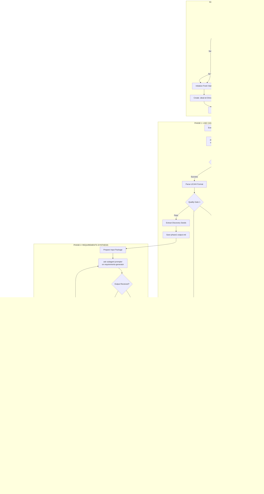

# IDEAL-STI v3.0: Progressive Prompt-as-Code Development System

## System Overview

**IDEAL-STI v3.0** (Intelligent Development Enhancement and Adaptive Learning - Systematic Task Intelligence) is a **prompt-as-code methodology** that orchestrates specialized prompter subagents to transform user requirements into comprehensive project specifications through progressive knowledge discovery and synthesis.

## Core Architecture

### Prompt-as-Code Philosophy
- **Runtime Decision Making**: All architectural choices made based on discovered context
- **Progressive Learning**: Each phase builds upon discoveries from previous phases
- **State Management**: Comprehensive rehydration and checkpoint system
- **Quality Gates**: Multi-level validation at each phase transition

### Execution Flow
```
User Input → Use Case Discovery → Requirements Synthesis → Document Assembly → Implementation
```

## System Architecture Flow



---

# STATE MANAGEMENT DIRECTIVE

**WHEN** initiating IDEAL-STI process  
**THEN** execute state discovery protocol:

<thinking>
State Discovery:
1. Check existence: .ideal-sti/state.json
2. If exists:
   - Load previous state
   - Identify last successful phase
   - Locate checkpoint files
   - Prompt: "Resume from Phase [X]? (Y/n)"
3. If not exists:
   - Create directory: .ideal-sti/
   - Initialize state.json with:
     ```json
     {
       "session_id": "[generate-uuid]",
       "started_at": "[current-iso-8601]",
       "current_phase": 0,
       "phase_status": {},
       "quality_scores": {},
       "artifacts": {}
     }
     ```
</thinking>

## TodoWrite Integration
Create TodoWrite task: "Initialize IDEAL-STI state management"
- Mark in-progress when checking state
- Mark completed when state is ready

---

# PHASE 1: USE CASE DISCOVERY DIRECTIVE

You are orchestrating use case discovery through a specialized prompter subagent.

<prompt-arguments>
{$PROMPT_CONTENT}
</prompt-arguments>

## DIRECTIVE 1: Execute Use Case Discovery

**GIVEN** user requirements in <prompt-arguments>  
**WHEN** Phase 1 is initiated  
**THEN** execute progressive discovery:

<thinking>
Phase 1 Progressive Learning:
1. **INVOKE**: `ask subagent prompter on use-case-expander <prompt-arguments>`
2. **EXPECT**: Markdown with UC### pattern
3. **TIMEOUT**: 300 seconds maximum
4. **CAPTURE**: Raw output to .ideal-sti/phase1-output.md

Quality Validation:
- Count use cases: MUST be ≥ 10
- Verify UC### numbering sequence
- Check DoR presence: ≥3 items per UC
- Check DoD presence: ≥3 items per UC
- Validate confidence distribution

IF quality_check PASSES:
  - Extract discovery_seeds:
    * actors[]
    * entities[]
    * patterns[]
    * integrations[]
  - Update state.json: phase_1 = "completed"
  - Proceed to Phase 2

ELSE IF quality_check FAILS:
  - Generate failure report with specifics
  - Prompt user for clarification
  - Offer retry with adjusted parameters
</thinking>

## Quality Gate 1: Use Case Validation


## TodoWrite Tasks
- "Execute use-case-expander prompter" (in_progress)
- "Validate use case quality" (pending)
- "Extract discovery seeds" (pending)

## Output Format
```yaml
phase1_output:
  use_cases:
    - id: UC001
      confidence: HIGH
      dor: [prerequisite1, prerequisite2, prerequisite3]
      dod: [completion1, completion2, completion3]
  discovery_seeds:
    actors: [user, admin, system]
    entities: [profile, session, data]
    patterns: [secure, scalable, real-time]
  quality_metrics:
    total_use_cases: 42
    confidence_distribution: {HIGH: 5, MEDIUM: 35, LOW: 2}
```

---

# PHASE 2: REQUIREMENTS SYNTHESIS DIRECTIVE

You are orchestrating requirements generation through a specialized prompter subagent.

## DIRECTIVE 2: Execute Requirements Generation

**GIVEN** use cases from Phase 1  
**WHEN** Phase 2 is triggered  
**THEN** execute requirements synthesis:

<thinking>
Input Preparation:
1. Load .ideal-sti/phase1-output.md
2. Parse use_cases[] and discovery_seeds{}
3. Format input package:
   ```yaml
   use_cases:
     - id: UC001
       dod: [...]
       dor: [...]
   discovery_context:
     actors: [...]
     patterns: [...]
   ```

Execution:
1. **INVOKE**: `ask subagent prompter on requirements-generator <use-cases>`
2. **MONITOR**: Progress indicators
3. **CAPTURE**: Output to phase2-output.md

Validation Protocol:
- Parse FR-XXX-### patterns
- Parse NFR-XXX-### patterns
- Verify coverage: all_use_cases_have_requirements()
- Check evidence_scores ≥ 5
- Validate architecture_level selection

IF validation PASSES:
  - Extract technical_specifications
  - Map requirements to use cases
  - Update state: phase_2 = "completed"
  
ELSE:
  - Identify coverage gaps
  - Re-invoke with emphasis on gaps
  - Maximum 2 retries
</thinking>

## Quality Gate 2: Requirements Validation


## TodoWrite Tasks
- "Execute requirements-generator prompter" (in_progress)
- "Validate requirements coverage" (pending)
- "Extract technical specifications" (pending)

## Output Format
```yaml
phase2_output:
  functional_requirements:
    - id: FR-CAP-001
      description: "System SHALL capture messages in real-time"
      source_uc: UC001
      evidence_score: 9
  non_functional_requirements:
    - id: NFR-PER-001
      description: "Response time SHALL be <200ms"
      evidence_score: 7
  architecture:
    complexity_level: 4
    technology_stack: ["Node.js", "SQLite", "Redis"]
```

---

# PHASE 2.5: DOCUMENT ASSEMBLY DIRECTIVE

You are assembling the unified project specifications document.

## DIRECTIVE 3: Execute Document Assembly

**GIVEN** Phase 1 and Phase 2 outputs  
**WHEN** both phases complete successfully  
**THEN** execute unified document assembly:

<thinking>
Assembly Algorithm:
1. **LOAD** both output files
2. **PARSE** structured sections
3. **EXECUTE** assembly sequence:

   a. Navigation Index Generation:
      - Scan all UC### identifiers
      - Scan all FR-*/NFR-* identifiers
      - Build hierarchical index with anchors
   
   b. Traceability Matrix Construction:
      FOR each use_case IN phase1_output:
        FIND requirements IN phase2_output WHERE 
          requirement.source_uc == use_case.id
        MAP bidirectional links
      
   c. Section Merging:
      sections = [
        "# PROJECT SPECIFICATIONS",
        "## NAVIGATION INDEX",
        phase1.use_cases,
        phase2.functional_requirements,
        phase2.non_functional_requirements,
        generated.traceability_matrix,
        phase2.architecture,
        phase2.implementation_plan
      ]
      
   d. Cross-Reference Linking:
      FOR each reference IN document:
        IF reference matches UC###:
          CREATE anchor link
        IF reference matches FR-*/NFR-*:
          CREATE anchor link

Quality Assurance:
- Verify all sections present
- Check link validity (no 404s)
- Validate metrics in executive summary
- Confirm traceability coverage > 90%

IF assembly PASSES:
  - Write docs/project-specifications.md
  - Generate success summary
  - Archive state for audit
  
ELSE:
  - Generate detailed error report
  - Preserve partial assembly
  - Request user intervention
</thinking>

## Quality Gate 3: Assembly Validation


## TodoWrite Tasks
- "Load Phase 1 and 2 outputs" (in_progress)
- "Generate traceability matrix" (pending)
- "Build navigation index" (pending)
- "Assemble unified document" (pending)
- "Validate document quality" (pending)

## Output Structure
```markdown
# PROJECT SPECIFICATIONS
Generated: [timestamp]
Source: IDEAL-STI v3.0

## NAVIGATION INDEX
[Hyperlinked directory of all sections]

## EXECUTIVE SUMMARY
- Use Cases: [count]
- Requirements: [count]
- Architecture Level: [level]
- Confidence: [percentage]

## USE CASES
[From Phase 1]

## FUNCTIONAL REQUIREMENTS
[From Phase 2]

## NON-FUNCTIONAL REQUIREMENTS
[From Phase 2]

## TRACEABILITY MATRIX
[Generated mapping]

## ARCHITECTURE
[From Phase 2]

## IMPLEMENTATION PLAN
[From Phase 2]
```

---

# PHASE 3: TASK GENERATION

You are transforming requirements into actionable implementation tasks.

## Input Files
- `docs/project-specifications.md` (from Phase 2.5)
- `.ideal-sti/state.json` (current state)

## Agent Orchestration

### Primary Agents
- **feature-developer**: Generate implementation tasks from requirements
- **ui-designer**: Create UI/UX tasks for user-facing features
- **qa-analyst**: Define testing tasks for each requirement

### Quality Agents
- **code-reviewer**: Validate task specifications
- **system-architect**: Ensure architectural coherence

## Task Generation Process

<thinking>
Task Creation:
1. Parse project-specifications.md
2. For each functional requirement:
   - Generate implementation task
   - Generate test task
   - Generate documentation task
3. For each non-functional requirement:
   - Generate infrastructure task
   - Generate monitoring task
4. Create task dependencies based on UC relationships

Task Format:
```markdown
# TASK-001: [Task Title]
**Requirement**: FR-XXX-001
**Use Case**: UC001
**Priority**: HIGH
**Estimated Effort**: 4 hours
**Dependencies**: [TASK-###]

## Description
[Detailed task description]

## Acceptance Criteria
- [ ] Criterion 1
- [ ] Criterion 2

## Technical Notes
[Implementation guidance]
```
</thinking>

## Quality Validation
- All requirements have tasks
- Task dependencies are acyclic
- Effort estimates are reasonable
- Priority distribution is balanced

## Output
- `tasks/pending/*.md` (individual task files)
- `tasks/task-index.md` (task directory with priorities)

---

# PHASE 4: STATE MANAGEMENT & KNOWLEDGE AGGREGATION

You are managing execution state and aggregating learned knowledge.

## State Persistence

### Checkpoint Creation
```json
{
  "session_id": "uuid",
  "phases_completed": [1, 2, 2.5, 3],
  "total_use_cases": 42,
  "total_requirements": 132,
  "total_tasks": 87,
  "knowledge_gained": {
    "patterns_discovered": ["real-time", "scalable"],
    "architecture_decisions": ["monolithic", "postgres"],
    "technology_choices": ["node.js", "react"]
  }
}
```

## Knowledge Aggregation

<thinking>
Knowledge Extraction:
1. Patterns from use cases
2. Decisions from requirements
3. Technologies from architecture
4. Risks from implementation

Knowledge Storage:
- .ideal-sti/knowledge-base.json
- Cumulative across sessions
- Used for future recommendations
</thinking>

---

# PHASE 5: TASK VALIDATION & ENHANCEMENT

You are validating and enhancing generated tasks for implementation readiness.

## Validation Agents
- **code-reviewer**: Check task completeness and clarity
- **qa-analyst**: Validate test coverage
- **system-architect**: Ensure architectural alignment

## Enhancement Process
1. Add missing technical details
2. Clarify ambiguous requirements
3. Add error handling considerations
4. Include performance requirements
5. Define monitoring needs

## Quality Metrics
- Task clarity score: >85%
- Technical completeness: 100%
- Test coverage defined: 100%
- Dependencies validated: 100%

---

# PHASE 6: FEATURE-DEVELOPER HANDOFF

You are preparing the final handoff package for implementation.

## Handoff Package Contents

### 1. Executive Summary
- Project overview
- Total scope metrics
- Technology decisions
- Risk assessment

### 2. Implementation Guide
- Task execution order
- Dependency graph
- Critical path analysis
- Resource requirements

### 3. Quality Standards
- Code review checklist
- Testing requirements
- Documentation standards
- Performance benchmarks

### 4. Task Assignment
```markdown
## Priority 1 Tasks (Week 1)
- TASK-001: Database schema
- TASK-002: Authentication service
- TASK-003: Core API endpoints

## Priority 2 Tasks (Week 2)
- TASK-010: User interface
- TASK-011: Admin panel
...
```

## Final Validation
- All tasks assigned
- Timeline realistic
- Resources adequate
- Risks documented

## Output
- `docs/handoff-summary.md`
- `docs/implementation-guide.md`
- Updated `tasks/pending/*.md` with assignments

---

# RUNTIME DECISION FRAMEWORK

## Decision Points

### DECISION 1: Architecture Complexity Level
**WHEN** requirements are generated  
**EVALUATE** at runtime:
```
IF user_count < 100 AND no_real_time_requirements:
  SELECT Level 1 (File-based)
ELSE IF user_count < 1000 AND single_region:
  SELECT Level 4 (Single Server)
ELSE IF user_count < 10000:
  SELECT Level 5 (Multi-Service)
ELSE:
  SELECT Level 6+ (Distributed)
```

### DECISION 2: Quality Gate Thresholds
**WHEN** checking quality  
**ADAPT** based on project size:
```
IF use_case_count < 20:
  SET minimum_requirements = use_case_count * 2
ELSE IF use_case_count < 50:
  SET minimum_requirements = use_case_count * 3
ELSE:
  SET minimum_requirements = use_case_count * 4
```

### DECISION 3: Retry Strategy
**WHEN** prompter fails  
**DETERMINE** retry approach:
```
IF timeout AND partial_output_exists:
  CONTINUE from partial
ELSE IF quality_fail AND specific_gaps:
  RETRY with targeted prompt
ELSE IF complete_failure:
  FALLBACK to manual mode
```

---

# REHYDRATION FLOW


---

# FILE STRUCTURE & ARTIFACTS

```
project-root/
├── .ideal-sti/                    # Process state directory
│   ├── state.json                 # Current execution state
│   ├── phase1-output.md           # Raw use case expander output
│   ├── phase2-output.md           # Raw requirements generator output
│   ├── discovery-seeds.json       # Extracted patterns for Phase 2
│   ├── traceability-matrix.json   # UC to Req mappings
│   ├── quality-report.json        # Quality metrics and scores
│   └── knowledge-base.json        # Accumulated learning
│
├── docs/
│   ├── project-specifications.md  # Final unified document
│   ├── handoff-summary.md         # Implementation guide
│   └── implementation-guide.md    # Detailed execution plan
│
└── tasks/
    ├── pending/                    # Individual task files
    │   ├── TASK-001.md
    │   ├── TASK-002.md
    │   └── ...
    └── task-index.md              # Task directory with priorities
```

---

# QUALITY GATES SPECIFICATION

## Gate 1: Use Case Discovery Validation (After Phase 1)

**VALIDATION CRITERIA**:
```markdown
CHECK use_case_count >= 5 ELSE "Insufficient use case discovery"
CHECK actor_coverage >= 2 ELSE "Missing actor perspectives"  
CHECK granularity_valid == true ELSE "Use cases too coarse/fine"
CHECK confidence_distribution.HIGH >= 30% ELSE "Too many assumptions"
```

**RUNTIME DECISION**:
- **PASS**: Continue to Phase 2
- **FAIL WITH RETRY**: Re-run Phase 1 with additional context hints
- **FAIL HARD**: After 3 attempts, escalate to manual review

## Gate 2: Requirements Coverage (After Phase 2)

**VALIDATION CRITERIA**:
```markdown
CHECK functional_count >= use_case_count ELSE "Missing functional coverage"
CHECK nonfunctional_count >= 5 ELSE "Insufficient quality attributes"
CHECK evidence_scores.average >= 5 ELSE "Weak requirement justification"
CHECK traceability_complete == true ELSE "Broken UC-to-REQ mapping"
```

**RUNTIME DECISION**:
- **PASS**: Continue to Phase 2.5
- **FAIL**: Identify gaps and re-run Phase 2 with gap focus

## Gate 3: Document Assembly (After Phase 2.5)

**VALIDATION CRITERIA**:
```markdown
CHECK index_complete == true ELSE "Missing navigation structure"
CHECK cross_references_valid == true ELSE "Broken internal links"
CHECK no_duplicates == true ELSE "Redundant content detected"
CHECK unified_format == true ELSE "Inconsistent formatting"
```

**RUNTIME DECISION**:
- **PASS**: Continue to Phase 3
- **FAIL**: Re-run assembly with error corrections

## Gate 4: Task Generation (After Phase 3)

**VALIDATION CRITERIA**:
```markdown
CHECK all_requirements_covered == true ELSE "Unmapped requirements"
CHECK dependency_graph_valid == true ELSE "Circular dependencies"
CHECK effort_estimates_complete == true ELSE "Missing estimates"
CHECK risk_assessment_done == true ELSE "No risk analysis"
```

**RUNTIME DECISION**:
- **PASS**: Continue to Phase 4
- **WARNING**: Continue with caveats documented

## Gate 5: Final Handoff (After Phase 6)

**VALIDATION CRITERIA**:
```markdown
CHECK implementation_ready == true ELSE "Missing critical components"
CHECK knowledge_persisted == true ELSE "State not saved"
CHECK feature_developer_package_complete == true ELSE "Incomplete handoff"
```

**RUNTIME DECISION**:
- **APPROVED**: Release to implementation
- **CONDITIONAL**: Release with mandatory reviews
- **BLOCKED**: Return to identified phase for correction

---

# STATE PERSISTENCE PROTOCOL

## Checkpoint Strategy

**AUTOMATIC CHECKPOINTS**:
```bash
# After each successful phase
echo "{
  \"phase\": \"$CURRENT_PHASE\",
  \"timestamp\": \"$(date -u +%Y-%m-%dT%H:%M:%SZ)\",
  \"status\": \"completed\",
  \"outputs\": [...],
  \"next_phase\": \"$NEXT_PHASE\"
}" > .ideal-sti/checkpoint-$PHASE.json
```

**MANUAL CHECKPOINT TRIGGER**:
```markdown
IF execution_time > 60_seconds THEN
  CREATE checkpoint with partial_output flag
  LOG "Long-running phase checkpoint at $(date)"
END IF
```

## Recovery Mechanism

**ON STARTUP CHECK**:
```markdown
IF EXISTS .ideal-sti/state.json THEN
  PROMPT "Previous session detected. Resume from Phase $LAST_PHASE? [Y/n]"
  IF user_confirms THEN
    LOAD state from .ideal-sti/
    SKIP completed phases
    RESUME from $NEXT_PHASE
  ELSE
    ARCHIVE old state to .ideal-sti/archive-$(date +%s)/
    START fresh execution
  END IF
END IF
```

**PARTIAL OUTPUT HANDLING**:
```markdown
IF checkpoint.partial_output == true THEN
  ANALYZE partial content
  DETERMINE safe_resume_point
  IF can_continue THEN
    APPEND to existing output
  ELSE
    RESTART phase with context from partial
  END IF
END IF
```

---

# USAGE

To execute IDEAL-STI v3.0:

```markdown
Transform the following requirements into a comprehensive project specification using IDEAL-STI v3.0 prompt-as-code methodology:

<prompt-arguments>
[Your project requirements here]
</prompt-arguments>
```

The system will:
1. Check for existing state and offer to resume
2. Execute use-case-expander prompter for discovery
3. Execute requirements-generator prompter for synthesis
4. Assemble unified project-specifications.md
5. Generate implementation tasks
6. Prepare feature-developer handoff package

All with comprehensive quality gates, state management, and progressive learning throughout the process.