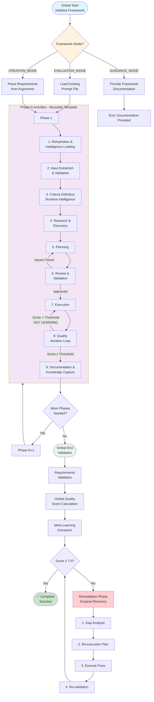

# Phased Prompt Framework: Progressive Knowledge-Based Development

**Template**: phased-prompt
**Context**: `<prompt-arguments>`
**Purpose**: Framework for creating phased prompts with progressive knowledge accumulation
**Methodology**: Prompt-as-code using natural language directives with flat phase activities

## Executive Summary

This framework implements a **phased-based, progressive knowledge-building, iterative prompt system with quality gates and intelligent looping**.

**Core Architecture**:
- **Global Start**: One-time framework initialization
- **Phase Template**: Reusable pattern for any number of phases
- **Global End**: Comprehensive validation and meta-learning

**Progressive Intelligence**:
- Each phase builds on accumulated wisdom from previous phases
- Knowledge compounds through rehydration and learning capture
- Quality achieved through iteration with intelligent feedback loops

## Progressive Intelligence Architecture

This framework creates three levels of intelligent feedback loops that enable continuous improvement:

### Loop Hierarchy

```
MACRO-LOOPS: Between Phases
├── Phase N learns from all previous phases (N-1, N-2, N-3...)
├── Rehydration transfers validated patterns forward
└── Global knowledge compounds across entire framework

MESO-LOOPS: Between Activities within Phase
├── Review & Validation loops back to Planning
├── Quality Iteration loops back to Execution
└── Each activity can inform previous activities

MICRO-LOOPS: Within Quality Iterations (Activity 8)
├── Iteration 1 → Learn → Iteration 2 → Learn → Iteration 3
├── Each iteration builds on learnings from all previous attempts
└── Maximum 25 iterations with graceful degradation
```

### Why This Architecture Works

- **Micro-loops** refine immediate quality through iteration
- **Meso-loops** ensure phase coherence and completeness
- **Macro-loops** create cumulative intelligence across the entire prompt

This creates a fractal improvement pattern where learning happens at every scale.

---

## GLOBAL START

**Execute ONCE at the beginning of any prompt using this framework**

### Framework Initialization

```markdown
WHEN starting ANY prompt using this framework:

1. SET GLOBAL VARIABLES (once only):
   <worktree> = $(pwd)  # Never change this
   <original-requirements> = <prompt-arguments>

2. CREATE DIRECTORY STRUCTURE:
   mkdir -p "<worktree>/planning"  # Phase documentation
   mkdir -p "<worktree>/docs"      # Final deliverables

3. ESTABLISH PATH DISCIPLINE:
   - NEVER use cd, pushd, popd, or directory changing commands
   - NEVER use relative paths without <worktree> prefix
   - ALWAYS use absolute paths: <worktree>/planning/phase-N.md
   - ALWAYS use git -C "<worktree>" for ALL git operations

4. DETERMINE FRAMEWORK MODE:
   FIRST attempt to extract a filename or path from <prompt-arguments>:
   - Look for patterns: /path/to/prompt.md, ./prompts/example.md, filename.md
   - Check if file exists using: test -f "<filename>"

   IF existing prompt file detected THEN:
     Set EVALUATION_MODE: Analyze and transform existing prompt
     Load existing content for evaluation and enhancement
   ELSE IF <prompt-arguments> contains clear requirements THEN:
     Set CREATION_MODE: Build new prompt from requirements
     Parse <prompt-arguments> for creation requirements
   ELSE:
     Set GUIDANCE_MODE: Provide comprehensive framework documentation

   IF GUIDANCE_MODE THEN:
     Provide exhaustive framework details:
     - Complete overview of all 9 activities
     - Show how phases connect and build knowledge
     - Describe rehydration and learning capture
     - Demonstrate quality iteration patterns
     - Provide step-by-step building guide
     - Include ready-to-use templates for each activity
     - Show example phase structures and mermaid diagrams
     - Explain when to use which activities
     THEN EXIT framework (documentation complete)

5. LOAD ORIGINAL REQUIREMENTS:
   Parse <prompt-arguments> to identify:
   - What needs to be accomplished
   - Expected deliverables
   - Quality standards
   - Any constraints or dependencies

6. PLAN PHASE STRUCTURE:
   Determine how many phases needed based on complexity

### Complete Framework Flow Visualization



Framework is now initialized and ready for phases.
```

---

## PHASE TEMPLATE

**Use this template for each phase (Phase 1, Phase 2, ... Phase N)**

### Phase N: [Purpose Name]

```markdown
## Phase Purpose & Dependencies

**PHASE_PURPOSE**: [Clear statement of what this phase accomplishes]

**DEPENDENCIES**: [What this phase needs from previous phases or requirements]
- Input from Phase N-1: [specific outputs needed]
- Original requirements: [relevant parts of <prompt-arguments>]
- External dependencies: [any outside requirements]

**DELIVERABLES**: [What this phase will produce for next phase or final output]

---

## Phase Activities

**Execute activities in dependency order (not necessarily sequential)**

### 1. Rehydration & Intelligence Loading

Load accumulated wisdom from previous phases:

IF previous phases exist THEN:
  Load planning files: <worktree>/planning/phase-*.md
  Extract key learnings from quality iterations
  Generate intelligent predefinitions:

  **CRITERIA_HINTS**: Suggest success/failure patterns from experience
  **RESEARCH_FOCUS**: Areas requiring investigation based on past gaps
  **PLANNING_BASELINE**: Validated strategies from previous phases
  **QUALITY_THRESHOLDS**: Expected iteration counts and minimum scores

Document rehydration results in: <worktree>/planning/phase-N.md

### 2. Input Extraction & Validation

Extract what this phase needs:
- From <original-requirements>: [relevant portions]
- From previous phases: [specific outputs needed]
- Missing inputs: [document gaps and how to proceed]

### 3. Criteria Definition (Runtime Intelligence)

Using CRITERIA_HINTS from rehydration, define:

**SUCCESS_CRITERIA**: What constitutes completion
- Measurable outcomes based on phase purpose
- Quality thresholds informed by previous iterations

**ANTI_CRITERIA**: What must be avoided
- Known failure patterns from previous phases
- Constraints from original requirements

**DEPENDENCY_CRITERIA**: External requirements
- Integration points with other phases
- Technical or business constraints

### 4. Research & Discovery

Using RESEARCH_FOCUS from rehydration:
- Investigate areas identified as knowledge gaps
- Build on successful patterns from previous phases
- Document new discoveries immediately
- Note failed approaches to avoid repetition

### 5. Planning

Using PLANNING_BASELINE from rehydration:
- Start with validated strategies from previous phases
- Adapt approach based on current phase requirements
- Plan activities in dependency order
- Consider quality iteration strategy

### 6. Review & Validation

Before executing, validate the plan:
- Does this plan align with phase purpose?
- Have we considered all available knowledge from rehydration?
- Are there conflicts with previous phase decisions?
- Is the approach feasible given constraints?
- Are dependencies properly addressed?

IF plan seems incomplete or problematic THEN:
  Return to Planning (activity 5) with new considerations
OTHERWISE:
  Proceed to execution with validated plan

### 7. Execution

Implement the plan:
- Execute planned activities
- Document decisions as they're made
- Capture new discoveries immediately
- Note deviations from baseline approach

### 8. Quality Iteration Loop

Using QUALITY_THRESHOLDS from rehydration:

FOR iteration FROM 1 TO 25:

  Evaluate against SUCCESS_CRITERIA:
  - Calculate quality score (0-100)
  - Check for ANTI_CRITERIA violations
  - Verify DEPENDENCY_CRITERIA compliance

  IF quality score >= threshold THEN:
    Break from loop (phase complete)

  OTHERWISE:
    **KEY LEARNING**: [Document what was discovered this iteration]

    Adjust approach based on:
    - This iteration's learning
    - Previous iterations' learnings
    - Historical patterns from QUALITY_THRESHOLDS

    Return to Execution (activity 7) with refinements

### 9. Documentation & Knowledge Capture

Append complete phase results to: <worktree>/planning/phase-N.md

Include:
- Phase purpose and what was accomplished
- All quality iterations with key learnings
- Final deliverables and their locations
- Insights for future phases
- Patterns that worked or failed

---

End of Phase N Template
```

**To use this template**:
1. Copy template for each phase needed
2. Replace N with actual phase number
3. Fill in [Purpose Name] and all bracketed placeholders
4. Execute all 9 activities in dependency order
5. Maintain progressive knowledge through rehydration

---

## GLOBAL END

**Execute AFTER all phases complete to ensure original requirements satisfied**

### Requirements Validation

```markdown
1. LOAD ORIGINAL REQUIREMENTS:
   Review <original-requirements> from Global Start

2. EVIDENCE GATHERING:
   For each requirement in original request:
   - Search ALL phase outputs for evidence of satisfaction
   - Check completeness and quality of solution
   - Document gaps or partial solutions

   Create requirements satisfaction matrix:
   | Requirement | Phase(s) Addressed | Quality Score | Evidence | Status |
   |-------------|-------------------|---------------|----------|--------|
   | [req1]      | Phase 2, 4        | 8.5/10       | [files]  | ✅ SATISFIED |
   | [req2]      | Phase 3           | 6.2/10       | [files]  | ⚠️ PARTIAL |
```

### Global Quality Score Calculation

```markdown
GLOBAL_QUALITY_SCORE = (
  (REQUIREMENTS_SATISFACTION * 0.40) +
  (COMPLETENESS_SCORE * 0.25) +
  (COHERENCE_SCORE * 0.20) +
  (VALUE_DELIVERY * 0.15)
) * PHASE_CONSISTENCY_MULTIPLIER

MINIMUM_ACCEPTABLE_SCORE = 7.0/10.0

Quality Thresholds:
- 9.0-10.0: Exceptional - Exceeds expectations
- 8.0-8.9: Excellent - Fully satisfies with high quality
- 7.0-7.9: Good - Meets requirements acceptably
- 6.0-6.9: Marginal - Significant gaps or issues
- Below 6.0: Unacceptable - Requires remediation
```

### Meta-Learning Extraction

```markdown
Extract insights for future prompts:

SUCCESSFUL STRATEGIES:
- Which rehydration patterns led to better quality?
- Which criteria types proved most valuable?
- Which planning approaches yielded best results?
- Which iteration patterns converged fastest?

FAILED APPROACHES:
- Criteria that proved unmeasurable or misleading
- Research directions that were dead ends
- Planning approaches that led to rework
- Quality patterns that missed issues

FRAMEWORK EVOLUTION:
- Stages that could be optimized or combined
- Missing activities that would have been valuable
- Better template structures for future use
```

### Final Documentation

```markdown
Create comprehensive final report: <worktree>/docs/global-quality-review.md

Include:
- Requirements satisfaction matrix with evidence
- Global quality score with detailed breakdown
- Complete deliverable index for implementation
- Meta-learning insights for future prompts
- Executive summary for stakeholders

IF Global Quality Score < 7.0 THEN:
  Execute detailed remediation process (see Remediation section below)
```

### Remediation Process (Execute Only if Quality Score < 7.0)

```markdown
REMEDIATION PHASE: Surgical Quality Recovery

1. GAP ANALYSIS:
   Load global quality report: <worktree>/docs/global-quality-review.md

   For each UNSATISFIED or PARTIAL requirement:
   - Root cause analysis: Why was requirement not met?
   - Phase failure analysis: Which phase(s) contributed to the gap?
   - Activity failure analysis: Which activity had quality issues?

   Generate remediation priority matrix:
   | Requirement | Impact | Effort | Priority | Strategy |
   |-------------|--------|--------|----------|----------|
   | [req1]      | HIGH   | MED    | 1        | Re-execute Phase 3 with new criteria |
   | [req2]      | MED    | LOW    | 2        | Add missing deliverable to Phase 4 |

2. TARGETED RE-EXECUTION PLAN:

   Full Phase Re-runs:
   IF phase fundamentally flawed → Re-execute entire phase with new approach
   PHASES_TO_RERUN: [Phase X, Phase Y]

   Partial Activity Re-runs:
   IF specific activity failed → Re-execute activity with corrected inputs
   ACTIVITIES_TO_RERUN: [Phase X.Activity Y, Phase Z.Activity W]

   Additive Improvements:
   IF deliverable missing → Add missing component without full re-run
   ADDITIONS_NEEDED: [New deliverable A, Enhanced deliverable B]

3. REMEDIATION EXECUTION:
   FOR each item in remediation plan:
   - Execute remediation strategy
   - Apply lessons learned from meta-analysis
   - Maintain quality standards from original phases
   - Document changes in phase planning files

   Avoid cascade failures:
   - Test impact on downstream phases after each fix
   - Update dependencies if remediation changes inputs
   - Maintain coherence with non-remediated phases

4. RE-VALIDATION:
   Re-run Global End validation process
   Focus validation on remediated requirements
   Verify no regression in previously satisfied requirements
   Calculate new Global Quality Score

   IF score still < 7.0:
     Log specific remaining issues
     Recommend manual review or scope reduction
     Document "best effort" final state
   ELSE:
     Document successful remediation
     Update meta-learning with remediation insights
```

---

## Framework Behavior Guarantees

When using this framework, these behaviors are guaranteed:

1. **NO INFINITE LOOPS**: Maximum 25 iterations per phase quality check
2. **KNOWLEDGE PERSISTENCE**: Learnings never lost between phases
3. **PROGRESSIVE IMPROVEMENT**: Each iteration ≥ previous quality
4. **GRACEFUL DEGRADATION**: Best effort captured even at iteration limit
5. **DETERMINISTIC PHASES**: Same inputs → similar execution path
6. **CUMULATIVE INTELLIGENCE**: Phase N always smarter than Phase N-1
7. **GLOBAL VALIDATION ASSURANCE**: Every prompt ends with requirements validation

These guarantees ensure reliable, improving execution with complete satisfaction validation.

## Why Progressive Intelligence Works

This framework is built on fundamental principles of how knowledge accumulates and quality emerges through iteration:

### Iteration Wisdom Patterns

```
EARLY ITERATIONS (1-5): Broad Exploration
├── Cast wide net to understand problem space
├── Identify major constraints and opportunities
├── Establish baseline understanding
└── Generate multiple approaches

MIDDLE ITERATIONS (6-15): Targeted Refinement
├── Focus on most promising directions
├── Eliminate approaches that don't work
├── Refine successful patterns
└── Build depth in key areas

LATE ITERATIONS (16-25): Edge Case Polishing
├── Handle corner cases and exceptions
├── Optimize for specific requirements
├── Ensure robustness and reliability
└── Document lessons learned
```

### Phase Progression Philosophy

**Phase N builds on shoulders of all previous phases (N-1, N-2, N-3...)**

- **Phase 1**: Learns what the problem actually is
- **Phase 2**: Learns what approaches work for this problem type
- **Phase 3**: Learns how to execute approaches effectively
- **Phase N**: Learns from the accumulated wisdom of all previous phases

### Knowledge Compounding Effect

Each phase is exponentially more intelligent than working in isolation:

- **Phase 1**: Raw analysis with no historical context
- **Phase 2**: Analysis + validated patterns from Phase 1
- **Phase 3**: Analysis + Phase 1 patterns + Phase 2 insights
- **Phase N**: Analysis + cumulative wisdom from phases 1 through N-1

This creates **exponential improvement** rather than linear progress.

### Quality Evolution Through Phases

- **Initial phases**: Learn what quality means for this specific problem
- **Middle phases**: Apply learned quality patterns consistently
- **Final phases**: Validate quality comprehensively against all requirements

The result is solutions that not only meet requirements but exceed expectations through accumulated intelligence.

---

## Usage Examples

### Example: 3-Phase Implementation

```markdown
GLOBAL START
└── Initialize with requirements: "Build user authentication system"

PHASE 1: Requirements Analysis
├── Purpose: Understand authentication needs
├── Activities: Research, define criteria, plan analysis
└── Deliverable: Requirements specification

PHASE 2: System Design
├── Purpose: Design authentication architecture
├── Rehydration: Load Phase 1 learnings about requirements
├── Activities: Design system, iterate on architecture
└── Deliverable: Technical design document

PHASE 3: Implementation Planning
├── Purpose: Create implementation roadmap
├── Rehydration: Load Phase 1+2 learnings about requirements and design
├── Activities: Plan implementation, define testing strategy
└── Deliverable: Implementation guide

GLOBAL END
└── Validate all requirements satisfied with quality score 8.2/10
```

---

Execute this framework to create robust, phase-based prompts with progressive knowledge accumulation and comprehensive quality assurance.