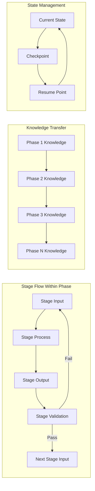
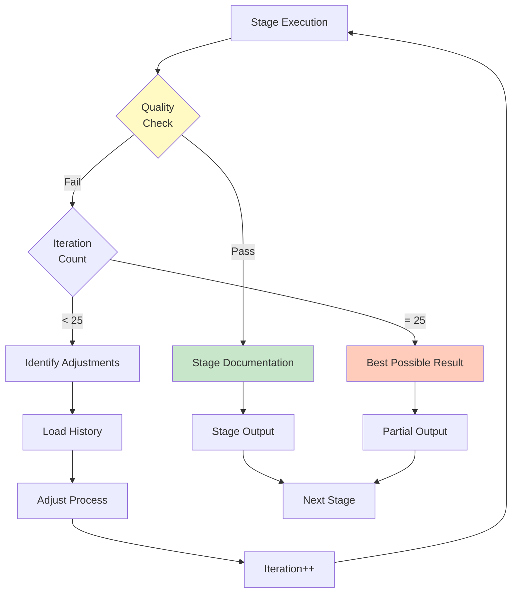

# Phased Prompt Framework: Progressive Knowledge-Based Development

**Template**: phased-prompt  
**Context**: `<prompt-arguments>`  
**Purpose**: Framework for creating or evaluating phase-based prompts with progressive knowledge accumulation  
**Methodology**: Pure prompt-as-code using natural language directives with structured phase/stage hierarchy

## Executive Summary

This framework defines a methodology for writing phase-based prompts where each phase contains multiple stages that progressively build knowledge through iterative refinement. Each phase includes 7 standard stages: Input Extraction, Rehydration, Planning, Review, Execution, Quality Check (1-25 iterations), and Documentation. All operations use absolute paths and never change working directories.

## Framework Architecture

```
PROMPT FRAMEWORK
├── Phase 1: [Purpose Name]
│   ├── Stage 1.1: Input Extraction
│   ├── Stage 1.2: Rehydration
│   ├── Stage 1.3: Planning
│   ├── Stage 1.4: Review
│   ├── Stage 1.5: Execution
│   ├── Stage 1.6: Quality Check
│   └── Stage 1.7: Documentation
│
├── Phase 2: [Purpose Name]
│   ├── Stage 2.1: Input Extraction
│   ├── Stage 2.2: Rehydration
│   └── ... (same 7-stage pattern)
│
└── Phase N: [Purpose Name]
    └── ... (same 7-stage pattern)
```

## Critical Path Management Requirements

```markdown
ABSOLUTE PATH DIRECTIVE:

NEVER use cd, pushd, popd, or any directory changing commands
NEVER rely on relative paths without <worktree> prefix
ALWAYS use full absolute paths constructed from <worktree>
ALWAYS use git -C "<worktree>" for ALL git operations

WHEN <worktree> is not provided:
  THEN set <worktree>$(pwd)</worktree>
  AND use this as the base for all paths

ALL file operations MUST use absolute paths:
  Reading: <worktree>/knowledge/phase-1-discoveries.md
  Writing: <worktree>/state/current.json
  Creating: <worktree>/artifacts/output.md
  Checking: test -f "<worktree>/checkpoints/phase-3.json"
  Listing: ls "<worktree>/knowledge/"*.md

Git operations MUST use -C flag:
  git -C "<worktree>" status
  git -C "<worktree>" add "<worktree>/artifacts/*"
  git -C "<worktree>" commit -m "Phase complete"
  git -C "<worktree>" rev-parse --show-toplevel
```

## System Architecture Visualizations

### Phase and Stage Hierarchy Flow

```mermaid
flowchart TD
    A[Input:<br/><prompt-arguments>] --> B{Worktree<br/>Defined?}
    B -->|No| C[Set <worktree><br/>to $(pwd)]
    B -->|Yes| D[Use provided<br/><worktree>]
    C --> E[Initialize Structure]
    D --> E
    
    E --> P1[Phase 1: Discovery]
    
    subgraph "Phase 1 Stages"
        P1 --> S11[Stage 1.1: Input Extraction]
        S11 --> S12[Stage 1.2: Rehydration]
        S12 --> S13[Stage 1.3: Planning]
        S13 --> S14[Stage 1.4: Review]
        S14 --> S15[Stage 1.5: Execution]
        S15 --> S16[Stage 1.6: Quality Check]
        S16 --> S17[Stage 1.7: Documentation]
    end
    
    S17 --> P2[Phase 2: Analysis]
    
    subgraph "Phase 2 Stages"
        P2 --> S21[Stage 2.1: Input Extraction]
        S21 --> S22[Stage 2.2: Rehydration]
        S22 --> S23[Stage 2.3: Planning]
        S23 --> S24[Stage 2.4: Review]
        S24 --> S25[Stage 2.5: Execution]
        S25 --> S26[Stage 2.6: Quality Check]
        S26 --> S27[Stage 2.7: Documentation]
    end
    
    S27 --> P3[Phase 3+]
    
    style A fill:#e1f5fe
    style E fill:#fff9c4
    style S16 fill:#ffccbc
    style S26 fill:#ffccbc
```

### Information Flow Between Stages



### Quality Iteration Within Stage



## Input Extraction Protocol

```markdown
CRITICAL INPUT DIRECTIVE:

WHEN any phase or stage requires input not provided by previous phases:
  FIRST examine <prompt-arguments> for all potential inputs
  THEN extract and assign to markdown-labeled variables:
    
    Parse <prompt-arguments> looking for:
      - Direct requirements or specifications
      - Context about the system or domain
      - Constraints or limitations
      - Goals or objectives
      - Example patterns or templates
      - File paths or references
      - Configuration parameters
    
    Assign discovered inputs to semantic markdown labels:
      **PHASE_[N]_REQUIREMENTS**: extracted requirements for phase N
      **PHASE_[N]_CONTEXT**: domain context for phase N
      **PHASE_[N]_CONSTRAINTS**: limitations for phase N
      **STAGE_[N.M]_INPUT**: specific input for stage N.M
      **STAGE_[N.M]_PARAMETERS**: configuration for stage N.M
    
    Store in markdown format at "<worktree>/state/phase-N-inputs.md":
      # Phase N Inputs
      ## PHASE_N_REQUIREMENTS
      [extracted requirements]
      
      ## PHASE_N_CONTEXT
      [domain context]
      
      ## Stage N.M Specific Inputs
      ### STAGE_N.M_INPUT
      [stage-specific input]
    
    IF a required input cannot be found in <prompt-arguments> THEN
      Create placeholder with clear notation:
      **MISSING_INPUT** (required): description of what's needed
      Document the gap for user clarification in "<worktree>/knowledge/input-gaps.md"
```

## Working Directory Initialization

```markdown
WHEN starting the framework:
  IF <worktree> is not defined THEN
    Set <worktree>$(pwd)</worktree>
  
  Create the following structure at <worktree>:
    mkdir -p "<worktree>/knowledge"
    mkdir -p "<worktree>/state"
    mkdir -p "<worktree>/checkpoints"
    mkdir -p "<worktree>/artifacts"
  
  Initialize state tracking:
    echo '{"current_phase": 0, "current_stage": 0, "iterations": {}}' > "<worktree>/state/current.json"
```

## Phase and Stage Template

Each phase contains exactly 7 stages following this pattern:

### Phase N: [Purpose Name]

```markdown
## PHASE_N_PURPOSE
Clearly state what this phase aims to achieve and how it builds on previous knowledge

## PHASE_N_INPUTS
Document what this phase requires from <prompt-arguments> or previous phases

## PHASE_N_OUTPUTS
Define what this phase will produce for subsequent phases

---

### Stage N.1: Input Extraction

**STAGE_N.1_PURPOSE**: Extract and validate all required inputs for this phase

BEFORE any other processing:
  Examine what inputs this phase requires
  
  **STAGE_N.1_INPUT**: <prompt-arguments> and previous phase outputs
  
  IF inputs are not available from previous phases THEN
    Extract from <prompt-arguments>:
      **PHASE_N_REQUIREMENTS**: specific needs for this phase
      **PHASE_N_CONTEXT**: relevant context for this phase
      **PHASE_N_DATA**: data or examples needed
      **PHASE_N_CONSTRAINTS**: limitations to observe
    
    Store extracted inputs in "<worktree>/state/phase-N-inputs.md"
    
    IF critical inputs are missing THEN
      Document as: **MISSING_CRITICAL_INPUT**: description
      Consider whether phase can proceed partially
      Note gaps in "<worktree>/knowledge/input-gaps.md"
  
  **STAGE_N.1_OUTPUT**: Validated inputs stored in state directory

---

### Stage N.2: Rehydration

**STAGE_N.2_PURPOSE**: Load all relevant context from previous work

WHEN beginning this stage:
  **STAGE_N.2_INPUT**: State files, knowledge base, checkpoints
  
  First, check if previous work exists:
    IF file exists at "<worktree>/state/current.json" THEN
      Read the current state
      Understand what phase and stage we're in
    
    IF directory exists at "<worktree>/knowledge/" THEN
      Load all knowledge files: ls "<worktree>/knowledge/"*.md
      Incorporate relevant discoveries into current thinking
    
    IF this is a resumed phase THEN
      Load checkpoint from "<worktree>/checkpoints/phase-N.json"
      Continue from where we left off
    
    Load phase inputs from "<worktree>/state/phase-N-inputs.md"
  
  **STAGE_N.2_OUTPUT**: Complete context loaded into working memory

---

### Stage N.3: Planning

**STAGE_N.3_PURPOSE**: Develop approach based on inputs and rehydrated knowledge

Based on rehydrated knowledge and extracted inputs:
  **STAGE_N.3_INPUT**: All context from stages N.1 and N.2
  
  Consider what needs to be accomplished
  Review what knowledge already exists
  Identify gaps that need to be filled
  Formulate a strategy that builds on previous phases
  
  Document the plan in "<worktree>/state/phase-N-stage-3-plan.md":
    # Phase N Execution Plan
    ## APPROACH
    [strategy description]
    
    ## STEPS
    [ordered list of actions]
    
    ## SUCCESS_CRITERIA
    [how we'll know we succeeded]
  
  **STAGE_N.3_OUTPUT**: Documented execution plan

---

### Stage N.4: Review

**STAGE_N.4_PURPOSE**: Validate the plan before execution

Before executing, validate the plan:
  **STAGE_N.4_INPUT**: Plan from stage N.3
  
  Ask these validation questions:
    - "Does this plan align with PHASE_N_PURPOSE?"
    - "Have we considered all available knowledge?"
    - "Are there conflicts with previous decisions?"
    - "Is the approach feasible given constraints?"
  
  IF the plan seems incomplete or problematic THEN
    Document issues in "<worktree>/state/phase-N-stage-4-review.md"
    Return to Stage N.3 (Planning) with new considerations
  OTHERWISE
    Approve plan and proceed to execution
  
  **STAGE_N.4_OUTPUT**: Validated and approved plan

---

### Stage N.5: Execution

**STAGE_N.5_PURPOSE**: Implement the validated plan

Implement the planned approach:
  **STAGE_N.5_INPUT**: Approved plan from stage N.4
  
  Execute the strategy developed during planning
  Continuously reference knowledge from "<worktree>/knowledge/"
  Document decisions as they're made
  Capture new discoveries immediately
  
  Write progress to "<worktree>/state/phase-N-stage-5-progress.log"
  
  Track execution metrics:
    - Actions completed
    - Discoveries made
    - Issues encountered
    - Deviations from plan
  
  **STAGE_N.5_OUTPUT**: Execution results and discoveries

---

### Stage N.6: Quality Check

**STAGE_N.6_PURPOSE**: Iteratively refine until quality criteria are met

Evaluate if phase goals were achieved:
  **STAGE_N.6_INPUT**: Execution results from stage N.5
  
  FOR iteration FROM 1 TO maximum of 25:
    Read current metrics from "<worktree>/state/phase-N-metrics.json"
    
    Ask these quality questions:
      - "Did we achieve PHASE_N_PURPOSE?"
      - "Is the knowledge complete and accurate?"
      - "Are there unresolved uncertainties?"
      - "Does this integrate well with previous phases?"
      - "Is the quality sufficient for progression?"
    
    Calculate quality score (0-100)
    
    IF quality score >= acceptance threshold THEN
      Mark phase as complete
      Break from iteration loop
    
    OTHERWISE identify specific improvements needed:
      - What aspect failed quality check?
      - What knowledge might help improve it?
      - What different approach could work?
      
      Load iteration history from "<worktree>/state/phase-N-iterations.log"
      Learn from previous attempts
      Adjust approach based on patterns
      
      Return to Stage N.5 (Execution) with refinements
      Document iteration in "<worktree>/state/phase-N-iteration-{iteration}.md"
  
  IF iteration reached 25 without full success THEN
    Document best achieved result
    Note remaining gaps for future work
  
  **STAGE_N.6_OUTPUT**: Quality-validated results

---

### Stage N.7: Documentation

**STAGE_N.7_PURPOSE**: Capture all knowledge and prepare for next phase

Capture all knowledge gained in this phase:
  **STAGE_N.7_INPUT**: All outputs from stages N.1 through N.6
  
  Write phase discoveries to "<worktree>/knowledge/phase-N-discoveries.md":
    # Phase N Discoveries
    ## KNOWLEDGE_DISCOVERED
    [new facts and patterns found]
    
    ## KNOWLEDGE_SYNTHESIZED
    [combined understanding]
    
    ## KNOWLEDGE_TO_TRANSFER
    [what next phases need to know]
  
  Update checkpoint at "<worktree>/checkpoints/phase-N-complete.json":
    {
      "phase": N,
      "completion_status": "complete|partial",
      "quality_score": 85,
      "iterations_required": 7,
      "knowledge_dependencies": ["phase_1", "phase_2"],
      "outputs_generated": ["list of artifacts"]
    }
  
  Generate artifacts in "<worktree>/artifacts/":
    - Any outputs produced
    - Reports or summaries
    - Reusable patterns identified
  
  **STAGE_N.7_OUTPUT**: Complete documentation and artifacts
```

## Progressive Knowledge Patterns

### Five-Phase Knowledge Progression

```markdown
Phase 1 - Surface Discovery:
  **PHASE_1_PURPOSE**: Find what exists on the surface
  
  Extract initial inputs from <prompt-arguments>:
    **DISCOVERY_SCOPE**: what areas to explore
    **DISCOVERY_DEPTH**: how deep to investigate
    **DISCOVERY_SOURCES**: where to look for information
  
  Execute through 7 stages:
    Stage 1.1: Extract discovery parameters
    Stage 1.2: Rehydrate any prior exploration
    Stage 1.3: Plan discovery approach
    Stage 1.4: Review discovery strategy
    Stage 1.5: Execute discovery
    Stage 1.6: Quality check findings (iterate 1-25 times)
    Stage 1.7: Document observations
  
  **PHASE_1_OUTPUTS**:
    - Raw observations in "<worktree>/knowledge/phase-1-observations.md"
    - Initial patterns in "<worktree>/knowledge/phase-1-patterns.md"
    - Discovery gaps in "<worktree>/knowledge/phase-1-gaps.md"

Phase 2 - Structural Analysis:
  **PHASE_2_PURPOSE**: Understand how elements relate
  
  IF not provided by Phase 1, extract from <prompt-arguments>:
    **ANALYSIS_FRAMEWORK**: methodology to use
    **ANALYSIS_CRITERIA**: what to measure
    **RELATIONSHIP_TYPES**: connections to map
  
  **PHASE_2_INPUTS**: Phase 1 discoveries and patterns
  
  Execute through 7 stages:
    Stage 2.1: Extract analysis parameters
    Stage 2.2: Load Phase 1 knowledge
    Stage 2.3: Plan analysis approach
    Stage 2.4: Review analysis strategy
    Stage 2.5: Execute structural analysis
    Stage 2.6: Quality check relationships (iterate 1-25 times)
    Stage 2.7: Document structures
  
  **PHASE_2_OUTPUTS**:
    - Structural maps in "<worktree>/knowledge/phase-2-structures.md"
    - Dependency graphs in "<worktree>/knowledge/phase-2-dependencies.md"
  
Phase 3 - Relational Synthesis:
  **PHASE_3_PURPOSE**: Connect patterns into coherent model
  
  IF not provided by previous phases, extract from <prompt-arguments>:
    **SYNTHESIS_GOALS**: desired outcome model
    **INTEGRATION_RULES**: how to combine elements
    **CONFLICT_RESOLUTION**: how to handle contradictions
  
  **PHASE_3_INPUTS**: Phase 1 discoveries + Phase 2 structures
  
  Execute through 7 stages:
    Stage 3.1: Extract synthesis parameters
    Stage 3.2: Load Phase 1 and 2 knowledge
    Stage 3.3: Plan synthesis approach
    Stage 3.4: Review synthesis strategy
    Stage 3.5: Execute pattern connection
    Stage 3.6: Quality check coherence (iterate 1-25 times)
    Stage 3.7: Document unified model
  
  **PHASE_3_OUTPUTS**:
    - Unified model in "<worktree>/knowledge/phase-3-model.md"
    - Resolved conflicts in "<worktree>/knowledge/phase-3-resolutions.md"
  
Phase 4 - Applied Implementation:
  **PHASE_4_PURPOSE**: Apply understanding to create solutions
  
  IF not provided by previous phases, extract from <prompt-arguments>:
    **IMPLEMENTATION_TARGET**: what to build
    **IMPLEMENTATION_CONSTRAINTS**: technical limitations
    **IMPLEMENTATION_STANDARDS**: quality requirements
  
  **PHASE_4_INPUTS**: Complete knowledge from Phases 1-3
  
  Execute through 7 stages:
    Stage 4.1: Extract implementation parameters
    Stage 4.2: Load all previous knowledge
    Stage 4.3: Plan implementation approach
    Stage 4.4: Review implementation strategy
    Stage 4.5: Execute solution creation
    Stage 4.6: Quality check implementation (iterate 1-25 times)
    Stage 4.7: Document solutions
  
  **PHASE_4_OUTPUTS**:
    - Implementation artifacts in "<worktree>/artifacts/"
    - Solution documentation in "<worktree>/knowledge/phase-4-solutions.md"
  
Phase 5 - Reflective Validation:
  **PHASE_5_PURPOSE**: Verify solutions match original discovery
  
  IF not provided by previous phases, extract from <prompt-arguments>:
    **VALIDATION_CRITERIA**: success metrics
    **VALIDATION_METHODS**: how to verify
    **ACCEPTANCE_THRESHOLDS**: minimum quality levels
  
  **PHASE_5_INPUTS**: All phases' outputs and original requirements
  
  Execute through 7 stages:
    Stage 5.1: Extract validation parameters
    Stage 5.2: Load complete knowledge base
    Stage 5.3: Plan validation approach
    Stage 5.4: Review validation strategy
    Stage 5.5: Execute validation tests
    Stage 5.6: Quality check validation (iterate 1-25 times)
    Stage 5.7: Document validation results
  
  **PHASE_5_OUTPUTS**:
    - Validation report in "<worktree>/artifacts/validation-report.md"
    - Pattern library in "<worktree>/artifacts/patterns-library.md"
    - Lessons learned in "<worktree>/knowledge/phase-5-lessons.md"
```

### Knowledge Inheritance Matrix

```markdown
WHEN transitioning between phases:
  Explicitly declare knowledge dependencies:
  
  Phase 1 → Phase 2:
    **KNOWLEDGE_TRANSFERRED**: observations, initial patterns
    **KNOWLEDGE_REQUIRED**: discovery scope and sources
  
  Phase 2 → Phase 3:
    **KNOWLEDGE_TRANSFERRED**: structures, relationships
    **KNOWLEDGE_INHERITED**: Phase 1 observations
    **KNOWLEDGE_REQUIRED**: analysis framework
  
  Phase 3 → Phase 4:
    **KNOWLEDGE_TRANSFERRED**: unified model, resolutions
    **KNOWLEDGE_INHERITED**: Phase 1 + 2 foundations
    **KNOWLEDGE_REQUIRED**: synthesis goals
  
  Phase 4 → Phase 5:
    **KNOWLEDGE_TRANSFERRED**: implementations, solutions
    **KNOWLEDGE_INHERITED**: Complete Phases 1-3 understanding
    **KNOWLEDGE_REQUIRED**: implementation targets
  
  Document in "<worktree>/state/knowledge-inheritance.json"
```

## Quality Iteration Framework

### Stage-Level Iteration Strategy

```markdown
WITHIN each Quality Check stage (N.6):
  
  Implement progressive refinement based on iteration count:
    
    Early iterations (1-5):
      Focus on major structural issues
      Make large adjustments to approach
      Try fundamentally different strategies
      Document in "<worktree>/state/phase-N-early-iterations.md"
    
    Middle iterations (6-15):
      Refine specific aspects
      Target identified weaknesses
      Optimize based on patterns
      Document in "<worktree>/state/phase-N-middle-iterations.md"
    
    Late iterations (16-25):
      Fine-tune details
      Polish edge cases
      Document why full quality might be unachievable
      Document in "<worktree>/state/phase-N-late-iterations.md"
  
  Track iteration efficiency:
    Measure improvement between iterations
    IF improvement < 5% for 3 consecutive iterations THEN
      Consider accepting current state
      Document diminishing returns
```

### Adaptive Iteration Limits by Phase Complexity

```markdown
Determine iteration limit based on phase complexity:
  
  Simple phases (single clear goal):
    Maximum 5 iterations in Stage N.6
    Quick refinement cycles
    Example: Phase 1 Discovery often simpler
  
  Moderate phases (multiple objectives):
    Maximum 15 iterations in Stage N.6
    Balanced refinement approach
    Example: Phase 2-3 Analysis and Synthesis
  
  Complex phases (interconnected systems):
    Maximum 25 iterations in Stage N.6
    Thorough exploration of solution space
    Example: Phase 4-5 Implementation and Validation
  
  Document complexity assessment in "<worktree>/state/phase-N-complexity.md"
```

## Git Integration Patterns

```markdown
WHEN using git for version control:
  
  NEVER change to git directory, instead:
    
    After each stage completion:
      git -C "<worktree>" add "<worktree>/state/*"
      git -C "<worktree>" commit -m "Complete Phase N Stage M: [Purpose]"
    
    After each phase completion:
      git -C "<worktree>" add "<worktree>/knowledge/*"
      git -C "<worktree>" add "<worktree>/artifacts/*"
      git -C "<worktree>" commit -m "Complete Phase N: [Purpose]"
      git -C "<worktree>" tag "phase-N-complete"
    
    After quality iterations:
      git -C "<worktree>" add "<worktree>/state/phase-N-iteration-*.md"
      git -C "<worktree>" commit -m "Phase N iteration {count}: {improvement}"
    
  IF working in repository subdirectory:
    First find repository root:
      REPO_ROOT=$(git -C "<worktree>" rev-parse --show-toplevel)
    Then use for git operations:
      git -C "$REPO_ROOT" status
```

## Evaluation Mode Usage

```markdown
WHEN evaluating an existing prompt from <prompt-arguments>:
  
  Set evaluation worktree:
    <worktree>/evaluation/
  
  Extract evaluation parameters from <prompt-arguments>:
    **PROMPT_TO_EVALUATE**: the prompt content or path
    **EVALUATION_CRITERIA**: specific aspects to assess
    **EVALUATION_DEPTH**: how thorough to be
    **COMPARISON_BASELINE**: framework to compare against
  
  Execute evaluation through phases:
  
  Phase 1 - Parse and Understand (7 stages):
    Stage 1.1: Extract prompt from **PROMPT_TO_EVALUATE**
    Stage 1.2: Load any prior evaluations
    Stage 1.3: Plan parsing approach
    Stage 1.4: Review parsing strategy
    Stage 1.5: Parse prompt structure
    Stage 1.6: Quality check understanding
    Stage 1.7: Document structure in "<worktree>/evaluation/knowledge/structure.md"
  
  Phase 2 - Analyze Against Framework (7 stages):
    Stage 2.1: Extract **EVALUATION_CRITERIA** or use defaults
    Stage 2.2: Load parsed structure
    Stage 2.3: Plan analysis approach
    Stage 2.4: Review analysis strategy
    Stage 2.5: Compare to framework patterns
    Stage 2.6: Quality check analysis
    Stage 2.7: Document gaps in "<worktree>/evaluation/knowledge/gaps.md"
  
  Phase 3 - Generate Recommendations (7 stages):
    Stage 3.1: Extract **EVALUATION_DEPTH** parameter
    Stage 3.2: Load analysis results
    Stage 3.3: Plan recommendation approach
    Stage 3.4: Review recommendation strategy
    Stage 3.5: Generate improvements
    Stage 3.6: Quality check recommendations
    Stage 3.7: Write report to "<worktree>/evaluation/artifacts/evaluation-report.md"
```

## Creation Mode Usage

```markdown
WHEN creating a new phased prompt from requirements:
  
  Set creation worktree:
    <worktree>/new-prompt/
  
  Extract creation parameters from <prompt-arguments>:
    **CREATION_REQUIREMENTS**: what the prompt should accomplish
    **CREATION_DOMAIN**: subject area or context
    **CREATION_PHASES**: number of phases needed
    **CREATION_COMPLEXITY**: expected iteration depth
  
  Execute creation through phases:
  
  Phase 1 - Requirements Discovery (7 stages):
    Stage 1.1: Extract **CREATION_REQUIREMENTS**
    Stage 1.2: Load any templates
    Stage 1.3: Plan discovery approach
    Stage 1.4: Review discovery strategy
    Stage 1.5: Analyze requirements
    Stage 1.6: Quality check understanding
    Stage 1.7: Save to "<worktree>/new-prompt/knowledge/requirements.md"
  
  Phase 2 - Design Architecture (7 stages):
    Stage 2.1: Extract **CREATION_PHASES** and **CREATION_DOMAIN**
    Stage 2.2: Load requirements
    Stage 2.3: Plan design approach
    Stage 2.4: Review design strategy
    Stage 2.5: Design phase structure
    Stage 2.6: Quality check design
    Stage 2.7: Document in "<worktree>/new-prompt/knowledge/design.md"
  
  Phase 3 - Implementation (7 stages):
    Stage 3.1: Extract **CREATION_COMPLEXITY**
    Stage 3.2: Load design
    Stage 3.3: Plan implementation
    Stage 3.4: Review implementation plan
    Stage 3.5: Write prompt following framework
    Stage 3.6: Quality check prompt
    Stage 3.7: Generate to "<worktree>/new-prompt/artifacts/generated-prompt.md"
  
  Phase 4 - Validation (7 stages):
    Stage 4.1: Extract validation criteria
    Stage 4.2: Load generated prompt
    Stage 4.3: Plan validation
    Stage 4.4: Review validation plan
    Stage 4.5: Test prompt components
    Stage 4.6: Quality check validation
    Stage 4.7: Finalize in "<worktree>/new-prompt/artifacts/final-prompt.md"
```

## Common Patterns and Anti-Patterns

### Patterns to Follow

```markdown
GOOD: Clear phase/stage hierarchy
  Phase 1 contains Stages 1.1 through 1.7
  Each stage has defined purpose, inputs, and outputs
  Information flows explicitly between stages

GOOD: Consistent labeling
  **PHASE_N_PURPOSE** for phase goals
  **STAGE_N.M_INPUT** for stage inputs
  **STAGE_N.M_OUTPUT** for stage outputs
  **KNOWLEDGE_TRANSFERRED** for inter-phase flow

GOOD: Using absolute paths
  Read from "<worktree>/knowledge/data.md"
  Write to "<worktree>/artifacts/output.md"
  Check with test -f "<worktree>/state/current.json"

GOOD: Git operations with -C
  git -C "<worktree>" add .
  git -C "<worktree>" commit -m "message"

GOOD: Quality iterations within stages
  Clear criteria for success
  Learning from each attempt within Stage N.6
  Documenting why iterations were needed
  Respecting maximum of 25 iterations
```

### Anti-Patterns to Avoid

```markdown
BAD: Mixing phase and stage concepts
  Calling everything a "stage"
  No clear hierarchy
  Unclear information flow

BAD: Inconsistent labeling
  Using different formats for same concept
  Not distinguishing phase vs stage labels
  Missing input/output declarations

BAD: Changing directories
  cd <worktree> && perform_operation
  pushd /tmp && create_file
  
BAD: Relative paths without worktree
  cat knowledge/file.md
  echo "data" > state/current.json
  
BAD: Git without -C flag
  cd <worktree> && git add .
  Navigate to repo then git commit
  
BAD: Infinite quality loops
  No maximum iteration limit in Stage N.6
  No learning between iterations
  No acceptance of "good enough"
```

## Final Review Phase Template

```markdown
## Phase Final: Comprehensive Review and Synthesis

**PHASE_FINAL_PURPOSE**: Validate all phases met criteria and synthesize learnings

### Stage F.1: Input Extraction
Extract review parameters from all previous phases
Identify which phases to validate
Document review scope

### Stage F.2: Rehydration
Load all phase outputs from "<worktree>/knowledge/"
Load all checkpoints from "<worktree>/checkpoints/"
Load quality metrics from each phase

### Stage F.3: Planning
Plan comprehensive review approach
Identify validation criteria for each phase
Design synthesis strategy

### Stage F.4: Review
Validate review plan covers all phases
Check synthesis approach is comprehensive
Ensure no phase outputs are missed

### Stage F.5: Execution
For each completed phase:
  Load checkpoint from "<worktree>/checkpoints/phase-N-complete.json"
  Verify quality metrics were achieved
  Check knowledge dependencies were satisfied
  Document validation in "<worktree>/artifacts/phase-N-validation.md"

Create synthesis narrative:
  Tell complete story of discovery and building
  Identify patterns that proved most valuable
  Document in "<worktree>/artifacts/synthesis.md"

### Stage F.6: Quality Check
Verify all phases validated
Check synthesis is complete
Assess overall confidence in solution
Iterate if gaps found (max 25 iterations)

### Stage F.7: Documentation
Generate final outputs:
  Executive summary at "<worktree>/artifacts/executive-summary.md"
  Pattern library at "<worktree>/artifacts/patterns-library.md"
  Lessons learned at "<worktree>/artifacts/lessons-learned.md"
  Recommendations at "<worktree>/artifacts/recommendations.md"

Archive final state:
  Save to "<worktree>/checkpoints/final-state.json"
  If using git: git -C "<worktree>" tag "complete-$(date +%Y%m%d)"
```

## Framework Meta-Documentation

This framework itself follows its own patterns:
- **Clear hierarchy**: Phases contain stages with defined flow
- **Progressive structure**: Concepts build through 5 phases
- **Natural language**: All logic expressed conversationally
- **Path discipline**: All examples use absolute paths
- **Quality focus**: Stage N.6 always handles iteration
- **Knowledge preservation**: Stage N.7 always documents
- **Consistent labeling**: Systematic naming throughout

Execute this framework to create robust, phase-based prompts with clear stage progression, systematic knowledge accumulation, and comprehensive quality assurance.