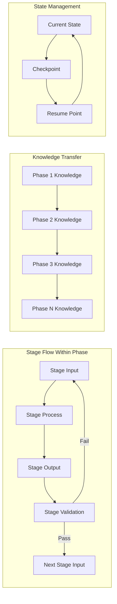
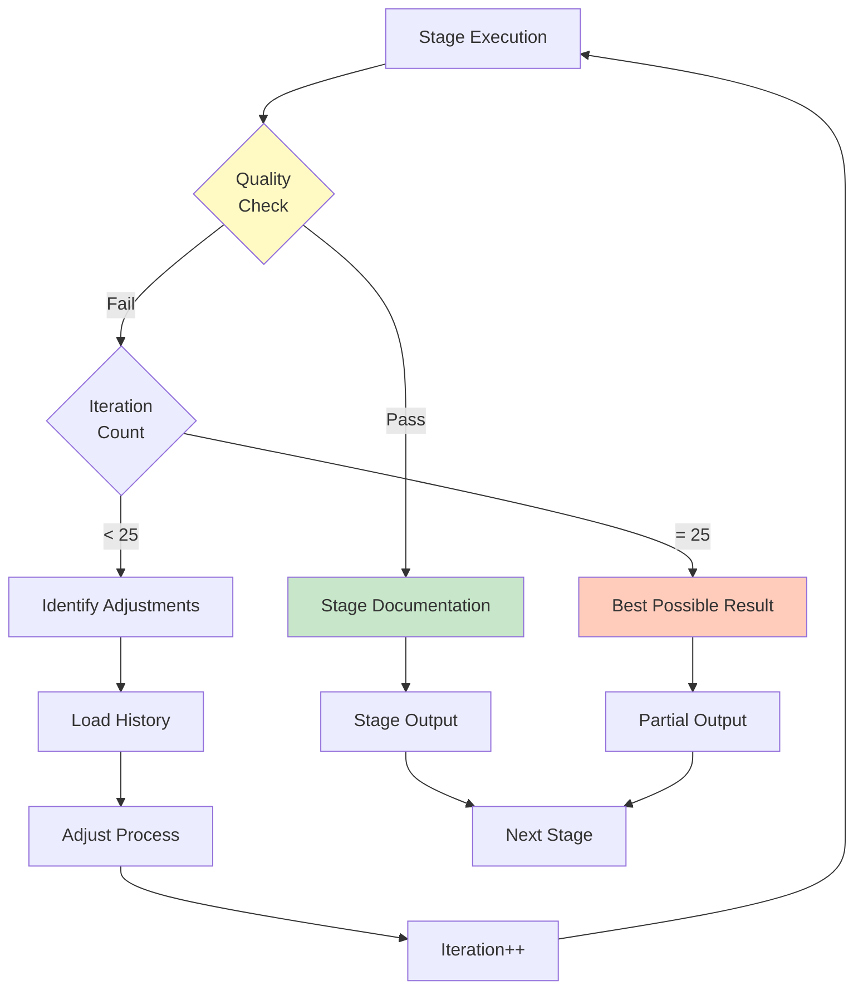
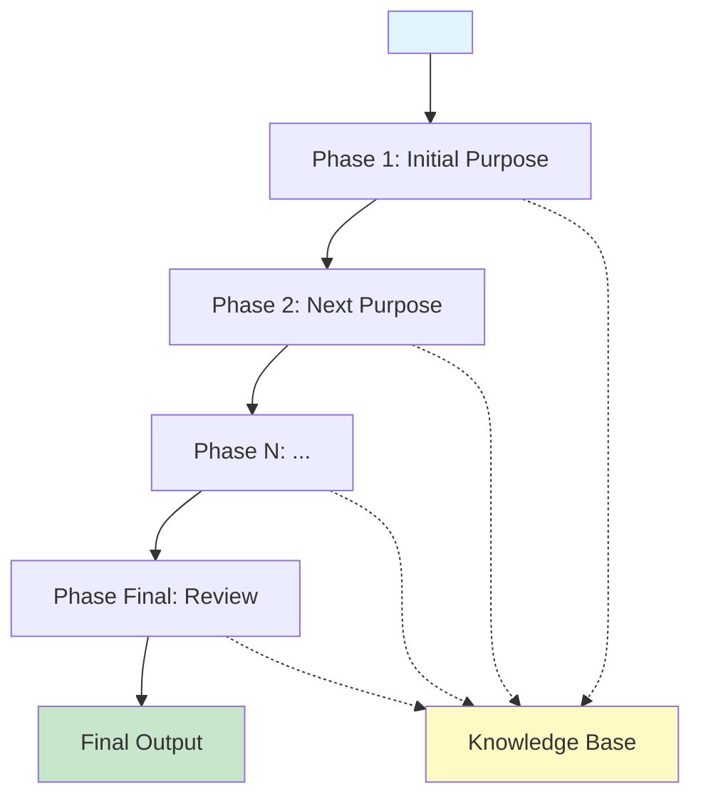

# Phased Prompt Framework: Progressive Knowledge-Based Development

**Template**: phased-prompt  
**Context**: `<prompt-arguments>`  
**Purpose**: Framework for creating or evaluating phase-based prompts with progressive knowledge accumulation  
**Methodology**: Pure prompt-as-code using natural language directives with structured phase/stage hierarchy

## Executive Summary

This framework defines a methodology for evaluating existing prompts or creating new phase-based prompts. Each phase contains 9 standard stages that progressively build knowledge through iterative refinement: Input Extraction, Rehydration (deserializing stored resources and merging with fresh inputs), Criteria Definition (runtime generation of success/anti/dependency criteria), Research & Discovery (criteria-driven exploration), Planning (based on research findings), Review, Execution, Quality Check (criteria validation with 1-25 iterations), and Documentation (serializing outputs). All operations use absolute paths and never change working directories.

## Source File Extraction Protocol

```markdown
FRAMEWORK MODE SELECTION:

WHEN processing <prompt-arguments>:
  FIRST attempt to extract a filename or path:
    **SOURCE_FILE**: Look for patterns indicating a file reference:
      - Absolute paths: /path/to/prompt.md
      - Relative paths: ./prompts/example.md  
      - Filenames: my-prompt.md
      - URLs: https://example.com/prompt.md
      - Git paths: prompts/existing-prompt.md
    
    IF **SOURCE_FILE** pattern is detected THEN:
      Verify file exists using: test -f "<SOURCE_FILE>"
      IF file exists THEN:
        Read prompt content from "<SOURCE_FILE>"
        Set **EVALUATION_MODE**: true
        Store content for evaluation phases
        Proceed to evaluate existing prompt
      ELSE:
        Document as **MISSING_FILE**: "<SOURCE_FILE>" not found
        Check for inline content instead
    
    IF no file pattern found OR file missing THEN:
      Check if <prompt-arguments> contains inline prompt content
      IF prompt content detected (markdown structure, phases, etc.) THEN:
        Set **EVALUATION_MODE**: true
        Extract inline content for evaluation
        Proceed to evaluate provided prompt
      ELSE:
        Set **GUIDANCE_MODE**: true
        Provide exhaustive framework documentation
        Show how to build prompt from scratch

Mode determines framework behavior:
  **EVALUATION_MODE**: Analyze existing prompt and provide transformation feedback
  **GUIDANCE_MODE**: Provide complete framework details with examples
```

## Framework Architecture

```
PROMPT FRAMEWORK
├── Phase 1: [Purpose Name]
│   ├── Stage 1.1: Input Extraction
│   ├── Stage 1.2: Rehydration
│   ├── Stage 1.3: Criteria Definition (Runtime)
│   ├── Stage 1.4: Research & Discovery
│   ├── Stage 1.5: Planning
│   ├── Stage 1.6: Review
│   ├── Stage 1.7: Execution
│   ├── Stage 1.8: Quality Check
│   └── Stage 1.9: Documentation
│
├── Phase 2: [Purpose Name]
│   ├── Stage 2.1: Input Extraction
│   ├── Stage 2.2: Rehydration
│   └── ... (same 9-stage pattern)
│
└── Phase N: [Purpose Name]
    └── ... (same 9-stage pattern)
```

## Critical Path Management Requirements

```markdown
ABSOLUTE PATH DIRECTIVE:

NEVER use cd, pushd, popd, or any directory changing commands
NEVER rely on relative paths without <worktree> prefix
ALWAYS use full absolute paths constructed from <worktree>
ALWAYS use git -C "<worktree>" for ALL git operations

WHEN <worktree> is not provided:
  THEN set <worktree>$(pwd)</worktree>
  AND use this as the base for all paths

ALL file operations MUST use absolute paths:
  Reading: <worktree>/planning/phase-1.md
  Writing: <worktree>/planning/phase-2.md
  Creating: <worktree>/docs/synthesis.md
  Checking: test -f "<worktree>/planning/phase-3.md"
  Listing: ls "<worktree>/planning/"*.md

Git operations MUST use -C flag:
  git -C "<worktree>" status
  git -C "<worktree>" add "<worktree>/planning/*"
  git -C "<worktree>" commit -m "Phase complete"
  git -C "<worktree>" rev-parse --show-toplevel
```

## System Architecture Visualizations

### Phase and Stage Hierarchy Flow

```mermaid
flowchart TD
    A[Input:<br/><prompt-arguments>] --> B{Worktree<br/>Defined?}
    B -->|No| C[Set <worktree><br/>to $(pwd)]
    B -->|Yes| D[Use provided<br/><worktree>]
    C --> E[Initialize Structure]
    D --> E
    
    E --> P1[Phase 1: Discovery]

    subgraph "Phase 1 Stages"
        P1 --> S11[Stage 1.1: Input Extraction]
        S11 --> S12[Stage 1.2: Rehydration]
        S12 --> S13[Stage 1.3: Criteria Definition]
        S13 --> S14[Stage 1.4: Research & Discovery]
        S14 --> S15[Stage 1.5: Planning]
        S15 --> S16[Stage 1.6: Review]
        S16 --> S17[Stage 1.7: Execution]
        S17 --> S18[Stage 1.8: Quality Check]
        S18 --> S19[Stage 1.9: Documentation]
    end

    S19 --> P2[Phase 2: Analysis]

    subgraph "Phase 2 Stages"
        P2 --> S21[Stage 2.1: Input Extraction]
        S21 --> S22[Stage 2.2: Rehydration]
        S22 --> S23[Stage 2.3: Criteria Definition]
        S23 --> S24[Stage 2.4: Research & Discovery]
        S24 --> S25[Stage 2.5: Planning]
        S25 --> S26[Stage 2.6: Review]
        S26 --> S27[Stage 2.7: Execution]
        S27 --> S28[Stage 2.8: Quality Check]
        S28 --> S29[Stage 2.9: Documentation]
    end

    S29 --> P3[Phase 3+]

    style A fill:#e1f5fe
    style E fill:#fff9c4
    style S13 fill:#e8f5e9
    style S23 fill:#e8f5e9
    style S18 fill:#ffccbc
    style S28 fill:#ffccbc
```

### Information Flow Between Stages



### Quality Iteration Within Stage



## Input Extraction Protocol

```markdown
CRITICAL INPUT DIRECTIVE:

WHEN any phase or stage requires input not provided by previous phases:
  FIRST examine <prompt-arguments> for all potential inputs
  THEN extract and assign to markdown-labeled variables:
    
    Parse <prompt-arguments> looking for:
      - Direct requirements or specifications
      - Context about the system or domain
      - Constraints or limitations
      - Goals or objectives
      - Example patterns or templates
      - File paths or references
      - Configuration parameters
    
    Assign discovered inputs to semantic markdown labels:
      **PHASE_[N]_REQUIREMENTS**: extracted requirements for phase N
      **PHASE_[N]_CONTEXT**: domain context for phase N
      **PHASE_[N]_CONSTRAINTS**: limitations for phase N
      **STAGE_[N.M]_INPUT**: specific input for stage N.M
      **STAGE_[N.M]_PARAMETERS**: configuration for stage N.M
    
    Store in markdown format at "<worktree>/planning/phase-N.md":
      # Phase N: [Purpose]

      ## Stage 1: Input Extraction
      ## PHASE_N_REQUIREMENTS
      [extracted requirements]
      
      ## PHASE_N_CONTEXT
      [domain context]
      
      ## Stage N.M Specific Inputs
      ### STAGE_N.M_INPUT
      [stage-specific input]
    
    IF a required input cannot be found in <prompt-arguments> THEN
      Create placeholder with clear notation:
      **MISSING_INPUT** (required): description of what's needed
      Document the gap for user clarification in phase file
```

## Working Directory Initialization

```markdown
WHEN starting the framework:
  IF <worktree> is not defined THEN
    Set <worktree>$(pwd)</worktree>
  
  Create the following structure at <worktree>:
    mkdir -p "<worktree>/planning"
    mkdir -p "<worktree>/docs"

  Phase files will be created progressively as phases execute
```

## Required Mermaid Phase Overview

```markdown
CRITICAL REQUIREMENT:

Every prompt following this framework MUST begin with a mermaid chart that outlines all phases:

At the very beginning of your prompt, include:



The mermaid chart should:
  - Show all phases in sequence (can be any number: 3, 5, 7, etc.)
  - Include phase numbers and descriptive names
  - Show knowledge flow between phases
  - Indicate input source and final output
  - Use consistent styling for clarity
  - Use "Phase N" notation to indicate variable phase count

This visual overview helps users understand:
  - The complete journey from input to output
  - How phases build on each other
  - Where knowledge accumulates
  - The overall structure before diving into details
```

## Phase and Stage Template

Each phase contains exactly 7 stages following this pattern:

### Phase N: [Purpose Name]

```markdown
## PHASE_N_PURPOSE
Clearly state what this phase aims to achieve and how it builds on previous knowledge

## PHASE_N_INPUTS
Document what this phase requires from <prompt-arguments> or previous phases

## PHASE_N_OUTPUTS
Define what this phase will produce for subsequent phases

---

### Stage N.1: Input Extraction

**STAGE_N.1_PURPOSE**: Extract and validate all required inputs for this phase

BEFORE any other processing:
  Examine what inputs this phase requires
  
  **STAGE_N.1_INPUT**: <prompt-arguments> and previous phase outputs
  
  IF inputs are not available from previous phases THEN
    Extract from <prompt-arguments>:
      **PHASE_N_REQUIREMENTS**: specific needs for this phase
      **PHASE_N_CONTEXT**: relevant context for this phase
      **PHASE_N_DATA**: data or examples needed
      **PHASE_N_CONSTRAINTS**: limitations to observe
    
    Begin phase file at "<worktree>/planning/phase-N.md"

    IF critical inputs are missing THEN
      Document as: **MISSING_CRITICAL_INPUT**: description
      Consider whether phase can proceed partially
      Note gaps in phase file
  
  **STAGE_N.1_OUTPUT**: Validated inputs stored in state directory

---

### Stage N.2: Rehydration

**STAGE_N.2_PURPOSE**: Load previous learnings AND generate intelligent predefinitions for all subsequent stages

WHEN beginning this stage:
  **STAGE_N.2_INPUT**: Previous phase outputs AND extracted inputs from Stage N.1

  Load and analyze previous phase outputs:
    IF file exists at "<worktree>/planning/phase-[N-1].md" THEN
      Extract key learnings from quality iterations
      Identify successful patterns and failed approaches
      Load criteria that proved valuable or problematic
      Note research gaps and discoveries
      Capture planning strategies that worked or failed

  Generate stage predefinitions from learnings:

    <criteria-hints>
    CRITERIA_HINTS (for Stage N.3):
      Based on previous phases, suggest:
      - Criteria patterns that led to success
      - Criteria that proved unmeasurable
      - New criteria implied by iteration learnings
    </criteria-hints>

    <research-focus>
    RESEARCH_FOCUS (for Stage N.4):
      Based on discoveries and gaps:
      - Known gaps requiring investigation
      - Patterns meriting deeper exploration
      - Failed approaches needing alternatives
    </research-focus>

    <planning-baseline>
    PLANNING_BASELINE (for Stage N.5):
      Based on what worked before:
      - Validated strategies from previous phases
      - Approaches to avoid based on failures
      - Starting points proven successful
    </planning-baseline>

    <quality-thresholds>
    QUALITY_THRESHOLDS (for Stage N.8):
      Based on iteration history:
      - Expected iteration counts
      - Minimum viable quality scores
      - Common failure patterns to watch
    </quality-thresholds>

  Merge with fresh inputs from Stage N.1:
    Combine historical wisdom with new requirements
    Fresh inputs take precedence BUT historical patterns inform approach
    Create unified intelligent context for this phase

  Document rehydration in "<worktree>/planning/phase-N.md":
    # Phase N: [Purpose]

    ## Stage 2: Rehydration
    *Loaded from Phase [N-1]:*
    - Key Learning 1: [what was learned]
    - Key Learning 2: [what was learned]

    *Generated Predefinitions:*
    - CRITERIA_HINTS: [suggestions for criteria]
    - RESEARCH_FOCUS: [areas to investigate]
    - PLANNING_BASELINE: [starting approach]
    - QUALITY_THRESHOLDS: [expected metrics]

  **STAGE_N.2_OUTPUT**: Intelligent rehydrated context with predefinitions for all stages

---

### Stage N.3: Criteria Definition (Runtime)

**STAGE_N.3_PURPOSE**: Generate runtime criteria informed by rehydrated wisdom

DYNAMICALLY generate criteria using intelligence from rehydration:
  **STAGE_N.3_INPUT**: Rehydrated context with CRITERIA_HINTS from Stage N.2

  Consider CRITERIA_HINTS from rehydration:
    Review suggested criteria patterns from previous phases
    Note which criteria types proved valuable or problematic
    Consider new criteria implied by past learnings

  Analyze current requirements to establish criteria:

    <success-criteria>
    SUCCESS CRITERIA (what must be achieved):
      Extract from requirements what constitutes success
      INCORPORATE hints about measurable criteria from rehydration
      Define quality thresholds based on historical patterns
      Document acceptance conditions informed by past phases
    </success-criteria>

    <anti-criteria>
    ANTI-CRITERIA (what must be avoided):
      Identify failure modes from requirements
      ADD known failure patterns from CRITERIA_HINTS
      Define unacceptable outcomes based on past iterations
      Document rejection conditions learned from experience
    </anti-criteria>

    <dependency-criteria>
    DEPENDENCY CRITERIA (what to use/not use):
      Extract technology preferences from context
      APPLY dependency lessons from previous phases
      Define forbidden dependencies based on past failures
      Document tool/library constraints from cumulative wisdom
    </dependency-criteria>

  Append criteria to "<worktree>/planning/phase-N.md":
    ## Stage 3: Criteria Definition
    *Informed by CRITERIA_HINTS from rehydration*

    ### Success Criteria
    **GENERATED_SUCCESS_1**: [extracted from requirement X]
    **GENERATED_SUCCESS_2**: [derived from goal Y + past learning]

    ### Anti-Criteria
    **GENERATED_ANTI_1**: [from constraint A]
    **GENERATED_ANTI_2**: [from Phase N-1 failure pattern]

    ### Dependency Criteria
    **GENERATED_DEP_1**: [from technology context]
    **GENERATED_DEP_2**: [avoiding technology that failed in Phase N-1]

  **STAGE_N.3_OUTPUT**: Intelligent runtime-generated criteria

---

### Stage N.4: Research & Discovery

**STAGE_N.4_PURPOSE**: Explore solution space guided by criteria and focused by rehydrated wisdom

Conduct intelligent research using rehydrated focus:
  **STAGE_N.4_INPUT**: Criteria from Stage N.3 AND RESEARCH_FOCUS from Stage N.2

  Apply RESEARCH_FOCUS from rehydration:
    Priority 1: Investigate known gaps from previous phases
    Priority 2: Explore alternatives to failed approaches
    Priority 3: Deepen understanding of successful patterns

  Research based on success criteria:
    For each **GENERATED_SUCCESS_N**:
      Identify approaches that achieve this criterion
      PRIORITIZE research based on RESEARCH_FOCUS hints
      Research patterns that support this outcome
      Document viable paths

  Explore avoiding anti-criteria:
    For each **GENERATED_ANTI_N**:
      Research common pitfalls (especially those from RESEARCH_FOCUS)
      Identify prevention strategies based on past failures
      Document risk mitigation informed by experience

  Investigate dependency options:
    For each **GENERATED_DEP_N**:
      Research compatible technologies
      AVOID technologies flagged in RESEARCH_FOCUS
      Evaluate integration approaches that worked before
      Document dependency trade-offs

  Append research to "<worktree>/planning/phase-N.md":
    ## Stage 4: Research & Discovery
    *Focused by RESEARCH_FOCUS from rehydration*

    ### Priority Research (from gaps)
    - [Gap 1 investigation results]
    - [Alternative to failed approach X]

    ### Success Path Research
    - [Findings aligned with success criteria]
    - [Pattern extension from Phase N-1]

    ### Risk Avoidance Research
    - [How to avoid known pitfall Y]
    - [Mitigation for anti-criteria]

    ### Dependency Analysis
    - [Technology evaluation results]
    - [Why avoiding technology Z from Phase N-1]

  **STAGE_N.4_OUTPUT**: Intelligent research findings building on cumulative knowledge

---

### Stage N.5: Planning

**STAGE_N.5_PURPOSE**: Develop approach starting from validated baseline

Build plan using cumulative intelligence:
  **STAGE_N.5_INPUT**: All context from stages N.1-N.4 AND PLANNING_BASELINE from Stage N.2

  Start from PLANNING_BASELINE provided by rehydration:
    Begin with validated strategies from previous phases
    Skip approaches marked as failures in baseline
    Apply successful patterns as starting point

  Develop enhanced plan:
    Consider what THIS phase needs to accomplish
    Build upon baseline rather than starting from zero
    Incorporate research findings from Stage N.4
    Apply criteria constraints from Stage N.3
    Identify remaining gaps after applying baseline

  Append plan to "<worktree>/planning/phase-N.md":
    ## Stage 5: Planning
    *Starting from PLANNING_BASELINE*

    ### Baseline Approach (from previous phases)
    - Starting with: [validated strategy]
    - Avoiding: [known failure]
    - Building on: [successful pattern]

    ### Enhanced Plan for This Phase
    **APPROACH**: [strategy building on baseline]

    **STEPS**:
    1. [Step leveraging past success]
    2. [Step avoiding past failure]
    3. [New step for this phase]

    **SUCCESS_CRITERIA**: [aligned with Stage N.3 criteria]

    **RISK MITIGATION**: [based on past learnings]

  **STAGE_N.5_OUTPUT**: Intelligent plan building on cumulative wisdom

---

### Stage N.6: Review

**STAGE_N.6_PURPOSE**: Validate the plan against criteria before execution

Before executing, validate the plan:
  **STAGE_N.6_INPUT**: Plan from stage N.5 and criteria from stage N.3
  
  Ask these validation questions:
    - "Does this plan align with PHASE_N_PURPOSE?"
    - "Have we considered all available knowledge?"
    - "Are there conflicts with previous decisions?"
    - "Is the approach feasible given constraints?"
  
  IF the plan seems incomplete or problematic THEN
    Append review concerns to "<worktree>/planning/phase-N.md"
    Return to Stage N.5 (Planning) with new considerations
  OTHERWISE
    Approve plan and proceed to execution
  
  **STAGE_N.6_OUTPUT**: Validated and approved plan

---

### Stage N.7: Execution

**STAGE_N.7_PURPOSE**: Implement the validated plan

Implement the intelligent plan:
  **STAGE_N.7_INPUT**: Approved plan from stage N.6

  Execute the strategy developed during planning
  Apply patterns from PLANNING_BASELINE
  Document decisions as they're made
  Capture new discoveries immediately
  Note deviations from baseline approach

  Append execution progress to "<worktree>/planning/phase-N.md":
    ## Stage 7: Execution Progress

    ### Execution Log
    - [timestamp] Started execution with baseline approach
    - [timestamp] Applied pattern X from Phase N-1
    - [timestamp] Discovered: [new finding]
    - [timestamp] Deviation: Had to adjust because [reason]
    - [timestamp] Completed step 1 successfully

    ### Key Discoveries During Execution
    - Discovery 1: [what was learned]
    - Discovery 2: [unexpected finding]

    ### Deviations from Plan
    - Changed approach for [step] because [reason]
    - This suggests [learning for future phases]

  **STAGE_N.7_OUTPUT**: Execution results with discoveries and deviations

---

### Stage N.8: Quality Check

**STAGE_N.8_PURPOSE**: Iteratively refine until criteria met, tracking key learnings

Evaluate using intelligent thresholds:
  **STAGE_N.8_INPUT**: Execution results from N.7, criteria from N.3, QUALITY_THRESHOLDS from N.2

  Apply QUALITY_THRESHOLDS from rehydration:
    Expected iteration count: [from past phases]
    Minimum viable score: [from experience]
    Common failure patterns: [to watch for]

  FOR iteration FROM 1 TO maximum of 25:

    Evaluate current state against criteria:
      - Check each SUCCESS_CRITERIA from Stage N.3
      - Verify no ANTI_CRITERIA violations
      - Confirm DEPENDENCY_CRITERIA compliance
      - Calculate quality score (0-100)

    IF quality score >= threshold from QUALITY_THRESHOLDS THEN
      Mark phase as complete
      Break from iteration loop

    OTHERWISE identify improvements and learnings:
      What aspect failed quality check?
      What knowledge might help improve it?
      What different approach could work?

      **KEY LEARNING from iteration {N}**: [what was discovered]

      Adjust approach based on:
        - This iteration's learning
        - Previous iterations' learnings
        - Patterns from QUALITY_THRESHOLDS

      Return to Stage N.7 (Execution) with refinements

    Append iteration to "<worktree>/planning/phase-N.md":
      ## Stage 8: Quality Iterations

      ### Iteration {N} of 25
      *Timestamp: [when]*
      - Quality score: {score}/100
      - Failed criteria: [which ones]
      - Adjustments made: [what changed]
      - **Key Learning**: "[specific insight gained]"

  IF iteration reached 25 without full success THEN
    Document best achieved result
    Note remaining gaps for future work
    Extract pattern: "This type of problem needs [different approach]"

  Append iteration summary:
    ### Iteration Summary
    **Total Iterations**: {count}
    **Final Score**: {score}

    **Patterns Discovered Through Iteration**:
    1. [Major insight from early iterations]
    2. [Optimization from middle iterations]
    3. [Refinement from late iterations]

    **What Would We Do Differently Next Time**:
    - Start with [approach] based on iteration X learning
    - Avoid [pitfall] discovered in iteration Y
    - Apply [pattern] from the beginning

  **STAGE_N.8_OUTPUT**: Quality-validated results with iteration learnings

---

### Stage N.9: Documentation

**STAGE_N.9_PURPOSE**: Extract cumulative learnings and prepare wisdom for next phase

Synthesize and document phase wisdom:
  **STAGE_N.9_INPUT**: Complete phase file from stages N.1 through N.8

  ANALYZE the complete "<worktree>/planning/phase-N.md" file:
    Review all stages' contributions
    Extract key learnings from iterations
    Identify patterns that emerged
    Note what should inform future phases

  Append final documentation to "<worktree>/planning/phase-N.md":
    ## Stage 9: Final Documentation

    ### Phase Summary
    - Purpose achieved: [yes/no/partial]
    - Final quality score: {score}
    - Total iterations: {count}
    - Major discoveries: [list]

    ### Cumulative Learnings for Next Phase
    **Successful Patterns**:
    1. [Pattern that worked well]
    2. [Approach worth repeating]

    **Failed Approaches**:
    1. [What didn't work and why]
    2. [Pitfall to avoid]

    **Criteria Insights**:
    - Criteria that proved valuable: [list]
    - Criteria that were unmeasurable: [list]
    - New criteria to consider: [list]

    **Research Gaps**:
    - Still need to investigate: [list]
    - Unexpected area discovered: [list]

    **Planning Recommendations**:
    - Next phase should start with: [approach]
    - Baseline strategy: [what worked]
    - Avoid: [what failed]

    **Quality Insights**:
    - Converged at iteration: {N}
    - Optimal threshold appears to be: {score}
    - Common failure pattern: [pattern]

  OPTIONALLY extract key findings to "<worktree>/docs/":
    IF this phase produced significant deliverables THEN
      Create "<worktree>/docs/phase-N-summary.md" with:
        - Executive summary
        - Key discoveries
        - Recommendations

    IF this is the final phase THEN
      Create "<worktree>/docs/synthesis.md" with:
        - Complete journey narrative
        - Cumulative patterns across all phases
        - Final recommendations

  Mark phase complete:
    Save final state for next phase's rehydration
    Phase file now contains complete history and learnings

  **STAGE_N.9_OUTPUT**: Complete phase documentation with wisdom for progressive intelligence
```

## Progressive Intelligence Pattern

### Phase Data Flow with Intelligence Building

```markdown
The relationship between stages with cumulative learning:

Stage N.1 (Input Extraction) → Extracts fresh inputs from <prompt-arguments>
                              ↓
Stage N.2 (Rehydration) → Loads previous phase file
                        → Extracts learnings and patterns
                        → Generates predefinitions for all stages
                        → Merges with fresh inputs
                              ↓
Stage N.3-N.8 → Each stage uses predefinitions
              → Each stage appends to phase file
              → Iterations add key learnings
                              ↓
Stage N.9 (Documentation) → Synthesizes complete phase file
                          → Extracts wisdom for next phase
                          → Optionally creates docs/
```

### Simplified File Structure

```markdown
Directory Structure:
  <worktree>/
  ├── planning/          # Working documents (one file per phase)
  │   ├── phase-1.md     # Complete Phase 1 history
  │   ├── phase-2.md     # Complete Phase 2 history
  │   └── phase-3.md     # Complete Phase 3 history
  └── docs/              # Final deliverables only
      ├── phase-1-summary.md  # Optional distilled summary
      ├── phase-2-summary.md  # Optional distilled summary
      └── synthesis.md        # Final synthesis

Each phase file progressively builds:
  1. Stage 2: Adds rehydration section
  2. Stage 3: Adds criteria section
  3. Stage 4: Adds research section
  4. Stage 5: Adds planning section
  5. Stage 7: Updates execution progress
  6. Stage 8: Adds quality iterations with key learnings
  7. Stage 9: Adds final documentation and wisdom
```

### How Intelligent Rehydration Works (Stage N.2)

```markdown
REHYDRATION DEFINITION: Loading previous learnings AND generating stage predefinitions

During Rehydration stage, create intelligence for the entire phase:

  1. Load previous phase file:
     - Read "<worktree>/planning/phase-[N-1].md"
     - Extract key learnings from iterations
     - Identify successful and failed patterns
     - Note research gaps and discoveries

  2. Generate predefinitions for each stage:
     - CRITERIA_HINTS: What criteria worked/failed
     - RESEARCH_FOCUS: What gaps need investigation
     - PLANNING_BASELINE: What strategies validated
     - QUALITY_THRESHOLDS: What metrics expected

  3. Load fresh inputs from Stage N.1:
     - Get newly extracted parameters
     - Capture current requirements
     - Identify new constraints

  4. Merge intelligence with fresh inputs:
     - Historical wisdom informs approach
     - Fresh requirements take precedence
     - Create unified intelligent context

  5. Document in phase file:
     - Start "<worktree>/planning/phase-N.md"
     - Add rehydration section with learnings
     - Include generated predefinitions
     - Ready for intelligent execution
```

### Documentation Philosophy

```markdown
Single append-only file per phase for simplicity:

  planning/phase-N.md contains everything:
    - Rehydration context and predefinitions
    - Runtime-generated criteria
    - Research discoveries
    - Planning decisions
    - Execution progress and deviations
    - Quality iterations with key learnings
    - Final wisdom for next phase

  Benefits of single file approach:
    - Complete phase history in one place
    - Natural progression visible
    - Easy to trace decision evolution
    - Simple to extract learnings
    - No file juggling or path confusion

  docs/ directory for external consumption:
    - Only created when needed
    - Distilled summaries for stakeholders
    - Final synthesis across all phases
    - Clean deliverables without process details
```

## Progressive Knowledge Patterns

### Five-Phase Knowledge Progression

```markdown
Phase 1 - Surface Discovery:
  **PHASE_1_PURPOSE**: Find what exists on the surface
  
  Extract initial inputs from <prompt-arguments>:
    **DISCOVERY_SCOPE**: what areas to explore
    **DISCOVERY_DEPTH**: how deep to investigate
    **DISCOVERY_SOURCES**: where to look for information
  
  Execute through 9 stages:
    Stage 1.1: Extract discovery parameters
    Stage 1.2: Rehydrate any prior exploration
    Stage 1.3: Define discovery criteria (runtime)
    Stage 1.4: Research discovery approaches
    Stage 1.5: Plan discovery approach
    Stage 1.6: Review discovery strategy
    Stage 1.7: Execute discovery
    Stage 1.8: Quality check findings (iterate 1-25 times)
    Stage 1.9: Document observations
  
  **PHASE_1_OUTPUTS**:
    - Complete phase history in "<worktree>/planning/phase-1.md"
    - Optional summary in "<worktree>/docs/phase-1-summary.md"

Phase 2 - Structural Analysis:
  **PHASE_2_PURPOSE**: Understand how elements relate
  
  IF not provided by Phase 1, extract from <prompt-arguments>:
    **ANALYSIS_FRAMEWORK**: methodology to use
    **ANALYSIS_CRITERIA**: what to measure
    **RELATIONSHIP_TYPES**: connections to map
  
  **PHASE_2_INPUTS**: Phase 1 discoveries and patterns
  
  Execute through 9 stages:
    Stage 2.1: Extract analysis parameters
    Stage 2.2: Load Phase 1 knowledge
    Stage 2.3: Define analysis criteria (runtime)
    Stage 2.4: Research analysis patterns
    Stage 2.5: Plan analysis approach
    Stage 2.6: Review analysis strategy
    Stage 2.7: Execute structural analysis
    Stage 2.8: Quality check relationships (iterate 1-25 times)
    Stage 2.9: Document structures
  
  **PHASE_2_OUTPUTS**:
    - Complete phase history in "<worktree>/planning/phase-2.md"
    - Learnings integrated for Phase 3
  
Phase 3 - Relational Synthesis:
  **PHASE_3_PURPOSE**: Connect patterns into coherent model
  
  IF not provided by previous phases, extract from <prompt-arguments>:
    **SYNTHESIS_GOALS**: desired outcome model
    **INTEGRATION_RULES**: how to combine elements
    **CONFLICT_RESOLUTION**: how to handle contradictions
  
  **PHASE_3_INPUTS**: Phase 1 discoveries + Phase 2 structures
  
  Execute through 9 stages:
    Stage 3.1: Extract synthesis parameters
    Stage 3.2: Load Phase 1 and 2 knowledge
    Stage 3.3: Define synthesis criteria (runtime)
    Stage 3.4: Research integration patterns
    Stage 3.5: Plan synthesis approach
    Stage 3.6: Review synthesis strategy
    Stage 3.7: Execute pattern connection
    Stage 3.8: Quality check coherence (iterate 1-25 times)
    Stage 3.9: Document unified model
  
  **PHASE_3_OUTPUTS**:
    - Complete phase history in "<worktree>/planning/phase-3.md"
    - Cumulative wisdom building
  
Phase 4 - Applied Implementation:
  **PHASE_4_PURPOSE**: Apply understanding to create solutions
  
  IF not provided by previous phases, extract from <prompt-arguments>:
    **IMPLEMENTATION_TARGET**: what to build
    **IMPLEMENTATION_CONSTRAINTS**: technical limitations
    **IMPLEMENTATION_STANDARDS**: quality requirements
  
  **PHASE_4_INPUTS**: Complete knowledge from Phases 1-3
  
  Execute through 9 stages:
    Stage 4.1: Extract implementation parameters
    Stage 4.2: Load all previous knowledge
    Stage 4.3: Define implementation criteria (runtime)
    Stage 4.4: Research solution patterns
    Stage 4.5: Plan implementation approach
    Stage 4.6: Review implementation strategy
    Stage 4.7: Execute solution creation
    Stage 4.8: Quality check implementation (iterate 1-25 times)
    Stage 4.9: Document solutions
  
  **PHASE_4_OUTPUTS**:
    - Complete phase history in "<worktree>/planning/phase-4.md"
    - Optional deliverables in "<worktree>/docs/"
  
Phase 5 - Reflective Validation:
  **PHASE_5_PURPOSE**: Verify solutions match original discovery
  
  IF not provided by previous phases, extract from <prompt-arguments>:
    **VALIDATION_CRITERIA**: success metrics
    **VALIDATION_METHODS**: how to verify
    **ACCEPTANCE_THRESHOLDS**: minimum quality levels
  
  **PHASE_5_INPUTS**: All phases' outputs and original requirements
  
  Execute through 9 stages:
    Stage 5.1: Extract validation parameters
    Stage 5.2: Load complete knowledge base
    Stage 5.3: Define validation criteria (runtime)
    Stage 5.4: Research validation methods
    Stage 5.5: Plan validation approach
    Stage 5.6: Review validation strategy
    Stage 5.7: Execute validation tests
    Stage 5.8: Quality check validation (iterate 1-25 times)
    Stage 5.9: Document validation results
  
  **PHASE_5_OUTPUTS**:
    - Complete phase history in "<worktree>/planning/phase-5.md"
    - Final synthesis in "<worktree>/docs/synthesis.md"
```

### Knowledge Inheritance Matrix

```markdown
WHEN transitioning between phases:
  Explicitly declare knowledge dependencies:
  
  Phase 1 → Phase 2:
    **KNOWLEDGE_TRANSFERRED**: observations, initial patterns
    **KNOWLEDGE_REQUIRED**: discovery scope and sources
  
  Phase 2 → Phase 3:
    **KNOWLEDGE_TRANSFERRED**: structures, relationships
    **KNOWLEDGE_INHERITED**: Phase 1 observations
    **KNOWLEDGE_REQUIRED**: analysis framework
  
  Phase 3 → Phase 4:
    **KNOWLEDGE_TRANSFERRED**: unified model, resolutions
    **KNOWLEDGE_INHERITED**: Phase 1 + 2 foundations
    **KNOWLEDGE_REQUIRED**: synthesis goals
  
  Phase 4 → Phase 5:
    **KNOWLEDGE_TRANSFERRED**: implementations, solutions
    **KNOWLEDGE_INHERITED**: Complete Phases 1-3 understanding
    **KNOWLEDGE_REQUIRED**: implementation targets
  
  Document in planning/phase-N.md rehydration section
```

## Quality Iteration Framework

### Stage-Level Iteration Strategy

```markdown
WITHIN each Quality Check stage (N.8):
  
  Implement progressive refinement based on iteration count:
    
    Early iterations (1-5):
      Focus on major structural issues
      Make large adjustments to approach
      Try fundamentally different strategies
      Document in planning/phase-N.md iteration section
    
    Middle iterations (6-15):
      Refine specific aspects
      Target identified weaknesses
      Optimize based on patterns
      Document in planning/phase-N.md iteration section
    
    Late iterations (16-25):
      Fine-tune details
      Polish edge cases
      Document why full quality might be unachievable
      Document in planning/phase-N.md iteration section
  
  Track iteration efficiency:
    Measure improvement between iterations
    IF improvement < 5% for 3 consecutive iterations THEN
      Consider accepting current state
      Document diminishing returns
```

### Adaptive Iteration Limits by Phase Complexity

```markdown
Determine iteration limit based on phase complexity:
  
  Simple phases (single clear goal):
    Maximum 5 iterations in Stage N.8
    Quick refinement cycles
    Example: Phase 1 Discovery often simpler
  
  Moderate phases (multiple objectives):
    Maximum 15 iterations in Stage N.8
    Balanced refinement approach
    Example: Phase 2-3 Analysis and Synthesis
  
  Complex phases (interconnected systems):
    Maximum 25 iterations in Stage N.8
    Thorough exploration of solution space
    Example: Phase 4-5 Implementation and Validation
  
  Document complexity assessment in planning/phase-N.md
```

## Git Integration Patterns

```markdown
WHEN using git for version control:
  
  NEVER change to git directory, instead:
    
    After each stage completion:
      git -C "<worktree>" add "<worktree>/planning/phase-N.md"
      git -C "<worktree>" commit -m "Complete Phase N Stage M: [Purpose]"

    After each phase completion:
      git -C "<worktree>" add "<worktree>/planning/*"
      git -C "<worktree>" add "<worktree>/docs/*"
      git -C "<worktree>" commit -m "Complete Phase N: [Purpose]"
      git -C "<worktree>" tag "phase-N-complete"

    After quality iterations:
      git -C "<worktree>" add "<worktree>/planning/phase-N.md"
      git -C "<worktree>" commit -m "Phase N iteration {count}: {improvement}"
    
  IF working in repository subdirectory:
    First find repository root:
      REPO_ROOT=$(git -C "<worktree>" rev-parse --show-toplevel)
    Then use for git operations:
      git -C "$REPO_ROOT" status
```

## Evaluation Mode Usage

```markdown
WHEN evaluating an existing prompt from <prompt-arguments>:
  
  Set evaluation worktree:
    <worktree>/evaluation/
  
  Extract evaluation parameters from <prompt-arguments>:
    **PROMPT_TO_EVALUATE**: the prompt content or path
    **EVALUATION_CRITERIA**: specific aspects to assess
    **EVALUATION_DEPTH**: how thorough to be
    **COMPARISON_BASELINE**: framework to compare against
  
  Execute evaluation through phases:
  
  Phase 1 - Parse and Understand (9 stages):
    Stage 1.1: Extract prompt from **PROMPT_TO_EVALUATE**
    Stage 1.2: Rehydrate (deserialize any prior evaluations + merge with fresh inputs)
    Stage 1.3: Define parsing criteria (runtime)
    Stage 1.4: Research prompt patterns
    Stage 1.5: Plan parsing approach
    Stage 1.6: Review parsing strategy
    Stage 1.7: Parse prompt structure
    Stage 1.8: Quality check understanding
    Stage 1.9: Document structure in "<worktree>/planning/phase-1.md"
  
  Phase 2 - Analyze Against Framework (9 stages):
    Stage 2.1: Extract **EVALUATION_CRITERIA** or use defaults
    Stage 2.2: Rehydrate (deserialize parsed structure + merge with evaluation criteria)
    Stage 2.3: Define analysis criteria (runtime)
    Stage 2.4: Research framework patterns
    Stage 2.5: Plan analysis approach
    Stage 2.6: Review analysis strategy
    Stage 2.7: Compare to framework patterns
    Stage 2.8: Quality check analysis
    Stage 2.9: Document gaps in "<worktree>/planning/phase-2.md"
  
  Phase 3 - Generate Recommendations (9 stages):
    Stage 3.1: Extract **EVALUATION_DEPTH** parameter
    Stage 3.2: Rehydrate (deserialize analysis results + merge with recommendation parameters)
    Stage 3.3: Define recommendation criteria (runtime)
    Stage 3.4: Research improvement patterns
    Stage 3.5: Plan recommendation approach
    Stage 3.6: Review recommendation strategy
    Stage 3.7: Generate improvements
    Stage 3.8: Quality check recommendations
    Stage 3.9: Write report to "<worktree>/docs/evaluation-report.md"
  
  Phase 4 - Generate Transformation Instructions (9 stages):
    Stage 4.1: Input Extraction
      Extract transformation depth parameters
      Load prompt to transform from previous phases
    
    Stage 4.2: Rehydration
      Deserialize framework requirements from previous phases
      Merge with analyzed prompt content AND transformation parameters
      Create unified transformation dataset (deserialized + fresh = rehydrated)
    
    Stage 4.3: Define Transformation Criteria
      Define runtime criteria for transformation:
      - Completeness criteria (all 9 stages present)
      - Structure criteria (proper hierarchy)
      - Quality criteria (clear documentation)

    Stage 4.4: Research Transformation Patterns
      Research common transformation patterns
      Identify reusable templates
      Document conversion strategies

    Stage 4.5: Planning Transformation
      Map specific gaps between current and target structure
      Design line-by-line transformation strategy
      Identify exact changes needed
    
    Stage 4.6: Review Transformation Plan
      Validate all gaps will be addressed
      Check transformation is achievable
    
    Stage 4.7: Generate Specific Instructions
      For each identified gap, generate SPECIFIC instruction:
        
        "Line 23: CHANGE 'Input:' to '**PHASE_1_INPUTS**:'"
        "After line 45: ADD Stage 1.2 Rehydration section:
         ```
         ### Stage 1.2: Rehydration
         **STAGE_1.2_PURPOSE**: Deserialize and merge...
         [complete template]
         ```"
        "Line 67: REPLACE 'cd /tmp' with 'use <worktree>/tmp'"
        "Line 89: CHANGE 'git add .' to 'git -C <worktree> add .'"
        "INSERT at beginning: Mermaid chart showing all phases"
    
    Stage 4.8: Quality Check Transformation
      Verify all framework requirements addressed
      Check instructions are clear and actionable
      Validate no conflicts in instructions
    
    Stage 4.9: Generate Transformation Report
      Write to "<worktree>/docs/transformation-report.md":
        
        # Prompt Transformation Report
        
        ## Current State Analysis
        [Summary of what the prompt currently has]
        
        ## Gap Analysis Against Framework
        ### Missing Components
        - [ ] Mermaid phase overview chart
        - [ ] 7-stage structure for each phase
        - [ ] Rehydration stages with deserialization
        - [ ] Quality iteration loops (1-25)
        - [ ] Path management with <worktree>
        
        ## SPECIFIC TRANSFORMATION INSTRUCTIONS
        
        ### 1. Add Mermaid Chart at Beginning
        INSERT at line 1:
        ```mermaid
        [complete mermaid template for their phases]
        ```
        
        ### 2. Restructure Phase 1
        REPLACE lines 10-25 with:
        ```markdown
        ## Phase 1: [Their Purpose]
        
        ### Stage 1.1: Input Extraction
        [specific content]
        
        ### Stage 1.2: Rehydration
        [merge pattern]
        ```
        
        ### 3. Fix Path Management
        Line 67: CHANGE "cd directory" → "operations at <worktree>/directory"
        Line 89: CHANGE "git commit" → "git -C '<worktree>' commit"
        
        ### 4. Add Quality Iterations
        After Stage N.5, INSERT:
        ```markdown
        ### Stage N.8: Quality Check
        FOR iteration FROM 1 TO 25:
          [quality framework]
        ```
        
        ## Transformed Prompt Preview
        [Show first phase fully transformed as example]
```

## Creation Mode Usage

```markdown
CREATION MODE: For building a new prompt from requirements (not evaluating existing)

WHEN creating a new phased prompt from requirements:
  
  Set creation worktree:
    <worktree>/new-prompt/
  
  Extract creation parameters from <prompt-arguments>:
    **CREATION_REQUIREMENTS**: what the prompt should accomplish
    **CREATION_DOMAIN**: subject area or context
    **CREATION_PHASES**: number of phases needed
    **CREATION_COMPLEXITY**: expected iteration depth
  
  Execute creation through phases:
  
  Phase 1 - Requirements Discovery (7 stages):
    Stage 1.1: Extract **CREATION_REQUIREMENTS**
    Stage 1.2: Rehydrate (deserialize any templates + merge with requirements)
    Stage 1.3: Plan discovery approach
    Stage 1.4: Review discovery strategy
    Stage 1.5: Analyze requirements
    Stage 1.6: Quality check understanding
    Stage 1.7: Save to "<worktree>/planning/phase-1.md"
  
  Phase 2 - Design Architecture (7 stages):
    Stage 2.1: Extract **CREATION_PHASES** and **CREATION_DOMAIN**
    Stage 2.2: Rehydrate (deserialize requirements + merge with design parameters)
    Stage 2.3: Plan design approach
    Stage 2.4: Review design strategy
    Stage 2.5: Design phase structure
    Stage 2.6: Quality check design
    Stage 2.7: Document in "<worktree>/planning/phase-2.md"
  
  Phase 3 - Implementation (7 stages):
    Stage 3.1: Extract **CREATION_COMPLEXITY**
    Stage 3.2: Rehydrate (deserialize design + merge with implementation complexity)
    Stage 3.3: Plan implementation
    Stage 3.4: Review implementation plan
    Stage 3.5: Write prompt following framework
    Stage 3.6: Quality check prompt
    Stage 3.7: Generate to "<worktree>/planning/phase-3.md"
  
  Phase 4 - Validation (7 stages):
    Stage 4.1: Extract validation criteria
    Stage 4.2: Rehydrate (deserialize generated prompt + merge with validation criteria)
    Stage 4.3: Plan validation
    Stage 4.4: Review validation plan
    Stage 4.5: Test prompt components
    Stage 4.6: Quality check validation
    Stage 4.7: Finalize in "<worktree>/docs/final-prompt.md"
```

## Common Patterns and Anti-Patterns

### Patterns to Follow

```markdown
GOOD: Clear phase/stage hierarchy
  Phase 1 contains Stages 1.1 through 1.7
  Each stage has defined purpose, inputs, and outputs
  Information flows explicitly between stages

GOOD: Consistent labeling
  **PHASE_N_PURPOSE** for phase goals
  **STAGE_N.M_INPUT** for stage inputs
  **STAGE_N.M_OUTPUT** for stage outputs
  **KNOWLEDGE_TRANSFERRED** for inter-phase flow

GOOD: Using absolute paths
  Read from "<worktree>/planning/phase-N.md"
  Write to "<worktree>/docs/summary.md"
  Check with test -f "<worktree>/planning/phase-N.md"

GOOD: Git operations with -C
  git -C "<worktree>" add .
  git -C "<worktree>" commit -m "message"

GOOD: Quality iterations within stages
  Clear criteria for success
  Learning from each attempt within Stage N.8
  Documenting why iterations were needed
  Respecting maximum of 25 iterations
```

### Anti-Patterns to Avoid

```markdown
BAD: Mixing phase and stage concepts
  Calling everything a "stage"
  No clear hierarchy
  Unclear information flow

BAD: Inconsistent labeling
  Using different formats for same concept
  Not distinguishing phase vs stage labels
  Missing input/output declarations

BAD: Changing directories
  cd <worktree> && perform_operation
  pushd /tmp && create_file
  
BAD: Relative paths without worktree
  cat planning/phase-N.md
  echo "data" > planning/phase-N.md
  
BAD: Git without -C flag
  cd <worktree> && git add .
  Navigate to repo then git commit
  
BAD: Infinite quality loops
  No maximum iteration limit in Stage N.8
  No learning between iterations
  No acceptance of "good enough"
```

## Final Review Phase Template

```markdown
## Phase Final: Comprehensive Review and Synthesis

**PHASE_FINAL_PURPOSE**: Validate all phases met criteria and synthesize learnings

### Stage F.1: Input Extraction
Extract review parameters from all previous phases
Identify which phases to validate
Document review scope

### Stage F.2: Rehydration
Load all phase files from "<worktree>/planning/"
Extract cumulative learnings from each phase
Load quality metrics and iteration counts

### Stage F.3: Criteria Definition
Define final review criteria:
  Completeness criteria for all phases
  Integration criteria across phases
  Overall success metrics

### Stage F.4: Research
Research synthesis patterns
Identify cross-phase relationships
Explore validation methods

### Stage F.5: Planning
Plan comprehensive review approach
Identify validation criteria for each phase
Design synthesis strategy

### Stage F.6: Review
Validate review plan covers all phases
Check synthesis approach is comprehensive
Ensure no phase outputs are missed

### Stage F.7: Execution
For each completed phase:
  Load "<worktree>/planning/phase-N.md"
  Verify quality metrics were achieved
  Check knowledge dependencies were satisfied
  Document validation in review section

Create synthesis narrative:
  Tell complete story of discovery and building
  Identify patterns that proved most valuable
  Document in "<worktree>/docs/synthesis.md"

### Stage F.8: Quality Check
Verify all phases validated
Check synthesis is complete
Assess overall confidence in solution
Iterate if gaps found (max 25 iterations)

### Stage F.9: Documentation
Generate final outputs in "<worktree>/docs/":
  Executive summary at "<worktree>/docs/executive-summary.md"
  Pattern library at "<worktree>/docs/patterns-library.md"
  Lessons learned at "<worktree>/docs/lessons-learned.md"
  Recommendations at "<worktree>/docs/recommendations.md"
  Complete synthesis at "<worktree>/docs/synthesis.md"

Archive final state:
  All phase files preserved in "<worktree>/planning/"
  If using git: git -C "<worktree>" tag "complete-$(date +%Y%m%d)"
```

## Guidance Mode (When No Prompt Provided)

```markdown
GUIDANCE MODE: For when user provides no prompt at all (neither to evaluate nor requirements to build)

WHEN no existing prompt is detected in <prompt-arguments>:
  
  Enter GUIDANCE_MODE and provide exhaustive framework details:
    
    1. Complete Framework Overview
       - Explain all 9 stages in detail
       - Show how phases connect
       - Describe knowledge accumulation
       - Show criteria generation and research flow
    
    2. Detailed Stage Templates
       - Provide complete template for each stage
       - Include all input/output specifications
       - Show example content for each section
    
    3. Implementation Examples
       - Walk through creating Phase 1 from scratch
       - Show how to design Stage 1.1 Input Extraction
       - Demonstrate Stage 1.2 Rehydration patterns
       - Show Stage 1.3 Criteria Definition (runtime)
       - Demonstrate Stage 1.4 Research & Discovery
       - Provide Stage 1.8 Quality iteration examples
    
    4. Common Patterns Library
       - Input extraction patterns for different domains
       - Rehydration strategies for various data types
       - Quality metrics for different objectives
       - Serialization approaches
    
    5. Step-by-Step Building Guide
       - Start with mermaid chart creation
       - Design phase purposes
       - Map stage flow
       - Implement each stage systematically
    
    6. Nuanced Details
       - When to use JSON vs Markdown serialization
       - How to handle conflicting inputs during rehydration
       - Optimal iteration strategies for quality checks
       - Path management best practices
       - Git integration patterns
    
  Provide ready-to-use snippets:
    - Mermaid chart templates
    - Stage structure templates
    - Serialization/deserialization code
    - Quality check frameworks
    - Documentation patterns
```

## Framework Meta-Documentation

This framework itself follows its own patterns:
- **Clear hierarchy**: Phases contain stages with defined flow
- **Progressive structure**: Concepts build through 5 phases
- **Natural language**: All logic expressed conversationally
- **Path discipline**: All examples use absolute paths
- **Quality focus**: Stage N.8 always handles iteration
- **Knowledge preservation**: Stage N.9 always documents
- **Consistent labeling**: Systematic naming throughout

Execute this framework to create robust, phase-based prompts with clear stage progression, systematic knowledge accumulation, and comprehensive quality assurance.