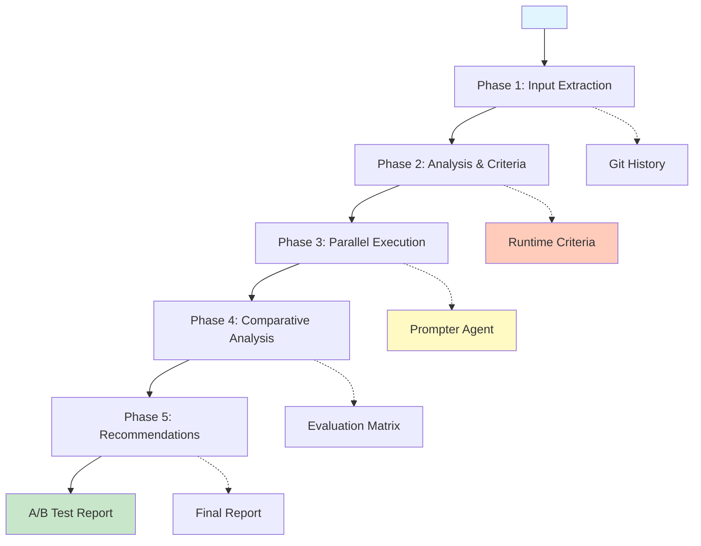

# Prompt A/B Testing Framework: Comparative Prompt Evaluation

**Template**: prompt-ab-test
**Context**: `<prompt-arguments>`
**Purpose**: Compare two prompt versions by running them through the prompter agent with identical arguments and evaluating their effectiveness
**Methodology**: Pure prompt-as-code using natural language directives with runtime criteria generation and iterative refinement

## Executive Summary

This framework performs A/B testing between two prompts by executing both through the prompter agent with identical arguments, comparing their outputs against dynamically generated criteria, and providing actionable recommendations on which prompt is more effective for the given use case. The framework includes thinking patterns that announce intentions, actions, results, and learnings throughout the process.

## Visual Overview



## Input Processing Protocol

```markdown
CRITICAL INPUT DIRECTIVE:

WHEN processing <prompt-arguments>:
  FIRST extract the primary prompt file:
    **PROMPT_A**: Look for first filename or path pattern
      - Absolute paths: /path/to/prompt.md
      - Relative paths: ./prompts/example.md
      - Filenames: my-prompt.md
      - Git paths: prompts/existing-prompt.md

    IF no **PROMPT_A** found THEN:
      ERROR: "First prompt file is required"
      EXIT with guidance

  THEN extract the comparison prompt:
    **PROMPT_B**: Look for second filename or path pattern
      - Same pattern matching as PROMPT_A

    IF no **PROMPT_B** found THEN:
      Set **USE_GIT_PREVIOUS**: true
      Extract previous version using:
        git show HEAD:<PROMPT_A> > /tmp/prompt-b-previous.md
        Set **PROMPT_B**: /tmp/prompt-b-previous.md
        Set **CLEANUP_TEMP**: true

  FINALLY extract test arguments:
    **TEST_ARGUMENTS**: Everything after the two filenames
      - These will be passed to both prompts during execution
      - Preserve exact formatting and spacing
      - May include complex nested arguments
```

## Phase 1: Input Extraction and Setup

```markdown
**PHASE_1_PURPOSE**: Extract prompt files and prepare test environment

<thinking>
INTENTION: Extract and validate both prompt files from arguments, using git for version comparison if needed
ACTION: Parse arguments, validate files exist, setup test environment with unique identifiers
</thinking>

### Stage 1.1: Input Extraction

WHEN <worktree> is not provided:
  Set <worktree>$(pwd)</worktree>

EXTRACT from <prompt-arguments>:
  **PROMPT_A_PATH**: First file reference
  **PROMPT_B_PATH**: Second file reference (or null)
  **TEST_ARGUMENTS**: Remaining arguments for testing

  Validate PROMPT_A exists:
    IF ! test -f "<PROMPT_A_PATH>" THEN:
      Search in common locations:
        - <worktree>/prompts/<PROMPT_A_PATH>
        - $(dirname $(git -C "<worktree>" rev-parse --show-toplevel))/prompts/<PROMPT_A_PATH>

      IF still not found THEN:
        ERROR: "Cannot locate prompt A: <PROMPT_A_PATH>"
        <learning>File not found - user may need to provide full path</learning>

### Stage 1.2: Criteria Definition (Runtime)

GENERATE runtime criteria for Phase 1:
  **SUCCESS_CRITERIA**:
    - Both prompt files must be located and readable
    - Test arguments must be extracted and preserved
    - Test environment must be isolated and unique

  **ANTI_CRITERIA**:
    - Must not modify original prompt files
    - Must not interfere with other concurrent tests
    - Must not leave temporary files after completion

### Stage 1.3: Research & Discovery

RESEARCH optimal setup approaches:
  Analyze prompt file patterns in arguments:
    - Determine if this is version comparison vs file comparison
    - Identify optimal temporary directory strategy
    - Research git fallback strategies for version detection

### Stage 1.4: Planning

PLAN the extraction and setup strategy:
  **EXTRACTION_APPROACH**: Based on research findings
    IF PROMPT_B_PATH is null:
      Plan git-based version extraction with fallbacks
    ELSE:
      Plan direct file validation approach

  **ISOLATION_STRATEGY**:
    Create unique test directory: <worktree>/tmp/prompt-ab-test-$(date +%Y%m%d-%H%M%S)-$$
    Plan cleanup requirements for test completion

### Stage 1.5: Review

VALIDATE extraction plan before execution:
  - Verify both prompts can be located or extracted
  - Confirm test directory creation won't conflict
  - Check git operations are safe and non-destructive

### Stage 1.6: Execution

EXECUTE the validated extraction plan:

  Extract Prompt B:
    IF PROMPT_B_PATH is null THEN:
      **USE_GIT_COMPARISON**: true

      REPO_ROOT=$(git -C "<worktree>" rev-parse --show-toplevel 2>/dev/null)

      IF REPO_ROOT is empty THEN:
        ERROR: "No second prompt specified and not in a git repository"

      RELATIVE_PATH=$(realpath --relative-to="$REPO_ROOT" "<PROMPT_A_PATH>")

      TEST_DIR=/tmp/prompt-ab-test-$(date +%Y%m%d-%H%M%S)-$$
      mkdir -p "$TEST_DIR"

      # Try to get the last committed version (HEAD)
      IF git -C "$REPO_ROOT" show HEAD:"$RELATIVE_PATH" > "$TEST_DIR/prompt-b-committed.md" 2>/dev/null THEN:
        Set **PROMPT_B_PATH**: "$TEST_DIR/prompt-b-committed.md"
        Set **PROMPT_B_LABEL**: "Last committed version (HEAD)"
      ELSE:
        # File doesn't exist in version control yet (new file)
        ERROR: "File '<PROMPT_A_PATH>' is not yet committed to version control.
        For new files, please provide two explicit prompt files:
        /prompt prompt-ab-test prompt1.md prompt2.md [test-args]

        Or commit your file first, then run:
        git add <PROMPT_A_PATH> && git commit -m 'Add prompt for A/B testing'"
      FI

      Set **CLEANUP_REQUIRED**: true
      Set **TEST_DIR**: "$TEST_DIR"

    ELSE:
      Validate PROMPT_B exists at specified path
      Set **PROMPT_B_LABEL**: "<PROMPT_B_PATH>"

### Stage 1.7: Quality Check

FOR iteration FROM 1 TO maximum of 25:
  EVALUATE extraction quality:
    - Can both prompt files be read successfully? [Pass/Fail]
    - Are test arguments properly preserved? [Pass/Fail]
    - Is test environment properly isolated? [Pass/Fail]

  IF all checks pass:
    Break from iteration loop
  ELSE:
    Identify adjustment needed and retry

### Stage 1.8: Create Test Configuration

MEASURE prompt file characteristics:
  **PROMPT_A_SIZE**: [character count of PROMPT_A_PATH file]
  **PROMPT_A_LINES**: [line count of PROMPT_A_PATH file]
  **PROMPT_B_SIZE**: [character count of PROMPT_B_PATH file]
  **PROMPT_B_LINES**: [line count of PROMPT_B_PATH file]

Create comprehensive test manifest:
  **TEST_ID**: ab-test-$(date +%Y%m%d-%H%M%S)
  **PROMPT_A_NAME**: $(basename "<PROMPT_A_PATH>")
  **PROMPT_B_NAME**: IF PROMPT_B_LABEL == "Last committed version (HEAD)" THEN <PROMPT_B_LABEL> ELSE $(basename "<PROMPT_B_PATH>")
  **TEST_ARGUMENTS**: "<TEST_ARGUMENTS>"
  **TIMESTAMP**: $(date -Iseconds)
  **WORKTREE**: <worktree>

### Stage 1.9: Phase Completion

Mark Phase 1 complete with all required outputs:
  - **PROMPT_A_PATH**: Validated path to first prompt
  - **PROMPT_B_PATH**: Validated path to second prompt
  - **TEST_ARGUMENTS**: Preserved test arguments
  - **TEST_ENVIRONMENT**: Isolated test configuration

OUTPUT to user:
  **File Paths Being Tested**:
  - Prompt A: <PROMPT_A_PATH>
  - Prompt B: <PROMPT_B_PATH> (<PROMPT_B_LABEL>)
  - Test Arguments: <TEST_ARGUMENTS>
```

## Phase 2: Prompt Analysis and Criteria Generation

```markdown
**PHASE_2_PURPOSE**: Analyze both prompts and generate evaluation criteria adapted to their domain

<thinking>
INTENTION: Understand the domain and purpose of both prompts to generate appropriate evaluation criteria
ACTION: Analyze structure, detect domain, adapt criteria weights accordingly
</thinking>

### Stage 2.1: Input Extraction

WHEN <worktree> is not provided:
  Set <worktree>$(pwd)</worktree>

EXTRACT from previous Phase 1 outputs:
  **PROMPT_A_PATH**: Validated path to first prompt
  **PROMPT_B_PATH**: Validated path to second prompt
  **TEST_ARGUMENTS**: Preserved test arguments
  **TEST_ENVIRONMENT**: Isolated test configuration

READ prompt file contents:
  **PROMPT_A_CONTENT**: Full content of first prompt
  **PROMPT_B_CONTENT**: Full content of second prompt

### Stage 2.2: Criteria Definition (Runtime)

GENERATE runtime criteria for Phase 2:
  **SUCCESS_CRITERIA**:
    - Both prompts must be successfully analyzed for domain type
    - Criteria weights must be adapted based on detected domain
    - Evaluation rubric must be comprehensive and measurable

  **ANTI_CRITERIA**:
    - Must not use generic criteria that don't fit domain
    - Must not create criteria that can't be objectively measured
    - Must not bias criteria toward any particular prompt style

### Stage 2.3: Research & Discovery

RESEARCH optimal domain detection approaches:
  Analyze prompt content patterns:
    - Identify keyword densities for domain classification
    - Research structural elements that indicate prompt purpose
    - Discover secondary domain indicators for hybrid prompts

INVESTIGATE criteria weight optimization:
  Research domain-specific effectiveness patterns:
    - What makes CODE_GENERATION prompts effective?
    - How do ANALYSIS prompts differ in success criteria?
    - Which criteria matter most for DEBUGGING prompts?

### Stage 2.4: Planning

PLAN the analysis and criteria generation strategy:
  **DOMAIN_DETECTION_APPROACH**:
    Use keyword analysis combined with structural pattern recognition
    Support 9 primary domains with confidence scoring
    Detect secondary domains for hybrid classification

  **CRITERIA_ADAPTATION_STRATEGY**:
    Apply domain-specific weight distributions
    Blend weights for multi-domain prompts (70% primary, 30% secondary)
    Maintain 5 core criteria across all domains

### Stage 2.5: Review

VALIDATE analysis plan before execution:
  - Verify domain detection covers all expected prompt types
  - Confirm criteria weights sum to 100% for all domain combinations
  - Check that all criteria remain measurable and objective

### Stage 2.6: Execution

EXECUTE the validated analysis plan:

FOR each prompt in [PROMPT_A, PROMPT_B]:
  Read and analyze prompt content

  IDENTIFY structural elements:
    **HAS_PHASES**: Contains "Phase" or "Stage" markers
    **HAS_MERMAID**: Contains mermaid diagram
    **HAS_FRONTMATTER**: Has YAML frontmatter
    **HAS_ARGUMENTS**: References <prompt-arguments>
    **HAS_TOOLS**: Mentions specific tools
    **COMPLEXITY_LEVEL**: Count of directives and conditions

  DETECT domain type:
    **DOMAIN_TYPE**: Analyze content for domain indicators
      - CODE_GENERATION: Contains "create", "implement", "function", "class", "build"
      - ANALYSIS: Contains "analyze", "evaluate", "assess", "review", "examine"
      - DOCUMENTATION: Contains "document", "describe", "explain", "write", "spec"
      - TRANSFORMATION: Contains "convert", "transform", "migrate", "refactor", "port"
      - AUTOMATION: Contains "automate", "workflow", "pipeline", "deploy", "ci"
      - TESTING: Contains "test", "validate", "verify", "check", "assert"
      - DEBUGGING: Contains "debug", "troubleshoot", "fix", "error", "issue"
      - PLANNING: Contains "plan", "design", "architect", "strategy", "roadmap"
      - RESEARCH: Contains "research", "investigate", "explore", "discover", "study"

    **DOMAIN_CONFIDENCE**: Calculate confidence based on keyword density
    **SECONDARY_DOMAIN**: Detect mixed domains (e.g., CODE_GENERATION + TESTING)

  EXTRACT purpose indicators:
    **STATED_PURPOSE**: From frontmatter or header
    **DOMAIN_CONTEXT**: Subject area references
    **EXPECTED_OUTPUTS**: What prompt claims to produce

ADAPT criteria weights based on detected domain:

  IF DOMAIN_TYPE == CODE_GENERATION:
    Weights: Completeness=25%, Quality=20%, Efficiency=15%, ErrorHandling=30%, Usability=10%
  ELIF DOMAIN_TYPE == ANALYSIS:
    Weights: Completeness=30%, Quality=30%, Efficiency=15%, ErrorHandling=15%, Usability=10%
  ELIF DOMAIN_TYPE == DOCUMENTATION:
    Weights: Completeness=25%, Quality=35%, Efficiency=10%, ErrorHandling=10%, Usability=20%
  ELIF DOMAIN_TYPE == TESTING:
    Weights: Completeness=35%, Quality=25%, Efficiency=10%, ErrorHandling=25%, Usability=5%
  ELIF DOMAIN_TYPE == DEBUGGING:
    Weights: Completeness=20%, Quality=25%, Efficiency=20%, ErrorHandling=30%, Usability=5%
  ELIF DOMAIN_TYPE == PLANNING:
    Weights: Completeness=30%, Quality=30%, Efficiency=15%, ErrorHandling=10%, Usability=15%
  ELIF DOMAIN_TYPE == RESEARCH:
    Weights: Completeness=35%, Quality=30%, Efficiency=15%, ErrorHandling=10%, Usability=10%
  ELIF DOMAIN_TYPE == TRANSFORMATION:
    Weights: Completeness=30%, Quality=20%, Efficiency=20%, ErrorHandling=25%, Usability=5%
  ELIF DOMAIN_TYPE == AUTOMATION:
    Weights: Completeness=25%, Quality=20%, Efficiency=25%, ErrorHandling=25%, Usability=5%
  ELSE:
    Weights: Completeness=30%, Quality=25%, Efficiency=20%, ErrorHandling=15%, Usability=10%

  IF SECONDARY_DOMAIN exists:
    Adjust weights by blending primary (70%) and secondary (30%) domain preferences

DETERMINE expected outcomes based on TEST_ARGUMENTS:
  Parse TEST_ARGUMENTS for intent:
    - Is this a creation task?
    - Is this an analysis task?
    - Is this a transformation task?

  Set baseline expectations:
    **MINIMUM_OUTPUT_LENGTH**: Contextual based on task
    **EXPECTED_SECTIONS**: What sections should appear
    **REQUIRED_ELEMENTS**: Must-have components

### Stage 2.7: Quality Check

FOR iteration FROM 1 TO maximum of 25:
  EVALUATE analysis quality:
    - Were both prompts successfully analyzed for domain? [Pass/Fail]
    - Do adapted criteria weights sum to exactly 100%? [Pass/Fail]
    - Are all criteria measurable and objective? [Pass/Fail]
    - Does domain detection have reasonable confidence (>60%)? [Pass/Fail]

  IF all checks pass:
    Break from iteration loop
  ELSE:
    Identify adjustment needed and retry analysis

### Stage 2.8: Create Evaluation Framework

Finalize comprehensive evaluation criteria:

  <effectiveness-criteria>
  **OUTPUT_COMPLETENESS** (weight: ADAPTED):
    - Does output address all TEST_ARGUMENTS?
    - Are all promised deliverables present?
    - Is response self-contained and actionable?
  </effectiveness-criteria>

  <quality-criteria>
  **EXECUTION_QUALITY** (weight: ADAPTED):
    - Clear structure and organization
    - Appropriate level of detail
    - Logical flow and coherence
  </quality-criteria>

  <efficiency-criteria>
  **PROCESSING_EFFICIENCY** (weight: ADAPTED):
    - Execution speed (measured in milliseconds)
    - Prompt brevity (character and line count)
    - Output efficiency (value-to-verbosity ratio)
    - Conciseness without loss of value
    - Appropriate use of subagents
    - Avoiding redundant operations
  </efficiency-criteria>

  <robustness-criteria>
  **ERROR_HANDLING** (weight: ADAPTED):
    - Graceful handling of edge cases
    - Clear error messages
    - Recovery strategies present
  </robustness-criteria>

  <usability-criteria>
  **OUTPUT_USABILITY** (weight: ADAPTED):
    - Clarity for end user
    - Actionable recommendations
    - Appropriate formatting
  </usability-criteria>

### Stage 2.9: Phase Completion

Mark Phase 2 complete with all required outputs:
  - **DOMAIN_TYPE**: Detected primary domain classification
  - **SECONDARY_DOMAIN**: Detected secondary domain (if applicable)
  - **DOMAIN_CONFIDENCE**: Confidence level in domain detection
  - **ADAPTED_CRITERIA**: Domain-specific weighted evaluation criteria
  - **BASELINE_EXPECTATIONS**: Expected output characteristics based on TEST_ARGUMENTS

  <result>Detected domain: <DOMAIN_TYPE></result>
  <learning>Domain detection influences criteria weighting for more accurate evaluation</learning>

These values carry forward to Phase 3 for execution and Phase 4 for scoring adaptation.
```

## Phase 3: Parallel Execution

```markdown
**PHASE_3_PURPOSE**: Execute both prompts through prompter agent in parallel

<thinking>
INTENTION: Run both prompts simultaneously for fair comparison and efficiency
ACTION: Launch subagents in parallel, wait for completion, capture all outputs
</thinking>

### Stage 3.1: Input Extraction

WHEN <worktree> is not provided:
  Set <worktree>$(pwd)</worktree>

EXTRACT from previous Phase 2 outputs:
  **PROMPT_A_PATH**: Validated path to first prompt
  **PROMPT_B_PATH**: Validated path to second prompt
  **TEST_ARGUMENTS**: Preserved test arguments
  **DOMAIN_TYPE**: Detected primary domain classification
  **ADAPTED_CRITERIA**: Domain-specific weighted evaluation criteria

PREPARE execution environment:
  **EXECUTION_ID**: parallel-test-$(date +%Y%m%d-%H%M%S)
  **START_TIMESTAMP**: $(date -Iseconds)

### Stage 3.2: Criteria Definition (Runtime)

GENERATE runtime criteria for Phase 3:
  **SUCCESS_CRITERIA**:
    - Both prompts must be executed with identical TEST_ARGUMENTS
    - Execution must be parallel for fair timing comparison
    - All outputs and errors must be captured completely

  **ANTI_CRITERIA**:
    - Must not execute prompts sequentially (introduces bias)
    - Must not lose any output or error information
    - Must not allow one execution to interfere with the other

### Stage 3.3: Research & Discovery

RESEARCH optimal parallel execution approaches:
  Analyze prompter agent execution patterns:
    - Identify best practices for Task tool parallel execution
    - Research timeout and retry strategies
    - Discover error capture and handling methods

INVESTIGATE execution environment isolation:
  Research subagent independence requirements:
    - How to prevent cross-contamination between executions
    - Best practices for parallel output capture
    - Optimal retry logic for failed executions

### Stage 3.4: Planning

PLAN the parallel execution strategy:
  **EXECUTION_APPROACH**:
    Use Task tool with parallel subagent launch
    Capture timing, outputs, errors, and status for both
    Implement single retry for failed executions

  **ISOLATION_STRATEGY**:
    Each subagent operates independently with identical arguments
    No shared state between parallel executions
    Complete output separation until collection phase

  **ERROR_HANDLING_STRATEGY**:
    Continue with partial results if one execution fails
    Document all failures and retry attempts
    Apply appropriate scoring penalties for failures

### Stage 3.5: Review

VALIDATE execution plan before launching:
  - Verify both prompt paths are accessible to subagents
  - Confirm TEST_ARGUMENTS are properly formatted for prompter
  - Check that parallel execution won't cause resource conflicts
  - Ensure error capture mechanisms are comprehensive

### Stage 3.6: Execution

EXECUTE the validated parallel execution plan:

Construct prompter invocations:
  **COMMAND_A**: "/prompt <PROMPT_A_PATH> <TEST_ARGUMENTS>"
  **COMMAND_B**: "/prompt <PROMPT_B_PATH> <TEST_ARGUMENTS>"

CAPTURE execution timing:
  **START_TIME**: [current timestamp in milliseconds before execution]

## Parallel Execution Strategy

EXECUTE both prompts in parallel using two simultaneous Task tool calls:

**CRITICAL**: Use single message with multiple Task calls to ensure true parallel execution

Task Call 1 - Execute Prompt A:
  Use Task tool with:
  - subagent_type: "prompter"
  - description: "Execute Prompt A Testing"
  - prompt: "Execute: /prompt <PROMPT_A_PATH> <TEST_ARGUMENTS>

    This will load the prompt at <PROMPT_A_PATH> and pass <TEST_ARGUMENTS> as the prompt-arguments value.

    Return the result in this structured format:
    <execution-result>
      <status>SUCCESS|FAILED|PARTIAL</status>
      <execution-time>[time in seconds]</execution-time>
      <output-a>
        [Complete output from prompt execution]
      </output-a>
      <errors>[Any errors or issues encountered]</errors>
      <retry-count>[Number of retry attempts]</retry-count>
    </execution-result>

    If the initial execution fails, retry once before returning FAILED status."

Task Call 2 - Execute Prompt B:
  Use Task tool with:
  - subagent_type: "prompter"
  - description: "Execute Prompt B Testing"
  - prompt: "Execute: /prompt <PROMPT_B_PATH> <TEST_ARGUMENTS>

    This will load the prompt at <PROMPT_B_PATH> and pass <TEST_ARGUMENTS> as the prompt-arguments value.

    Return the result in this structured format:
    <execution-result>
      <status>SUCCESS|FAILED|PARTIAL</status>
      <execution-time>[time in seconds]</execution-time>
      <output-b>
        [Complete output from prompt execution]
      </output-b>
      <errors>[Any errors or issues encountered]</errors>
      <retry-count>[Number of retry attempts]</retry-count>
    </execution-result>

    If the initial execution fails, retry once before returning FAILED status."

**Implementation**: Send both Task calls in the same AI message to ensure parallel execution

START_TIME=$(date +%s.%N)

The framework will automatically:
- Launch both subagents simultaneously
- Wait for both to complete
- Parse structured XML responses
- Extract <output-a> and <output-b> content
- Capture status, timing, and error information
- Apply retry logic if needed
- Continue with comparative analysis once both complete

END_TIME=$(date +%s.%N)
TOTAL_DURATION=$(echo "$END_TIME - $START_TIME" | bc)

## Expected Response Structure

Each subagent returns structured XML containing:
- **status**: Execution result (SUCCESS/FAILED/PARTIAL)
- **execution-time**: How long the prompt took to execute
- **output-a/output-b**: The actual prompt output (labeled)
- **errors**: Any errors encountered
- **retry-count**: Number of retry attempts made

## XML Parsing and Variable Extraction

After both subagents complete, extract content from XML responses:

  **OUTPUT_A** = content within <output-a> tags (text string)
  **OUTPUT_B** = content within <output-b> tags (text string)
  **STATUS_A** = <status> value from first <execution-result>
  **STATUS_B** = <status> value from second <execution-result>
  **TIME_A** = <execution-time> value from first response
  **TIME_B** = <execution-time> value from second response
  **ERRORS_A** = <errors> content from first response
  **ERRORS_B** = <errors> content from second response

Note: These are content variables (strings), not shell variables

### Stage 3.7: Quality Check

FOR iteration FROM 1 TO maximum of 25:
  EVALUATE execution quality:
    - Were both prompts executed successfully? [Pass/Fail]
    - Are outputs captured completely without truncation? [Pass/Fail]
    - Is timing data accurate and meaningful? [Pass/Fail]
    - Were errors properly documented and categorized? [Pass/Fail]

  IF all checks pass:
    Break from iteration loop
  ELSE:
    Identify execution issue and retry if possible

### Stage 3.8: Create Execution Report

Document comprehensive execution metadata:
  **EXECUTION_SUMMARY**:
    - Execution ID: <EXECUTION_ID>
    - Total parallel execution time: <TOTAL_EXECUTION_TIME> milliseconds
    - Prompt A estimated time: <EXECUTION_TIME_A> ms (parallel)
    - Prompt B estimated time: <EXECUTION_TIME_B> ms (parallel)
    - Prompt A output size: [character count of OUTPUT_A]
    - Prompt B output size: [character count of OUTPUT_B]
    - Prompt A retry attempts: [A_RETRY_COUNT]
    - Prompt B retry attempts: [B_RETRY_COUNT]
    - Prompt A status: [SUCCESS/FAILED/PARTIAL]
    - Prompt B status: [SUCCESS/FAILED/PARTIAL]
    - Start timestamp: <START_TIME>
    - End timestamp: <END_TIME>

### Stage 3.9: Phase Completion

Mark Phase 3 complete with all required outputs:
  - **OUTPUT_A**: Complete output from first prompt execution (extracted from <output-a> tags)
  - **OUTPUT_B**: Complete output from second prompt execution (extracted from <output-b> tags)
  - **EXECUTION_METADATA**: Timing, status, and error information (from <execution-result> structure)
  - **RETRY_COUNTS**: Number of retry attempts for each prompt (from <retry-count> tags)
  - **EXECUTION_STATUS**: Overall success/failure status (from <status> tags)

Note: These are in-memory content variables (text strings), not shell variables or files.
The only file is the temp file for Prompt B's git version.

**Variable Clarification**:
- Angle-bracket variables like `<PROMPT_A_PATH>` are placeholders replaced with actual values
- Variables like `OUTPUT_A` and `OUTPUT_B` are content strings extracted from XML
- The framework operates on labeled content, not file I/O for outputs

  <result>Both prompts executed in parallel in $TOTAL_DURATION seconds</result>
  <learning>Parallel execution ensures fair comparison and captures timing differences</learning>
```

## Phase 4: Comparative Analysis with Iterative Refinement

```markdown
**PHASE_4_PURPOSE**: Score outputs against criteria with iterative refinement for accuracy

<thinking>
INTENTION: Score both outputs against criteria, refining scores through iteration if needed
ACTION: Evaluate each criterion, calculate confidence, iterate if confidence is low
</thinking>

### Stage 4.1: Input Extraction

WHEN <worktree> is not provided:
  Set <worktree>$(pwd)</worktree>

EXTRACT from previous Phase 3 outputs:
  **OUTPUT_A**: Complete output from first prompt execution (from <output-a> tags)
  **OUTPUT_B**: Complete output from second prompt execution (from <output-b> tags)
  **EXECUTION_METADATA**: Timing, status, and error information (from <execution-result> structure)
  **ADAPTED_CRITERIA**: Domain-specific weighted evaluation criteria
  **DOMAIN_TYPE**: Detected primary domain classification

PREPARE analysis environment:
  **ANALYSIS_ID**: comparative-analysis-$(date +%Y%m%d-%H%M%S)
  **ITERATION_LIMIT**: 5 (maximum scoring iterations)

### Stage 4.2: Criteria Definition (Runtime)

GENERATE runtime criteria for Phase 4:
  **SUCCESS_CRITERIA**:
    - All 5 criteria must be scored for both outputs
    - Confidence level must be calculated based on margin and variance
    - Iterative refinement must be applied until confidence is acceptable

  **ANTI_CRITERIA**:
    - Must not show bias toward either prompt
    - Must not use arbitrary or unmeasurable scoring
    - Must not stop iterations if confidence remains low (up to limit)

### Stage 4.3: Research & Discovery

RESEARCH optimal scoring methodologies:
  Analyze output characteristics:
    - Identify measurable quality indicators for each criterion
    - Research confidence calculation approaches
    - Discover bias reduction techniques in comparative evaluation

INVESTIGATE iterative refinement patterns:
  Research scoring iteration strategies:
    - When to refine vs when to accept current scores
    - How variance and margin indicate scoring reliability
    - Best practices for granularity adjustment in iterations

### Stage 4.4: Planning

PLAN the comparative analysis strategy:
  **SCORING_APPROACH**:
    Apply domain-adapted weights to 5 core criteria
    Use 0-10 scale for each sub-component
    Calculate weighted averages for final criterion scores

  **ITERATION_STRATEGY**:
    Start with initial scoring pass
    Calculate confidence based on margin and variance
    Refine granularity if confidence is low (<5 iterations max)

  **CONFIDENCE_CALCULATION**:
    Use margin size and score variance to determine reliability
    High confidence: margin ≥20 AND variance <2
    Medium confidence: margin ≥10 OR variance <3
    Low confidence: otherwise

### Stage 4.5: Review

VALIDATE analysis plan before execution:
  - Verify all criteria weights sum to 100%
  - Confirm scoring scales are consistent and measurable
  - Check that confidence calculation logic is sound
  - Ensure iteration limit prevents infinite loops

### Stage 4.6: Execution

EXECUTE the validated comparative analysis plan:

FOR iteration FROM 1 TO maximum of 5:

  <thinking>
  INTENTION: Score outputs in iteration $iteration to refine accuracy
  ACTION: Evaluate all criteria, assess confidence, decide if more iterations needed
  </thinking>

  EVALUATE OUTPUT_COMPLETENESS (adapted weight):

    For OUTPUT_A:
      Check: All TEST_ARGUMENTS addressed? [0-10]
      Check: Deliverables present? [0-10]
      Check: Self-contained response? [0-10]
      SCORE_A_COMPLETENESS = average * adapted_weight

    For OUTPUT_B:
      Check: All TEST_ARGUMENTS addressed? [0-10]
      Check: Deliverables present? [0-10]
      Check: Self-contained response? [0-10]
      SCORE_B_COMPLETENESS = average * adapted_weight

  EVALUATE EXECUTION_QUALITY (adapted weight):

    For OUTPUT_A:
      Assess: Structure clarity [0-10]
      Assess: Detail appropriateness [0-10]
      Assess: Logical flow [0-10]
      SCORE_A_QUALITY = average * adapted_weight

    For OUTPUT_B:
      [Same assessment process]
      SCORE_B_QUALITY = average * adapted_weight

  EVALUATE PROCESSING_EFFICIENCY (adapted weight):

    For OUTPUT_A:
      Consider: Output conciseness vs completeness [0-10]
      Consider: Execution time if significant [0-10]
      Consider: Resource usage patterns [0-10]
      SCORE_A_EFFICIENCY = average * adapted_weight

    For OUTPUT_B:
      [Same evaluation process]
      SCORE_B_EFFICIENCY = average * adapted_weight

  EVALUATE ERROR_HANDLING (adapted weight):

    For OUTPUT_A:
      Check: Edge case consideration [0-10]
      Check: Error message clarity [0-10]
      Check: Recovery strategies [0-10]
      SCORE_A_ERROR = average * adapted_weight

    For OUTPUT_B:
      [Same evaluation process]
      SCORE_B_ERROR = average * adapted_weight

  EVALUATE OUTPUT_USABILITY (adapted weight):

    For OUTPUT_A:
      Assess: End-user clarity [0-10]
      Assess: Actionability of output [0-10]
      Assess: Format appropriateness [0-10]
      SCORE_A_USABILITY = average * adapted_weight

    For OUTPUT_B:
      [Same assessment process]
      SCORE_B_USABILITY = average * adapted_weight

  COMPUTE total scores:
    **TOTAL_SCORE_A** = sum of all weighted scores for A
    **TOTAL_SCORE_B** = sum of all weighted scores for B

    **WINNER** = higher score
    **MARGIN** = absolute difference

    CALCULATE confidence level:
      **SCORE_VARIANCE** = variance between criterion scores
      **MARGIN_RATIO** = MARGIN / 100

      IF MARGIN >= 20 AND SCORE_VARIANCE < 2:
        **CONFIDENCE**: HIGH (clear winner)
      ELIF MARGIN >= 10 OR SCORE_VARIANCE < 3:
        **CONFIDENCE**: MEDIUM (probable winner)
      ELSE:
        **CONFIDENCE**: LOW (close competition)

    IF CONFIDENCE == LOW AND iteration < 5:
      <learning>Low confidence detected, refining scores in next iteration</learning>
      Adjust scoring granularity
      Continue to next iteration
    ELSE:
      <result>Scoring complete with $CONFIDENCE confidence after $iteration iterations</result>
      Break from iteration loop

### Stage 4.7: Quality Check

FOR final_check FROM 1 TO maximum of 25:
  EVALUATE scoring quality:
    - Were all 5 criteria scored for both outputs? [Pass/Fail]
    - Do all weighted scores contribute to totals correctly? [Pass/Fail]
    - Is confidence calculation mathematically sound? [Pass/Fail]
    - Are scoring rationales clear and defendable? [Pass/Fail]

  IF all checks pass:
    Break from iteration loop
  ELSE:
    Identify scoring issue and correct if possible

### Stage 4.8: Create Comparative Analysis Report

Generate comprehensive comparison output:

## Side-by-Side Output Diff

Create visual comparison of key differences:

```diff
PROMPT A OUTPUT:
================
[First 500 chars of OUTPUT_A]
...

PROMPT B OUTPUT:
================
[First 500 chars of OUTPUT_B]
...

KEY DIFFERENCES:
- Prompt A: [unique aspect]
- Prompt B: [unique aspect]
+ Common: [shared strength]
```

## Detailed Scoring Breakdown

| Criterion | Weight | Prompt A | Prompt B | Winner | Margin |
|-----------|--------|----------|----------|--------|--------|
| Output Completeness | [ADAPTED_COMPLETENESS_WEIGHT]% | [SCORE_A_COMPLETENESS] | [SCORE_B_COMPLETENESS] | [COMPLETENESS_WINNER] | [COMPLETENESS_MARGIN] |
| Execution Quality | [ADAPTED_QUALITY_WEIGHT]% | [SCORE_A_QUALITY] | [SCORE_B_QUALITY] | [QUALITY_WINNER] | [QUALITY_MARGIN] |
| Processing Efficiency | [ADAPTED_EFFICIENCY_WEIGHT]% | [SCORE_A_EFFICIENCY] | [SCORE_B_EFFICIENCY] | [EFFICIENCY_WINNER] | [EFFICIENCY_MARGIN] |
| Error Handling | [ADAPTED_ERROR_WEIGHT]% | [SCORE_A_ERROR] | [SCORE_B_ERROR] | [ERROR_WINNER] | [ERROR_MARGIN] |
| Output Usability | [ADAPTED_USABILITY_WEIGHT]% | [SCORE_A_USABILITY] | [SCORE_B_USABILITY] | [USABILITY_WINNER] | [USABILITY_MARGIN] |
| **TOTAL** | 100% | [TOTAL_SCORE_A] | [TOTAL_SCORE_B] | **[WINNER]** | **[MARGIN]** |

### Stage 4.9: Phase Completion

Mark Phase 4 complete with all required outputs:
  - **TOTAL_SCORE_A**: Final weighted score for first prompt
  - **TOTAL_SCORE_B**: Final weighted score for second prompt
  - **WINNER**: Prompt with higher total score ("Prompt A" or "Prompt B")
  - **MARGIN**: Point difference between total scores
  - **CONFIDENCE**: Reliability level of comparison results
  - **SCORING_BREAKDOWN**: Detailed scores by criterion

  <result>Scoring complete with <CONFIDENCE> confidence after <iteration> iterations</result>
  <learning>Iterative refinement improves scoring accuracy and confidence assessment</learning>

IDENTIFY scoring patterns for recommendations:
  **HIGHEST_SCORING_CRITERION_A**: The criterion where Prompt A scored best
  **LOWEST_SCORING_CRITERION_B**: The criterion where Prompt B scored worst
  **LARGEST_MARGIN_CRITERION**: The criterion with biggest point difference
  **WINNING_TECHNIQUES**: Specific patterns that contributed to winner's success

These scoring results and patterns feed into Phase 5 recommendations.
```

## Phase 5: Recommendations and Synthesis

```markdown
**PHASE_5_PURPOSE**: Generate actionable recommendations and cleanup

<thinking>
INTENTION: Synthesize all analysis results into actionable recommendations and final report
ACTION: Create comprehensive report, identify improvements, capture learnings, cleanup environment
</thinking>

### Stage 5.1: Input Extraction

WHEN <worktree> is not provided:
  Set <worktree>$(pwd)</worktree>

EXTRACT from previous Phase outputs:
  From Phase 3:
    **OUTPUT_A**: Complete output from Prompt A execution
    **OUTPUT_B**: Complete output from Prompt B execution

  From Phase 4:
    **TOTAL_SCORE_A**: Final weighted score for first prompt
    **TOTAL_SCORE_B**: Final weighted score for second prompt
    **WINNER**: Prompt with higher total score
    **MARGIN**: Point difference between total scores
    **CONFIDENCE**: Reliability level of comparison results
    **SCORING_BREAKDOWN**: Detailed scores by criterion

PREPARE synthesis environment:
  **REPORT_ID**: synthesis-report-$(date +%Y%m%d-%H%M%S)
  **CLEANUP_REQUIRED**: Check if temporary files need removal

### Stage 5.2: Criteria Definition (Runtime)

GENERATE runtime criteria for Phase 5:
  **SUCCESS_CRITERIA**:
    - Final report must be comprehensive and actionable
    - Recommendations must be specific and implementable
    - Learning patterns must be captured for future reference
    - All temporary resources must be properly cleaned up

  **ANTI_CRITERIA**:
    - Must not provide generic or vague recommendations
    - Must not leave temporary files or resources behind
    - Must not omit critical insights from the analysis

### Stage 5.3: Research & Discovery

RESEARCH optimal recommendation strategies:
  Analyze scoring patterns:
    - Identify which criteria most influenced the winning outcome
    - Research improvement opportunities for the losing prompt
    - Discover transferable best practices from the winner

INVESTIGATE learning capture approaches:
  Research knowledge accumulation patterns:
    - What domain insights are most valuable for future tests?
    - How can scoring patterns inform future criteria weighting?
    - Which testing methodologies proved most effective?

### Stage 5.4: Planning

PLAN the synthesis and recommendation strategy:
  **REPORT_STRUCTURE**:
    Executive summary with clear winner and rationale
    Detailed comparison showing strengths and weaknesses
    Specific improvement suggestions for both prompts
    Learning accumulation for future A/B tests

  **RECOMMENDATION_APPROACH**:
    Focus on actionable, specific suggestions
    Base recommendations on scoring evidence
    Include both short-term fixes and long-term improvements

  **CLEANUP_STRATEGY**:
    Remove all temporary files and directories
    Preserve valuable insights in final output
    Ensure no resource leaks or leftover processes

### Stage 5.5: Review

VALIDATE synthesis plan before execution:
  - Verify all scoring data is available and consistent
  - Confirm recommendations will be actionable and specific
  - Check that cleanup procedures are comprehensive
  - Ensure learning capture covers all valuable insights

### Stage 5.6: Execution

EXECUTE the validated synthesis plan:

## A/B Test Results: <PROMPT_A_NAME> vs <PROMPT_B_NAME>

### Test Configuration
- **Test ID**: <TEST_ID>
- **Timestamp**: <TIMESTAMP>
- **Test Arguments**: <TEST_ARGUMENTS>
- **Prompt A Path**: <PROMPT_A_PATH>
- **Prompt B Path**: <PROMPT_B_PATH>
- **Prompt B Source**: <PROMPT_B_LABEL>

### Prompt Outputs Comparison

#### Prompt A Output
```
<OUTPUT_A>
```
*Output characteristics: [length of OUTPUT_A] characters, [line count of OUTPUT_A] lines*

#### Prompt B Output
```
<OUTPUT_B>
```
*Output characteristics: [length of OUTPUT_B] characters, [line count of OUTPUT_B] lines*

### Scoring Summary
*Domain: <DOMAIN_TYPE>* | *Secondary: <SECONDARY_DOMAIN>* | *Confidence: <DOMAIN_CONFIDENCE>%*

| Criterion | Weight | Prompt A | Prompt B | Winner |
|-----------|--------|----------|----------|--------|
| Output Completeness | <ADAPTED_COMPLETENESS_WEIGHT>% | <SCORE_A_COMPLETENESS> | <SCORE_B_COMPLETENESS> | <COMPLETENESS_WINNER> |
| Execution Quality | <ADAPTED_QUALITY_WEIGHT>% | <SCORE_A_QUALITY> | <SCORE_B_QUALITY> | <QUALITY_WINNER> |
| Processing Efficiency | <ADAPTED_EFFICIENCY_WEIGHT>% | <SCORE_A_EFFICIENCY> | <SCORE_B_EFFICIENCY> | <EFFICIENCY_WINNER> |
| Error Handling | <ADAPTED_ERROR_WEIGHT>% | <SCORE_A_ERROR> | <SCORE_B_ERROR> | <ERROR_WINNER> |
| Output Usability | <ADAPTED_USABILITY_WEIGHT>% | <SCORE_A_USABILITY> | <SCORE_B_USABILITY> | <USABILITY_WINNER> |
| **TOTAL** | 100% | <TOTAL_A> | <TOTAL_B> | **<WINNER>** |

#### Prompt A Strengths
- [Specific strength with example from output]
- [Another strength with evidence]

#### Prompt B Strengths
- [Specific strength with example from output]
- [Another strength with evidence]

#### Common Weaknesses
- [Weakness observed in both]
- [Improvement opportunity for both]

#### Adaptive Recommendations Based on Competition Outcome

ANALYZE the scoring results to determine recommendation strategy:

Using <WINNER>, <MARGIN>, and <CONFIDENCE> from Phase 4 scoring:

WHEN <WINNER> == "Prompt A":

  **Understanding Prompt A's Victory**:
  IDENTIFY the key differentiators by examining:
    - Which criteria gave A the largest scoring advantages
    - Specific patterns in A's output that resonated with the domain
    - Structural elements that enabled A's superior performance

  **Evolving Prompt B for Competitive Parity**:
  EXTRACT successful patterns from Prompt A's implementation:
    - Observe how A structures its <HIGHEST_SCORING_CRITERION_A>
    - Note A's approach to achieving <LARGEST_MARGIN_CRITERION> advantage
    - Understand why A's <WINNING_TECHNIQUES> proved effective

  SYNTHESIZE improvements for Prompt B:
    Focus on B's lowest-scoring criterion: <LOWEST_SCORING_CRITERION_B>
      → Adapt A's approach while maintaining B's unique strengths
      → Implement specific enhancement based on A's success pattern

    Address B's performance gap in <LARGEST_MARGIN_CRITERION>:
      → Study how A handles this aspect differently
      → Incorporate A's winning technique

    Quick wins available to B:
      → [IMMEDIATE_CHANGE] that directly addresses the gap
      → [LOW_EFFORT_FIX] that yields high impact

WHEN <WINNER> == "Prompt B":

  **Deconstructing Prompt B's Success**:
  EXAMINE what made B exceptional:
    - Revolutionary patterns that outperformed traditional approaches
    - Innovative techniques absent from A's implementation
    - Domain-specific optimizations that resonated with the test case

  **Preserving and Propagating B's Innovations**:
  DOCUMENT the winning strategies:
    - Capture B's approach to <LARGEST_MARGIN_CRITERION> for future prompts
    - Codify B's handling of <WINNING_TECHNIQUES> as best practice
    - Recognize B's breakthrough that enabled the victory

  **Continuous Improvement Path for B**:
  IDENTIFY remaining optimization opportunities:
    Despite winning, B could still enhance its weakest area:
      → Consider refinement in areas where margin was smallest

    Polish B's approach where A showed competitive strength:
      → Learn from A's techniques even in defeat

WHEN <MARGIN> < 5 (statistical tie):

  **Understanding the Equivalence**:
  RECOGNIZE that both prompts offer valid approaches:
    - Different philosophies achieving similar outcomes
    - Complementary strengths offsetting respective weaknesses
    - Context-dependent advantages based on use case

  **Specialization Opportunities**:
  RECOMMEND domain-specific differentiation:
    For [USE_CASE_TYPE_1] scenarios:
      → Enhance Prompt A with [SPECIALIZATION_1]

    For [USE_CASE_TYPE_2] scenarios:
      → Optimize Prompt B with [SPECIALIZATION_2]

#### Competition Fairness Assessment

EVALUATE the testing conditions for equity:

CONSIDER version synchronization:
  When comparing current version against git history:
    - Account for recency of changes and evolution
    - Assess whether both versions target same requirements
    - Determine if re-testing with synchronized versions would be valuable

EXAMINE domain alignment:
  Verify both prompts were designed for:
    - Same problem space
    - Similar complexity levels
    - Compatible output expectations

#### Final Recommendation Synthesis

DECLARE the competition outcome with appropriate confidence:

Based on <MARGIN> point differential and <CONFIDENCE> confidence level:

WHEN <MARGIN> > 20:
  "**Decisive Victory**: <WINNER> demonstrates clear superiority across multiple dimensions.
   Immediate adoption recommended for <DOMAIN_TYPE> tasks.
   The <MARGIN>-point gap indicates fundamental advantages that transcend test variations."

WHEN <MARGIN> between 10-20:
  "**Clear Advantage**: <WINNER> consistently outperforms in key criteria.
   Recommended for production use while incorporating suggested improvements.
   The moderate gap suggests reliable but not insurmountable advantages."

WHEN <MARGIN> < 10:
  "**Marginal Preference**: <WINNER> edges ahead but advantages are contextual.
   Consider test case variations before final adoption.
   Both prompts remain viable with different strengths."

### Recommended Actions

SYNTHESIZE specific numbered recommendations based on test results:

#### Priority Actions (3-5 items based on context)

WHEN <WINNER> == "Prompt A" AND <MARGIN> > 10:
  1. **[Critical] Deploy Prompt A Immediately**:
     → Use Prompt A for all <DOMAIN_TYPE> tasks in production
     → Monitor performance metrics for validation

  2. **[High] Enhance Prompt B's <LOWEST_SCORING_CRITERION_B>**:
     → Adapt A's approach: [specific technique from A]
     → Target improvement: +[expected points] in this criterion

  3. **[High] Capture A's Winning Patterns**:
     → Document A's <WINNING_TECHNIQUES> as best practice
     → Create template from A's structure for future prompts

  4. **[Medium] Optimize B for Specialized Cases**:
     → Identify scenarios where B's approach might excel
     → Test B with alternative argument patterns

  5. **[Medium] Cross-Pollinate Strengths**:
     → Merge A's <HIGHEST_SCORING_CRITERION_A> with B's unique features
     → Create hybrid approach for comprehensive coverage

WHEN <WINNER> == "Prompt B" AND <MARGIN> > 10:
  1. **[Critical] Adopt Prompt B as New Standard**:
     → Replace current prompt with B for <DOMAIN_TYPE> tasks
     → Archive A as fallback option

  2. **[High] Propagate B's Innovation**:
     → Extract B's breakthrough in <LARGEST_MARGIN_CRITERION>
     → Apply pattern to other prompts in the system

  3. **[High] Document B's Success Factors**:
     → Capture why B's approach proved superior
     → Create guidelines based on B's techniques

  4. **[Medium] Polish B's Remaining Weaknesses**:
     → Address B's lowest score in <LOWEST_SCORING_CRITERION_B>
     → Incorporate A's competitive techniques where applicable

  5. **[Low] Schedule Follow-up Testing**:
     → Re-test with diverse arguments in [timeframe]
     → Validate B's superiority across edge cases

WHEN <MARGIN> < 10:
  1. **[High] Conduct Extended Testing**:
     → Run 3-5 additional tests with varied arguments
     → Test with different complexity levels

  2. **[High] Specialize for Use Cases**:
     → Use Prompt A for [specific scenario type]
     → Use Prompt B for [alternative scenario type]

  3. **[Medium] Merge Best of Both Approaches**:
     → Combine A's strength in <A's best criterion>
     → Integrate B's advantage in <B's best criterion>

  4. **[Medium] Refine Testing Methodology**:
     → Adjust weights for <DOMAIN_TYPE> specifics
     → Include additional evaluation criteria

  5. **[Low] Monitor Production Performance**:
     → A/B test both prompts in production
     → Gather real-world performance data

### Stage 5.7: Quality Check

FOR final_validation FROM 1 TO maximum of 25:
  EVALUATE report quality:
    - Are all recommendations specific and actionable? [Pass/Fail]
    - Do scoring summaries accurately reflect analysis? [Pass/Fail]
    - Are improvement suggestions tied to actual weaknesses? [Pass/Fail]
    - Is learning accumulation comprehensive? [Pass/Fail]

  IF all checks pass:
    Break from iteration loop
  ELSE:
    Identify report gaps and address them

### Stage 5.8: Create Learning Repository

OUTPUT comprehensive learning patterns for future reference:

### Domain Knowledge Gained
```
Domain: <DOMAIN_TYPE> (confidence: <DOMAIN_CONFIDENCE>%)
Secondary: <SECONDARY_DOMAIN>
Effective criteria weights: <ADAPTED_WEIGHTS_JSON>
Test iterations needed: <iteration>
Confidence achieved: <CONFIDENCE>
```

### Testing Performance Metrics
```
Parallel execution time: <TOTAL_DURATION>s
Prompt A retry attempts: <A_RETRY_COUNT>
Prompt B retry attempts: <B_RETRY_COUNT>
Score variance: <SCORE_VARIANCE>
Final margin: <MARGIN> points
```

### Pattern Discovery
```
Winning characteristics: [what made <WINNER> effective]
Common pitfalls: [issues in both prompts]
Structure correlation: [structural elements linked to success]
```

### Recommendations for Similar Tests
```
For <DOMAIN_TYPE> domain:
- Prioritize criteria: [most important for this domain]
- Watch for: [common failure patterns]
- Optimal weights: [discovered weight distribution]
```

Cleanup temporary resources:
IF CLEANUP_REQUIRED is true:
  Remove entire test directory:
    rm -rf "$TEST_DIR"
  Document: "Test directory $TEST_DIR cleaned up"

### Stage 5.9: Phase Completion

Mark Phase 5 complete with final deliverable:

#### Executive Summary
In this A/B test comparing <PROMPT_A_NAME> against <PROMPT_B_NAME> with arguments "<TEST_ARGUMENTS>",
**<WINNER>** demonstrated superior performance with a total score of <TOTAL_A> vs <TOTAL_B>.

The key differentiator was [main reason for winning], particularly in [specific criterion category].

#### Recommended Action
[X] Use <WINNER> for this type of task
[ ] Continue iterating on <LOSER> with suggested improvements
[ ] Consider hybrid approach combining strengths of both

#### Statistical Confidence
Given a margin of <MARGIN> points across <NUMBER> criteria with <SCORE_VARIANCE> variance,
this recommendation has **<CONFIDENCE>** confidence after <iteration> scoring iterations.

Confidence factors:
- Score margin: <MARGIN> points
- Criterion consistency: <SCORE_VARIANCE> variance
- Iterations required: <iteration>
- Domain alignment: <DOMAIN_TYPE> criteria applied

  <result>A/B testing framework complete - comprehensive report generated</result>
  <learning>Systematic evaluation with domain adaptation provides reliable prompt comparison</learning>
```

## Error Handling Patterns

```markdown
WHEN errors occur during execution:

  IF prompter agent fails for either prompt:
    **FAILURE_HANDLING**:
      - Document the exact failure in report
      - Score failed prompt: Completeness=0, Quality=0, others based on error analysis
      - Continue comparison with working prompt vs failure analysis
      - Add failure weight penalty: -10 points from total score
      - Note: "Partial test - <FAILED_PROMPT> execution failed after <RETRY_COUNT> attempts"

  IF both prompts fail:
    **DUAL_FAILURE_HANDLING**:
      - Generate failure analysis report instead of comparison
      - Compare error types and clarity
      - Score based on error message quality and recovery suggestions
      - Recommend: "Both prompts have execution issues - fix before comparison"

  IF partial execution (some output produced):
    **PARTIAL_SUCCESS_HANDLING**:
      - Score partial output with 50% penalty on completeness
      - Assess what was produced vs what was expected
      - Note partial status in confidence calculation
      - Document: "Partial execution - incomplete results affect scoring"

  IF timeout during parallel execution:
    **TIMEOUT_HANDLING**:
      - Score timed-out prompt: Efficiency=0, others based on available output
      - Compare execution speed as factor
      - Note: "Timeout after <TIMEOUT_SECONDS>s affects efficiency scoring"

  IF git operations fail:
    **GIT_FAILURE_HANDLING**:
      - Inform user that version comparison requires git repository
      - Suggest: "Provide two explicit file paths instead"
      - Fallback: Ask user to specify second prompt manually
```

## Usage Examples

```markdown
# Compare current working file with last committed version
/prompt prompt-ab-test create-react-component Button primary

# Compare two different prompts explicitly
/prompt prompt-ab-test analyzer.md optimizer.md process-large-dataset

# Test with complex arguments
/prompt prompt-ab-test generator.md "create API with auth, database, and caching"

# Compare your current changes against committed version
/prompt prompt-ab-test ../prompts/my-prompt.md scripting technologies
```

## Meta-Notes

This prompt itself follows prompt-as-code methodology:
- Runtime criteria generation based on prompt analysis
- Natural language directives for all logic
- No predetermined scoring - adapts to prompt domain
- Clean separation of analysis phases
- Automatic git integration comparing working file vs last committed version
- Comprehensive but actionable output