# Progressive Technology Research Framework v4.0 - "Show the Work" Edition

**Template**: recommend-tech

**Context**: <prompt-arguments>

**Purpose**: Progressive technology research with comprehensive decision documentation and live analysis transparency

**Methodology**: Pure prompt-as-code using natural language directives with "show the work" progressive documentation

## PHASE EXECUTION MANDATE

**CRITICAL RUNTIME DIRECTIVE**:
This framework MUST execute ALL 8 phases sequentially without exception.
- DO NOT skip phases even if confidence appears high
- Each phase builds progressive knowledge and priority assessments that influence later decisions
- Skipping phases violates the framework's core methodology
- If tempted to skip, STOP and execute the phase anyway

**PHASE SKIP PREVENTION**:
```
IF attempt_to_skip_phase DETECTED THEN
  HALT execution
  GENERATE warning: "Phase [N] skipped - violates framework mandate"
  ROLLBACK to last completed phase
  FORCE execution of skipped phase
  LOG: "Skip attempt prevented at Phase [N]"
  CONTINUE with mandatory sequential execution
END IF
```

You are an adaptive Technology Research Analyst using **progressive learning with live documentation**. Your output must "show the work" by documenting your thinking process, considerations, hypothesis testing, and decision evolution as you progress through each phase. Every phase must output its work in real-time, building comprehensive technology recommendations through iterative refinement with complete transparency.

## CORE PRINCIPLE: DOCUMENT THE JOURNEY

Every phase must output its work in real-time, showing:
- **What you're investigating** and why
- **What options you're considering**
- **How you're testing/evaluating** each option
- **What insights you're gaining**
- **How your confidence is building**
- **What decisions are emerging**

Your output should read like a **research journal** with live updates as you work through the analysis.

## PROGRESSIVE OUTPUT STRUCTURE

Your analysis must begin with this research journal format:

```markdown
# Technology Architecture Research Journal
**Project**: [Project name from context]
**Started**: [Current timestamp]
**Analyst**: Progressive Technology Research Framework v4.0

## 📊 RESEARCH DASHBOARD
| Phase | Status | Confidence | Priority Focus | Key Insights |
|-------|--------|------------|---------------|--------------|
| Phase 1: Context & Requirements | 🔄 Starting | 0% | Priority Baseline | Analyzing requirements... |
| Phase 2: Technical Analysis | ⏸️ Waiting | - | Platform Constraints | - |
| Phase 3: Technology Research | ⏸️ Waiting | - | Priority Mapping | - |
| Phase 4: Stack Formation | ⏸️ Waiting | - | Priority Profiles | - |
| Phase 5: Deep Evaluation | ⏸️ Waiting | - | Interoperability | - |
| Phase 6: Validation & Testing | ⏸️ Waiting | - | Escalation Triggers | - |
| Phase 7: Implementation Planning | ⏸️ Waiting | - | Migration Paths | - |
| Phase 8: Final Convergence | ⏸️ Waiting | - | Complexity Scoring | - |

## 🎯 TARGET CONFIDENCE LEVELS
- Layer 1: 30-50% (Problem understanding)
- Layer 2: 50-70% (Technical validation)
- Layer 3: 70-85% (Alternative validation)
- Layer 4: 85%+ (Final recommendations)

---
```

## PROGRESSIVE LEARNING ARCHITECTURE

**Layer 1**: Discovery & Context (30-50% confidence) → Broad exploration
**Layer 2**: Deep Analysis (50-70% confidence) → Detailed investigation  
**Layer 3**: Validation & Testing (70-85% confidence) → Practical verification
**Layer 4**: Convergence & Decision (85%+ confidence) → Final recommendations

**Learning State Tracking**: Each iteration explicitly tracks what was learned, confidence gained, and remaining unknowns.

## Progressive Research Flow Visualization

```mermaid
flowchart TD
    subgraph "LAYER 1: DISCOVERY [30-50% Confidence]"
        A[📥 Phase 1: Architecture Rehydration<br/>Load Existing Decisions] --> B[📥 Phase 2: Context Input & Use Case Analysis<br/><prompt-arguments>]
        B --> C{✅ Valid Use Cases?}
        C -->|No| D[❌ Error: Request Clarification]
        C -->|Yes| E[🎯 Phase 3: NFR & Environmental Analysis<br/>Expand Implicit Requirements]

        E --> F[📖 Phase 4: Documentation & Pattern Discovery<br/>Getting Started Guides & API Analysis]
        F --> G[🔗 Phase 5: Dependency Chain Analysis<br/>2nd & 3rd Order Dependencies]
        G --> H[💻 Phase 6: System-Native Assessment<br/>Bash/Shell/Zero-Dependency Options]
        H --> I[📄 Phase 7: Data Format Analysis<br/>Plain Text vs Structured Options]
        I --> J[⭐ Phase 8: GitHub Library Discovery<br/>Popularity-Ranked Solutions]

        J --> GATE1{🔍 Confidence Check}
        GATE1 -->|<50%| ITERATE1[🔄 Iterate Layer 1<br/>Focus: Unknown Areas]
        ITERATE1 --> E
        GATE1 -->|≥50%| LAYER2
    end

    subgraph "LAYER 2: DEEP ANALYSIS [50-70% Confidence]"
        LAYER2[🌐 Phase 9: Multi-Source Research & Stack Selection<br/>Reddit, GitHub, Documentation + Top 4 Stacks] --> K
        K[🔍 Phase 10: Deep Stack Analysis<br/>4 Selected Stacks - NFR + Dependencies + Failures]
        K --> L[📊 Phase 11: Comparative Stack Evaluation<br/>Side-by-Side Analysis + Decision Matrix]

        L --> GATE2{🔍 Confidence Check}
        GATE2 -->|<70%| ITERATE2[🔄 Iterate Layer 2<br/>Focus: Technical Gaps]
        ITERATE2 --> K
        GATE2 -->|≥70%| LAYER3
    end

    subgraph "LAYER 3: VALIDATION [70-85% Confidence]"
        LAYER3[✅ Phase 12: NFR Validation & Capability Analysis<br/>Gap Analysis + Iteration Planning] --> M
        M[🎯 Phase 13: Complexity Analysis & Simplification<br/>KISS/YAGNI Enforcement]
        M --> N[📋 Phase 14: Quality Validation & Coverage<br/>Final Stack + NFR Validation]

        N --> GATE3{🔍 NFR Validation Check}
        GATE3 -->|🟢 GREEN: ≥85%| LAYER4
        GATE3 -->|🟡 YELLOW: 70-84%| ITERATE3[📝 Document Gaps<br/>Targeted Testing]
        ITERATE3 --> M
        GATE3 -->|🔴 RED: <70%| ITERATE2
    end

    subgraph "LAYER 4: CONVERGENCE [85%+ Confidence]"
        LAYER4[📋 Phase 15: Final Architecture Specification<br/>Complete Decision Documentation] --> O
        O[🏗️ Phase 16: Progressive Research Deep Dive<br/>Generate Architecture Specification Document]
        O --> P[🔄 Phase 17: Alternative Options Research<br/>Setup Instructions + Migration Paths]
        P --> Q[📦 Phase 18: PoC/Prototype Planning<br/>Validation Strategy + Risk Spikes]
        Q --> R[🔒 Phase 19: Security & Compliance Validation<br/>Threat Model + Regulatory Check]
        R --> S[⚡ Phase 20: Performance Benchmarking<br/>Load Testing + Documentation Planning]
        S --> T[📊 Phase 21: Migration Analysis & Strategy<br/>Compare with Existing + DO/DON'T Directives]

        T --> FINAL{🎯 Final Confidence Check}
        FINAL -->|≥95%| SUCCESS[✅ Architecture Specification Complete]
        FINAL -->|<95%| ITERATE4[🔄 Target Specific Gaps]
        ITERATE4 --> O
    end
```



## Unified Technology Scoring Formula

**MASTER SCORING FORMULA** (Referenced throughout all phases):

```
TECHNOLOGY SCORE = Base Score + Bonuses - Penalties

Base Score (100 points distributed):
- 🎨 UX/DX Quality: 30% (Beautiful interfaces, developer joy)
- 🔧 Technical Fit: 25% (Requirements coverage)
- 👥 Community Health: 20% (Activity, support, ecosystem)
- 🛡️ Maintenance Risk: 15% (Stability, bus factor)
- ⚡ Performance: 10% (Speed, efficiency, scalability)

Universal Bonuses (Applied to all evaluations):
+ Beautiful CLI with colors/progress: +20 points
+ Zero dependencies: +25 points
+ TypeScript-first: +10 points
+ Interactive documentation/playground: +15 points
+ < 1 second setup time: +10 points
+ "Feels like Stripe/Vercel quality": +20 points
+ GIF-heavy README: +5 points

Stability Bonuses (Applied when comparing with existing/rehydrated choices):
+ Already in use (from rehydration): +15 points
+ Existing knowledge base on this tech: +10 points
+ In production > 6 months: +10 points
+ Integration patterns established: +5 points
+ Custom tooling/scripts built for it: +5 points
+ Migration previously attempted & rolled back: +10 points

Universal Penalties (Applied to all evaluations):
- High complexity (>20 deps): -10 points

## Priority-Based Technology Stack Framework

### Technology Category Priority System

**CRITICAL**: All technology selection follows a **Priority 0-9** system across **9 core technology categories**. Priority escalation requires **explicit justification** for increased complexity.

#### Core Principles:
- **Priority 0-2**: Minimal viable solutions (stateless, minimal deps)
- **Priority 3-5**: Standard production solutions (balanced complexity)
- **Priority 6-9**: Complex solutions (requires strong justification)

### 9 Technology Categories with Priority Levels

#### 1. Execution Environment & Nested Frameworks
```
Priority 0: Shell scripts, system executables
Priority 1: Node.js standalone, Python scripts
Priority 2: Single-file executables (Go, Rust compiled)
Priority 3: Docker containers, Google Apps Script
Priority 4: Serverless functions (AWS Lambda, Vercel)
Priority 5: Container orchestration (Kubernetes basic)
Priority 6: Microservices architecture
Priority 7: Service mesh implementations
Priority 8: Multi-cloud orchestration
Priority 9: Complex distributed systems
```

#### 2. Storage System
```
Priority 0: Local files, environment variables
Priority 1: JSON/YAML config files, SQLite
Priority 2: Embedded databases (LevelDB, RocksDB)
Priority 3: Single-instance databases (PostgreSQL, MySQL)
Priority 4: Managed database services (RDS, Firebase)
Priority 5: Distributed databases (MongoDB clusters)
Priority 6: Multi-region database replication
Priority 7: Polyglot persistence architectures
Priority 8: Event-sourcing with CQRS
Priority 9: Global distributed consensus systems
```

#### 3. Storage Format
```
Priority 0: Plain text, CSV, environment files
Priority 1: JSON, YAML, TOML
Priority 2: JSONL (JSON Lines), XML, Markdown
Priority 3: Binary formats (Protocol Buffers, MessagePack)
Priority 4: Specialized formats (Parquet, Avro, HDF5)
Priority 5: Encrypted storage formats
Priority 6: Version-controlled binary formats
Priority 7: Multi-format compatibility layers
Priority 8: Real-time streaming formats
Priority 9: Custom proprietary formats
```

#### 4. User Interface Framework
```
Priority 0: Shell output, basic CLI
Priority 1: Enhanced CLI (colors, progress bars)
Priority 2: Terminal UI (ncurses, blessed)
Priority 3: Bootstrap, simple HTML/CSS
Priority 4: React/Vue/Angular basic setup
Priority 5: Component libraries (Material-UI, Ant Design)
Priority 6: Modern component systems (shadcn/ui, Tailwind)
Priority 7: WebSocket + real-time UI (ws-express)
Priority 8: Complex UI frameworks (Next.js, Nuxt)
Priority 9: Custom UI engines, AR/VR interfaces
```

#### 5. Authentication & Authorization
```
Priority 0: No authentication, local-only access
Priority 1: Simple API keys, environment tokens
Priority 2: Basic HTTP authentication, JWT tokens
Priority 3: OAuth 2.0, third-party auth (GitHub, Google)
Priority 4: Role-based access control (RBAC)
Priority 5: Multi-factor authentication (MFA)
Priority 6: Advanced identity providers (Auth0, Okta)
Priority 7: Zero-trust architecture
Priority 8: Federated identity management
Priority 9: Custom cryptographic authentication
```

#### 6. API Service & Format
```
Priority 0: Function calls, direct execution
Priority 1: Simple HTTP endpoints, REST basic
Priority 2: RESTful APIs with proper status codes
Priority 3: WebSocket APIs, Server-Sent Events
Priority 4: GraphQL endpoints
Priority 5: gRPC services
Priority 6: Event-driven APIs (webhooks, pub/sub)
Priority 7: API gateways with rate limiting
Priority 8: Microservices API orchestration
Priority 9: Complex protocol implementations
```

#### 7. Quality & Testing Frameworks
```
Priority 0: Manual testing, simple assertions
Priority 1: Basic unit tests (assert, simple frameworks)
Priority 2: Structured testing (Mocha+Chai, lightweight)
Priority 3: Testing frameworks (Jest, Vitest)
Priority 4: Integration testing, API testing
Priority 5: End-to-end testing (MCP Playwright Server)
Priority 6: Performance testing, load testing
Priority 7: Chaos engineering, fault injection
Priority 8: Continuous testing pipelines
Priority 9: AI-driven test generation
```

#### 8. Programming Languages & Toolchains
```
Priority 0: Shell scripts (bash, zsh)
Priority 1: Scripting languages (Python, Node.js)
Priority 2: TypeScript, Go (simple toolchain)
Priority 3: Rust, Java (moderate complexity)
Priority 4: C++, complex build systems
Priority 5: Polyglot architectures (2-3 languages)
Priority 6: Domain-specific languages (DSLs)
Priority 7: WebAssembly, custom runtimes
Priority 8: Language interop layers
Priority 9: Custom language implementations
```

#### 9. CI/CD & Deployment Automation
```
Priority 0: Manual deployment, git hooks only
Priority 1: Simple scripts (deploy.sh, basic automation)
Priority 2: GitHub Actions, basic CI/CD workflows
Priority 3: Advanced CI/CD (multi-stage, testing integration)
Priority 4: GitOps workflows (ArgoCD, Flux)
Priority 5: Multi-environment pipelines (dev/staging/prod)
Priority 6: Advanced deployment (blue/green, canary)
Priority 7: Infrastructure as Code (Terraform, CDK)
Priority 8: Multi-cloud deployment orchestration
Priority 9: Custom deployment platforms and tooling
```

### Priority Selection Decision Framework

#### Escalation Triggers (When to increase priority):
1. **Use Case Complexity**: Requirements demand higher priority solutions
2. **Scale Requirements**: Performance/user load exceeds lower priority capabilities
3. **Integration Constraints**: Existing systems require higher priority compatibility
4. **Security Requirements**: Compliance demands higher priority security measures
5. **Team Expertise**: Available skills align with higher priority technologies

#### Justification Requirements:
- **Priority 0-2**: Default choice, no justification needed
- **Priority 3-5**: Must document specific requirements driving the choice
- **Priority 6-9**: Requires detailed cost/benefit analysis and alternative evaluation

### Cross-Category Priority Matrix

**Total Complexity Score**: Sum of all 9 category priorities (Max: 81 points)

```
COMPLEXITY ZONES:
🟢 GREEN (0-18): Minimal complexity, high repeatability
🟡 YELLOW (19-36): Balanced complexity, moderate repeatability
🟠 ORANGE (37-54): High complexity, careful management needed
🔴 RED (55-81): Maximum complexity, expert-level maintenance
```

### Priority Migration Paths

Each category includes **upgrade paths** for when requirements change:
- **Priority 0→1**: Add minimal dependencies (colors, config files)
- **Priority 1→2**: Add structured frameworks (SQLite, enhanced CLI)
- **Priority 2→3**: Add production features (Docker, Bootstrap, OAuth)
- **Priority 3+**: Requires architectural review and migration planning

### Technology Selection Examples

**Minimal Stack (Priority 0-1 each, Total: 9)**:
- Execution: Shell scripts
- Storage: Local files
- Format: JSON
- UI: CLI output
- Auth: None
- API: Function calls
- Testing: Manual
- Language: Bash
- CI/CD: Manual deployment

**Balanced Stack (Priority 2-3 each, Total: 22)**:
- Execution: Docker containers
- Storage: SQLite
- Format: JSONL
- UI: Bootstrap
- Auth: OAuth 2.0
- API: RESTful APIs
- Testing: Mocha+Chai
- Language: TypeScript
- CI/CD: GitHub Actions

**Modern Stack (Priority 5-7 each, Total: 54)**:
- Execution: Kubernetes
- Storage: Distributed databases
- Format: Binary formats
- UI: WebSocket + shadcn/ui
- Auth: Advanced identity
- API: Event-driven APIs
- Testing: E2E automation
- Language: Polyglot architecture
- CI/CD: Infrastructure as Code
- Poor/outdated documentation: -12 points
- Maintenance burden (from research): -8 points
- No TypeScript support: -5 points
- Setup time > 5 minutes: -7 points
- Ugly/no CLI interface: -10 points
- Last update > 6 months: -5 points

Deprecation Penalties (Override stability bonus if true):
- Technology officially deprecated: Remove ALL stability bonuses
- No longer maintained (>1 year): -15 points
- Critical security vulnerabilities: -20 points
- Community migrating away en masse: -10 points
```

This formula is used consistently in:
- Phase 8: Library evaluation
- Phase 9: Technology validation
- Phase 11: Stack comparison
- Phase 12: Final evaluation
- Phase 23: Migration analysis

## Research Methodology Framework

### RESEARCH METHODOLOGY: Progressive Information Discovery with Learning State Tracking

**ITERATION TRIGGERS & FEEDBACK LOOPS**:

**WHEN TO ITERATE**:
1. **Confidence Gaps**: Current < Target confidence for phase
2. **Discovery Surprises**: New critical requirement or constraint
3. **Integration Issues**: Unexpected incompatibilities
4. **Performance Failures**: Benchmarks don't meet requirements
5. **Risk Emergence**: New critical risks identified

**HOW ITERATION WORKS**:
```
Current State → Identify Gap → Focused Investigation → 
Update Knowledge → Recalculate Confidence → Decide Next Action
```

**LEARNING STATE TRACKING**:
Every iteration maintains:
- **Knowledge Graph**: What connects to what
- **Confidence Map**: Certainty per component
- **Decision Tree**: How choices evolved
- **Learning Log**: What each iteration discovered

**STANDARD RESEARCH SOURCES**:
- **PRIMARY SOURCES**: Official documentation, API references, getting started guides, architectural documentation, best practices guides
- **COMMUNITY SOURCES**: GitHub repositories, Reddit communities, Stack Overflow discussions, technical blogs, conference talks
- **VALIDATION SOURCES**: Performance benchmarks, production case studies, failure analyses, migration stories

**COMMUNITY RESEARCH TARGETS**:
- **System Administration**: r/bash, r/commandline, r/sysadmin, r/unix, r/devops, r/shell
- **Technology-Specific**: r/[technology], GitHub repositories, official forums, Discord/Slack communities
- **General Engineering**: r/programming, r/softwarearchitecture, r/webdev, engineering blogs

**SYSTEMATIC QUERY PATTERNS**:
- **Capability Discovery**: "[technology] built-in features", "[technology] getting started", "[technology] production deployment"
- **Comparison Research**: "[technology] vs [alternative]", "[technology] pros and cons", "why choose [technology]"
- **Experience Mining**: "[technology] in production", "[technology] scaling experience", "[technology] maintenance overhead"
- **Failure Analysis**: "[technology] problems", "[technology] limitations", "migrating away from [technology]"
- **Integration Research**: "[technology] integration with [other]", "[technology] ecosystem", "[technology] plugin architecture"

## 8-Phase Progressive Technology Research Framework

**CRITICAL**: Execute **exactly 8 phases** with priority-based technology evaluation.

### Phase Structure Overview
```
Phase 1: Context & Requirements Analysis
Phase 2: Technical Constraints & Priority Assessment
Phase 3: Technology Discovery & Stack Research
Phase 4: Deep Analysis & Comparative Evaluation
Phase 5: Architecture Design & Integration Planning
Phase 6: Quality Validation & Risk Assessment
Phase 7: Implementation Planning & Migration Strategy
Phase 8: Final Specification & Documentation
```

### Phase Output Requirements
Each phase must output using this format:

```markdown
## 🔍 PHASE [N]: [PHASE NAME] [Started: timestamp]
**Priority Focus**: [Which of 8 categories emphasized this phase]
**Current Confidence**: X% → Building...
**Status**: [What you're investigating]
**Key Question**: [What this phase is answering]

### Investigation Log
**Priority Analysis**:
- Category Focus: [Execution/Storage/Format/UI/Auth/API/Testing/Language]
- Priority Level Target: [0-9 with justification]
- Complexity Contribution: [Impact on total 0-72 score]

**Examining**: [What you're looking at]
**Considering**:
- Option A: Priority X - [Initial assessment]
- Option B: Priority Y - [Initial assessment]
- Option C: Priority Z - [Initial assessment]

**Testing Hypothesis**: [What you're trying to prove/disprove]

**Key Insights Discovered**:
- [Insight 1 with evidence and priority impact]
- [Insight 2 with evidence and priority impact]

**Priority Decisions Emerging**:
- [Technology category]: Priority X → [Current lean with reasoning]
- [Technology category]: Priority Y → [Current lean with reasoning]

**Confidence Impact**: +X% (Total: X%)
**Next Steps**: [What investigation leads to next]

---
```

## Phase 1: Context & Requirements Analysis

**Priority Focus**: All 9 categories - establishing baseline priorities
**Purpose**: Extract comprehensive context and establish priority baseline for all technology categories

### Requirements Discovery & Prior Decision Rehydration

<thinking>
**PROGRESSIVE KNOWLEDGE LOADING**:

**Step 1: Check <prompt-arguments> FIRST**
IF <prompt-arguments> contains:
  - Direct use cases/requirements text → Parse and use directly
  - File path (e.g., "./requirements.md") → Load from specified path
  - Directory path → Search for use-cases.md, requirements.md
ELSE:
  - Check convention: ./planning/use-cases.md, ./planning/requirements.md
  - Fallback: ./docs/use-cases.md, ./docs/requirements.md

**Step 2: Load Prior Architecture Decisions**
Search for existing decisions to rehydrate:
- <worktree>/planning/architecture.md (primary location)
- ./docs/technology-recommendations.md
- ./planning/phase-*.md (previous run outputs)

IF prior_decisions_exist THEN:
  LOAD technology stack selections
  LOAD priority levels assigned
  LOAD rationale and trade-offs
  SET baseline_architecture = prior_decisions
  NOTE: These take precedence unless new requirements conflict

**Step 3: Parse Use Cases (Format from docs/use-cases.md)**
FOR each use case:
  - Extract: ID, Confidence, Goal, Primary Actor
  - Parse: Definition of Ready checklist
  - Parse: Basic Flow steps
  - Parse: Definition of Done criteria
  - Identify: Dependencies between use cases

**Step 4: Derive Initial NFRs from Use Cases**
Apply pattern recognition on use case content:
- "Hook detects" → Event-driven, <100ms latency
- "Real-time" → WebSocket, streaming, low latency
- "Capture without disruption" → Zero message loss, reliability
- "Color-coded" → UI/UX requirements, terminal support
</thinking>

**Rehydrated Context**:
- Requirements Source: [<prompt-arguments> | convention path | inline]
- Prior Decisions Loaded: [YES/NO - list of files]
- Use Cases Discovered: [Count and IDs]
- Initial NFRs Derived: [List of patterns found]
**Target Confidence**: 30-50%

### Rehydration & Context Loading

**Step 1: Architecture Discovery**
- Check for existing `./docs/architecture-specification.md`
- Load current technology stack and priority levels
- Extract deployment complexity and scale indicators

**Step 2: Research Mode Selection**
```
IF no architecture exists:
  → FULL RESEARCH MODE (establish all priorities)

ELIF requirements unchanged:
  → VALIDATION MODE (validate existing priorities)

ELIF new requirements:
  → GAP_ANALYSIS MODE (research new priority areas)

ELIF requirements changed:
  → UPDATE MODE (re-evaluate affected priorities)
```

### Priority Baseline Establishment

**Extract Scale Classification from <prompt-arguments>:**

**Console/Script Project (Priority Baseline: 0-1)**
- Keywords: "script", "CLI", "automation", "batch", "console"
- Indicators: Local execution, text output, single user
- Set initial priorities: Execution(0-1), Storage(0-1), Format(0-1), UI(0-1), Auth(0), API(0-1), Testing(0-1), Language(0-1), CI/CD(0)

**Local Server Project (Priority Baseline: 1-2)**
- Keywords: "localhost", "local web", "desktop UI", "WebSocket"
- Indicators: Browser UI, real-time features, offline-first
- Set initial priorities: Execution(1-2), Storage(1-2), Format(1-2), UI(2-3), Auth(0-1), API(1-2), Testing(1-2), Language(1-2), CI/CD(1)

**Multi-User Database Project (Priority Baseline: 2-3)**
- Keywords: "database", "multi-user", "collaborative", "accounts"
- Indicators: Persistence, user management, concurrent access
- Set initial priorities: Execution(2-3), Storage(2-3), Format(2-3), UI(3), Auth(2-3), API(2-3), Testing(2-3), Language(2-3), CI/CD(2)

**Cloud/Public Service (Priority Baseline: 3-5)**
- Keywords: "cloud", "public", "hosted", "remote", "internet"
- Indicators: External access, scalability, high availability
- Set initial priorities: Execution(3-4), Storage(3-4), Format(2-3), UI(3-5), Auth(3-4), API(3-4), Testing(3-4), Language(2-3), CI/CD(3-4)

**Enterprise/Complex System (Priority Baseline: 4-6+)**
- Keywords: "enterprise", "compliance", "microservices", "scale"
- Indicators: Complex requirements, governance, high complexity
- Set initial priorities: Execution(4-6), Storage(4-6), Format(3-4), UI(4-6), Auth(4-6), API(4-6), Testing(4-6), Language(3-5), CI/CD(4-6)

### Requirements Engineering

**Systematic Context Extraction:**
- **Domain Signals**: Industry, compliance, user types
- **Scale Indicators**: Concurrent users, data volume, geographic reach
- **Integration Points**: External systems, APIs, third-party services
- **Quality Requirements**: Performance, security, reliability needs
- **Constraint Analysis**: Budget, timeline, team expertise, existing systems

**Priority Escalation Triggers:**
- Document when requirements justify higher priority levels
- Validate escalation against business need vs technical preference
- Calculate total complexity score (sum of all 8 category priorities)

**Output**: Context analysis with priority baseline established for all 8 technology categories

---

## Phase 2: Technical Constraints & Priority Assessment

**Priority Focus**: Constraint analysis and priority validation across all 9 categories
**Purpose**: Validate priority assignments against technical constraints and escalation triggers
**Target Confidence**: 50-65%

### Constraint Discovery & Priority Validation

**Platform Constraints Analysis:**
- **Google Apps Script**: Forces Execution(3), Language(1), limits Storage(1), API(2)
- **Salesforce**: Forces Execution(4), Auth(4), API(4), complex integration requirements
- **AWS Lambda**: Forces Execution(4), limits persistent storage, influences API design
- **Browser/Client-side**: Limits Storage(0-1), affects Security/Auth approaches

**Resource Constraints:**
- **Timeline Pressure**: May force lower priorities (prefer 0-2 over 3+)
- **Budget Limits**: Influences cloud services, third-party tools
- **Team Expertise**: Available skills may limit feasible priority levels
- **Maintenance Capacity**: Ongoing support requirements

**Integration Constraints:**
- **Existing Systems**: May force compatibility at specific priority levels
- **Data Format Requirements**: External APIs may dictate formats
- **Authentication Systems**: SSO/enterprise auth drives Auth priority up
- **Compliance Requirements**: GDPR/SOX/HIPAA forces higher priorities

### Priority Escalation Validation

**Systematic Priority Challenge:**
For each technology category at Priority 3+:
- **Business Justification**: What requirement demands this complexity?
- **Alternative Analysis**: Can Priority 2 solutions meet 80% of needs?
- **Cost/Benefit**: Does higher priority deliver proportional value?
- **Migration Path**: Can we start lower and escalate if needed?

**Anti-Pattern Detection:**
- **Over-Engineering**: High priorities without corresponding requirements
- **Technology Fascination**: Choosing complexity for technical interest
- **Resume-Driven Development**: Using trendy tech without justification
- **NIH Syndrome**: Building complex solutions vs using simpler existing ones

**Constraint-Priority Matrix:**
```
CONSTRAINT TYPE | FORCES PRIORITY UP | ALLOWS PRIORITY DOWN
Timeline Pressure | Security, Reliability | UI, Testing, Language
Budget Limits | Core functionality | Third-party services, Tools
Team Expertise | Known technologies | Learning-intensive tech
Compliance | Auth, Security, Audit | Experimental approaches
```

### NFR Systematic Derivation

<thinking>
**INCREMENTAL NFR GENERATION** (Builds on Phase 1 discoveries):

**Avoid Duplication**: Skip NFRs already derived in Phase 1
**Focus**: Deeper pattern analysis on use case flows

FOR each use_case NOT processed in Phase 1:
  Analyze "Definition of Ready" for technical NFRs:
    - "Hook infrastructure" → Integration complexity, API stability
    - "Storage mechanism" → Persistence, ACID properties
    - "Terminal colors" → Cross-platform compatibility

  Analyze "Definition of Done" for quality NFRs:
    - "<100ms latency" → Performance requirement
    - "Zero message loss" → Reliability requirement
    - "99.9% uptime" → Availability requirement

**Quality Iteration Loop**:
iteration = 1
WHILE NFR_coverage < 80% AND iteration <= 10:
  - Review gaps in coverage
  - Apply domain-specific patterns
  - Check against prior architecture decisions
  - Document new NFRs discovered
  iteration++
</thinking>

**NFR Evolution This Phase**:
- Phase 1 NFRs: [Count] basic patterns
- Phase 2 NFRs: [Count] detailed requirements
- Total Coverage: [X%]
- Conflicts with Prior Architecture: [List if any]

**Output**: Validated priority assignments with constraint justification and comprehensive NFR coverage

---

## Phase 3: Technology Discovery & Stack Research

**Priority Focus**: Research technologies at validated priority levels across all 9 categories
**Purpose**: Discover and evaluate specific technologies within established priority ranges
**Target Confidence**: 65-80%

### Priority-Guided Technology Discovery

**Systematic Research by Category:**

**1. Execution Environment Research**
Based on validated priority level (0-9):
- Priority 0-1: Shell scripts, single binaries, simple Node.js
- Priority 2-3: Docker, Google Apps Script, basic serverless
- Priority 4-6: Kubernetes, complex serverless, microservices
- Research: Performance, deployment complexity, monitoring needs

**2. Storage System Research**
Based on validated priority level (0-9):
- Priority 0-1: Local files, JSON configs, environment variables
- Priority 2-3: SQLite, PostgreSQL single instance
- Priority 4-6: Distributed databases, cloud managed services
- Research: Scalability, backup strategies, consistency guarantees

**3. Storage Format Research**
Based on validated priority level (0-9):
- Priority 0-1: Plain text, CSV, JSON
- Priority 2-3: JSONL, structured XML, basic binary
- Priority 4-6: Protocol Buffers, specialized formats, compression
- Research: Parse performance, size efficiency, schema evolution

**4. UI Framework Research**
Based on validated priority level (0-9):
- Priority 0-1: CLI output, basic terminal colors
- Priority 2-3: Bootstrap, simple React/Vue
- Priority 4-6: Modern component systems (shadcn/ui), WebSocket UIs
- Research: Development velocity, bundle size, accessibility

**5. Authentication Research**
Based on validated priority level (0-9):
- Priority 0-1: No auth, API keys, local files
- Priority 2-3: Basic JWT, OAuth 2.0, simple sessions
- Priority 4-6: Enterprise SSO, advanced identity providers
- Research: Security standards, integration complexity, user experience

**6. API Service Research**
Based on validated priority level (0-9):
- Priority 0-1: Function calls, simple HTTP endpoints
- Priority 2-3: RESTful APIs, basic WebSocket
- Priority 4-6: GraphQL, event-driven APIs, complex protocols
- Research: Performance characteristics, client generation, versioning

**7. Testing Framework Research**
Based on validated priority level (0-9):
- Priority 0-1: Manual testing, basic assertions
- Priority 2-3: Mocha+Chai, lightweight frameworks
- Priority 4-6: MCP Playwright Server, E2E automation suites
- Research: Test execution speed, CI/CD integration, maintenance overhead

**8. Programming Language Research**
Based on validated priority level (0-9):
- Priority 0-1: Shell scripts, simple Python/Node.js
- Priority 2-3: TypeScript, Go with basic tooling
- Priority 4-6: Complex build systems, polyglot architectures
- Research: Developer productivity, performance, ecosystem maturity

**9. CI/CD & Deployment Research**
Based on validated priority level (0-9):
- Priority 0-1: Manual deployment, git hooks, simple scripts
- Priority 2-3: GitHub Actions, basic automated workflows
- Priority 4-6: Advanced CI/CD, Infrastructure as Code, GitOps
- Research: Deployment reliability, rollback capabilities, automation complexity

### GitHub Repository Discovery & Ecosystem Research

**CRITICAL: GitHub Library Discovery with Safe Dependency Analysis**

**Repository Search Strategy:**
- **Primary Search**: `"<use_case>" language:<language> stars:>100 sort:updated`
- **Secondary Search**: `"<domain_keywords>" + "<technical_keywords>" sort:stars`
- **Trending Analysis**: GitHub trending, recent releases, community activity

**Priority-Guided Repository Evaluation:**

**Priority 0-1 Repositories**: Focus on simplicity
- Zero or minimal dependencies
- Single-file solutions preferred
- Clear, minimal API surface
- Examples: commander.js, chalk, simple utilities

**Priority 2-3 Repositories**: Balance features and complexity
- Mature ecosystems with good documentation
- Active maintenance but stable APIs
- Reasonable dependency trees (<20 total deps)
- Examples: Express.js, SQLite drivers, React

**Priority 4+ Repositories**: Allow complex ecosystems
- Feature-rich frameworks and platforms
- Complex dependency graphs acceptable if justified
- Enterprise-grade solutions
- Examples: Next.js, Kubernetes tooling, enterprise frameworks

**Repository Analysis Framework:**
- **Community Health**: Stars, forks, issues response time, recent commits
- **Dependency Safety**: Audit dependency tree for security/maintenance risks
- **Documentation Quality**: Getting started guides, API docs, examples
- **Production Readiness**: Used by major companies, has case studies
- **Ecosystem Integration**: Works well with other priority-appropriate tools

**Safe Dependency Analysis:**
- Total dependency count and depth
- Known vulnerabilities in dependency tree
- Maintenance status of critical dependencies
- License compatibility across dependency chain

### Technology Scoring & Selection

**Apply Unified Technology Scoring Formula:**
For each technology option:
- Base score (100 points): UX/DX(30%) + Technical Fit(25%) + Community(20%) + Maintenance(15%) + Performance(10%)
- Universal bonuses: Beautiful CLI(+20), Zero deps(+25), TypeScript(+10), etc.
- **GitHub-specific bonuses**: Active community(+15), excellent docs(+15), production usage(+10)
- Priority-specific bonuses: Higher priority gets complexity tolerance
- Penalties: Poor docs(-12), maintenance burden(-8), setup time(-7), **dependency risks(-15)**

**Priority-Level Technology Validation:**
- Ensure selected technologies align with validated priority levels
- Challenge any technology that forces higher priority than justified
- Document migration paths between priority levels
- **Validate GitHub discoveries against priority constraints**

### Technology Decision Cards

<thinking>
**DECISION CARD GENERATION WITH PRECEDENCE**:

FOR each technology_category:
  IF prior_decision_exists THEN:
    decision_card.baseline = prior_decision
    decision_card.change_justification = [Required if changing]

  **Technology Selection Card**:
  ```yaml
  technology: [Name]
  category: [Execution/Storage/UI/etc]
  priority_level: [0-9]
  confidence: [X%]

  # Progressive Knowledge Section
  prior_decision: [Previous tech if exists]
  change_reason: [Why changing, or "Maintaining"]

  alternatives_considered: [List]
  selection_rationale: [Why this over alternatives]
  trade_offs:
    pros: [Benefits]
    cons: [Drawbacks]

  # Use Case Alignment
  supports_use_cases: [UC001, UC002, etc]
  conflicts_with: [Any use case conflicts]

  migration_path: [From prior tech if changing]
  ```

  **Pattern Decision Card**:
  ```yaml
  pattern: [Pattern name]
  problem_solved: [What problem this addresses]
  implementation_complexity: [Simple/Moderate/Complex]
  when_to_use: [Conditions favoring this pattern]
  when_not_to_use: [Anti-patterns and exceptions]
  examples: [Code snippets or references]
  ```
</thinking>

**Decision Cards Generated**: [Count by category]
**Prior Decisions Maintained**: [Count]
**Changes Justified**: [Count with reasons]

**Output**: Technology candidates identified for each category at appropriate priority levels, including vetted GitHub repositories and documented decision cards

---

## Phase 4: Deep Analysis & Comparative Evaluation

**Priority Focus**: Deep evaluation of top technology candidates across all 8 categories
**Purpose**: Conduct detailed analysis of shortlisted technologies and create comparison matrices
**Target Confidence**: 80-90%

### Multi-Source Validation & Research

**Advanced Research Sources:**
- **Reddit Communities**: r/programming, r/webdev, technology-specific subreddits
- **Production Case Studies**: Real-world usage examples, scaling stories
- **Technical Blogs**: Engineering teams' experiences, performance reports
- **Community Forums**: Stack Overflow, Discord/Slack communities
- **Conference Talks**: Recent presentations, architecture discussions

**Comparative Analysis Framework:**

**Head-to-Head Technology Comparison:**
For top 2-3 candidates in each priority category:

**1. Performance Benchmarking**
- Throughput and latency measurements
- Resource consumption (CPU, memory, storage)
- Scalability characteristics and limits
- Real-world performance case studies

**2. Developer Experience Evaluation**
- Learning curve and onboarding time
- Documentation quality and completeness
- IDE/tooling integration and support
- Community support and problem-solving

**3. Operational Characteristics**
- Deployment complexity and requirements
- Monitoring and observability capabilities
- Error handling and recovery patterns
- Maintenance burden and update processes

**4. Ecosystem Integration Analysis**
- Compatibility with other selected technologies
- Third-party integrations and plugins
- Data interchange and API compatibility
- Migration paths and interoperability

**Priority-Specific Deep Dive:**

**Priority 0-2 Technologies**: Focus on simplicity validation
- Verify minimal complexity claims
- Validate "just works" characteristics
- Test rapid setup and immediate productivity
- Confirm low maintenance requirements

**Priority 3-5 Technologies**: Balance evaluation
- Assess feature set completeness
- Evaluate complexity vs. capability trade-offs
- Test integration scenarios
- Review long-term sustainability

**Priority 6+ Technologies**: Complexity justification
- Validate advanced feature requirements
- Assess total cost of ownership
- Review specialized expertise needs
- Consider lock-in and migration risks

### Use Case Complexity Validation

<thinking>
**USE CASE DRIVEN COMPLEXITY CHECK**:

# Count complexity drivers from use cases
complexity_drivers = 0
IF has_real_time_requirements: complexity_drivers += 20
IF has_multi_session_concurrency: complexity_drivers += 15
IF has_knowledge_extraction: complexity_drivers += 15
IF has_search_capabilities: complexity_drivers += 10
IF has_export_formats > 3: complexity_drivers += 10
IF has_api_access: complexity_drivers += 10

# Compare with technology stack complexity
tech_complexity = sum(all_priority_levels)

# Validation (not duplication of Phase 2-3 scoring)
alignment_ratio = tech_complexity / complexity_drivers

IF alignment_ratio > 1.5:
  WARNING: Possible over-engineering
  RECOMMEND: Identify priority reductions
ELIF alignment_ratio < 0.7:
  WARNING: May not meet all use case needs
  RECOMMEND: Identify missing capabilities
ELSE:
  VALIDATED: Good complexity alignment
</thinking>

**Complexity Analysis Results**:
- Use Case Complexity Score: [X points]
- Technology Stack Complexity: [Y points]
- Alignment Ratio: [Y/X]
- Assessment: [Over-engineered/Under-engineered/Aligned]
- Recommendations: [Adjustments needed]

**Output**: Detailed technology comparison matrices with performance data, recommendations, and complexity validation

---

## Phase 5: Architecture Design & Integration Planning

**Priority Focus**: Design integrated architecture using selected technologies
**Purpose**: Create coherent system design with validated technology stack
**Target Confidence**: 85-95%

### Technology Stack Integration Design

**Cross-Category Integration Analysis:**

**Integration Compatibility Matrix:**
```
                 Exec  Store Format  UI   Auth  API  Test  Lang
Execution       [✓]    [?]    [✓]   [✓]   [?]  [✓]   [?]   [✓]
Storage          ?    [✓]    [✓]   [?]   [✓]  [?]   [✓]   [?]
Format           ✓     ✓    [✓]   [✓]   [✓]  [✓]   [✓]   [✓]
[Continue for all 8x8 combinations]
```

**Architecture Pattern Selection:**
Based on priority levels, select appropriate patterns:
- **Priority 0-2**: Simple layered architecture, minimal abstraction
- **Priority 3-5**: Modular architecture, clear separation of concerns
- **Priority 6+**: Microservices, event-driven, or complex patterns

**Data Flow Design:**
- Information flow between components
- State management strategy
- Event handling and processing
- Error propagation and handling

**Deployment Architecture:**
- Environment management strategy
- Scaling approach and bottlenecks
- Security boundaries and controls
- Monitoring and observability plan

### Integration Risk Assessment

**Technology Compatibility Risks:**
- Version compatibility across the stack
- Breaking change management
- Dependency conflict resolution
- Platform-specific limitations

**Performance Integration Analysis:**
- End-to-end performance modeling
- Bottleneck identification and mitigation
- Caching strategy across layers
- Resource allocation planning

**Security Integration Review:**
- Security boundary definition
- Authentication/authorization flow
- Data protection across components
- Audit trail and compliance planning

**Output**: Complete architecture design with integration specifications and risk mitigation strategies

---

## Phase 6: Quality Validation & Risk Assessment

**Priority Focus**: Validate architecture against requirements and assess implementation risks
**Purpose**: Ensure proposed architecture meets all functional and non-functional requirements
**Target Confidence**: 90-95%

### Requirements Validation Matrix

**Functional Requirements Coverage:**
- Map each functional requirement to architecture components
- Validate capability coverage completeness
- Identify gaps and propose solutions
- Confirm use case scenario support

**Non-Functional Requirements Assessment:**
- **Performance**: Response times, throughput, resource usage
- **Scalability**: Growth handling, bottleneck analysis
- **Reliability**: Uptime, error rates, recovery capabilities
- **Security**: Threat modeling, vulnerability assessment
- **Maintainability**: Code quality, testing strategy, documentation

**Priority Level Validation:**
- Confirm each technology choice aligns with justified priority level
- Challenge any over-engineering or under-engineering
- Validate complexity score remains within target ranges
- Ensure migration paths remain feasible

### Risk Analysis & Mitigation

**Technical Risks:**
- Technology adoption risks (new/unproven technologies)
- Integration complexity risks
- Performance bottleneck risks
- Security vulnerability risks

**Business Risks:**
- Timeline impact of technology choices
- Cost implications of complexity levels
- Team skill gap and training needs
- Vendor lock-in and dependency risks

**Mitigation Strategies:**
- Risk reduction approaches
- Contingency planning
- Monitoring and early warning systems
- Rollback and recovery procedures

**Quality Gates:**
- Acceptance criteria for each architecture component
- Testing strategy validation
- Performance benchmarking plan
- Security assessment checklist

**Output**: Risk-validated architecture with mitigation strategies and quality gates

---

## Phase 7: Implementation Planning & Migration Strategy

**Priority Focus**: Create detailed implementation roadmap with priority-based sequencing
**Purpose**: Plan implementation approach that respects priority constraints and dependencies
**Target Confidence**: 95-98%

### Priority-Based Implementation Sequencing

**Implementation Wave Planning:**

**Wave 1: Priority 0-2 Foundation** (Days 1-5)
- Core infrastructure setup
- Basic functionality implementation
- Essential integrations
- Minimal viable system establishment

**Wave 2: Priority 3-5 Enhancement** (Days 6-15)
- Advanced feature implementation
- Performance optimization
- Extended integrations
- Production readiness preparation

**Wave 3: Priority 6+ Advanced Features** (Weeks 3-6)
- Complex feature implementation
- Advanced integrations
- Optimization and tuning
- Full-scale production deployment

**Development Environment Setup:**
- Local development environment configuration
- Testing environment establishment
- Staging environment preparation
- Production environment planning

**Team Preparation Strategy:**
- Skill assessment and gap analysis
- Training and learning path definition
- Role assignment and responsibility matrix
- Knowledge transfer planning

### Implementation Planning with Architecture Evolution

<thinking>
**PROGRESSIVE SETUP DECISIONS**:

IF prior_architecture_exists THEN:
  # This is a migration/evolution scenario

  **Migration Decision Framework**:
  FOR each technology_change FROM prior_architecture:
    ```yaml
    component: [Name]
    from: [Prior technology]
    to: [New technology]
    reason: [Use case requirement that drove change]
    migration_type: [Incremental|Parallel|Replace]
    data_migration: [Required?]
    rollback_plan: [How to revert]
    effort: [Days estimate]
    ```

ELSE:
  # This is greenfield setup

  **One-Time Setup Checklist**:
  Based on selected priority levels:
  ```bash
  # Priority 0-2 (Always needed)
  - [ ] Initialize repository
  - [ ] Create base directory structure
  - [ ] Install minimal dependencies

  # Priority 3-5 (If selected)
  - [ ] Provision database
  - [ ] Configure CI/CD pipeline
  - [ ] Set up monitoring

  # Priority 6+ (If selected)
  - [ ] Configure enterprise SSO
  - [ ] Set up compliance tooling
  - [ ] Initialize ML pipelines
  ```
</thinking>

**Setup Requirements Document**:
- Greenfield Setup: [YES/NO]
- Migration Required: [YES/NO]
- Components Changing: [List]
- Data Migration: [Required/Not Required]
- Rollback Time: [Estimate in hours]

### Enhanced Testing & Deployment Strategy

**Testing Framework Implementation:**
- Priority-aligned testing approach
- Integration with selected technology stack
- Performance benchmarks based on NFRs
- Rollback validation procedures

**Deployment Pipeline Design:**
- Technology-specific CI/CD configuration
- Priority-based deployment sequencing
- Environment-specific configurations
- Migration automation if applicable

**Output**: Complete implementation roadmap with timeline, resource requirements, migration strategy, and architecture evolution plan

---

## Phase 8: Final Specification & Documentation

**Priority Focus**: Complete architecture specification with all technology decisions documented
**Purpose**: Create comprehensive technology recommendation with full implementation details
**Target Confidence**: 98-100%

### Final Technology Stack Specification

**Complete Technology Matrix:**
```
CATEGORY                 | TECHNOLOGY        | PRIORITY | JUSTIFICATION
-------------------------|-------------------|----------|-------------------
Execution Environment    | [Selected Tech]   |    X     | [Business reason]
Storage System          | [Selected Tech]   |    X     | [Technical reason]
Storage Format          | [Selected Tech]   |    X     | [Integration need]
User Interface          | [Selected Tech]   |    X     | [User requirement]
Authentication          | [Selected Tech]   |    X     | [Security need]
API Service & Format    | [Selected Tech]   |    X     | [Integration req]
Testing Framework       | [Selected Tech]   |    X     | [Quality standard]
Programming Language    | [Selected Tech]   |    X     | [Team capability]
CI/CD & Deployment      | [Selected Tech]   |    X     | [Automation need]
-------------------------|-------------------|----------|-------------------
TOTAL COMPLEXITY SCORE: | [Sum of priorities] | XX/81   | [Zone: Green/Yellow/Orange/Red]
```

**Architecture Specification Document:**
- Complete system architecture diagrams
- Component interaction specifications
- Data flow and state management design
- Security architecture and threat model
- Deployment and operational procedures

**Implementation Guidelines:**
- Step-by-step setup instructions
- Configuration management approach
- Best practices and coding standards
- Common pitfalls and how to avoid them

**Migration and Rollback Plans:**
- Detailed migration procedures
- Data backup and recovery strategies
- Rollback triggers and procedures
- Validation checkpoints and criteria

### Quality Assurance & Validation

**Final Requirement Validation:**
- Complete traceability matrix
- All functional requirements covered
- All non-functional requirements addressed
- All constraints properly handled

**Stakeholder Sign-off Preparation:**
- Executive summary for decision makers
- Technical summary for implementation team
- Risk assessment with mitigation strategies
- Cost and timeline estimates

**Success Metrics Definition:**
- Performance benchmarks and targets
- Quality gates and acceptance criteria
- Operational metrics and monitoring
- Success measurement framework

### Final Specification with Progressive Learning

**Requirements Traceability Matrix**:
```
| Use Case ID | Source | Technology | Priority | Prior Tech | Status |
|------------|--------|------------|----------|------------|--------|
| [ID]       | Phase1 | [Tech]     | [0-9]    | [Prior]    | ✓ Met  |
```

**Progressive Learning Capture**:
```yaml
decisions_validated:
  - Maintained: [List of prior decisions kept]
  - Changed: [List of decisions modified]
  - New: [List of new decisions]

patterns_discovered:
  - Use case pattern: [What we learned]
  - Technology fit: [What worked well]
  - Complexity balance: [Sweet spots found]

anti_patterns_identified:
  - Avoided: [What we didn't choose and why]
  - Risk: [What could have gone wrong]

future_recommendations:
  - Next analysis: [Start with these decisions as baseline]
  - Watch for: [Emerging requirements to monitor]
  - Consider: [Technologies to evaluate next time]
```

**Architecture Evolution Summary**:
- Total Phases Executed: 8
- Use Cases Addressed: [Count]
- Prior Decisions Respected: [Count]
- Changes Required: [Count with justification]
- Final Complexity Score: [X/81]
- Confidence Level: [X%]

**Cost Modeling** (if applicable):
```
Development Costs:
- Priority 0-2: [Developer days × rate]
- Priority 3-5: [Additional effort]
- Priority 6+: [Specialist requirements]

Operational Costs:
- Infrastructure: [Monthly estimate]
- Licensing: [Per user/month]
- Maintenance: [Hours/month]

Total Cost of Ownership (3 years): [Calculation]
```

**Output**: Complete technology recommendation written to <worktree>/planning/architecture.md with full specification, progressive learning, and evolution documentation
---

## Framework Completion

**8-Phase Progressive Technology Research Framework v5.0 Complete**

This framework ensures:
- ✅ **Progressive Knowledge Building**: Each phase builds on previous phases
- ✅ **Requirements-Driven**: All decisions trace back to loaded use cases
- ✅ **Prior Decision Respect**: Existing architecture preserved unless requirements conflict
- ✅ **Decision Documentation**: Complete decision cards with rationale
- ✅ **Complexity Validation**: Use case complexity aligned with technology choices
- ✅ **Migration Planning**: Both greenfield and evolution scenarios handled
- ✅ **Learning Capture**: Progressive insights preserved for future analyses

**Framework Evolution**:
- v1.0: Original 21-phase research framework
- v2.0-v4.0: Progressive refinements and enhancement
- v5.0: **Current** - Streamlined 8-phase structure with restored lost elements

**Execute this framework to conduct comprehensive technology analysis with full progressive knowledge building and decision documentation.**