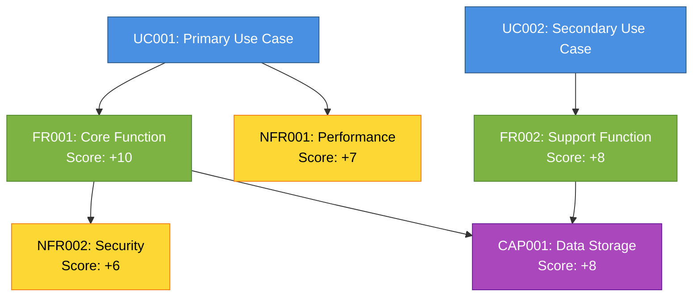
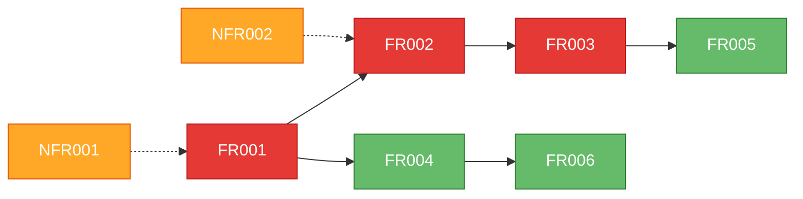
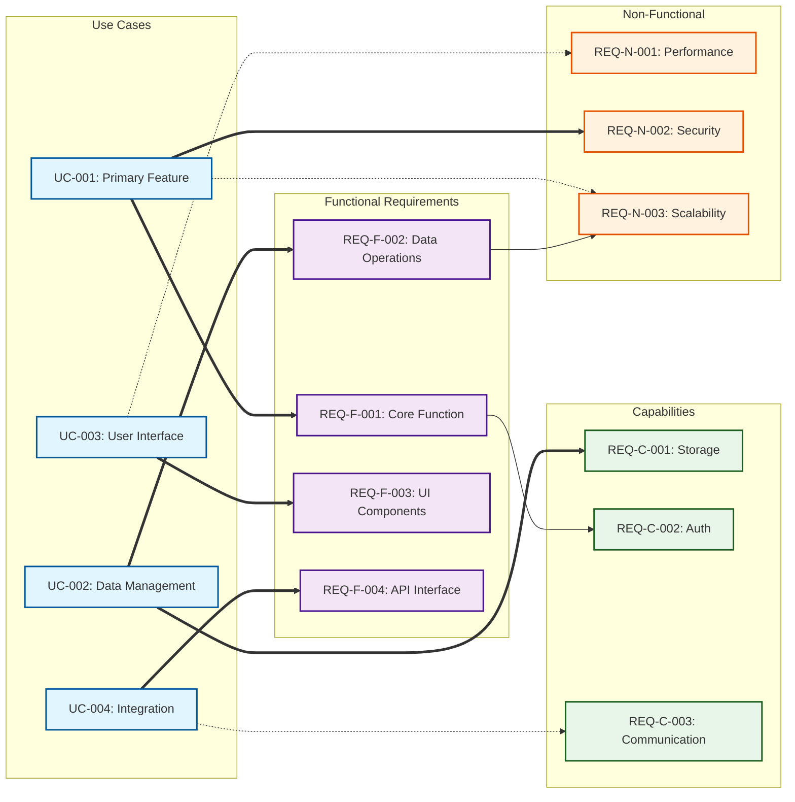

# Requirements Generator

## Iterative Discovery Engine Parameters

**Target Iterations**: Minimum 9 cycles, maximum 50 cycles
**Convergence Criteria**: Discovery rate < 10% for 2 consecutive iterations
**Quality Gates**: Each phase must achieve >85% completeness before proceeding
**Traceability**: Track requirement genealogy back to originating use cases and discovery methods

## Continuous Quality Gate System

**Apply at EVERY iteration, phase, and requirement generation**:

### The Quality Gate Questions (Ask for EACH requirement):
1. **Evidence Check**: Is there use case evidence or reasonable implication?
2. **Necessity Check**: Is this required for the system to work?
3. **Complexity Check**: Is this the simplest sufficient approach?
4. **Dependency Check**: What does this requirement transitively require?
5. **Lifecycle Check**: What install/setup/migration does this imply?

### Quality Gate Scoring (Apply Immediately):
- If Evidence Check fails → Score -5, mark "CONJECTURE"
- If Necessity Check fails → Score -3, mark "OPTIONAL"
- If Complexity Check fails → Score -2, mark "CONSIDER SIMPLER"
- If Dependencies excessive → Score -4, mark "HEAVYWEIGHT"
- If Lifecycle complex → Score -3, mark "OPERATIONAL BURDEN"

**Continuous Pruning**: Requirements scoring < 0 are immediately marked for review

## Architectural Minimalism Principle

**Default Architecture Bias**: Start with the simplest possible solution
**Escalation Path**: Only add complexity when use cases explicitly demand it

### Architecture Complexity Levels (Start at Level -1):
- **Level -1 - Pipeline/Stdout**: Command-line pipes, stdout/stdin, no persistence
- **Level 0 - Static/Memory**: In-memory only, no files needed
- **Level 1 - File-Based**: Local files (JSON, CSV, SQLite), single process
- **Level 2 - Stateless Script**: Standalone script/function, may read/write files
- **Level 3 - Serverless Function**: Cloud function, external state store
- **Level 4 - Single Server**: Persistent process, local state management
- **Level 5 - Multi-Service**: Multiple processes, queues, caches
- **Level 6 - Distributed System**: Clustering, replication, orchestration
- **Level 7 - Enterprise Platform**: HA, geo-distribution, complex infrastructure

**Golden Rule**: "As small as possible, but no smaller"
- Start at Level -1 (stdout), escalate ONLY when use cases require
- Prefer: stdout > memory > files > database > network > distributed

## Requirement Evidence Scoring System (Graduated Approach)

### Evidence-Based Scoring:
- **+10**: Explicitly stated in use case (direct quote available)
- **+9**: Necessarily implied for use case to function (logical requirement)
- **+8**: Strongly implied by use case context (would break without it)
- **+7**: Industry-standard expectation for this type of feature
- **+6**: Reasonably implied by use case context (standard expectation)
- **+5**: Common pattern for this use case type (industry norm)
- **+4**: Valuable extension that enhances use case value
- **+3**: Helpful addition that improves quality/maintainability
- **+2**: Nice-to-have that adds polish
- **+1**: Optional enhancement
- **0**: Neutral - neither required nor harmful
- **-1**: Marginal benefit, needs justification
- **-2**: Questionable addition without clear benefit
- **-3**: Adds complexity without strong justification
- **-4**: Likely over-engineering for stated needs
- **-5**: Contradicts simplicity principle
- **-6**: Enterprise feature for simple use case
- **-8**: Clear over-engineering
- **-10**: Pure gold-plating

### Reasonable Implication Examples:
- Use case mentions "users" → +6 for basic user identification
- Use case mentions "save data" → +6 for data validation
- Use case mentions "API" → +6 for error handling
- Use case mentions "deploy" → +6 for basic CI/CD setup
- Use case mentions "existing data" → +8 for migration path

### Complexity Adjustment (Not Penalty):
- **+2**: Simplest possible approach (stdout, stateless)
- **+1**: Simple approach (files, single process)
- **0**: Standard approach (database, server)
- **-1**: Complex approach (distributed, HA)
- **-2**: Over-complex without justification

### Final Score = Evidence + Complexity + Lifecycle Bonus

### Decision Thresholds:
- **Score ≥ 8**: REQUIRED - Core requirement
- **Score 6-7**: STRONGLY RECOMMENDED - Industry standard
- **Score 4-5**: RECOMMENDED - Should include
- **Score 2-3**: SUGGESTED - Consider including
- **Score 0-1**: OPTIONAL - May include if resources allow
- **Score -1 to -2**: QUESTIONABLE - Needs strong justification
- **Score < -2**: AVOID - Likely over-engineering

## Data Format Hierarchy (Prefer Simpler, Parseable)

### Preferred Formats (in order):
1. **JSONL (JSON Lines)**: Best for streaming, append-only logs, data pipelines
   - One JSON object per line
   - Git-friendly (line-based diffs)
   - Streamable and appendable
   
2. **Markdown**: Best for human-readable docs, reports, configurations
   - Self-documenting
   - Renderable without tools
   - Supports structured data in tables
   
3. **JSON**: Best for configuration, APIs, structured data exchange
   - Universal parsing support
   - Schema validation available
   - Human and machine readable

4. **Plain Text**: Best for logs, simple outputs
5. **CSV/TSV**: Best for tabular data
6. **YAML**: Acceptable for configuration (though JSON preferred)
7. **Binary**: Only when necessary for performance

## Phase 0: Input Rehydration

**INPUT ANALYSIS**:
Examine <prompt-arguments> to determine input type and extract use cases:

1. **Check for file path**:
   - IF <prompt-arguments> contains a path pattern (e.g., "./use-cases.md", "<worktree>/planning/use-cases.md", "docs/use-cases.md")
   - AND file exists at that path
   - AND file has .md extension
   - THEN read file content as use cases

2. **Direct content fallback**:
   - ELSE use <prompt-arguments> directly as use cases content

**REHYDRATION LOGIC**:
```
IF <prompt-arguments> matches file path pattern (contains "/" or "\" or ends with .md) THEN:
  IF file exists at path THEN:
    use_cases_content = read(path)
    IF use_cases_content contains "UC###:" or "UC[0-9]+:" patterns THEN:
      # This is properly formatted use cases
      use_cases = use_cases_content
    ELSE:
      # This might be requirements, try to extract use cases
      ERROR: Expected use cases file but found different format
      HINT: Ensure file contains UC### formatted use cases
  ELSE:
    ERROR: File not found at specified path: <prompt-arguments>
    HALT execution with helpful error message
ELSE:
  # Direct use cases in arguments
  use_cases = <prompt-arguments>
```

**OUTPUT**: Extracted use cases ready for analysis

---

## Phase 1: Use Case Analysis & Classification

**Parse the use cases** (extracted in Phase 0) and systematically analyze each one:

1. **Extract core functionality** described in each use case
   - **Example**: "Users need to upload files" → Core function: file upload capability
   - **Do**: Focus on the essential action being performed
   - **Don't**: Get distracted by implementation details mentioned in the use case

2. **Identify user personas** and their specific needs
   - **Example**: "Administrators need bulk user management" vs "End users need profile updates"
   - **Do**: Distinguish between different user types and their unique requirements
   - **Don't**: Assume all users have the same needs or permissions

3. **Classify use cases by domain**: 
   - **Examples**: UI/UX (user interactions), backend services (data processing), integrations (API connections), security (authentication), performance (speed/scale)
   - **Do**: Categorize broadly to understand system scope
   - **Don't**: Force use cases into rigid categories - some may span multiple domains

4. **Determine complexity levels**: 
   - **Simple**: Single component change (add field to form)
   - **Moderate**: Multiple components (new feature with database + UI + API)
   - **Complex**: System-wide changes (authentication overhaul)
   - **Do**: Assess impact scope realistically
   - **Don't**: Underestimate complexity of seemingly simple requests

5. **Map relationships** between use cases to identify dependencies and interaction points
   - **Example**: "User registration" must come before "user profile management"
   - **Do**: Look for logical sequences and prerequisite relationships
   - **Don't**: Treat use cases as completely independent when they're not

### ⚠️ Quality Gate Check - Phase 1:
- For each identified functionality: Is this actually in the use case text?
- For each persona: Are they explicitly mentioned or reasonably implied?
- For each classification: Does the evidence support this categorization?
- **Prune**: Remove any assumptions not grounded in evidence
- **Score**: Apply initial scoring to each finding

## Phase 2: Multi-Lens Use Case Discovery

**Apply systematic analytical lenses to uncover implicit use cases** (iterate until convergence):

### Lens 0: Minimal Architecture Analysis
**First Question**: Can this be solved with static files?
- Can requirements be met with HTML/CSS/JS only?
- Can data be stored in JSON/CSV files?
- Can updates be manual rather than dynamic?

**Escalation Triggers** (Check these BEFORE adding complexity):
- Multiple concurrent users mentioned → Consider Level 2+
- Real-time updates required → Consider Level 2+
- User authentication specified → Consider Level 2+
- Large data volumes stated → Consider Level 3+
- High availability mentioned → Consider Level 4+

**If no triggers present**: STOP at simplest level that works

### Lens 1: Actor Analysis
- **Primary Actors**: End users, administrators, system operators
- **Secondary Actors**: External systems, background processes, maintenance tools
- **Edge Case Actors**: Emergency responders, auditors, compliance checkers
- **Do**: Consider all possible interaction points with the system
- **Don't**: Focus only on primary user workflows

### Lens 2: Data Flow Analysis  
- **Data Sources**: Where does information originate (users, files, APIs, sensors)?
- **Transformations**: How is data processed, validated, enriched, aggregated?
- **Storage Points**: Temporary buffers, permanent storage, caches, logs
- **Output Destinations**: Reports, notifications, API responses, file exports
- **Do**: Trace complete data lifecycle from source to destination
- **Don't**: Assume data magically appears or disappears

### Lens 3: Temporal Analysis
- **System Lifecycle**: Installation, configuration, normal operation, maintenance, upgrades, decommissioning
- **Session Lifecycle**: Login, active use, idle time, session expiry, logout
- **Data Lifecycle**: Creation, modification, archival, deletion, backup/restore
- **Business Cycles**: Daily operations, weekly reports, monthly processing, annual audits
- **Do**: Consider time-based triggers and scheduled operations
- **Don't**: Focus only on immediate user-initiated actions

### Lens 4: Error Analysis
- **Input Errors**: Invalid data, missing fields, format violations
- **System Errors**: Network failures, database unavailability, resource exhaustion
- **Integration Errors**: External API failures, timeout conditions, authentication failures
- **Business Rule Violations**: Insufficient permissions, policy violations, constraint failures
- **Do**: Consider comprehensive error scenarios and recovery mechanisms
- **Don't**: Assume happy path scenarios only

### Lens 5: Integration Analysis
- **Upstream Dependencies**: Systems that provide data or services to this system
- **Downstream Consumers**: Systems that receive data or services from this system  
- **Synchronization Points**: Real-time updates, batch processing, event-driven communication
- **Protocol Requirements**: REST APIs, message queues, file transfers, database connections
- **Do**: Map complete integration ecosystem and data flow patterns
- **Don't**: Treat the system as isolated or self-contained

### Lens 6: Platform Analysis
- **Device Variations**: Desktop, mobile, tablet interfaces with different capabilities
- **Browser Differences**: Feature support, performance characteristics, security models
- **Network Conditions**: High-speed, mobile, offline, intermittent connectivity
- **Environment Differences**: Development, staging, production configurations
- **Do**: Design for platform diversity and graceful degradation
- **Don't**: Assume single target platform or optimal conditions

### Lens 7: Scale Analysis
- **User Scale**: Single user, small team, department, enterprise, public access
- **Data Volume**: Records, file sizes, concurrent operations, historical data
- **Geographic Distribution**: Local, regional, national, global deployments
- **Load Patterns**: Peak usage, seasonal variations, growth trajectories
- **Do**: Consider scalability requirements at multiple dimensions
- **Don't**: Design only for current scale without growth planning

### Lens 8: Compliance Analysis  
- **Data Protection**: GDPR, CCPA, HIPAA, industry-specific privacy requirements
- **Security Standards**: ISO 27001, SOC 2, PCI DSS, government regulations
- **Accessibility**: WCAG guidelines, ADA compliance, assistive technology support
- **Industry Standards**: Domain-specific regulations and best practices
- **Do**: Research applicable compliance requirements early in discovery
- **Don't**: Defer compliance considerations to implementation phase

### Lens 9: Lifecycle Analysis
- **Installation**: System setup, configuration, initial data migration
- **Operation**: Normal use patterns, maintenance tasks, monitoring
- **Evolution**: Updates, feature additions, configuration changes
- **Migration**: Data imports/exports, system transitions, legacy integrations
- **Decommissioning**: Data extraction, archival, secure deletion
- **Do**: Plan for complete system lifecycle management
- **Don't**: Focus only on steady-state operation

### Lens 10: Lifecycle & Operational Analysis

**Reasonably Implied Operational Needs**:

1. **Installation & Setup** (if use cases imply deployment):
   - How will the system be installed?
   - What configuration is needed?
   - Are there dependencies to check?
   - Score: +6 if deployment mentioned, +4 otherwise

2. **Data Migration** (if use cases mention existing data):
   - How to import existing data?
   - How to handle format differences?
   - How to validate migrated data?
   - Score: +8 if existing data mentioned, +2 otherwise

3. **CI/CD Pipeline** (if use cases imply ongoing development):
   - How to test changes?
   - How to deploy updates?
   - How to rollback if needed?
   - Score: +6 if updates mentioned, +3 otherwise

4. **Operational Monitoring** (if use cases imply production use):
   - How to know if it's working?
   - How to debug issues?
   - How to measure usage?
   - Score: +4 if production implied, +1 otherwise

5. **Backup & Recovery** (if use cases involve important data):
   - How to prevent data loss?
   - How to recover from failures?
   - Score: +6 if data importance implied, +2 otherwise

**Key**: These are REASONABLE implications, not conjecture

### ⚠️ Quality Gate Check - Phase 2:
- Is each lens discovery based on use case evidence?
- Score each discovered requirement immediately (use scoring system)
- If score < 0, mark as "QUESTIONABLE" and flag for review
- Track: How many discoveries per lens? Are we inventing or discovering?

**Convergence Check**: After applying all lenses, count newly discovered use cases. If discovery rate is <15% compared to previous iteration, proceed to Phase 3. Otherwise, apply lenses again with deeper analysis.

## Phase 3: Stated Requirements Conversion

**Transform each use case into explicit functional requirements**:

1. **Convert narrative descriptions** into precise "The system shall..." statements
   - **Example**: "Users want to search for products" → "The system shall provide a search interface that accepts text input and returns filtered product results"
   - **Do**: Use active, specific language with clear actors and actions
   - **Don't**: Leave requirements vague or ambiguous ("system should be user-friendly")

2. **Extract user interactions** and define expected system responses
   - **Example**: User clicks "Save" → System validates data → Shows success message OR error details
   - **Do**: Define complete interaction flows with all possible outcomes
   - **Don't**: Assume happy path only - include error scenarios

3. **Identify data inputs and outputs** with validation requirements
   - **Example**: Email field → Must validate format, check uniqueness, return specific error messages
   - **Do**: Specify validation rules, formats, and constraints explicitly
   - **Don't**: Assume standard validations without documenting them

4. **Define business rules** and logic constraints explicitly
   - **Example**: "Only account owners can delete accounts" → Authorization requirement
   - **Do**: Extract implicit business logic and make it explicit
   - **Don't**: Bury business rules within technical descriptions

5. **Specify error handling** and edge case behaviors
   - **Example**: Network timeout → Show retry option, save draft locally
   - **Do**: Consider what happens when things go wrong
   - **Don't**: Focus only on success scenarios

6. **Document integration touchpoints** with external systems
   - **Example**: "Send notification" → Requires email service integration with specific API calls
   - **Do**: Identify all external dependencies early
   - **Don't**: Assume integrations are trivial implementation details

### ⚠️ Quality Gate Check - Phase 3:
For each functional requirement derived:
- **Evidence Test**: Quote the exact use case text driving this requirement
- **Necessity Test**: Would the system fail without this requirement?
- **Complexity Test**: Is this the simplest way to meet the use case need?
- **Scope Test**: Are we adding features not requested in use cases?
- **Score**: Apply full scoring system (Evidence + Complexity)
- ⚠️ If score < 0: Mark as "ASSUMED - Needs Validation"

## Phase 4: Minimal Capability Assessment (NOT Technology Selection)

**Derive capability needs from functional requirements**:

### Capability Escalation Checklist:
1. **Storage Needs**:
   - Default: File-based storage (JSON, JSONL, CSV, SQLite)
   - Escalate to database ONLY if:
     - Use cases mention concurrent writes
     - Use cases specify complex queries
     - Use cases require transactions
   - Document: "UC-X requires [specific need], therefore database capability needed"

2. **Processing Needs**:
   - Default: Client-side or batch processing
   - Escalate to server ONLY if:
     - Use cases mention shared state
     - Use cases require server-side security
     - Use cases specify real-time processing
   - Document: "UC-Y requires [specific need], therefore server capability needed"

3. **Deployment Needs**:
   - Default: Static hosting or local execution
   - Escalate to cloud/server ONLY if:
     - Use cases mention availability requirements
     - Use cases specify remote access
     - Use cases require scheduled execution
   - Document: "UC-Z requires [specific need], therefore hosting capability needed"

⚠️ **Architecture Complexity Warning**:
If suggesting anything above Level 2, provide:
- Exact use case quote requiring this complexity
- Simpler alternative and why it's insufficient
- Cost/complexity trade-off analysis

**Technology Deferment Statement**:
"Specific technology choices are implementation decisions, not requirements,
unless explicitly specified in user-provided use cases"

## Phase 5: Full Dependency Tree Discovery

**For each identified capability requirement**:

### Primary Dependency Analysis:
If requirement needs "database capability" →
- Database server/service (or embedded like SQLite)
- Database drivers/clients  
- Connection management
- Migration tools
- Backup tools
- Monitoring approach

### Secondary Dependency Analysis:
For each primary dependency →
- What does IT require?
- Installation prerequisites
- Configuration requirements
- Version compatibility
- Operating system needs

### Dependency Requirement Generation:
For each dependency, generate requirements for:

1. **Installation Requirements**:
   - Dependency checking: "System shall verify [X] is installed OR offer to install"
   - Version checking: "System shall work with [X] version >= Y"
   - Auto-install option: "System MAY offer to install missing [X]"
   - Fallback behavior: "System shall gracefully handle missing optional [X]"

2. **Configuration Requirements**:
   - Connection strings (if needed)
   - Authentication setup (if needed)
   - Performance tuning (only if use cases demand)
   - Security hardening (proportional to sensitivity)

3. **Migration Requirements** (only if existing data mentioned):
   - From previous versions
   - From alternative technologies
   - Data format conversions (prefer JSONL for import/export)
   - Rollback procedures

4. **Uninstall Requirements**:
   - Clean removal procedures
   - Data preservation options
   - Dependency cleanup
   - Configuration removal

### Example Dependency Tree:
Use Case: "Store user data" →
- Level 1: Data persistence capability required
  - Option A: File-based (JSON/JSONL) - Simplest
    - Level 2: File system access
    - Level 2: JSON parser (usually built-in)
  - Option B: SQLite - Medium complexity
    - Level 2: SQLite library
    - Level 2: SQL query builder (optional)
  - Option C: PostgreSQL - Higher complexity
    - Level 2: PostgreSQL server
    - Level 2: pg client library
    - Level 2: Connection pooling
    - Level 2: Migration tool

### ⚠️ Quality Gate for Dependencies:
- Is each dependency justified by use case needs or industry standards?
- Can we use embedded/bundled versions to reduce external dependencies?
- Can we make dependencies optional or provide fallbacks?
- Score: -1 per dependency level beyond minimal necessary
- Justification allowed for commonly accepted dependencies
- If total dependency score < -3: Mark as "CONSIDER SIMPLER APPROACH"
- If dependency score -3 to 0: Document trade-offs and benefits

## Phase 6: Iterative Non-Functional Requirements (NFR) Derivation Engine

**Execute systematic NFR discovery cycles** (minimum 9 cycles, maximum 50):

### NFR Cycle 1: Core Performance Requirements

### ⚠️ Proportional NFR Discovery:
- **Explicit mention** (e.g., "fast", "performance", "speed") → Full performance suite (+8 to +10)
- **Implicit need** (e.g., "interactive", "real-time", "responsive") → Core performance NFRs (+6 to +8)
- **Domain expectation** (e.g., web app, API, CLI tool) → Standard performance NFRs (+4 to +6)
- **No mention** → Minimal baseline performance NFRs (+2 to +4)
- Never skip categories entirely - adjust depth and scoring instead

**Derive performance NFRs from functional requirements**:
- **Response Time**: Maximum acceptable delays for user interactions
- **Throughput**: Transactions, requests, or operations per second/minute/hour
- **Resource Usage**: CPU, memory, disk, network bandwidth consumption limits
- **Concurrent Users**: Maximum simultaneous user capacity
- **Data Processing**: Batch job completion times, real-time processing latencies
- **Example**: 
  - ❌ BAD: "File uploads shall complete within 30 seconds for files up to 100MB" (arbitrary limits)
  - ✅ GOOD: "IF use case mentions file size, derive reasonable time expectations"
- **Cross-Reference**: Link each NFR back to specific functional requirements

### ⚠️ Quality Gate Check:
- Evidence Check: Is this performance need mentioned, implied, or industry-standard?
- Foundation Check: Can we justify specific thresholds with evidence or best practices?
- Complexity Check: Is the requirement proportional to the system's needs?
- Score: Apply graduated scoring system (-10 to +10)
- If score < -2: Mark as "REVIEW NEEDED" with explanation
- If score -2 to 0: Mark as "CONDITIONAL" with justification required

### NFR Cycle 2: Scalability & Growth Requirements  
**Analyze functional requirements for scalability implications**:
- **Horizontal Scaling**: Multi-server deployment, load distribution patterns
- **Vertical Scaling**: Resource upgrade paths, hardware limitations
- **Data Growth**: Storage expansion, archival strategies, partitioning needs
- **User Growth**: Capacity planning, performance degradation thresholds
- **Geographic Scaling**: Multi-region deployment, content delivery networks
- **Example**: "User management system" → "System shall support 10x user growth (10K to 100K users) without architectural changes"
- **Dependency Analysis**: How scaling affects previously identified performance NFRs

### NFR Cycle 3: Security & Privacy Requirements

### ⚠️ Proportional NFR Discovery:
- **Explicit mention** (e.g., "secure", "authentication", "privacy") → Full security suite (+8 to +10)
- **User data handling** (e.g., "users", "profiles", "accounts") → Standard security NFRs (+6 to +8)
- **External exposure** (e.g., "API", "web", "public") → Basic security NFRs (+4 to +6)
- **Internal only** → Minimal security baseline (+2 to +4)
- Derive proportional security measures based on actual risk level

**Extract security NFRs from functional and data requirements**:
- **Authentication**: Multi-factor, SSO, session management, password policies
- **Authorization**: Role-based access, permissions, privilege escalation protection
- **Data Protection**: Encryption at rest/transit, PII handling, data masking
- **Audit Trails**: Security event logging, compliance reporting, forensic capabilities
- **Threat Protection**: Input validation, SQL injection, XSS, CSRF protection
- **Example**: 
  - ❌ BAD: "Profile data shall be encrypted using AES-256" (over-specifying algorithm)
  - ✅ GOOD: "Profile data shall be appropriately protected based on sensitivity"
- **Security Model**: Proportional to actual risks, not hypothetical threats

### ⚠️ Quality Gate Check:
- Is security complexity proportional to data sensitivity and exposure?
- Are security measures aligned with actual threats?
- Score: Apply graduated scoring based on risk level
- If score < -2: Mark as "EXCESSIVE SECURITY" with explanation
- If score -2 to 2: Mark as "BASELINE SECURITY" - include with minimal implementation

### NFR Cycle 4: Reliability & Availability Requirements
**Derive reliability NFRs from business criticality analysis**:
- **Uptime Targets**: SLA commitments, planned vs unplanned downtime
- **Fault Tolerance**: Component failure handling, graceful degradation
- **Disaster Recovery**: Backup strategies, recovery time/point objectives
- **Health Monitoring**: System health checks, alerting, automated recovery
- **Data Integrity**: Consistency guarantees, corruption detection, repair mechanisms
- **Example**: "Payment processing" → "Payment system shall maintain 99.9% uptime with <4 hours recovery time"
- **Impact Analysis**: How reliability requirements affect performance and scalability

### NFR Cycle 5: Usability & Accessibility Requirements
**Extract user experience NFRs from interface and interaction requirements**:
- **Accessibility Standards**: WCAG 2.1 AA compliance, screen reader support, keyboard navigation
- **User Experience**: Task completion times, error rates, user satisfaction metrics
- **Interface Design**: Responsive design, mobile optimization, cross-browser compatibility
- **Localization**: Multi-language support, cultural adaptations, timezone handling
- **Help & Support**: Documentation, in-app guidance, error messaging clarity
- **Example**: "Search function" → "Search results shall appear within 2 seconds with clear relevance ranking"
- **User Impact**: How usability interacts with performance and reliability requirements

### NFR Cycle 6: Maintainability & Supportability Requirements
**Derive maintenance NFRs from system complexity and lifecycle needs**:
- **Code Quality**: Static analysis standards, complexity metrics, documentation coverage
- **Debugging Support**: Logging levels, diagnostic tools, performance profiling
- **Update Mechanisms**: Deployment automation, rollback capabilities, zero-downtime updates
- **Configuration Management**: Environment separation, feature toggles, A/B testing
- **Monitoring & Observability**: Application metrics, business KPIs, alert management
- **Example**: "Data processing pipeline" → "All processing steps shall log execution times and error details for troubleshooting"
- **Operational Impact**: How maintainability affects reliability and performance

### NFR Cycle 7: Compliance & Legal Requirements
**Identify regulatory NFRs from data handling and business operations**:
- **Data Protection Laws**: GDPR, CCPA, HIPAA data handling requirements
- **Industry Standards**: PCI DSS, SOX, ISO certifications, sector-specific regulations
- **Accessibility Laws**: ADA compliance, regional accessibility standards
- **Audit Requirements**: Record keeping, reporting capabilities, evidence preservation
- **International Compliance**: Cross-border data transfer, local regulation compliance
- **Example**: "User data collection" → "System shall provide GDPR-compliant data export and deletion within 30 days"
- **Compliance Stack**: How compliance requirements layer on security and privacy

### NFR Cycle 8: Operational & DevOps Requirements
**Extract operational NFRs from deployment and management needs**:
- **Deployment Automation**: CI/CD pipeline requirements, automated testing gates
- **Environment Management**: Development, staging, production isolation and promotion
- **Backup & Recovery**: Automated backup schedules, restoration procedures, data validation
- **Capacity Planning**: Resource monitoring, auto-scaling triggers, capacity alerts
- **Incident Management**: Error tracking, escalation procedures, post-mortem processes
- **Example**: "Database operations" → "Database backups shall run nightly with 4-week retention and 15-minute restoration capability"
- **Operational Stack**: How DevOps requirements support reliability and maintainability

### NFR Cycle 9: Integration & Interoperability Requirements
**Derive integration NFRs from external system interactions**:
- **API Compatibility**: Versioning strategies, backward compatibility, deprecation policies  
- **Data Exchange**: Format standards, transformation requirements, validation rules
- **Protocol Support**: REST, GraphQL, message queues, real-time communication
- **Service Dependencies**: External service SLAs, fallback strategies, circuit breakers
- **Standards Compliance**: Industry data formats, communication protocols, integration patterns
- **Example**: "Third-party payment integration" → "Payment API shall support retry logic with exponential backoff for network failures"
- **Integration Impact**: How external dependencies affect internal performance and reliability

### NFR Cycle 10: Business Continuity & Risk Requirements  
**Identify business continuity NFRs from risk analysis**:
- **Business Impact Analysis**: Critical functions, maximum tolerable downtime, recovery priorities
- **Risk Mitigation**: Single points of failure, redundancy requirements, failover procedures  
- **Data Loss Prevention**: Backup frequency, replication strategies, consistency guarantees
- **Emergency Procedures**: Manual overrides, emergency contacts, escalation procedures
- **Insurance & Compliance**: Risk coverage, regulatory reporting, audit trail preservation
- **Example**: "Order processing system" → "Order data shall be replicated across 3 geographic regions with <1 hour synchronization"
- **Business Alignment**: How technical NFRs map to business risk tolerance

### NFR Cycle 11: Cross-Cutting & Emergent Requirements
**Analyze interactions between previous NFR cycles to discover emergent requirements**:
- **Performance vs Security Trade-offs**: Encryption overhead, authentication delays
- **Scalability vs Compliance Conflicts**: Data residency vs geographic scaling
- **Reliability vs Maintainability Balance**: Complexity of high-availability vs operational simplicity  
- **Cost vs Performance Optimization**: Resource usage vs response time requirements
- **Usability vs Security Tensions**: Convenience vs security controls
- **Example**: "Real-time chat + GDPR compliance" → "Chat messages shall be encrypted end-to-end while supporting right-to-deletion within 24 hours"
- **Conflict Resolution**: Document trade-offs and decisions for stakeholder approval

### NFR Cycle 12+: Adaptive Discovery & Validation
**Continue iterating until convergence criteria are met**:
- **Gap Analysis**: Compare derived NFRs against industry benchmarks and best practices
- **Stakeholder Validation**: Verify NFRs align with business expectations and constraints  
- **Feasibility Assessment**: Ensure technical achievability within budget and timeline constraints
- **Priority Refinement**: Rank NFRs by business impact, technical risk, and implementation effort
- **Dependency Mapping**: Create detailed dependency matrix between functional and non-functional requirements
- **Convergence Check**: If <10% new NFRs discovered in this cycle compared to previous, proceed to Phase 5
- **Quality Gate**: Ensure >85% of functional requirements have derived NFRs before proceeding

**NFR Iteration Control**:
- Track discovery rate: (New NFRs in cycle / Total NFRs before cycle) × 100%
- Continue cycles until discovery rate <5% for 3 consecutive cycles (enhanced coverage)
- Minimum 15 cycles to ensure thorough discovery (up from 9)
- Maximum 50 total NFR cycles to prevent infinite iteration
- Document rationale for each NFR linking back to originating functional requirements
- Target: 100% of functional requirements have at least 3 relevant NFRs

## Phase 6.5: Industry Baseline NFRs

**Automatically include domain-appropriate baseline NFRs** that represent industry standards and reasonable expectations:

### Domain-Specific Baseline NFRs

**For Web Applications:**
- **Security headers** (Content-Security-Policy, X-Frame-Options) → Score +6
- **Input validation** on all user inputs → Score +7
- **XSS and injection protection** → Score +7
- **Error handling** without exposing internals → Score +7
- **Basic request/response logging** → Score +6
- **Graceful degradation** for browser compatibility → Score +5
- **Session management** if users mentioned → Score +6

**For CLI Tools:**
- **--help documentation** → Score +7
- **Meaningful error messages** with actionable advice → Score +7
- **Proper exit codes** (0 for success, non-zero for errors) → Score +6
- **Signal handling** (SIGINT, SIGTERM) → Score +5
- **Progress indicators** for long operations → Score +5
- **Verbose/quiet modes** → Score +4
- **Config file support** if configuration mentioned → Score +5

**For APIs:**
- **HTTP status codes** properly used → Score +7
- **Structured error responses** → Score +7
- **Request validation** → Score +7
- **Rate limiting** for public APIs → Score +5
- **API versioning** strategy → Score +5
- **CORS handling** for web clients → Score +6
- **Request ID tracking** → Score +4

**For Data Processing:**
- **Data validation** before processing → Score +8
- **Error recovery** and retry logic → Score +6
- **Progress reporting** for batch operations → Score +5
- **Idempotency** for rerunnable operations → Score +6
- **Audit trail** of processing steps → Score +5
- **Data integrity checks** → Score +7

**For File-Based Systems:**
- **Atomic writes** to prevent corruption → Score +7
- **Backup before destructive operations** → Score +6
- **File locking** for concurrent access → Score +5
- **Temporary file cleanup** → Score +6
- **Path validation** and sanitization → Score +7

### NFR Expansion Triggers

**Automatic NFR expansion based on implicit mentions:**

- **Mentions "users"** → Expand:
  - Authentication NFRs (+6)
  - Authorization NFRs (+6)
  - Session management (+5)
  - User data protection (+7)
  
- **Mentions "data" or "database"** → Expand:
  - Data validation NFRs (+8)
  - Backup/recovery NFRs (+6)
  - Data integrity NFRs (+7)
  - Migration support (+5)
  
- **Mentions "API" or "service"** → Expand:
  - Error handling NFRs (+7)
  - Versioning NFRs (+5)
  - Documentation NFRs (+6)
  - Rate limiting (+5)
  
- **Mentions "production" or "deploy"** → Expand:
  - Monitoring NFRs (+6)
  - Logging NFRs (+7)
  - Health checks (+6)
  - Configuration management (+5)
  
- **Mentions "team" or "collaboration"** → Expand:
  - Code documentation (+6)
  - Testing requirements (+7)
  - Version control practices (+6)
  - Development environment setup (+5)
  
- **Mentions "scale" or "growth"** → Expand:
  - Performance optimization (+6)
  - Caching strategy (+5)
  - Resource limits (+6)
  - Capacity planning (+5)
  
- **Has external dependencies** → Expand:
  - Dependency management (+6)
  - Version compatibility (+5)
  - Fallback mechanisms (+5)
  - Integration testing (+6)
  
- **Has persistence** → Expand:
  - Backup strategy (+7)
  - Migration paths (+6)
  - Data consistency (+7)
  - Recovery procedures (+6)

### Baseline NFR Application Rules

1. **Always include** minimal baseline NFRs even without explicit mention
2. **Score adjustment** based on domain and context
3. **Never skip** entire categories - include with appropriate scoring
4. **Document rationale** for baseline NFR inclusion
5. **Allow override** if use case explicitly states otherwise

## Phase 7: Hidden Requirements Discovery

**Uncover implicit and undeclared requirements** by systematically checking these common areas:

### ⚠️ Quality Gate for Hidden Requirements:
Each "hidden" requirement must pass:
1. **Logical Necessity**: Is this required or reasonably expected for stated use cases?
2. **Industry Standard**: Is this a common expectation for this type of system?
3. **Minimal Approach**: Is this the simplest way to enable use cases?
4. **Score**: Apply graduated scoring system
5. **If score < -2**: Mark as "QUESTIONABLE ADDITION" with explanation
6. **If score -2 to 2**: Mark as "CONSIDER INCLUDING" with rationale

1. **Audit trail requirements**: Who changed what, when, and why tracking
   - **Example**: User profile changes → Need change history, rollback capability
   - **Do**: Consider regulatory and compliance needs for data tracking
   - **Don't**: Add audit trails everywhere - focus on sensitive data and operations

2. **Data migration needs**: Existing data transformation and preservation
   - **Example**: New user table structure → Need migration scripts for existing users
   - **Do**: Plan for data transformation and backup strategies
   - **Don't**: Assume fresh start - consider existing data impact

3. **Backward compatibility**: Legacy system integration and API versioning
   - **Example**: API changes → Need versioning strategy to avoid breaking existing clients
   - **Do**: Plan deprecation timelines and migration paths
   - **Don't**: Break existing functionality without transition planning

4. **Internationalization**: Multi-language support, timezone handling, currency formatting
   - **Example**: Global user base → Need locale-specific formatting and translations
   - **Do**: Consider cultural and regional differences early
   - **Don't**: Assume English-only or single timezone usage

5. **Mobile responsiveness**: Touch interfaces, offline capabilities, app store requirements
   - **Example**: File upload feature → Need mobile-friendly interface and offline queuing
   - **Do**: Design for multiple device types and connection states
   - **Don't**: Treat mobile as afterthought or simple responsive CSS

6. **Administrative functions**: User management, system configuration, bulk operations
   - **Example**: User registration system → Need admin tools for user management, bulk imports
   - **Do**: Consider operational needs for managing the system at scale
   - **Don't**: Focus only on end-user features - admins need tools too

7. **Reporting and analytics**: Business intelligence, usage metrics, compliance reporting
   - **Example**: E-commerce system → Need sales reports, inventory tracking, tax reporting
   - **Do**: Identify business intelligence needs early
   - **Don't**: Build reporting as pure afterthought - design for data collection

8. **Integration hooks**: Webhook support, event publishing, third-party connectors
   - **Example**: User actions → May need to trigger external systems or notifications
   - **Do**: Design for extensibility and integration from the start
   - **Don't**: Build isolated systems - consider ecosystem integration needs

9. **Development and testing**: Mock services, test data generation, staging environments
   - **Example**: Payment processing → Need test modes, mock services, staging environment
   - **Do**: Plan development infrastructure as part of requirements
   - **Don't**: Assume development needs will be handled separately

## Phase 8: Documentation Requirements

### Assess Documentation Needs:

**README.md** - Generate requirement if:
- Multiple installation steps (+6 score)
- Configuration options exist (+6 score)  
- API/CLI interface present (+8 score)
- Team development implied (+6 score)
- Open source mentioned (+10 score)

**Minimal README Template Requirement**:
```markdown
# Project Name
## Installation
[Generated from install requirements]

## Usage  
[Generated from functional requirements]

## Configuration
[Generated from config requirements]

## Dependencies
[Generated from dependency tree]
```

**Additional Documentation** - Consider if:
- API documentation (if external interface)
- Migration guide (if replacing system)
- Configuration reference (if many options)
- Troubleshooting guide (if complex setup)

### Documentation Scoring:
- Explicitly requested: +10
- Multi-user system: +6  
- Complex installation: +6
- Public/open source: +8
- No indication needed: 0
- Over-documentation: -3

### ⚠️ Quality Gate:
- Is documentation necessary for users to succeed?
- What's the minimal sufficient documentation?
- Can we generate docs from code/config?

## Phase 9: Lifecycle Requirements

### Installation Requirements Pattern:

**Deliberate Dependency Checking**:
```bash
# Requirement: Installation shall verify all dependencies
1. Check runtime (Node.js, Python, etc.)
   - Version compatibility
   - Required modules/packages
   
2. Check system tools
   - Required: List only essential tools
   - Optional: List enhanced-feature tools
   
3. Check data stores
   - Embedded options first (SQLite)
   - External only if required
   
4. Provide clear feedback:
   ✅ PostgreSQL 14+ found (optional)
   ⚠️ Redis optional - enhanced caching available
   ❌ Node.js 18+ required - please install
```

### Installation Script Requirements:
- Check before install
- Offer to install missing dependencies
- Allow --skip-optional flag
- Provide --check-only mode
- Support unattended install
- Generate install report (JSONL format)

### Setup & Configuration (if customization implied):
- Configuration file format (prefer JSON)
- Environment variables as override
- Sensible defaults that work out-of-box
- Configuration validation on startup
- **Score**: +6 if reasonable, -3 if complex

### Data Migration (if existing data mentioned):
- Import formats (prefer JSONL, CSV)
- Data validation rules
- Incremental migration support
- Rollback capability
- Progress reporting (stdout)
- **Score**: +8 if necessary, -5 if over-built

### CI/CD Pipeline (if team development implied):
- Test automation requirements
- Build process definition
- Deployment scripts (if needed)
- Rollback procedure
- **Score**: +6 if reasonable, -8 if excessive

### ⚠️ Quality Gate:
- Are lifecycle requirements proportional to project complexity?
- Can installation be simpler?
- Is CI/CD actually needed or premature?

## Phase 10: Consolidation & Deduplication

**Organize and refine the complete requirements set**:

1. **Group related requirements** into logical modules and components
2. **Eliminate duplicate requirements** across different phases
3. **Resolve conflicting requirements** through priority analysis
4. **Standardize requirement language** and formatting consistency
5. **Assign unique identifiers** to each requirement for traceability
6. **Establish requirement priorities**: must-have, should-have, nice-to-have
7. **Create requirement traceability matrix** linking back to original use cases

## Phase 11: Requirement Necessity Validation & Pruning

### Scoring Process:
Review EVERY requirement against quality gates:

1. **Evidence Scoring** (Use scoring system):
   - Explicit in use case: +10 points
   - Strongly implied: +6-8 points
   - Weakly implied: +2-4 points
   - Pure conjecture: -5 to -10 points
   
2. **Complexity Scoring**:
   - Essential complexity: Keep
   - Accidental complexity: -2 to -5 points
   - Nice-to-have complexity: -1 to -3 points

3. **Dependency Cost**:
   - Each unnecessary dependency level: -2 points
   - Each required external service: -1 point
   - Each optional enhancement: 0 points

4. **Final Decision**:
   - Score ≥ 8: Include as REQUIRED
   - Score 5-7: Include as RECOMMENDED
   - Score 2-4: Include as SUGGESTED
   - Score 0-1: Mark as OPTIONAL
   - Score < 0: REMOVE or mark as "NOT RECOMMENDED"

### Continuous Quality Monitoring:

**Tracking Metrics Throughout**:
- **Conjecture Count**: Requirements with no use case evidence
- **Complexity Creep**: Requirements adding unnecessary dependencies  
- **Dependency Depth**: Maximum levels of transitive dependencies
- **Score Distribution**: How many requirements at each score level

**Warning Thresholds**:
- >20% requirements scoring <0 → Stop and review
- >5 dependency levels → Simplification needed
- >30% conjecture → Return to use cases
- Complexity > Value → Architectural review

### Iteration Health Report:
```markdown
## Iteration Health Report
- Requirements Generated: [X]
- Evidence-Based (≥8): [Y] ([Y/X]%)
- Recommended (5-7): [Z] ([Z/X]%)
- Questionable (<0): [W] ([W/X]%)  
- Average Score: [score]
- Max Dependency Depth: [levels]
- Architecture Level: [0-7]
- Recommendation: [Continue/Review/Simplify]
```

### Generate Traceability Visualizations

#### Mermaid Requirement Traceability Diagram
Generate a comprehensive diagram showing use case to requirement mappings:



#### Traceability Matrix Table
Generate a comprehensive mapping table:

| Use Case | Functional Requirements | Non-Functional Requirements | Capability Requirements | Priority |
|----------|------------------------|----------------------------|------------------------|----------|
| UC001    | FR001, FR003, FR005    | NFR001, NFR004            | CAP001                | P1       |
| UC002    | FR002, FR004           | NFR002, NFR003            | CAP001, CAP002        | P1       |
| UC003    | FR006                  | NFR005                    | CAP003                | P2       |

#### Requirement Dependencies Graph
Show which requirements depend on others:



## Phase 12: Final Validation & Quality Assurance

**Ensure completeness and consistency of requirements**:

1. **Validate mapping** - Confirm every use case maps to specific requirements
2. **Check completeness** - Verify no functional gaps or missing user journeys
3. **Assess feasibility** - Ensure requirements are technically achievable within constraints
4. **Review dependencies** - Confirm all prerequisite requirements are identified
5. **Validate NFR alignment** - Ensure non-functional requirements support functional goals
6. **Test scenario coverage** - Verify requirements enable comprehensive testing strategies
7. **Stakeholder review readiness** - Confirm requirements are clear and unambiguous

## Phase 13: LLM-Optimized Implementation Specification Output

**Generate structured markdown specifications optimized for LLM feature-developer consumption**:

### Output Format Structure

#### 1. Executive Summary for LLM Feature Developer
```markdown
# Requirements Specification: [Module Name]

## Implementation Context for AI Agent
**Total Requirements**: [X] Functional, [Y] Non-Functional, [Z] Capability, [W] Technical
**Requirements by Priority**: [A] Must-Have (≥8), [B] Should-Have (6-7), [C] Could-Have (4-5), [D] Won't-Have-Now (<4)
**Minimal Architecture Level**: Level [0-7] - [Justification from use cases]
**Recommended Tech Stack**: [Inferred from architectural level and requirements]
**Development Timeline**: [X] days for MVP, [Y] days for full feature set
**Key Integration Points**: [External systems, APIs, databases that must be connected]

## Critical Path for Implementation (Must Do First)
1. **REQ-T-001** → **REQ-T-002** → **REQ-F-001** → **REQ-F-003** (Foundation critical path)
2. **Parallel Track**: REQ-F-002, REQ-F-004 (Can be developed simultaneously)
3. **Final Integration**: REQ-I-001, REQ-N-001 (Requires foundation completion)

## LLM Implementation Guidance
**Start Here**: Begin with REQ-T-001 [specify exact requirement]
**Testing Strategy**: Write tests for each requirement's acceptance criteria
**Architecture Decisions**: Defer technology choices to implementation unless specified in capabilities
**Error Handling**: Include error cases for each functional requirement  
**Validation Points**: Test each requirement before proceeding to dependent ones

## Risk & Complexity Assessment
- 🔴 **High Risk** (needs careful attention): [List specific requirements with complex dependencies]
- 🟡 **Medium Risk** (may need clarification): [List requirements with assumptions]  
- 🟢 **Low Risk** (standard patterns): [List straightforward implementation requirements]

**Complexity Indicators**:
- **Integration Heavy**: [X] requirements need external connections
- **Performance Sensitive**: [Y] requirements have specific timing constraints  
- **Security Critical**: [Z] requirements handle sensitive data or access
- **User Interface**: [W] requirements involve user interaction

## Quick Reference for AI Agent
**When Stuck**: Check use case traceability for context and original intent
**For Testing**: Each requirement has specific acceptance criteria to validate
**For Architecture**: Refer to capability requirements for technology guidance
**For Dependencies**: Check "Depends On" and "Blocks" fields in each requirement
```

#### 2. Structured Requirement Specifications
```markdown
## Functional Requirements

### REQ-F-001: [Specific Action] Capability  
**Statement**: The system shall [specific action] [specific object] [specific conditions]

**Source Use Cases**: 
- UC-001: "[Direct quote from use case]" (Primary - Score: +10)
- UC-003: "[Related quote if applicable]" (Secondary - Score: +6)
- UC-007: "[Implied need if applicable]" (Implied - Score: +4)

**Discovery Path**: Phase [X] → Lens [Y] → Requirement Generation
**Evidence Score**: [+10 to -10] - Based on strongest use case link
**Final Score**: [Total] - Classification: REQUIRED|RECOMMENDED|OPTIONAL
**Minimal Architecture**: Level [0-7] sufficient

**Implementation Guidance**:
- **Simplest Approach**: [Stdout/file/memory solution if possible]
- **Primary Flow**: [Step-by-step process description]
- **Error Handling**: [Proportional to actual risks]  
- **Input**: [Format preference: CLI args > env vars > files]
- **Output**: [Format preference: stdout > JSONL > files]
- **Business Rules**: [Only if explicitly in use cases]

**Acceptance Criteria**:
- [ ] Given [condition], when [action], then [expected result]
- [ ] Given [error condition], when [action], then [error response]
- [ ] Performance: [Specific measurable criteria]

**Dependencies**: 
- **Depends On**: REQ-T-[X] (must be implemented first), REQ-N-[Y] (performance constraint)
- **Blocks**: REQ-F-[Z] (cannot start until this is complete)
- **Related To**: REQ-F-[W] (shares components but not dependent)

**Implementation Priority**: P[1-3] - [Critical Path | Parallel | Optional]
**Estimated Complexity**: [Trivial: <4hrs | Simple: 1day | Moderate: 2-3days | Complex: >3days]
**Testing Strategy**: [Unit tests | Integration tests | E2E tests | Manual validation]
**Implementation Files**: [Suggested file/module locations]
```

```markdown
## Non-Functional Requirements

### REQ-N-001: [Performance/Quality Attribute] Specification
**Statement**: [Specific measurable requirement with thresholds]  
**Derived From**: REQ-F-[X] via Phase 4 NFR Cycle [Y]  
**Category**: Performance | Scalability | Security | Reliability | Usability | Maintainability | Compliance

**Metrics & Thresholds**:
- **Target**: [Specific measurable goal]
- **Minimum Acceptable**: [Minimum threshold]  
- **Measurement Method**: [How to measure compliance]
- **Monitoring Strategy**: [Ongoing measurement approach]

**Implementation Requirements**:
- **Technical Approach**: [Specific implementation strategy]
- **Tools/Libraries**: [Required components for achieving NFR]
- **Configuration**: [Settings, parameters, environment variables]
- **Validation Method**: [How to test NFR compliance]

**Trade-offs & Conflicts**:
- **Conflicts With**: REQ-N-[X] - [Specific conflict description]
- **Resolution**: [Chosen approach and rationale]
- **Monitoring**: [How to track trade-off impacts]
```

```markdown
## Capability Requirements (NOT Technology Prescriptions)

### REQ-C-001: [Capability Type] Specification
**Capability**: [Data Persistence|Communication|Processing|Interface]
**Minimal Solution**: [Simplest approach that works]
**Escalation If Needed**: [When/why to use more complex approach]

**Capability Justification**:
- **Use Case Evidence**: [Quote requiring this capability]
- **Requirements Satisfied**: REQ-F-[X], REQ-N-[Y]  
- **Score**: [Evidence + Complexity scores]

**Technology Options** (Implementation Choices, Not Requirements):
- **Simplest**: [e.g., JSON files, stdout, SQLite]
- **Standard**: [e.g., PostgreSQL, REST API, React]
- **Complex**: [e.g., Distributed DB, GraphQL, Microservices]
- **Decision Deferred To**: Implementation phase

**Dependency Impact**:
- **Minimal Option Dependencies**: [List]
- **Standard Option Dependencies**: [List]
- **Complex Option Dependencies**: [List]

**Success Criteria**:
- [ ] [Functional integration test]
- [ ] [Performance benchmark met]
- [ ] [Security validation passed]
```

#### 3. LLM Implementation Tables
```markdown
## LLM Quick Reference Tables

### Requirements by Implementation Priority
| Priority | Requirement ID | Type | Description | Dependencies | Effort |
|----------|---------------|------|-------------|--------------|--------|
| 1        | REQ-T-001     | Tech | Database Setup | None | 2 days |
| 2        | REQ-F-001     | Func | User Authentication | REQ-T-001 | 3 days |
| 3        | REQ-N-001     | NFR  | Response Time <200ms | REQ-F-001 | 1 day |

### Dependency Matrix
| Requirement | Depends On | Blocks | Critical Path |
|-------------|------------|--------|---------------|  
| REQ-F-001   | REQ-T-001  | REQ-F-002, REQ-N-001 | Yes |
| REQ-F-002   | REQ-F-001  | REQ-F-003 | No |

### Testing Strategy Matrix
| Requirement Type | Test Approach | Tools | Coverage Target |
|------------------|---------------|-------|-----------------|
| Functional       | Unit + Integration | Jest, Supertest | 95% |
| Performance      | Load Testing | k6, Artillery | All NFRs |
| Security         | SAST + DAST | SonarQube, OWASP ZAP | 100% |

### Architecture Components Map
| Component | Requirements Satisfied | Technology Choice | Implementation Notes |
|-----------|----------------------|------------------|---------------------|
| Database  | REQ-T-001, REQ-F-001-003 | PostgreSQL 14+ | User data, transactions |
| API Layer | REQ-F-001-008 | Express.js + TypeScript | REST with validation |
| Frontend  | REQ-F-001-005, REQ-N-001-003 | React + TypeScript | Responsive, accessible |
```

#### 4. Implementation Execution Guide
```markdown
## LLM Implementation Execution Guide

### Phase 1: Foundation Setup (Days 1-2)
**Objective**: Establish technical infrastructure
**Requirements**: REQ-T-001 through REQ-T-003
**Success Criteria**: Database connected, basic API responding, build pipeline working

**Implementation Steps**:
1. **Database Setup** (REQ-T-001)
   - Install PostgreSQL 14+  
   - Create schema per REQ-F-001 data requirements
   - Set up connection pooling for REQ-N-002 performance
   - Test: Connection successful, basic CRUD operations

2. **API Framework** (REQ-T-002)
   - Initialize Express.js project with TypeScript
   - Configure middleware per REQ-N-003 security requirements
   - Set up logging per REQ-N-005 observability
   - Test: Health endpoint returns 200, request logging works

### Phase 2: Core Feature Implementation (Days 3-5)
**Objective**: Implement primary functional requirements  
**Requirements**: REQ-F-001 through REQ-F-005
**Success Criteria**: All functional requirements passing integration tests

**Implementation Steps per Requirement**:
1. **REQ-F-001 Implementation**
   - Create [specific files/modules]
   - Implement [specific functions/methods]  
   - Add [specific validation rules]
   - Test: [specific test scenarios]
   - **Acceptance Gate**: All REQ-F-001 acceptance criteria pass

### Phase 3: Quality & Performance (Days 6-7)
**Objective**: Implement non-functional requirements
**Requirements**: REQ-N-001 through REQ-N-008
**Success Criteria**: All NFR thresholds met under test conditions

### Phase 4: Integration & Validation (Days 8-9)
**Objective**: External integrations and comprehensive testing
**Requirements**: Integration requirements, full test suite
**Success Criteria**: Production-ready deployment

## LLM Decision Points
**When implementing REQ-F-001**: If authentication flow unclear, implement OAuth2 with JWT tokens per REQ-N-003 security requirements
**When performance testing REQ-N-001**: Use realistic data volumes (10K+ records) to validate <200ms response times
**When deploying REQ-T-001**: Choose managed database service for production to satisfy REQ-N-004 reliability requirements

## Completion Validation
- [ ] All functional requirements have passing integration tests
- [ ] All NFR thresholds validated under load testing  
- [ ] Security scan passes with zero high/critical issues
- [ ] Performance benchmarks meet or exceed specified targets
- [ ] Documentation complete for operational requirements
```

### Implementation Success Metrics
**Requirements Coverage**: 100% of requirements have implementation specifications  
**Clarity Score**: Each requirement answerable without external clarification  
**Testability**: Every requirement has specific, measurable acceptance criteria  
**Traceability**: Complete path from use case to implementation requirement  
**LLM Readiness**: Structured format enables systematic AI implementation

## Requirements Quality Report

### Statistics:
- **Total Requirements Generated**: [X]
- **Evidence-Based Requirements** (Score ≥8): [Y] ([Y/X]%)
- **Recommended Requirements** (Score 5-7): [Z] ([Z/X]%)
- **Optional Requirements** (Score 2-4): [W] ([W/X]%)
- **Rejected/Removed** (Score <0): [V] ([V/X]%)

### Architecture Assessment:
- **Minimum Viable Architecture**: Level [X] - [Description]
- **Use-Case Justified Architecture**: Level [Y] - [Description]
- **Over-Engineered If**: Level [Z] - [Warning]

### Requirements Needing User Validation:
```markdown
## ASSUMED Requirements (Need Confirmation):
- REQ-F-[X]: [Description] - No use case evidence
- REQ-N-[Y]: [Description] - Complexity assumption
```

### Simplification Opportunities:
```markdown
## Could Be Simpler:
- REQ-C-[X]: Database → Could use JSON files
- REQ-F-[Y]: API → Could use CLI
- REQ-N-[Z]: Real-time → Could use polling
```

### Technology Decisions Deferred:
```markdown
## Capability Requirements Awaiting Technology Selection:
- Data Persistence: Options from files to database
- Communication: Options from stdout to API
- Processing: Options from batch to real-time
```

### Dependency Analysis:
- **Maximum Dependency Depth**: [N] levels
- **Total Unique Dependencies**: [Count]
- **Optional Dependencies**: [Count]
- **Required Dependencies**: [Count]

### Final Recommendations:
1. **Start with**: Level [X] architecture
2. **Implement first**: Requirements scoring ≥8
3. **Defer**: Technology-specific decisions
4. **Review with user**: All assumptions and scores <5
5. **Consider removing**: All requirements scoring <0

## Use Case to Requirement Traceability

### Correlation Matrix

| Use Case | Functional Reqs | Non-Functional Reqs | Capability Reqs | Evidence Strength |
|----------|-----------------|-------------------|-----------------|-------------------|
| UC-001   | F-001, F-002    | N-002, N-005      | C-002           | Direct (+10)      |
| UC-002   | F-003           | N-003             | C-001           | Direct (+10)      |
| UC-003   | F-004, F-005    | N-001             | C-003           | Strong (+8)       |
| UC-004   | F-006           | N-004, N-006      | C-004           | Implied (+6)      |
| [Discovered] | F-007       | N-007             | -               | Weak (+4)         |
| [Assumed]| F-008           | N-008             | C-005           | None (-5)         |

### Requirement Coverage Analysis
- **Fully Traced** (Score ≥8): [X] requirements ([X]%)
- **Partially Traced** (Score 5-7): [Y] requirements ([Y]%)
- **Weakly Traced** (Score 2-4): [Z] requirements ([Z]%)
- **Assumed/Conjecture** (Score <2): [W] requirements ([W]%)

### Traceability Visualization



### Gap Analysis
- **Use Cases without Requirements**: [List any orphaned use cases]
- **Requirements without Use Cases**: [List any unsourced requirements]
- **Over-Specified Areas**: [Requirements with multiple weak links]
- **Under-Specified Areas**: [Use cases with insufficient coverage]

## Enhanced Process Flow with Feedback Loops

```mermaid
flowchart TD
    A[Use Cases Input] --> B[Phase 1: Parse & Classify]
    B --> B_CHECK{Quality Gate:<br/>85% Completeness?}
    B_CHECK -->|No| B
    B_CHECK -->|Yes| C[Phase 2: Multi-Lens Discovery]
    
    C --> C0[Lens 0: Minimal Architecture]
    C --> C1[Lens 1: Actor Analysis]
    C --> C2[Lens 2: Data Flow Analysis] 
    C --> C3[Lens 3: Temporal Analysis]
    C --> C4[Lens 4: Error Analysis]
    C --> C5[Lens 5: Integration Analysis]
    C --> C6[Lens 6: Platform Analysis]
    C --> C7[Lens 7: Scale Analysis] 
    C --> C8[Lens 8: Compliance Analysis]
    C --> C9[Lens 9: Lifecycle Analysis]
    C --> C10[Lens 10: Operational Analysis]
    
    C0 --> C_CONV{Convergence:<br/>Discovery <15%?}
    C1 --> C_CONV
    C2 --> C_CONV
    C3 --> C_CONV
    C4 --> C_CONV
    C5 --> C_CONV
    C6 --> C_CONV
    C7 --> C_CONV
    C8 --> C_CONV
    C9 --> C_CONV
    C10 --> C_CONV
    
    C_CONV -->|No| C
    C_CONV -->|Yes| D[Phase 3: Stated Requirements]
    
    D --> D_CHECK{Quality Gate:<br/>Score Check}
    D_CHECK -->|Pass| E[Phase 4: Capability Assessment]
    D_CHECK -->|Fail| D
    
    E --> E2[Phase 5: Dependency Tree]
    E2 --> F[Phase 6: NFR Derivation Engine]
    
    F --> F1[Cycle 1: Performance NFRs]
    F --> F2[Cycle 2: Scalability NFRs]
    F --> F3[Cycle 3: Security NFRs]
    F --> F4[Cycle 4: Reliability NFRs]
    F --> F5[Cycle 5: Usability NFRs]
    F --> F6[Cycle 6: Maintainability NFRs]
    F --> F7[Cycle 7: Compliance NFRs]
    F --> F8[Cycle 8: Operational NFRs]
    F --> F9[Cycle 9: Integration NFRs]
    F --> F10[Cycle 10: Business Continuity NFRs]
    F --> F11[Cycle 11: Cross-Cutting NFRs]
    F --> F12[Cycle 12+: Adaptive Discovery]
    
    F1 --> F_CONV{NFR Convergence:<br/>Discovery <10%<br/>for 2 cycles?}
    F2 --> F_CONV
    F3 --> F_CONV
    F4 --> F_CONV
    F5 --> F_CONV
    F6 --> F_CONV
    F7 --> F_CONV
    F8 --> F_CONV
    F9 --> F_CONV
    F10 --> F_CONV
    F11 --> F_CONV
    F12 --> F_CONV
    
    F_CONV -->|No<br/>(Max 50 cycles)| F
    F_CONV -->|Yes| G[Phase 7: Hidden Requirements]
    
    G --> G2[Phase 8: Documentation]
    G2 --> G3[Phase 9: Lifecycle]
    G3 --> H[Phase 10: Consolidation]
    H --> H2[Phase 11: Pruning & Validation]
    H2 --> I[Phase 12: Final QA]
    
    I --> I_CHECK{Validation:<br/>All use cases<br/>mapped?}
    I_CHECK -->|No| B
    I_CHECK -->|Yes| J[Phase 13: Implementation Specs]
    
    J --> K[Feature-Developer Ready Output<br/>with Traceability Matrix & Correlation Graphs]
    
    %% Feedback loops
    F -.->|New functional requirements discovered| D
    G -.->|New use cases identified| C
    I -.->|Gaps identified| B
    
    %% Quality gates at each phase
    D_CHECK -.->|Scoring <0| SCORE_REVIEW[Score Review]
    F_CONV -.->|Max iterations reached| CONVERGENCE_REVIEW[Convergence Review]
    I_CHECK -.->|Validation failures| VALIDATION_REVIEW[Validation Review]
    
    SCORE_REVIEW -.-> D
    CONVERGENCE_REVIEW -.-> G
    VALIDATION_REVIEW -.-> B
```

## Output Instructions

**Present the final requirements** in a structured, implementation-ready format that enables feature-developer agents to:

1. **Understand the complete scope** of implementation work required
2. **Identify all dependencies** and prerequisite components
3. **Plan development phases** based on requirement priorities and dependencies
4. **Design appropriate test strategies** covering all requirement categories
5. **Implement with confidence** knowing all edge cases and NFRs are specified
6. **Validate completeness** through clear acceptance criteria and success metrics

**Focus on clarity, actionability, and completeness** - every requirement should be specific enough for direct implementation without further clarification needed.

## Phase 14: Implementation Sequence Generation

**Generate optimal build order for LLM feature developer**:

### Dependency Resolution Analysis
1. **Create dependency graph** from all "Depends On" relationships
2. **Identify critical path** - longest dependency chain
3. **Find parallel work streams** - requirements with no shared dependencies
4. **Calculate implementation phases** based on dependencies and complexity

### Risk-Optimized Ordering
1. **High-risk requirements first** - tackle uncertainty early
2. **Foundation before features** - technical requirements before functional
3. **Testable components early** - enable early validation
4. **Integration points identified** - plan for component connections

### Implementation Sequence Output

#### Phase 1: Foundation (Days 1-2)
**Objective**: Establish technical infrastructure that other requirements depend on

**Requirements in Priority Order**:
1. **REQ-T-001** - [Foundation Technology] 
   - **Why First**: No dependencies, blocks 8 other requirements
   - **Risk**: High - if this fails, everything else blocked
   - **Validation**: [Specific success criteria]
   - **Estimated Time**: [X hours/days]

2. **REQ-T-002** - [Core Infrastructure]
   - **Depends on**: REQ-T-001
   - **Blocks**: REQ-F-001, REQ-F-003, REQ-N-001
   - **Parallel with**: None (critical path)

#### Phase 2: Core Features (Days 3-5)
**Objective**: Implement primary functional requirements

**Parallel Stream A** (Critical Path):
1. **REQ-F-001** - [Primary Feature]
2. **REQ-F-002** - [Secondary Feature]
3. **REQ-F-005** - [Integration Feature]

**Parallel Stream B** (Independent):
1. **REQ-F-003** - [Utility Feature]
2. **REQ-F-004** - [Support Feature]

#### Phase 3: Quality & Performance (Days 6-7)
**Objective**: Implement non-functional requirements

1. **REQ-N-001** - [Performance Requirements]
2. **REQ-N-002** - [Security Requirements]
3. **REQ-N-003** - [Reliability Requirements]

#### Phase 4: Integration & Polish (Days 8-9)
**Objective**: Complete integration and optional features

1. **REQ-F-006** - [Optional Feature 1]
2. **REQ-F-007** - [Optional Feature 2]
3. **REQ-I-001** - [Integration Requirements]

### Implementation Sequence Table

| Phase | Day | Requirement | Type | Dependencies | Blocks | Risk | Effort |
|-------|-----|-------------|------|--------------|--------|------|--------|
| 1     | 1   | REQ-T-001  | Tech | None         | 8 reqs | High | 6h     |
| 1     | 1   | REQ-T-002  | Tech | REQ-T-001    | 5 reqs | Med  | 4h     |
| 2A    | 2   | REQ-F-001  | Func | REQ-T-002    | 3 reqs | Med  | 8h     |
| 2B    | 2   | REQ-F-003  | Func | REQ-T-002    | 1 req  | Low  | 6h     |
| 2A    | 3   | REQ-F-002  | Func | REQ-F-001    | 2 reqs | Low  | 6h     |

### Critical Path Analysis

**Longest Dependency Chain**: [X] days
- REQ-T-001 → REQ-T-002 → REQ-F-001 → REQ-F-002 → REQ-F-005

**Bottleneck Requirements**: 
- REQ-T-001 (blocks 8 others)
- REQ-F-001 (on critical path)

**Parallel Opportunities**:
- Phase 2: Streams A & B can run simultaneously
- Phase 3: All NFRs can be implemented in parallel

### Implementation Guidance for LLM

1. **Start with foundation** - don't skip infrastructure setup
2. **Validate early** - test each requirement before moving to dependents  
3. **Work in parallel** when possible - maximize development efficiency
4. **Monitor critical path** - delays here affect entire schedule
5. **Address high-risk items first** - don't save hard problems for last

## Phase 15: Test Requirements Generation

**Generate comprehensive test specifications for each requirement**:

### Test Strategy by Requirement Type

#### Functional Requirements Testing
For each functional requirement, specify:

**REQ-F-001 Test Specification**:
```markdown
### Test Suite: REQ-F-001 [Feature Name]

**Unit Tests** (85% coverage target):
- Test: Valid input processing
  - Given: [Valid input data]
  - When: [Function called]  
  - Then: [Expected output]
- Test: Invalid input handling
  - Given: [Invalid input data]
  - When: [Function called]
  - Then: [Error response expected]
- Test: Edge cases
  - Given: [Boundary conditions]
  - When: [Function called]
  - Then: [Boundary behavior verified]

**Integration Tests**:
- Test: Component interaction
  - Given: [Connected components]
  - When: [End-to-end operation]
  - Then: [System behavior verified]
- Test: Data flow validation
  - Given: [Input data]
  - When: [Processed through system]
  - Then: [Output validated at each step]

**Acceptance Tests** (Directly from Use Cases):
- Test: UC001 primary flow
  - Given: [Use case preconditions]
  - When: [Use case steps executed]
  - Then: [Use case success criteria met]

**Test Data Requirements**:
- Valid data sets: [Specify test data]
- Invalid data sets: [Specify error conditions]
- Edge case data: [Specify boundary conditions]

**Mock/Stub Requirements**:
- External services: [List what needs mocking]
- Database interactions: [Specify test database needs]
- File system operations: [Specify temp file handling]
```

#### Non-Functional Requirements Testing

**REQ-N-001 Test Specification**:
```markdown
### Performance Test Suite: REQ-N-001 [Performance Requirement]

**Load Tests**:
- Test: Normal load performance
  - Load: [X] concurrent users
  - Duration: [Y] minutes
  - Success: Response time < [Z]ms

**Stress Tests**:
- Test: Peak load handling
  - Load: [X * 2] concurrent users
  - Success: System remains stable

**Benchmark Tests**:
- Test: Performance baseline
  - Measure: CPU, Memory, Response time
  - Record: Baseline metrics for regression testing

**Performance Test Tools**: [Specify tools like k6, Artillery, etc.]
**Test Environment**: [Specify hardware/cloud requirements]
```

#### Integration Requirements Testing

**REQ-I-001 Test Specification**:
```markdown
### Integration Test Suite: REQ-I-001 [Integration Requirement]

**API Integration Tests**:
- Test: External service connectivity
- Test: Data format compatibility  
- Test: Error handling from external services
- Test: Timeout and retry behavior

**End-to-End Tests**:
- Test: Complete user journey
- Test: Cross-system data consistency
- Test: Multi-component interaction

**Contract Tests**:
- Test: API contract compliance
- Test: Data schema validation
```

### Test Execution Strategy

#### Test Automation Requirements
- **Unit Test Framework**: [Jest/Mocha/pytest/etc based on tech stack]
- **Integration Test Framework**: [Supertest/TestContainers/etc]  
- **E2E Test Framework**: [Playwright/Cypress/etc]
- **Performance Test Framework**: [k6/Artillery/etc]

#### Test Environment Setup
- **Local Development**: All unit and integration tests runnable locally
- **CI/CD Pipeline**: Automated test execution on all commits
- **Staging Environment**: Full E2E and performance testing
- **Production Monitoring**: Continuous validation of NFRs

#### Test Data Management  
- **Static Test Data**: Committed to repository for consistent testing
- **Dynamic Test Data**: Generated for each test run to avoid conflicts
- **Test Database**: Isolated database for integration testing
- **Cleanup Strategy**: Automated cleanup after test execution

### Test Requirement Summary Table

| Requirement | Unit Tests | Integration Tests | E2E Tests | Performance Tests | Acceptance Tests |
|-------------|------------|------------------|-----------|------------------|------------------|
| REQ-F-001   | ✓ (15 tests) | ✓ (5 tests)    | ✓ (2 tests) | - | ✓ (UC001) |
| REQ-F-002   | ✓ (12 tests) | ✓ (3 tests)    | ✓ (1 test)  | - | ✓ (UC002) |
| REQ-N-001   | - | - | - | ✓ (Load tests) | ✓ (Performance criteria) |
| REQ-N-002   | ✓ (Security) | ✓ (Auth tests) | ✓ (Security E2E) | - | ✓ (Security acceptance) |

### Test Implementation Guidance for LLM

1. **Write tests first** for TDD approach when possible
2. **Test requirement acceptance criteria** directly - each bullet becomes a test
3. **Use consistent naming** - test names should match requirement IDs  
4. **Mock external dependencies** - keep tests isolated and fast
5. **Include negative tests** - test error conditions and edge cases
6. **Validate NFRs continuously** - performance and security tests in CI/CD
7. **Generate test reports** - link test results back to requirements for traceability