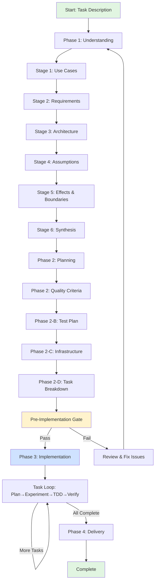

# Craft Session Guide: Your Knowledge Companion

## What This Document Is

Think of this as your memory and journal. If context gets compressed or you lose track of where you are, this document helps you reconstruct your understanding of the journey. It's not just a map of where you've been - it's a record of what you've learned and why.

## The Story So Far

**How We Began**
[This section grows as we progress through stages]

We started with an epic or task description, seeking to understand what needs to be built. As we explore each stage, we build deeper understanding, and this story expands to reflect our growing knowledge.

**What We've Learned:**
- Stage 1 taught us: [key insight about use cases - filled in when confirmed]
- Stage 2 revealed: [key insight about NFRs - filled in when confirmed]
- Stage 3 showed us: [key insight about architecture - filled in when confirmed]
- Stage 4 clarified: [key insight about assumptions - filled in when confirmed]
- Stage 5 helped us see: [key insight about effects - filled in when confirmed]
- Stage 6 synthesized: [key insight from integration - filled in when confirmed]

**User's Guidance Along the Way:**
[Record key feedback and corrections the user provided]

## Current Session State

**Visual Workflow Map**



**DIRECTIVE: Update this chart when workflow changes**
- Add/remove stages or phases as they evolve
- Highlight current position with `style CurrentNode fill:#ffcccc`
- Update connections if dependencies or gates change
- Keep visual representation synchronized with actual progress

**Overall Progress Tracking**

**Completion Metrics:**
- **Phase 1 (Understanding)**: [X/6 stages confirmed] = [Y%]
  * Stage 1 - Use Cases: [Confirmed / In Progress / Not Started]
  * Stage 2 - Requirements: [Confirmed / In Progress / Not Started]
  * Stage 3 - Architecture: [Confirmed / In Progress / Not Started]
  * Stage 4 - Assumptions: [Confirmed / In Progress / Not Started]
  * Stage 5 - Effects & Boundaries: [Confirmed / In Progress / Not Started]
  * Stage 6 - Synthesis: [Confirmed / In Progress / Not Started]

- **Phase 2 (Planning)**: [X/4 sub-phases complete] = [Y%]
  * Phase 2: Quality Criteria: [Confirmed / In Progress / Not Started]
  * Phase 2-B: Test Plan: [Confirmed / In Progress / Not Started]
  * Phase 2-C: Infrastructure: [Confirmed / In Progress / Not Started]
  * Phase 2-D: Task Breakdown: [Confirmed / In Progress / Not Started]

- **Phase 3 (Implementation)**: [X/N tasks complete] = [Y%]
  * Tasks in planning/tasks-pending/: [count]
  * Tasks in planning/tasks-completed/: [count]
  * Current task: task-NNN-[name].md
  * Tests passing: [X/N] = [Y%]

- **Phase 4 (Delivery)**: [Not Started]
  * Validation checklist: [0/5 items]

**Overall Session Progress**: [X%]

**Time Tracking:**
- **Session started**: [ISO timestamp]
- **Time in Phase 1**: [X hours Y minutes]
- **Time in Phase 2**: [X hours Y minutes]
- **Time in Phase 3**: [X hours Y minutes]
- **Total elapsed**: [X hours Y minutes]
- **Estimated completion**: [timestamp or "unknown"]

**Phase & Stage Tracking:**
- **Current Phase:** [Phase 1 / Phase 2 / Phase 2-B / Phase 2-C / Phase 2-D / Phase 3 / Phase 4]
- **Current Stage/Step:** [Stage N / Planning Step / Task Loop Step / Delivery Step]
- **Status:** [In Progress / Awaiting User Confirmation / Blocked / Complete]
- **Last Updated:** [ISO timestamp]

**Active Files Being Worked On:**
- Primary: `<WT>/planning/[filename]` - [brief status]
- Secondary: `<WT>/planning/[filename]` - [brief status]

**Next Action Required:**
[Clear description of what needs to happen next - user review, agent work, iteration, etc.]

**Blockers or Open Questions:**
[List any items preventing progress or needing clarification]

**Velocity Metrics** (Phase 3 only):
- Tasks completed per hour: [X tasks/hr]
- Average task completion time: [X minutes]
- Estimated time remaining: [X hours Y minutes]

---

## Phase/Stage Transition Log

This section records every transition between phases and stages with timestamps and confirmations.

**Template for Each Transition:**
```
### [Phase/Stage Name] → [Next Phase/Stage Name]
- **Timestamp:** [ISO 8601 timestamp]
- **Triggered By:** [User confirmation / Quality gate passed / Task completion]
- **Exit Criteria Met:** [Yes/No - specific criteria that were satisfied]
- **Key Outputs Created:** [List of files created or updated]
- **User Confirmation:** [Quote or summary of user's approval/feedback]
- **Notes:** [Any special circumstances or decisions made during transition]
```

**Transition History:**
[This section grows with each phase/stage transition - most recent first]

---

## Current State of Understanding

**Where We Are Right Now:**
Check the most recent knowledge file to see which phase we're working on:
- `<WT>/planning/use-cases.md` → Understanding who will use this and what they'll do (Phase 1 Stage 1)
- `<WT>/planning/requirements.md` → Understanding quality and functional requirements (Phase 1 Stage 2)
- `<WT>/planning/architecture.md` → Understanding the existing landscape and how this fits (Phase 1 Stage 3)
- `<WT>/planning/assumptions.md` → Making our assumptions explicit and validating them (Phase 1 Stage 4)
- `<WT>/planning/effects-boundaries.md` → Understanding ripple effects and what we won't do (Phase 1 Stage 5)
- `<WT>/planning/task-definition.md` → Bringing everything together into shared understanding (Phase 1 Stage 6)

If we're past Phase 1 (all stages confirmed):
- `<WT>/planning/quality-criteria.md` exists → We've defined how to measure success (Phase 2)
- `<WT>/planning/test-plan.md` exists → We've designed our test strategy (Phase 2-B)
- `<WT>/planning/infrastructure-ids.md` exists → We've identified infrastructure needs (Phase 2-C)
- `<WT>/planning/tasks-pending/task-*.md` exist → We've broken down work into tasks (Phase 2-D)
- `<WT>/planning/tasks-completed/task-*.md` exist → We're executing and completing tasks (Phase 3)
- `<WT>/planning/learnings.md` exists → We're capturing insights from completed tasks (Phase 3)

**Latest Confirmed Knowledge:**
Look for "CONFIRMED" markers in knowledge files to see what's been validated.

**Phase/Stage Journals:**
Check journal files (p<N>- prefix) to see the exploration process:
- `<WT>/planning/p1-stage1-journal.md` through `p1-stage6-journal.md` → Phase 1 stage exploration
- `<WT>/planning/p2-planning-journal.md` → Phase 2 planning process
- `<WT>/planning/p2b-test-design-journal.md` → Phase 2-B test design thinking
- `<WT>/planning/p2c-infra-planning-journal.md` → Phase 2-C infrastructure planning
- `<WT>/planning/p2d-task-breakdown-journal.md` → Phase 2-D task decomposition process

## Knowledge Checkpoints

These aren't just milestones - they're moments where understanding crystallized.

**Stage 1 - Use Cases: What Users Will Experience**
- **Knowledge Files:**
  * `<WT>/planning/use-cases.md` (primary + related use cases, anti-cases, interactions)
  * `<WT>/planning/p1-stage-1-disambiguation.md` (terminology clarifications)
  * `<WT>/planning/p1-stage-1-research.md` (technical context, dependencies, actors, external services)
  * `<WT>/planning/p1-stage-1-constraints.md` (contradictions resolved, constraints identified)
- **Journal File:** `<WT>/planning/p1-stage1-journal.md` (exploration process)
- Confirmed: [date/time stamp when user confirmed]
- **Disambiguation**: [Key terms clarified, acronyms expanded, scope boundaries defined]
- **Research Findings**: [Dependencies discovered, external services mapped, actors identified, implied requirements]
- **Constraints Resolved**: [Contradictions found and how resolved - with user decision]
- **Use Cases**: [N primary + M related use cases, P anti-cases]
- **Interactions**: [Key dependency chains, concurrent flows, shared sub-flows]
- Core insight: [the key thing we learned about user needs and technical context]
- What surprised us: [unexpected discoveries about domain, conflicts, or user journeys]
- User's clarifications: [important feedback they provided during disambiguation and constraint resolution]
- This shaped our understanding by: [how research and constraint resolution influenced our mental model]

**Stage 2 - Requirements: What Quality Means Here**
- **Knowledge File:** `<WT>/planning/requirements.md` (functional + non-functional with research)
- **Journal File:** `<WT>/planning/p1-stage2-journal.md` (requirements discovery)
- Confirmed: [date/time]
- **Requirements Research**: [Quality attributes researched, domain standards consulted, gaps identified]
- **Functional Requirements**: [N functional requirements derived from use cases]
- **Non-Functional Requirements**: [M NFRs across performance, security, scalability, reliability, compliance, usability, maintainability, operational]
- **Traceability**: [Use cases → FRs, Anti-cases → Security/Reliability NFRs]
- **Priorities**: [Must-have count, should-have count, nice-to-have count]
- Core insight: [key learning about constraints and quality attributes from research]
- Trade-offs identified: [competing concerns we need to balance]
- Gaps resolved: [User answers to requirement gaps]
- This constrained our options by: [how requirements research narrowed the solution space]

**Stage 3 - Architecture: How This Fits the World**
- **Knowledge File:** `<WT>/planning/architecture.md`
- **Tooling File:** `<WT>/planning/tooling.md` (discovery + integration)
- **Journal File:** `<WT>/planning/p1-stage3-journal.md` (research and decisions)
- Confirmed: [date/time]
- Core insight: [key learning about existing systems and integration]
- Patterns discovered: [what already exists that we can use or must work with]
- Tooling discovered: [MCP servers, subagents, APIs, quality tools found during discovery]
- **Quality Gate:** Verify architecture supports all use cases and requirements from Stages 1-2. If gaps found, iterate architecture or revise earlier stages.
- This revealed: [implications for our approach]
- **Reference**: See "Tooling Philosophy" section in craft.md for methodology used during discovery

**Stage 4 - Assumptions: What We Think We Know**
- **Knowledge File:** `<WT>/planning/assumptions.md`
- **Journal File:** `<WT>/planning/p1-stage4-journal.md` (validation activities)
- Confirmed: [date/time]
- Core insight: [key learning about our confidence and risks]
- Critical assumptions: [the ones that matter most]
- This exposed: [where we might be wrong]

**Stage 5 - Effects & Boundaries: Ripples and Limits**
- **Knowledge File:** `<WT>/planning/effects-boundaries.md`
- **Journal File:** `<WT>/planning/p1-stage5-journal.md` (effects analysis)
- Confirmed: [date/time]
- Core insight: [key learning about second-order effects]
- Boundaries set: [what we explicitly won't do]
- This protected us from: [scope creep or unintended consequences]

**Stage 6 - Synthesis: The Complete Picture**
- **Knowledge File:** `<WT>/planning/task-definition.md` (synthesized understanding)
- **Journal File:** `<WT>/planning/p1-stage6-journal.md` (synthesis process)
- Confirmed: [date/time]
- Core insight: [the integrated understanding]
- Complete task definition created: `<WT>/planning/task-definition.md`
- Ready for implementation: [yes/no and why]

## Decision History & Rationale

Understanding isn't just about what we decided - it's about why.

**Key Architectural Decisions:**
"We chose [approach] over [alternative] because [reasoning based on stages 1-3]."

**Scope Boundaries:**
"We explicitly decided not to [feature/approach] because [reasoning from stage 5]."

**Risk Acceptances:**
"We're accepting the risk that [assumption] might be wrong because [reasoning from stage 4]."

[This section expands as decisions are made and recorded]

## How to Progress Through This Journey

**The Progressive Understanding Philosophy:**
You're not marching through checklist items - you're building knowledge stage by stage. Each stage reveals something new, and sometimes what you learn forces you to revisit earlier understanding. That's natural and healthy.

**At Each Stage:**
1. **Ground yourself**: Read previous stage files to remember what you know
2. **Explore deeply**: Don't rush to answers - think about the questions
3. **Document reasoning**: Capture not just conclusions but why you reached them
4. **Present understanding**: Share discoveries with the user, invite their insight
5. **Iterate on feedback**: Their perspective may reveal what you missed
6. **Confirm before proceeding**: Only move forward when the layer is truly understood

**If You Discover Something That Changes Earlier Stages:**
This is learning, not failure. Explicitly acknowledge: "What I just learned in Stage X means Stage Y needs revision because [reason]." Revert to the earlier stage, update it with new understanding, get confirmation, then proceed forward again.

**Trust the Process:**
Six stages might seem like a lot, but each one adds crucial understanding. Rushing through them means building on a shaky foundation. Taking time here saves massive rework during implementation.

## Material Changes: When to Jump Back

Sometimes user feedback reveals a **material change** - feedback that fundamentally contradicts or invalidates decisions from earlier confirmed phases/stages. When this happens, we need to decide whether to jump back and re-execute affected work, or document the alternative and continue forward.

**Detect Material Changes by asking:**
1. **Does this contradict a confirmed stage?** - User says "actually, external customers need access" when Stage 1 assumed internal-only
2. **Would this require re-architecting?** - Feedback assumes GraphQL when Stage 3 decided on REST
3. **Would this invalidate planning decisions?** - New actor type requires different data models, APIs, security
4. **Would this require significant refactoring?** - Implementation approach based on invalidated assumptions

**Material vs Non-Material Examples:**

**Material Changes** (require jump-back consideration):
- "Wait, this needs to work for external customers too" → Stage 1 actors changed
- "I thought we'd use GraphQL, but you've assumed REST" → Stage 3 architecture invalidated
- "This needs real-time updates, not polling" → Stage 3 integration pattern wrong
- "Actually this is for mobile, not desktop" → Requirements and UI assumptions invalid

**Non-Material Changes** (continue forward):
- "Can we add a tooltip here?" → UI refinement, not fundamental change
- "Let's use blue instead of green" → Aesthetic choice
- "Can we add logging to this function?" → Enhancement, doesn't change core behavior
- "This error message should be clearer" → Improvement, not architectural change

**When Material Change Detected:**

**Present consequences clearly:**
```
MATERIAL CHANGE DETECTED

Your feedback indicates a fundamental change to [Stage/Phase X].

If we make this change now, we'll need to:
- Revisit: [affected stages/phases]
- Update: [affected planning artifacts]
- Refactor: [completed implementation work if any]
- Re-execute: [subsequent phases that built on invalidated assumptions]

Estimated rework: [X hours/days]

Options:
1. Jump back now and make the change (recommended if timeline allows)
2. Document as future enhancement and continue with current approach
3. Let me think about it (explain more consequences)

What would you like to do?
```

**If user confirms jump-back:**
1. **Update GUIDE.md** with jump-back rationale:
   ```markdown
   ## [Date] - Jump Back: [Current Phase] → [Target Stage]

   **Reason:** [User feedback that revealed material change]

   **What Changed:** [Specific contradiction or invalidated assumption]

   **Affected Work:**
   - Stages to revisit: [list]
   - Planning artifacts to update: [list]
   - Implementation to refactor: [list]
   ```

2. **Revert to affected stage**: Re-read the stage's knowledge file, update with new information, re-confirm with user
3. **Progress forward again**: Move through subsequent stages, checking for cascading changes
4. **Resume from where jump-back triggered**: Return to the phase/stage that detected the material change

## Remember

- **Understanding before implementation:** The deeper you understand, the better you build.
- **Iteration is strength:** Revisiting decisions with new insights is growth, not failure.
- **Quality gates protect you:** They catch gaps before they become costly mistakes.
- **The user is your partner:** When uncertain, ask. Their domain knowledge is irreplaceable.
- **Trust the process:** Each stage builds on the last. The structure exists to help you think clearly.

The code will come easier when the understanding is clear. Take the time to understand deeply.
