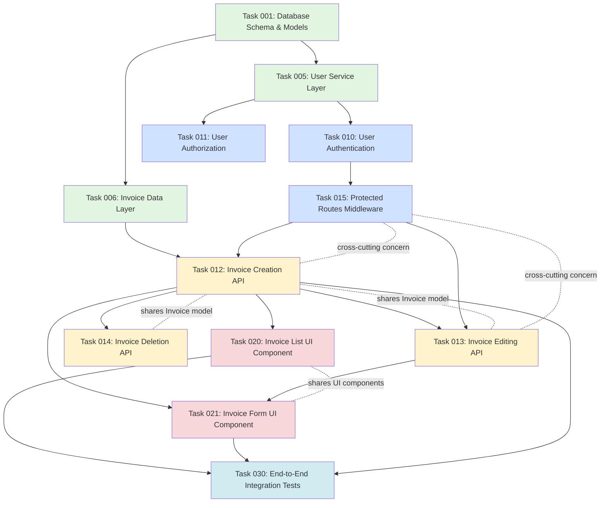

# Implementation Steps & Feature Dependencies

**Purpose:** Complete implementation plan combining visual dependency map with phased execution order. This ensures proper sequencing, reveals integration points, and enables parallel work where possible.

## Visual Feature Dependency Map

**DIRECTIVE: Update this chart as features are added, dependencies change, or tasks are completed**

**Legend:**
- **Solid arrows (→):** Hard dependency - target requires source to be complete
- **Dotted lines (-.->):** Related features - share data models, UI, APIs, or cross-cutting concerns
- **Colors:** Indicate phase groupings (see sections below)

**Chart Update Rules:**
- When task added: Insert node in appropriate phase group, draw dependencies
- When dependency discovered: Add arrow from prerequisite to dependent task
- When relationship found: Add dotted line with label describing relationship
- When task completed: Consider adding styling `style T001 stroke:#28a745,stroke-width:3px`

## Phase 1: Foundation (Tasks 001-009)

**Goal:** Establish core data structures, models, and base utilities

**Tasks:**
- Task 001: Database Schema & Models (no dependencies)
- Task 005: User Service Layer (depends on: Task 001)
- Task 006: Invoice Data Layer (depends on: Task 001)

**Exit Criteria:** Core models tested and validated, utilities available for use

**Rationale:** Foundation must exist before building features that depend on it. Database schema changes are expensive later.
